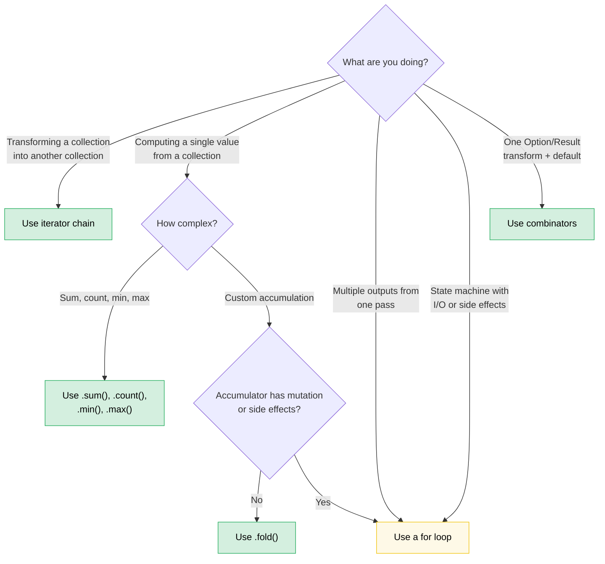

# 8. Functional vs. Imperative: When Elegance Wins (and When It Doesn't)

> **Difficulty:** 🟡 Intermediate | **Time:** 2–3 hours | **Prerequisites:** [Ch 7 — Closures](ch07-closures-and-higher-order-functions.md)

Rust gives you genuine parity between functional and imperative styles. Unlike Haskell (functional by fiat) or C (imperative by default), Rust lets you choose — and the right choice depends on what you're expressing. This chapter builds the judgment to pick well.

**The core principle:** Functional style shines when you're *transforming data through a pipeline*. Imperative style shines when you're *managing state transitions with side effects*. Most real code has both, and the skill is knowing where the boundary falls.

---

## 8.1 The Combinator You Didn't Know You Wanted

Many Rust developers write this:

```rust
let value = if let Some(x) = maybe_config() {
    x
} else {
    default_config()
};
process(value);
```

When they could write this:

```rust
process(maybe_config().unwrap_or_else(default_config));
```

Or this common pattern:

```rust
let display_name = if let Some(name) = user.nickname() {
    name.to_uppercase()
} else {
    "ANONYMOUS".to_string()
};
```

Which is:

```rust
let display_name = user.nickname()
    .map(|n| n.to_uppercase())
    .unwrap_or_else(|| "ANONYMOUS".to_string());
```

The functional version isn't just shorter — it tells you *what* is happening (transform, then default) without making you trace control flow. The `if let` version makes you read the branches to figure out that both paths end up in the same place.

### The Option combinator family

Here's the mental model: `Option<T>` is a one-element-or-empty collection. Every combinator on `Option` has an analogy to a collection operation.

| You write... | Instead of... | What it communicates |
|---|---|---|
| `opt.unwrap_or(default)` | `if let Some(x) = opt { x } else { default }` | "Use this value or fall back" |
| `opt.unwrap_or_else(\|\| expensive())` | `if let Some(x) = opt { x } else { expensive() }` | Same, but default is lazy |
| `opt.map(f)` | `match opt { Some(x) => Some(f(x)), None => None }` | "Transform the inside, propagate absence" |
| `opt.and_then(f)` | `match opt { Some(x) => f(x), None => None }` | "Chain fallible operations" (flatmap) |
| `opt.filter(\|x\| pred(x))` | `match opt { Some(x) if pred(&x) => Some(x), _ => None }` | "Keep only if it passes" |
| `opt.zip(other)` | `if let (Some(a), Some(b)) = (opt, other) { Some((a,b)) } else { None }` | "Both or neither" |
| `opt.or(fallback)` | `if opt.is_some() { opt } else { fallback }` | "First available" |
| `opt.or_else(\|\| try_another())` | `if opt.is_some() { opt } else { try_another() }` | "Try alternatives in order" |
| `opt.map_or(default, f)` | `if let Some(x) = opt { f(x) } else { default }` | "Transform or default" — one-liner |
| `opt.map_or_else(default_fn, f)` | `if let Some(x) = opt { f(x) } else { default_fn() }` | Same, both sides are closures |
| `opt?` | `match opt { Some(x) => x, None => return None }` | "Propagate absence upward" |

### The Result combinator family

The same pattern applies to `Result<T, E>`:

| You write... | Instead of... | What it communicates |
|---|---|---|
| `res.map(f)` | `match res { Ok(x) => Ok(f(x)), Err(e) => Err(e) }` | Transform the success path |
| `res.map_err(f)` | `match res { Ok(x) => Ok(x), Err(e) => Err(f(e)) }` | Transform the error |
| `res.and_then(f)` | `match res { Ok(x) => f(x), Err(e) => Err(e) }` | Chain fallible operations |
| `res.unwrap_or_else(\|e\| default(e))` | `match res { Ok(x) => x, Err(e) => default(e) }` | Recover from error |
| `res.ok()` | `match res { Ok(x) => Some(x), Err(_) => None }` | "I don't care about the error" |
| `res?` | `match res { Ok(x) => x, Err(e) => return Err(e.into()) }` | Propagate errors upward |

### When `if let` IS better

The combinators lose when:

- **You need multiple statements in the `Some` branch.** A map closure with 5 lines is worse than an `if let` with 5 lines.
- **The control flow is the point.** `if let Some(connection) = pool.try_get() { /* use it */ } else { /* log, retry, alert */ }` — the two branches are genuinely different code paths, not a transform-or-default.
- **Side effects dominate.** If both branches do I/O with different error handling, the combinator version obscures the important differences.

**Rule of thumb:** If the `else` branch produces the *same type* as the `Some` branch and the bodies are short expressions, use a combinator. If the branches do fundamentally different things, use `if let` or `match`.

---

## 8.2 Bool Combinators: `.then()` and `.then_some()`

Another pattern that's more common than it should be:

```rust
let label = if is_admin {
    Some("ADMIN")
} else {
    None
};
```

Rust 1.62+ gives you:

```rust
let label = is_admin.then_some("ADMIN");
```

Or with a computed value:

```rust
let permissions = is_admin.then(|| compute_admin_permissions());
```

This is especially powerful in chains:

```rust
// Imperative
let mut tags = Vec::new();
if user.is_admin { tags.push("admin"); }
if user.is_verified { tags.push("verified"); }
if user.score > 100 { tags.push("power-user"); }

// Functional
let tags: Vec<&str> = [
    user.is_admin.then_some("admin"),
    user.is_verified.then_some("verified"),
    (user.score > 100).then_some("power-user"),
]
.into_iter()
.flatten()
.collect();
```

The functional version makes the pattern explicit: "build a list from conditional elements." The imperative version makes you read each `if` to confirm they all do the same thing (push a tag).

---

## 8.3 Iterator Chains vs. Loops: The Decision Framework

Ch 7 showed the mechanics. This section builds the judgment.

### When iterators win

**Data pipelines** — transforming a collection through a series of steps:

```rust
// Imperative: 8 lines, 2 mutable variables
let mut results = Vec::new();
for item in inventory {
    if item.category == Category::Server {
        if let Some(temp) = item.last_temperature() {
            if temp > 80.0 {
                results.push((item.id, temp));
            }
        }
    }
}

// Functional: 6 lines, 0 mutable variables, one pipeline
let results: Vec<_> = inventory.iter()
    .filter(|item| item.category == Category::Server)
    .filter_map(|item| item.last_temperature().map(|t| (item.id, t)))
    .filter(|(_, temp)| *temp > 80.0)
    .collect();
```

The functional version wins because:
- Each filter is independently readable
- No `mut` — the data flows in one direction
- You can add/remove/reorder pipeline stages without restructuring
- LLVM inlines iterator adapters to the same machine code as the loop

**Aggregation** — computing a single value from a collection:

```rust
// Imperative
let mut total_power = 0.0;
let mut count = 0;
for server in fleet {
    total_power += server.power_draw();
    count += 1;
}
let avg = total_power / count as f64;

// Functional
let (total_power, count) = fleet.iter()
    .map(|s| s.power_draw())
    .fold((0.0, 0usize), |(sum, n), p| (sum + p, n + 1));
let avg = total_power / count as f64;
```

Or even simpler if you just need the sum:

```rust
let total: f64 = fleet.iter().map(|s| s.power_draw()).sum();
```

### When loops win

**Early exit with complex state:**

```rust
// This is clear and direct
let mut best_candidate = None;
for server in fleet {
    let score = evaluate(server);
    if score > threshold {
        if server.is_available() {
            best_candidate = Some(server);
            break; // Found one — stop immediately
        }
    }
}

// The functional version is strained
let best_candidate = fleet.iter()
    .filter(|s| evaluate(s) > threshold)
    .find(|s| s.is_available());
```

Wait — that functional version is actually pretty clean. Let's try a case where it genuinely loses:

**Building multiple outputs simultaneously:**

```rust
// Imperative: clear, each branch does something different
let mut warnings = Vec::new();
let mut errors = Vec::new();
let mut stats = Stats::default();

for event in log_stream {
    match event.severity {
        Severity::Warn => {
            warnings.push(event.clone());
            stats.warn_count += 1;
        }
        Severity::Error => {
            errors.push(event.clone());
            stats.error_count += 1;
            if event.is_critical() {
                alert_oncall(&event);
            }
        }
        _ => stats.other_count += 1,
    }
}

// Functional version: forced, awkward, nobody wants to read this
let (warnings, errors, stats) = log_stream.iter().fold(
    (Vec::new(), Vec::new(), Stats::default()),
    |(mut w, mut e, mut s), event| {
        match event.severity {
            Severity::Warn => { w.push(event.clone()); s.warn_count += 1; }
            Severity::Error => {
                e.push(event.clone()); s.error_count += 1;
                if event.is_critical() { alert_oncall(event); }
            }
            _ => s.other_count += 1,
        }
        (w, e, s)
    },
);
```

The fold version is *longer*, *harder to read*, and has mutation anyway (the `mut` deconstructed accumulators). The loop wins because:
- Multiple outputs being built in parallel
- Side effects (alerting) mixed into the logic
- Branch bodies are statements, not expressions

**State machines with I/O:**

```rust
// A parser that reads tokens — the loop IS the algorithm
let mut state = ParseState::Start;
loop {
    let token = lexer.next_token()?;
    state = match state {
        ParseState::Start => match token {
            Token::Keyword(k) => ParseState::GotKeyword(k),
            Token::Eof => break,
            _ => return Err(ParseError::UnexpectedToken(token)),
        },
        ParseState::GotKeyword(k) => match token {
            Token::Ident(name) => ParseState::GotName(k, name),
            _ => return Err(ParseError::ExpectedIdentifier),
        },
        // ...more states
    };
}
```

No functional equivalent is cleaner. The loop with `match state` is the natural expression of a state machine.

### The decision flowchart



### Sidebar: Scoped mutability — imperative inside, functional outside

Rust blocks are expressions. This lets you confine mutation to a construction phase and
bind the result immutably:

```rust
use rand::random;

let samples = {
    let mut buf = Vec::with_capacity(10);
    while buf.len() < 10 {
        let reading: f64 = random();
        buf.push(reading);
        if random::<u8>() % 3 == 0 { break; } // randomly stop early
    }
    buf
};
// samples is immutable — contains between 1 and 10 elements
```

The inner `buf` is mutable only inside the block. Once the block yields, the outer binding
`samples` is immutable and the compiler will reject any later `samples.push(...)`.

**Why not an iterator chain?** You might try:

```rust
let samples: Vec<f64> = std::iter::from_fn(|| Some(random()))
    .take(10)
    .take_while(|_| random::<u8>() % 3 != 0)
    .collect();
```

But `take_while` *excludes* the element that fails the predicate, producing anywhere from
zero to nine elements instead of the guaranteed-at-least-one the imperative version provides. You can work around it with `scan` or `chain`, but the imperative version
is clearer.

**When scoped mutability genuinely wins:**

| Scenario | Why iterators struggle |
|---|---|
| **Sort-then-freeze** (`sort_unstable()` + `dedup()`) | Both return `()` — no chainable output (itertools offers `.sorted().dedup()` if available) |
| **Stateful termination** (stop on a condition unrelated to the data) | `take_while` drops the boundary element |
| **Multi-step struct population** (field-by-field from different sources) | No natural single pipeline |

**Honest calibration:** For most collection-building tasks, iterator chains or
[itertools](https://docs.rs/itertools) are preferred. Reach for scoped mutability when the
construction logic has branching, early exit, or in-place mutation that doesn't map to a
single pipeline. The pattern's real value is teaching that *mutation scope can be smaller
than variable lifetime* — a Rust fundamental that surprises developers coming from
C++, C#, and Python.

---

## 8.4 The `?` Operator: Where Functional Meets Imperative

The `?` operator is Rust's most elegant synthesis of both styles. It's essentially `.and_then()` combined with early return:

```rust
// This chain of and_then...
fn load_config() -> Result<Config, Error> {
    read_file("config.toml")
        .and_then(|contents| parse_toml(&contents))
        .and_then(|table| validate_config(table))
        .and_then(|valid| Config::from_validated(valid))
}

// ...is exactly equivalent to this
fn load_config() -> Result<Config, Error> {
    let contents = read_file("config.toml")?;
    let table = parse_toml(&contents)?;
    let valid = validate_config(table)?;
    Config::from_validated(valid)
}
```

Both are functional in spirit (they propagate errors automatically) but the `?` version gives you named intermediate variables, which matter when:

- You need to use `contents` again later
- You want to add `.context("while parsing config")?` per step
- You're debugging and want to inspect intermediate values

**The anti-pattern:** long `.and_then()` chains when `?` is available. If every closure in the chain is `|x| next_step(x)`, you've reinvented `?` without the readability.

**When `.and_then()` IS better than `?`:**

```rust
// Transforming inside an Option, without early return
let port: Option<u16> = config.get("port")
    .and_then(|v| v.parse::<u16>().ok())
    .filter(|&p| p > 0 && p < 65535);
```

You can't use `?` here because there's no enclosing function to return from — you're building an `Option`, not propagating it.

---

## 8.5 Collection Building: `collect()` vs. Push Loops

`collect()` is more powerful than most developers realize:

### Collecting into a Result

```rust
// Imperative: parse a list, fail on first error
let mut numbers = Vec::new();
for s in input_strings {
    let n: i64 = s.parse().map_err(|_| Error::BadInput(s.clone()))?;
    numbers.push(n);
}

// Functional: collect into Result<Vec<_>, _>
let numbers: Vec<i64> = input_strings.iter()
    .map(|s| s.parse::<i64>().map_err(|_| Error::BadInput(s.clone())))
    .collect::<Result<_, _>>()?;
```

The `collect::<Result<Vec<_>, _>>()` trick works because `Result` implements `FromIterator`. It short-circuits on the first `Err`, just like the loop with `?`.

### Collecting into a HashMap

```rust
// Imperative
let mut index = HashMap::new();
for server in fleet {
    index.insert(server.id.clone(), server);
}

// Functional
let index: HashMap<_, _> = fleet.into_iter()
    .map(|s| (s.id.clone(), s))
    .collect();
```

### Collecting into a String

```rust
// Imperative
let mut csv = String::new();
for (i, field) in fields.iter().enumerate() {
    if i > 0 { csv.push(','); }
    csv.push_str(field);
}

// Functional
let csv = fields.join(",");

// Or for more complex formatting:
let csv: String = fields.iter()
    .map(|f| format!("\"{f}\""))
    .collect::<Vec<_>>()
    .join(",");
```

### When the loop version wins

`collect()` allocates a new collection. If you're *modifying in place*, the loop is both clearer and more efficient:

```rust
// In-place update — no functional equivalent that's better
for server in &mut fleet {
    if server.needs_refresh() {
        server.refresh_telemetry()?;
    }
}
```

The functional version would require `.iter_mut().for_each(|s| { ... })`, which is just a loop with extra syntax.

---

## 8.6 Pattern Matching as Function Dispatch

Rust's `match` is a functional construct that most developers use imperatively. Here's the functional lens:

### Match as a lookup table

```rust
// Imperative thinking: "check each case"
fn status_message(code: StatusCode) -> &'static str {
    if code == StatusCode::OK { "Success" }
    else if code == StatusCode::NOT_FOUND { "Not found" }
    else if code == StatusCode::INTERNAL { "Server error" }
    else { "Unknown" }
}

// Functional thinking: "map from domain to range"
fn status_message(code: StatusCode) -> &'static str {
    match code {
        StatusCode::OK => "Success",
        StatusCode::NOT_FOUND => "Not found",
        StatusCode::INTERNAL => "Server error",
        _ => "Unknown",
    }
}
```

The `match` version isn't just style — the compiler verifies exhaustiveness. Add a new variant, and every `match` that doesn't handle it becomes a compile error. The `if/else` chain silently falls through to the default.

### Match + destructuring as a pipeline

```rust
// Parsing a command — each arm extracts and transforms
fn execute(cmd: Command) -> Result<Response, Error> {
    match cmd {
        Command::Get { key } => db.get(&key).map(Response::Value),
        Command::Set { key, value } => db.set(key, value).map(|_| Response::Ok),
        Command::Delete { key } => db.delete(&key).map(|_| Response::Ok),
        Command::Batch(cmds) => cmds.into_iter()
            .map(execute)
            .collect::<Result<Vec<_>, _>>()
            .map(Response::Batch),
    }
}
```

Each arm is an expression that returns the same type. This is pattern matching as function dispatch — the `match` arms are essentially a function table indexed by the enum variant.

---

## 8.7 Chaining Methods on Custom Types

The functional style extends beyond standard library types. Builder patterns and fluent APIs are functional programming in disguise:

```rust
// This is a combinator chain over your own type
let query = QueryBuilder::new("servers")
    .filter("status", Eq, "active")
    .filter("rack", In, &["A1", "A2", "B1"])
    .order_by("temperature", Desc)
    .limit(50)
    .build();
```

**The key insight:** if your type has methods that take `self` and return `Self` (or a transformed type), you've built a combinator. The same functional/imperative judgment applies:

```rust
// Good: chainable because each step is a simple transform
let config = Config::default()
    .with_timeout(Duration::from_secs(30))
    .with_retries(3)
    .with_tls(true);

// Bad: chainable but the chain is doing too many unrelated things
let result = processor
    .load_data(path)?       // I/O
    .validate()             // Pure
    .transform(rule_set)    // Pure
    .save_to_disk(output)?  // I/O
    .notify_downstream()?;  // Side effect

// Better: separate the pure pipeline from the I/O bookends
let data = load_data(path)?;
let processed = data.validate().transform(rule_set);
save_to_disk(output, &processed)?;
notify_downstream()?;
```

The chain fails when it mixes pure transforms with I/O. The reader can't tell which calls might fail, which have side effects, and where the actual data transformations happen.

---

## 8.8 Performance: They're the Same

A common misconception: "functional style is slower because of all the closures and allocations."

In Rust, **iterator chains compile to the same machine code as hand-written loops.** LLVM inlines the closure calls, eliminates the iterator adapter structs, and often produces identical assembly. This is called *zero-cost abstraction* and it's not aspirational — it's measured.

```rust
// These produce identical assembly on release builds:

// Functional
let sum: i64 = (0..1000).filter(|n| n % 2 == 0).map(|n| n * n).sum();

// Imperative
let mut sum: i64 = 0;
for n in 0..1000 {
    if n % 2 == 0 {
        sum += n * n;
    }
}
```

**The one exception:** `.collect()` allocates. If you're chaining `.map().collect().iter().map().collect()` with intermediate collections, you're paying for allocations the loop version avoids. The fix: eliminate intermediate collects by chaining adapters directly, or use a loop if you need the intermediate collections for other reasons.

---

## 8.9 The Taste Test: A Catalog of Transformations

Here's a reference table for the most common "I wrote 6 lines but there's a one-liner" patterns:

| Imperative pattern | Functional equivalent | When to prefer functional |
|---|---|---|
| `if let Some(x) = opt { f(x) } else { default }` | `opt.map_or(default, f)` | Short expressions on both sides |
| `if let Some(x) = opt { Some(g(x)) } else { None }` | `opt.map(g)` | Always — this is what `map` is for |
| `if condition { Some(x) } else { None }` | `condition.then_some(x)` | Always |
| `if condition { Some(compute()) } else { None }` | `condition.then(compute)` | Always |
| `match opt { Some(x) if pred(x) => Some(x), _ => None }` | `opt.filter(pred)` | Always |
| `for x in iter { if pred(x) { result.push(f(x)); } }` | `iter.filter(pred).map(f).collect()` | When the pipeline is readable in one screen |
| `if a.is_some() && b.is_some() { Some((a?, b?)) }` | `a.zip(b)` | Always — `.zip()` is exactly this |
| `match (a, b) { (Some(x), Some(y)) => x + y, _ => 0 }` | `a.zip(b).map(\|(x,y)\| x + y).unwrap_or(0)` | Judgment call — depends on complexity |
| `iter.map(f).collect::<Vec<_>>()[0]` | `iter.map(f).next().unwrap()` | Don't allocate a Vec for one element |
| `let mut v = vec; v.sort(); v` | `{ let mut v = vec; v.sort(); v }` | Rust doesn't have a `.sorted()` in std (use itertools) |

---

## 8.10 The Anti-Patterns

### Over-functionalizing: the 5-deep chain nobody can read

```rust
// This is not elegant. This is a puzzle.
let result = data.iter()
    .filter_map(|x| x.metadata.as_ref())
    .flat_map(|m| m.tags.iter())
    .filter(|t| t.starts_with("env:"))
    .map(|t| t.strip_prefix("env:").unwrap())
    .filter(|env| allowed_envs.contains(env))
    .map(|env| env.to_uppercase())
    .collect::<HashSet<_>>()
    .into_iter()
    .sorted()
    .collect::<Vec<_>>();
```

When a chain exceeds ~4 adapters, break it up with named intermediate variables or extract a helper:

```rust
let env_tags = data.iter()
    .filter_map(|x| x.metadata.as_ref())
    .flat_map(|m| m.tags.iter());

let allowed: Vec<_> = env_tags
    .filter_map(|t| t.strip_prefix("env:"))
    .filter(|env| allowed_envs.contains(env))
    .map(|env| env.to_uppercase())
    .sorted()
    .collect();
```

### Under-functionalizing: the C-style loop that Rust has a word for

```rust
// This is just .any()
let mut found = false;
for item in &list {
    if item.is_expired() {
        found = true;
        break;
    }
}

// Write this instead
let found = list.iter().any(|item| item.is_expired());
```

```rust
// This is just .find()
let mut target = None;
for server in &fleet {
    if server.id == target_id {
        target = Some(server);
        break;
    }
}

// Write this instead
let target = fleet.iter().find(|s| s.id == target_id);
```

```rust
// This is just .all()
let mut all_healthy = true;
for server in &fleet {
    if !server.is_healthy() {
        all_healthy = false;
        break;
    }
}

// Write this instead
let all_healthy = fleet.iter().all(|s| s.is_healthy());
```

The standard library has these for a reason. Learn the vocabulary and the patterns become obvious.

---

## Key Takeaways

> - **Option and Result are one-element collections.** Their combinators (`.map()`, `.and_then()`, `.unwrap_or_else()`, `.filter()`, `.zip()`) replace most `if let` / `match` boilerplate.
> - **Use `bool::then_some()`** — it replaces `if cond { Some(x) } else { None }` in every case.
> - **Iterator chains win for data pipelines** — filter/map/collect with zero mutable state. They compile to the same machine code as loops.
> - **Loops win for multi-output state machines** — when you're building multiple collections, doing I/O in branches, or managing a state transition.
> - **The `?` operator is the best of both worlds** — functional error propagation with imperative readability.
> - **Break chains at ~4 adapters** — use named intermediates for readability. Over-functionalizing is as bad as under-functionalizing.
> - **Learn the standard-library vocabulary** — `.any()`, `.all()`, `.find()`, `.position()`, `.sum()`, `.min_by_key()` — each one replaces a multi-line loop with a single intent-revealing call.

> **See also:** [Ch 7](ch07-closures-and-higher-order-functions.md) for closure mechanics and the `Fn` trait hierarchy. [Ch 10](ch10-error-handling-patterns.md) for error combinator patterns. [Ch 15](ch15-crate-architecture-and-api-design.md) for fluent API design.

---

### Exercise: Refactoring Imperative to Functional ★★ (~30 min)

Refactor the following function from imperative to functional style. Then identify one place where the functional version is *worse* and explain why.

```rust
fn summarize_fleet(fleet: &[Server]) -> FleetSummary {
    let mut healthy = Vec::new();
    let mut degraded = Vec::new();
    let mut failed = Vec::new();
    let mut total_power = 0.0;
    let mut max_temp = f64::NEG_INFINITY;

    for server in fleet {
        match server.health_status() {
            Health::Healthy => healthy.push(server.id.clone()),
            Health::Degraded(reason) => degraded.push((server.id.clone(), reason)),
            Health::Failed(err) => failed.push((server.id.clone(), err)),
        }
        total_power += server.power_draw();
        if server.max_temperature() > max_temp {
            max_temp = server.max_temperature();
        }
    }

    FleetSummary {
        healthy,
        degraded,
        failed,
        avg_power: total_power / fleet.len() as f64,
        max_temp,
    }
}
```

<details>
<summary>🔑 Solution</summary>

The `total_power` and `max_temp` are clean functional rewrites:

```rust
fn summarize_fleet(fleet: &[Server]) -> FleetSummary {
    let avg_power: f64 = fleet.iter().map(|s| s.power_draw()).sum::<f64>()
        / fleet.len() as f64;

    let max_temp = fleet.iter()
        .map(|s| s.max_temperature())
        .fold(f64::NEG_INFINITY, f64::max);

    // But the three-way partition is BETTER as a loop.
    // Functional version would require three separate passes
    // or an awkward fold with three mutable accumulators.
    let mut healthy = Vec::new();
    let mut degraded = Vec::new();
    let mut failed = Vec::new();

    for server in fleet {
        match server.health_status() {
            Health::Healthy => healthy.push(server.id.clone()),
            Health::Degraded(reason) => degraded.push((server.id.clone(), reason)),
            Health::Failed(err) => failed.push((server.id.clone(), err)),
        }
    }

    FleetSummary { healthy, degraded, failed, avg_power, max_temp }
}
```

**Why the loop is better for the three-way partition:** A functional version would either require three `.filter().collect()` passes (3x iteration), or a `.fold()` with three `mut Vec` accumulators inside a tuple — which is just the loop rewritten with worse syntax. The imperative single-pass loop is clearer, more efficient, and easier to extend.

</details>

***
