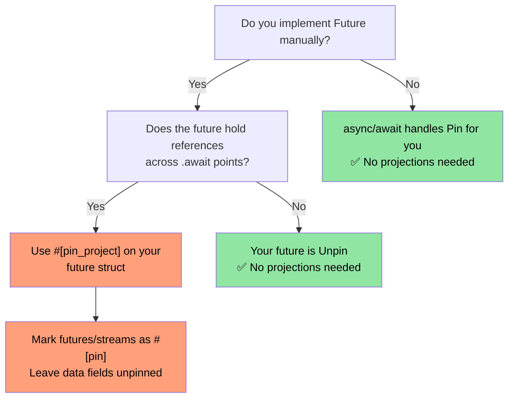
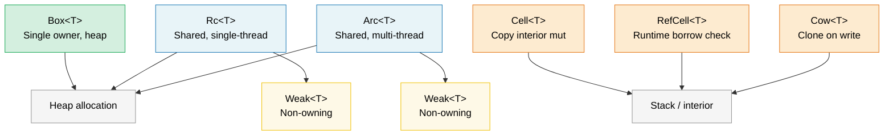

# 9. Smart Pointers and Interior Mutability 🟡

> **What you'll learn:**
> - Box, Rc, Arc for heap allocation and shared ownership
> - Weak references for breaking Rc/Arc reference cycles
> - Cell, RefCell, and Cow for interior mutability patterns
> - Pin for self-referential types and ManuallyDrop for lifecycle control

## Box, Rc, Arc — Heap Allocation and Sharing

```rust
// --- Box<T>: Single owner, heap allocation ---
// Use when: recursive types, large values, trait objects
let boxed: Box<i32> = Box::new(42);
println!("{}", *boxed); // Deref to i32

// Recursive type requires Box (otherwise infinite size):
enum List<T> {
    Cons(T, Box<List<T>>),
    Nil,
}

// Trait object (dynamic dispatch):
let writer: Box<dyn std::io::Write> = Box::new(std::io::stdout());

// --- Rc<T>: Multiple owners, single-threaded ---
// Use when: shared ownership within one thread (no Send/Sync)
use std::rc::Rc;

let a = Rc::new(vec![1, 2, 3]);
let b = Rc::clone(&a); // Increments reference count (NOT deep clone)
let c = Rc::clone(&a);
println!("Ref count: {}", Rc::strong_count(&a)); // 3

// All three point to the same Vec. When the last Rc is dropped,
// the Vec is deallocated.

// --- Arc<T>: Multiple owners, thread-safe ---
// Use when: shared ownership across threads
use std::sync::Arc;

let shared = Arc::new(String::from("shared data"));
let handles: Vec<_> = (0..5).map(|_| {
    let shared = Arc::clone(&shared);
    std::thread::spawn(move || println!("{shared}"))
}).collect();
for h in handles { h.join().unwrap(); }
```

### Weak References — Breaking Reference Cycles

`Rc` and `Arc` use reference counting, which cannot free cycles (A → B → A).
`Weak<T>` is a non-owning handle that does **not** increment the strong count:

```rust
use std::rc::{Rc, Weak};
use std::cell::RefCell;

struct Node {
    value: i32,
    parent: RefCell<Weak<Node>>,   // does NOT keep parent alive
    children: RefCell<Vec<Rc<Node>>>,
}

let parent = Rc::new(Node {
    value: 0, parent: RefCell::new(Weak::new()), children: RefCell::new(vec![]),
});
let child = Rc::new(Node {
    value: 1, parent: RefCell::new(Rc::downgrade(&parent)), children: RefCell::new(vec![]),
});
parent.children.borrow_mut().push(Rc::clone(&child));

// Access parent from child — returns Option<Rc<Node>>:
if let Some(p) = child.parent.borrow().upgrade() {
    println!("Child's parent value: {}", p.value); // 0
}
// When `parent` is dropped, strong_count → 0, memory is freed.
// `child.parent.upgrade()` would then return `None`.
```

**Rule of thumb**: Use `Rc`/`Arc` for ownership edges, `Weak` for back-references
and caches. For thread-safe code, use `Arc<T>` with `sync::Weak<T>`.

### Cell and RefCell — Interior Mutability

Sometimes you need to mutate data behind a shared (`&`) reference. Rust provides *interior mutability* with runtime borrow checking:

```rust
use std::cell::{Cell, RefCell};

// --- Cell<T>: Copy-based interior mutability ---
// Only for Copy types (or types you swap in/out)
struct Counter {
    count: Cell<u32>,
}

impl Counter {
    fn new() -> Self { Counter { count: Cell::new(0) } }

    fn increment(&self) { // &self, not &mut self!
        self.count.set(self.count.get() + 1);
    }

    fn value(&self) -> u32 { self.count.get() }
}

// --- RefCell<T>: Runtime borrow checking ---
// Panics if you violate borrow rules at runtime
struct Cache {
    data: RefCell<Vec<String>>,
}

impl Cache {
    fn new() -> Self { Cache { data: RefCell::new(Vec::new()) } }

    fn add(&self, item: String) { // &self — looks immutable from outside
        self.data.borrow_mut().push(item); // Runtime-checked &mut
    }

    fn get_all(&self) -> Vec<String> {
        self.data.borrow().clone() // Runtime-checked &
    }

    fn bad_example(&self) {
        let _guard1 = self.data.borrow();
        // let _guard2 = self.data.borrow_mut();
        // ❌ PANICS at runtime — can't have &mut while & exists
    }
}
```

> **Cell vs RefCell**: `Cell` never panics (it copies/swaps values) but only
> works with `Copy` types or via `swap()`/`replace()`. `RefCell` works with any
> type but panics on double-mutable-borrow. Neither is `Sync` — for multithreaded
> use, see `Mutex`/`RwLock`.

### Cow — Clone on Write

`Cow` (Clone on Write) holds either a borrowed or owned value. It clones *only* when mutation is needed:

```rust
use std::borrow::Cow;

// Avoids allocating when no modification is needed:
fn normalize(input: &str) -> Cow<'_, str> {
    if input.contains('\t') {
        // Only allocate if tabs need replacing
        Cow::Owned(input.replace('\t', "    "))
    } else {
        // No allocation — just return a reference
        Cow::Borrowed(input)
    }
}

fn main() {
    let clean = "no tabs here";
    let dirty = "tabs\there";

    let r1 = normalize(clean); // Cow::Borrowed — zero allocation
    let r2 = normalize(dirty); // Cow::Owned — allocated new String

    println!("{r1}");
    println!("{r2}");
}

// Also useful for function parameters that MIGHT need ownership:
fn process(data: Cow<'_, [u8]>) {
    // Can read data without copying
    println!("Length: {}", data.len());
    // If we need to mutate, Cow auto-clones:
    let mut owned = data.into_owned(); // Clone only if Borrowed
    owned.push(0xFF);
}
```

#### `Cow<'_, [u8]>` for Binary Data

`Cow` is especially useful for byte-oriented APIs where data may or may not
need transformation (checksum insertion, padding, escaping). This avoids
allocating a `Vec<u8>` on the common fast path:

```rust
use std::borrow::Cow;

/// Pads a frame to a minimum length, borrowing when no padding is needed.
fn pad_frame(frame: &[u8], min_len: usize) -> Cow<'_, [u8]> {
    if frame.len() >= min_len {
        Cow::Borrowed(frame)  // Already long enough — zero allocation
    } else {
        let mut padded = frame.to_vec();
        padded.resize(min_len, 0x00);
        Cow::Owned(padded)    // Allocate only when padding is required
    }
}

let short = pad_frame(&[0xDE, 0xAD], 8);    // Owned — padded to 8 bytes
let long  = pad_frame(&[0; 64], 8);          // Borrowed — already ≥ 8
```

> **Tip**: Combine `Cow<[u8]>` with `bytes::Bytes` (Ch10) when you need
> reference-counted sharing of potentially-transformed buffers.

### When to Use Which Pointer

| Pointer | Owner Count | Thread-Safe | Mutability | Use When |
|---------|:-----------:|:-----------:|:----------:|----------|
| `Box<T>` | 1 | ✅ (if T: Send) | Via `&mut` | Heap allocation, trait objects, recursive types |
| `Rc<T>` | N | ❌ | None (wrap in Cell/RefCell) | Shared ownership, single thread, graphs/trees |
| `Arc<T>` | N | ✅ | None (wrap in Mutex/RwLock) | Shared ownership across threads |
| `Cell<T>` | — | ❌ | `.get()` / `.set()` | Interior mutability for Copy types |
| `RefCell<T>` | — | ❌ | `.borrow()` / `.borrow_mut()` | Interior mutability for any type, single thread |
| `Cow<'_, T>` | 0 or 1 | ✅ (if T: Send) | Clone on write | Avoid allocation when data is often unchanged |

### Pin and Self-Referential Types

`Pin<P>` prevents a value from being moved in memory. This is essential for
**self-referential types** — structs that contain a pointer to their own data —
and for `Future`s, which may hold references across `.await` points.

```rust
use std::pin::Pin;
use std::marker::PhantomPinned;

// A self-referential struct (simplified):
struct SelfRef {
    data: String,
    ptr: *const String, // Points to `data` above
    _pin: PhantomPinned, // Opts out of Unpin — can't be moved
}

impl SelfRef {
    fn new(s: &str) -> Pin<Box<Self>> {
        let val = SelfRef {
            data: s.to_string(),
            ptr: std::ptr::null(),
            _pin: PhantomPinned,
        };
        let mut boxed = Box::pin(val);

        // SAFETY: we don't move the data after setting the pointer
        let self_ptr: *const String = &boxed.data;
        unsafe {
            let mut_ref = Pin::as_mut(&mut boxed);
            Pin::get_unchecked_mut(mut_ref).ptr = self_ptr;
        }
        boxed
    }

    fn data(&self) -> &str {
        &self.data
    }

    fn ptr_data(&self) -> &str {
        // SAFETY: ptr was set to point to self.data while pinned
        unsafe { &*self.ptr }
    }
}

fn main() {
    let pinned = SelfRef::new("hello");
    assert_eq!(pinned.data(), pinned.ptr_data()); // Both "hello"
    // std::mem::swap would invalidate ptr — but Pin prevents it
}
```

**Key concepts**:

| Concept | Meaning |
|---------|--------|
| `Unpin` (auto-trait) | "Moving this type is safe." Most types are `Unpin` by default. |
| `!Unpin` / `PhantomPinned` | "I have internal pointers — don't move me." |
| `Pin<&mut T>` | A mutable reference that guarantees `T` won't move |
| `Pin<Box<T>>` | An owned, heap-pinned value |

**Why this matters for async**: Every `async fn` desugars to a `Future` that may
hold references across `.await` points — making it self-referential. The async
runtime uses `Pin<&mut Future>` to guarantee the future isn't moved once polled.

```rust
// When you write:
async fn fetch(url: &str) -> String {
    let response = http_get(url).await; // reference held across await
    response.text().await
}

// The compiler generates a state machine struct that is !Unpin,
// and the runtime pins it before calling Future::poll().
```

> **When to care about Pin**: (1) Implementing `Future` manually, (2) writing
> async runtimes or combinators, (3) any struct with self-referential pointers.
> For normal application code, `async/await` handles pinning transparently.
> See the companion *Async Rust Training* for deeper coverage.
>
> **Crate alternatives**: For self-referential structs without manual `Pin`,
> consider [`ouroboros`](https://crates.io/crates/ouroboros) or
> [`self_cell`](https://crates.io/crates/self_cell) — they generate safe
> wrappers with correct pinning and drop semantics.

### Pin Projections — Structural Pinning

When you have a `Pin<&mut MyStruct>`, you often need to access individual fields.
**Pin projection** is the pattern for safely going from `Pin<&mut Struct>` to
`Pin<&mut Field>` (for pinned fields) or `&mut Field` (for unpinned fields).

#### The Problem: Field Access on Pinned Types

```rust
use std::pin::Pin;
use std::marker::PhantomPinned;

struct MyFuture {
    data: String,              // Regular field — safe to move
    state: InternalState,      // Self-referential — must stay pinned
    _pin: PhantomPinned,
}

enum InternalState {
    Waiting { ptr: *const String }, // Points to `data` — self-referential
    Done,
}

// Given `Pin<&mut MyFuture>`, how do you access `data` and `state`?
// You CAN'T just do `pinned.data` — the compiler won't let you
// get a &mut to a field of a pinned value without unsafe.
```

#### Manual Pin Projection (unsafe)

```rust
impl MyFuture {
    // Project to `data` — this field is structurally unpinned (safe to move)
    fn data(self: Pin<&mut Self>) -> &mut String {
        // SAFETY: `data` is not structurally pinned. Moving `data` alone
        // doesn't move the whole struct, so Pin's guarantee is preserved.
        unsafe { &mut self.get_unchecked_mut().data }
    }

    // Project to `state` — this field IS structurally pinned
    fn state(self: Pin<&mut Self>) -> Pin<&mut InternalState> {
        // SAFETY: `state` is structurally pinned — we maintain the
        // pin invariant by returning Pin<&mut InternalState>.
        unsafe { Pin::new_unchecked(&mut self.get_unchecked_mut().state) }
    }
}
```

**Structural pinning rules** — a field is "structurally pinned" if:
1. Moving/swapping that field alone could invalidate a self-reference
2. The struct's `Drop` impl must not move the field
3. The struct must be `!Unpin` (enforced by `PhantomPinned` or a `!Unpin` field)

#### `pin-project` — Safe Pin Projections (Zero Unsafe)

The `pin-project` crate generates provably correct projections at compile time,
eliminating the need for manual `unsafe`:

```rust
use pin_project::pin_project;
use std::pin::Pin;
use std::future::Future;
use std::task::{Context, Poll};

#[pin_project]                   // <-- Generates projection methods
struct TimedFuture<F: Future> {
    #[pin]                       // <-- Structurally pinned (it's a Future)
    inner: F,
    started_at: std::time::Instant, // NOT pinned — plain data
}

impl<F: Future> Future for TimedFuture<F> {
    type Output = (F::Output, std::time::Duration);

    fn poll(self: Pin<&mut Self>, cx: &mut Context<'_>) -> Poll<Self::Output> {
        let this = self.project();  // Safe! Generated by pin_project
        //   this.inner   : Pin<&mut F>              — pinned field
        //   this.started_at : &mut std::time::Instant — unpinned field

        match this.inner.poll(cx) {
            Poll::Ready(output) => {
                let elapsed = this.started_at.elapsed();
                Poll::Ready((output, elapsed))
            }
            Poll::Pending => Poll::Pending,
        }
    }
}
```

#### `pin-project` vs Manual Projection

| Aspect | Manual (`unsafe`) | `pin-project` |
|--------|-------------------|---------------|
| Safety | You prove invariants | Compiler-verified |
| Boilerplate | Low (but error-prone) | Zero — derive macro |
| `Drop` interaction | Must not move pinned fields | Enforced: `#[pinned_drop]` |
| Compile-time cost | None | Proc-macro expansion |
| Use case | Primitives, `no_std` | Application / library code |

#### `#[pinned_drop]` — Drop for Pinned Types

When a type has `#[pin]` fields, `pin-project` requires `#[pinned_drop]`
instead of a regular `Drop` impl to prevent accidentally moving pinned fields:

```rust
use pin_project::{pin_project, pinned_drop};
use std::pin::Pin;

#[pin_project(PinnedDrop)]
struct Connection<F> {
    #[pin]
    future: F,
    buffer: Vec<u8>,  // Not pinned — can be moved in drop
}

#[pinned_drop]
impl<F> PinnedDrop for Connection<F> {
    fn drop(self: Pin<&mut Self>) {
        let this = self.project();
        // `this.future` is Pin<&mut F> — can't be moved, only dropped in place
        // `this.buffer` is &mut Vec<u8> — can be drained, cleared, etc.
        this.buffer.clear();
        println!("Connection dropped, buffer cleared");
    }
}
```

#### When Pin Projections Matter in Practice

> **Note**: The diagram below uses Mermaid syntax. It renders on GitHub and in
> tools that support Mermaid (mdBook with `mermaid` plugin, VS Code with
> Mermaid extension). In plain Markdown viewers, you'll see the raw source.



> **Rule of thumb**: If you're wrapping another `Future` or `Stream`, use
> `pin-project`. If you're writing application code with `async/await`, you'll
> never need pin projections directly. See the companion
> *Async Rust Training* for async combinator patterns that use pin projections.

### Drop Ordering and ManuallyDrop

Rust's drop order is deterministic but has rules worth knowing:

#### Drop Order Rules

```rust
struct Label(&'static str);

impl Drop for Label {
    fn drop(&mut self) { println!("Dropping {}", self.0); }
}

fn main() {
    let a = Label("first");   // Declared first
    let b = Label("second");  // Declared second
    let c = Label("third");   // Declared third
}
// Output:
//   Dropping third    ← locals drop in REVERSE declaration order
//   Dropping second
//   Dropping first
```

**The three rules**:

| What | Drop Order | Rationale |
|------|-----------|----------|
| **Local variables** | Reverse declaration order | Later variables might reference earlier ones |
| **Struct fields** | Declaration order (top to bottom) | Matches construction order (stable since Rust 1.0, guaranteed by [RFC 1857](https://rust-lang.github.io/rfcs/1857-stabilize-drop-order.html)) |
| **Tuple elements** | Declaration order (left to right) | `(a, b, c)` → drop `a`, then `b`, then `c` |

```rust
struct Server {
    listener: Label,  // Dropped 1st
    handler: Label,   // Dropped 2nd
    logger: Label,    // Dropped 3rd
}
// Fields drop top-to-bottom (declaration order).
// This matters when fields reference each other or hold resources.
```

> **Practical impact**: If your struct has a `JoinHandle` and a `Sender`,
> field order determines which drops first. If the thread reads from the
> channel, drop the `Sender` first (close the channel) so the thread exits,
> then join the handle. Put `Sender` above `JoinHandle` in the struct.

#### `ManuallyDrop<T>` — Suppressing Automatic Drop

`ManuallyDrop<T>` wraps a value and prevents its destructor from running
automatically. You take responsibility for dropping it (or intentionally
leaking it):

```rust
use std::mem::ManuallyDrop;

// Use case 1: Prevent double-free in unsafe code
struct TwoPhaseBuffer {
    // We need to drop the Vec ourselves to control timing
    data: ManuallyDrop<Vec<u8>>,
    committed: bool,
}

impl TwoPhaseBuffer {
    fn new(capacity: usize) -> Self {
        TwoPhaseBuffer {
            data: ManuallyDrop::new(Vec::with_capacity(capacity)),
            committed: false,
        }
    }

    fn write(&mut self, bytes: &[u8]) {
        self.data.extend_from_slice(bytes);
    }

    fn commit(&mut self) {
        self.committed = true;
        println!("Committed {} bytes", self.data.len());
    }
}

impl Drop for TwoPhaseBuffer {
    fn drop(&mut self) {
        if !self.committed {
            println!("Rolling back — dropping uncommitted data");
        }
        // SAFETY: data is always valid here; we only drop it once.
        unsafe { ManuallyDrop::drop(&mut self.data); }
    }
}
```

```rust
// Use case 2: Intentional leak (e.g., global singletons)
fn leaked_string() -> &'static str {
    // Box::leak() is the idiomatic way to create a &'static reference:
    let s = String::from("lives forever");
    Box::leak(s.into_boxed_str())
    // ⚠️ This is a controlled memory leak. The String's heap allocation
    // is never freed. Only use for long-lived singletons.
}

// ManuallyDrop alternative (requires unsafe):
// ⚠️ Prefer Box::leak() above — this is shown only to illustrate
// ManuallyDrop semantics (suppressing Drop while the heap data survives).
fn leaked_string_manual() -> &'static str {
    use std::mem::ManuallyDrop;
    let md = ManuallyDrop::new(String::from("lives forever"));
    // SAFETY: ManuallyDrop prevents deallocation; the heap data lives
    // forever, so a 'static reference is valid.
    unsafe { &*(md.as_str() as *const str) }
}
```

```rust
// Use case 3: Union fields (only one variant is valid at a time)
use std::mem::ManuallyDrop;

union IntOrString {
    i: u64,
    s: ManuallyDrop<String>,
    // String has a Drop impl, so it MUST be wrapped in ManuallyDrop
    // inside a union — the compiler can't know which field is active.
}

// No automatic Drop — the code that constructs IntOrString must also
// handle cleanup. If the String variant is active, call:
//   unsafe { ManuallyDrop::drop(&mut value.s); }
// without a Drop impl, the union is simply leaked (no UB, just a leak).
```

**ManuallyDrop vs `mem::forget`**:

| | `ManuallyDrop<T>` | `mem::forget(value)` |
|---|---|---|
| When | Wrap at construction | Consume later |
| Access inner | `&*md` / `&mut *md` | Value is gone |
| Drop later | `ManuallyDrop::drop(&mut md)` | Not possible |
| Use case | Fine-grained lifecycle control | Fire-and-forget leak |

> **Rule**: Use `ManuallyDrop` in unsafe abstractions where you need to control
> *exactly* when a destructor runs. In safe application code, you almost never
> need it — Rust's automatic drop ordering handles things correctly.

> **Key Takeaways — Smart Pointers**
> - `Box` for single ownership on heap; `Rc`/`Arc` for shared ownership (single-/multi-threaded)
> - `Cell`/`RefCell` provide interior mutability; `RefCell` panics on violations at runtime
> - `Cow` avoids allocation on the common path; `Pin` prevents moves for self-referential types
> - Drop order: fields drop in declaration order (RFC 1857); locals drop in reverse declaration order

> **See also:** [Ch 6 — Concurrency](ch06-concurrency-vs-parallelism-vs-threads.md) for Arc + Mutex patterns. [Ch 4 — PhantomData](ch04-phantomdata-types-that-carry-no-data.md) for PhantomData used with smart pointers.



---

### Exercise: Reference-Counted Graph ★★ (~30 min)

Build a directed graph using `Rc<RefCell<Node>>` where each node has a name and a list of children. Create a cycle (A → B → C → A) using `Weak` to break the back-edge. Verify no memory leak with `Rc::strong_count`.

<details>
<summary>🔑 Solution</summary>

```rust
use std::cell::RefCell;
use std::rc::{Rc, Weak};

struct Node {
    name: String,
    children: Vec<Rc<RefCell<Node>>>,
    back_ref: Option<Weak<RefCell<Node>>>,
}

impl Node {
    fn new(name: &str) -> Rc<RefCell<Self>> {
        Rc::new(RefCell::new(Node {
            name: name.to_string(),
            children: Vec::new(),
            back_ref: None,
        }))
    }
}

impl Drop for Node {
    fn drop(&mut self) {
        println!("Dropping {}", self.name);
    }
}

fn main() {
    let a = Node::new("A");
    let b = Node::new("B");
    let c = Node::new("C");

    // A → B → C, with C back-referencing A via Weak
    a.borrow_mut().children.push(Rc::clone(&b));
    b.borrow_mut().children.push(Rc::clone(&c));
    c.borrow_mut().back_ref = Some(Rc::downgrade(&a)); // Weak ref!

    println!("A strong count: {}", Rc::strong_count(&a)); // 1 (only `a` binding)
    println!("B strong count: {}", Rc::strong_count(&b)); // 2 (b + A's child)
    println!("C strong count: {}", Rc::strong_count(&c)); // 2 (c + B's child)

    // Upgrade the weak ref to prove it works:
    let c_ref = c.borrow();
    if let Some(back) = &c_ref.back_ref {
        if let Some(a_ref) = back.upgrade() {
            println!("C points back to: {}", a_ref.borrow().name);
        }
    }
    // When a, b, c go out of scope, all Nodes drop (no cycle leak!)
}
```

</details>

***

