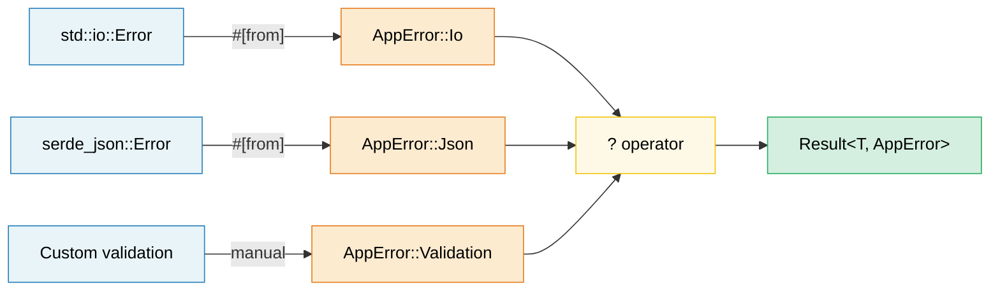

# 10. Error Handling Patterns 🟢

> **What you'll learn:**
> - When to use `thiserror` (libraries) vs `anyhow` (applications)
> - Error conversion chains with `#[from]` and `.context()` wrappers
> - How the `?` operator desugars and works in `main()`
> - When to panic vs return errors, and `catch_unwind` for FFI boundaries

## thiserror vs anyhow — Library vs Application

Rust error handling centers on the `Result<T, E>` type. Two crates dominate:

```rust,ignore
// --- thiserror: For LIBRARIES ---
// Generates Display, Error, and From impls via derive macros
use thiserror::Error;

#[derive(Error, Debug)]
pub enum DatabaseError {
    #[error("connection failed: {0}")]
    ConnectionFailed(String),

    #[error("query error: {source}")]
    QueryError {
        #[source]
        source: sqlx::Error,
    },

    #[error("record not found: table={table} id={id}")]
    NotFound { table: String, id: u64 },

    #[error(transparent)] // Delegate Display to the inner error
    Io(#[from] std::io::Error), // Auto-generates From<io::Error>
}

// --- anyhow: For APPLICATIONS ---
// Dynamic error type — great for top-level code where you just want errors to propagate
use anyhow::{Context, Result, bail, ensure};

fn read_config(path: &str) -> Result<Config> {
    let content = std::fs::read_to_string(path)
        .with_context(|| format!("failed to read config from {path}"))?;

    let config: Config = serde_json::from_str(&content)
        .context("failed to parse config JSON")?;

    ensure!(config.port > 0, "port must be positive, got {}", config.port);

    Ok(config)
}

fn main() -> Result<()> {
    let config = read_config("server.toml")?;

    if config.name.is_empty() {
        bail!("server name cannot be empty"); // Return Err immediately
    }

    Ok(())
}
```

**When to use which**:

| | `thiserror` | `anyhow` |
|---|---|---|
| **Use in** | Libraries, shared crates | Applications, binaries |
| **Error types** | Concrete enums — callers can match | `anyhow::Error` — opaque |
| **Effort** | Define your error enum | Just use `Result<T>` |
| **Downcasting** | Not needed — pattern match | `error.downcast_ref::<MyError>()` |

### Error Conversion Chains (#[from])

```rust,ignore
use thiserror::Error;

#[derive(Error, Debug)]
enum AppError {
    #[error("I/O error: {0}")]
    Io(#[from] std::io::Error),

    #[error("JSON error: {0}")]
    Json(#[from] serde_json::Error),

    #[error("HTTP error: {0}")]
    Http(#[from] reqwest::Error),
}

// Now ? automatically converts:
fn fetch_and_parse(url: &str) -> Result<Config, AppError> {
    let body = reqwest::blocking::get(url)?.text()?;  // reqwest::Error → AppError::Http
    let config: Config = serde_json::from_str(&body)?; // serde_json::Error → AppError::Json
    Ok(config)
}
```

### Context and Error Wrapping

Add human-readable context to errors without losing the original:

```rust,ignore
use anyhow::{Context, Result};

fn process_file(path: &str) -> Result<Data> {
    let content = std::fs::read_to_string(path)
        .with_context(|| format!("failed to read {path}"))?;

    let data = parse_content(&content)
        .with_context(|| format!("failed to parse {path}"))?;

    validate(&data)
        .context("validation failed")?;

    Ok(data)
}

// Error output:
// Error: validation failed
//
// Caused by:
//    0: failed to parse config.json
//    1: expected ',' at line 5 column 12
```

### The ? Operator in Depth

`?` is syntactic sugar for a `match` + `From` conversion + early return:

```rust
// This:
let value = operation()?;

// Desugars to:
let value = match operation() {
    Ok(v) => v,
    Err(e) => return Err(From::from(e)),
    //                  ^^^^^^^^^^^^^^
    //                  Automatic conversion via From trait
};
```

**`?` also works with `Option`** (in functions returning `Option`):

```rust
fn find_user_email(users: &[User], name: &str) -> Option<String> {
    let user = users.iter().find(|u| u.name == name)?; // Returns None if not found
    let email = user.email.as_ref()?; // Returns None if email is None
    Some(email.to_uppercase())
}
```

### Panics, catch_unwind, and When to Abort

```rust
// Panics: for BUGS, not expected errors
fn get_element(data: &[i32], index: usize) -> &i32 {
    // If this panics, it's a programming error (bug).
    // Don't "handle" it — fix the caller.
    &data[index]
}

// catch_unwind: for boundaries (FFI, thread pools)
use std::panic;

let result = panic::catch_unwind(|| {
    // Run potentially panicking code safely
    risky_operation()
});

match result {
    Ok(value) => println!("Success: {value:?}"),
    Err(_) => eprintln!("Operation panicked — continuing safely"),
}

// When to use which:
// - Result<T, E> → expected failures (file not found, network timeout)
// - panic!()     → programming bugs (index out of bounds, invariant violated)
// - process::abort() → unrecoverable state (security violation, corrupt data)
```

> **C++ comparison**: `Result<T, E>` replaces exceptions for expected errors.
> `panic!()` is like `assert()` or `std::terminate()` — it's for bugs, not
> control flow. Rust's `?` operator makes error propagation as ergonomic as
> exceptions without the unpredictable control flow.

> **Key Takeaways — Error Handling**
> - Libraries: `thiserror` for structured error enums; applications: `anyhow` for ergonomic propagation
> - `#[from]` auto-generates `From` impls; `.context()` adds human-readable wrappers
> - `?` desugars to `From::from()` + early return; works in `main()` returning `Result`

> **See also:** [Ch 14 — API Design](ch15-crate-architecture-and-api-design.md) for "parse, don't validate" patterns. [Ch 10 — Serialization](ch11-serialization-zero-copy-and-binary-data.md) for serde error handling.



---

### Exercise: Error Hierarchy with thiserror ★★ (~30 min)

Design an error type hierarchy for a file-processing application that can fail during I/O, parsing (JSON and CSV), and validation. Use `thiserror` and demonstrate `?` propagation.

<details>
<summary>🔑 Solution</summary>

```rust,ignore
use thiserror::Error;

#[derive(Error, Debug)]
pub enum AppError {
    #[error("I/O error: {0}")]
    Io(#[from] std::io::Error),

    #[error("JSON parse error: {0}")]
    Json(#[from] serde_json::Error),

    #[error("CSV error at line {line}: {message}")]
    Csv { line: usize, message: String },

    #[error("validation error: {field} — {reason}")]
    Validation { field: String, reason: String },
}

fn read_file(path: &str) -> Result<String, AppError> {
    Ok(std::fs::read_to_string(path)?) // io::Error → AppError::Io via #[from]
}

fn parse_json(content: &str) -> Result<serde_json::Value, AppError> {
    Ok(serde_json::from_str(content)?) // serde_json::Error → AppError::Json
}

fn validate_name(value: &serde_json::Value) -> Result<String, AppError> {
    let name = value.get("name")
        .and_then(|v| v.as_str())
        .ok_or_else(|| AppError::Validation {
            field: "name".into(),
            reason: "must be a non-null string".into(),
        })?;

    if name.is_empty() {
        return Err(AppError::Validation {
            field: "name".into(),
            reason: "must not be empty".into(),
        });
    }

    Ok(name.to_string())
}

fn process_file(path: &str) -> Result<String, AppError> {
    let content = read_file(path)?;
    let json = parse_json(&content)?;
    let name = validate_name(&json)?;
    Ok(name)
}

fn main() {
    match process_file("config.json") {
        Ok(name) => println!("Name: {name}"),
        Err(e) => eprintln!("Error: {e}"),
    }
}
```

</details>

***

