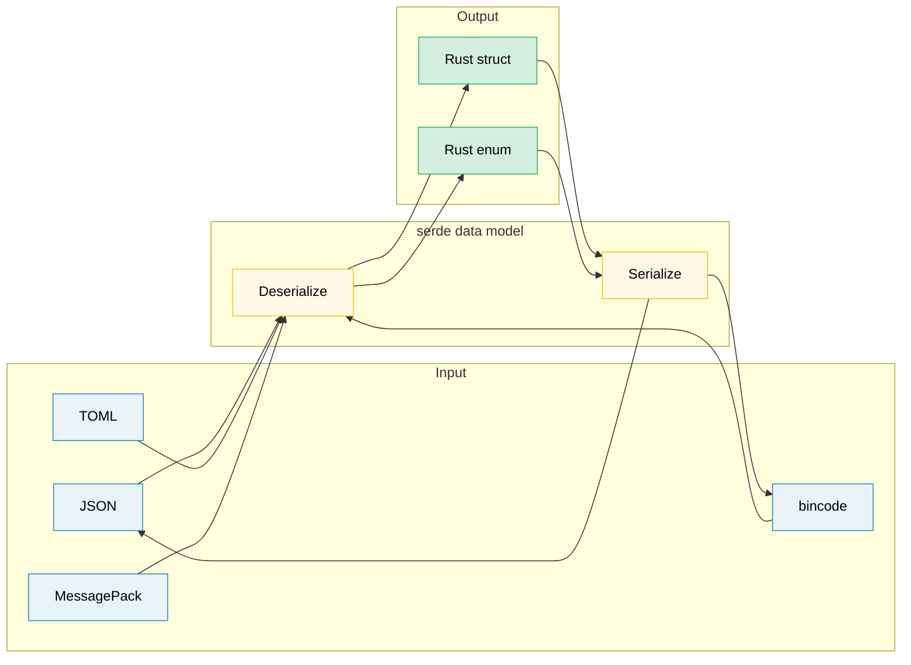

# 11. Serialization, Zero-Copy, and Binary Data 🟡

> **What you'll learn:**
> - serde fundamentals: derive macros, attributes, and enum representations
> - Zero-copy deserialization for high-performance read-heavy workloads
> - The serde format ecosystem (JSON, TOML, bincode, MessagePack)
> - Binary data handling with `repr(C)`, zerocopy, and `bytes::Bytes`

## serde Fundamentals

`serde` (SERialize/DEserialize) is the universal serialization framework for Rust.
It separates **data model** (your structs) from **format** (JSON, TOML, binary):

```rust,ignore
use serde::{Serialize, Deserialize};

#[derive(Debug, Serialize, Deserialize)]
struct ServerConfig {
    name: String,
    port: u16,
    #[serde(default)]                    // Use Default::default() if missing
    max_connections: usize,
    #[serde(skip_serializing_if = "Option::is_none")]
    tls_cert_path: Option<String>,
}

fn main() -> Result<(), Box<dyn std::error::Error>> {
    // Deserialize from JSON:
    let json_input = r#"{
        "name": "hw-diag",
        "port": 8080
    }"#;
    let config: ServerConfig = serde_json::from_str(json_input)?;
    println!("{config:?}");
    // ServerConfig { name: "hw-diag", port: 8080, max_connections: 0, tls_cert_path: None }

    // Serialize to JSON:
    let output = serde_json::to_string_pretty(&config)?;
    println!("{output}");

    // Same struct, different format — no code changes:
    let toml_input = r#"
        name = "hw-diag"
        port = 8080
    "#;
    let config: ServerConfig = toml::from_str(toml_input)?;
    println!("{config:?}");

    Ok(())
}
```

> **Key insight**: Your struct derives `Serialize` and `Deserialize` once.
> Then it works with *every* serde-compatible format — JSON, TOML, YAML,
> bincode, MessagePack, CBOR, postcard, and dozens more.

### Common serde Attributes

serde provides fine-grained control over serialization through field and container attributes:

```rust,ignore
use serde::{Serialize, Deserialize};

// --- Container attributes (on the struct/enum) ---
#[derive(Serialize, Deserialize)]
#[serde(rename_all = "camelCase")]       // JSON convention: field_name → fieldName
#[serde(deny_unknown_fields)]            // Reject extra keys — strict parsing
struct DiagResult {
    test_name: String,                   // Serialized as "testName"
    pass_count: u32,                     // Serialized as "passCount"
    fail_count: u32,                     // Serialized as "failCount"
}

// --- Field attributes ---
#[derive(Serialize, Deserialize)]
struct Sensor {
    #[serde(rename = "sensor_id")]       // Override field name for serialization
    id: u64,

    #[serde(default)]                    // Use Default if missing from input
    enabled: bool,

    #[serde(default = "default_threshold")]
    threshold: f64,

    #[serde(skip)]                       // Never serialize or deserialize
    cached_value: Option<f64>,

    #[serde(skip_serializing_if = "Vec::is_empty")]
    tags: Vec<String>,

    #[serde(flatten)]                    // Inline nested struct fields
    metadata: Metadata,

    #[serde(with = "hex_bytes")]         // Custom ser/de module
    raw_data: Vec<u8>,
}

fn default_threshold() -> f64 { 1.0 }

#[derive(Serialize, Deserialize)]
struct Metadata {
    vendor: String,
    model: String,
}
// With #[serde(flatten)], the JSON looks like:
// { "sensor_id": 1, "vendor": "Intel", "model": "X200", ... }
// NOT: { "sensor_id": 1, "metadata": { "vendor": "Intel", ... } }
```

**Most-used attributes cheat sheet**:

| Attribute | Level | Effect |
|-----------|-------|--------|
| `rename_all = "camelCase"` | Container | Rename all fields to camelCase/snake_case/SCREAMING_SNAKE_CASE |
| `deny_unknown_fields` | Container | Error on unexpected keys (strict mode) |
| `default` | Field | Use `Default::default()` when field missing |
| `rename = "..."` | Field | Custom serialized name |
| `skip` | Field | Exclude from ser/de entirely |
| `skip_serializing_if = "fn"` | Field | Conditionally exclude (e.g., `Option::is_none`) |
| `flatten` | Field | Inline a nested struct's fields |
| `with = "module"` | Field | Use custom serialize/deserialize functions |
| `alias = "..."` | Field | Accept alternative names during deserialization |
| `deserialize_with = "fn"` | Field | Custom deserialize function only |
| `untagged` | Enum | Try each variant in order (no discriminant in output) |

### Enum Representations

serde provides four representations for enums in formats like JSON:

```rust,ignore
use serde::{Serialize, Deserialize};

// 1. Externally tagged (DEFAULT):
#[derive(Serialize, Deserialize)]
enum Command {
    Reboot,
    RunDiag { test_name: String, timeout_secs: u64 },
    SetFanSpeed(u8),
}
// "Reboot"                                          → Command::Reboot
// {"RunDiag": {"test_name": "gpu", "timeout_secs": 60}}  → Command::RunDiag { ... }

// 2. Internally tagged — #[serde(tag = "type")]:
#[derive(Serialize, Deserialize)]
#[serde(tag = "type")]
enum Event {
    Start { timestamp: u64 },
    Error { code: i32, message: String },
    End   { timestamp: u64, success: bool },
}
// {"type": "Start", "timestamp": 1706000000}
// {"type": "Error", "code": 42, "message": "timeout"}

// 3. Adjacently tagged — #[serde(tag = "t", content = "c")]:
#[derive(Serialize, Deserialize)]
#[serde(tag = "t", content = "c")]
enum Payload {
    Text(String),
    Binary(Vec<u8>),
}
// {"t": "Text", "c": "hello"}
// {"t": "Binary", "c": [0, 1, 2]}

// 4. Untagged — #[serde(untagged)]:
#[derive(Serialize, Deserialize)]
#[serde(untagged)]
enum StringOrNumber {
    Str(String),
    Num(f64),
}
// "hello" → StringOrNumber::Str("hello")
// 42.0    → StringOrNumber::Num(42.0)
// ⚠️ Tried IN ORDER — first matching variant wins
```

> **Which representation to choose**: Use internally tagged (`tag = "type"`)
> for most JSON APIs — it's the most readable and matches conventions in
> Go, Python, and TypeScript. Use untagged only for "union" types where the
> shape alone disambiguates.

### Zero-Copy Deserialization

serde can deserialize without allocating new strings — borrowing directly from
the input buffer. This is the key to high-performance parsing:

```rust,ignore
use serde::Deserialize;

// --- Owned (allocating) ---
// Each String field copies bytes from the input into new heap allocations.
#[derive(Deserialize)]
struct OwnedRecord {
    name: String,           // Allocates a new String
    value: String,          // Allocates another String
}

// --- Zero-copy (borrowing) ---
// &'de str fields borrow directly from the input — ZERO allocation.
#[derive(Deserialize)]
struct BorrowedRecord<'a> {
    name: &'a str,          // Points into the input buffer
    value: &'a str,         // Points into the input buffer
}

fn main() {
    let input = r#"{"name": "cpu_temp", "value": "72.5"}"#;

    // Owned: allocates two String objects
    let owned: OwnedRecord = serde_json::from_str(input).unwrap();

    // Zero-copy: `name` and `value` point into `input` — no allocation
    let borrowed: BorrowedRecord = serde_json::from_str(input).unwrap();

    // The output is lifetime-bound: borrowed can't outlive input
    println!("{}: {}", borrowed.name, borrowed.value);
}
```

**Understanding the lifetime**:

```rust,ignore
// Deserialize<'de> — the struct can borrow from data with lifetime 'de:
//   struct BorrowedRecord<'a> where 'a == 'de
//   Only works when the input buffer lives long enough

// DeserializeOwned — the struct owns all its data, no borrowing:
//   trait DeserializeOwned: for<'de> Deserialize<'de> {}
//   Works with any input lifetime (the struct is independent)

use serde::de::DeserializeOwned;

// This function requires owned types — input can be temporary
fn parse_owned<T: DeserializeOwned>(input: &str) -> T {
    serde_json::from_str(input).unwrap()
}

// This function allows borrowing — more efficient but restricts lifetimes
fn parse_borrowed<'a, T: Deserialize<'a>>(input: &'a str) -> T {
    serde_json::from_str(input).unwrap()
}
```

**When to use zero-copy**:
- Parsing large files where you only need a few fields
- High-throughput pipelines (network packets, log lines)
- When the input buffer already lives long enough (e.g., memory-mapped file)

**When NOT to use zero-copy**:
- Input is ephemeral (network read buffer that's reused)
- You need to store the result beyond the input's lifetime
- Fields need transformation (escapes, normalization)

> **Practical tip**: `Cow<'a, str>` gives you the best of both — borrow when
> possible, allocate when necessary (e.g., when JSON escape sequences need
> unescaping). serde supports Cow natively.

### The Format Ecosystem

| Format | Crate | Human-Readable | Size | Speed | Use Case |
|--------|-------|:--------------:|:----:|:-----:|----------|
| JSON | `serde_json` | ✅ | Large | Good | Config files, REST APIs, logging |
| TOML | `toml` | ✅ | Medium | Good | Config files (Cargo.toml style) |
| YAML | `serde_yaml` | ✅ | Medium | Good | Config files (complex nesting) |
| bincode | `bincode` | ❌ | Small | Fast | IPC, caches, Rust-to-Rust |
| postcard | `postcard` | ❌ | Tiny | Very fast | Embedded systems, `no_std` |
| MessagePack | `rmp-serde` | ❌ | Small | Fast | Cross-language binary protocol |
| CBOR | `ciborium` | ❌ | Small | Fast | IoT, constrained environments |

```rust
// Same struct, many formats — serde's power:

#[derive(serde::Serialize, serde::Deserialize, Debug)]
struct DiagConfig {
    name: String,
    tests: Vec<String>,
    timeout_secs: u64,
}

let config = DiagConfig {
    name: "accel_diag".into(),
    tests: vec!["memory".into(), "compute".into()],
    timeout_secs: 300,
};

// JSON:   {"name":"accel_diag","tests":["memory","compute"],"timeout_secs":300}
let json = serde_json::to_string(&config).unwrap();       // 67 bytes

// bincode: compact binary — ~40 bytes, no field names
let bin = bincode::serialize(&config).unwrap();            // Much smaller

// postcard: even smaller, varint encoding — great for embedded
// let post = postcard::to_allocvec(&config).unwrap();
```

> **Choose your format**:
> - Config files humans edit → TOML or JSON
> - Rust-to-Rust IPC/caching → bincode (fast, compact, not cross-language)
> - Cross-language binary → MessagePack or CBOR
> - Embedded / `no_std` → postcard

### Binary Data and repr(C)

For hardware diagnostics, parsing binary protocol data is common. Rust provides
tools for safe, zero-copy binary data handling:

```rust
// --- #[repr(C)]: Predictable memory layout ---
// Ensures fields are laid out in declaration order with C padding rules.
// Essential for matching hardware register layouts and protocol headers.

#[repr(C)]
#[derive(Debug, Clone, Copy)]
struct IpmiHeader {
    rs_addr: u8,
    net_fn_lun: u8,
    checksum: u8,
    rq_addr: u8,
    rq_seq_lun: u8,
    cmd: u8,
}

// --- Safe binary parsing with manual deserialization ---
impl IpmiHeader {
    fn from_bytes(data: &[u8]) -> Option<Self> {
        if data.len() < size_of::<Self>() {
            return None;
        }
        Some(IpmiHeader {
            rs_addr:     data[0],
            net_fn_lun:  data[1],
            checksum:    data[2],
            rq_addr:     data[3],
            rq_seq_lun:  data[4],
            cmd:         data[5],
        })
    }

    fn net_fn(&self) -> u8 { self.net_fn_lun >> 2 }
    fn lun(&self)    -> u8 { self.net_fn_lun & 0x03 }
}

// --- Endianness-aware parsing ---
fn read_u16_le(data: &[u8], offset: usize) -> u16 {
    u16::from_le_bytes([data[offset], data[offset + 1]])
}

fn read_u32_be(data: &[u8], offset: usize) -> u32 {
    u32::from_be_bytes([
        data[offset], data[offset + 1],
        data[offset + 2], data[offset + 3],
    ])
}

// --- #[repr(C, packed)]: Remove padding (alignment = 1) ---
#[repr(C, packed)]
#[derive(Debug, Clone, Copy)]
struct PcieCapabilityHeader {
    cap_id: u8,        // Capability ID
    next_cap: u8,      // Pointer to next capability
    cap_reg: u16,      // Capability-specific register
}
// ⚠️ Packed structs: taking &field creates an unaligned reference — UB.
// Always copy fields out: let id = header.cap_id;  // OK (Copy)
// Never do: let r = &header.cap_reg;               // UB if unaligned
```

### zerocopy and bytemuck — Safe Transmutation

Instead of `unsafe` transmute, use crates that verify layout safety at compile time:

```rust
// --- zerocopy: Compile-time checked zero-copy conversions ---
// Cargo.toml: zerocopy = { version = "0.8", features = ["derive"] }

use zerocopy::{FromBytes, IntoBytes, KnownLayout, Immutable};

#[derive(FromBytes, IntoBytes, KnownLayout, Immutable, Debug)]
#[repr(C)]
struct SensorReading {
    sensor_id: u16,
    flags: u8,
    _reserved: u8,
    value: u32,     // Fixed-point: actual = value / 1000.0
}

fn parse_sensor(raw: &[u8]) -> Option<&SensorReading> {
    // Safe zero-copy: verifies alignment and size AT COMPILE TIME
    SensorReading::ref_from_bytes(raw).ok()
    // Returns &SensorReading pointing INTO raw — no copy, no allocation
}

// --- bytemuck: Simple, battle-tested ---
// Cargo.toml: bytemuck = { version = "1", features = ["derive"] }

use bytemuck::{Pod, Zeroable};

#[derive(Pod, Zeroable, Clone, Copy, Debug)]
#[repr(C)]
struct GpuRegister {
    address: u32,
    value: u32,
}

fn cast_registers(data: &[u8]) -> &[GpuRegister] {
    // Safe cast: Pod guarantees all bit patterns are valid
    bytemuck::cast_slice(data)
}
```

**When to use which**:

| Approach | Safety | Overhead | Use When |
|----------|:------:|:--------:|----------|
| Manual field-by-field parsing | ✅ Safe | Copy fields | Small structs, complex layouts |
| `zerocopy` | ✅ Safe | Zero-copy | Large buffers, many reads, compile-time checks |
| `bytemuck` | ✅ Safe | Zero-copy | Simple `Pod` types, casting slices |
| `unsafe { transmute() }` | ❌ Unsafe | Zero-copy | Last resort — avoid in application code |

### bytes::Bytes — Reference-Counted Buffers

The `bytes` crate (used by tokio, hyper, tonic) provides zero-copy byte buffers
with reference counting — `Bytes` is to `Vec<u8>` what `Arc<[u8]>` is to owned slices:

```rust
use bytes::{Bytes, BytesMut, Buf, BufMut};

fn main() {
    // --- BytesMut: mutable buffer for building data ---
    let mut buf = BytesMut::with_capacity(1024);
    buf.put_u8(0x01);                    // Write a byte
    buf.put_u16(0x1234);                 // Write u16 (big-endian)
    buf.put_slice(b"hello");             // Write raw bytes
    buf.put(&b"world"[..]);              // Write from slice

    // Freeze into immutable Bytes (zero cost):
    let data: Bytes = buf.freeze();

    // --- Bytes: immutable, reference-counted, cloneable ---
    let data2 = data.clone();            // Cheap: increments refcount, NOT deep copy
    let slice = data.slice(3..8);        // Zero-copy sub-slice (shares buffer)

    // Read from Bytes using the Buf trait:
    let mut reader = &data[..];
    let byte = reader.get_u8();          // 0x01
    let short = reader.get_u16();        // 0x1234

    // Split without copying:
    let mut original = Bytes::from_static(b"HEADER\x00PAYLOAD");
    let header = original.split_to(6);   // header = "HEADER", original = "\x00PAYLOAD"

    println!("header: {:?}", &header[..]);
    println!("payload: {:?}", &original[1..]);
}
```

**`bytes` vs `Vec<u8>`**:

| Feature | `Vec<u8>` | `Bytes` |
|---------|-----------|---------|
| Clone cost | O(n) deep copy | O(1) refcount increment |
| Sub-slicing | Borrows with lifetime | Owned, refcount-tracked |
| Thread safety | Not `Sync` (needs `Arc`) | `Send + Sync` built in |
| Mutability | Direct `&mut` | Split into `BytesMut` first |
| Ecosystem | Standard library | tokio, hyper, tonic, axum |

> **When to use bytes**: Network protocols, packet parsing, any scenario where
> you receive a buffer and need to split it into parts that are processed by
> different components or threads. The zero-copy splitting is the killer feature.

> **Key Takeaways — Serialization & Binary Data**
> - serde's derive macros handle 90% of cases; use attributes (`rename`, `skip`, `default`) for the rest
> - Zero-copy deserialization (`&'a str` in structs) avoids allocation for read-heavy workloads
> - `repr(C)` + `zerocopy`/`bytemuck` for hardware register layouts; `bytes::Bytes` for reference-counted buffers

> **See also:** [Ch 9 — Error Handling](ch10-error-handling-patterns.md) for combining serde errors with `thiserror`. [Ch 11 — Unsafe](ch12-unsafe-rust-controlled-danger.md) for `repr(C)` and FFI data layouts.



---

### Exercise: Custom serde Deserialization ★★★ (~45 min)

Design a `HumanDuration` wrapper that deserializes from human-readable strings like `"30s"`, `"5m"`, `"2h"` using a custom serde deserializer. It should also serialize back to the same format.

<details>
<summary>🔑 Solution</summary>

```rust,ignore
use serde::{Deserialize, Deserializer, Serialize, Serializer};
use std::fmt;

#[derive(Debug, Clone, PartialEq)]
struct HumanDuration(std::time::Duration);

impl HumanDuration {
    fn from_str(s: &str) -> Result<Self, String> {
        let s = s.trim();
        if s.is_empty() { return Err("empty duration string".into()); }

        let (num_str, suffix) = s.split_at(
            s.find(|c: char| !c.is_ascii_digit()).unwrap_or(s.len())
        );
        let value: u64 = num_str.parse()
            .map_err(|_| format!("invalid number: {num_str}"))?;

        let duration = match suffix {
            "s" | "sec"  => std::time::Duration::from_secs(value),
            "m" | "min"  => std::time::Duration::from_secs(value * 60),
            "h" | "hr"   => std::time::Duration::from_secs(value * 3600),
            "ms"         => std::time::Duration::from_millis(value),
            other        => return Err(format!("unknown suffix: {other}")),
        };
        Ok(HumanDuration(duration))
    }
}

impl fmt::Display for HumanDuration {
    fn fmt(&self, f: &mut fmt::Formatter<'_>) -> fmt::Result {
        let secs = self.0.as_secs();
        if secs == 0 {
            write!(f, "{}ms", self.0.as_millis())
        } else if secs % 3600 == 0 {
            write!(f, "{}h", secs / 3600)
        } else if secs % 60 == 0 {
            write!(f, "{}m", secs / 60)
        } else {
            write!(f, "{}s", secs)
        }
    }
}

impl Serialize for HumanDuration {
    fn serialize<S: Serializer>(&self, serializer: S) -> Result<S::Ok, S::Error> {
        serializer.serialize_str(&self.to_string())
    }
}

impl<'de> Deserialize<'de> for HumanDuration {
    fn deserialize<D: Deserializer<'de>>(deserializer: D) -> Result<Self, D::Error> {
        let s = String::deserialize(deserializer)?;
        HumanDuration::from_str(&s).map_err(serde::de::Error::custom)
    }
}

#[derive(Debug, Deserialize, Serialize)]
struct Config {
    timeout: HumanDuration,
    retry_interval: HumanDuration,
}

fn main() {
    let json = r#"{ "timeout": "30s", "retry_interval": "5m" }"#;
    let config: Config = serde_json::from_str(json).unwrap();

    assert_eq!(config.timeout.0, std::time::Duration::from_secs(30));
    assert_eq!(config.retry_interval.0, std::time::Duration::from_secs(300));

    let serialized = serde_json::to_string(&config).unwrap();
    assert!(serialized.contains("30s"));
    println!("Config: {serialized}");
}
```

</details>

***

