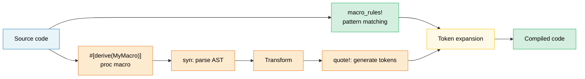

# 13. Macros — Code That Writes Code 🟡

> **What you'll learn:**
> - Declarative macros (`macro_rules!`) with pattern matching and repetition
> - When macros are the right tool vs generics/traits
> - Procedural macros: derive, attribute, and function-like
> - Writing a custom derive macro with `syn` and `quote`

## Declarative Macros (macro_rules!)

Macros match patterns on syntax and expand to code at compile time:

```rust
// A simple macro that creates a HashMap
macro_rules! hashmap {
    // Match: key => value pairs separated by commas
    ( $( $key:expr => $value:expr ),* $(,)? ) => {
        {
            let mut map = std::collections::HashMap::new();
            $( map.insert($key, $value); )*
            map
        }
    };
}

let scores = hashmap! {
    "Alice" => 95,
    "Bob" => 87,
    "Carol" => 92,
};
// Expands to:
// let mut map = HashMap::new();
// map.insert("Alice", 95);
// map.insert("Bob", 87);
// map.insert("Carol", 92);
// map
```

**Macro fragment types**:

| Fragment | Matches | Example |
|----------|---------|---------|
| `$x:expr` | Any expression | `42`, `a + b`, `foo()` |
| `$x:ty` | A type | `i32`, `Vec<String>` |
| `$x:ident` | An identifier | `my_var`, `Config` |
| `$x:pat` | A pattern | `Some(x)`, `_` |
| `$x:stmt` | A statement | `let x = 5;` |
| `$x:tt` | A single token tree | Anything (most flexible) |
| `$x:literal` | A literal value | `42`, `"hello"`, `true` |

**Repetition**: `$( ... ),*` means "zero or more, comma-separated"

```rust
// Generate test functions automatically
macro_rules! test_cases {
    ( $( $name:ident: $input:expr => $expected:expr ),* $(,)? ) => {
        $(
            #[test]
            fn $name() {
                assert_eq!(process($input), $expected);
            }
        )*
    };
}

test_cases! {
    test_empty: "" => "",
    test_hello: "hello" => "HELLO",
    test_trim: "  spaces  " => "SPACES",
}
// Generates three separate #[test] functions
```

### When (Not) to Use Macros

**Use macros when**:
- Reducing boilerplate that traits/generics can't handle (variadic arguments, DRY test generation)
- Creating DSLs (`html!`, `sql!`, `vec!`)
- Conditional code generation (`cfg!`, `compile_error!`)

**Don't use macros when**:
- A function or generic would work (macros are harder to debug, autocomplete doesn't help)
- You need type checking inside the macro (macros operate on tokens, not types)
- The pattern is used once or twice (not worth the abstraction cost)

```rust
// ❌ Unnecessary macro — a function works fine:
macro_rules! double {
    ($x:expr) => { $x * 2 };
}

// ✅ Just use a function:
fn double(x: i32) -> i32 { x * 2 }

// ✅ Good macro use — variadic, can't be a function:
macro_rules! println {
    ($($arg:tt)*) => { /* format string + args */ };
}
```

### Procedural Macros Overview

Procedural macros are Rust functions that transform token streams. They require a separate crate with `proc-macro = true`:

```rust
// Three types of proc macros:

// 1. Derive macros — #[derive(MyTrait)]
// Generate trait implementations from struct definitions
#[derive(Debug, Clone, Serialize, Deserialize)]
struct Config {
    name: String,
    port: u16,
}

// 2. Attribute macros — #[my_attribute]
// Transform the annotated item
#[route(GET, "/api/users")]
async fn list_users() -> Json<Vec<User>> { /* ... */ }

// 3. Function-like macros — my_macro!(...)
// Custom syntax
let query = sql!(SELECT * FROM users WHERE id = ?);
```

### Derive Macros in Practice

The most common proc macro type. Here's how `#[derive(Debug)]` works conceptually:

```rust
// Input (your struct):
#[derive(Debug)]
struct Point {
    x: f64,
    y: f64,
}

// The derive macro generates:
impl std::fmt::Debug for Point {
    fn fmt(&self, f: &mut std::fmt::Formatter<'_>) -> std::fmt::Result {
        f.debug_struct("Point")
            .field("x", &self.x)
            .field("y", &self.y)
            .finish()
    }
}
```

**Commonly used derive macros**:

| Derive | Crate | What It Generates |
|--------|-------|-------------------|
| `Debug` | std | `fmt::Debug` impl (debug printing) |
| `Clone`, `Copy` | std | Value duplication |
| `PartialEq`, `Eq` | std | Equality comparison |
| `Hash` | std | Hashing for HashMap keys |
| `Serialize`, `Deserialize` | serde | JSON/YAML/etc. encoding |
| `Error` | thiserror | `std::error::Error` + `Display` |
| `Parser` | `clap` | CLI argument parsing |
| `Builder` | derive_builder | Builder pattern |

> **Practical advice**: Use derive macros liberally — they eliminate error-prone
> boilerplate. Writing your own proc macros is an advanced topic; use existing
> ones (`serde`, `thiserror`, `clap`) before building custom ones.

### Macro Hygiene and `$crate`

**Hygiene** means that identifiers created inside a macro don't collide with
identifiers in the caller's scope. Rust's `macro_rules!` is *partially* hygienic:

```rust
macro_rules! make_var {
    () => {
        let x = 42; // This 'x' is in the MACRO's scope
    };
}

fn main() {
    let x = 10;
    make_var!();   // Creates a different 'x' (hygienic)
    println!("{x}"); // Prints 10, not 42 — macro's x doesn't leak
}
```

**`$crate`**: When writing macros in a library, use `$crate` to refer to
your own crate — it resolves correctly regardless of how users import your crate:

```rust
// In my_diagnostics crate:

pub fn log_result(msg: &str) {
    println!("[diag] {msg}");
}

#[macro_export]
macro_rules! diag_log {
    ($($arg:tt)*) => {
        // ✅ $crate always resolves to my_diagnostics, even if the user
        // renamed the crate in their Cargo.toml
        $crate::log_result(&format!($($arg)*))
    };
}

// ❌ Without $crate:
// my_diagnostics::log_result(...)  ← breaks if user writes:
//   [dependencies]
//   diag = { package = "my_diagnostics", version = "1" }
```

> **Rule**: Always use `$crate::` in `#[macro_export]` macros. Never use
> your crate's name directly.

### Recursive Macros and `tt` Munching

Recursive macros process input one token at a time — a technique called
**`tt` munching** (token-tree munching):

```rust
// Count the number of expressions passed to the macro
macro_rules! count {
    // Base case: no tokens left
    () => { 0usize };
    // Recursive case: consume one expression, count the rest
    ($head:expr $(, $tail:expr)* $(,)?) => {
        1usize + count!($($tail),*)
    };
}

fn main() {
    let n = count!("a", "b", "c", "d");
    assert_eq!(n, 4);

    // Works at compile time too:
    const N: usize = count!(1, 2, 3);
    assert_eq!(N, 3);
}
```

```rust
// Build a heterogeneous tuple from a list of expressions:
macro_rules! tuple_from {
    // Base: single element
    ($single:expr $(,)?) => { ($single,) };
    // Recursive: first element + rest
    ($head:expr, $($tail:expr),+ $(,)?) => {
        ($head, tuple_from!($($tail),+))
    };
}

let t = tuple_from!(1, "hello", 3.14, true);
// Expands to: (1, ("hello", (3.14, (true,))))
```

**Fragment specifier subtleties**:

| Fragment | Gotcha |
|----------|--------|
| `$x:expr` | Greedily parses — `1 + 2` is ONE expression, not three tokens |
| `$x:ty` | Greedily parses — `Vec<String>` is one type; can't be followed by `+` or `<` |
| `$x:tt` | Matches exactly ONE token tree — most flexible, least checked |
| `$x:ident` | Only plain identifiers — not paths like `std::io` |
| `$x:pat` | In Rust 2021, matches `A \| B` patterns; use `$x:pat_param` for single patterns |

> **When to use `tt`**: When you need to forward tokens to another macro without
> the parser constraining them. `$($args:tt)*` is the "accept everything" pattern
> (used by `println!`, `format!`, `vec!`).

### Writing a Derive Macro with `syn` and `quote`

Derive macros live in a separate crate (`proc-macro = true`) and transform
a token stream using `syn` (parse Rust) and `quote` (generate Rust):

```toml
# my_derive/Cargo.toml
[lib]
proc-macro = true

[dependencies]
syn = { version = "2", features = ["full"] }
quote = "1"
proc-macro2 = "1"
```

```rust
// my_derive/src/lib.rs
use proc_macro::TokenStream;
use quote::quote;
use syn::{parse_macro_input, DeriveInput};

/// Derive macro that generates a `describe()` method
/// returning the struct name and field names.
#[proc_macro_derive(Describe)]
pub fn derive_describe(input: TokenStream) -> TokenStream {
    let input = parse_macro_input!(input as DeriveInput);
    let name = &input.ident;
    let name_str = name.to_string();

    // Extract field names (only for structs with named fields)
    let fields = match &input.data {
        syn::Data::Struct(data) => {
            data.fields.iter()
                .filter_map(|f| f.ident.as_ref())
                .map(|id| id.to_string())
                .collect::<Vec<_>>()
        }
        _ => vec![],
    };

    let field_list = fields.join(", ");

    let expanded = quote! {
        impl #name {
            pub fn describe() -> String {
                format!("{} {{ {} }}", #name_str, #field_list)
            }
        }
    };

    TokenStream::from(expanded)
}
```

```rust
// In the application crate:
use my_derive::Describe;

#[derive(Describe)]
struct SensorReading {
    sensor_id: u16,
    value: f64,
    timestamp: u64,
}

fn main() {
    println!("{}", SensorReading::describe());
    // "SensorReading { sensor_id, value, timestamp }"
}
```

**The workflow**: `TokenStream` (raw tokens) → `syn::parse` (AST) →
inspect/transform → `quote!` (generate tokens) → `TokenStream` (back to compiler).

| Crate | Role | Key types |
|-------|------|-----------|
| `proc-macro` | Compiler interface | `TokenStream` |
| `syn` | Parse Rust source into AST | `DeriveInput`, `ItemFn`, `Type` |
| `quote` | Generate Rust tokens from templates | `quote!{}`, `#variable` interpolation |
| `proc-macro2` | Bridge between syn/quote and proc-macro | `TokenStream`, `Span` |

> **Practical tip**: Start by studying the source of a simple derive macro
> like `thiserror` or `derive_more` before writing your own. The
> `cargo expand` command (via `cargo-expand`) shows what any macro expands
> to — invaluable for debugging.

> **Key Takeaways — Macros**
> - `macro_rules!` for simple code generation; proc macros (`syn` + `quote`) for complex derives
> - Prefer generics/traits over macros when possible — macros are harder to debug and maintain
> - `$crate` ensures hygiene; `tt` munching enables recursive pattern matching

> **See also:** [Ch 2 — Traits](ch02-traits-in-depth.md) for when traits/generics beat macros. [Ch 13 — Testing](ch14-testing-and-benchmarking-patterns.md) for testing macro-generated code.



---

### Exercise: Declarative Macro — `map!` ★ (~15 min)

Write a `map!` macro that creates a `HashMap` from key-value pairs:

```rust,ignore
let m = map! {
    "host" => "localhost",
    "port" => "8080",
};
assert_eq!(m.get("host"), Some(&"localhost"));
```

Requirements: support trailing comma and empty invocation `map!{}`.

<details>
<summary>🔑 Solution</summary>

```rust
macro_rules! map {
    () => { std::collections::HashMap::new() };
    ( $( $key:expr => $val:expr ),+ $(,)? ) => {{
        let mut m = std::collections::HashMap::new();
        $( m.insert($key, $val); )+
        m
    }};
}

fn main() {
    let config = map! {
        "host" => "localhost",
        "port" => "8080",
        "timeout" => "30",
    };
    assert_eq!(config.len(), 3);
    assert_eq!(config["host"], "localhost");

    let empty: std::collections::HashMap<String, String> = map!();
    assert!(empty.is_empty());

    let scores = map! { 1 => 100, 2 => 200 };
    assert_eq!(scores[&1], 100);
}
```

</details>

***

