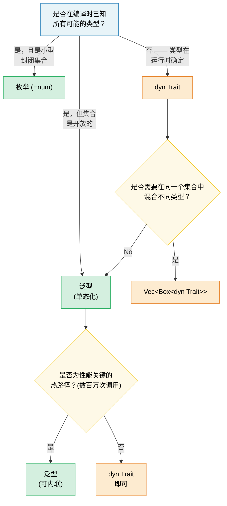

[English Original](../en/ch01-generics-the-full-picture.md)

# 1. 泛型：全景概览 🟢

> **你将学到：**
> - 单态化（Monomorphization）如何实现零成本泛型 —— 以及它何时会导致代码膨胀
> - 决策框架：泛型 vs 枚举 vs Trait 对象
> - 常量泛型（Const generics）用于编译时数组大小，以及 `const fn` 用于编译时计算
> - 何时在冷路径上将静态分发换成动态分发

## 单态化与零成本 (Monomorphization and Zero Cost)

Rust 中的泛型是**单态化**的 —— 编译器会为泛型函数所使用的每种具体类型生成一个专用的特殊副本。这与 Java/C# 相反，后者的泛型在运行时会被擦除（erased）。

```rust
fn max_of<T: PartialOrd>(a: T, b: T) -> T {
    if a >= b { a } else { b }
}

fn main() {
    max_of(3_i32, 5_i32);     // 编译器生成 max_of_i32
    max_of(2.0_f64, 7.0_f64); // 编译器生成 max_of_f64
    max_of("a", "z");         // 编译器生成 max_of_str
}
```

**编译器实际生成的代码**（概略性）：

```rust
// 三个独立的函数 —— 无运行时分发，无虚表：
fn max_of_i32(a: i32, b: i32) -> i32 { if a >= b { a } else { b } }
fn max_of_f64(a: f64, b: f64) -> f64 { if a >= b { a } else { b } }
fn max_of_str<'a>(a: &'a str, b: &'a str) -> &'a str { if a >= b { a } else { b } }
```

> **为什么 `max_of_str` 需要 `<'a>` 而 `max_of_i32` 不需要？** `i32` 和 `f64` 是 `Copy` 类型 —— 函数返回一个拥有的（owned）值。但 `&str` 是引用，因此编译器必须知道返回引用的生命周期。`<'a>` 注解表示“返回的 `&str` 的生命周期至少与两个输入一样长”。

**优势**：零运行时成本 —— 与手写的专用代码完全相同。优化器可以对每个副本独立进行内联、向量化和专门化。

**与 C++ 的对比**：Rust 的泛型工作方式类似于 C++ 模板，但有一个关键区别 —— **边界检查（bounds checking）发生在定义处，而非实例化处**。在 C++ 中，模板只有在配合具体类型使用时才会编译，这往往导致报错信息深藏在库代码深处且晦涩难懂。在 Rust 中，当你定义函数时，编译器就会检查 `T: PartialOrd`，因此错误能被及早捕捉且信息清晰。

```rust,compile_fail
// Rust：在定义处报错 —— “T 未实现 Display”
fn broken<T>(val: T) {
    println!("{val}"); // ❌ 错误：T 未实现 Display
}
```

```rust
// 修复：添加边界
fn fixed<T: std::fmt::Display>(val: T) {
    println!("{val}"); // ✅
}
```

### 泛型的代价：代码膨胀 (When Generics Hurt: Code Bloat)

单态化是有代价的 —— 二进制文件的大小。每一种唯一的实例化都会复制一遍函数体：

```rust,ignore
// 这个看似无害的函数...
fn serialize<T: serde::Serialize>(value: &T) -> Vec<u8> {
    serde_json::to_vec(value).unwrap()
}

// ...配合 50 种不同的类型使用 → 二进制文件中会有 50 个副本。
```

**缓解策略**：

```rust,ignore
// 1. 提取非泛型核心（“outline” 模式）
fn serialize<T: serde::Serialize>(value: &T) -> Result<Vec<u8>, serde_json::Error> {
    // 泛型部分：仅包含序列化调用
    let json_value = serde_json::to_value(value)?;
    // 非泛型部分：提取到单独的函数中
    serialize_value(json_value)
}

fn serialize_value(value: serde_json::Value) -> Result<Vec<u8>, serde_json::Error> {
    // 该函数在二进制文件中仅存在一次
    serde_json::to_vec(&value)
}

// 2. 当内联不是关键时，使用 Trait 对象（动态分发）
fn log_item(item: &dyn std::fmt::Display) {
    // 只有一个副本 —— 使用虚表（vtable）进行分发
    println!("[LOG] {item}");
}
```

> **经验法则**：在内联至关重要的热路径（hot paths）上使用泛型。在虚表调用开销可以忽略不计的冷路径（错误处理、日志记录、配置加载）上使用 `dyn Trait`。

### 泛型 vs 枚举 vs Trait 对象 —— 决策指南 (Generics vs Enums vs Trait Objects — Decision Guide)

在 Rust 中处理“不同类型，统一接口”的三种方法：

| 方案 | 分发方式 | 确定时机 | 是否可扩展？ | 开销 |
|----------|----------|----------|-------------|----------|
| **泛型** (`impl Trait` / `<T: Trait>`) | 静态 (单态化) | 编译阶段 | ✅ (开放集合) | 零 —— 已内联 |
| **枚举 (Enum)** | Match 分支 | 编译阶段 | ❌ (封闭集合) | 零 —— 无虚表 |
| **Trait 对象** (`dyn Trait`) | 动态 (虚表) | 运行阶段 | ✅ (开放集合) | 虚表指针 + 间接调用 |

```rust,ignore
// --- 泛型：开放集合，零成本，编译时确定 ---
fn process<H: Handler>(handler: H, request: Request) -> Response {
    handler.handle(request) // 单态化 —— 每种 H 生成一份副本
}

// --- 枚举：封闭集合，零成本，详尽匹配 ---
enum Shape {
    Circle(f64),
    Rect(f64, f64),
    Triangle(f64, f64, f64),
}

impl Shape {
    fn area(&self) -> f64 {
        match self {
            Shape::Circle(r) => std::f64::consts::PI * r * r,
            Shape::Rect(w, h) => w * h,
            Shape::Triangle(a, b, c) => {
                let s = (a + b + c) / 2.0;
                (s * (s - a) * (s - b) * (s - c)).sqrt()
            }
        }
    }
}
// 添加新变体将强制更新所有 match 分支 —— 编译器强制执行详尽性。
// 适用于“我能控制所有变体”的场景。

// --- Trait 对象：开放集合，运行时成本，可扩展 ---
fn log_all(items: &[Box<dyn std::fmt::Display>]) {
    for item in items {
        println!("{item}"); // 通过虚表分发
    }
}
```

**决策流程图**：



### 常量泛型 (Const Generics)

自 Rust 1.51 起，你可以根据*常量值*（而不仅仅是类型）来参数化类型和函数：

```rust
// 根据大小参数化的数组包装器
struct Matrix<const ROWS: usize, const COLS: usize> {
    data: [[f64; COLS]; ROWS],
}

impl<const ROWS: usize, const COLS: usize> Matrix<ROWS, COLS> {
    fn new() -> Self {
        Matrix { data: [[0.0; COLS]; ROWS] }
    }

    fn transpose(&self) -> Matrix<COLS, ROWS> {
        let mut result = Matrix::<COLS, ROWS>::new();
        for r in 0..ROWS {
            for c in 0..COLS {
                result.data[c][r] = self.data[r][c];
            }
        }
        result
    }
}

// 编译器强制执行维度正确性：
fn multiply<const M: usize, const N: usize, const P: usize>(
    a: &Matrix<M, N>,
    b: &Matrix<N, P>, // N 必须匹配！
) -> Matrix<M, P> {
    let mut result = Matrix::<M, P>::new();
    for i in 0..M {
        for j in 0..P {
            for k in 0..N {
                result.data[i][j] += a.data[i][k] * b.data[k][j];
            }
        }
    }
    result
}

// 使用：
let a = Matrix::<2, 3>::new(); // 2×3
let b = Matrix::<3, 4>::new(); // 3×4
let c = multiply(&a, &b);      // 2×4 ✅

// let d = Matrix::<5, 5>::new();
// multiply(&a, &d); // ❌ 编译错误：期待 Matrix<3, _>，得到 Matrix<5, 5>
```

> **与 C++ 对比**：这类似于 C++ 中的 `template<int N>`，但 Rust 的常量泛型会进行及早的类型检查（eagerly type-checked），且不受 SFINAE 复杂性的困扰。

### 常量函数 (const fn)

`const fn` 将函数标记为可以在编译时求值的函数 —— 相当于 C++ 的 `constexpr`。其结果可用于 `const` 和 `static` 上下文：

```rust
// 基础常量函数 —— 在 const 上下文中使用时在编译时计算
const fn celsius_to_fahrenheit(c: f64) -> f64 {
    c * 9.0 / 5.0 + 32.0
}

const BOILING_F: f64 = celsius_to_fahrenheit(100.0); // 在编译时计算
const FREEZING_F: f64 = celsius_to_fahrenheit(0.0);  // 32.0

// 常量构造函数 —— 无需 lazy_static! 即可创建静态变量
struct BitMask(u32);

impl BitMask {
    const fn new(bit: u32) -> Self {
        BitMask(1 << bit)
    }

    const fn or(self, other: BitMask) -> Self {
        BitMask(self.0 | other.0)
    }

    const fn contains(&self, bit: u32) -> bool {
        self.0 & (1 << bit) != 0
    }
}

// 静态查找表 —— 零运行时成本，无延迟初始化
const GPIO_INPUT:  BitMask = BitMask::new(0);
const GPIO_OUTPUT: BitMask = BitMask::new(1);
const GPIO_IRQ:    BitMask = BitMask::new(2);
const GPIO_IO:     BitMask = GPIO_INPUT.or(GPIO_OUTPUT);

// 寄存器映射为常量数组：
const SENSOR_THRESHOLDS: [u16; 4] = {
    let mut table = [0u16; 4];
    table[0] = 50;   // 警告
    table[1] = 70;   // 高危
    table[2] = 85;   // 暴击
    table[3] = 100;  // 熔断
    table
};
// 整个表直接存在于二进制文件中 —— 零堆内存，零运行时初始化。
```

**你在 `const fn` 中“可以”做的事**（截至 Rust 1.79+）：
- 算术运算、位运算、比较运算
- `if`/`else`, `match`, `loop`, `while` (控制流)
- 创建和修改局部变量 (`let mut`)
- 调用其他 `const fn`
- 引用 (`&`, `&mut` —— 在常量上下文内)
- `panic!()`（如果在编译时被触及，会触发编译错误）
- 基础浮点运算（`+`, `-`, `*`, `/`；复杂运算如 `sqrt`/`sin` 尚不可行）

**“不能”做的事**（目前）：
- 堆分配（`Box`, `Vec`, `String`）
- Trait 方法调用（仅限内部固有方法）
- I/O 或产生副作用

```rust
// 带有 panic 的 const fn —— 会触发编译时错误：
const fn checked_div(a: u32, b: u32) -> u32 {
    if b == 0 {
        panic!("division by zero"); // 若在 const 时刻 b 为 0，则引发编译错误
    }
    a / b
}

const RESULT: u32 = checked_div(100, 4);  // ✅ 25
// const BAD: u32 = checked_div(100, 0);  // ❌ 编译错误："division by zero"
```

> **与 C++ 对比**：`const fn` 是 Rust 版的 `constexpr`。关键区别：Rust 版是显式开启（opt-in）的，且编译器会严密验证仅使用了常量兼容的操作。在 C++ 中，`constexpr` 函数可能会静默回退到运行时求值 —— 在 Rust 中，`const` 上下文必须要求编译时求值，否则将引发严重错误。

> **实用建议**：尽可能让构造函数和简单的工具函数变为 `const fn` —— 这没有任何成本，且能允许调用方在常量上下文中使用。对于硬件诊断代码，`const fn` 是定义寄存器、构建位掩码和阈值表的理想选择。

> **核心要点 —— 泛型**
> - 单态化提供了零成本抽象，但可能导致代码膨胀 —— 在冷路径上应使用 `dyn Trait`。
> - 常量泛型 (`[T; N]`) 取代了 C++ 的模板技巧，提供了经编译时检查的数组大小。
> - `const fn` 针对编译时可计算值消除了对 `lazy_static!` 的需求。

> **扩展阅读：** 参阅 [第 2 章 —— 深入理解 Trait](ch02-traits-in-depth.md) 了解 Trait 边界、关联类型和 Trait 对象。参阅 [第 4 章 —— PhantomData](ch04-phantomdata-types-that-carry-no-data.md) 了解零大小泛型标记。

---

### 练习：带淘汰机制的泛型缓存 ★★ (~30 分钟)

构建一个泛型 `Cache<K, V>` 结构体，用于存储键值对，并具有可配置的最大容量。当容量占满时，淘汰最旧的条目（FIFO）。要求：

- `fn new(capacity: usize) -> Self`
- `fn insert(&mut self, key: K, value: V)` —— 如果达到容量限制，则淘汰最旧的条目
- `fn get(&self, key: &K) -> Option<&V>`
- `fn len(&self) -> usize`
- 对 `K` 使用 `Eq + Hash + Clone` 约束

<details>
<summary>🔑 参考方案</summary>

```rust
use std::collections::{HashMap, VecDeque};
use std::hash::Hash;

struct Cache<K, V> {
    map: HashMap<K, V>,
    order: VecDeque<K>,
    capacity: usize,
}

impl<K: Eq + Hash + Clone, V> Cache<K, V> {
    fn new(capacity: usize) -> Self {
        Cache {
            map: HashMap::with_capacity(capacity),
            order: VecDeque::with_capacity(capacity),
            capacity,
        }
    }

    fn insert(&mut self, key: K, value: V) {
        if self.capacity == 0 {
            // 无容量！
            return;
        }
        if self.map.contains_key(&key) {
            self.map.insert(key, value);
            return;
        }
        if self.map.len() >= self.capacity {
            if let Some(oldest) = self.order.pop_front() {
                self.map.remove(&oldest);
            }
        }
        self.order.push_back(key.clone());
        self.map.insert(key, value);
    }

    fn get(&self, key: &K) -> Option<&V> {
        self.map.get(key)
    }

    fn len(&self) -> usize {
        self.map.len()
    }
}

fn main() {
    // 基础缓存测试
    let mut cache = Cache::new(3);
    cache.insert("a", 1);
    cache.insert("b", 2);
    cache.insert("c", 3);
    assert_eq!(cache.len(), 3);

    cache.insert("d", 4); // 淘汰 "a"
    assert_eq!(cache.get(&"a"), None);
    assert_eq!(cache.get(&"d"), Some(&4));

    // 留给读者思考：`capacity` 属性应该用什么类型，
    // 以确保不能定义这种无效的空缓存？
    let mut empty_cache = Cache::new(0);
    empty_cache.insert("0", 0);
    assert_eq!(empty_cache.get(&"0"), None);
    assert_eq!(empty_cache.len(), 0);

    println!("缓存运行正常！len = {}", cache.len());
}
```

</details>

***
