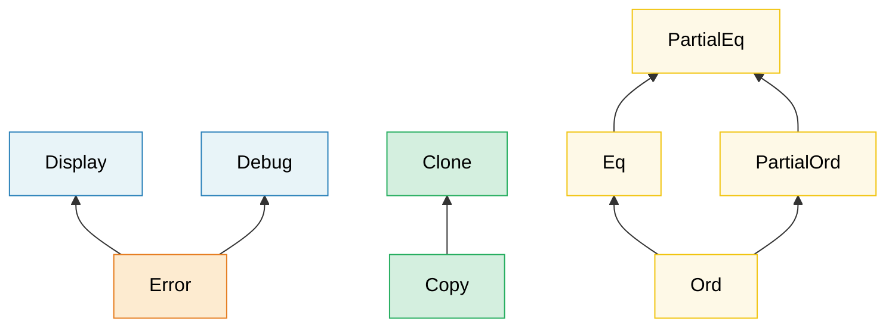

[English Original](../en/ch02-traits-in-depth.md)

# 2. 深入 Trait 🟡

> **你将学到：**
> - 关联类型与泛型参数的区别——以及何时使用它们
> - GATs、全包含实现（blanket impls）、标记 trait（marker traits）以及 trait 对象安全规则
> - vtable 和虚指针（fat pointers）在底层的运作机制
> - 扩展 trait（Extension traits）、枚举分发（enum dispatch）以及有类型命令模式

## 关联类型 vs 泛型参数

两者都允许 trait 与不同的类型协同工作，但它们的用途各不相同：

```rust
// --- 关联类型：每个类型只能有一个实现 ---
trait Iterator {
    type Item; // 每个迭代器产生且仅产生一种类型的项

    fn next(&mut self) -> Option<Self::Item>;
}

// 一个始终返回 i32 的自定义迭代器——别无选择
struct Counter { max: i32, current: i32 }

impl Iterator for Counter {
    type Item = i32; // 每个实现只能有一个 Item 类型
    fn next(&mut self) -> Option<i32> {
        if self.current < self.max {
            self.current += 1;
            Some(self.current)
        } else {
            None
        }
    }
}

// --- 泛型参数：每个类型可以有多个实现 ---
trait Convert<T> {
    fn convert(&self) -> T;
}

// 一个类型可以为多种目标类型实现 Convert：
impl Convert<f64> for i32 {
    fn convert(&self) -> f64 { *self as f64 }
}
impl Convert<String> for i32 {
    fn convert(&self) -> String { self.to_string() }
}
```

**何时使用哪种**：

| 使用 | 何时使用 |
|-----|------|
| **关联类型** | 每个实现类型正好有一个自然的输出/结果。例如 `Iterator::Item`、`Deref::Target`、`Add::Output` |
| **泛型参数** | 一个类型可以有意义地为许多不同的类型实现该 trait。例如 `From<T>`、`AsRef<T>`、`PartialEq<Rhs>` |

**直觉判断**：如果问“这个迭代器的 `Item` 是什么？”是有意义的，请使用关联类型。如果问“这个类型能转换成 `f64` 吗？转换成 `String` 吗？转换成 `bool` 吗？”是有意义的，请使用泛型参数。

```rust
// 现实世界的例子：std::ops::Add
trait Add<Rhs = Self> {
    type Output; // 关联类型——加法运算只有一个结果类型
    fn add(self, rhs: Rhs) -> Self::Output;
}

// Rhs 是泛型参数——你可以给 Meters 加不同类型：
struct Meters(f64);
struct Centimeters(f64);

impl Add<Meters> for Meters {
    type Output = Meters;
    fn add(self, rhs: Meters) -> Meters { Meters(self.0 + rhs.0) }
}
impl Add<Centimeters> for Meters {
    type Output = Meters;
    fn add(self, rhs: Centimeters) -> Meters { Meters(self.0 + rhs.0 / 100.0) }
}
```

### 泛型关联类型 (GATs)

自 Rust 1.65 起，关联类型可以拥有自己的泛型参数。这使得 **借用迭代器 (lending iterators)** 成为可能——这种迭代器返回的引用绑定到迭代器本身，而不是底层的集合：

```rust
// 没有 GATs——无法表达借用迭代器：
// trait LendingIterator {
//     type Item<'a>;  // ← 在 1.65 之前会被拒绝
// }

// 使用 GATs (Rust 1.65+)：
trait LendingIterator {
    type Item<'a> where Self: 'a;

    fn next(&mut self) -> Option<Self::Item<'_>>;
}

// 示例：一个产生重叠窗口的迭代器
struct WindowIter<'data> {
    data: &'data [u8],
    pos: usize,
    window_size: usize,
}

impl<'data> LendingIterator for WindowIter<'data> {
    type Item<'a> = &'a [u8] where Self: 'a;

    fn next(&mut self) -> Option<&[u8]> {
        if self.pos + self.window_size <= self.data.len() {
            let window = &self.data[self.pos..self.pos + self.window_size];
            self.pos += 1;
            Some(window)
        } else {
            None
        }
    }
}
```

> **何时需要 GATs**：借用迭代器、流式解析器，或者任何关联类型的生命周期依赖于 `&self` 借用的 trait。对于大多数代码，普通的关联类型就足够了。

### 父 trait 与 Trait 层级 (Supertraits and Trait Hierarchies)

Trait 可以要求其他 Trait 作为先决条件，从而形成层级结构：



> 箭头从子 trait 指向父 trait：实现 `Error` 要求同时实现 `Display` + `Debug`。

一个 Trait 可以要求实现者也必须实现其他 Trait：

```rust
use std::fmt;

// Display 是 Error 的父 trait
trait Error: fmt::Display + fmt::Debug {
    fn source(&self) -> Option<&(dyn Error + 'static)> { None }
}
// 任何实现 Error 的类型也必须实现 Display 和 Debug

// 构建你自己的层级：
trait Identifiable {
    fn id(&self) -> u64;
}

trait Timestamped {
    fn created_at(&self) -> chrono::DateTime<chrono::Utc>;
}

// Entity 需要同时满足上述两者：
trait Entity: Identifiable + Timestamped {
    fn is_active(&self) -> bool;
}

// 实现 Entity 强制要求你实现这三者：
struct User { id: u64, name: String, created: chrono::DateTime<chrono::Utc> }

impl Identifiable for User {
    fn id(&self) -> u64 { self.id }
}
impl Timestamped for User {
    fn created_at(&self) -> chrono::DateTime<chrono::Utc> { self.created }
}
impl Entity for User {
    fn is_active(&self) -> bool { true }
}
```

### 全包含实现 (Blanket Implementations)

为所有满足某些约束的类型实现一个 Trait：

```rust
// 标准库就是这么做的：任何实现 Display 的类型都会自动获得 ToString
impl<T: fmt::Display> ToString for T {
    fn to_string(&self) -> String {
        format!("{self}")
    }
}
// 现在 i32、&str、以及你的自定义类型——只要有 Display，就能免费获得 to_string()。

// 你自己的全包含实现：
trait Loggable {
    fn log(&self);
}

// 每个实现了 Debug 的类型自动成为 Loggable：
impl<T: std::fmt::Debug> Loggable for T {
    fn log(&self) {
        eprintln!("[LOG] {self:?}");
    }
}

// 现在任何 Debug 类型都有了 .log() 方法：
// 42.log();              // [LOG] 42
// "hello".log();         // [LOG] "hello"
// vec![1, 2, 3].log();   // [LOG] [1, 2, 3]
```

> **注意**：全包含实现功能强大但也具有不可逆性——你不能再为已经在这个范围内的类型添加更具体的实现（受孤儿规则和一致性限制）。请谨慎设计。

### 标记 Trait (Marker Traits)

没有方法的 Trait——它们仅将某种类型标记为具有某种属性：

```rust
// 标准库中的标记 trait：
// Send    — 可在线程间安全地传递
// Sync    — 可在线程间安全地共享 (&T)
// Unpin   — 被固化（pinning）后可安全移动
// Sized   — 在编译时具有已知大小
// Copy    — 可通过 memcpy 直接复制

// 你自己的标记 trait：
/// 标记：此传感器已经过出厂校准
trait Calibrated {}

struct RawSensor { reading: f64 }
struct CalibratedSensor { reading: f64 }

impl Calibrated for CalibratedSensor {}

// 只有经过校准的传感器才能在生产中使用：
fn record_measurement<S: Calibrated>(sensor: &S) {
    // ...
}
// record_measurement(&RawSensor { reading: 0.0 }); // ❌ 编译错误
// record_measurement(&CalibratedSensor { reading: 0.0 }); // ✅
```

这与第三章中的 **类型状态模式 (type-state pattern)** 直接联系在一起。

### Trait 对象安全规则 (Trait Object Safety Rules)

并非每个 Trait 都能被用作 `dyn Trait`。一个 Trait 只有在满足以下条件时才是 **对象安全 (object-safe)** 的：

1. **没有 `Self: Sized` 约束**：Trait 本身没有这个约束。
2. **方法没有泛型参数**：所有方法都不能有泛型。
3. **返回位置没有 `Self`**：除非通过间接引用（如 `Box<Self>`）。
4. **没有关联函数**：所有方法必须带有 `&self`、`&mut self` 或 `self` 参数。

```rust
// ✅ 对象安全——可以被用作 dyn Drawable
trait Drawable {
    fn draw(&self);
    fn bounding_box(&self) -> (f64, f64, f64, f64);
}

let shapes: Vec<Box<dyn Drawable>> = vec![/* ... */]; // ✅ 正常工作

// ❌ 非对象安全——在返回位置使用了 Self
trait Cloneable {
    fn clone_self(&self) -> Self;
    //                       ^^^^ 运行时无法确定具体的类型大小
}
// let items: Vec<Box<dyn Cloneable>> = ...; // ❌ 编译错误

// ❌ 非对象安全——带有泛型的方法
trait Converter {
    fn convert<T>(&self) -> T;
    //        ^^^ vtable 无法包含无限多的单态化函数指针
}

// ❌ 非对象安全——关联函数（没有 self）
trait Factory {
    fn create() -> Self;
    // 没有 &self——你该如何通过 trait 对象来调用它？
}
```

**解决方法**：

```rust
// 通过添加 `where Self: Sized` 约束将某个方法从 vtable 中排除：
trait MyTrait {
    fn regular_method(&self); // 包含在 vtable 中

    fn generic_method<T>(&self) -> T
    where
        Self: Sized; // 从 vtable 中排除——无法通过 dyn MyTrait 调用
}

// 现在 dyn MyTrait 是合法的，但 generic_method 只能在具体类型已知时调用。
```

> **经验法则**：如果你打算使用 `dyn Trait`，请保持方法简单——不要使用泛型、不要在返回类型中使用 `Self`、不要使用 `Sized` 约束。如果不确定，尝试定义 `let _: Box<dyn YourTrait>;`，让编译器告诉你答案。

### Trait 对象底层原理——虚函数表 (vtables) 与胖指针 (Fat Pointers)

一个 `&dyn Trait`（或 `Box<dyn Trait>`）是一个 **胖指针 (fat pointer)** ——由两个机器字（machine words）组成：

```text
┌──────────────────────────────────────────────────┐
│  &dyn Drawable (在 64 位系统上共 16 字节)          │
├──────────────┬───────────────────────────────────┤
│  data_ptr    │  vtable_ptr                       │
│  (8 字节)    │  (8 字节)                         │
│  ↓           │  ↓                                │
│  ┌─────────┐ │  ┌──────────────────────────────┐ │
│  │ Circle  │ │  │ <Circle as Drawable> 的 vtable │ │
│  │ {       │ │  │                              │ │
│  │  r: 5.0 │ │  │                              │ │
│  │ }       │ │  │  drop_in_place: 0x7f...a0    │ │
│  └─────────┘ │  │  size:           8           │ │
│              │  │  align:          8           │ │
│              │  │  draw:          0x7f...b4    │ │
│              │  │  bounding_box:  0x7f...c8    │ │
│              │  └──────────────────────────────┘ │
└──────────────┴───────────────────────────────────┘
```

**vtable 调用是如何运作的**（例如 `shape.draw()`）：

1. 从胖指针（第二个字）中加载 `vtable_ptr`。
2. 在 vtable 中索引，找到 `draw` 函数指针。
3. 调用该指针，并将 `data_ptr` 作为 `self` 参数传递。

这在开销上与 C++ 的虚函数分发（每次调用一次指针间接跳转）类似，但 Rust 将 vtable 指针存储在胖指针中，而不是对象内部——因此，栈上的普通 `Circle` 类型完全不携带任何 vtable 指针。

```rust
trait Drawable {
    fn draw(&self);
    fn area(&self) -> f64;
}

struct Circle { radius: f64 }

impl Drawable for Circle {
    fn draw(&self) { println!("正在绘制圆 r={}", self.radius); }
    fn area(&self) -> f64 { std::f64::consts::PI * self.radius * self.radius }
}

struct Square { side: f64 }

impl Drawable for Square {
    fn draw(&self) { println!("正在绘制正方形 s={}", self.side); }
    fn area(&self) -> f64 { self.side * self.side }
}

fn main() {
    let shapes: Vec<Box<dyn Drawable>> = vec![
        Box::new(Circle { radius: 5.0 }),
        Box::new(Square { side: 3.0 }),
    ];

    // 每个元素都是一个胖指针：(data_ptr, vtable_ptr)
    // Circle 和 Square 的 vtable 是不同的
    for shape in &shapes {
        shape.draw();  // vtable 分发 → Circle::draw 或 Square::draw
        println!("  面积 = {:.2}", shape.area());
    }

    // 大小对比：
    println!("size_of::<&Circle>()        = {}", size_of::<&Circle>());
    // → 8 字节（普通指针——编译器已知具体类型）
    println!("size_of::<&dyn Drawable>()  = {}", size_of::<&dyn Drawable>());
    // → 16 字节（data_ptr + vtable_ptr）
}
```

**性能开销模型**：

| 特性 | 静态分发 (`impl Trait` / 泛型) | 动态分发 (`dyn Trait`) |
|--------|------------------------------------------|-------------------------------|
| 调用开销 | 零——被 LLVM 内联 | 每次调用一次指针间接寻址 |
| 内联 | ✅ 编译器可内联 | ❌ 不透明的函数指针 |
| 二进制大小 | 较大（每种类型一份副本） | 较小（一份共享函数） |
| 指针大小 | 薄（Thin，1 个机器字） | 胖（Fat，2 个机器字） |
| 异构集合 | ❌ | ✅ `Vec<Box<dyn Trait>>` |

> **何时 vtable 开销很重要**：在循环调用数百万次 trait 方法的紧凑循环中，间接寻址和无法内联可能导致显著影响（慢 2-10 倍）。对于非热点路径、配置或插件架构，`dyn Trait` 带来的灵活性完全抵得过这点微小的开销。

### 高阶 Trait 约束 (Higher-Ranked Trait Bounds, HRTBs)

有时你需要一个函数能处理 *任何* 生命周期的引用，而不是某个特定的生命周期。这就是 `for<'a>` 语法出现的地方：

```rust
// 问题：这个函数需要一个闭包，该闭包能处理具有 任何 生命周期的引用，
// 而不仅仅是一个特定的生命周期。

// ❌ 这太严格了——'a 由调用者固定：
// fn apply<'a, F: Fn(&'a str) -> &'a str>(f: F, data: &'a str) -> &'a str

// ✅ HRTB：F 必须适用于所有可能的生命周期：
fn apply<F>(f: F, data: &str) -> &str
where
    F: for<'a> Fn(&'a str) -> &'a str,
{
    f(data)
}

fn main() {
    let result = apply(|s| s.trim(), "  hello  ");
    println!("{result}"); // "hello"
}
```

**何时会遇到 HRTBs**：
- `Fn(&T) -> &U` trait——在大多数情况下，编译器会自动推导 `for<'a>`。
- 必须跨不同借用工作的自定义 trait 实现。
- 使用 `serde` 进行反序列化时：`for<'de> Deserialize<'de>`。

```rust,ignore
// serde 的 DeserializeOwned 定义为：
// trait DeserializeOwned: for<'de> Deserialize<'de> {}
// 意思是：“可以从具有 任何 生命周期的数据中反序列化”
// （即结果不借用输入数据）

use serde::de::DeserializeOwned;

fn parse_json<T: DeserializeOwned>(input: &str) -> T {
    serde_json::from_str(input).unwrap()
}
```

> **实用建议**：你很少需要亲自编写 `for<'a>`。它主要出现在闭包参数的 trait 约束中，编译器通常会自动处理。但在报错信息中识别出它（例如 "expected a `for<'a> Fn(&'a ...)` bound"）能帮你理解编译器的要求。

### `impl Trait` —— 参数位置 vs 返回位置

`impl Trait` 出现在两个位置，其 **语义完全不同**：

```rust
// --- 参数位置的 impl Trait (APIT) ---
// “调用者选择类型”——泛型参数的语法糖
fn print_all(items: impl Iterator<Item = i32>) {
    for item in items { println!("{item}"); }
}
// 等同于：
fn print_all_verbose<I: Iterator<Iitem = i32>>(items: I) {
    for item in items { println!("{item}"); }
}
// 调用者决定具体类型：print_all(vec![1,2,3].into_iter())
//                     print_all(0..10)

// --- 返回位置的 impl Trait (RPIT) ---
// “被调用者选择类型”——函数体选择一个具体的类型
fn evens(limit: i32) -> impl Iterator<Item = i32> {
    (0..limit).filter(|x| x % 2 == 0)
    // 具体类型是 Filter<Range<i32>, Closure>
    // 但调用者只能看到“某个 Iterator<Item = i32>”
}
```

**核心区别**：

| 特性 | APIT (`fn foo(x: impl T)`) | RPIT (`fn foo() -> impl T`) |
|---|---|---|
| 谁来选类型？ | 调用者 | 被调用者（函数体） |
| 是否单态化？ | 是——每种类型一份副本 | 是——一个具体的类型 |
| 支持 Turbofish 语法？ | 否（不允许 `foo::<X>()`） | 不适用 |
| 等价于 | `fn foo<X: T>(x: X)` | 存在类型 (Existential type) |

#### Trait 定义中的 RPIT (RPITIT)

自 Rust 1.75 起，你可以在 trait 定义中直接使用 `-> impl Trait`：

```rust
trait Container {
    fn items(&self) -> impl Iterator<Item = &str>;
    //                 ^^^^ 每个实现者返回其自己的具体类型
}

struct CsvRow {
    fields: Vec<String>,
}

impl Container for CsvRow {
    fn items(&self) -> impl Iterator<Item = &str> {
        self.fields.iter().map(String::as_str)
    }
}

struct FixedFields;

impl Container for FixedFields {
    fn items(&self) -> impl Iterator<Item = &str> {
        ["host", "port", "timeout"].into_iter()
    }
}
```

> **在 Rust 1.75 之前**，你必须使用 `Box<dyn Iterator>` 或关联类型在 trait 中实现此功能。RPITIT 消除了堆内存分配。

#### `impl Trait` vs `dyn Trait` —— 决策指南

```text
你在编译时知道具体的类型吗？
├── 是 → 使用 impl Trait 或泛型（零开销，可内联）
└── 否 → 你需要异构集合（heterogeneous collection）吗？
     ├── 是 → 使用 dyn Trait (Box<dyn T>, &dyn T)
     └── 否 → 你是否需要跨 API 边界使用同一个 trait 对象？
          ├── 是 → 使用 dyn Trait
          └── 否 → 使用泛型 / impl Trait
```

| 特性 | `impl Trait` | `dyn Trait` |
|---------|-------------|------------|
| 分发方式 | 静态分发 (单态化) | 动态分发 (vtable) |
| 性能 | 最佳——可内联 | 每次调用一次间接寻址 |
| 异构集合 | ❌ | ✅ |
| 每种类型的二进制大小 | 每种类型一份副本 | 代码共享 |
| Trait 必须对象安全？ | 否 | 是 |
| 可在 Trait 定义中使用？ | ✅ (Rust 1.75+) | 始终支持 |

***

## 使用 `Any` 和 `TypeId` 进行类型擦除

有时你需要存储 *未知* 类型的值并在稍后进行向下转换（downcast）——这种模式类似于 C 语言中的 `void*` 或 C# 中的 `object`。Rust 通过 `std::any::Any` 提供了这一功能：

```rust
use std::any::Any;

// 存储不同类型的值：
fn log_value(value: &dyn Any) {
    if let Some(s) = value.downcast_ref::<String>() {
        println!("String: {s}");
    } else if let Some(n) = value.downcast_ref::<i32>() {
        println!("i32: {n}");
    } else {
        // TypeId 允许你在运行时检查类型：
        println!("未知类型: {:?}", value.type_id());
    }
}

// 适用于插件系统、事件总线或 ECS 风格的架构：
struct AnyMap(std::collections::HashMap<std::any::TypeId, Box<dyn Any + Send>>);

impl AnyMap {
    fn new() -> Self { AnyMap(std::collections::HashMap::new()) }

    fn insert<T: Any + Send + 'static>(&mut self, value: T) {
        self.0.insert(std::any::TypeId::of::<T>(), Box::new(value));
    }

    fn get<T: Any + Send + 'static>(&self) -> Option<&T> {
        self.0.get(&std::any::TypeId::of::<T>())?
            .downcast_ref()
    }
}

fn main() {
    let mut map = AnyMap::new();
    map.insert(42_i32);
    map.insert(String::from("hello"));

    assert_eq!(map.get::<i32>(), Some(&42));
    assert_eq!(map.get::<String>().map(|s| s.as_str()), Some("hello"));
    assert_eq!(map.get::<f64>(), None); // 从未插入过
}
```

> **何时使用 `Any`**：插件/扩展系统、类型索引映射 (`typemap`)、错误向下转换 (`anyhow::Error::downcast_ref`)。如果在编译时已知类型集，请优先使用泛型或 trait 对象——`Any` 是牺牲编译时安全性以换取灵活性的最后手段。

***

## 扩展 Trait (Extension Traits) —— 为不属于你的类型添加方法

Rust 的孤儿规则（orphan rule）阻止你为外部类型实现外部 Trait。扩展 Trait 是标准的解决方法：在你的 crate 中定义一个 **新 Trait**，并为任何满足约束的类型提供全包含实现。调用者只需导入该 Trait，新方法就会出现在现有类型上。

这种模式在 Rust 生态系统中随处可见：`itertools::Itertools`、`futures::StreamExt`、`tokio::io::AsyncReadExt`、`tower::ServiceExt`。

### 问题场景

```rust
// 我们想为所有产生 f64 的迭代器添加一个 .mean() 方法。
// 但 Iterator 定义在 std 中，而 f64 是原始类型——孤儿规则阻止了这种做法：
//
// impl<I: Iterator<Item = f64>> I {   // ❌ 无法为外部类型添加固有方法（inherent methods）
//     fn mean(self) -> f64 { ... }
// }
```

### 解决方案：扩展 Trait

```rust
/// 为数值类型的迭代器提供的扩展方法。
pub trait IteratorExt: Iterator {
    /// 计算算术平均值。对于空迭代器返回 `None`。
    fn mean(self) -> Option<f64>
    where
        Self: Sized,
        Self::Item: Into<f64>;
}

// 全包含实现——自动应用于所有迭代器
impl<I: Iterator> IteratorExt for I {
    fn mean(self) -> Option<f64>
    where
        Self: Sized,
        Self::Item: Into<f64>,
    {
        let mut sum: f64 = 0.0;
        let mut count: u64 = 0;
        for item in self {
            sum += item.into();
            count += 1;
        }
        if count == 0 { None } else { Some(sum / count as f64) }
    }
}

// 使用方法——只需导入该 trait：
use crate::IteratorExt;  // 一次导入，所有迭代器都拥有了该方法

fn analyze_temperatures(readings: &[f64]) -> Option<f64> {
    readings.iter().copied().mean()  // .mean() 现在可用了！
}

fn analyze_sensor_data(data: &[i32]) -> Option<f64> {
    data.iter().copied().mean()  // 同样适用于 i32 (因为 i32: Into<f64>)
}
```

### 现实案例：诊断结果扩展

```rust
use std::collections::HashMap;

struct DiagResult {
    component: String,
    passed: bool,
    message: String,
}

/// Vec<DiagResult> 的扩展 trait —— 添加领域特定的分析方法。
pub trait DiagResultsExt {
    fn passed_count(&self) -> usize;
    fn failed_count(&self) -> usize;
    fn overall_pass(&self) -> bool;
    fn failures_by_component(&self) -> HashMap<String, Vec<&DiagResult>>;
}

impl DiagResultsExt for Vec<DiagResult> {
    fn passed_count(&self) -> usize {
        self.iter().filter(|r| r.passed).count()
    }

    fn failed_count(&self) -> usize {
        self.iter().filter(|r| !r.passed).count()
    }

    fn overall_pass(&self) -> bool {
        self.iter().all(|r| r.passed)
    }

    fn failures_by_component(&self) -> HashMap<String, Vec<&DiagResult>> {
        let mut map = HashMap::new();
        for r in self.iter().filter(|r| !r.passed) {
            map.entry(r.component.clone()).or_default().push(r);
        }
        map
    }
}

// 现在任何 Vec<DiagResult> 都拥有了这些方法：
fn report(results: Vec<DiagResult>) {
    if !results.overall_pass() {
        let failures = results.failures_by_component();
        for (component, fails) in &failures {
            eprintln!("{component}: {} 次失败", fails.len());
        }
    }
}
```

### 命名约定

Rust 生态系统使用一致的 `Ext` 后缀：

| Crate | 扩展 Trait | 扩展对象 |
|-------|----------------|---------|
| `itertools` | `Itertools` | `Iterator` |
| `futures` | `StreamExt`, `FutureExt` | `Stream`, `Future` |
| `tokio` | `AsyncReadExt`, `AsyncWriteExt` | `AsyncRead`, `AsyncWrite` |
| `tower` | `ServiceExt` | `Service` |
| `bytes` | `BufMut` (部分) | `&mut [u8]` |
| 你的 Crate | `DiagResultsExt` | `Vec<DiagResult>` |

### 何时使用

| 情况 | 是否使用扩展 Trait？ |
|-----------|:---:|
| 为外部类型添加便捷方法 | ✅ |
| 在泛型集合上对领域特定逻辑进行分组 | ✅ |
| 方法需要访问私有字段 | ❌ (请使用包装器/newtype) |
| 方法逻辑上属于你控制的新类型 | ❌ (直接添加到你的类型中) |
| 希望方法在不导入的情况下可用 | ❌ (仅限固有方法) |

***

## 枚举分发 (Enum Dispatch) —— 无需 `dyn` 的静态多态

当你拥有一组 **闭置 (closed set)** 的类型实现了某个 Trait 时，你可以使用枚举来代替 `dyn Trait`。枚举的每个变体（variant）持有具体的类型。这种方式消除了 vtable 间接寻址和堆内存分配，同时保持了相同的调用接口。

### `dyn Trait` 的局限性

```rust
trait Sensor {
    fn read(&self) -> f64;
    fn name(&self) -> &str;
}

struct Gps { lat: f64, lon: f64 }
struct Thermometer { temp_c: f64 }
struct Accelerometer { g_force: f64 }

impl Sensor for Gps {
    fn read(&self) -> f64 { self.lat }
    fn name(&self) -> &str { "GPS" }
}
impl Sensor for Thermometer {
    fn read(&self) -> f64 { self.temp_c }
    fn name(&self) -> &str { "温度计" }
}
impl Sensor for Accelerometer {
    fn read(&self) -> f64 { self.g_force }
    fn name(&self) -> &str { "加速度计" }
}

// 使用 dyn 的异构集合——虽然可行，但有额外开销：
fn read_all_dyn(sensors: &[Box<dyn Sensor>]) -> Vec<f64> {
    sensors.iter().map(|s| s.read()).collect()
    // 每次调用 .read() 都要通过 vtable 间接跳转
    // 每个 Box 都要在堆上分配内存
}
```

### 枚举分发解决方案

```rust
// 用枚举代替 trait 对象：
enum AnySensor {
    Gps(Gps),
    Thermometer(Thermometer),
    Accelerometer(Accelerometer),
}

impl AnySensor {
    fn read(&self) -> f64 {
        match self {
            AnySensor::Gps(s) => s.read(),
            AnySensor::Thermometer(s) => s.read(),
            AnySensor::Accelerometer(s) => s.read(),
        }
    }

    fn name(&self) -> &str {
        match self {
            AnySensor::Gps(s) => s.name(),
            AnySensor::Thermometer(s) => s.name(),
            AnySensor::Accelerometer(s) => s.name(),
        }
    }
}

// 现在：无需堆分配，无需 vtable，数据内联存储
fn read_all(sensors: &[AnySensor]) -> Vec<f64> {
    sensors.iter().map(|s| s.read()).collect()
    // 每次调用 .read() 都是一个 match 分支——编译器可以内联所有内容
}

fn main() {
    let sensors = vec![
        AnySensor::Gps(Gps { lat: 47.6, lon: -122.3 }),
        AnySensor::Thermometer(Thermometer { temp_c: 72.5 }),
        AnySensor::Accelerometer(Accelerometer { g_force: 1.02 }),
    ];

    for sensor in &sensors {
        println!("{}: {:.2}", sensor.name(), sensor.read());
    }
}
```

### 在枚举上实现 Trait

为了保持互操作性，你可以在枚举本身上实现原始 Trait：

```rust
impl Sensor for AnySensor {
    fn read(&self) -> f64 {
        match self {
            AnySensor::Gps(s) => s.read(),
            AnySensor::Thermometer(s) => s.read(),
            AnySensor::Accelerometer(s) => s.read(),
        }
    }

    fn name(&self) -> &str {
        match self {
            AnySensor::Gps(s) => s.name(),
            AnySensor::Thermometer(s) => s.name(),
            AnySensor::Accelerometer(s) => s.name(),
        }
    }
}

// 现在 AnySensor 可以在任何通过泛型约束要求 Sensor 的地方工作：
fn report<S: Sensor>(s: &S) {
    println!("{}: {:.2}", s.name(), s.read());
}
```

### 使用宏减少模板代码

match 分支的委托调用非常重复。可以使用宏来消除它：

```rust
macro_rules! dispatch_sensor {
    ($self:expr, $method:ident $(, $arg:expr)*) => {
        match $self {
            AnySensor::Gps(s) => s.$method($($arg),*),
            AnySensor::Thermometer(s) => s.$method($($arg),*),
            AnySensor::Accelerometer(s) => s.$method($($arg),*),
        }
    };
}

impl Sensor for AnySensor {
    fn read(&self) -> f64     { dispatch_sensor!(self, read) }
    fn name(&self) -> &str    { dispatch_sensor!(self, name) }
}
```

对于大型项目，`enum_dispatch` crate 可以使这一切自动化：

```rust
use enum_dispatch::enum_dispatch;

#[enum_dispatch]
trait Sensor {
    fn read(&self) -> f64;
    fn name(&self) -> &str;
}

#[enum_dispatch(Sensor)]
enum AnySensor {
    Gps(Gps),
    Thermometer(Thermometer),
    Accelerometer(Accelerometer),
}
// 所有委托代码都会自动生成。
```

### `dyn Trait` vs 枚举分发 —— 决策指南

```text
类型集是闭置的吗（即在编译时已知）？
├── 是 → 优先使用枚举分发（更快速，无堆分配）
│         ├── 变体较少 (< ~20)?     → 手动定义枚举
│         └── 变体较多或不断增加？ → 使用 enum_dispatch crate
└── 否 → 必须使用 dyn Trait (用于插件系统、用户自定义类型)
```

| 属性 | `dyn Trait` | 枚举分发 (Enum Dispatch) |
|----------|:-----------:|:-------------:|
| 分发开销 | Vtable 间接跳转 (~2ns) | 分支预测 (~0.3ns) |
| 堆内存分配 | 通常有 (Box) | 无 (内联) |
| 缓存友好 | 否 (指针追踪) | 是 (连续存储) |
| 对新类型开放 | ✅ (任何人均可实现) | ❌ (闭置集合) |
| 代码体积 | 共享 | 每个变体各一份副本 |
| Trait 必须对象安全 | 是 | 否 |
| 添加新变体 | 无需修改代码 | 需要更新枚举和 match 分支 |

### 何时使用枚举分发

| 场景 | 建议 |
|----------|---------------|
| 诊断测试类型 (CPU, GPU, NIC, 内存, ...) | ✅ 枚举分发——闭置集合，编译时已知 |
| 总线协议 (SPI, I2C, UART, ...) | ✅ 枚举分发或 Config trait |
| 插件系统 (用户在运行时加载 .so) | ❌ 使用 `dyn Trait` |
| 2-3 个变体 | ✅ 手动枚举分发 |
| 10 个以上变体且有许多方法 | ✅ `enum_dispatch` crate |
| 性能关键的内部循环 | ✅ 枚举分发 (消除 vtable 开销) |

***

## 职能混入 (Capability Mixins) —— 作为零成本组合的关联类型

Ruby 开发者通过 **混入 (mixins)** 来组合行为——`include SomeModule` 会将方法注入到类中。Rust 通过 **关联类型 + 默认方法 + 全包含实现** 的组合可以达到同样的效果，但具有以下优势：

* 所有内容都在 **编译时** 解析——不会出现 "method-missing" 的惊喜。
* 每个关联类型都是一个 **旋钮 (knob)**，可以改变默认方法产生的结果。
* 编译器对每种组合进行 **单态化 (monomorphises)** ——零 vtable 开销。

### 问题场景：交叉引用的总线依赖

硬件诊断程序通常共享一些通用操作——读取 IPMI 传感器、切换 GPIO 引脚、过 SPI 采样温度——但不同的诊断程序需要不同的组合。Rust 中不存在继承体系。将每个总线句柄（bus handle）作为函数参数传递会导致函数签名过于冗长。我们需要一种方式来按需 **混入 (mix in)** 总线职能。

### 第一步：定义“原料”Trait (Ingredient Traits)

每种原料通过一个关联类型提供一种硬件职能：

```rust
use std::io;

// ── 总线抽象 (由硬件团队提供的 trait) ──────────────────────────
pub trait SpiBus {
    fn spi_transfer(&self, tx: &[u8], rx: &mut [u8]) -> io::Result<()>;
}

pub trait I2cBus {
    fn i2c_read(&self, addr: u8, reg: u8, buf: &mut [u8]) -> io::Result<()>;
    fn i2c_write(&self, addr: u8, reg: u8, data: &[u8]) -> io::Result<()>;
}

pub trait GpioPin {
    fn set_high(&self) -> io::Result<()>;
    fn set_low(&self) -> io::Result<()>;
    fn read_level(&self) -> io::Result<bool>;
}

pub trait IpmiBmc {
    fn raw_command(&self, net_fn: u8, cmd: u8, data: &[u8]) -> io::Result<Vec<u8>>;
    fn read_sensor(&self, sensor_id: u8) -> io::Result<f64>;
}

// ── 原料 trait：每个总线对应一个，带有一个关联类型 ───
pub trait HasSpi {
    type Spi: SpiBus;
    fn spi(&self) -> &Self::Spi;
}

pub trait HasI2c {
    type I2c: I2cBus;
    fn i2c(&self) -> &Self::I2c;
}

pub trait HasGpio {
    type Gpio: GpioPin;
    fn gpio(&self) -> &Self::Gpio;
}

pub trait HasIpmi {
    type Ipmi: IpmiBmc;
    fn ipmi(&self) -> &Self::Ipmi;
}
```

每种原料都非常精简、通用，并且可以独立测试。

### 第二步：定义“混入”Trait (Mixin Traits)

混入 trait 将其所需的原料声明为父 trait，然后通过 **默认实现** 提供所有方法——实现者可以免费获得这些方法：

```rust
/// 混入：风扇诊断——需要 I2C (转速计) + GPIO (PWM 使能)
pub trait FanDiagMixin: HasI2c + HasGpio {
    /// 通过 I2C 从转速计 IC 读取风扇 RPM。
    fn read_fan_rpm(&self, fan_id: u8) -> io::Result<u32> {
        let mut buf = [0u8; 2];
        self.i2c().i2c_read(0x48 + fan_id, 0x00, &mut buf)?;
        Ok(u16::from_be_bytes(buf) as u32 * 60) // 转速计数 → RPM
    }

    /// 通过 GPIO 使能或禁用风扇 PWM 输出。
    fn set_fan_pwm(&self, enable: bool) -> io::Result<()> {
        if enable { self.gpio().set_high() }
        else      { self.gpio().set_low() }
    }

    /// 全面的风扇健康检查——读取 RPM 并验证是否在阈值范围内。
    fn check_fan_health(&self, fan_id: u8, min_rpm: u32) -> io::Result<bool> {
        let rpm = self.read_fan_rpm(fan_id)?;
        Ok(rpm >= min_rpm)
    }
}

/// 混入：温度监控——需要 SPI (热电偶 ADC) + IPMI (BMC 传感器)
pub trait TempMonitorMixin: HasSpi + HasIpmi {
    /// 通过 SPI ADC (例如 MAX31855) 读取热电偶数值。
    fn read_thermocouple(&self) -> io::Result<f64> {
        let mut rx = [0u8; 4];
        self.spi().spi_transfer(&[0x00; 4], &mut rx)?;
        let raw = i32::from_be_bytes(rx) >> 18; // 14位有符号数
        Ok(raw as f64 * 0.25)
    }

    /// 通过 IPMI 读取 BMC 管理的温度传感器。
    fn read_bmc_temp(&self, sensor_id: u8) -> io::Result<f64> {
        self.ipmi().read_sensor(sensor_id)
    }

    /// 交叉验证：热电偶与 BMC 的读数差值必须在范围内。
    fn validate_temps(&self, sensor_id: u8, max_delta: f64) -> io::Result<bool> {
        let tc = self.read_thermocouple()?;
        let bmc = self.read_bmc_temp(sensor_id)?;
        Ok((tc - bmc).abs() <= max_delta)
    }
}

/// 混入：电源顺序控制——需要 GPIO (电源轨使能) + IPMI (事件日志)
pub trait PowerSeqMixin: HasGpio + HasIpmi {
    /// 断言 power-good GPIO 引脚并通过 IPMI 传感器验证。
    fn enable_power_rail(&self, sensor_id: u8) -> io::Result<bool> {
        self.gpio().set_high()?;
        std::thread::sleep(std::time::Duration::from_millis(50));
        let voltage = self.ipmi().read_sensor(sensor_id)?;
        Ok(voltage > 0.8) // 高于 80% 标称值 = 正常
    }

    /// 撤销电源使能并通过 IPMI OEM 命令记录关机日志。
    fn disable_power_rail(&self) -> io::Result<()> {
        self.gpio().set_low()?;
        // 向 BMC 记录 OEM "电源轨已禁用" 事件
        self.ipmi().raw_command(0x2E, 0x01, &[0x00, 0x01])?;
        Ok(())
    }
}
```

### 第三步：全包含实现使其真正成为“混入”

神奇的代码行——提供原料，即可获得方法：

```rust
impl<T: HasI2c + HasGpio>  FanDiagMixin    for T {}
impl<T: HasSpi  + HasIpmi>  TempMonitorMixin for T {}
impl<T: HasGpio + HasIpmi>  PowerSeqMixin   for T {}
```

任何实现了正确原料 Trait 的结构体会 **自动** 获得每个混入方法——无需重复代码、无需转发、无需继承。

### 第四步：接入生产环境

```rust
// ── 具体的总线实现 (Linux 平台) ─────────────────────────────────
struct LinuxSpi  { dev: String }
struct LinuxI2c  { dev: String }
struct SysfsGpio { pin: u32 }
struct IpmiTool  { timeout_secs: u32 }

impl SpiBus for LinuxSpi {
    fn spi_transfer(&self, _tx: &[u8], _rx: &mut [u8]) -> io::Result<()> {
        // spidev ioctl —— 为简洁起见省略实现
        Ok(())
    }
}
impl I2cBus for LinuxI2c {
    fn i2c_read(&self, _addr: u8, _reg: u8, _buf: &mut [u8]) -> io::Result<()> {
        // i2c-dev ioctl —— 省略实现
        Ok(())
    }
    fn i2c_write(&self, _addr: u8, _reg: u8, _data: &[u8]) -> io::Result<()> { Ok(()) }
}
impl GpioPin for SysfsGpio {
    fn set_high(&self) -> io::Result<()>  { /* /sys/class/gpio */ Ok(()) }
    fn set_low(&self) -> io::Result<()>   { Ok(()) }
    fn read_level(&self) -> io::Result<bool> { Ok(true) }
}
impl IpmiBmc for IpmiTool {
    fn raw_command(&self, _nf: u8, _cmd: u8, _data: &[u8]) -> io::Result<Vec<u8>> {
        // 调用 ipmitool 命令行 —— 省略实现
        Ok(vec![])
    }
    fn read_sensor(&self, _id: u8) -> io::Result<f64> { Ok(25.0) }
}

// ── 生产平台 —— 拥有所有四种总线 ──────────────────────────────
struct DiagPlatform {
    spi:  LinuxSpi,
    i2c:  LinuxI2c,
    gpio: SysfsGpio,
    ipmi: IpmiTool,
}

impl HasSpi  for DiagPlatform { type Spi  = LinuxSpi;  fn spi(&self)  -> &LinuxSpi  { &self.spi  } }
impl HasI2c  for DiagPlatform { type I2c  = LinuxI2c;  fn i2c(&self)  -> &LinuxI2c  { &self.i2c  } }
impl HasGpio for DiagPlatform { type Gpio = SysfsGpio; fn gpio(&self) -> &SysfsGpio { &self.gpio } }
impl HasIpmi for DiagPlatform { type Ipmi = IpmiTool;  fn ipmi(&self) -> &IpmiTool  { &self.ipmi } }

// DiagPlatform 现在拥有了所有混入方法：
fn production_diagnostics(platform: &DiagPlatform) -> io::Result<()> {
    let rpm = platform.read_fan_rpm(0)?;       // 来自 FanDiagMixin
    let tc  = platform.read_thermocouple()?;   // 来自 TempMonitorMixin
    let ok  = platform.enable_power_rail(42)?;  // 来自 PowerSeqMixin
    println!("风扇: {rpm} RPM, 温度: {tc}°C, 电源状态: {ok}");
    Ok(())
}
```

### 第五步：使用 Mock 进行测试 (无需硬件)

```rust
#[cfg(test)]
mod tests {
    use super::*;
    use std::cell::Cell;

    struct MockSpi  { temp: Cell<f64> }
    struct MockI2c  { rpm: Cell<u32> }
    struct MockGpio { level: Cell<bool> }
    struct MockIpmi { sensor_val: Cell<f64> }

    impl SpiBus for MockSpi {
        fn spi_transfer(&self, _tx: &[u8], rx: &mut [u8]) -> io::Result<()> {
            // 将 mock 温度编码为 MAX31855 格式
            let raw = ((self.temp.get() / 0.25) as i32) << 18;
            rx.copy_from_slice(&raw.to_be_bytes());
            Ok(())
        }
    }
    impl I2cBus for MockI2c {
        fn i2c_read(&self, _addr: u8, _reg: u8, buf: &mut [u8]) -> io::Result<()> {
            let tach = (self.rpm.get() / 60) as u16;
            buf.copy_from_slice(&tach.to_be_bytes());
            Ok(())
        }
        fn i2c_write(&self, _: u8, _: u8, _: &[u8]) -> io::Result<()> { Ok(()) }
    }
    impl GpioPin for MockGpio {
        fn set_high(&self)  -> io::Result<()>   { self.level.set(true);  Ok(()) }
        fn set_low(&self)   -> io::Result<()>   { self.level.set(false); Ok(()) }
        fn read_level(&self) -> io::Result<bool> { Ok(self.level.get()) }
    }
    impl IpmiBmc for MockIpmi {
        fn raw_command(&self, _: u8, _: u8, _: &[u8]) -> io::Result<Vec<u8>> { Ok(vec![]) }
        fn read_sensor(&self, _: u8) -> io::Result<f64> { Ok(self.sensor_val.get()) }
    }

    // ── 部分平台：仅包含风扇相关的总线 ─────────────────
    struct FanTestRig {
        i2c:  MockI2c,
        gpio: MockGpio,
    }
    impl HasI2c  for FanTestRig { type I2c  = MockI2c;  fn i2c(&self)  -> &MockI2c  { &self.i2c  } }
    impl HasGpio for FanTestRig { type Gpio = MockGpio; fn gpio(&self) -> &MockGpio { &self.gpio } }
    // FanTestRig 获得了 FanDiagMixin，但没有 TempMonitorMixin 或 PowerSeqMixin

    #[test]
    fn fan_health_check_passes_above_threshold() {
        let rig = FanTestRig {
            i2c:  MockI2c  { rpm: Cell::new(6000) },
            gpio: MockGpio { level: Cell::new(false) },
        };
        assert!(rig.check_fan_health(0, 4000).unwrap());
    }

    #[test]
    fn fan_health_check_fails_below_threshold() {
        let rig = FanTestRig {
            i2c:  MockI2c  { rpm: Cell::new(2000) },
            gpio: MockGpio { level: Cell::new(false) },
        };
        assert!(!rig.check_fan_health(0, 4000).unwrap());
    }
}
```

请注意，`FanTestRig` 仅实现了 `HasI2c + HasGpio` —— 它会自动获得 `FanDiagMixin`，但编译器会 **拒绝** 调用 `rig.read_thermocouple()`，因为 `HasSpi` 未被满足。这就是在编译时强制执行的混入作用域。

### 条件方法 —— 超越 Ruby 的能力

可以给单个默认方法添加 `where` 约束。该方法只有在关联类型满足额外约束时才 **存在**：

```rust
/// 具有 DMA 能力的 SPI 控制器的标记 trait
pub trait DmaCapable: SpiBus {
    fn dma_transfer(&self, tx: &[u8], rx: &mut [u8]) -> io::Result<()>;
}

/// 具有中断能力的 GPIO 引脚的标记 trait
pub trait InterruptCapable: GpioPin {
    fn wait_for_edge(&self, timeout_ms: u32) -> io::Result<bool>;
}

pub trait AdvancedDiagMixin: HasSpi + HasGpio {
    // 始终可用
    fn basic_probe(&self) -> io::Result<bool> {
        let mut rx = [0u8; 1];
        self.spi().spi_transfer(&[0xFF], &mut rx)?;
        Ok(rx[0] != 0x00)
    }

    // 只有当 SPI 控制器支持 DMA 时才存在
    fn bulk_sensor_read(&self, buf: &mut [u8]) -> io::Result<()>
    where
        Self::Spi: DmaCapable,
    {
        self.spi().dma_transfer(&vec![0x00; buf.len()], buf)
    }

    // 只有当 GPIO 引脚支持中断时才存在
    fn wait_for_fault_signal(&self, timeout_ms: u32) -> io::Result<bool>
    where
        Self::Gpio: InterruptCapable,
    {
        self.gpio().wait_for_edge(timeout_ms)
    }
}

impl<T: HasSpi + HasGpio> AdvancedDiagMixin for T {}
```

如果你的平台的 SPI 不支持 DMA，调用 `bulk_sensor_read()` 将会导致 **编译错误**，而不是运行时崩溃。Ruby 的 `respond_to?` 检查是最接近的等效功能——但它发生在部署阶段，而不是编译阶段。

### 可组合性：堆叠混入

多个混入可以共享同一个原料——不存在菱形继承问题：

```text
┌─────────────┐    ┌───────────┐    ┌──────────────┐
│ FanDiagMixin│    │TempMonitor│    │ PowerSeqMixin│
│  (I2C+GPIO) │    │ (SPI+IPMI)│    │  (GPIO+IPMI) │
└──────┬──────┘    └─────┬─────┘    └──────┬───────┘
       │                 │                 │
       │   ┌─────────────┴─────────────┐   │
       └──►│      DiagPlatform         │◄──┘
           │ HasSpi+HasI2c+HasGpio     │
           │        +HasIpmi           │
           └───────────────────────────┘
```

`DiagPlatform` 只需 **一次** 实现 `HasGpio`，而 `FanDiagMixin` 和 `PowerSeqMixin` 都会使用同一个 `self.gpio()`。在 Ruby 中，这将是两个模块都调用 `self.gpio_pin` ——但如果它们期望不同的引脚编号，你只能在运行时才发现冲突。在 Rust 中，你可以在类型层面上消除歧义。

### 对比：Ruby Mixins vs Rust 职能混入

| 维度 | Ruby Mixins | Rust 职能混入 (Capability Mixins) |
|-----------|-------------|------------------------|
| 分发方式 | 运行时 (方法表查找) | 编译时 (单态化) |
| 安全组合 | MRO 线性化隐藏了冲突 | 编译器拒绝歧义 |
| 条件方法 | 运行时的 `respond_to?` | 编译时的 `where` 约束 |
| 开销 | 方法分发 + GC 开销 | 零成本 (内联) |
| 可测试性 | 通过元编程进行 Stub/Mock | 针对 Mock 类型进行泛型化 |
| 添加新总线 | 运行时 `include` | 添加原料 trait，重新编译 |
| 运行时灵活性 | `extend`, `prepend`, 开放类 | 无 (全静态) |

### 何时使用职能混入

| 场景 | 是否使用混入？ |
|----------|:-----------:|
| 多个诊断程序共享读取总线的逻辑 | ✅ |
| 测试夹具需要不同的总线子集 | ✅ (部分原料结构体) |
| 仅对某些总线能力 (DMA, IRQ) 有效的方法 | ✅ (条件性的 `where` 约束) |
| 需要运行时模块加载 (插件) | ❌ (使用 `dyn Trait` 或枚举分发) |
| 只有一个总线的单一结构体——无需共享 | ❌ (保持简单) |
| 存在一致性问题的跨 crate 原料 | ⚠️ (使用 newtype 包装器) |

> **关键要点 —— 职能混入**
>
> 1. **原料 trait (Ingredient trait)** = 关联类型 + 访问方法 (例如 `HasSpi`)
> 2. **混入 trait (Mixin trait)** = 对原料的父 trait 约束 + 默认方法体
> 3. **全包含实现 (Blanket impl)** = `impl<T: HasX + HasY> Mixin for T {}` —— 自动注入方法
> 4. **条件方法 (Conditional methods)** = 在单个默认方法上添加 `where Self::Spi: DmaCapable`
> 5. **部分平台 (Partial platforms)** = 仅实现了所需原料的测试结构体
> 6. **零运行时成本** —— 编译器为每个平台类型生成专门的代码

***

## 有类型命令 (Typed Commands) —— GADT 风格的返回类型安全

在 Haskell 中，**广义代数数据类型 (GADTs)** 允许每个数据类型的构造函数细化（refine）类型参数——因此 `Expr Int` 和 `Expr Bool` 会受到类型检查器的强制约束。Rust 虽然没有直接的 GADT 语法，但 **带有关联类型的 Trait** 可以实现同样的保障：命令类型 **决定了** 响应类型，将两者混淆会导致编译错误。

这种模式对于硬件诊断特别强大，因为 IPMI 命令、寄存器读取和传感器查询各自返回不同的物理量，这些物理量永远不应该被混淆。

### 问题场景：未类型化的 `Vec<u8>` 泥潭

大多数 C/C++ 的 IPMI 协议栈——以及一些幼稚的 Rust 移植版本——在任何地方都使用原始字节：

```rust
use std::io;

struct BmcConnectionUntyped { timeout_secs: u32 }

impl BmcConnectionUntyped {
    fn raw_command(&self, net_fn: u8, cmd: u8, data: &[u8]) -> io::Result<Vec<u8>> {
        // ... 调用 ipmitool ...
        Ok(vec![0x00, 0x19, 0x00]) // 桩代码
    }
}

fn diagnose_thermal_untyped(bmc: &BmcConnectionUntyped) -> io::Result<()> {
    // 读取 CPU 温度 —— 传感器 ID 0x20
    let raw = bmc.raw_command(0x04, 0x2D, &[0x20])?;
    let cpu_temp = raw[0] as f64;  // 🤞 祈祷第 0 个字节就是读数

    // 读取风扇转速 —— 传感器 ID 0x30
    let raw = bmc.raw_command(0x04, 0x2D, &[0x30])?;
    let fan_rpm = raw[0] as u32;  // 🐛 错误：风扇速度是 2 字节小端序 (LE)

    // 读取入口电压 —— 传感器 ID 0x40
    let raw = bmc.raw_command(0x04, 0x2D, &[0x40])?;
    let voltage = raw[0] as f64;  // 🐛 错误：需要除以 1000

    // 🐛 将摄氏度与 RPM 进行比较 —— 可以编译，但毫无意义
    if cpu_temp > fan_rpm as f64 {
        println!("糟糕");
    }

    // 🐛 将电压作为温度传递 —— 编译完全正常
    log_temp_untyped(voltage);
    log_volts_untyped(cpu_temp);

    Ok(())
}

fn log_temp_untyped(t: f64)  { println!("温度: {t}°C"); }
fn log_volts_untyped(v: f64) { println!("电压: {v}V"); }
```

**每个读数都是 `f64`** —— 编译器完全不知道一个是温度，另一个是 RPM，还有一个是电压。四个截然不同的错误在没有任何警告的情况下传递通过：

| # | 错误 | 后果 | 发现时机 |
|---|-----|-------------|------------|
| 1 | 风扇 RPM 被解析为 1 字节而非 2 字节 | 读数为 25 RPM 而非 6400 | 凌晨 3 点，风扇故障报警淹没生产环境 |
| 2 | 电压没有除以 1000 | 读数为 12000V 而非 12.0V | 阈值检查标记每个 PSU 都有故障 |
| 3 | 将摄氏度与 RPM 比较 | 毫无意义的布尔值 | 可能永远发现不了 |
| 4 | 电压被传递给 `log_temp_untyped()` | 日志中出现静默数据损坏 | 6 个月后，查看历史记录时 |

### 解决方案：通过关联类型实现有类型命令

#### 第一步：领域特定的 Newtype

```rust
#[derive(Debug, Clone, Copy, PartialEq, PartialOrd)]
struct Celsius(f64);

#[derive(Debug, Clone, Copy, PartialEq, PartialOrd)]
struct Rpm(u32);

#[derive(Debug, Clone, Copy, PartialEq, PartialOrd)]
struct Volts(f64);

#[derive(Debug, Clone, Copy, PartialEq, PartialOrd)]
struct Watts(f64);
```

#### 第二步：命令 Trait (等效于 GADT)

关联类型 `Response` 是关键——它将每个命令与其返回类型绑定在一起：

```rust
trait IpmiCmd {
    /// GADT “索引”——决定了 execute() 的返回类型。
    type Response;

    fn net_fn(&self) -> u8;
    fn cmd_byte(&self) -> u8;
    fn payload(&self) -> Vec<u8>;

    /// 解析逻辑封装在此处 —— 每个命令都知道自己的字节布局。
    fn parse_response(&self, raw: &[u8]) -> io::Result<Self::Response>;
}
```

#### 第三步：每个命令对应一个结构体，解析逻辑编写一次

```rust
struct ReadTemp { sensor_id: u8 }
impl IpmiCmd for ReadTemp {
    type Response = Celsius;  // ← “此命令返回温度”
    fn net_fn(&self) -> u8 { 0x04 }
    fn cmd_byte(&self) -> u8 { 0x2D }
    fn payload(&self) -> Vec<u8> { vec![self.sensor_id] }
    fn parse_response(&self, raw: &[u8]) -> io::Result<Celsius> {
        // 根据 IPMI SDR 定义的有符号字节 —— 编写一次，测试一次
        Ok(Celsius(raw[0] as i8 as f64))
    }
}

struct ReadFanSpeed { fan_id: u8 }
impl IpmiCmd for ReadFanSpeed {
    type Response = Rpm;     // ← “此命令返回 RPM”
    fn net_fn(&self) -> u8 { 0x04 }
    fn cmd_byte(&self) -> u8 { 0x2D }
    fn payload(&self) -> Vec<u8> { vec![self.fan_id] }
    fn parse_response(&self, raw: &[u8]) -> io::Result<Rpm> {
        // 2 字节小端序 (LE) —— 正确的布局，编码一次
        Ok(Rpm(u16::from_le_bytes([raw[0], raw[1]]) as u32))
    }
}

struct ReadVoltage { rail: u8 }
impl IpmiCmd for ReadVoltage {
    type Response = Volts;   // ← “此命令返回电压”
    fn net_fn(&self) -> u8 { 0x04 }
    fn cmd_byte(&self) -> u8 { 0x2D }
    fn payload(&self) -> Vec<u8> { vec![self.rail] }
    fn parse_response(&self, raw: &[u8]) -> io::Result<Volts> {
        // 毫伏转为伏特，始终正确
        Ok(Volts(u16::from_le_bytes([raw[0], raw[1]]) as f64 / 1000.0))
    }
}

struct ReadFru { fru_id: u8 }
impl IpmiCmd for ReadFru {
    type Response = String;
    fn net_fn(&self) -> u8 { 0x0A }
    fn cmd_byte(&self) -> u8 { 0x11 }
    fn payload(&self) -> Vec<u8> { vec![self.fru_id, 0x00, 0x00, 0xFF] }
    fn parse_response(&self, raw: &[u8]) -> io::Result<String> {
        Ok(String::from_utf8_lossy(raw).to_string())
    }
}
```

#### 第四步：执行器 (零 `dyn`，单态化)

```rust
struct BmcConnection { timeout_secs: u32 }

impl BmcConnection {
    /// 对任何命令泛型化 —— 编译器为每个命令类型生成一个版本。
    fn execute<C: IpmiCmd>(&self, cmd: &C) -> io::Result<C::Response> {
        let raw = self.raw_send(cmd.net_fn(), cmd.cmd_byte(), &cmd.payload())?;
        cmd.parse_response(&raw)
    }

    fn raw_send(&self, _nf: u8, _cmd: u8, _data: &[u8]) -> io::Result<Vec<u8>> {
        Ok(vec![0x19, 0x00]) // 桩代码 —— 实际实现调用 ipmitool
    }
}
```

#### 第五步：调用方代码：所有四个错误都变成了编译错误

```rust
fn diagnose_thermal(bmc: &BmcConnection) -> io::Result<()> {
    let cpu_temp: Celsius = bmc.execute(&ReadTemp { sensor_id: 0x20 })?;
    let fan_rpm:  Rpm     = bmc.execute(&ReadFanSpeed { fan_id: 0x30 })?;
    let voltage:  Volts   = bmc.execute(&ReadVoltage { rail: 0x40 })?;

    // 错误 #1 —— 不可能发生：解析逻辑存在于 ReadFanSpeed::parse_response 中
    // 错误 #2 —— 不可能发生：缩放逻辑存在于 ReadVoltage::parse_response 中

    // 错误 #3 —— 编译错误：
    // if cpu_temp > fan_rpm { }
    //    ^^^^^^^^   ^^^^^^^
    //    Celsius    Rpm      → “类型不匹配 (mismatched types)” ❌

    // 错误 #4 —— 编译错误：
    // log_temperature(voltage);
    //                 ^^^^^^^  预期 Celsius，得到 Volts ❌

    // 只有正确类型的比较才能通过编译：
    if cpu_temp > Celsius(85.0) {
        println!("CPU 过热: {:?}", cpu_temp);
    }
    if fan_rpm < Rpm(4000) {
        println!("风扇转速过慢: {:?}", fan_rpm);
    }

    Ok(())
}

fn log_temperature(t: Celsius) { println!("温度: {:?}", t); }
fn log_voltage(v: Volts)       { println!("电压: {:?}", v); }
```

### 诊断脚本的宏 DSL

对于需要按顺序运行许多命令的大型诊断程序，宏可以提供简练的声明式语法，同时保持完全的类型安全：

```rust
/// 执行一系列有类型的 IPMI 命令，返回一个结果元组。
/// 元组的每个元素都有其命令对应的 Response 类型。
macro_rules! diag_script {
    ($bmc:expr; $($cmd:expr),+ $(,)?) => {{
        ( $( $bmc.execute(&$cmd)?, )+ )
    }};
}

fn full_pre_flight(bmc: &BmcConnection) -> io::Result<()> {
    // 展开为: (Celsius, Rpm, Volts, String) —— 每个类型都被追踪
    let (temp, rpm, volts, board_pn) = diag_script!(bmc;
        ReadTemp     { sensor_id: 0x20 },
        ReadFanSpeed { fan_id:    0x30 },
        ReadVoltage  { rail:      0x40 },
        ReadFru      { fru_id:    0x00 },
    );

    println!("主板: {:?}", board_pn);
    println!("CPU: {:?}, 风扇: {:?}, 12V: {:?}", temp, rpm, volts);

    // 类型安全的阈值检查：
    assert!(temp  < Celsius(95.0), "CPU 太烫了");
    assert!(rpm   > Rpm(3000),     "风扇太慢了");
    assert!(volts > Volts(11.4),   "12V 电压下降了");

    Ok(())
}
```

这个宏仅仅是语法糖 —— 元组类型 `(Celsius, Rpm, Volts, String)` 完全由编译器推导出来。交换两个命令，解构就会在编译时报错，而不是在运行时。

### 用于异构命令列表的枚举分发

当你需要一个混合命令的 `Vec`（例如从 JSON 加载的可配置脚本）时，请使用枚举分发来保持“非 dyn”状态：

```rust
enum AnyReading {
    Temp(Celsius),
    Rpm(Rpm),
    Volt(Volts),
    Text(String),
}

enum AnyCmd {
    Temp(ReadTemp),
    Fan(ReadFanSpeed),
    Voltage(ReadVoltage),
    Fru(ReadFru),
}

impl AnyCmd {
    fn execute(&self, bmc: &BmcConnection) -> io::Result<AnyReading> {
        match self {
            AnyCmd::Temp(c)    => Ok(AnyReading::Temp(bmc.execute(c)?)),
            AnyCmd::Fan(c)     => Ok(AnyReading::Rpm(bmc.execute(c)?)),
            AnyCmd::Voltage(c) => Ok(AnyReading::Volt(bmc.execute(c)?)),
            AnyCmd::Fru(c)     => Ok(AnyReading::Text(bmc.execute(c)?)),
        }
    }
}

```rust
/// 动态诊断脚本 —— 在运行时加载命令
fn run_script(bmc: &BmcConnection, script: &[AnyCmd]) -> io::Result<Vec<AnyReading>> {
    script.iter().map(|cmd| cmd.execute(bmc)).collect()
}
```

虽然你失去了对每个元素的类型追踪（所有内容都是 `AnyReading` 类型），但你获得了运行时的灵活性 —— 并且解析逻辑仍然封装在每个 `IpmiCmd` 的实现中。

### 测试有类型命令

```rust
#[cfg(test)]
mod tests {
    use super::*;

    struct StubBmc {
        responses: std::collections::HashMap<u8, Vec<u8>>,
    }

    impl StubBmc {
        fn execute<C: IpmiCmd>(&self, cmd: &C) -> io::Result<C::Response> {
            let key = cmd.payload()[0]; // 使用传感器 ID 作为键
            let raw = self.responses.get(&key)
                .ok_or_else(|| io::Error::new(io::ErrorKind::NotFound, "未找到桩数据"))?;
            cmd.parse_response(raw)
        }
    }

    #[test]
    fn read_temp_parses_signed_byte() {
        let bmc = StubBmc {
            responses: [( 0x20, vec![0xE7] )].into() // -25 (i8) = 0xE7
        };
        let temp = bmc.execute(&ReadTemp { sensor_id: 0x20 }).unwrap();
        assert_eq!(temp, Celsius(-25.0));
    }

    #[test]
    fn read_fan_parses_two_byte_le() {
        let bmc = StubBmc {
            responses: [( 0x30, vec![0x00, 0x19] )].into() // 0x1900 = 6400
        };
        let rpm = bmc.execute(&ReadFanSpeed { fan_id: 0x30 }).unwrap();
        assert_eq!(rpm, Rpm(6400));
    }

    #[test]
    fn read_voltage_scales_millivolts() {
        let bmc = StubBmc {
            responses: [( 0x40, vec![0xE8, 0x2E] )].into() // 0x2EE8 = 12008 mV
        };
        let v = bmc.execute(&ReadVoltage { rail: 0x40 }).unwrap();
        assert!((v.0 - 12.008).abs() < 0.001);
    }
}
```

每个命令的解析逻辑都可以独立测试。如果在新的 IPMI 规范修订版本中，`ReadFanSpeed` 从 2 字节小端序变为了 4 字节大端序，你只需更新 **一处** `parse_response` 的实现，测试就会捕捉到任何回归风险。

### 这如何映射到 Haskell 的 GADT

```text
Haskell GADT                         Rust 等效实现
────────────────                     ───────────────────────
data Cmd a where                     trait IpmiCmd {
  ReadTemp :: SensorId -> Cmd Temp       type Response;
  ReadFan  :: FanId    -> Cmd Rpm        ...
                                     }

eval :: Cmd a -> IO a                fn execute<C: IpmiCmd>(&self, cmd: &C)
                                         -> io::Result<C::Response>

类型分支中的类型细化             单态化：编译器生成 
                                     execute::<ReadTemp>() → 返回 Celsius
                                     execute::<ReadFanSpeed>() → 返回 Rpm
```

两者都能保证：**命令决定了返回类型**。Rust 通过泛型单态化而非类型层面的分支分析实现了这一点 —— 拥有相同的安全性，且具有零运行时开销。

### 前后对比总结

| 维度 | 未类型化 (`Vec<u8>`) | 有类型命令 (Typed Commands) |
|-----------|:---:|:---:|
| 每个传感器的代码行数 | ~3 行 (在每个调用处都要重复) | ~15 行 (编写并测试一次) |
| 可能出现解析错误 | 在每个调用处都可能发生 | 仅在 `parse_response` 实现中 |
| 单位混淆 Bug | 无数 | 零 (编译时报错) |
| 添加新传感器 | 需要改动 N 个文件，复制解析代码 | 添加 1 个结构体 + 1 个实现 |
| 运行时开销 | — | 完全相同 (单态化) |
| IDE 自动补全 | 到处都是 `f64` | `Celsius`, `Rpm`, `Volts` —— 自解释 |
| 代码审查负担 | 必须验证每个原始字节的解析 | 验证每个传感器的 `parse_response` 实现 |
| 宏 DSL | 不适用 | `diag_script!(bmc; ReadTemp{..}, ReadFan{..})` → `(Celsius, Rpm)` |
| 动态脚本 | 手动分发行为 | `AnyCmd` 枚举分发 —— 依然不含 `dyn` |

### 何时使用有类型命令

| 场景 | 建议 |
|----------|:--------------:|
| 具有不同物理单位的 IPMI 传感器读取 | ✅ 使用有类型命令 |
| 具有不同宽度字段的寄存器图谱 | ✅ 使用有类型命令 |
| 网络协议消息 (请求 → 响应) | ✅ 使用有类型命令 |
| 只有一种返回格式的单一命令类型 | ❌ 过度设计 —— 直接返回对应类型即可 |
| 对未知设备进行原型设计 / 探索 | ❌ 先使用原始字节，稍后再引入类型 |
| 命令在编译时未知的插件系统 | ⚠️ 使用 `AnyCmd` 枚举分发 |

> **关键要点 —— Trait**
> - 关联类型 = 每个类型一个实现；泛型参数 = 每个类型多个实现
> - GATs 解锁了借用迭代器（lending iterators）和 Trait 中的 Async 模式
> - 对闭置集合使用枚举分发（快速）；对开置集合使用 `dyn Trait`（灵活）
> - 当编译时类型未知时，`Any` + `TypeId` 是逃生窗口

> **参见：** [第一章 —— 泛型](ch01-generics-the-full-picture.md) 了解单态化以及泛型何时会导致代码膨胀。[第三章 —— Newtype 与类型状态](ch03-the-newtype-and-type-state-patterns.md) 了解如何将 Trait 与配置 Trait 模式结合使用。

---

### 练习：带有关联类型的 Repository ★★★ (~40 分钟)

设计一个带有 `Error`、`Id` 和 `Item` 关联类型的 `Repository` trait。为一个内存存储实现该 trait，并演示编译时的类型安全性。

<details>
<summary>🔑 答案</summary>

```rust
use std::collections::HashMap;

trait Repository {
    type Item;
    type Id;
    type Error;

    fn get(&self, id: &Self::Id) -> Result<Option<&Self::Item>, Self::Error>;
    fn insert(&mut self, item: Self::Item) -> Result<Self::Id, Self::Error>;
    fn delete(&mut self, id: &Self::Id) -> Result<bool, Self::Error>;
}

#[derive(Debug, Clone)]
struct User {
    name: String,
    email: String,
}

struct InMemoryUserRepo {
    data: HashMap<u64, User>,
    next_id: u64,
}

impl InMemoryUserRepo {
    fn new() -> Self {
        InMemoryUserRepo { data: HashMap::new(), next_id: 1 }
    }
}

impl Repository for InMemoryUserRepo {
    type Item = User;
    type Id = u64;
    type Error = std::convert::Infallible;

    fn get(&self, id: &u64) -> Result<Option<&User>, Self::Error> {
        Ok(self.data.get(id))
    }

    fn insert(&mut self, item: User) -> Result<u64, Self::Error> {
        let id = self.next_id;
        self.next_id += 1;
        self.data.insert(id, item);
        Ok(id)
    }

    fn delete(&mut self, id: &u64) -> Result<bool, Self::Error> {
        Ok(self.data.remove(id).is_some())
    }
}

fn create_and_fetch<R: Repository>(repo: &mut R, item: R::Item) -> Result<(), R::Error>
where
    R::Item: std::fmt::Debug,
    R::Id: std::fmt::Debug,
{
    let id = repo.insert(item)?;
    println!("插入成功，ID: {id:?}");
    let retrieved = repo.get(&id)?;
    println!("检索结果: {retrieved:?}");
    Ok(())
}

fn main() {
    let mut repo = InMemoryUserRepo::new();
    create_and_fetch(&mut repo, User {
        name: "Alice".into(),
        email: "alice@example.com".into(),
    }).unwrap();
}
```

</details>

***
