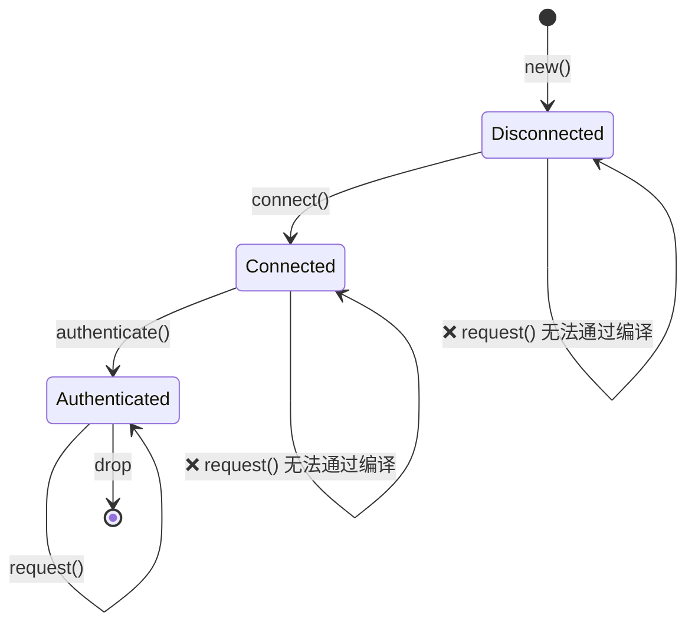
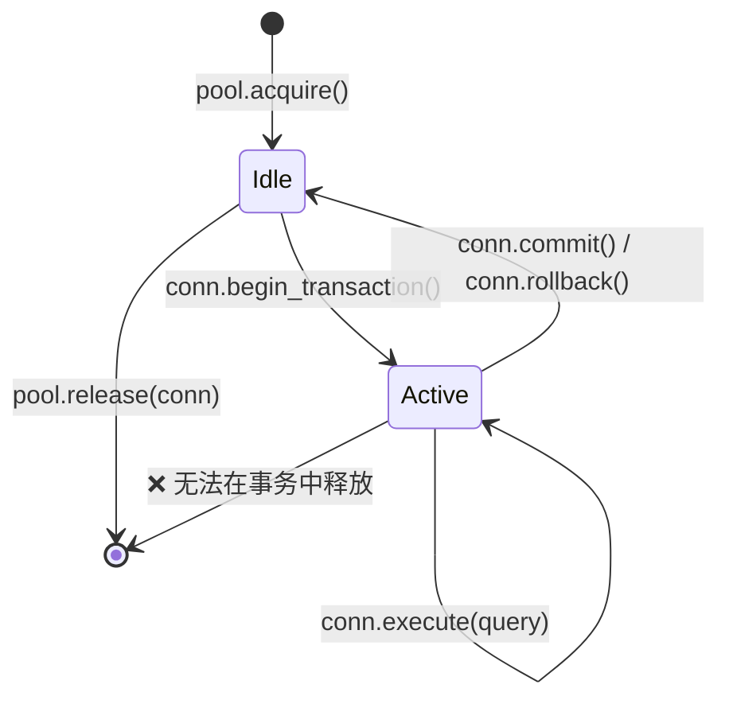
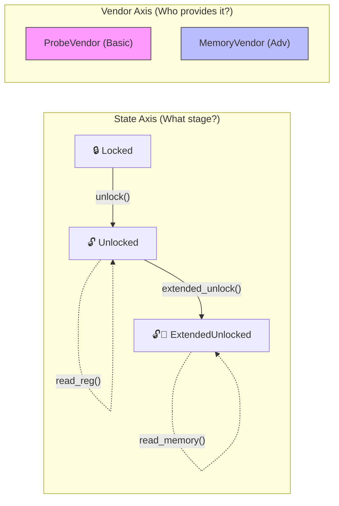

[English Original](../en/ch03-the-newtype-and-type-state-patterns.md)

# 第 3 章：Newtype 与类型状态 (Type-State) 模式 🟡

> **你将学到：**
> - Newtype 模式：实现零成本编译时类型安全
> - 类型状态 (Type-state) 模式：使非法状态转移不可表示 (Unrepresentable)
> - 结合类型状态的建造者 (Builder) 模式：用于编译时强制构建
> - 配置 Trait (Config trait) 模式：驯服泛型参数爆炸

## Newtype：零成本类型安全

Newtype 模式将一个已有类型封装在单字段元组结构体中，以创建一个独特的新类型，且运行时开销为零：

```rust
// 不使用 newtype —— 很容易混淆：
fn create_user(name: String, email: String, age: u32, employee_id: u32) { }
// create_user(name, email, age, id);  — 但如果我们交换了 age 和 id 呢？
// create_user(name, email, id, age);  — 编译正常，但有 Bug
 
// 使用 newtype —— 编译器会捕捉错误：
struct UserName(String);
struct Email(String);
struct Age(u32);
struct EmployeeId(u32);

fn create_user(name: UserName, email: Email, age: Age, id: EmployeeId) { }
// create_user(name, email, EmployeeId(42), Age(30));
// ❌ 编译错误：expected Age, got EmployeeId
```

### 为 Newtype 实现 `impl Deref` —— 强大但有陷阱

为 Newtype 实现 `Deref` 可以让它自动强制转换为内部类型的引用，让你“免费”获得内部类型的所有方法：

```rust
use std::ops::Deref;

struct Email(String);

impl Email {
    fn new(raw: &str) -> Result<Self, &'static str> {
        if raw.contains('@') {
            Ok(Email(raw.to_string()))
        } else {
            Err("invalid email: missing @")
        }
    }
}

impl Deref for Email {
    type Target = str;
    fn deref(&self) -> &str { &self.0 }
}

// 现在 Email 自动解引用为 &str：
let email = Email::new("user@example.com").unwrap();
println!("Length: {}", email.len()); // 通过 Deref 使用 str::len
```

这很方便 —— 但它实际上在你的 Newtype 抽象边界上 **打了一个洞**，因为目标类型上的 **每一个** 方法都变得对你的包装器可见。

#### 何时 `Deref` 是合适的

| 场景 | 示例 | 为什么没问题 |
|----------|---------|---------------|
| **智能指针包装器** | `Box<T>`, `Arc<T>`, `MutexGuard<T>` | 包装器的主要目的就是表现得像 `T` |
| **透明的“薄”包装器** | `String` → `str`, `PathBuf` → `Path`, `Vec<T>` → `[T]` | 包装器本身就是目标类型的超集 (IS-A) |
| **Newtype 确实等同于内部类型** | `struct Hostname(String)` 且你始终想要完整的字符串操作 | 限制 API 不会带来任何价值 |

#### 何时 `Deref` 是反模式

| 场景 | 问题 |
|----------|---------|
| **带有不变量的领域类型** | `Email` 解引用为 `&str`，因此调用者可以调用 `.split_at()`、`.trim()` 等方法 —— 这些都无法保证“必须包含 @”的不变量。如果有人存储了修剪后的 `&str` 并重新解构，不变量就丢失了。 |
| **想要限制 API 的类型** | 带有 `Deref<Target = str>` 的 `struct Password(String)` 会泄露 `.as_bytes()`、`.chars()` 以及 `Debug` 输出 —— 而这正是你试图隐藏的。 |
| **伪继承 (Fake inheritance)** | 使用 `Deref` 让 `ManagerWidget` 自动解引用为 `Widget` 来模拟 OOP 继承。这是明确反对的 —— 参见 Rust API 指南 (C-DEREF)。 |

> **经验法则**：如果你的 Newtype 存在是为了 **增加类型安全** 或 **限制 API**，请不要实现 `Deref`。如果它是为了在保持内部类型完整接口的同时 **增加功能**（例如智能指针），那么 `Deref` 是正确的选择。

#### `DerefMut` —— 双重风险

如果你还实现了 `DerefMut`，调用者可以直接 **修改** 内部值，从而绕过构造函数中的任何验证：

```rust
use std::ops::{Deref, DerefMut};

struct PortNumber(u16);

impl Deref for PortNumber {
    type Target = u16;
    fn deref(&self) -> &u16 { &self.0 }
}

impl DerefMut for PortNumber {
    fn deref_mut(&mut self) -> &mut u16 { &mut self.0 }
}

let mut port = PortNumber(443);
*port = 0; // 绕过了任何验证 —— 现在是一个无效的端口
```

只有当内部类型没有需要保护的不变量时，才实现 `DerefMut`。

#### 优先选择显式委托 (Explicit Delegation)

当你只需要内部类型的 **部分** 方法时，请进行显式委托：

```rust
struct Email(String);

impl Email {
    fn new(raw: &str) -> Result<Self, &'static str> {
        if raw.contains('@') { Ok(Email(raw.to_string())) }
        else { Err("missing @") }
    }

    // 仅暴露合理的部分：
    pub fn as_str(&self) -> &str { &self.0 }
    pub fn len(&self) -> usize { self.0.len() }
    pub fn domain(&self) -> &str {
        self.0.split('@').nth(1).unwrap_or("")
    }
    // .split_at(), .trim(), .replace() — 不暴露
}
```

#### Clippy 与生态系统

- **`clippy::wrong_self_convention`** 可能会在 `Deref` 强制转换导致方法解析结果出乎意料时触发（例如，`is_empty()` 解析到了内部类型的版本，而不是你打算遮蔽的版本）。
- **Rust API 指南** (C-DEREF) 指出：*“只有智能指针应该实现 `Deref`。”* 请将其作为强有力的默认规则；只有在有明确理由时才偏离。
- 如果你需要 Trait 兼容性（例如将 `Email` 传递给预期 `&str` 的函数），请考虑实现 `AsRef<str>` 和 `Borrow<str>` —— 它们是显式转换，没有自动类型转换带来的意外。

#### 决策矩阵

```text
你是否希望内部类型的所有方法都可调用？
  ├─ 是 → 你的类型是否强制执行不变量或限制了 API？
  │    ├─ 否  → 实现 Deref ✅ (智能指针 / 透明包装器)
  │    └─ 是 → 不要实现 Deref ❌ (不变量泄露)
  └─ 否  → 不要实现 Deref ❌ (使用 AsRef / 显式委托)
```

### 类型状态 (Type-State)：编译时协议强制执行

类型状态模式利用类型系统来强制要求操作按正确顺序发生。使非法状态变得 **不可表示 (Unrepresentable)**。



> 每次转换都会 **消耗 (consume)** `self` 并返回一个新类型 —— 编译器以此强制执行有效的顺序。

```rust
// 问题：一个网络连接必须按以下步骤：
// 1. 创建 (Created)
// 2. 连接 (Connected)
// 3. 身份验证 (Authenticated)
// 4. 然后用于请求 (Request)
// 在 authenticate() 之前调用 request() 应该是一个编译错误。

// --- 类型状态标记 (零大小类型/ZSTs) ---
struct Disconnected;
struct Connected;
struct Authenticated;

// --- 由状态参数化的连接结构体 ---
struct Connection<State> {
    address: String,
    _state: std::marker::PhantomData<State>,
}

// 只有已断开 (Disconnected) 的连接可以进行 connect：
impl Connection<Disconnected> {
    fn new(address: &str) -> Self {
        Connection {
            address: address.to_string(),
            _state: std::marker::PhantomData,
        }
    }

    fn connect(self) -> Connection<Connected> {
        println!("Connecting to {}...", self.address);
        Connection {
            address: self.address,
            _state: std::marker::PhantomData,
        }
    }
}

// 只有已连接 (Connected) 的连接可以进行 authenticate：
impl Connection<Connected> {
    fn authenticate(self, _token: &str) -> Connection<Authenticated> {
        println!("Authenticating...");
        Connection {
            address: self.address,
            _state: std::marker::PhantomData,
        }
    }
}

// 只有已授权 (Authenticated) 的连接可以发起 request：
impl Connection<Authenticated> {
    fn request(&self, path: &str) -> String {
        format!("GET {} from {}", path, self.address)
    }
}

fn main() {
    let conn = Connection::new("api.example.com");
    // conn.request("/data"); // ❌ 编译错误：Connection<Disconnected> 没有 `request` 方法

    let conn = conn.connect();
    // conn.request("/data"); // ❌ 编译错误：Connection<Connected> 没有 `request` 方法

    let conn = conn.authenticate("secret-token");
    let response = conn.request("/data"); // ✅ 仅在身份验证后起作用
    println!("{response}");
}
```

> **关键洞察**：每次状态转换都会 **消耗** `self` 并返回一个新类型。
> 你在状态转换后无法使用旧状态 —— 编译器强制执行了这一点。
> **零运行时开销** —— `PhantomData` 是零大小的，状态信息在编译时被擦除。

**对比 C++/C#**：在 C++ 或 C# 中，你会通过运行时检查（例如 `if (!authenticated) throw ...`）来强制执行此操作。Rust 的类型状态模式将这些检查移至编译时 —— 非法状态在类型系统中确实无法表示。

### 结合类型状态的建造者 (Builder) 模式

一个实际应用 —— 一个强制要求提供必要字段的建造者：

```rust
use std::marker::PhantomData;

// 必要字段的标记类型
struct NeedsName;
struct NeedsPort;
struct Ready;

struct ServerConfig<State> {
    name: Option<String>,
    port: Option<u16>,
    max_connections: usize, // 可选，有默认值
    _state: PhantomData<State>,
}

impl ServerConfig<NeedsName> {
    fn new() -> Self {
        ServerConfig {
            name: None,
            port: None,
            max_connections: 100,
            _state: PhantomData,
        }
    }

    fn name(self, name: &str) -> ServerConfig<NeedsPort> {
        ServerConfig {
            name: Some(name.to_string()),
            port: self.port,
            max_connections: self.max_connections,
            _state: PhantomData,
        }
    }
}

impl ServerConfig<NeedsPort> {
    fn port(self, port: u16) -> ServerConfig<Ready> {
        ServerConfig {
            name: self.name,
            port: Some(port),
            max_connections: self.max_connections,
            _state: PhantomData,
        }
    }
}

impl ServerConfig<Ready> {
    fn max_connections(mut self, n: usize) -> Self {
        self.max_connections = n;
        self
    }

    fn build(self) -> Server {
        Server {
            name: self.name.unwrap(),
            port: self.port.unwrap(),
            max_connections: self.max_connections,
        }
    }
}

struct Server {
    name: String,
    port: u16,
    max_connections: usize,
}

fn main() {
    // 必须提供名称，然后是端口，最后才能进行 build：
    let server = ServerConfig::new()
        .name("my-server")
        .port(8080)
        .max_connections(500)
        .build();

    // ServerConfig::new().port(8080); // ❌ 编译错误：NeedsName 没有 `port` 方法
    // ServerConfig::new().name("x").build(); // ❌ 编译错误：NeedsPort 没有 `build` 方法
}
```

***

## 案例研究：类型安全的连接池

现实世界的系统需要连接池，其中连接在定义良好的状态之间移动。以下是类型状态模式如何在生产级连接池中强制执行正确性的：



```rust
use std::marker::PhantomData;

// 状态
struct Idle;
struct InTransaction;

struct PooledConnection<State> {
    id: u32,
    _state: PhantomData<State>,
}

struct Pool {
    next_id: u32,
}

impl Pool {
    fn new() -> Self { Pool { next_id: 0 } }

    fn acquire(&mut self) -> PooledConnection<Idle> {
        self.next_id += 1;
        println!("[pool] Acquired connection #{}", self.next_id);
        PooledConnection { id: self.next_id, _state: PhantomData }
    }

    // 只有空闲连接可以被释放 —— 防止事务中途泄露
    fn release(&self, conn: PooledConnection<Idle>) {
        println!("[pool] Released connection #{}", conn.id);
    }
}

impl PooledConnection<Idle> {
    fn begin_transaction(self) -> PooledConnection<InTransaction> {
        println!("[conn #{}] BEGIN", self.id);
        PooledConnection { id: self.id, _state: PhantomData }
    }
}

impl PooledConnection<InTransaction> {
    fn execute(&self, query: &str) {
        println!("[conn #{}] EXEC: {}", self.id, query);
    }

    fn commit(self) -> PooledConnection<Idle> {
        println!("[conn #{}] COMMIT", self.id);
        PooledConnection { id: self.id, _state: PhantomData }
    }

    fn rollback(self) -> PooledConnection<Idle> {
        println!("[conn #{}] ROLLBACK", self.id);
        PooledConnection { id: self.id, _state: PhantomData }
    }
}

fn main() {
    let mut pool = Pool::new();

    let conn = pool.acquire();
    let conn = conn.begin_transaction();
    conn.execute("INSERT INTO users VALUES ('Alice')");
    conn.execute("INSERT INTO orders VALUES (1, 42)");
    let conn = conn.commit(); // 回到空闲 (Idle)
    pool.release(conn);       // ✅ 仅对空闲连接有效

    // pool.release(conn_active); // ❌ 编译错误：无法在 InTransaction 状态下释放
}
```

**为什么这在生产环境中重要**：在事务中途泄露的连接会无限期地持有数据库锁。类型状态模式使这种情况变得不可能实现 —— 在事务被提交或回滚之前，你确实无法将连接归还给连接池。

***

## 配置 Trait (Config Trait) 模式 —— 驯服泛型参数爆炸

### 问题描述

随着一个结构体承担更多的职责，且由于每一个职责都对应一个受 Trait 约束的泛型，其类型签名会变得极其臃肿：

```rust
trait SpiBus   { fn spi_transfer(&self, tx: &[u8], rx: &mut [u8]) -> Result<(), BusError>; }
trait ComPort  { fn com_send(&self, data: &[u8]) -> Result<usize, BusError>; }
trait I3cBus   { fn i3c_read(&self, addr: u8, buf: &mut [u8]) -> Result<(), BusError>; }
trait SmBus    { fn smbus_read_byte(&self, addr: u8, cmd: u8) -> Result<u8, BusError>; }
trait GpioBus  { fn gpio_set(&self, pin: u32, high: bool); }

// ❌ 每一个新增的总线 Trait 都会增加一个泛型参数
struct DiagController<S: SpiBus, C: ComPort, I: I3cBus, M: SmBus, G: GpioBus> {
    spi: S,
    com: C,
    i3c: I,
    smbus: M,
    gpio: G,
}
// impl 块、函数签名和调用方都必须重复这一长串列表。
// 增加第 6 个总线意味着要修改 DiagController<S, C, I, M, G> 的每一处引用。
```

这通常被称为 **“泛型参数爆炸”**。由于每一个环节都必须重复完整的参数列表，其影响在 `impl` 块、函数参数和下游消费者中会不断叠加。

### 解决方案：配置 Trait

将所有关联类型打包到一个单一的 Trait 中。这样，无论包含多少个组件类型，结构体都只需要 **一个** 泛型参数：

```rust
#[derive(Debug)]
enum BusError {
    Timeout,
    NakReceived,
    HardwareFault(String),
}

// --- 总线 Trait (保持不变) ---
trait SpiBus {
    fn spi_transfer(&self, tx: &[u8], rx: &mut [u8]) -> Result<(), BusError>;
    fn spi_write(&self, data: &[u8]) -> Result<(), BusError>;
}

trait ComPort {
    fn com_send(&self, data: &[u8]) -> Result<usize, BusError>;
    fn com_recv(&self, buf: &mut [u8], timeout_ms: u32) -> Result<usize, BusError>;
}

trait I3cBus {
    fn i3c_read(&self, addr: u8, buf: &mut [u8]) -> Result<(), BusError>;
    fn i3c_write(&self, addr: u8, data: &[u8]) -> Result<(), BusError>;
}

// --- 配置 Trait：每个组件对应一个关联类型 ---
trait BoardConfig {
    type Spi: SpiBus;
    type Com: ComPort;
    type I3c: I3cBus;
}

// --- DiagController 现在只有唯一一个泛型参数 ---
struct DiagController<Cfg: BoardConfig> {
    spi: Cfg::Spi,
    com: Cfg::Com,
    i3c: Cfg::I3c,
}
```

`DiagController<Cfg>` 永远不会再增加多余的泛型参数。
增加第 4 个总线只需向 `BoardConfig` 添加一个关联类型，并向 `DiagController` 添加一个字段 —— 下游的所有签名均无需修改。

### 实现控制器

```rust
impl<Cfg: BoardConfig> DiagController<Cfg> {
    fn new(spi: Cfg::Spi, com: Cfg::Com, i3c: Cfg::I3c) -> Self {
        DiagController { spi, com, i3c }
    }

    fn read_flash_id(&self) -> Result<u32, BusError> {
        let cmd = [0x9F]; // JEDEC Read ID
        let mut id = [0u8; 4];
        self.spi.spi_transfer(&cmd, &mut id)?;
        Ok(u32::from_be_bytes(id))
    }

    fn send_bmc_command(&self, cmd: &[u8]) -> Result<Vec<u8>, BusError> {
        self.com.com_send(cmd)?;
        let mut resp = vec![0u8; 256];
        let n = self.com.com_recv(&mut resp, 1000)?;
        resp.truncate(n);
        Ok(resp)
    }

    fn read_sensor_temp(&self, sensor_addr: u8) -> Result<i16, BusError> {
        let mut buf = [0u8; 2];
        self.i3c.i3c_read(sensor_addr, &mut buf)?;
        Ok(i16::from_be_bytes(buf))
    }

    fn run_full_diag(&self) -> Result<DiagReport, BusError> {
        let flash_id = self.read_flash_id()?;
        let bmc_resp = self.send_bmc_command(b"VERSION\n")?;
        let cpu_temp = self.read_sensor_temp(0x48)?;
        let gpu_temp = self.read_sensor_temp(0x49)?;

        Ok(DiagReport {
            flash_id,
            bmc_version: String::from_utf8_lossy(&bmc_resp).to_string(),
            cpu_temp_c: cpu_temp,
            gpu_temp_c: gpu_temp,
        })
    }
}

#[derive(Debug)]
struct DiagReport {
    flash_id: u32,
    bmc_version: String,
    cpu_temp_c: i16,
    gpu_temp_c: i16,
}
```

### 生产环境接入

通过一个 `impl BoardConfig` 来选择具体的硬件驱动：

```rust
struct PlatformSpi  { dev: String, speed_hz: u32 }
struct UartCom      { dev: String, baud: u32 }
struct LinuxI3c     { dev: String }

impl SpiBus for PlatformSpi {
    fn spi_transfer(&self, tx: &[u8], rx: &mut [u8]) -> Result<(), BusError> {
        // 在生产环境中使用 ioctl(SPI_IOC_MESSAGE)
        rx[0..4].copy_from_slice(&[0xEF, 0x40, 0x18, 0x00]);
        Ok(())
    }
    fn spi_write(&self, _data: &[u8]) -> Result<(), BusError> { Ok(()) }
}

impl ComPort for UartCom {
    fn com_send(&self, _data: &[u8]) -> Result<usize, BusError> { Ok(0) }
    fn com_recv(&self, buf: &mut [u8], _timeout: u32) -> Result<usize, BusError> {
        let resp = b"BMC v2.4.1\n";
        buf[..resp.len()].copy_from_slice(resp);
        Ok(resp.len())
    }
}

impl I3cBus for LinuxI3c {
    fn i3c_read(&self, _addr: u8, buf: &mut [u8]) -> Result<(), BusError> {
        buf[0] = 0x00; buf[1] = 0x2D; // 45°C
        Ok(())
    }
    fn i3c_write(&self, _addr: u8, _data: &[u8]) -> Result<(), BusError> { Ok(()) }
}

// ✅ 一个结构体，一个实现 —— 所有的具体类型都在这里确定
struct ProductionBoard;
impl BoardConfig for ProductionBoard {
    type Spi = PlatformSpi;
    type Com = UartCom;
    type I3c = LinuxI3c;
}

fn main() {
    let ctrl = DiagController::<ProductionBoard>::new(
        PlatformSpi { dev: "/dev/spidev0.0".into(), speed_hz: 10_000_000 },
        UartCom     { dev: "/dev/ttyS0".into(),     baud: 115200 },
        LinuxI3c    { dev: "/dev/i3c-0".into() },
    );
    let report = ctrl.run_full_diag().unwrap();
    println!("{report:#?}");
}
```

### 使用 Mock 进行测试接入

通过定义不同的 `BoardConfig` 来直接切换整个硬件层：

```rust
struct MockSpi  { flash_id: [u8; 4] }
struct MockCom  { response: Vec<u8> }
struct MockI3c  { temps: std::collections::HashMap<u8, i16> }

impl SpiBus for MockSpi {
    fn spi_transfer(&self, _tx: &[u8], rx: &mut [u8]) -> Result<(), BusError> {
        rx[..4].copy_from_slice(&self.flash_id);
        Ok(())
    }
    fn spi_write(&self, _data: &[u8]) -> Result<(), BusError> { Ok(()) }
}

impl ComPort for MockCom {
    fn com_send(&self, _data: &[u8]) -> Result<usize, BusError> { Ok(0) }
    fn com_recv(&self, buf: &mut [u8], _timeout: u32) -> Result<usize, BusError> {
        let n = self.response.len().min(buf.len());
        buf[..n].copy_from_slice(&self.response[..n]);
        Ok(n)
    }
}

impl I3cBus for MockI3c {
    fn i3c_read(&self, addr: u8, buf: &mut [u8]) -> Result<(), BusError> {
        let temp = self.temps.get(&addr).copied().unwrap_or(0);
        buf[..2].copy_from_slice(&temp.to_be_bytes());
        Ok(())
    }
    fn i3c_write(&self, _addr: u8, _data: &[u8]) -> Result<(), BusError> { Ok(()) }
}

struct TestBoard;
impl BoardConfig for TestBoard {
    type Spi = MockSpi;
    type Com = MockCom;
    type I3c = MockI3c;
}

#[cfg(test)]
mod tests {
    use super::*;

    fn make_test_controller() -> DiagController<TestBoard> {
        let mut temps = std::collections::HashMap::new();
        temps.insert(0x48, 45i16);
        temps.insert(0x49, 72i16);

        DiagController::<TestBoard>::new(
            MockSpi  { flash_id: [0xEF, 0x40, 0x18, 0x00] },
            MockCom  { response: b"BMC v2.4.1\n".to_vec() },
            MockI3c  { temps },
        )
    }

    #[test]
    fn test_flash_id() {
        let ctrl = make_test_controller();
        assert_eq!(ctrl.read_flash_id().unwrap(), 0xEF401800);
    }

    #[test]
    fn test_sensor_temps() {
        let ctrl = make_test_controller();
        assert_eq!(ctrl.read_sensor_temp(0x48).unwrap(), 45);
        assert_eq!(ctrl.read_sensor_temp(0x49).unwrap(), 72);
    }

    #[test]
    fn test_full_diag() {
        let ctrl = make_test_controller();
        let report = ctrl.run_full_diag().unwrap();
        assert_eq!(report.flash_id, 0xEF401800);
        assert_eq!(report.cpu_temp_c, 45);
        assert_eq!(report.gpu_temp_c, 72);
        assert!(report.bmc_version.contains("2.4.1"));
    }
}
```

### 未来添加新总线

当你需要第 4 个总线时，只有两个地方会变动 —— `BoardConfig` 和 `DiagController`。
**下游签名无需变动。** 泛型参数的数量依然保持为一：

```rust
trait SmBus {
    fn smbus_read_byte(&self, addr: u8, cmd: u8) -> Result<u8, BusError>;
}

// 1. 添加一个关联类型：
trait BoardConfig {
    type Spi: SpiBus;
    type Com: ComPort;
    type I3c: I3cBus;
    type Smb: SmBus;     // ← 新增
}

// 2. 添加一个字段：
struct DiagController<Cfg: BoardConfig> {
    spi: Cfg::Spi,
    com: Cfg::Com,
    i3c: Cfg::I3c,
    smb: Cfg::Smb,       // ← 新增
}

// 3. 在每一个配置实现中提供具体类型：
impl BoardConfig for ProductionBoard {
    type Spi = PlatformSpi;
    type Com = UartCom;
    type I3c = LinuxI3c;
    type Smb = LinuxSmbus; // ← 新增
}
```

### 何时使用此模式

| 场景 | 是否使用配置 Trait？ | 替代方案 |
|-----------|:-:|---|
| 一个结构体上有 3 个以上受 Trait 约束的泛型 | ✅ 是 | — |
| 需要切换整个硬件/平台层 | ✅ 是 | — |
| 仅有 1-2 个泛型 | ❌ 过度设计 | 直接使用泛型 |
| 需要运行时多态 | ❌ | `dyn Trait` 对象 |
| 开放式插件系统 | ❌ | 类型映射 / `Any` |
| 组件 Trait 构成了一个自然的逻辑组 (board, platform) | ✅ 是 | — |

### 关键特性

- **永远只有一个泛型参数** —— `DiagController<Cfg>` 永远不会获得更多 `<A, B, C, ...>` 泛型。
- **完全静态分发** —— 没有虚函数表 (vtables)，没有 `dyn`，没有 Trait 对象的堆分配。
- **整洁的测试切换** —— 定义带有 mock 实现的 `TestBoard`，且零条件编译。
- **编译时安全** —— 遗漏关联类型会导致编译错误，而不是运行时崩溃。
- **经过实战检验** —— 这是 Substrate/Polkadot 的 FRAME 系统用来通过一个单一 `Config` Trait 管理 20 多个关联类型的模式。

> **关键要点 —— Newtype 与类型状态**
> - Newtype 以零运行时成本提供编译时类型 safety。
> - 类型状态模式使非法状态转移成为编译错误，而非运行时 Bug。
> - 配置 Trait 可以在大型系统中驯服泛型参数爆炸。

> **另请参阅：** [第 4 章 —— PhantomData](ch04-phantomdata-types-that-carry-no-data.md) 了解驱动类型状态模式的零大小标记。[第 2 章 —— 深入 Trait](ch02-traits-in-depth.md) 了解配置 Trait 模式中使用的关联类型。

***

## 案例研究：双轴类型状态 (Dual-Axis Typestate) —— 厂商 × 协议状态

上述模式每次处理一个轴线：类型状态强制执行 **协议顺序**，而 Trait 抽象处理 **多个厂商**。现实系统往往需要 **同时处理两者**：一个包装器 `Handle<Vendor, State>`，其可用方法取决于 **插入了哪个厂商** 且 **该句柄处于哪个状态**。

本节展示了 **双轴条件实现 (Dual-Axis Conditional `impl`)** 模式 —— 其中 `impl` 块同时受厂商 Trait 约束和状态标记 Trait 约束。

### 二维问题描述

考虑一个调试探针接口 (JTAG/SWD)。多个厂商制造探针，每个探针在寄存器可访问之前都必须解锁。某些厂商额外支持直接内存读取 —— 但仅在执行了 *扩展解锁* 之后：



其挑战在于：**完全在编译时** 表达此矩阵，并使用静态分发，使得在基础探针上调用 `extended_unlock()` 或在未执行扩展解锁的句柄上调用 `read_memory()` 都会产生编译错误。

### 解决方案：带有标记 Trait 的 `Jtag<V, S>`

**第一步 —— 状态令牌与能力标记：**

```rust
use std::marker::PhantomData;

// 零大小的状态令牌 —— 无运行时开销
struct Locked;
struct Unlocked;
struct ExtendedUnlocked;

// 标记 Trait 表达每个状态具备哪些能力
trait HasRegAccess {}
impl HasRegAccess for Unlocked {}
impl HasRegAccess for ExtendedUnlocked {}

trait HasMemAccess {}
impl HasMemAccess for ExtendedUnlocked {}
```

> **为什么使用标记 Trait 而非具体状态？**
> 编写 `impl<V, S: HasRegAccess> Jtag<V, S>` 意味着 `read_reg()` 可以在 **任何** 具备寄存器访问能力的状态下工作 —— 现在是 `Unlocked` 和 `ExtendedUnlocked`，但如果你明天增加了 `DebugHalted` 状态，只需添加一行：`impl HasRegAccess for DebugHalted {}` 即可。

**第二步 —— 厂商 Trait (原始操作)：**

```rust
// 每个探针厂商都实现这些
trait JtagVendor {
    fn raw_unlock(&mut self);
    fn raw_read_reg(&self, addr: u32) -> u32;
    fn raw_write_reg(&mut self, addr: u32, val: u32);
}

// 具备内存访问能力的厂商还需实现此 Super-trait
trait JtagMemoryVendor: JtagVendor {
    fn raw_extended_unlock(&mut self);
    fn raw_read_memory(&self, addr: u64, buf: &mut [u8]);
    fn raw_write_memory(&mut self, addr: u64, data: &[u8]);
}
```

**第三步 —— 带有条件 `impl` 块的包装器：**

```rust
struct Jtag<V, S = Locked> {
    vendor: V,
    _state: PhantomData<S>,
}

// 构建 —— 初始状态始终为 Locked
impl<V: JtagVendor> Jtag<V, Locked> {
    fn new(vendor: V) -> Self {
        Jtag { vendor, _state: PhantomData }
    }

    fn unlock(mut self) -> Jtag<V, Unlocked> {
        self.vendor.raw_unlock();
        Jtag { vendor: self.vendor, _state: PhantomData }
    }
}

// 寄存器 I/O —— 任何厂商，在任何具备 HasRegAccess 的状态下
impl<V: JtagVendor, S: HasRegAccess> Jtag<V, S> {
    fn read_reg(&self, addr: u32) -> u32 {
        self.vendor.raw_read_reg(addr)
    }
    fn write_reg(&mut self, addr: u32, val: u32) {
        self.vendor.raw_write_reg(addr, val);
    }
}

// 扩展解锁 —— 仅限具备内存能力的厂商，且仅能从 Unlocked 状态发起
impl<V: JtagMemoryVendor> Jtag<V, Unlocked> {
    fn extended_unlock(mut self) -> Jtag<V, ExtendedUnlocked> {
        self.vendor.raw_extended_unlock();
        Jtag { vendor: self.vendor, _state: PhantomData }
    }
}

// 内存 I/O —— 仅限具备内存能力的厂商，且仅在 ExtendedUnlocked 状态下
impl<V: JtagMemoryVendor, S: HasMemAccess> Jtag<V, S> {
    fn read_memory(&self, addr: u64, buf: &mut [u8]) {
        self.vendor.raw_read_memory(addr, buf);
    }
    fn write_memory(&mut self, addr: u64, data: &[u8]) {
        self.vendor.raw_write_memory(addr, data);
    }
}
```

### 编译器会阻止什么

| 尝试操作 | 错误信息 | 原因 |
|---------|-------|-----|
| `Jtag<_, Locked>::read_reg()` | no method `read_reg` | `Locked` 未实现 `HasRegAccess` |
| `Jtag<BasicProbe, _>::extended_unlock()` | no method `extended_unlock` | `BasicProbe` 未实现 `JtagMemoryVendor` |
| `Jtag<_, Unlocked>::read_memory()` | no method `read_memory` | `Unlocked` 未实现 `HasMemAccess` |
| 调用 `unlock()` 两次 | value used after move | `unlock()` 消耗了 `self` |

所有这些错误都会被 **编译器捕获**。没有运行时恐慌，没有 `Option`，也没有运行时状态枚举。

### 编写泛型函数

函数只需绑定它们关心的轴：

```rust
/// 适用于任何厂商、任何授权寄存器访问的状态。
fn read_idcode<V: JtagVendor, S: HasRegAccess>(jtag: &Jtag<V, S>) -> u32 {
    jtag.read_reg(0x00)
}

/// 仅能针对具备内存能力的厂商在 ExtendedUnlocked 状态下编译。
fn dump_firmware<V: JtagMemoryVendor, S: HasMemAccess>(jtag: &Jtag<V, S>) {
    let mut buf = [0u8; 256];
    jtag.read_memory(0x0800_0000, &mut buf);
}
```

### 跨领域同类模式：存储后端 (Storage Backends)

双轴技术并非硬件专用。以下是存储层的相同结构，其中某些后端支持事务：

```rust
// 状态
struct Closed;
struct Open;
struct InTransaction;

trait HasReadWrite {}
impl HasReadWrite for Open {}
impl HasReadWrite for InTransaction {}

// 厂商 Trait
trait StorageBackend {
    fn raw_open(&mut self);
    fn raw_read(&self, key: &[u8]) -> Option<Vec<u8>>;
    fn raw_write(&mut self, key: &[u8], value: &[u8]);
}

trait TransactionalBackend: StorageBackend {
    fn raw_begin(&mut self);
    fn raw_commit(&mut self);
    fn raw_rollback(&mut self);
}

// 包装器
struct Store<B, S = Closed> { backend: B, _s: PhantomData<S> }

impl<B: StorageBackend> Store<B, Closed> {
    fn open(mut self) -> Store<B, Open> { self.backend.raw_open(); todo!() }
}
impl<B: StorageBackend, S: HasReadWrite> Store<B, S> {
    fn read(&self, key: &[u8]) -> Option<Vec<u8>>  { self.backend.raw_read(key) }
    fn write(&mut self, key: &[u8], val: &[u8])    { self.backend.raw_write(key, val) }
}
impl<B: TransactionalBackend> Store<B, Open> {
    fn begin(mut self) -> Store<B, InTransaction>   { todo!() }
}
```

平面文件 (Flat-file) 后端仅实现 `StorageBackend` —— `begin()` 将无法通过编译。数据库后端则增加了 `TransactionalBackend` —— 于是 `Open → InTransaction → Open` 的完整周期变得可用。

### 何时采用此模式

| 信号 | 为什么双轴模式适用 |
|--------|--------------------|
| 存在两个独立的轴：“谁提供它”和“它处于什么状态” | `impl` 块矩阵直接对两者进行编码 |
| 某些提供者具备比其他提供者更多的能力 | Super-trait + 条件 `impl` |
| 误用状态或能力会导致安全/正确性 Bug | 编译时预防 > 运行时检查 |
| 你追求静态分发 (无虚函数表 vtables) | `PhantomData` + 泛型 = 零开销 |

> **关键要点**：双轴模式是类型状态 (Typestate) 与基于 Trait 抽象的交汇。每个 `impl` 块映射到 (厂商 × 状态) 矩阵的一个单元格。编译器强制执行整个矩阵 —— 无运行时状态检查，无非法状态恐慌，且零成本。

---

### 练习：类型安全状态机 ★★ (~30 分钟)

使用类型状态模式构建一个红绿灯状态机。灯光必须按照 `红 -> 绿 -> 黄 -> 红` 的顺序转换，且不允许任何其他顺序。

<details>
<summary>🔑 参考答案</summary>

```rust
use std::marker::PhantomData;

struct Red;
struct Green;
struct Yellow;

struct TrafficLight<State> {
    _state: PhantomData<State>,
}

impl TrafficLight<Red> {
    fn new() -> Self {
        println!("🔴 红灯 — 停止");
        TrafficLight { _state: PhantomData }
    }

    fn go(self) -> TrafficLight<Green> {
        println!("🟢 绿灯 — 行进");
        TrafficLight { _state: PhantomData }
    }
}

impl TrafficLight<Green> {
    fn caution(self) -> TrafficLight<Yellow> {
        println!("🟡 黄灯 — 注意");
        TrafficLight { _state: PhantomData }
    }
}

impl TrafficLight<Yellow> {
    fn stop(self) -> TrafficLight<Red> {
        println!("🔴 红灯 — 停止");
        TrafficLight { _state: PhantomData }
    }
}

fn main() {
    let light = TrafficLight::new(); // 红灯
    let light = light.go();          // 绿灯
    let light = light.caution();     // 黄灯
    let _light = light.stop();       // 红灯

    // light.caution(); // ❌ 编译错误：Red 状态没有 `caution` 方法
    // TrafficLight::new().stop(); // ❌ 编译错误：Red 状态没有 `stop` 方法
}
```

**关键要点**：非法转换是编译错误，而非运行时崩溃。

</details>

***
