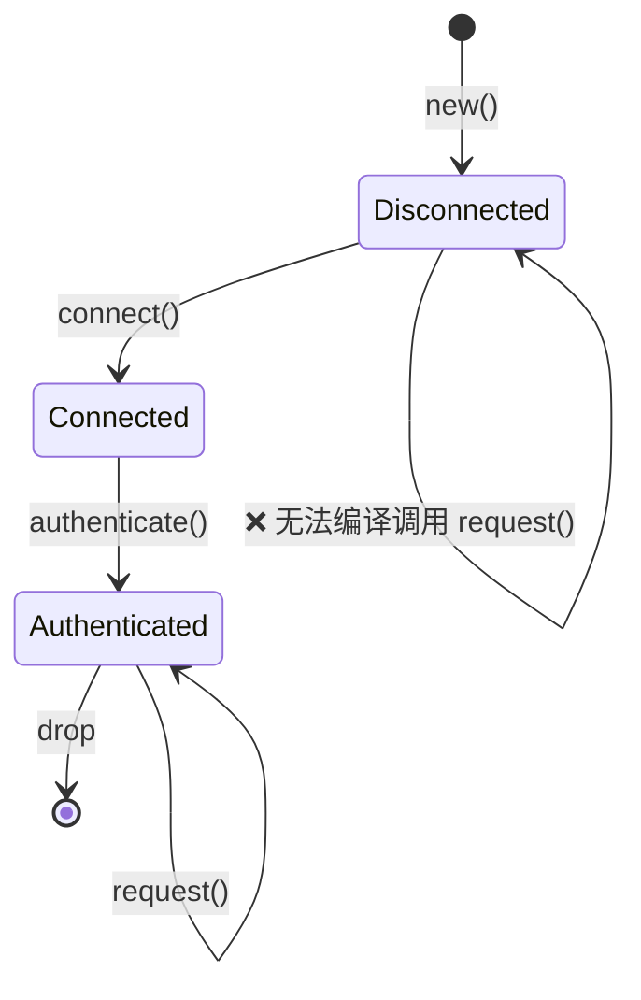

# 3. Newtype 与类型状态 (Type-State) 模式 🟡

> **你将学到：**
> - 用于零成本编译时类型安全性的 Newtype 模式
> - 类型状态模式：使非法的状态转换变得无法表示
> - 结合类型状态的 Builder 模式，用于编译时强制执行的构建过程
> - 用于治理泛型参数爆炸的 Config trait 模式

## Newtype：零成本类型安全

Newtype 模式将现有类型包装在单字段元组结构体中，以创建一种具有零运行时开销的独特类型：

```rust
// 不使用 Newtype —— 很容易混淆：
fn create_user(name: String, email: String, age: u32, id: u32) { }
// create_user(name, email, id, age);  — 编译正常，但存在 BUG

// 使用 Newtype —— 编译器会捕获错误：
struct UserName(String);
struct Email(String);
struct Age(u32);
struct EmployeeId(u32);

fn create_user(name: UserName, email: Email, age: Age, id: EmployeeId) { }
// create_user(name, email, EmployeeId(42), Age(30));
// ❌ 编译错误：期望 Age 类型，得到的是 EmployeeId 类型
```

### `Deref` 的陷阱

为你的 Newtype 实现 `Deref` 会使其表现得像内部类型一样。这虽然方便，但会 **泄露内部 API**。

- **应该**：为智能指针 (`Box`, `Arc`) 实现 `Deref`。
- **不应该**：为具有不变性的领域类型（如 `Email` 或 `Password`）实现 `Deref`。反之，应使用显式方法。

---

## 类型状态模式：通过设计确保正确性

类型状态模式利用类型系统来强制操作按正确的顺序发生。无效的状态变得 **无法表示**。



### 核心实现

```rust
struct Disconnected;
struct Connected;
struct Authenticated;

struct Connection<State> {
    _state: std::marker::PhantomData<State>,
}

impl Connection<Disconnected> {
    fn new() -> Self { Connection { _state: std::marker::PhantomData } }
    fn connect(self) -> Connection<Connected> { Connection { _state: std::marker::PhantomData } }
}

impl Connection<Connected> {
    fn authenticate(self) -> Connection<Authenticated> { Connection { _state: std::marker::PhantomData } }
}

impl Connection<Authenticated> {
    fn request(&self) { /* ... */ }
}
```

---

## Config Trait 模式：治理泛型爆炸

当一个结构体具有过多的泛型参数时，可以将它们捆绑到一个带有关联类型的单个 `Config` trait 中。

```rust
// ❌ 参数爆炸，难以维护
struct Controller<S: Spi, I: I2c, G: Gpio, U: Uart> { ... }

// ✅ 清洁且稳定
trait BoardConfig {
    type Spi: Spi;
    type I2c: I2c;
    type Gpio: Gpio;
    type Uart: Uart;
}

struct Controller<T: BoardConfig> {
    spi: T::Spi,
    i2c: T::I2c,
    // ...
}
```

即使你在系统中添加更多组件，这种模式也能保持你的类型签名清洁且稳定。

***
