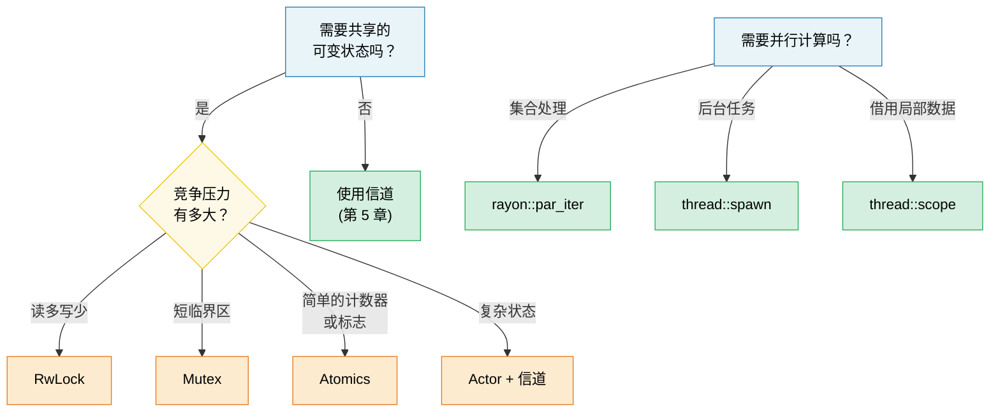

[English Original](../en/ch06-concurrency-vs-parallelism-vs-threads.md)

# 第 6 章：并发 (Concurrency) vs 并行 (Parallelism) vs 线程 🟡

> **你将学到：**
> - 并发与并行之间的准确区别
> - OS 线程、作用域线程 (Scoped Threads) 以及用于数据并行的 rayon
> - 共享状态原语：Arc, Mutex, RwLock, Atomics, Condvar
> - 使用 OnceLock/LazyLock 的延迟初始化以及无锁 (Lock-free) 模式

## 术语：并发 ≠ 并行

这两个术语经常被混淆。以下是它们的准确区别：

| | 并发 (Concurrency) | 并行 (Parallelism) |
|---|---|---|
| **定义** | 管理多个可以同时推进的任务 | 同时执行多个任务 |
| **硬件要求** | 单核即可 | 需要多个核心 |
| **类比** | 一个厨师，同时做几道菜（在它们之间切换） | 多个厨师，每人负责一道菜 |
| **Rust 工具** | `async/await`, 信道 (channels), `select!` | `rayon`, `thread::spawn`, `par_iter()` |

```text
并发 (单核)：                         并行 (多核)：
                                      
任务 A: ██░░██░░██                   任务 A: ██████████
任务 B: ░░██░░██░░                   任务 B: ██████████
─────────────────→ 时间              ─────────────────→ 时间
(在单核上交替进行)                   (在双核上同时进行)
```

### std::thread —— OS 线程

Rust 线程与 OS 线程是 1:1 映射的。每个线程都有自己的栈（通常为 2-8 MB）：

```rust
use std::thread;
use std::time::Duration;

fn main() {
    // 派生一个线程 —— 接收一个闭包
    let handle = thread::spawn(|| {
        for i in 0..5 {
            println!("派生线程: {i}");
            thread::sleep(Duration::from_millis(100));
        }
        42 // 返回值
    });

    // 在主线程上同时进行工作
    for i in 0..3 {
        println!("主线程: {i}");
        thread::sleep(Duration::from_millis(150));
    }

    // 等待线程结束并获取其返回值
    let result = handle.join().unwrap(); // 如果线程 panic，unwrap 也会 panic
    println!("线程返回了: {result}");
}
```

**Thread::spawn 的类型要求**：

```rust
// 闭包必须满足：
// 1. Send —— 可以转移到另一个线程
// 2. 'static —— 不能从调用作用域中借用数据
// 3. FnOnce —— 获取捕获变量的所有权

let data = vec![1, 2, 3];

// ❌ 借用了数据 —— 不满足 'static
// thread::spawn(|| println!("{data:?}"));

// ✅ 将所有权移动 (move) 到线程中
thread::spawn(move || println!("{data:?}"));
// 此时在这里无法再访问 data
```

### 作用域线程 (std::thread::scope)

自 Rust 1.63 起，作用域线程解决了 `'static` 约束的问题 —— 线程可以从父作用域借用数据：

```rust
use std::thread;

fn main() {
    let mut data = vec![1, 2, 3, 4, 5];

    thread::scope(|s| {
        // 线程 1：借用共享引用
        s.spawn(|| {
            let sum: i32 = data.iter().sum();
            println!("总和: {sum}");
        });

        // 线程 2：同样借用共享引用 (多个读者 OK)
        s.spawn(|| {
            let max = data.iter().max().unwrap();
            println!("最大值: {max}");
        });

        // ❌ 当存在共享借用时尚不能进行可变借用：
        // s.spawn(|| data.push(6));
    });
    // 所有作用域线程都在此处 join —— 保证在作用域返回前完成

    // 现在进行修改是安全的 —— 所有线程都已结束
    data.push(6);
    println!("更新后: {data:?}");
}
```

> **这意义重大**：在作用域线程出现之前，你必须使用 `Arc::clone()` 克隆所有内容才能与线程共享。现在你可以直接借用，且编译器能够证明所有线程都会在数据超出作用域之前结束。

### rayon —— 数据并行

`rayon` 提供了并行迭代器，能够自动将工作分配到线程池中：

```rust,ignore
// Cargo.toml: rayon = "1"
use rayon::prelude::*;

fn main() {
    let data: Vec<u64> = (0..1_000_000).collect();

    // 串行执行：
    let sum_seq: u64 = data.iter().map(|x| x * x).sum();

    // 并行执行 —— 只需将 .iter() 改为 .par_iter()：
    let sum_par: u64 = data.par_iter().map(|x| x * x).sum();

    assert_eq!(sum_seq, sum_par);

    // 并行排序：
    let mut numbers = vec![5, 2, 8, 1, 9, 3];
    numbers.par_sort();

    // 结合 map/filter/collect 的并行处理：
    let results: Vec<_> = data
        .par_iter()
        .filter(|&&x| x % 2 == 0)
        .map(|&x| expensive_computation(x))
        .collect();
}

fn expensive_computation(x: u64) -> u64 {
    // 模拟重度 CPU 计算
    (0..1000).fold(x, |acc, _| acc.wrapping_mul(7).wrapping_add(13))
}
```

**何时使用 rayon vs 线程**：

| 用途 | 何时使用 |
|-----|------|
| `async` + `tokio` | I/O 密集型并发（网络、文件 I/O） |

### 共享状态：Arc, Mutex, RwLock, Atomics

当线程需要共享可变状态时，Rust 提供了安全的抽象：

> **注意**：在这些示例中，我们为了简明起见在 `.lock()`、`.read()` 和 `.write()` 上使用了 `.unwrap()`。只有当另一个线程在持有锁的情况下 panic（导致锁被“毒化” (poisoning)）时，这些调用才会失败。生产环境代码应决定是尝试从被毒化的锁中恢复，还是传播错误。

```rust
use std::sync::{Arc, Mutex, RwLock};
use std::sync::atomic::{AtomicU64, Ordering};
use std::thread;

// --- Arc<Mutex<T>>: 共享 + 独占访问 ---
fn mutex_example() {
    let counter = Arc::new(Mutex::new(0u64));
    let mut handles = vec![];

    for _ in 0..10 {
        let counter = Arc::clone(&counter);
        handles.push(thread::spawn(move || {
            for _ in 0..1000 {
                let mut guard = counter.lock().unwrap();
                *guard += 1;
            } // guard 被释放 → 锁被释放
        }));
    }

    for h in handles { h.join().unwrap(); }
    println!("计数器: {}", counter.lock().unwrap()); // 10000
}

// --- Arc<RwLock<T>>: 多个读者 或 一个写者 ---
fn rwlock_example() {
    let config = Arc::new(RwLock::new(String::from("初始值")));

    // 多个读者 —— 互不阻塞
    let readers: Vec<_> = (0..5).map(|id| {
        let config = Arc::clone(&config);
        thread::spawn(move || {
            let guard = config.read().unwrap();
            println!("读者 {id}: {guard}");
        })
    }).collect();

    // 写者 —— 阻塞并等待所有读者完成
    {
        let mut guard = config.write().unwrap();
        *guard = "已更新".to_string();
    }

    for r in readers { r.join().unwrap(); }
}

// --- Atomics: 对简单值的无锁操作 ---
fn atomic_example() {
    let counter = Arc::new(AtomicU64::new(0));
    let mut handles = vec![];

    for _ in 0..10 {
        let counter = Arc::clone(&counter);
        handles.push(thread::spawn(move || {
            for _ in 0..1000 {
                counter.fetch_add(1, Ordering::Relaxed);
                // 没有锁，没有互斥锁 —— 纯硬件原子指令
            }
        }));
    }

    for h in handles { h.join().unwrap(); }
    println!("原子计数器: {}", counter.load(Ordering::Relaxed)); // 10000
}
```

### 简要对比

| 原语 | 使用场景 | 开销 | 竞争情况 |
|-----------|----------|------|------------|
| `Mutex<T>` | 短临界区 | 加锁 + 解锁 | 线程排队等待 |
| `RwLock<T>` | 读多写少 | 读写锁 | 读者并发，写者独占 |
| `AtomicU64` 等 | 计数器、标志 | 硬件 CAS | 无锁 —— 无需等待 |
| 信道 (Channels) | 消息传递 | 队列操作 | 生产者/消费者解耦 |

### 条件变量 (`Condvar`)

`Condvar` 允许线程 **等待 (wait)** 直到另一个线程发出某个条件为真的信号，而无需忙轮询。它总是与一个 `Mutex` 配合使用：

```rust
use std::sync::{Arc, Mutex, Condvar};
use std::thread;

let pair = Arc::new((Mutex::new(false), Condvar::new()));
let pair2 = Arc::clone(&pair);

// 派生线程：等待 ready == true
let handle = thread::spawn(move || {
    let (lock, cvar) = &*pair2;
    let mut ready = lock.lock().unwrap();
    while !*ready {
        ready = cvar.wait(ready).unwrap(); // 原子性解锁 + 进入睡眠
    }
    println!("工作线程：条件满足，继续执行");
});

// 主线程：设置 ready = true，然后发信号
{
    let (lock, cvar) = &*pair;
    let mut ready = lock.lock().unwrap();
    *ready = true;
    cvar.notify_one(); // 唤醒一个等待线程 (使用 notify_all 唤醒所有)
}
handle.join().unwrap();
```

> **模式**：始终在 `wait()` 返回后的 `while` 循环中重新检查条件 —— OS 允许发生虚假唤醒 (spurious wakeups)。

### 延迟初始化：OnceLock 与 LazyLock

在 Rust 1.80 之前，初始化需要运行时计算的全局静态变量（例如解析配置、编译正则）需要使用 `lazy_static!` 宏或 `once_cell` crate。现在标准库原生提供了两种类型来涵盖这些场景：

```rust
use std::sync::{OnceLock, LazyLock};
use std::collections::HashMap;

// OnceLock —— 在第一次通过 `get_or_init` 使用时初始化。
// 当初始化值依赖于运行时参数时非常有用。
static CONFIG: OnceLock<HashMap<String, String>> = OnceLock::new();

fn get_config() -> &'static HashMap<String, String> {
    CONFIG.get_or_init(|| {
        // 耗时操作：读取并解析配置文件 —— 仅发生一次。
        let mut m = HashMap::new();
        m.insert("log_level".into(), "info".into());
        m
    })
}

// LazyLock —— 在第一次访问时初始化，闭包在定义处提供。
// 相当于 lazy_static! 但无需宏。
static REGEX: LazyLock<regex::Regex> = LazyLock::new(|| {
    regex::Regex::new(r"^[a-zA-Z0-9_]+$").unwrap()
});

fn is_valid_identifier(s: &str) -> bool {
    REGEX.is_match(s) // 第一次调用编译正则；后续调用重用它。
}
```

| 类型 | 稳定化版本 | 初始化时机 | 何时使用 |
|------|-----------|-------------|----------|
| `OnceLock<T>` | Rust 1.70 | 调用处 (`get_or_init`) | 初始化依赖运行时参数 |
| `LazyLock<T>` | Rust 1.80 | 定义处 (闭包) | 初始化是自包含的 |
| `lazy_static!` | — | 定义处 (宏) | 1.80 之前的旧代码库 (建议迁移) |
| `const fn` + `static` | 始终可用 | 编译时 | 值可以在编译时计算出 |

> **迁移提示**：可以使用 `static X: LazyLock<T> = LazyLock::new(|| expr);` 替换 `lazy_static! { static ref X: T = expr; }` —— 语义相同，无宏，且无外部依赖。

### 无锁模式 (Lock-Free Patterns)

对于高性能代码，可以尝试完全避免使用锁：

```rust
use std::sync::atomic::{AtomicBool, AtomicUsize, Ordering};
use std::sync::Arc;

// 模式 1：自旋锁 (演示用途 —— 生产环境请优先使用 std::sync::Mutex)
// ⚠️ 警告：这仅作为一个教学示例。真实的自旋锁需要：
//   - RAII 守卫 (以确保持锁时发生 panic 不会造成永久死锁)
//   - 公平性保证 (基础实现可能会导致线程饥饿)
//   - 退避策略 (如指数退避、让出 CPU 给 OS)
// 生产环境中请使用 std::sync::Mutex 或 parking_lot::Mutex。
struct SpinLock {
    locked: AtomicBool,
}

impl SpinLock {
    fn new() -> Self { SpinLock { locked: AtomicBool::new(false) } }

    fn lock(&self) {
        while self.locked
            .compare_exchange_weak(false, true, Ordering::Acquire, Ordering::Relaxed)
            .is_err()
        {
            std::hint::spin_loop(); // CPU 提示：我们正在自旋
        }
    }

    fn unlock(&self) {
        self.locked.store(false, Ordering::Release);
    }
}

// 模式 2：无锁 SPSC (单生产者，单消费者)
// 生产环境中请使用 crossbeam::queue::ArrayQueue 或类似库。

// 模式 3：用于“等待无关读” (Wait-free reads) 的序列计数器
// ⚠️ 最适用于单机器字类型 (u64, f64)；较宽的 T 在读取时可能会发生撕裂。
struct SeqLock<T: Copy> {
    seq: AtomicUsize,
    data: std::cell::UnsafeCell<T>,
}

unsafe impl<T: Copy + Send> Sync for SeqLock<T> {}

impl<T: Copy> SeqLock<T> {
    fn new(val: T) -> Self {
        SeqLock {
            seq: AtomicUsize::new(0),
            data: std::cell::UnsafeCell::new(val),
        }
    }

    fn read(&self) -> T {
        loop {
            let s1 = self.seq.load(Ordering::Acquire);
            if s1 & 1 != 0 { continue; } // 写者正在执行，重试

            // 安全性：我们使用 ptr::read_volatile 来防止编译器
            // 对读取操作进行重排序或缓存。SeqLock 协议（读取后检查 s1 == s2）
            // 确保了如果写者当时处于活动状态，我们将执行重试。
            // 这借鉴了 C 语言中 SeqLock 的模式，即数据读取必须使用
            // volatile/relaxed 语义以便在并发下避免数据撕裂。
            let value = unsafe { core::ptr::read_volatile(self.data.get() as *const T) };

            // 获取屏障 (Acquire fence)：确保上述数据读取
            // 发生在我们重新检查序列计数器之前。
            std::sync::atomic::fence(Ordering::Acquire);
            let s2 = self.seq.load(Ordering::Relaxed);

            if s1 == s2 { return value; } // 没有写者干扰
            // 否则重试
        }
    }

    /// # 安全性约定
    /// 同一时间只能有一个线程调用 `write()`。如果需要多个写者，
    /// 请在外部使用 `Mutex` 包装 `write()` 调用。
    fn write(&self, val: T) {
        // 递增至奇数 (标志着写入正在进行中)。
        // AcqRel：Acquire 侧防止后续的数据写入被重排序到此次递增之前
        // (读者必须在观察到部分写入之前看到奇数)。
        // Release 侧对于单写者来说在技术上不是必需的，但一致且无害。
        self.seq.fetch_add(1, Ordering::AcqRel);
        // 安全性：单写者不变量由调用者维护（见上方文档）。
        // UnsafeCell 允许内部可变性；序列计数器负责保护读者。
        unsafe { *self.data.get() = val; }
        // 递增至偶数 (标志着写入完成)。
        // Release：确保在读者看到偶数序列号之前，数据写入已经可见。
        self.seq.fetch_add(1, Ordering::Release);
    }
}
```

> **⚠️ Rust 内存模型注意事项**：在 `write()` 中通过 `UnsafeCell` 执行的非原子性写入与 `read()` 中非原子性的 `ptr::read_volatile` 同时发生，在 Rust 抽象机下技术上属于“数据竞争” —— 尽管 SeqLock 协议能确保读者在读到旧数据时总是会重试。这模拟了 C 内核的 SeqLock 模式，在所有现代硬件上对于能放入单个机器字（如 `u64`）的类型 `T` 来说在实践中是安全的。对于更宽的类型，请考虑对数据字段使用 `AtomicU64` 或使用 `Mutex` 包装访问。
> 参阅 [Rust 不安全代码指南](https://rust-lang.github.io/unsafe-code-guidelines/) 了解关于 `UnsafeCell` 并发的更多动态。

> **实用建议**：无锁代码很难写对。除非性能分析 (profiling) 显示锁竞争是你的瓶颈，否则请优先使用 `Mutex` 或 `RwLock`。当你确实需要无锁方案时，请选用经过验证的 crate（如 `crossbeam`、`arc-swap`、`dashmap`），而不是自造轮子。

> **关键要点 —— 并发**
> - 作用域线程 (`thread::scope`) 允许你在无需 `Arc` 的情况下借用栈上的数据。
> - `rayon::par_iter()` 仅需一个方法调用即可实现迭代器的并行化。
> - 优先使用 `OnceLock`/`LazyLock` 而非 `lazy_static!`；在使用原子操作前先考虑 `Mutex`。
> - 无锁代码极具挑战 —— 优先选用经过验证的 crate，而非手写实现。

> **另请参阅：** [第 5 章 —— 信道](ch05-channels-and-message-passing.md) 了解消息传递并发。[第 8 章 —— 智能指针](ch09-smart-pointers-and-interior-mutability.md) 了解 Arc/Rc 的细节。



---

### 练习：使用作用域线程实现并行 Map ★★ (~25 分钟)

编写一个函数 `parallel_map<T, R>(data: &[T], f: fn(&T) -> R, num_threads: usize) -> Vec<R>`，将 `data` 分成 `num_threads` 个分块，并在作用域线程中处理每个分块。不要使用 `rayon` —— 请使用 `std::thread::scope`。

<details>
<summary>🔑 参考答案</summary>

```rust
fn parallel_map<T: Sync, R: Send>(data: &[T], f: fn(&T) -> R, num_threads: usize) -> Vec<R> {
    let chunk_size = (data.len() + num_threads - 1) / num_threads;
    let mut results = Vec::with_capacity(data.len());

    std::thread::scope(|s| {
        let mut handles = Vec::new();
        for chunk in data.chunks(chunk_size) {
            handles.push(s.spawn(move || {
                chunk.iter().map(f).collect::<Vec<_>>()
            }));
        }
        for h in handles {
            results.extend(h.join().unwrap());
        }
    });

    results
}

fn main() {
    let data: Vec<u64> = (1..=20).collect();
    let squares = parallel_map(&data, |x| x * x, 4);
    assert_eq!(squares, (1..=20).map(|x: u64| x * x).collect::<Vec<_>>());
    println!("并行计算的平方数: {squares:?}");
}
```

</details>

***
