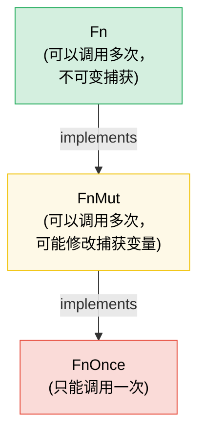

[English Original](../en/ch07-closures-and-higher-order-functions.md)

# 第 7 章：闭包 (Closures) 与高阶函数 🟢

> **你将学到：**
> - 三种闭包 Trait (`Fn`, `FnMut`, `FnOnce`) 及其捕获方式
> - 将闭包作为参数传递，以及从函数中返回闭包
> - 函数式编程风格中的组合子链 (Combinator Chains) 与迭代器适配器
> - 如何使用合适的 Trait 约束来设计你自己的高阶 API

## Fn, FnMut, FnOnce —— 闭包 Trait

Rust 中的每个闭包都会根据其捕获变量的方式来实现一种 or 多种 Trait：

```rust
// FnOnce —— 消耗捕获的值 (只能被调用一次)
let name = String::from("Alice");
let greet = move || {
    println!("你好, {name}!"); // 获取 `name` 的所有权
    drop(name); // name 被消耗
};
greet(); // ✅ 第一次调用
// greet(); // ❌ 无法再次调用 —— `name` 已被消耗

// FnMut —— 可变借用捕获的值 (可以被调用多次)
let mut count = 0;
let mut increment = || {
    count += 1; // 可变借用 `count`
};
increment(); // count == 1
increment(); // count == 2

// Fn —— 不可变借用捕获的值 (可以被调用多次，且支持并发)
let prefix = "结果";
let display = |x: i32| {
    println!("{prefix}: {x}"); // 不可变借用 `prefix`
};
display(1);
display(2);
```

**层级结构**：`Fn` : `FnMut` : `FnOnce` —— 每一层都是下一层的子 Trait (Subtrait)：

```text
FnOnce  ← 所有闭包至少可以被调用一次
 ↑
FnMut   ← 可以被重复调用 (可能会修改状态)
 ↑
Fn      ← 可以被重复且并发地调用 (不能修改状态)
```

如果一个闭包实现了 `Fn`，它同时也实现了 `FnMut` 和 `FnOnce`。

### 将闭包作为参数和返回值

```rust
// --- 作为参数 ---

// 静态分发 (静态单态化 —— 速度最快)
fn apply_twice<F: Fn(i32) -> i32>(f: F, x: i32) -> i32 {
    f(f(x))
}

// 也可以使用 impl Trait 写法：
fn apply_twice_v2(f: impl Fn(i32) -> i32, x: i32) -> i32 {
    f(f(x))
}

// 动态分发 (Trait 对象 —— 灵活，但有轻微开销)
fn apply_dyn(f: &dyn Fn(i32) -> i32, x: i32) -> i32 {
    f(x)
}

// --- 作为返回值 ---

// 如果不使用 Box，无法按值返回闭包 (因为它们是匿名类型)：
fn make_adder(n: i32) -> Box<dyn Fn(i32) -> i32> {
    Box::new(move |x| x + n)
}

// 使用 impl Trait (更简单，单态化，但不支持动态性)：
fn make_adder_v2(n: i32) -> impl Fn(i32) -> i32 {
    move |x| x + n
}

fn main() {
    let double = |x: i32| x * 2;
    println!("{}", apply_twice(double, 3)); // 12

    let add5 = make_adder(5);
    println!("{}", add5(10)); // 15
}
```

### 组合子链与迭代器适配器

高阶函数在迭代器中大放异彩 —— 这是最惯用的 Rust 写法：

```rust
// C 风格循环 (指令式)：
let data = vec![1, 2, 3, 4, 5, 6, 7, 8, 9, 10];
let mut result = Vec::new();
for x in &data {
    if x % 2 == 0 {
        result.push(x * x);
    }
}

// 惯用的 Rust 写法 (函数式组合子链)：
let result: Vec<i32> = data.iter()
    .filter(|&&x| x % 2 == 0)
    .map(|&x| x * x)
    .collect();

// 性能相同 —— 迭代器是惰性的，且会被 LLVM 深度优化
assert_eq!(result, vec![4, 16, 36, 64, 100]);
```

**常见组合子速查表**：

| 组合子 | 作用 | 示例 |
|-----------|-------------|---------|
| `.map(f)` | 转换每个元素 | `.map(|x| x * 2)` |
| `.filter(p)` | 保留谓词为真的元素 | `.filter(|x| x > &5)` |
| `.filter_map(f)` | map + filter 的结合 (返回 `Option`) | `.filter_map(|x| x.parse().ok())` |
| `.flat_map(f)` | 先 map 然后展平嵌套迭代器 | `.flat_map(|s| s.chars())` |
| `.fold(init, f)` | 归约为单个值 | `.fold(0, |acc, x| acc + x)` |
| `.any(p)` / `.all(p)` | 短路布尔检查 | `.any(|x| x > 100)` |
| `.enumerate()` | 添加索引 | `.enumerate().map(|(i, x)| ...)` |
| `.zip(other)` | 与另一个迭代器配对 | `.zip(labels.iter())` |
| `.take(n)` / `.skip(n)` | 取前 N 个 / 跳过前 N 个元素 | `.take(10)` |
| `.chain(other)` | 拼接两个迭代器 | `.chain(extra.iter())` |
| `.peekable()` | 在不消耗的情况下查看下一个元素 | `.peek()` |
| `.collect()` | 聚合到集合中 | `.collect::<Vec<_>>()` |

### 实现你自己的高阶 API

设计接受闭包进行自定义的 API：

```rust
/// 根据可配置策略重试操作
fn retry<T, E, F, S>(
    mut operation: F,
    mut should_retry: S,
    max_attempts: usize,
) -> Result<T, E>
where
    F: FnMut() -> Result<T, E>,
    S: FnMut(&E, usize) -> bool, // (错误, 尝试次数) → 是否重试？
{
    for attempt in 1..=max_attempts {
        match operation() {
            Ok(val) => return Ok(val),
            Err(e) if attempt < max_attempts && should_retry(&e, attempt) => {
                continue;
            }
            Err(e) => return Err(e),
        }
    }
    unreachable!()
}

// 用法 —— 调用者控制重试逻辑：
let result = retry(
    || connect_to_database(),
    |err, attempt| {
        eprintln!("第 {attempt} 次尝试失败: {err}");
        true // 总是重试
    },
    3,
);

// 用法 —— 仅针对特定错误进行重试：
let result = retry(
    || http_get(url),
    |err, _| err.is_transient(), // 仅重试瞬时错误 (Transient Errors)
    5,
);
```

### `with` 模式 —— 括号式资源访问 (Bracketed Resource Access)

有时你需要保证资源在操作期间处于特定状态，并在操作结束后恢复 —— 无论调用者的代码如何退出（早期返回、`?` 运算符、panic）。与其直接暴露资源并寄希望于调用者记得正确进行设置 (Setup) 和拆除 (Teardown)，不如 **通过闭包借出资源**：

```text
建立 (Set up) → 通过资源调用闭包 → 拆除 (Tear down)
```

调用者永远不会接触设置或拆除过程。他们不会忘记，不会弄错，也无法在闭包作用域之外持有该资源。

#### 示例：GPIO 引脚方向

GPIO 控制器管理支持双向 I/O 的引脚。有的调用者需要将引脚配置为输入，有的则需要配置为输出。与其暴露原始的引脚访问权限并信任调用者会正确设置方向，控制器提供了 `with_pin_input` 和 `with_pin_output` 方法：

```rust
/// GPIO 引脚方向 —— 非公开，调用者永远无法直接设置它。
#[derive(Debug, Clone, Copy, PartialEq)]
enum Direction { In, Out }

/// 借给闭包的 GPIO 引脚句柄。无法被存储或克隆 ——
/// 它仅在回调期间存在。
pub struct GpioPin<'a> {
    pin_number: u8,
    _controller: &'a GpioController,
}

impl GpioPin<'_> {
    pub fn read(&self) -> bool {
        // 从硬件寄存器读取引脚电平
        println!("  正在读取引脚 {}", self.pin_number);
        true // 桩代码
    }

    pub fn write(&self, high: bool) {
        // 通过硬件寄存器驱动引脚电平
        println!("  正在写入引脚 {} = {high}", self.pin_number);
    }
}

pub struct GpioController {
    current_direction: std::cell::Cell<Option<Direction>>,
}

impl GpioController {
    pub fn new() -> Self {
        GpioController {
            current_direction: std::cell::Cell::new(None),
        }
    }

    /// 将引脚配置为输入，运行闭包，然后恢复状态。
    /// 调用者收到的 `GpioPin` 仅在回调期间存活。
    pub fn with_pin_input<R>(
        &self,
        pin: u8,
        mut f: impl FnMut(&GpioPin<'_>) -> R,
    ) -> R {
        let prev = self.current_direction.get();
        self.set_direction(pin, Direction::In);
        let handle = GpioPin { pin_number: pin, _controller: self };
        let result = f(&handle);
        // 恢复先前的方向 (或者保持原状 —— 取决于策略选择)
        if let Some(dir) = prev {
            self.set_direction(pin, dir);
        }
        result
    }

    /// 将引脚配置为输出，运行闭包，然后恢复状态。
    /// 调用者收到的 `GpioPin` 仅在回调期间存活。
    pub fn with_pin_output<R>(
        &self,
        pin: u8,
        mut f: impl FnMut(&GpioPin<'_>) -> R,
    ) -> R {
        let prev = self.current_direction.get();
        self.set_direction(pin, Direction::Out);
        let handle = GpioPin { pin_number: pin, _controller: self };
        let result = f(&handle);
        if let Some(dir) = prev {
            self.set_direction(pin, dir);
        }
        result
    }

    fn set_direction(&self, pin: u8, dir: Direction) {
        println!("  [hw] 引脚 {pin} → {dir:?}");
        self.current_direction.set(Some(dir));
    }
}

fn main() {
    let gpio = GpioController::new();

    // 调用者 1：需要输入 —— 不知道也不关心方向是如何管理的
    let level = gpio.with_pin_input(4, |pin| {
        pin.read()
    });
    println!("引脚 4 电平: {level}");

    // 调用者 2：需要输出 —— 相同的 API 形式，不同的保证
    gpio.with_pin_output(4, |pin| {
        pin.write(true);
        // 执行更多工作...
        pin.write(false);
    });

    // 无法在闭包外使用引脚句柄：
    // let escaped_pin = gpio.with_pin_input(4, |pin| pin);
    // ❌ 错误：被借用的值存活时间不够长
}
```

**`with` 模式保证了：**
- 引脚方向 **总是在** 调用者代码运行前设置好
- 引脚方向 **总是在** 之后恢复，即使闭包发生了早期返回
- `GpioPin` 句柄 **无法逃逸** 出闭包 —— 借用检查器通过与控制器引用绑定的生命周期来强制执行这一点
- 调用者永远不需要导入 `Direction`，也不需要调用 `set_direction` —— 该 API **不可能被误用 (Impossible to misuse)**

#### 该模式出现在哪里

`with` 模式遍布 Rust 标准库和生态系统：

| API | 设置 (Setup) | 回调 | 拆除 (Teardown) |
|-----|-------|----------|----------|
| `std::thread::scope` | 创建作用域 | `|s| { s.spawn(...) }` | 等待所有线程结束 |
| `Mutex::lock` | 获取锁 | 使用 `MutexGuard` (RAII，非闭包，但思路相同) | Drop 时释放 |
| `tempfile::tempdir` | 创建临时目录 | 使用路径 | Drop 时删除 |
| `std::io::BufWriter::new` | 缓冲写入 | 写入操作 | Drop 时刷新 (Flush) |
| GPIO `with_pin_*` (见上文) | 设置方向 | 使用引脚句柄 | 恢复方向 |

在以下情况下，基于闭包的变体最为强力：
- **设置与拆除成对出现**，漏掉任何一个都是 Bug
- **资源不应超出操作的存活时间** —— 借用检查器会自然地强制执行这一点
- **存在多种配置** (`with_pin_input` 与 `with_pin_output`) —— 每个 `with_*` 方法都封装了不同的设置，而无需向调用者暴露具体的配置细节

> **`with` vs RAII (Drop)**：两者都保证了清理工作。当调用者需要在多个语句和函数调用中持有资源时，请使用 RAII / `Drop`。当操作是 **括号式 (Bracketed)** 的 —— 即：一次设置、一块工作、一次拆除 —— 且你不希望调用者能够打破这个“括号”时，请使用 `with` 模式。

> **关键要点 —— 闭包**
> - `Fn` 借用数据，`FnMut` 可变借用数据，`FnOnce` 消耗数据 —— 尽量接受你的 API 所需的最弱约束。
> - 在参数中使用 `impl Fn`，在存储时使用 `Box<dyn Fn>`，在返回时使用 `impl Fn` (如果涉及动态分发则使用 `Box<dyn Fn>`)。
> - 组合子链 (`map`, `filter`, `and_then`) 的写法非常简洁，且能被编译器内联优化为高性能循环。
> - `with` 模式 (通过闭包实现的扩展访问) 能够保证设置/拆除逻辑的执行并防止资源逃逸 —— 当调用者不应管理配置生命周期时非常适用。

> **另请参阅：** [第 2 章 —— 深入 Trait](ch02-traits-in-depth.md) 了解 `Fn`/`FnMut`/`FnOnce` 与 Trait 对象的关联。[第 8 章 —— 函数式 vs 指令式](ch08-functional-vs-imperative-when-elegance-wins.md) 了解何时选择组合子而非循环。[第 15 章 —— API 设计](ch15-crate-architecture-and-api-design.md) 了解如何编写符合人体工程学 (Ergonomic) 的参数模式。



> 每个 `Fn` 同时也是 `FnMut`，每个 `FnMut` 同时也是 `FnOnce`。默认情况下接受 `FnMut` —— 它是对调用者最灵活的约束。

***

### 练习：高阶组合子流水线 (Higher-Order Combinator Pipeline) ★★ (~25 分钟)

创建一个 `Pipeline` 结构体，用于链接一系列转换操作。它应该支持通过 `.pipe(f)` 添加转换，并通过 `.execute(input)` 运行完整的转换链。

<details>
<summary>🔑 参考答案</summary>

```rust
struct Pipeline<T> {
    transforms: Vec<Box<dyn Fn(T) -> T>>,
}

impl<T: 'static> Pipeline<T> {
    fn new() -> Self {
        Pipeline { transforms: Vec::new() }
    }

    fn pipe(mut self, f: impl Fn(T) -> T + 'static) -> Self {
        self.transforms.push(Box::new(f));
        self
    }

    fn execute(self, input: T) -> T {
        self.transforms.into_iter().fold(input, |val, f| f(val))
    }
}

fn main() {
    let result = Pipeline::new()
        .pipe(|s: String| s.trim().to_string())
        .pipe(|s| s.to_uppercase())
        .pipe(|s| format!(">>> {s} <<<"))
        .execute("  hello world  ".to_string());

    println!("{result}"); // >>> HELLO WORLD <<<

    let result = Pipeline::new()
        .pipe(|x: i32| x * 2)
        .pipe(|x| x + 10)
        .pipe(|x| x * x)
        .execute(5);

    println!("{result}"); // (5*2 + 10)^2 = 400
}
```

</details>

***
