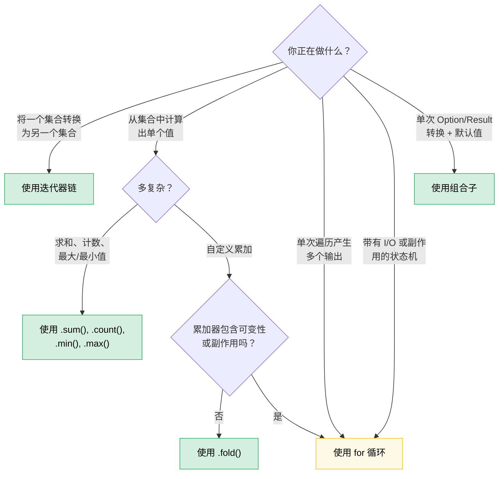

[English Original](../en/ch08-functional-vs-imperative-when-elegance-wins.md)

# 第 8 章：函数式 (Functional) vs. 指令式 (Imperative)：优雅何时更胜一筹 (以及何时不适用)

> **难度：** 🟡 中级 | **时间：** 2–3 小时 | **前置知识：** [第 7 章 —— 闭包](ch07-closures-and-higher-order-functions.md)

Rust 让函数式与指令式风格保持了真正的同等地位。与 Haskell (强制函数式) 或 C (默认指令式) 不同，Rust 允许你自行选择 —— 而正确的选择取决于你想要表达的内容。本章将帮助你建立做出明智选择的判断力。

**核心原则：** 当你 **通过流水线 (Pipeline) 转换数据** 时，函数式风格大放异彩。当你 **管理带有副作用 (Side effects) 的状态转换** 时，指令式风格更胜一筹。大多数现实世界的代码同时包含两者，而真正的技巧在于知道两者的界限在哪里。

---

## 8.1 你一直想要却没发现的组合子

许多 Rust 开发者会这样写：

```rust
let value = if let Some(x) = maybe_config() {
    x
} else {
    default_config()
};
process(value);
```

其实他们可以这样写：

```rust
process(maybe_config().unwrap_or_else(default_config));
```

或者这种常见的模式：

```rust
let display_name = if let Some(name) = user.nickname() {
    name.to_uppercase()
} else {
    "ANONYMOUS".to_string()
};
```

可以改写为：

```rust
let display_name = user.nickname()
    .map(|n| n.to_uppercase())
    .unwrap_or_else(|| "ANONYMOUS".to_string());
```

函数式版本不仅更短 —— 它还能直接告诉你 **发生了什么** (转换，然后设置默认值)，而无需让你追踪控制流。`if let` 版本则强制你阅读两个分支，才能发现两条路径最终殊途同归。

### Option 组合子家族

这里有一个心智模型：`Option<T>` 是一个“包含一个元素或为空”的集合。`Option` 上的每个组合子都能在集合操作中找到类比。

| 你写的... | 等同于 (指令式)... | 它传达的语义 |
|---|---|---|
| `opt.unwrap_or(default)` | `if let Some(x) = opt { x } else { default }` | “使用此值，或者回退到默认值” |
| `opt.unwrap_or_else(|| expensive())` | `if let Some(x) = opt { x } else { expensive() }` | 同上，但默认值是惰性计算的 |
| `opt.map(f)` | `match opt { Some(x) => Some(f(x)), None => None }` | “转换内部值，传递‘空’状态” |
| `opt.and_then(f)` | `match opt { Some(x) => f(x), None => None }` | “链接可能失败的操作” (Flatmap) |
| `opt.filter(|x| pred(x))` | `match opt { Some(x) if pred(&x) => Some(x), _ => None }` | “仅在通过检查时保留” |
| `opt.zip(other)` | `if let (Some(a), Some(b)) = (opt, other) { Some((a,b)) } else { None }` | “全有或全无” |
| `opt.or(fallback)` | `if opt.is_some() { opt } else { fallback }` | “第一个可用的值” |
| `opt.or_else(|| try_another())` | `if opt.is_some() { opt } else { try_another() }` | “按顺序尝试替代方案” |
| `opt.map_or(default, f)` | `if let Some(x) = opt { f(x) } else { default }` | “转换或默认” —— 单行搞定 |
| `opt.map_or_else(default_fn, f)` | `if let Some(x) = opt { f(x) } else { default_fn() }` | 同上，两端都是闭包 |
| `opt?` | `match opt { Some(x) => x, None => return None }` | “将缺失状态向上传递” |

### Result 组合子家族

相同的模式也适用于 `Result<T, E>`：

| 你写的... | 等同于 (指令式)... | 它传达的语义 |
|---|---|---|
| `res.map(f)` | `match res { Ok(x) => Ok(f(x)), Err(e) => Err(e) }` | 转换成功路径 |
| `res.map_err(f)` | `match res { Ok(x) => Ok(x), Err(e) => Err(f(e)) }` | 转换错误 |
| `res.and_then(f)` | `match_res { Ok(x) => f(x), Err(e) => Err(e) }` | 链接可能失败的操作 |
| `res.unwrap_or_else(|e| default(e))` | `match res { Ok(x) => x, Err(e) => default(e) }` | 从错误中恢复 |
| `res.ok()` | `match res { Ok(x) => Some(x), Err(_) => None }` | “我不关心具体的错误” |
| `res?` | `match res { Ok(x) => x, Err(e) => return Err(e.into()) }` | 将错误向上传递 |

### 什么时候 `if let` 反而更好

在以下情况下，组合子会逊色：

- **你需要在 `Some` 分支中写多条语句。** 一个 5 行长的 `map` 闭包比 5 行长的 `if let` 糟糕得多。
- **控制流本身就是重点。** `if let Some(connection) = pool.try_get() { /* 使用它 */ } else { /* 日志记录、重试、报警 */ }` —— 两个分支是截然不同的代码路径，而不仅仅是“转换或默认”。
- **副作用占据主导地位。** 如果两个分支都在执行带有不同错误处理的 I/O，那么组合子版本会模糊这些重要的区别。

**经验法则：** 如果 `else` 分支产生与 `Some` 分支 **相同类型** 的结果，且主体是短表达式，请使用组合子。如果两个分支做的事情有本质上的不同，请使用 `if let` 或 `match`。

---

## 8.2 布尔组合子：`.then()` 与 `.then_some()`

另一种比想象中更常用的模式：

```rust
let label = if is_admin {
    Some("ADMIN")
} else {
    None
};
```

Rust 1.62+ 提供了：

```rust
let label = is_admin.then_some("ADMIN");
```

或者使用计算出的值：

```rust
let permissions = is_admin.then(|| compute_admin_permissions());
```

这在链式调用中尤其强大：

```rust
// 指令式 (Imperative)
let mut tags = Vec::new();
if user.is_admin { tags.push("admin"); }
if user.is_verified { tags.push("verified"); }
if user.score > 100 { tags.push("power-user"); }

// 函数式 (Functional)
let tags: Vec<&str> = [
    user.is_admin.then_some("admin"),
    user.is_verified.then_some("verified"),
    (user.score > 100).then_some("power-user"),
]
.into_iter()
.flatten()
.collect();
```

函数式版本明确化了这种模式：“从条件元素构建列表”。指令式版本则要求你阅读每一个 `if`，以确认它们都在做同一件事（即 push 一个标签）。

---

## 8.3 迭代器链 vs. 循环：决策框架

第 7 章介绍了迭代器的机制。本节将培养你做出选择的判断力。

### 什么时候迭代器胜出

**数据流水线 (Data pipelines)** —— 通过一系列步骤转换集合：

```rust
// 指令式：8 行代码，2 个可变变量
let mut results = Vec::new();
for item in inventory {
    if item.category == Category::Server {
        if let Some(temp) = item.last_temperature() {
            if temp > 80.0 {
                results.push((item.id, temp));
            }
        }
    }
}

// 函数式：6 行代码，0 个可变变量，一个流水线
let results: Vec<_> = inventory.iter()
    .filter(|item| item.category == Category::Server)
    .filter_map(|item| item.last_temperature().map(|t| (item.id, t)))
    .filter(|(_, temp)| *temp > 80.0)
    .collect();
```

函数式版本胜在：
- 每个过滤器 (Filter) 都是独立可读的。
- 无需 `mut` —— 数据向单一方向流动。
- 你可以增加、删除或重新排序流水线阶段，而无需重构整体结构。
- LLVM 会将迭代器适配器内联成与循环完全相同的机器码。

**聚合 (Aggregation)** —— 从集合中计算出单个值：

```rust
// 指令式
let mut total_power = 0.0;
let mut count = 0;
for server in fleet {
    total_power += server.power_draw();
    count += 1;
}
let avg = total_power / count as f64;

// 函数式
let (total_power, count) = fleet.iter()
    .map(|s| s.power_draw())
    .fold((0.0, 0usize), |(sum, n), p| (sum + p, n + 1));
let avg = total_power / count as f64;
```

如果只需要求和，则更简单：

```rust
let total: f64 = fleet.iter().map(|s| s.power_draw()).sum();
```

### 什么时候循环胜出

**带有复杂状态的早期退出 (Early exit)：**

```rust
// 这种写法清晰且直观
let mut best_candidate = None;
for server in fleet {
    let score = evaluate(server);
    if score > threshold {
        if server.is_available() {
            best_candidate = Some(server);
            break; // 找到了一个 —— 立即停止
        }
    }
}

// 函数式版本显得有些吃力
let best_candidate = fleet.iter()
    .filter(|s| evaluate(s) > threshold)
    .find(|s| s.is_available());
```

虽然在这里函数式写法还算整洁，但让我们看一个它真正处于劣势的案例：

**同时构建多个输出：**

```rust
// 指令式：清晰，每个分支做不同的事
let mut warnings = Vec::new();
let mut errors = Vec::new();
let mut stats = Stats::default();

for event in log_stream {
    match event.severity {
        Severity::Warn => {
            warnings.push(event.clone());
            stats.warn_count += 1;
        }
        Severity::Error => {
            errors.push(event.clone());
            stats.error_count += 1;
            if event.is_critical() {
                alert_oncall(&event);
            }
        }
        _ => stats.other_count += 1,
    }
}

// 函数式版本：牵强、笨拙，没人想读这样的代码
let (warnings, errors, stats) = log_stream.iter().fold(
    (Vec::new(), Vec::new(), Stats::default()),
    |(mut w, mut e, mut s), event| {
        match event.severity {
            Severity::Warn => { w.push(event.clone()); s.warn_count += 1; }
            Severity::Error => {
                e.push(event.clone()); s.error_count += 1;
                if event.is_critical() { alert_oncall(event); }
            }
            _ => s.other_count += 1,
        }
        (w, e, s)
    },
);
```

`fold` 版本 **更长**、**更难读**，且依然包含可变性（被解构出的累加器 `mut`）。循环胜在：
- 可以并行构建多个输出。
- 在逻辑中混杂了副作用（如警报）。
- 分支主体是语句 (Statements) 而非表达式 (Expressions)。

**带有 I/O 的状态机：**

```rust
// 一个读取 Token 的解析器 —— 循环本身就是算法的体现
let mut state = ParseState::Start;
loop {
    let token = lexer.next_token()?;
    state = match state {
        ParseState::Start => match token {
            Token::Keyword(k) => ParseState::GotKeyword(k),
            Token::Eof => break,
            _ => return Err(ParseError::UnexpectedToken(token)),
        },
        ParseState::GotKeyword(k) => match token {
            Token::Ident(name) => ParseState::GotName(k, name),
            _ => return Err(ParseError::ExpectedIdentifier),
        },
        // ...更多状态
    };
}
```

没有比这更简洁的函数式写法了。带有 `match state` 的循环是状态机的自然表达方式。

### 决策流程图



---

### 边栏：作用域可变性 —— 内部指令式，外部函数式

Rust 的代码块也是表达式。这允许你将可变性限制在构建阶段，并将其结果绑定为不可变：

```rust
use rand::random;

let samples = {
    let mut buf = Vec::with_capacity(10);
    while buf.len() < 10 {
        let reading: f64 = random();
        buf.push(reading);
        if random::<u8>() % 3 == 0 { break; } // 随机提前停止
    }
    buf
};
// samples 是不可变的 —— 包含 1 到 10 个元素
```

内部的 `buf` 仅在代码块内是可变的。一旦块执行完毕并返回结果，外部绑定 `samples` 就是不可变的，编译器将拒绝后续任何 `samples.push(...)` 调用。

**为什么不使用迭代器链？** 你可能会尝试这样做：

```rust
let samples: Vec<f64> = std::iter::from_fn(|| Some(random()))
    .take(10)
    .take_while(|_| random::<u8>() % 3 != 0)
    .collect();
```

但 `take_while` 会 **排除掉** 那个导致谓词失败的元素，导致结果可能包含 0 到 9 个元素，而不是指令式版本所能保证的“至少一个”。你可以通过 `scan` 或 `chain` 来规避这个问题，但指令式版本显然更清晰。

**作用域可变性真正胜出的场景：**

| 场景 | 为什么迭代器难以处理 |
|---|---|
| **先排序后冷冻 (Sort-then-freeze)** (`sort_unstable()` + `dedup()`) | 这两个方法都返回 `()` —— 无法链式输出 (Itertools 提供了 `.sorted().dedup()`，如果可用的话) |
| **有状态终止** (基于与数据无关的代码停止) | `take_while` 会丢失边界元素 |
| **多步骤结构体填充** (从不同数据源逐个字段填充) | 没有天然的单一流水线可用 |

**实际建议：** 对于大多数集合构建任务，优先考虑迭代器链或 [itertools](https://docs.rs/itertools)。当构建逻辑包含分支、早期退出或不适用于单一流水线的就地修改时，请使用作用域可变性。这种模式的真正价值在于：它教会了我们“可变性的作用域可以小于变量的生命周期” —— 这是 Rust 的一项基本原则，往往会让习惯了 C++、C# 和 Python 的开发者感到惊讶。

---

## 8.4 `?` 运算符：函数式与指令式的交汇点

`?` 运算符是 Rust 对两种风格最优雅的综合应用。它在本质上是 `.and_then()` 加上“早期返回”的结合：

```rust
// 这一串 and_then 链...
fn load_config() -> Result<Config, Error> {
    read_file("config.toml")
        .and_then(|contents| parse_toml(&contents))
        .and_then(|table| validate_config(table))
        .and_then(|valid| Config::from_validated(valid))
}

// ...与这个完全等价
fn load_config() -> Result<Config, Error> {
    let contents = read_file("config.toml")?;
    let table = parse_toml(&contents)?;
    let valid = validate_config(table)?;
    Config::from_validated(valid)
}
```

两者在精神上都是函数式的（它们自动传播错误），但 `?` 版本为你提供了 **命名的中间变量**，这在以下情况非常重要：
- 你稍后需要再次使用 `contents`。
- 你想在每一步添加 `.context("解析配置时")?` (使用 anyhow/eyre 等库)。
- 你正在调试并希望能观察中间值。

**反模式：** 在可以使用 `?` 的地方强行使用长链条的 `.and_then()`。如果链条中的每个闭包都只是 `|x| next_step(x)`，你就是在牺牲可读性的情况下重新发明了 `?`。

**什么时候 `.and_then()` 优于 `?`：**

```rust
// 在 Option 内部进行转换，不涉及早期返回
let port: Option<u16> = config.get("port")
    .and_then(|v| v.parse::<u16>().ok())
    .filter(|&p| p > 0 && p < 65535);
```

你不能在这里使用 `?`，因为没有外部函数可以返回 —— 你是在构建一个 `Option`，而不是传播它。

---

## 8.5 集合构建：`collect()` vs. Push 循环

`collect()` 的强大超出了大多数开发者的想象：

### 收集 (Collect) 到 Result 中

```rust
// 指令式：解析列表，在遇到第一个错误时失败
let mut numbers = Vec::new();
for s in input_strings {
    let n: i64 = s.parse().map_err(|_| Error::BadInput(s.clone()))?;
    numbers.push(n);
}

// 函数式：收集到 Result<Vec<_>, _> 中
let numbers: Vec<i64> = input_strings.iter()
    .map(|s| s.parse::<i64>().map_err(|_| Error::BadInput(s.clone())))
    .collect::<Result<_, _>>()?;
```

`collect::<Result<Vec<_>, _>>()` 的技巧之所以有效，是因为 `Result` 实现了 `FromIterator`。它会在遇到第一个 `Err` 时短路，就像带 `?` 的循环一样。

### 收集到 HashMap 中

```rust
// 指令式
let mut index = HashMap::new();
for server in fleet {
    index.insert(server.id.clone(), server);
}

// 函数式
let index: HashMap<_, _> = fleet.into_iter()
    .map(|s| (s.id.clone(), s))
    .collect();
```

### 收集到 String 中

```rust
// 指令式
let mut csv = String::new();
for (i, field) in fields.iter().enumerate() {
    if i > 0 { csv.push(','); }
    csv.push_str(field);
}

// 函数式
let csv = fields.join(",");

// 或者进行更复杂的格式化：
let csv: String = fields.iter()
    .map(|f| format!("\"{f}\""))
    .collect::<Vec<_>>()
    .join(",");
```

### 什么时候循环版本胜出

`collect()` 会分配新的集合。如果你是在 **就地 (In-place) 修改**，那么循环既更清晰也更高效：

```rust
// 就地更新 —— 没有更好的函数式等价写法
for server in &mut fleet {
    if server.needs_refresh() {
        server.refresh_telemetry()?;
    }
}
```

函数式版本需要写成 `.iter_mut().for_each(|s| { ... })`，这本质上只是多套了一层语法的循环。

---

## 8.6 将模式匹配作为函数分发 (Function Dispatch)

Rust 的 `match` 往往被开发者以指令式的方式使用，但它其实是一个函数式构建块。以下是函数式的视角：

### 将 Match 作为查找表

```rust
// 指令式思维：“检查每一种情况”
fn status_message(code: StatusCode) -> &'static str {
    if code == StatusCode::OK { "成功" }
    else if code == StatusCode::NOT_FOUND { "未找到" }
    else if code == StatusCode::INTERNAL { "服务器错误" }
    else { "未知" }
}

// 函数式思维：“从定义域映射到值域”
fn status_message(code: StatusCode) -> &'static str {
    match code {
        StatusCode::OK => "成功",
        StatusCode::NOT_FOUND => "未找到",
        StatusCode::INTERNAL => "服务器错误",
        _ => "未知",
    }
}
```

`match` 版本不仅是风格问题 —— 编译器还会验证 **完备性 (Exhaustiveness)**。如果增加了一个新的变体，每个未处理该变体的 `match` 都会导致编译错误；而 `if/else` 链则会静默地进入默认分支。

### Match + 解构作为流水线

```rust
// 解析命令 —— 每个分支提取并转换数据
fn execute(cmd: Command) -> Result<Response, Error> {
    match cmd {
        Command::Get { key } => db.get(&key).map(Response::Value),
        Command::Set { key, value } => db.set(key, value).map(|_| Response::Ok),
        Command::Delete { key } => db.delete(&key).map(|_| Response::Ok),
        Command::Batch(cmds) => cmds.into_iter()
            .map(execute)
            .collect::<Result<Vec<_>, _>>()
            .map(Response::Batch),
    }
}
```

每个分支都是一个返回相同类型的表达式。这就是作为函数分发的模式匹配 —— `match` 分支本质上是一个由枚举变体索引的函数表。

---

## 8.7 在自定义类型上使用链式方法

函数式风格不仅限于标准库类型。构建者模式 (Builder patterns) 和流式 API (Fluent APIs) 其实都是伪装的函数式编程：

```rust
// 这是一个基于你自定义类型的组合子链
let query = QueryBuilder::new("servers")
    .filter("status", Eq, "active")
    .filter("rack", In, &["A1", "A2", "B1"])
    .order_by("temperature", Desc)
    .limit(50)
    .build();
```

**关键洞察：** 如果你的类型具有获取 `self` 并返回 `Self` (或转换后的类型) 的方法，你就是在构建一个组合子。同样的“函数式 vs 指令式”判断准则依然适用：

```rust
// 好的写法：可以链式调用，因为每一步都是简单的转换
let config = Config::default()
    .with_timeout(Duration::from_secs(30))
    .with_retries(3)
    .with_tls(true);

// 坏的写法：虽然可以链式调用，但链条做了太多不相关的事情
let result = processor
    .load_data(path)?       // I/O
    .validate()             // 纯函数 (Pure)
    .transform(rule_set)    // 纯函数 (Pure)
    .save_to_disk(output)?  // I/O
    .notify_downstream()?;  // 副作用

// 更好的写法：将纯逻辑流水线与 I/O 边界分开
let data = load_data(path)?;
let processed = data.validate().transform(rule_set);
save_to_disk(output, &processed)?;
notify_downstream()?;
```

当链条混合了纯转换与 I/O 时，它就失效了。读者无法区分哪些调用可能失败、哪些有副作用，以及真正的转化逻辑发生在何处。

---

## 8.8 性能：两者是等同的

一个常见的误区是：“函数式风格更慢，因为有大量的闭包和内存分配”。

在 Rust 中，**迭代器链编译成的机器码与手写循环完全相同**。LLVM 会内联闭包调用，消除迭代器适配器结构体，并经常产生完全一致的汇编代码。这被称为 **零成本抽象 (Zero-cost abstraction)**，它不是一种愿景，而是实实在在的测评结果。

```rust
// 在 Release 构建下，这两者产生的汇编代码完全一致：

// 函数式
let sum: i64 = (0..1000).filter(|n| n % 2 == 0).map(|n| n * n).sum();

// 指令式
let mut sum: i64 = 0;
for n in 0..1000 {
    if n % 2 == 0 {
        sum += n * n;
    }
}
```

**唯一一个例外：** `.collect()` 会分配内存。如果你链式调用 `.map().collect().iter().map().collect()` 并产生了中间集合，你就在为循环版本中不需要的内存分配买单。解决方法：通过直接链接适配器来消除中间的 `collect`；或者如果确实因为某些原因需要中间集合，则使用循环。

---

## 8.9 品味测试：转换目录

以下是针对最常见的“我写了 6 行但其实单行就能搞定”模式的参考表：

| 指令式模式 | 函数式等价写法 | 何时优先选择函数式 |
|---|---|---|
| `if let Some(x) = opt { f(x) } else { default }` | `opt.map_or(default, f)` | 两端都是短表达式时 |
| `if let Some(x) = opt { Some(g(x)) } else { None }` | `opt.map(g)` | 始终如此 —— 这就是 `map` 的用途 |
| `if condition { Some(x) } else { None }` | `condition.then_some(x)` | 始终如此 |
| `if condition { Some(compute()) } else { None }` | `condition.then(compute)` | 始终如此 |
| `match opt { Some(x) if pred(x) => Some(x), _ => None }` | `opt.filter(pred)` | 始终如此 |
| `for x in iter { if pred(x) { result.push(f(x)); } }` | `iter.filter(pred).map(f).collect()` | 当流水线能在一屏内读完时 |
| `if a.is_some() && b.is_some() { Some((a?, b?)) }` | `a.zip(b)` | 始终如此 —— `.zip()` 正是为此设计的 |
| `match (a, b) { (Some(x), Some(y)) => x + y, _ => 0 }` | `a.zip(b).map(|(x,y)| x + y).unwrap_or(0)` | 取决于复杂程度的判断 |
| `iter.map(f).collect::<Vec<_>>()[0]` | `iter.map(f).next().unwrap()` | 不要为了一个元素分配 Vec |
| `let mut v = vec; v.sort(); v` | `{ let mut v = vec; v.sort(); v }` | Rust std 中没有 `.sorted()` (请使用 itertools) |

---

## 8.10 反模式 (Anti-Patterns)

### 过度函数化：没人能读懂的 5 层深度链条

```rust
// 这并不优雅。这是一个谜题。
let result = data.iter()
    .filter_map(|x| x.metadata.as_ref())
    .flat_map(|m| m.tags.iter())
    .filter(|t| t.starts_with("env:"))
    .map(|t| t.strip_prefix("env:").unwrap())
    .filter(|env| allowed_envs.contains(env))
    .map(|env| env.to_uppercase())
    .collect::<HashSet<_>>()
    .into_iter()
    .sorted()
    .collect::<Vec<_>>();
```

当链条超过 ~4 个适配器时，请使用有命名的中间变量将其拆分，或者提取一个辅助函数：

```rust
let env_tags = data.iter()
    .filter_map(|x| x.metadata.as_ref())
    .flat_map(|m| m.tags.iter());

let allowed: Vec<_> = env_tags
    .filter_map(|t| t.strip_prefix("env:"))
    .filter(|env| allowed_envs.contains(env))
    .map(|env| env.to_uppercase())
    .sorted()
    .collect();
```

### 函数化不足：明明有现成工具却在写 C 风格循环

```rust
// 这其实就是 .any()
let mut found = false;
for item in &list {
    if item.is_expired() {
        found = true;
        break;
    }
}

// 应该写成这样
let found = list.iter().any(|item| item.is_expired());
```

```rust
// 这其实就是 .find()
let mut target = None;
for server in &fleet {
    if server.id == target_id {
        target = Some(server);
        break;
    }
}

// 应该写成这样
let target = fleet.iter().find(|s| s.id == target_id);
```

```rust
// 这其实就是 .all()
let mut all_healthy = true;
for server in &fleet {
    if !server.is_healthy() {
        all_healthy = false;
        break;
    }
}

// 应该写成这样
let all_healthy = fleet.iter().all(|s| s.is_healthy());
```

标准库提供这些工具是有原因的。学会这些术语，代码模式就会变得显而易见。

---

## 关键要点

> - **Option 和 Result 是包含一个元素的集合。** 它们的组合子 (`.map()`, `.and_then()`, `.unwrap_or_else()`, `.filter()`, `.zip()`) 可以取代大部分 `if let` / `match` 的模板代码。
> - **使用 `bool::then_some()`** —— 在任何情况下，它都能取代 `if cond { Some(x) } else { None }`。
> - **数据流水线优先考虑迭代器链** —— 具有零可变状态的 filter/map/collect。它们在编译后与手写循环的机器码性能一致。
> - **多输出状态机优先考虑循环** —— 当你需要构建多个集合、在分支中执行 I/O 或管理状态转换时。
> - **`?` 运算符是两全其美的选择** —— 既有函数式的错误传播，又有指令式的可读性。
> - **在适配器超过 ~4 个时拆分链条** —— 请使用有命名的中间变量以提高可读性。过度函数化与函数化不足同样糟糕。
> - **学习标准库中的术语** —— `.any()`, `.all()`, `.find()`, `.position()`, `.sum()`, `.min_by_key()` —— 每一个都能将多行循环替换为一个能够揭示意图的调用。

> **另请参阅：** [第 7 章](ch07-closures-and-higher-order-functions.md) 关于闭包机制和 `Fn` 特性层级。[第 10 章](ch10-error-handling-patterns.md) 关于错误组合子模式。[第 15 章](ch15-crate-architecture-and-api-design.md) 关于流式 API 设计。

---

### 练习：将指令式重构为函数式 ★★ (~30 分钟)

将以下函数从指令式风格重构为函数式风格。然后，找出函数式版本比原版 **更糟** 的一个地方，并解释原因。

```rust
fn summarize_fleet(fleet: &[Server]) -> FleetSummary {
    let mut healthy = Vec::new();
    let mut degraded = Vec::new();
    let mut failed = Vec::new();
    let mut total_power = 0.0;
    let mut max_temp = f64::NEG_INFINITY;

    for server in fleet {
        match server.health_status() {
            Health::Healthy => healthy.push(server.id.clone()),
            Health::Degraded(reason) => degraded.push((server.id.clone(), reason)),
            Health::Failed(err) => failed.push((server.id.clone(), err)),
        }
        total_power += server.power_draw();
        if server.max_temperature() > max_temp {
            max_temp = server.max_temperature();
        }
    }

    FleetSummary {
        healthy,
        degraded,
        failed,
        avg_power: total_power / fleet.len() as f64,
        max_temp,
    }
}
```

<details>
<summary>🔑 参考答案</summary>

`total_power` 和 `max_temp` 可以非常整洁地改写为函数式：

```rust
fn summarize_fleet(fleet: &[Server]) -> FleetSummary {
    let avg_power: f64 = fleet.iter().map(|s| s.power_draw()).sum::<f64>()
        / fleet.len() as f64;

    let max_temp = fleet.iter()
        .map(|s| s.max_temperature())
        .fold(f64::NEG_INFINITY, f64::max);

    // 但是，三路分区 (three-way partition) 最好还是用循环。
    // 函数式版本将需要三次独立的遍历，
    // 或者在一个笨拙的 fold 中使用三个可变累加器。
    let mut healthy = Vec::new();
    let mut degraded = Vec::new();
    let mut failed = Vec::new();

    for server in fleet {
        match server.health_status() {
            Health::Healthy => healthy.push(server.id.clone()),
            Health::Degraded(reason) => degraded.push((server.id.clone(), reason)),
            Health::Failed(err) => failed.push((server.id.clone(), err)),
        }
    }

    FleetSummary { healthy, degraded, failed, avg_power, max_temp }
}
```

**为什么对于三路分区来说循环更好：** 函数式版本要么需要三次 `.filter().collect()` (3 倍的遍历开销)，要么需要在一个 `.fold()` 中处理包含三个 `mut Vec` 累加器的元祖 —— 这本质上只是换了一种更糟糕的语法的循环。指令式的单次遍历循环更清晰、更高效，也更容易扩展。

</details>

***
