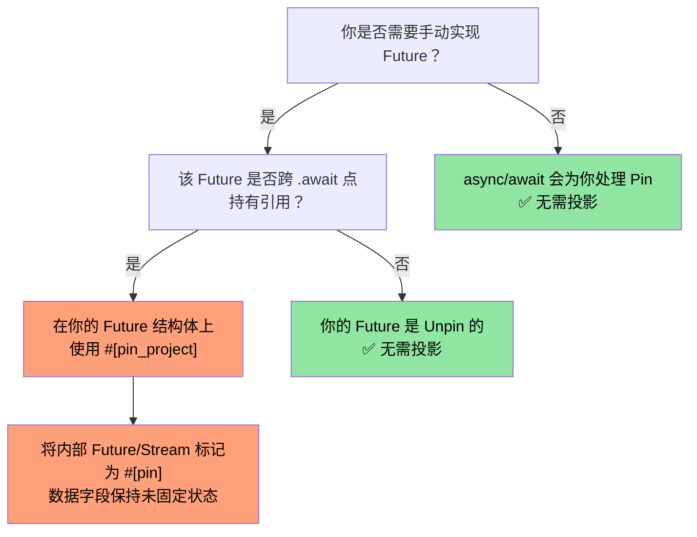
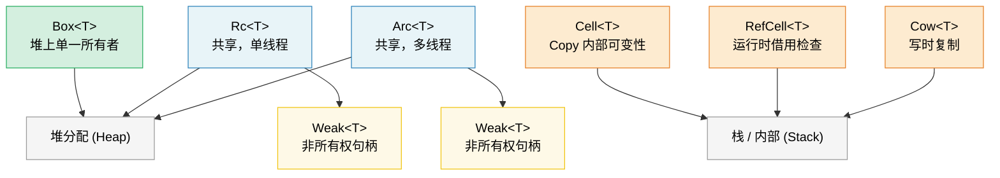

[English Original](../en/ch09-smart-pointers-and-interior-mutability.md)

# 第 9 章：智能指针 (Smart Pointers) 与内部可变性 (Interior Mutability) 🟡

> **你将学到：**
> - 使用 `Box`, `Rc`, `Arc` 进行堆分配与共享所有权
> - 使用弱引用 (Weak references) 打破 `Rc`/`Arc` 的引用循环
> - `Cell`, `RefCell` 和 `Cow` 等内部可变性模式
> - 用于自引用类型的 `Pin`，以及用于生命周期控制的 `ManuallyDrop`

## Box, Rc, Arc —— 堆分配与共享

```rust
// --- Box<T>：单一所有者，堆分配 ---
// 适用场景：递归类型、大型数值、Trait 对象 (Trait objects)
let boxed: Box<i32> = Box::new(42);
println!("{}", *boxed); // 解引用为 i32

// 递归类型需要 Box (否则大小将是无限的)：
enum List<T> {
    Cons(T, Box<List<T>>),
    Nil,
}

// Trait 对象 (动态分发)：
let writer: Box<dyn std::io::Write> = Box::new(std::io::stdout());

// --- Rc<T>：多所有者，单线程 ---
// 适用场景：在单个线程内的共享所有权 (未实现 Send/Sync)
use std::rc::Rc;

let a = Rc::new(vec![1, 2, 3]);
let b = Rc::clone(&a); // 增加引用计数 (并非深拷贝)
let c = Rc::clone(&a);
println!("引用计数: {}", Rc::strong_count(&a)); // 3

// 三个指针都指向同一个 Vec。当最后一个 Rc 被 drop 时，
// 该 Vec 内存将被释放。

// --- Arc<T>：多所有者，线程安全 ---
// 适用场景：跨线程的共享所有权
use std::sync::Arc;

let shared = Arc::new(String::from("共享数据"));
let handles: Vec<_> = (0..5).map(|_| {
    let shared = Arc::clone(&shared);
    std::thread::spawn(move || println!("{shared}"))
}).collect();
for h in handles { h.join().unwrap(); }
```

### 弱引用 —— 打破引用循环

`Rc` 和 `Arc` 使用的是引用计数，无法自动释放循环引用 (A → B → A)。
`Weak<T>` 是一种不持有所有权的句柄，它 **不会** 增加强引用计数：

```rust
use std::rc::{Rc, Weak};
use std::cell::RefCell;

struct Node {
    value: i32,
    parent: RefCell<Weak<Node>>,   // 不会让父节点保持存活
    children: RefCell<Vec<Rc<Node>>>,
}

let parent = Rc::new(Node {
    value: 0, parent: RefCell::new(Weak::new()), children: RefCell::new(vec![]),
});
let child = Rc::new(Node {
    value: 1, parent: RefCell::new(Rc::downgrade(&parent)), children: RefCell::new(vec![]),
});
parent.children.borrow_mut().push(Rc::clone(&child));

// 从子节点访问父节点 —— 返回 Option<Rc<Node>>：
if let Some(p) = child.parent.borrow().upgrade() {
    println!("子节点的父节点值: {}", p.value); // 0
}
// 当 `parent` 被 drop 时，其强引用计数强行归零，内存释放。
// 此时 `child.parent.upgrade()` 将返回 `None`。
```

**经验法则**：对于所有权关系的边使用 `Rc`/`Arc`，对于回溯引用 (Back-references) 和缓存使用 `Weak`。在线程安全的代码中，请组合使用 `Arc<T>` 与 `sync::Weak<T>`。

### Cell 与 RefCell —— 内部可变性

有时你需要在共享 (`&`) 引用之后修改数据。Rust 通过“内部可变性 (Interior Mutability)”及运行时借用检查提供了这一功能：

```rust
use std::cell::{Cell, RefCell};

// --- Cell<T>：基于复制 (Copy-based) 的内部可变性 ---
// 仅适用于 Copy 类型 (或支持 swap/replace 的类型)
struct Counter {
    count: Cell<u32>,
}

impl Counter {
    fn new() -> Self { Counter { count: Cell::new(0) } }

    fn increment(&self) { // 注意是 &self，而非 &mut self！
        self.count.set(self.count.get() + 1);
    }

    fn value(&self) -> u32 { self.count.get() }
}

// --- RefCell<T>：运行时借用检查 ---
// 如果你在运行时违反借用规则，程序将发生 Panic
struct Cache {
    data: RefCell<Vec<String>>,
}

impl Cache {
    fn new() -> Self { Cache { data: RefCell::new(Vec::new()) } }

    fn add(&self, item: String) { // &self —— 从外部看是不可变的
        self.data.borrow_mut().push(item); // 运行时检查的 &mut
    }

    fn get_all(&self) -> Vec<String> {
        self.data.borrow().clone() // 运行时检查的 &
    }

    fn bad_example(&self) {
        let _guard1 = self.data.borrow();
        // let _guard2 = self.data.borrow_mut();
        // ❌ 运行时 Panic —— 无法在持有 & 的同时获取 &mut
    }
}
```

> **Cell vs RefCell**：`Cell` 永远不会发生 Panic (它通过拷贝或交换值来工作)，但它仅适用于 `Copy` 类型，或需要通过 `swap()`/`replace()` 操作。`RefCell` 适用于任何类型，但在发生双重可变借用时会 Panic。两者都不是 `Sync` 的 —— 如需在多线程中使用，请参考 `Mutex`/`RwLock`。

### Cow —— 写时复制 (Clone on Write)

`Cow` (Clone on Write) 持有一个借用或拥有的值。它 **仅在需要修改时** 才会执行克隆：

```rust
use std::borrow::Cow;

// 当不需要修改时，避免内存分配：
fn normalize(input: &str) -> Cow<'_, str> {
    if input.contains('\t') {
        // 仅在需要替换制表符时执行分配 (Allocate)
        Cow::Owned(input.replace('\t', "    "))
    } else {
        // 不分配执行分配 —— 直接返回引用
        Cow::Borrowed(input)
    }
}

fn main() {
    let clean = "no tabs here";
    let dirty = "tabs\there";

    let r1 = normalize(clean); // Cow::Borrowed —— 零分配
    let r2 = normalize(dirty); // Cow::Owned —— 分配了新的 String

    println!("{r1}");
    println!("{r2}");
}

// 对于“可能需要所有权”的函数参数也非常有用：
fn process(data: Cow<'_, [u8]>) {
    // 无需拷贝即可读取数据
    println!("长度: {}", data.len());
    // 如果需要修改，Cow 会自动执行克隆：
    let mut owned = data.into_owned(); // 仅当它是 Borrowed 时克隆
    owned.push(0xFF);
}
```

#### 用于二进制数据的 `Cow<'_, [u8]>`

对于可能需要也可能不需要转换（如校验和插入、填充、转义）的字节导向型 API，`Cow` 特别有用。这可以避免在通用的快速路径 (Fast path) 上分配 `Vec<u8>`：

```rust
use std::borrow::Cow;

/// 将帧填充到最小长度，若不需要填充则借用。
fn pad_frame(frame: &[u8], min_len: usize) -> Cow<'_, [u8]> {
    if frame.len() >= min_len {
        Cow::Borrowed(frame)  // 长度已经足够 —— 零分配
    } else {
        let mut padded = frame.to_vec();
        padded.resize(min_len, 0x00);
        Cow::Owned(padded)    // 仅在需要填充时分配
    }
}

let short = pad_frame(&[0xDE, 0xAD], 8);    // Owned —— 已填充至 8 字节
let long  = pad_frame(&[0; 64], 8);          // Borrowed —— 已经 ≥ 8
```

> **提示**：当你需要引用计数式的共享，且可能涉及转换后的缓冲区时，请配合使用 `Cow<[u8]>` 与 `bytes::Bytes` (见第 10 章)。

---

### 何时使用哪种指针

| 指针 | 所有者数量 | 线程安全 | 可变性 | 适用场景 |
|---------|:-----------:|:-----------:|:----------:|----------|
| `Box<T>` | 1 | ✅ (若 T: Send) | 通过 `&mut` | 堆分配、Trait 对象、递归类型 |
| `Rc<T>` | N | ❌ | 无 (需包裹在 Cell/RefCell 中) | 共享所有权、单线程、图/树结构 |
| `Arc<T>` | N | ✅ | 无 (需包裹在 Mutex/RwLock 中) | 跨线程共享所有权 |
| `Cell<T>` | — | ❌ | `.get()` / `.set()` | Copy 类型的内部可变性 |
| `RefCell<T>` | — | ❌ | `.borrow()` / `.borrow_mut()` | 任意类型的内部可变性，单线程 |
| `Cow<'_, T>` | 0 或 1 | ✅ (若 T: Send) | 写时复制 | 避免在数据通常不改变时进行分配 |

---

### Pin 与自引用类型

`Pin<P>` 能够防止一个值在内存中被移动。这对于 **自引用类型 (Self-referential types)** —— 即包含指向自身数据指针的结构体 —— 以及 `Future` 来说至关重要，因为 `Future` 可能会在跨越 `.await` 点时持有引用。

```rust
use std::pin::Pin;
use std::marker::PhantomPinned;

// 一个简单的自引用结构体示例：
struct SelfRef {
    data: String,
    ptr: *const String, // 指向本结构体中的 `data` 字段
    _pin: PhantomPinned, // 退出 Unpin —— 禁止移动该结构体
}

impl SelfRef {
    fn new(s: &str) -> Pin<Box<Self>> {
        let val = SelfRef {
            data: s.to_string(),
            ptr: std::ptr::null(),
            _pin: PhantomPinned,
        };
        let mut boxed = Box::pin(val);

        // 安全性 (SAFETY)：在设置指针后，我们不再移动数据
        let self_ptr: *const String = &boxed.data;
        unsafe {
            let mut_ref = Pin::as_mut(&mut boxed);
            Pin::get_unchecked_mut(mut_ref).ptr = self_ptr;
        }
        boxed
    }

    fn data(&self) -> &str {
        &self.data
    }

    fn ptr_data(&self) -> &str {
        // 安全性 (SAFETY)：ptr 在固定 (Pinned) 后被设置为指向 self.data
        unsafe { &*self.ptr }
    }
}

fn main() {
    let pinned = SelfRef::new("hello");
    assert_eq!(pinned.data(), pinned.ptr_data()); // 均为 "hello"
    // std::mem::swap 会使 ptr 失效 —— 但 Pin 防止了移动操作
}
```

**核心概念：**

| 概念 | 含义 |
|---------|--------|
| `Unpin` (自动 Trait) | “移动该类型是安全的。” 大多数类型默认都是 `Unpin`。 |
| `!Unpin` / `PhantomPinned` | “我有内部指针 —— 请不要移动我。” |
| `Pin<&mut T>` | 一个保证 `T` 不会被移动的可变引用。 |
| `Pin<Box<T>>` | 一个在堆上固定的、拥有所有权的值。 |

**为什么这在异步中很重要：** 每一个 `async fn` 都会被脱糖 (Desugars) 为一个 `Future`，它可能跨 `.await` 点持有引用 —— 这使它变成了自引用的。异步运行时使用 `Pin<&mut Future>` 来保证 Future 在被轮询 (Polled) 后不会被移动。

```rust
// 当你写下：
async fn fetch(url: &str) -> String {
    let response = http_get(url).await; // 引用被跨 await 持有
    response.text().await
}

// 编译器会生成一个实现 !Unpin 的状态机结构体，
// 运行时在调用 Future::poll() 之前会将其固定。
```

> **什么时候需要关心 Pin：** (1) 手动实现 `Future` 时，(2) 编写异步运行时或组合子时，(3) 任何带有自引用指针的结构体。对于一般的应用层代码，`async/await` 会透明地处理固定 (Pinning)。参见配套的《异步 Rust 训练》获取更深入的覆盖。
>
> **替代库：** 对于无需手动 `Pin` 的自引用结构体，可以考虑使用 [`ouroboros`](https://crates.io/crates/ouroboros) 或 [`self_cell`](https://crates.io/crates/self_cell) —— 它们会生成具有正确固定和 drop 语义的安全包装。

---

### Pin 投影 —— 结构性固定 (Structural Pinning)

当你持有 `Pin<&mut MyStruct>` 时，通常需要访问其单个字段。**Pin 投影 (Pin projection)** 是一种从 `Pin<&mut Struct>` 安全地转换到 `Pin<&mut Field>` (针对被固定的字段) 或 `&mut Field` (针对未固定的字段) 的模式。

#### 示例：被固定类型中的字段访问

```rust
use std::pin::Pin;
use std::marker::PhantomPinned;

struct MyFuture {
    data: String,              // 普通字段 —— 移动是安全的
    state: InternalState,      // 自引用字段 —— 必须保持固定
    _pin: PhantomPinned,
}

enum InternalState {
    Waiting { ptr: *const String }, // 指向 `data` —— 自引用的
    Done,
}

// 给定 `Pin<&mut MyFuture>`，你该如何访问 `data` 和 `state`？
// 你不能直接通过 `pinned.data` 来访问 —— 
// 编译器不允许你在不使用 unsafe 的情况下获取固定值的字段引用。
```

#### 手动 Pin 投影 (使用 unsafe)

```rust
impl MyFuture {
    // 投影到 `data` —— 该字段在结构上未固定 (移动是安全的)
    fn data(self: Pin<&mut Self>) -> &mut String {
        // 安全性 (SAFETY)：`data` 未被结构性固定。仅移动 `data` 
        // 并不移动整个结构体，因此 Pin 的保证依然有效。
        unsafe { &mut self.get_unchecked_mut().data }
    }

    // 投影到 `state` —— 该字段在结构上是固定的 (Structurally pinned)
    fn state(self: Pin<&mut Self>) -> Pin<&mut InternalState> {
        // 安全性 (SAFETY)：`state` 是结构性固定的 —— 我们通过
        // 返回 Pin<&mut InternalState> 来维持 Pin 的不变性。
        unsafe { Pin::new_unchecked(&mut self.get_unchecked_mut().state) }
    }
}
```

**结构性固定 (Structural Pinning) 规则** —— 一个字段在以下情况是“结构性固定”的：
1. 仅移动或交换该字段就可能使自引用失效。
2. 结构体的 `Drop` 实现必须保证不移动该字段。
3. 结构体必须是 `!Unpin` 的 (通过 `PhantomPinned` 或 `!Unpin` 字段强制执行)。

#### `pin-project` —— 安全的 Pin 投影 (零 Unsafe)

`pin-project` 库在编译时生成可证明正确的投影，消除了手动使用 `unsafe` 的需求：

```rust
use pin_project::pin_project;
use std::pin::Pin;
use std::future::Future;
use std::task::{Context, Poll};

#[pin_project]                   // <-- 生成投影方法
struct TimedFuture<F: Future> {
    #[pin]                       // <-- 结构性固定 (因为它是一个 Future)
    inner: F,
    started_at: std::time::Instant, // 未固定 —— 普通数据
}

impl<F: Future> Future for TimedFuture<F> {
    type Output = (F::Output, std::time::Duration);

    fn poll(self: Pin<&mut Self>, cx: &mut Context<'_>) -> Poll<Self::Output> {
        let this = self.project();  // 安全！由 pin_project 生成
        //   this.inner   : Pin<&mut F>              — 固定字段
        //   this.started_at : &mut std::time::Instant — 未固定字段

        match this.inner.poll(cx) {
            Poll::Ready(output) => {
                let elapsed = this.started_at.elapsed();
                Poll::Ready((output, elapsed))
            }
            Poll::Pending => Poll::Pending,
        }
    }
}
```

#### `pin-project` vs 手动投影

| 维度 | 手动 (`unsafe`) | `pin-project` |
|--------|-------------------|---------------|
| 安全性 | 你来自行证明不变性 | 编译器验证 |
| 样板代码 | 低 (但容易出错) | 零样板 —— 通过派生宏 |
| `Drop` 交互 | 必须保证不移动固定字段 | 强制执行：`#[pinned_drop]` |
| 编译成本 | 无 | 过程宏展开开销 |
| 适用场景 | 原语、`no_std` 环境 | 应用开发 / 库开发 |

#### `#[pinned_drop]` —— 被固定类型的 Drop

当一个类型包含 `#[pin]` 字段时，`pin-project` 要求使用 `#[pinned_drop]` 代替常规的 `Drop` 实现，以防止意外移动固定的字段：

```rust
use pin_project::{pin_project, pinned_drop};
use std::pin::Pin;

#[pin_project(PinnedDrop)]
struct Connection<F> {
    #[pin]
    future: F,
    buffer: Vec<u8>,  // 未固定 —— 可以在 drop 中移动
}

#[pinned_drop]
impl<F> PinnedDrop for Connection<F> {
    fn drop(self: Pin<&mut Self>) {
        let this = self.project();
        // `this.future` 是 Pin<&mut F> —— 无法移动，只能就地析构
        // `this.buffer` 是 &mut Vec<u8> —— 可以执行 drain、clear 等操作
        this.buffer.clear();
        println!("连接已关闭，缓冲区已清空");
    }
}
```

#### 何时在实践中需要 Pin 投影



> **经验法则：** 如果你是在包装另一个 `Future` 或 `Stream`，请使用 `pin-project`。如果你是在使用 `async/await` 编写应用程序代码，你永远不需要直接使用 Pin 投影。参见配套的《异步 Rust 训练》中有关使用 Pin 投影的异步组合子模式。

---

### Drop 顺序与 ManuallyDrop

Rust 的 Drop 顺序是确定性的 (Deterministic)，但有一些规则值得了解：

#### Drop 顺序规则

```rust
struct Label(&'static str);

impl Drop for Label {
    fn drop(&mut self) { println!("正在释放 {}", self.0); }
}

fn main() {
    let a = Label("第一个");   // 首先声明
    let b = Label("第二个");   // 其次声明
    let c = Label("第三个");   // 最后声明
}
// 输出：
//   正在释放 第三个    ← 局部变量按声明顺序的逆序释放
//   正在释放 第二个
//   正在释放 第一个
```

**三项基本规则：**

| 释放项 | Drop 顺序 | 原理 |
|------|-----------|----------|
| **局部变量** | 声明顺序的逆序 | 后定义的变量可能引用先定义的变量 |
| **结构体字段** | 声明顺序 (从上到下) | 与构建顺序一致 (自 Rust 1.0 起稳定，由 [RFC 1857](https://rust-lang.github.io/rfcs/1857-stabilize-drop-order.html) 保证) |
| **元组元素** | 声明顺序 (从左到右) | `(a, b, c)` → 先释放 `a`，再 `b`，最后 `c` |

```rust
struct Server {
    listener: Label,  // 第 1 个释放
    handler: Label,   // 第 2 个释放
    logger: Label,    // 第 3 个释放
}
// 字段按从上到下的声明顺序释放。
// 当字段之间存在相互引用或持有资源依赖时，这一点非常重要。
```

> **实际影响：** 如果你的结构体同时包含 `JoinHandle` 和 `Sender`，字段顺序决定了谁先被释放。如果线程正在从通道中读取数据，应先释放 `Sender` (关闭通道) 以使线程退出，然后再 join 该 handle。因此在结构体中应将 `Sender` 放在 `JoinHandle` 之上。

#### `ManuallyDrop<T>` —— 抑制自动 Drop

`ManuallyDrop<T>` 包装一个值并防止其析构函数 (Destructor) 自动运行。你将承担起手动释放它（或故意让其内存泄漏）的责任：

```rust
use std::mem::ManuallyDrop;

// 用例 1：防止 Unsafe 代码中的双重释放 (Double-free)
struct TwoPhaseBuffer {
    // 我们需要自行释放 Vec 以控制时机
    data: ManuallyDrop<Vec<u8>>,
    committed: bool,
}

impl TwoPhaseBuffer {
    fn new(capacity: usize) -> Self {
        TwoPhaseBuffer {
            data: ManuallyDrop::new(Vec::with_capacity(capacity)),
            committed: false,
        }
    }

    fn write(&mut self, bytes: &[u8]) {
        self.data.extend_from_slice(bytes);
    }

    fn commit(&mut self) {
        self.committed = true;
        println!("已提交 {} 字节", self.data.len());
    }
}

impl Drop for TwoPhaseBuffer {
    fn drop(&mut self) {
        if !self.committed {
            println!("正在回滚 —— 释放未提交的数据");
        }
        // 安全性 (SAFETY)：由我们保证此处数据有效且仅被释放一次。
        unsafe { ManuallyDrop::drop(&mut self.data); }
    }
}
```

```rust
// 用例 2：故意的内存泄漏 (例如全局单例)
fn leaked_string() -> &'static str {
    // Box::leak() 是创建 &'static 引用的惯用方式：
    let s = String::from("永生不死");
    Box::leak(s.into_boxed_str())
    // ⚠️ 这是一个受控的内存泄漏。该 String 的堆内存永不释放。
    // 仅用于长寿的单例对象。
}

// ManuallyDrop 替代方案 (需要 unsafe)：
// ⚠️ 优先使用上面的 Box::leak() —— 此处仅为演示 ManuallyDrop 的语义
// (在堆数据存活的同时抑制 Drop)。
fn leaked_string_manual() -> &'static str {
    use std::mem::ManuallyDrop;
    let md = ManuallyDrop::new(String::from("永生不死"));
    // 安全性 (SAFETY)：ManuallyDrop 防止了内存释放；堆数据将永远
    // 存活，因此 &'static 引用是有效的。
    unsafe { &*(md.as_str() as *const str) }
}
```

**ManuallyDrop vs `mem::forget`：**

| | `ManuallyDrop<T>` | `mem::forget(value)` |
|---|---|---|
| 时机 | 在构建时包装 | 在稍后消耗 |
| 内部访问 | `&*md` / `&mut *md` | 值已消失，无法访问 |
| 稍后释放 | `ManuallyDrop::drop(&mut md)` | 不可行 |
| 适用场景 | 细粒度的生命周期控制 | 运行即不管 (Fire-and-forget) 的解构抑制 |

> **准则：** 仅在需要 **精确控制** 析构函数运行波次的 Unsafe 抽象中使用 `ManuallyDrop`。在安全的应用程序代码中，你几乎永远不需要它 —— Rust 的自动 Drop 顺序足以正确处理绝大多数情况。

---

> **关键要点 —— 智能指针**
> - `Box` 用于堆上的单一所有权；`Rc`/`Arc` 用于共享所有权 (单线程/多线程)。
> - `Cell`/`RefCell` 提供内部可变性；`RefCell` 在运行时检查违规并 Panic。
> - `Cow` 避免在通用路径上进行内存分配；`Pin` 防止自引用类型的内存移动。
> - Drop 顺序：字段按声明顺序释放 (RFC 1857)；局部变量按声明顺序的逆序释放。

> **另请参阅：** [第 6 章 —— 并发](ch06-concurrency-vs-parallelism-vs-threads.md) 了解 Arc + Mutex 模式。[第 4 章 —— PhantomData](ch04-phantomdata-types-that-carry-no-data.md) 了解与智能指针配合使用的 PhantomData。



---

### 练习：引用计数图 (Reference-Counted Graph) ★★ (~30 分钟)

利用 `Rc<RefCell<Node>>` 构建一个有向图 (Directed graph)，其中每个节点都有一个名称和子节点列表。创建一个循环 (A → B → C → A)，并使用 `Weak` 来打破回边 (Back-edge)。通过 `Rc::strong_count` 验证是否存在内存泄漏。

<details>
<summary>🔑 参考答案</summary>

```rust
use std::cell::RefCell;
use std::rc::{Rc, Weak};

struct Node {
    name: String,
    children: Vec<Rc<RefCell<Node>>>,
    back_ref: Option<Weak<RefCell<Node>>>,
}

impl Node {
    fn new(name: &str) -> Rc<RefCell<Self>> {
        Rc::new(RefCell::new(Node {
            name: name.to_string(),
            children: Vec::new(),
            back_ref: None,
        }))
    }
}

impl Drop for Node {
    fn drop(&mut self) {
        println!("正在释放 {}", self.name);
    }
}

fn main() {
    let a = Node::new("A");
    let b = Node::new("B");
    let c = Node::new("C");

    // A → B → C，其中 C 通过 Weak 指向 A 构成的回边
    a.borrow_mut().children.push(Rc::clone(&b));
    b.borrow_mut().children.push(Rc::clone(&c));
    c.borrow_mut().back_ref = Some(Rc::downgrade(&a)); // 弱引用！

    println!("A 的强引用计数: {}", Rc::strong_count(&a)); // 1 (仅变量 `a` 绑定)
    println!("B 的强引用计数: {}", Rc::strong_count(&b)); // 2 (b + A 的子节点)
    println!("C 的强引用计数: {}", Rc::strong_count(&c)); // 2 (c + B 的子节点)

    // 升级弱引用证明其有效：
    let c_ref = c.borrow();
    if let Some(back) = &c_ref.back_ref {
        if let Some(a_ref) = back.upgrade() {
            println!("C 指回了: {}", a_ref.borrow().name);
        }
    }
    // 当 a, b, c 超出作用域时，所有 Node 都会被释放 (没有循环引用导致的泄漏！)
}
```

</details>

***
