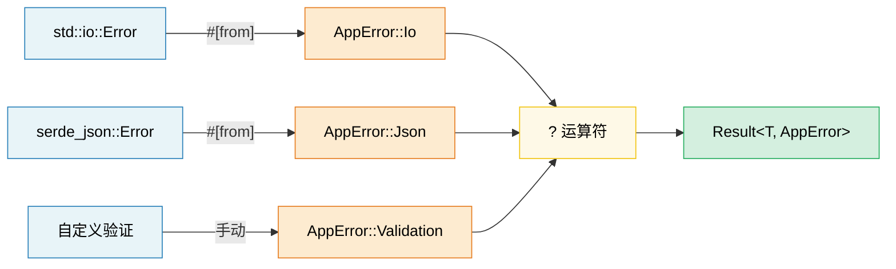

[English Original](../en/ch10-error-handling-patterns.md)

# 第 10 章：错误处理模式 (Error Handling Patterns) 🟢

> **你将学到：**
> - 何时使用 `thiserror` (库开发) 与 `anyhow` (应用程序开发)
> - 处理带有 `#[from]` 和 `.context()` 包装器的错误转换链
> - `?` 运算符在 `main()` 中的脱糖 (Desugars) 与工作原理
> - 什么时候应该 panic，什么时候返回错误，以及用于 FFI 边界的 `catch_unwind`

## thiserror vs anyhow —— 库 vs 应用程序

Rust 的错误处理以 `Result<T, E>` 类型为中心。目前有两个库占据主导地位：

```rust,ignore
// --- thiserror：适用于“库 (LIBRARIES)” ---
// 通过派生宏生成 Display、Error 和 From 的实现 (impl)
use thiserror::Error;

#[derive(Error, Debug)]
pub enum DatabaseError {
    #[error("连接失败: {0}")]
    ConnectionFailed(String),

    #[error("查询错误: {source}")]
    QueryError {
        #[source]
        source: sqlx::Error,
    },

    #[error("未找到记录: table={table} id={id}")]
    NotFound { table: String, id: u64 },

    #[error(transparent)] // 将 Display 委派 (Delegate) 给内部错误
    Io(#[from] std::io::Error), // 自动生成 From<io::Error>
}

// --- anyhow：适用于“应用程序 (APPLICATIONS)” ---
// 动态错误类型 —— 非常适合你只想让错误向上传播的顶层代码
use anyhow::{Context, Result, bail, ensure};

fn read_config(path: &str) -> Result<Config> {
    let content = std::fs::read_to_string(path)
        .with_context(|| format!("无法从 {path} 读取配置"))?;

    let config: Config = serde_json::from_str(&content)
        .context("解析配置 JSON 失败")?;

    ensure!(config.port > 0, "端口必须为正数, 得到 {}", config.port);

    Ok(config)
}

fn main() -> Result<()> {
    let config = read_config("server.toml")?;

    if config.name.is_empty() {
        bail!("服务器名称不能为空"); // 立即返回 Err
    }

    Ok(())
}
```

**何时使用哪一个**：

| 特性 | `thiserror` | `anyhow` |
|---|---|---|
| **适用范围** | 库、共享的 Crate | 应用程序、二进制执行文件 |
| **错误类型** | 具体枚举 (Concrete enums) —— 调用者可匹配 | `anyhow::Error` —— 结构不透明 |
| **开发成本** | 需要定义自己的错误枚举 | 直接使用 `Result<T>` 即可 |
| **类型下行转换** | 无需 —— 使用模式匹配 | 需要 `error.downcast_ref::<MyError>()` |

### 错误转换链 (#[from])

```rust,ignore
use thiserror::Error;

#[derive(Error, Debug)]
enum AppError {
    #[error("I/O 错误: {0}")]
    Io(#[from] std::io::Error),

    #[error("JSON 错误: {0}")]
    Json(#[from] serde_json::Error),

    #[error("HTTP 错误: {0}")]
    Http(#[from] reqwest::Error),
}

// 现在 `?` 可以自动执行转换：
fn fetch_and_parse(url: &str) -> Result<Config, AppError> {
    let body = reqwest::blocking::get(url)?.text()?;  // reqwest::Error → AppError::Http
    let config: Config = serde_json::from_str(&body)?; // serde_json::Error → AppError::Json
    Ok(config)
}
```

### 上下文与错误包装

在不丢失原始错误信息的情况下，为错误添加人类可读的上下文：

```rust,ignore
use anyhow::{Context, Result};

fn process_file(path: &str) -> Result<Data> {
    let content = std::fs::read_to_string(path)
        .with_context(|| format!("读取 {path} 失败"))?;

    let data = parse_content(&content)
        .with_context(|| format!("解析 {path} 失败"))?;

    validate(&data)
        .context("验证失败")?;

    Ok(data)
}

// 错误输出示例：
// Error: 验证失败
//
// Caused by:
//    0: 解析 config.json 失败
//    1: expected ',' at line 5 column 12
```

### 深入理解 `?` 运算符

`?` 是语法糖 (Syntactic sugar)，它等同于 `match` + `From` 转换 + 早期返回：

```rust
// 这一行：
let value = operation()?;

// 脱糖 (Desugars) 后等同于：
let value = match operation() {
    Ok(v) => v,
    Err(e) => return Err(From::from(e)),
    //                  ^^^^^^^^^^^^^^
    //                  通过 From Trait 执行自动转换
};
```

**`?` 也能用于 `Option`** (在返回 `Option` 的函数中)：

```rust
fn find_user_email(users: &[User], name: &str) -> Option<String> {
    let user = users.iter().find(|u| u.name == name)?; // 若未找到则返回 None
    let email = user.email.as_ref()?; // 若 email 为 None 则返回 None
Some(email.to_uppercase())
}
```

---

### Panic、catch_unwind 以及何时中止 (Abort)

```rust
// Panic：用于处理 BUG，而非预料中的错误
fn get_element(data: &[i32], index: usize) -> &i32 {
    // 如果这里发生了 Panic，说明是一个编程错误 (Bug)。
    // 不要试图“处理”它 —— 应该去修复调用者。
    &data[index]
}

// catch_unwind：用于处理边界逻辑 (如 FFI、线程池)
use std::panic;

let result = panic::catch_unwind(|| {
    // 安全地运行可能发生 Panic 的代码
    risky_operation()
});

match result {
    Ok(value) => println!("成功: {value:?}"),
    Err(_) => eprintln!("操作发生了 Panic —— 正在安全地继续运行"),
}

// 何时使用哪种方式：
// - Result<T, E>    → 预料中的失败 (如：文件未找到、网络超时)
// - panic!()        → 编程上的 Bug (如：索引越界、违反了不变性)
// - process::abort() → 不可恢复的状态 (如：安全性违规、数据损坏)
```

> **与 C++ 的比较**：对于预料中的错误，`Result<T, E>` 替代了异常 (Exceptions)。`panic!()` 类似于 `assert()` 或 `std::terminate()` —— 它用于处理 Bug，而非控制流。Rust 的 `?` 运算符使错误传播变得如异常般符合人体工程学 (Ergonomic)，且没有不可预测的控制流。

---

> **关键要点 —— 错误处理**
> - **库开发**：使用 `thiserror` 定义结构化的错误枚举；**应用程序开发**：使用 `anyhow` 实现符合人体工程学的错误传播。
> - `#[from]` 自动生成 `From` 实现；`.context()` 添加人类可读的包装层。
> - `?` 会被脱糖为 `From::from()` + 早期返回；它在返回 `Result` 的 `main()` 函数中同样有效。

> **另请参阅：** [第 15 章 —— API 设计](ch15-crate-architecture-and-api-design.md) 了解“解析而非验证 (Parse, don't validate)”模式。[第 11 章 —— 序列化](ch11-serialization-zero-copy-and-binary-data.md) 了解 Serde 的错误处理。



---

### 练习：使用 thiserror 构建错误层级 ★★ (~30 分钟)

为一个文件处理应用程序设计错误层级结构。该程序可能在 I/O、解析 (JSON 与 CSV) 以及验证过程中失败。请使用 `thiserror` 并演示 `?` 传播。

<details>
<summary>🔑 参考答案</summary>

```rust,ignore
use thiserror::Error;

#[derive(Error, Debug)]
pub enum AppError {
    #[error("I/O 错误: {0}")]
    Io(#[from] std::io::Error),

    #[error("JSON 解析错误: {0}")]
    Json(#[from] serde_json::Error),

    #[error("CSV 错误 (行 {line}): {message}")]
    Csv { line: usize, message: String },

    #[error("验证错误: {field} —— {reason}")]
    Validation { field: String, reason: String },
}

fn read_file(path: &str) -> Result<String, AppError> {
    Ok(std::fs::read_to_string(path)?) // 通过 #[from] 将 io::Error 转换为 AppError::Io
}

fn parse_json(content: &str) -> Result<serde_json::Value, AppError> {
    Ok(serde_json::from_str(content)?) // 将 serde_json::Error 转换为 AppError::Json
}

fn validate_name(value: &serde_json::Value) -> Result<String, AppError> {
    let name = value.get("name")
        .and_then(|v| v.as_str())
        .ok_or_else(|| AppError::Validation {
            field: "name".into(),
            reason: "必须是非空字符串".into(),
        })?;

    if name.is_empty() {
        return Err(AppError::Validation {
            field: "name".into(),
            reason: "不能为空".into(),
        });
    }

    Ok(name.to_string())
}

fn process_file(path: &str) -> Result<String, AppError> {
    let content = read_file(path)?;
    let json = parse_json(&content)?;
    let name = validate_name(&json)?;
    Ok(name)
}

fn main() {
    match process_file("config.json") {
        Ok(name) => println!("名称: {name}"),
        Err(e) => eprintln!("错误: {e}"),
    }
}
```

</details>

***
```
