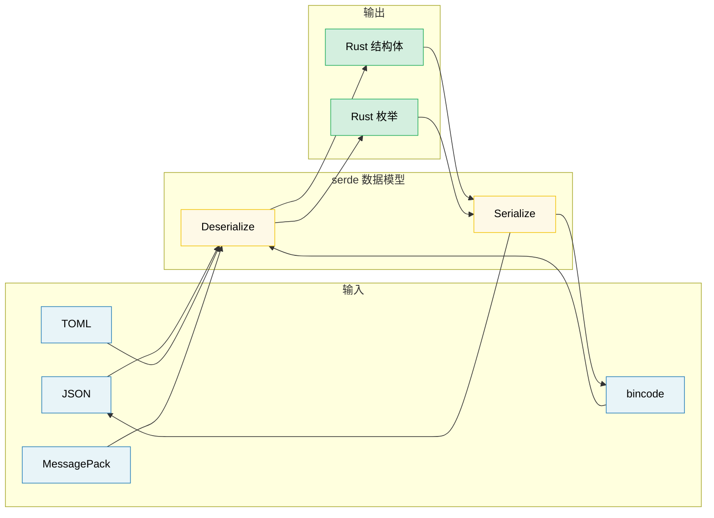

[English Original](../en/ch11-serialization-zero-copy-and-binary-data.md)

# 第 11 章：序列化、零拷贝与二进制数据 🟡

> **你将学到：**
> - **serde 基础知识**：派生宏、属性与枚举表示形式。
> - **零拷贝 (Zero-copy) 反序列化**：适用于高性能、读密集型的工作负载。
> - **serde 格式生态系统**：JSON、TOML、bincode、MessagePack。
> - **二进制数据处理**：通过 `repr(C)`、`zerocopy` 和 `bytes::Bytes` 处理数据。

## 11.1 serde 基础知识

`serde` (SERialize/DEserialize) 是 Rust 中通用的序列化框架。它将 **数据模型 (Data model)** (你的结构体) 与 **数据格式 (Format)** (JSON、TOML、二进制等) 分离开来：

```rust,ignore
use serde::{Serialize, Deserialize};

#[derive(Debug, Serialize, Deserialize)]
struct ServerConfig {
    name: String,
    port: u16,
    #[serde(default)]                    // 如果缺失，则使用 Default::default()
    max_connections: usize,
    #[serde(skip_serializing_if = "Option::is_none")]
    tls_cert_path: Option<String>,
}

fn main() -> Result<(), Box<dyn std::error::Error>> {
    // 从 JSON 反序列化：
    let json_input = r#"{
        "name": "hw-diag",
        "port": 8080
    }"#;
    let config: ServerConfig = serde_json::from_str(json_input)?;
    println!("{config:?}");
    // ServerConfig { name: "hw-diag", port: 8080, max_connections: 0, tls_cert_path: None }

    // 序列化为 JSON：
    let output = serde_json::to_string_pretty(&config)?;
    println!("{output}");

    // 同样的结构体，不同的格式 —— 无需修改代码：
    let toml_input = r#"
        name = "hw-diag"
        port = 8080
    "#;
    let config: ServerConfig = toml::from_str(toml_input)?;
    println!("{config:?}");

    Ok(())
}
```

> **核心洞察**：你的结构体只需派生一次 `Serialize` 和 `Deserialize`。然后它就能与 *任何* 兼容 serde 的格式配合使用 —— 包括 JSON、TOML、YAML、bincode、MessagePack、CBOR、postcard 以及其他数十种格式。

### 常用的 serde 属性

serde 通过字段和容器属性提供了对序列化的细粒度控制：

```rust,ignore
use serde::{Serialize, Deserialize};

// --- 容器属性 (用于结构体/枚举上) ---
#[derive(Serialize, Deserialize)]
#[serde(rename_all = "camelCase")]       // JSON 惯例：field_name → fieldName
#[serde(deny_unknown_fields)]            // 拒绝额外的键 —— 严格解析
struct DiagResult {
    test_name: String,                   // 序列化为 "testName"
    pass_count: u32,                     // 序列化为 "passCount"
    fail_count: u32,                     // 序列化为 "failCount"
}

// --- 字段属性 ---
#[derive(Serialize, Deserialize)]
struct Sensor {
    #[serde(rename = "sensor_id")]       // 覆盖序列化时的字段名称
    id: u64,

    #[serde(default)]                    // 如果输入中缺失，则使用 Default
    enabled: bool,

    #[serde(default = "default_threshold")]
    threshold: f64,

    #[serde(skip)]                       // 永远不进行序列化或反序列化
    cached_value: Option<f64>,

    #[serde(skip_serializing_if = "Vec::is_empty")]
    tags: Vec<String>,

    #[serde(flatten)]                    // 内联嵌套结构体的字段
    metadata: Metadata,

    #[serde(with = "hex_bytes")]         // 使用自定义的序列化/反序列化模块
    raw_data: Vec<u8>,
}

fn default_threshold() -> f64 { 1.0 }

#[derive(Serialize, Deserialize)]
struct Metadata {
    vendor: String,
    model: String,
}
// 使用 #[serde(flatten)] 后，得到的 JSON 如下所示：
// { "sensor_id": 1, "vendor": "Intel", "model": "X200", ... }
// 而不是：{ "sensor_id": 1, "metadata": { "vendor": "Intel", ... } }
```

**常用属性速查表**：

| 属性 | 作用层级 | 效果 |
|-----------|-------|--------|
| `rename_all = "camelCase"` | 容器 | 将所有字段重命名为小驼峰/蛇形/大写蛇形等 |
| `deny_unknown_fields` | 容器 | 对非预期的键报错 (严格模式) |
| `default` | 字段 | 当字段缺失时使用 `Default::default()` |
| `rename = "..."` | 字段 | 自定义序列化名称 |
| `skip` | 字段 | 完全排除在序列化/反序列化之外 |
| `skip_serializing_if = "fn"` | 字段 | 有条件地排除 (例如 `Option::is_none`) |
| `flatten` | 字段 | 内联嵌套结构体的字段 |
| `with = "module"` | 字段 | 使用自定义的序列化/反序列化函数 |
| `alias = "..."` | 字段 | 在反序列化期间接受替代名称 |
| `deserialize_with = "fn"` | 字段 | 仅自定义反序列化函数 |
| `untagged` | 枚举 | 按顺序尝试每个变体 (输出中没有判别式) |

### 枚举表示形式

对于 JSON 等格式，serde 提供了四种枚举表示形式：

```rust,ignore
use serde::{Serialize, Deserialize};

// 1. 外部标记 (Externally Tagged) —— 默认方式：
#[derive(Serialize, Deserialize)]
enum Command {
    Reboot,
    RunDiag { test_name: String, timeout_secs: u64 },
    SetFanSpeed(u8),
}
// "Reboot"                                          → Command::Reboot
// {"RunDiag": {"test_name": "gpu", "timeout_secs": 60}}  → Command::RunDiag { ... }

// 2. 内部标记 (Internally Tagged) —— #[serde(tag = "type")]:
#[derive(Serialize, Deserialize)]
#[serde(tag = "type")]
enum Event {
    Start { timestamp: u64 },
    Error { code: i32, message: String },
    End   { timestamp: u64, success: bool },
}
// {"type": "Start", "timestamp": 1706000000}
// {"type": "Error", "code": 42, "message": "timeout"}

// 3. 相邻标记 (Adjacently Tagged) —— #[serde(tag = "t", content = "c")]:
#[derive(Serialize, Deserialize)]
#[serde(tag = "t", content = "c")]
enum Payload {
    Text(String),
    Binary(Vec<u8>),
}
// {"t": "Text", "c": "hello"}
// {"t": "Binary", "c": [0, 1, 2]}

// 4. 无标记 (Untagged) —— #[serde(untagged)]:
#[derive(Serialize, Deserialize)]
#[serde(untagged)]
enum StringOrNumber {
    Str(String),
    Num(f64),
}
// "hello" → StringOrNumber::Str("hello")
// 42.0    → StringOrNumber::Num(42.0)
// ⚠️ 按顺序尝试 —— 第一个匹配的变体胜出
```

> **如何选择表示形式**：对于大多数 JSON API，请使用内部标记 (`tag = "type"`) —— 它是最可读的，且符合 Go、Python 和 TypeScript 的惯例。仅在形状 (Shape) 本身就足以区分的“联合”类型中使用无标记形式。

### 零拷贝 (Zero-Copy) 反序列化

serde 可以在不分配新字符串的情况下进行反序列化 —— 直接从输入缓冲区借用。这是高性能解析的关键：

```rust,ignore
use serde::Deserialize;

// --- 所有权类型 (涉及分配) ---
// 每个 String 字段都会将字节从输入拷贝到新的堆分配中。
#[derive(Deserialize)]
struct OwnedRecord {
    name: String,           // 分配一个新的 String
    value: String,          // 分配另一个 String
}

// --- 零拷贝 (借用方式) ---
// &'de str 字段直接从输入中借用 —— 零分配。
#[derive(Deserialize)]
struct BorrowedRecord<'a> {
    name: &'a str,          // 指向输入缓冲区
    value: &'a str,         // 指向输入缓冲区
}

fn main() {
    let input = r#"{"name": "cpu_temp", "value": "72.5"}"#;

    // 所有权类型：分配两个 String 对象
    let owned: OwnedRecord = serde_json::from_str(input).unwrap();

    // 零拷贝：`name` 和 `value` 直接指向 `input` —— 无分配
    let borrowed: BorrowedRecord = serde_json::from_str(input).unwrap();

    // 输出受到生命周期的约束：borrowed 的存活时间不能超过 input
    println!("{}: {}", borrowed.name, borrowed.value);
}
```

**理解生命周期**：

```rust,ignore
// Deserialize<'de> —— 结构体可以从生命周期为 'de 的数据中借用：
//   struct BorrowedRecord<'a> where 'a == 'de
//   仅在输入缓冲区存活时间足够长时才有效

// DeserializeOwned —— 结构体拥有其所有数据，不进行借用：
//   trait DeserializeOwned: for<'de> Deserialize<'de> {}
//   适用于任何输入生命周期 (结构体是独立的)

use serde::de::DeserializeOwned;

// 此函数要求所有权类型 —— 输入可以是临时的
fn parse_owned<T: DeserializeOwned>(input: &str) -> T {
    serde_json::from_str(input).unwrap()
}

// 此函数允许借用 —— 更高效，但会限制生命周期
fn parse_borrowed<'a, T: Deserialize<'a>>(input: &'a str) -> T {
    serde_json::from_str(input).unwrap()
}
```

**何时使用零拷贝**：
- 解析大型文件，但你只需要其中的几个字段。
- 高吞吐量管道 (网络数据包、日志行)。
- 当输入缓冲区已经存活足够长时 (例如内存映射文件)。

**何时不要使用零拷贝**：
- 输入是瞬时的 (例如会被重用的网络读取缓冲区)。
- 你需要将结果存储到超过输入生命周期的时间。
- 字段需要进行转换 (如转义字符的处理、规范化)。

> **实用建议**：`Cow<'a, str>` 可以让你两全其美 —— 尽可能借用，必要时进行分配 (例如当 JSON 转义序列需要反转义时)。serde 原生支持 `Cow`。

### 格式生态系统

| 格式 | Crate | 人类可读 | 大小 | 速度 | 使用场景 |
|--------|-------|:--------------:|:----:|:-----:|----------|
| JSON | `serde_json` | ✅ | 大 | 良好 | 配置文件、REST API、日志 |
| TOML | `toml` | ✅ | 中 | 良好 | 配置文件 (Cargo.toml 风格) |
| YAML | `serde_yaml` | ✅ | 中 | 良好 | 配置文件 (复杂嵌套) |
| bincode | `bincode` | ❌ | 小 | 极快 | IPC、缓存、Rust 之间通信 |
| postcard | `postcard` | ❌ | 极小 | 极快 | 嵌入式工程、`no_std` |
| MessagePack | `rmp-serde` | ❌ | 小 | 良好 | 跨语言二进制协议 |
| CBOR | `ciborium` | ❌ | 小 | 良好 | IoT、受限环境 |

```rust
// 同样的结构体，多种格式 —— 这正是 serde 的威力所在：

#[derive(serde::Serialize, serde::Deserialize, Debug)]
struct DiagConfig {
    name: String,
    tests: Vec<String>,
    timeout_secs: u64,
}

let config = DiagConfig {
    name: "accel_diag".into(),
    tests: vec!["memory".into(), "compute".into()],
    timeout_secs: 300,
};

// JSON:   {"name":"accel_diag","tests":["memory","compute"],"timeout_secs":300}
let json = serde_json::to_string(&config).unwrap();       // 67 字节

// bincode: 紧凑的二进制 —— 约 40 字节，没有字段名称
let bin = bincode::serialize(&config).unwrap();            // 显著更小
```

> **如何选择格式**：
> - 人类可编辑的配置文件 → TOML 或 JSON
> - Rust 之间的 IPC/缓存 → bincode (快速、紧凑，但不跨语言)
> - 跨语言二进制通信 → MessagePack 或 CBOR
> - 嵌入式 / `no_std` → postcard

### 二进制数据与 `repr(C)`

在硬件诊断中，解析二进制协议数据非常常见。Rust 提供了用于安全、零拷贝二进制数据处理的工具：

```rust
// --- #[repr(C)]: 可预测的内存布局 ---
// 确保字段按照声明顺序排列，并遵循 C 语言的填充规则。
// 对于匹配硬件寄存器布局和协议头至关重要。

#[repr(C)]
#[derive(Debug, Clone, Copy)]
struct IpmiHeader {
    rs_addr: u8,
    net_fn_lun: u8,
    checksum: u8,
    rq_addr: u8,
    rq_seq_lun: u8,
    cmd: u8,
}

// --- 通过手动解析实现安全的二进制解析 ---
impl IpmiHeader {
    fn from_bytes(data: &[u8]) -> Option<Self> {
        if data.len() < size_of::<Self>() {
            return None;
        }
        Some(IpmiHeader {
            rs_addr:     data[0],
            net_fn_lun:  data[1],
            checksum:    data[2],
            rq_addr:     data[3],
            rq_seq_lun:  data[4],
            cmd:         data[5],
        })
    }

    fn net_fn(&self) -> u8 { self.net_fn_lun >> 2 }
    fn lun(&self)    -> u8 { self.net_fn_lun & 0x03 }
}

// --- 字节序 (Endianness) 感知解析 ---
fn read_u16_le(data: &[u8], offset: usize) -> u16 {
    u16::from_le_bytes([data[offset], data[offset + 1]])
}

fn read_u32_be(data: &[u8], offset: usize) -> u32 {
    u32::from_be_bytes([
        data[offset], data[offset + 1],
        data[offset + 2], data[offset + 3],
    ])
}

// --- #[repr(C, packed)]: 移除填充 (alignment = 1) ---
#[repr(C, packed)]
#[derive(Debug, Clone, Copy)]
struct PcieCapabilityHeader {
    cap_id: u8,        // 能力 ID
    next_cap: u8,      // 指向下一个能力的指针
    cap_reg: u16,      // 能力特定的寄存器
}
// ⚠️ Packed 结构体：获取 &field 会创建非对齐引用 —— 这是未定义行为 (UB)。
// 务必将字段拷贝出来：let id = header.cap_id;  // 正常 (Copy)
// 千万不要：let r = &header.cap_reg;           // 如果未对齐则是 UB
```

### zerocopy 与 bytemuck —— 安全转换 (Transmutation)

与其使用不安全的 `transmute`，不如使用那些能在编译时验证布局安全性的 crate：

```rust
// --- zerocopy: 编译时检查的零拷贝转换 ---
// Cargo.toml: zerocopy = { version = "0.8", features = ["derive"] }

use zerocopy::{FromBytes, IntoBytes, KnownLayout, Immutable};

#[derive(FromBytes, IntoBytes, KnownLayout, Immutable, Debug)]
#[repr(C)]
struct SensorReading {
    sensor_id: u16,
    flags: u8,
    _reserved: u8,
    value: u32,     // 定点数：实际值 = value / 1000.0
}

fn parse_sensor(raw: &[u8]) -> Option<&SensorReading> {
    // 安全零拷贝：在编译时验证对齐和大小
    SensorReading::ref_from_bytes(raw).ok()
    // 返回指向 raw 内部的 &SensorReading —— 无拷贝，无分配
}

// --- bytemuck: 简单、经过实战检验 ---
// Cargo.toml: bytemuck = { version = "1", features = ["derive"] }

use bytemuck::{Pod, Zeroable};

#[derive(Pod, Zeroable, Clone, Copy, Debug)]
#[repr(C)]
struct GpuRegister {
    address: u32,
    value: u32,
}

fn cast_registers(data: &[u8]) -> &[GpuRegister] {
    // 安全转换：Pod 保证所有位模式 (bit pattern) 都是有效的
    bytemuck::cast_slice(data)
}
```

**如何选择**：

| 方法 | 安全性 | 开销 | 使用场景 |
|----------|:------:|:--------:|----------|
| 手动逐字段解析 | ✅ 安全 | 拷贝字段 | 小型结构体、复杂布局 |
| `zerocopy` | ✅ 安全 | 零拷贝 | 大型缓冲区、多次读取、编译时检查 |
| `bytemuck` | ✅ 安全 | 零拷贝 | 简单的 `Pod` 类型、转换切片 |
| `unsafe { transmute() }` | ❌ 不安全 | 零拷贝 | 最后的手段 —— 在应用代码中应避免使用 |

### bytes::Bytes —— 引用计数缓冲区

`bytes` crate (被 tokio、hyper、tonic 使用) 提供了带有引用计数的零拷贝字节缓冲区 —— `Bytes` 之于 `Vec<u8>` 类似于 `Arc<[u8]>` 之于拥有所有权的切片：

```rust
use bytes::{Bytes, BytesMut, Buf, BufMut};

fn main() {
    // --- BytesMut: 用于构建数据的可变缓冲区 ---
    let mut buf = BytesMut::with_capacity(1024);
    buf.put_u8(0x01);                    // 写入一个字节
    buf.put_u16(0x1234);                 // 写入 u16 (大端序)
    buf.put_slice(b"hello");             // 写入原始字节
    buf.put(&b"world"[..]);              // 从切片中写入

    // 冻结为不可变的 Bytes (零成本)：
    let data: Bytes = buf.freeze();

    // --- Bytes: 不可变、引用计数、可克隆 ---
    let data2 = data.clone();            // 开销极低：增加引用计数，而非深拷贝
    let slice = data.slice(3..8);        // 零拷贝子切片 (共享底层缓冲区)

    // 使用 Buf trait 从 Bytes 中读取：
    let mut reader = &data[..];
    let byte = reader.get_u8();          // 0x01
    let short = reader.get_u16();        // 0x1234

    // 无需拷贝即可拆分：
    let mut original = Bytes::from_static(b"HEADER\x00PAYLOAD");
    let header = original.split_to(6);   // header = "HEADER", original = "\x00PAYLOAD"

    println!("header: {:?}", &header[..]);
    println!("payload: {:?}", &original[1..]);
}
```

**`bytes` vs `Vec<u8>`**：

| 特性 | `Vec<u8>` | `Bytes` |
|---------|-----------|---------|
| 克隆成本 | O(n) 深拷贝 | O(1) 增加引用计数 |
| 子切片 | 具有生命周期的借用 | 拥有所有权，由引用计数追踪 |
| 线程安全 | 非 `Sync` (需要 `Arc`) | 内置 `Send + Sync` |
| 可变性 | 直接使用 `&mut` | 需要先拆分为 `BytesMut` |
| 生态系统 | 标准库 | tokio, hyper, tonic, axum |

> **何时使用 bytes**：网络协议、报文解析，以及任何当你收到一个缓冲区并需要将其拆分为多个部分供不同组件或线程处理的场景。零拷贝拆分是它的杀手锏级特性。

> **关键要点 —— 序列化与二进制数据**
> - serde 的派生宏可处理 90% 的情况；其余情况使用属性 (`rename`、`skip`、`default`) 处理。
> - 零拷贝反序列化 (结构体中使用 `&'a str`) 避免了读密集型工作负载中的分配。
> - `repr(C)` + `zerocopy`/`bytemuck` 适用于硬件寄存器布局；`bytes::Bytes` 适用于引用计数缓冲区。

> **另请参阅：** [第 10 章](ch10-error-handling-patterns.md) 关于将 serde 错误与 `thiserror` 结合使用。[第 12 章](ch12-unsafe-rust-controlled-danger.md) 关于 `repr(C)` 和 FFI 数据布局。



---

### 练习：自定义 serde 反序列化 ★★★ (~45 分钟)

设计一个 `HumanDuration` 包装器，它能够使用自定义的 serde 反序列化器，从类似 `"30s"`、`"5m"`、`"2h"` 的人类可读字符串中进行反序列化。它还应当能够序列化回相同的格式。

<details>
<summary>🔑 参考答案</summary>

```rust,ignore
use serde::{Deserialize, Deserializer, Serialize, Serializer};
use std::fmt;

#[derive(Debug, Clone, PartialEq)]
struct HumanDuration(std::time::Duration);

impl HumanDuration {
    fn from_str(s: &str) -> Result<Self, String> {
        let s = s.trim();
        if s.is_empty() { return Err("空持续时间字符串".into()); }

        let (num_str, suffix) = s.split_at(
            s.find(|c: char| !c.is_ascii_digit()).unwrap_or(s.len())
        );
        let value: u64 = num_str.parse()
            .map_err(|_| format!("无效数字: {num_str}"))?;

        let duration = match suffix {
            "s" | "sec"  => std::time::Duration::from_secs(value),
            "m" | "min"  => std::time::Duration::from_secs(value * 60),
            "h" | "hr"   => std::time::Duration::from_secs(value * 3600),
            "ms"         => std::time::Duration::from_millis(value),
            other        => return Err(format!("未知后缀: {other}")),
        };
        Ok(HumanDuration(duration))
    }
}

impl fmt::Display for HumanDuration {
    fn fmt(&self, f: &mut fmt::Formatter<'_>) -> fmt::Result {
        let secs = self.0.as_secs();
        if secs == 0 {
            write!(f, "{}ms", self.0.as_millis())
        } else if secs % 3600 == 0 {
            write!(f, "{}h", secs / 3600)
        } else if secs % 60 == 0 {
            write!(f, "{}m", secs / 60)
        } else {
            write!(f, "{}s", secs)
        }
    }
}

impl Serialize for HumanDuration {
    fn serialize<S: Serializer>(&self, serializer: S) -> Result<S::Ok, S::Error> {
        serializer.serialize_str(&self.to_string())
    }
}

impl<'de> Deserialize<'de> for HumanDuration {
    fn deserialize<D: Deserializer<'de>>(deserializer: D) -> Result<Self, D::Error> {
        let s = String::deserialize(deserializer)?;
        HumanDuration::from_str(&s).map_err(serde::de::Error::custom)
    }
}

#[derive(Debug, Deserialize, Serialize)]
struct Config {
    timeout: HumanDuration,
    retry_interval: HumanDuration,
}

fn main() {
    let json = r#"{ "timeout": "30s", "retry_interval": "5m" }"#;
    let config: Config = serde_json::from_str(json).unwrap();

    assert_eq!(config.timeout.0, std::time::Duration::from_secs(30));
    assert_eq!(config.retry_interval.0, std::time::Duration::from_secs(300));

    let serialized = serde_json::to_string(&config).unwrap();
    assert!(serialized.contains("30s"));
    println!("配置: {serialized}");
}
```

</details>

***
