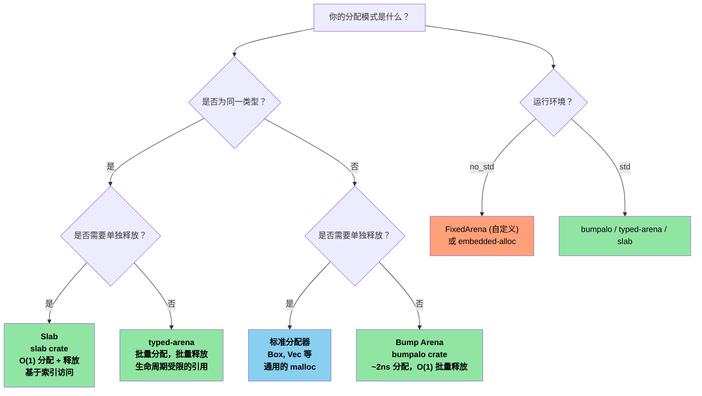

[English Original](../en/ch12-unsafe-rust-controlled-danger.md)

# 第 12 章：Unsafe Rust —— 受控的危险 🔴

> **你将学到：**
> - **五种 Unsafe “超能力”** 及其各自的适用场景。
> - **编写可靠的抽象 (Sound Abstractions)**：安全 API 与 Unsafe 内部实现。
> - **FFI 模式**：在 Rust 中调用 C 代码 (以及反向调用)。
> - **常见的未定义行为 (UB) 陷阱** 以及 Arena/Slab 分配器模式。

## 12.1 五种 Unsafe “超能力”

`unsafe` 开启了五项编译器无法验证的操作：

```rust
// SAFETY: 下文内联解释了每项操作的安全性。
unsafe {
    // 1. 解引用裸指针 (Raw Pointer)
    let ptr: *const i32 = &42;
    let value = *ptr; // 指针可能是悬空的或为空

    // 2. 调用 unsafe 函数
    let layout = std::alloc::Layout::new::<u64>();
    let mem = std::alloc::alloc(layout);

    // 3. 访问可变静态变量 (Mutable Static Variable)
    static mut COUNTER: u32 = 0;
    COUNTER += 1; // 如果多个线程访问，会产生数据竞争 (Data race)

    // 4. 实现 unsafe trait
    // unsafe impl Send for MyType {}

    // 5. 访问 union 的字段
    // union IntOrFloat { i: i32, f: f32 }
    // let u = IntOrFloat { i: 42 };
    // let f = u.f; // 重新解释位模式 —— 可能是垃圾数据
}
```

> **核心原则**：`unsafe` 并没有关闭借用检查器或类型系统。它仅仅开启了这五种特定的功能。所有其他的 Rust 规则依然适用。

### 编写可靠的抽象 (Sound Abstractions)

`unsafe` 的目的是围绕不安全的操作构建 **安全抽象**：

```rust
/// 一个容量固定的、栈分配的缓冲区。
/// 所有公共方法都是安全的 —— unsafe 已被封装在内部。
pub struct StackBuf<T, const N: usize> {
    data: [std::mem::MaybeUninit<T>; N],
    len: usize,
}

impl<T, const N: usize> StackBuf<T, N> {
    pub fn new() -> Self {
        StackBuf {
            // 每个元素都是独立的 MaybeUninit —— 无需使用 unsafe。
            // `const { ... }` 代码块（Rust 1.79+）允许我们重复
            // 一个非 Copy 的 const 表达式 N 次。
            data: [const { std::mem::MaybeUninit::uninit() }; N],
            len: 0,
        }
    }

    pub fn push(&mut self, value: T) -> Result<(), T> {
        if self.len >= N {
            return Err(value); // 缓冲区已满 —— 将原值返回给调用者
        }
        // SAFETY: len < N，因此 data[len] 位于边界内。
        // 我们将一个有效的 T 写入 MaybeUninit 槽位中。
        self.data[self.len] = std::mem::MaybeUninit::new(value);
        self.len += 1;
        Ok(())
    }

    pub fn get(&self, index: usize) -> Option<&T> {
        if index < self.len {
            // SAFETY: index < len，且 data[0..len] 均已初始化。
            Some(unsafe { self.data[index].assume_init_ref() })
        } else {
            None
        }
    }
}

impl<T, const N: usize> Drop for StackBuf<T, N> {
    fn drop(&mut self) {
        // SAFETY: data[0..len] 已初始化 —— 需要正确地释放 (drop) 它们。
        for i in 0..self.len {
            unsafe { self.data[i].assume_init_drop(); }
        }
    }
}
```

**编写可靠 (Sound) Unsafe 代码的三原则**：
1. **记录不变式 (Invariants)** —— 每个 `// SAFETY:` 注释都应解释该操作为何有效。
2. **封装 (Encapsulate)** —— 将 Unsafe 细节隐藏在安全 API 内部；确保用户无法触发 UB。
3. **最小化 (Minimize)** —— 尽量减小 `unsafe` 代码块的范围。

---

### FFI 模式：从 Rust 调用 C

```rust
// 声明 C 函数签名：
extern "C" {
    fn strlen(s: *const std::ffi::c_char) -> usize;
    fn printf(format: *const std::ffi::c_char, ...) -> std::ffi::c_int;
}

// 安全包装器 (Safe wrapper)：
fn safe_strlen(s: &str) -> usize {
    let c_string = std::ffi::CString::new(s).expect("字符串包含空字节");
    // SAFETY: c_string 是一个有效的、以 null 结尾的字符串，在调用期间保持存活。
    unsafe { strlen(c_string.as_ptr()) }
}

// 从 C 调用 Rust (导出函数)：
#[no_mangle]
pub extern "C" fn rust_add(a: i32, b: i32) -> i32 {
    a + b
}
```

**常用的 FFI 类型**：

| Rust 类型 | C 类型 | 备注 |
|------|---|-------|
| `i32` / `u32` | `int32_t` / `uint32_t` | 固定宽度，安全 |
| `*const T` / `*mut T` | `const T*` / `T*` | 裸指针 (Raw pointers) |
| `std::ffi::CStr` | `const char*` (借用) | 以 null 结尾，借用方式 |
| `std::ffi::CString` | `char*` (所有权) | 以 null 结尾，所有权方式 |
| `std::ffi::c_void` | `void` | 不透明指针目标 (Opaque) |
| `Option<fn(...)>` | 可为空的函数指针 | `None` 等同于 NULL |

### 常见的未定义行为 (UB) 陷阱

| 陷阱 | 示例 | 为什么是 UB |
|---------|---------|------------|
| **空指针解引用** | `*std::ptr::null::<i32>()` | 解引用空指针在任何时候都是 UB |
| **悬空指针** | 在 `drop()` 后解析指针 | 内存可能已被重用 |
| **数据竞争** | 两个线程同时写入 `static mut` | 未同步的并发写入 |
| **错误的 `assume_init`** | `MaybeUninit::<String>::uninit().assume_init()` | 读取未初始化的内存。**注意**：`[const { MaybeUninit::uninit() }; N]` (Rust 1.79+) 是创建 `MaybeUninit` 数组的安全方式 —— 无需 `unsafe` 或 `assume_init` (见上文 `StackBuf::new()`) |
| **别名违规** | 对同一数据创建两个 `&mut` | 违反了 Rust 的别名模型 (Aliasing Model) |
| **无效的枚举值** | `std::mem::transmute::<u8, bool>(2)` | `bool` 只能是 0 或 1 |

> **何时在生产环境中使用 `unsafe`**：
> - FFI 边界 (调用 C/C++ 代码)。
> - 性能关键的内层循环 (为了避免边界检查)。
> - 构建底层原语 (`Vec`、`HashMap` —— 它们的内部实现都使用了 unsafe)。
> - 只要能避免，就绝不要在应用逻辑中使用它。

---

## 12.2 自定义分配器 —— Arena 与 Slab 模式

在 C 语言中，你会针对特定的分配模式编写自定义的 `malloc()` 替代品 —— 比如一次性释放所有内存的 Arena 分配器、用于固定大小对象的 Slab 分配器，或者用于高吞吐量系统的池分配器。Rust 通过 `GlobalAlloc` trait 和分配器库提供了同样的能力，并增加了 **在编译时防止“释放后使用” (Use-after-free)** 的优势，这可以通过生命周期约束的 Arena 来实现。

### Arena 分配器 —— 批量分配，批量释放

Arena 分配器通过向前移动指针来分配内存。单个条目无法被单独释放 —— 整个 Arena 会被一次性释放。这非常适合处理请求作用域或帧作用域 (Frame-scoped) 的分配：

```rust
use bumpalo::Bump;

fn process_sensor_frame(raw_data: &[u8]) {
    // 为这一帧的分配创建一个 Arena
    let arena = Bump::new();

    // 在 Arena 中分配对象 —— 每个约耗时 2ns (仅仅是指针移动)
    let header = arena.alloc(parse_header(raw_data));
    let readings: &mut [f32] = arena.alloc_slice_fill_default(header.sensor_count);

    for (i, chunk) in raw_data[header.payload_offset..].chunks(4).enumerate() {
        if i < readings.len() {
            readings[i] = f32::from_le_bytes(chunk.try_into().unwrap());
        }
    }

    // 使用 readings...
    let avg = readings.iter().sum::<f32>() / readings.len() as f32;
    println!("帧平均值: {avg:.2}");

    // `arena` 在此处被释放 —— 所有分配在 O(1) 时间内一次性释放
    // 没有逐个对象的析构开销，也没有碎片化问题
}
# fn parse_header(_: &[u8]) -> Header { Header { sensor_count: 4, payload_offset: 8 } }
# struct Header { sensor_count: usize, payload_offset: usize }
```

**Arena vs 标准分配器**：

| 特性 | `Vec::new()` / `Box::new()` | `Bump` Arena |
|--------|---------------------------|--------------|
| **分配速度** | ~25ns (调用 malloc) | ~2ns (指针移动) |
| **释放速度** | 逐个对象的析构函数 | O(1) 批量释放 |
| **碎片化** | 会 (针对长寿命进程) | Arena 内部无碎片 |
| **生命周期安全** | 堆内存 —— 在 `Drop` 时释放 | Arena 引用 —— 编译时作用域约束 |
| **使用场景** | 通用目的 | 请求/帧/批处理 |

### `typed-arena` —— 类型安全的 Arena

当 Arena 中的所有对象都是同一类型时，`typed-arena` 提供了一个更简单的 API，返回绑定到 Arena 生命周期的引用：

```rust
use typed_arena::Arena;

struct AstNode<'a> {
    value: i32,
    children: Vec<&'a AstNode<'a>>,
}

fn build_tree() {
    let arena: Arena<AstNode<'_>> = Arena::new();

    // 分配节点 —— 返回存活时间与 Arena 一致的 &AstNode
    let root = arena.alloc(AstNode { value: 1, children: vec![] });
    let left = arena.alloc(AstNode { value: 2, children: vec![] });
    let right = arena.alloc(AstNode { value: 3, children: vec![] });

    // 构建树 —— 只要 `arena` 存活，所有引用就都是有效的
    // (对于真正的可变树，修改需要内部可变性)

    println!("根节点: {}, 左子节点: {}, 右子节点: {}", root.value, left.value, right.value);

    // `arena` 在此处释放 —— 所有节点一次性释放
}
```

### Slab 分配器 —— 固定大小的对象池

Slab 分配器预先分配一个由固定大小槽位组成的池。对象是单独分配和返回的，但由于所有槽位大小相同，因此消除了碎片，并实现了 O(1) 的分配/释放：

```rust
use slab::Slab;

struct Connection {
    id: u64,
    buffer: [u8; 1024],
    active: bool,
}

fn connection_pool_example() {
    // 预先为连接分配一个 Slab
    let mut connections: Slab<Connection> = Slab::with_capacity(256);

    // 插入返回一个键 (usize 索引) —— O(1)
    let key1 = connections.insert(Connection {
        id: 1001,
        buffer: [0; 1024],
        active: true,
    });

    let key2 = connections.insert(Connection {
        id: 1002,
        buffer: [0; 1024],
        active: true,
    });

    // 通过键访问 —— O(1)
    if let Some(conn) = connections.get_mut(key1) {
        conn.buffer[0..5].copy_from_slice(b"hello");
    }

    // 移除返回该值 —— O(1)，该槽位将被下次插入重用
    let removed = connections.remove(key2);
    assert_eq!(removed.id, 1002);

    // 下次插入会重用已释放的槽位 —— 无碎片
    let key3 = connections.insert(Connection {
        id: 1003,
        buffer: [0; 1024],
        active: true,
    });
    assert_eq!(key3, key2); // 同一个槽位被重用了！
}
```

### 为 `no_std` 实现极简 Arena

对于无法引入 `bumpalo` 的裸机环境，这里有一个基于 `unsafe` 构建的极简 Arena：

```rust
#![cfg_attr(not(test), no_std)]

use core::alloc::Layout;
use core::cell::{Cell, UnsafeCell};

/// 一个由固定大小字节数组支持的简单堆块分配器 (Bump Allocator)。
/// 非线程安全 —— 在多核环境中请配合锁或按核心独立使用。
///
/// **重要提示**：与 `bumpalo` 类似，此 Arena 在释放时不调用已分配条目的析构函数。
/// 实现 `Drop` 的类型（如文件句柄、套接字等）会产生资源泄漏。
/// 请仅分配不含重要 `Drop` 实现的类型，或在 Arena 释放前手动 drop 它们。
pub struct FixedArena<const N: usize> {
    // 此处必须使用 UnsafeCell：我们要通过 `&self` 修改 `buf`。
    // 如果没有 UnsafeCell，将 &self.buf 转换为 *mut u8 将是 UB
    // (违反了 Rust 的别名模型 —— 共享引用意味着不可变)。
    buf: UnsafeCell<[u8; N]>,
    offset: Cell<usize>, // 用于 &self 分配的内部可变性
}

impl<const N: usize> FixedArena<N> {
    pub const fn new() -> Self {
        FixedArena {
            buf: UnsafeCell::new([0; N]),
            offset: Cell::new(0),
        }
    }

    /// 在 Arena 中分配一个 `T`。空间不足时返回 `None`。
    pub fn alloc<T>(&self, value: T) -> Option<&mut T> {
        let layout = Layout::new::<T>();
        let current = self.offset.get();

        // 向上对齐 (Align up)
        let aligned = (current + layout.align() - 1) & !(layout.align() - 1);
        let new_offset = aligned + layout.size();

        if new_offset > N {
            return None; // Arena 已满
        }

        self.offset.set(new_offset);

        // SAFETY:
        // - `aligned` 位于 `buf` 边界内 (已在上方检查)
        // - 对齐正确 (已对齐至 T 的要求)
        // - 无别名冲突：每次分配返回一个唯一的、非重叠的区域
        // - UnsafeCell 授权了通过 &self 进行修改的权限
        // - Arena 的存活时间超过返回的引用 (调用者需确保)
        let ptr = unsafe {
            let base = (self.buf.get() as *mut u8).add(aligned);
            let typed = base as *mut T;
            typed.write(value);
            &mut *typed
        };

        Some(ptr)
    }

    /// 重置 Arena —— 会使之前所有的分配失效。
    ///
    /// # Safety
    /// 调用者必须确保不存在任何指向 Arena 分配数据的引用。
    pub unsafe fn reset(&self) {
        self.offset.set(0);
    }

    pub fn used(&self) -> usize {
        self.offset.get()
    }

    pub fn remaining(&self) -> usize {
        N - self.offset.get()
    }
}
```

### 选择分配器策略

> **注意**：下方的图表使用了 Mermaid 语法。它可以在 GitHub 以及支持 Mermaid 的工具（如带有 `mermaid` 插件的 mdBook）中渲染。



| C 语言模式 | Rust 等效方案 | 关键优势 |
|-----------|----------------|---------------|
| 自定义 `malloc()` 池 | `#[global_allocator]` 实现 | 类型安全、易于调试 |
| `obstack` (GNU) | `bumpalo::Bump` | 生命周期约束，无“释放后使用” |
| 内核 Slab (`kmem_cache`) | `slab::Slab<T>` | 类型安全、基于索引 |
| 栈分配的临时缓冲区 | `FixedArena<N>` (见上文) | 无需堆内存、`const` 可构造 |
| `alloca()` | `[T; N]` 或 `SmallVec` | 编译时确定大小，无 UB |

> **交叉引用**：关于裸机环境分配器的设置 (在使用 `embedded-alloc` 时配合 `#[global_allocator]`)，请参阅《面向 C 程序员的 Rust 培训》第 15.1 节“全局分配器设置”，该节涵盖了嵌入式特定的引导过程。

> **关键要点 —— Unsafe Rust**
> - 记录不变式 (`SAFETY:` 注释)、在安全 API 后进行封装、最小化 Unsafe 作用域。
> - `[const { MaybeUninit::uninit() }; N]` (Rust 1.79+) 取代了旧的 `assume_init` 反模式。
> - FFI 需要 `extern "C"`、`#[repr(C)]` 以及对空值和生命周期的仔细处理。
> - Arena 和 Slab 分配器以牺牲通用灵活性为代价，换取了极高的分配速度。

> **另请参阅：** [第 4 章](ch04-phantomdata-types-that-carry-no-data.md) 关于 Unsafe 代码在型变和 Drop 检查方面的交互。[第 9 章](ch09-smart-pointers-and-interior-mutability.md) 关于 Pin 和自引用类型。

---

### 练习：围绕 Unsafe 编写安全包装器 ★★★ (~45 分钟)

编写一个 `FixedVec<T, const N: usize>` —— 一个固定容量、栈分配的向量。
要求如下：
- `push(&mut self, value: T) -> Result<(), T>` 当缓冲区满时返回 `Err(value)`。
- `pop(&mut self) -> Option<T>` 返回并移除最后一个元素。
- `as_slice(&self) -> &[T]` 借用已初始化的元素。
- 所有公共方法必须是安全的；所有 Unsafe 部分必须使用 `SAFETY:` 注释进行封装。
- `Drop` 必须清理所有已初始化的元素。

<details>
<summary>🔑 参考答案</summary>

```rust
use std::mem::MaybeUninit;

pub struct FixedVec<T, const N: usize> {
    data: [MaybeUninit<T>; N],
    len: usize,
}

impl<T, const N: usize> FixedVec<T, N> {
    pub fn new() -> Self {
        FixedVec {
            data: [const { MaybeUninit::uninit() }; N],
            len: 0,
        }
    }

    pub fn push(&mut self, value: T) -> Result<(), T> {
        if self.len >= N { return Err(value); }
        // SAFETY: len < N，因此 data[len] 在边界内。
        self.data[self.len] = MaybeUninit::new(value);
        self.len += 1;
        Ok(())
    }

    pub fn pop(&mut self) -> Option<T> {
        if self.len == 0 { return None; }
        self.len -= 1;
        // SAFETY: data[len] 之前已初始化 (减量前 len > 0)。
        Some(unsafe { self.data[self.len].assume_init_read() })
    }

    pub fn as_slice(&self) -> &[T] {
        // SAFETY: data[0..len] 均已初始化，且 MaybeUninit<T>
        // 与 T 的内存布局相同。
        unsafe { std::slice::from_raw_parts(self.data.as_ptr() as *const T, self.len) }
    }

    pub fn len(&self) -> usize { self.len }
    pub fn is_empty(&self) -> bool { self.len == 0 }
}

impl<T, const N: usize> Drop for FixedVec<T, N> {
    fn drop(&mut self) {
        // SAFETY: data[0..len] 已初始化 —— 需要逐个释放。
        for i in 0..self.len {
            unsafe { self.data[i].assume_init_drop(); }
        }
    }
}

fn main() {
    let mut v = FixedVec::<String, 4>::new();
    v.push("hello".into()).unwrap();
    v.push("world".into()).unwrap();
    assert_eq!(v.as_slice(), &["hello", "world"]);
    assert_eq!(v.pop(), Some("world".into()));
    assert_eq!(v.len(), 1);
}
```

</details>

***
