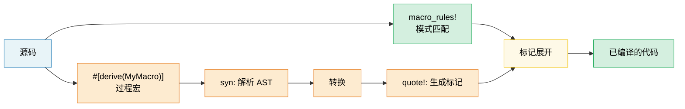

[English Original](../en/ch13-macros-code-that-writes-code.md)

# 第 13 章：宏 —— 生成代码的代码 🟡

> **你将学到：**
> - **声明式宏 (`macro_rules!`)**：带有模式匹配和重复机制。
> - **何时宏是正确工具**：以及何时应该优先使用泛型/特性。
> - **过程宏**：派生宏 (Derive)、属性宏 (Attribute) 和函数式宏。
> - 使用 `syn` 和 `quote` 编写 **自定义派生宏**。

## 13.1 声明式宏 (macro_rules!)

宏会在编译时对语法模式进行匹配，并将其展开为代码：

```rust
// 一个简单的创建 HashMap 的宏
macro_rules! hashmap {
    // 匹配：由逗号分隔的 key => value 键值对
    ( $( $key:expr => $value:expr ),* $(,)? ) => {
        {
            let mut map = std::collections::HashMap::new();
            $( map.insert($key, $value); )*
            map
        }
    };
}

let scores = hashmap! {
    "Alice" => 95,
    "Bob" => 87,
    "Carol" => 92,
};
// 展开为：
// let mut map = HashMap::new();
// map.insert("Alice", 95);
// map.insert("Bob", 87);
// map.insert("Carol", 92);
// map
```

**宏片段类型 (Fragment types)**：

| 片段 | 匹配内容 | 示例 |
|----------|---------|---------|
| `$x:expr` | 任何表达式 | `42`, `a + b`, `foo()` |
| `$x:ty` | 类型 | `i32`, `Vec<String>` |
| `$x:ident` | 标识符 | `my_var`, `Config` |
| `$x:pat` | 模式 | `Some(x)`, `_` |
| `$x:stmt` | 语句 | `let x = 5;` |
| `$x:tt` | 单个标记树 (Token tree) | 任何内容 (最灵活) |
| `$x:literal` | 字面量值 | `42`, `"hello"`, `true` |

**重复机制**：`$( ... ),*` 意味着“零个或多个，由逗号分隔”。

```rust
// 自动生成测试函数
macro_rules! test_cases {
    ( $( $name:ident: $input:expr => $expected:expr ),* $(,)? ) => {
        $(
            #[test]
            fn $name() {
                assert_eq!(process($input), $expected);
            }
        )*
    };
}

test_cases! {
    test_empty: "" => "",
    test_hello: "hello" => "HELLO",
    test_trim: "  spaces  " => "SPACES",
}
// 生成三个独立的 #[test] 函数
```

### 何时 (不) 使用宏

**在以下情况下使用宏**：
- 减少特性/泛型无法处理的样板代码 (如变长参数、符合 DRY 原则的测试生成)。
- 创建 DSL (领域特定语言，如 `html!`、`sql!`、`vec!`)。
- 条件代码生成 (`cfg!`、`compile_error!`)。

**在以下情况下不要使用宏**：
- 函数或泛型可以完成的任务 (宏更难调试，且自动补全无法提供帮助)。
- 你需要在宏内部进行类型检查 (宏操作的是标记 tokens，而不是类型)。
- 该模式只被使用一两次 (不值得付出抽象成本)。

```rust
// ❌ 不必要的宏 —— 函数完全可以胜任：
macro_rules! double {
    ($x:expr) => { $x * 2 };
}

// ✅ 直接使用函数即可：
fn double(x: i32) -> i32 { x * 2 }

// ✅ 宏的良好用例 —— 变长参数，无法通过函数实现：
macro_rules! println {
    ($($arg:tt)*) => { /* 格式化字符串 + 参数 */ };
}
```

### 过程宏 (Procedural Macros) 概述

过程宏是转换标记流 (token streams) 的 Rust 函数。它们需要一个设置了 `proc-macro = true` 的独立 crate：

```rust
// 三种类型的过程宏：

// 1. 派生宏 (Derive macros) —— #[derive(MyTrait)]
// 根据结构体定义生成特性实现
#[derive(Debug, Clone, Serialize, Deserialize)]
struct Config {
    name: String,
    port: u16,
}

// 2. 属性宏 (Attribute macros) —— #[my_attribute]
// 对被注解的项进行转换
#[route(GET, "/api/users")]
async fn list_users() -> Json<Vec<User>> { /* ... */ }

// 3. 函数式宏 (Function-like macros) —— my_macro!(...)
// 允许自定义语法
let query = sql!(SELECT * FROM users WHERE id = ?);
```

### 派生宏实践

这是最常用的过程宏类型。以下是 `#[derive(Debug)]` 在概念上的工作原理：

```rust
// 输入 (你的结构体)：
#[derive(Debug)]
struct Point {
    x: f64,
    y: f64,
}

// 派生宏会生成如下代码：
impl std::fmt::Debug for Point {
    fn fmt(&self, f: &mut std::fmt::Formatter<'_>) -> std::fmt::Result {
        f.debug_struct("Point")
            .field("x", &self.x)
            .field("y", &self.y)
            .finish()
    }
}
```

**常用的派生宏**：

| 派生宏 | 所在的 Crate | 生成的内容 |
|--------|-------|-------------------|
| `Debug` | std | `fmt::Debug` 实现 (用于调试打印) |
| `Clone`, `Copy` | std | 值拷贝/克隆 |
| `PartialEq`, `Eq` | std | 等值比较 |
| `Hash` | std | 为 HashMap 键提供哈希支持 |
| `Serialize`, `Deserialize` | serde | JSON/YAML 等编解码 |
| `Error` | thiserror | `std::error::Error` + `Display` 实现 |
| `Parser` | `clap` | CLI 参数解析 |
| `Builder` | derive_builder | 构建器 (Builder) 模式 |

> **实践建议**：请大胆地使用派生宏 —— 它们能消除容易出错的样板代码。编写自己的过程宏是一个进阶主题；在构建自定义宏之前，请先尝试使用现有的宏 (`serde`、`thiserror`、`clap`)。

### 宏的卫生性 (Macro Hygiene) 与 `$crate`

**卫生性** 意味着在宏内部创建的标识符不会与调用者作用域中的标识符发生冲突。Rust 的 `macro_rules!` 是 **部分卫生的**：

```rust
macro_rules! make_var {
    () => {
        let x = 42; // 此处的 'x' 位于宏的作用域内
    };
}

fn main() {
    let x = 10;
    make_var!();   // 创建了一个不同的 'x' (卫生的)
    println!("{x}"); // 打印 10，而不是 42 —— 宏内部的 x 不会泄漏出来
}
```

**`$crate`**：在库中编写宏时，请使用 `$crate` 来引用你自己的 crate —— 无论用户如何导入你的 crate，它都能正确解析：

```rust
// 在 my_diagnostics crate 中：

pub fn log_result(msg: &str) {
    println!("[diag] {msg}");
}

#[macro_export]
macro_rules! diag_log {
    ($($arg:tt)*) => {
        // ✅ $crate 始终会解析为 my_diagnostics，
        // 即使该用户在他们的 Cargo.toml 中重命名了该 crate
        $crate::log_result(&format!($($arg)*))
    };
}

// ❌ 如果没有 $crate：
// my_diagnostics::log_result(...)  ← 如果用户这样写，宏就会失效：
//   [dependencies]
//   diag = { package = "my_diagnostics", version = "1" }
```

> **规则**：在 `#[macro_export]` 宏中务必使用 `$crate::`。绝不要直接使用你的 crate 名称。

### 递归宏与 `tt` munching

递归宏每次处理一个标记 (token) 输入 —— 这种技术被称为 **`tt` munching** (标记树咀嚼)：

```rust
// 计算传递给宏的表达式数量
macro_rules! count {
    // 基础案例：没有剩余标记
    () => { 0usize };
    // 递归案例：消耗一个表达式，计算剩余部分
    ($head:expr $(, $tail:expr)* $(,)?) => {
        1usize + count!($($tail),*)
    };
}

fn main() {
    let n = count!("a", "b", "c", "d");
    assert_eq!(n, 4);

    // 在编译时也同样有效：
    const N: usize = count!(1, 2, 3);
    assert_eq!(N, 3);
}
```

```rust
// 从一组表达式构建异构元组 (heterogeneous tuple)：
macro_rules! tuple_from {
    // 基础案例：单个元素
    ($single:expr $(,)?) => { ($single,) };
    // 递归案例：首个元素 + 剩余部分
    ($head:expr, $($tail:expr),+ $(,)?) => {
        ($head, tuple_from!($($tail),+))
    };
}

let t = tuple_from!(1, "hello", 3.14, true);
// 展开为：(1, ("hello", (3.14, (true,))))
```

**片段限定符的微妙之处**：

| 片段 | 陷阱 |
|----------|--------|
| `$x:expr` | **贪婪解析** —— `1 + 2` 是一个单一表达式，而不是三个标记 |
| `$x:ty` | **贪婪解析** —— `Vec<String>` 是一个单一类型；后面不能跟 `+` 或 `<` |
| `$x:tt` | 仅匹配 **一个** 标记树 —— 最灵活，但检查最少 |
| `$x:ident` | 仅限普通标识符 —— 不能是像 `std::io` 之前的路径 |
| `$x:pat` | 在 Rust 2021 中匹配 `A \| B` 模式；对于单一模式请使用 `$x:pat_param` |

> **何时使用 `tt`**：当你需要将标记转发给另一个宏且不想被解析器约束时。`$($args:tt)*` 是“接受一切”的模式（被 `println!`、`format!`、`vec!` 所使用）。

### 使用 `syn` 和 `quote` 编写派生宏

派生宏存储在独立的 crate 中 (`proc-macro = true`)，并使用 `syn` (解析 Rust) 和 `quote` (生成 Rust) 来转换标记流：

```toml
# my_derive/Cargo.toml
[lib]
proc-macro = true

[dependencies]
syn = { version = "2", features = ["full"] }
quote = "1"
proc-macro2 = "1"
```

```rust
// my_derive/src/lib.rs
use proc_macro::TokenStream;
use quote::quote;
use syn::{parse_macro_input, DeriveInput};

/// 派生宏：生成一个 `describe()` 方法，
/// 该方法返回结构体名称及其字段名称。
#[proc_macro_derive(Describe)]
pub fn derive_describe(input: TokenStream) -> TokenStream {
    let input = parse_macro_input!(input as DeriveInput);
    let name = &input.ident;
    let name_str = name.to_string();

    // 提取字段名称 (仅针对具有命名字段的结构体)
    let fields = match &input.data {
        syn::Data::Struct(data) => {
            data.fields.iter()
                .filter_map(|f| f.ident.as_ref())
                .map(|id| id.to_string())
                .collect::<Vec<_>>()
        }
        _ => vec![],
    };

    let field_list = fields.join(", ");

    let expanded = quote! {
        impl #name {
            pub fn describe() -> String {
                format!("{} {{ {} }}", #name_str, #field_list)
            }
        }
    };

    TokenStream::from(expanded)
}
```

```rust
// 在应用程序 crate 中：
use my_derive::Describe;

#[derive(Describe)]
struct SensorReading {
    sensor_id: u16,
    value: f64,
    timestamp: u64,
}

fn main() {
    println!("{}", SensorReading::describe());
    // "SensorReading { sensor_id, value, timestamp }"
}
```

**工作流程**：`TokenStream` (原始标记) → `syn::parse` (生成 AST) → 检查/转换 → `quote!` (生成标记) → `TokenStream` (回传给编译器)。

| Crate | 角色 | 关键类型 |
|-------|------|-----------|
| `proc-macro` | 编译器接口 | `TokenStream` |
| `syn` | 将 Rust 源码解析为 AST | `DeriveInput`, `ItemFn`, `Type` |
| `quote` | 从模板生成 Rust 标记 | `quote!{}`, `#variable` 插值 |
| `proc-macro2` | syn/quote 与 proc-macro 之间的桥梁 | `TokenStream`, `Span` |

> **实践建议**：在自己编写派生宏之前，先研究一下像 `thiserror` 或 `derive_more` 这样简单的宏源码。`cargo expand` 命令（通过 `cargo-expand` 工具）可以显示宏展开后的代码 —— 这对调试非常有价值。

> **关键要点 —— 宏**
> - 使用 `macro_rules!` 处理简单的代码生成；使用过程宏 (`syn` + `quote`) 处理复杂的派生操作。
> - 只要可能，优先选择泛型/特性而非宏 —— 宏更难调试和维护。
> - `$crate` 确保了卫生性；`tt` munching 实现了递归模式匹配。

> **另请参阅：** [第 2 章](ch02-traits-in-depth.md) 了解特性/泛型优于宏的场景。[第 14 章](ch14-testing-and-benchmarking-patterns.md) 了解如何测试宏生成的代码。



---

### 练习：声明式宏 —— `map!` ★ (~15 分钟)

编写一个 `map!` 宏，它可以从键值对创建 `HashMap`：

```rust,ignore
let m = map! {
    "host" => "localhost",
    "port" => "8080",
};
assert_eq!(m.get("host"), Some(&"localhost"));
```

要求：支持尾随逗号和空调用 `map!{}`。

<details>
<summary>🔑 参考答案</summary>

```rust
macro_rules! map {
    () => { std::collections::HashMap::new() };
    ( $( $key:expr => $val:expr ),+ $(,)? ) => {{
        let mut m = std::collections::HashMap::new();
        $( m.insert($key, $val); )+
        m
    }};
}

fn main() {
    let config = map! {
        "host" => "localhost",
        "port" => "8080",
        "timeout" => "30",
    };
    assert_eq!(config.len(), 3);
    assert_eq!(config["host"], "localhost");

    let empty: std::collections::HashMap<String, String> = map!();
    assert!(empty.is_empty());

    let scores = map! { 1 => 100, 2 => 200 };
    assert_eq!(scores[&1], 100);
}
```

</details>

***
