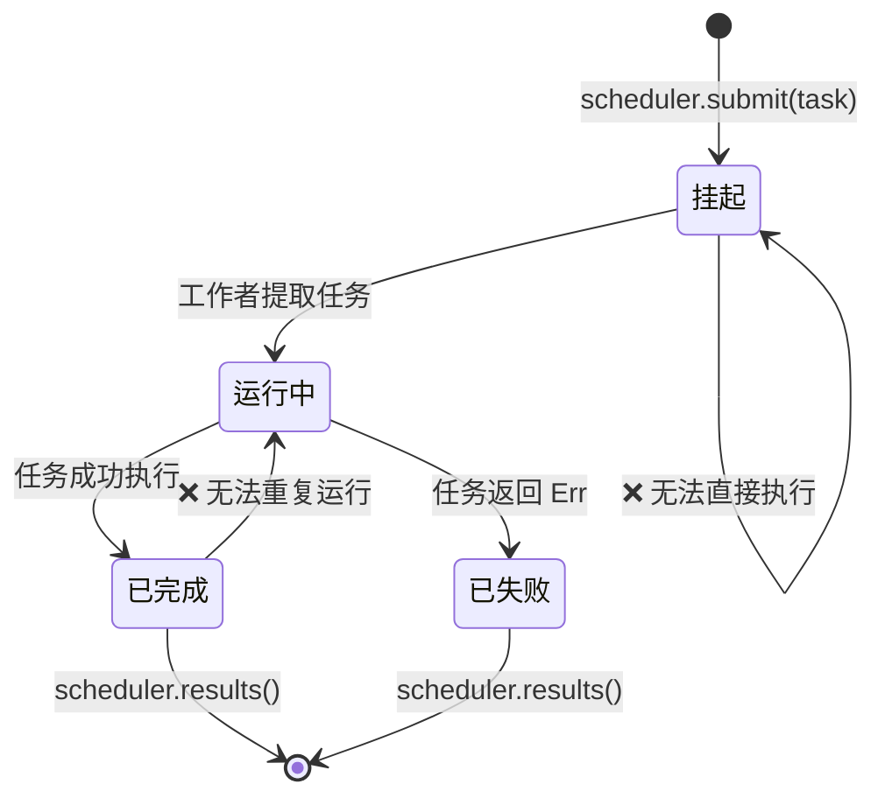

# 综合项目：类型安全的任务调度器

本项目将书中各章节的模式整合到一个生产级的系统中。你将构建一个 **类型安全的并发任务调度器**，它综合运用了泛型、特性、类型状态 (Typestate)、通道、错误处理以及测试。

**预计耗时**：4–6 小时 | **难度**：★★★

> **你将练习到的内容：**
> - 泛型与特性约束 (第 1–2 章)
> - 用于任务生命周期的类型状态模式 (第 3 章)
> - 用于零成本状态标记的 PhantomData (第 4 章)
> - 用于工作者通信的通道 (第 5 章)
> - 使用线程作用域 (Scoped threads) 的并发处理 (第 6 章)
> - 使用 `thiserror` 的错误处理 (第 10 章)
> - 使用基于属性的测试进行测试 (第 14 章)
> - 使用 `TryFrom` 和验证后的类型进行 API 设计 (第 15 章)

## 问题描述

构建一个满足以下要求的任务调度器：

1. **任务** 具有类型化的生命周期：`挂起 (Pending) → 运行中 (Running) → 已完成 (Completed)`（或 `已失败 (Failed)`）。
2. **工作者 (Workers)** 从通道中拉取任务、执行任务并报告结果。
3. **调度器 (Scheduler)** 管理任务提交、工作者协调以及结果收集。
4. 非法的状态转换在 **编译时报错**。



## 第一步：定义任务类型

首先定义类型状态标记和通用的 `Task` 结构体：

```rust
use std::marker::PhantomData;

// --- 状态标记 (零大小类型) ---
struct Pending;
struct Running;
struct Completed;
struct Failed;

// --- 任务 ID (用于类型安全的新类型) ---
#[derive(Debug, Clone, Copy, PartialEq, Eq, Hash)]
struct TaskId(u64);

// --- Task 结构体，由生命周期状态参数化 ---
struct Task<State, R> {
    id: TaskId,
    name: String,
    _state: PhantomData<State>,
    _result: PhantomData<R>,
}
```

**你的任务**：实现状态转换，满足：
- `Task<Pending, R>` 可以转换到 `Task<Running, R>` (通过 `start()` 方法)。
- `Task<Running, R>` 可以转换到 `Task<Completed, R>` 或 `Task<Failed, R>`。
- 其他任何转换都无法通过编译。

<details>
<summary>💡 提示</summary>

每个转换方法都应该消耗 (consume) `self` 并返回新状态：

```rust
impl<R> Task<Pending, R> {
    fn start(self) -> Task<Running, R> {
        Task {
            id: self.id,
            name: self.name,
            _state: PhantomData,
            _result: PhantomData,
        }
    }
}
```

</details>

## 第二步：定义执行函数

任务需要一个可执行的函数。请使用装箱的闭包 (Boxed closure)：

```rust
struct WorkItem<R: Send + 'static> {
    id: TaskId,
    name: String,
    work: Box<dyn FnOnce() -> Result<R, String> + Send>,
}
```

**你的任务**：实现 `WorkItem::new()`，接收任务名称和闭包。添加一个 `TaskId` 生成器（简单的原子计数器或由互斥锁保护的计数器）。

## 第三步：错误处理

使用 `thiserror` 定义调度器的错误类型：

```rust,ignore
use thiserror::Error;

#[derive(Error, Debug)]
pub enum SchedulerError {
    #[error("调度器已关闭")]
    ShutDown,

    #[error("任务 {0:?} 失败: {1}")]
    TaskFailed(TaskId, String),

    #[error("通道发送错误")]
    ChannelError(#[from] std::sync::mpsc::SendError<()>),

    #[error("工作者发生 panic")]
    WorkerPanic,
}
```

## 第四步：调度器

使用通道 (第 5 章) 和线程作用域 (第 6 章) 构建调度器：

```rust
use std::sync::mpsc;

struct Scheduler<R: Send + 'static> {
    sender: Option<mpsc::Sender<WorkItem<R>>>,
    results: mpsc::Receiver<TaskResult<R>>,
    num_workers: usize,
}

struct TaskResult<R> {
    id: TaskId,
    name: String,
    outcome: Result<R, String>,
}
```

**你的任务**：实现：
- `Scheduler::new(num_workers: usize) -> Self` —— 创建通道并生成工作者。
- `Scheduler::submit(&self, item: WorkItem<R>) -> Result<TaskId, SchedulerError>`。
- `Scheduler::shutdown(self) -> Vec<TaskResult<R>>` —— 丢弃发送器，等待工作者结束并收集结果。

<details>
<summary>💡 提示 —— 工作者循环</summary>

```rust
fn worker_loop<R: Send + 'static>(
    rx: std::sync::Arc<std::sync::Mutex<mpsc::Receiver<WorkItem<R>>>>,
    result_tx: mpsc::Sender<TaskResult<R>>,
    worker_id: usize,
) {
    loop {
        let item = {
            let rx = rx.lock().unwrap();
            rx.recv()
        };
        match item {
            Ok(work_item) => {
                let outcome = (work_item.work)();
                let _ = result_tx.send(TaskResult {
                    id: work_item.id,
                    name: work_item.name,
                    outcome,
                });
            }
            Err(_) => break, // 通道已关闭
        }
    }
}
```

</details>

## 第五步：集成测试

编写测试来验证：

1. **成功路径**：提交 10 个任务，关闭调度器，验证所有 10 个结果均为 `Ok`。
2. **错误处理**：提交会失败的任务，验证 `TaskResult.outcome` 为 `Err`。
3. **空调度器**：创建后立即关闭 —— 不应发生 panic。
4. **属性测试** (加分项)：使用 `proptest` 验证对于任何数量 N 的任务 (1..100)，调度器始终准确返回 N 个结果。

```rust
#[cfg(test)]
mod tests {
    use super::*;

    #[test]
    fn happy_path() {
        let scheduler = Scheduler::<String>::new(4);

        for i in 0..10 {
            let item = WorkItem::new(
                format!("task-{i}"),
                move || Ok(format!("result-{i}")),
            );
            scheduler.submit(item).unwrap();
        }

        let results = scheduler.shutdown();
        assert_eq!(results.len(), 10);
        for r in &results {
            assert!(r.outcome.is_ok());
        }
    }

    #[test]
    fn handles_failures() {
        let scheduler = Scheduler::<String>::new(2);

        scheduler.submit(WorkItem::new("good", || Ok("ok".into()))).unwrap();
        scheduler.submit(WorkItem::new("bad", || Err("boom".into()))).unwrap();

        let results = scheduler.shutdown();
        assert_eq!(results.len(), 2);

        let failures: Vec<_> = results.iter()
            .filter(|r| r.outcome.is_err())
            .collect();
        assert_eq!(failures.len(), 1);
    }
}
```

## 第六步：综合运用

以下 `main()` 函数演示了整个系统的运行：

```rust,ignore
fn main() {
    let scheduler = Scheduler::<String>::new(4);

    // 提交负载各异的任务
    for i in 0..20 {
        let item = WorkItem::new(
            format!("compute-{i}"),
            move || {
                // 模拟工作
                std::thread::sleep(std::time::Duration::from_millis(10));
                if i % 7 == 0 {
                    Err(format!("任务 {i} 遇到了模拟错误"))
                } else {
                    Ok(format!("任务 {i} 已完成，返回值为 {}", i * i))
                }
            },
        );
        // 注意：此处使用 .unwrap() 是为了简洁 —— 在生产环境中请处理 SendError。
        scheduler.submit(item).unwrap();
    }

    println!("所有任务已提交。正在关闭调度器...");
    let results = scheduler.shutdown();

    let (ok, err): (Vec<_>, Vec<_>) = results.iter()
        .partition(|r| r.outcome.is_ok());

    println!("\n✅ 成功: {}", ok.len());
    for r in &ok {
        println!("  {} → {}", r.name, r.outcome.as_ref().unwrap());
    }

    println!("\n❌ 失败: {}", err.len());
    for r in &err {
        println!("  {} → {}", r.name, r.outcome.as_ref().unwrap_err());
    }
}
```

## 评估标准

| 标准 | 目标 |
|-----------|--------|
| **类型安全** | 非法的状态转换无法通过编译 |
| **并发性** | 工作者并行运行，无数据竞争 |
| **错误处理** | 所有故障均在 `TaskResult` 中捕获，无 panic |
| **测试** | 至少包含 3 个测试；proptest 为加分项 |
| **代码组织** | 模块结构清晰，公共 API 使用验证后的类型 |
| **文档** | 关键类型附带解释其不变性 (Invariants) 的文档注释 |

## 扩展思路

在基础调度器工作正常后，可以尝试以下增强功能：

1. **优先队列**：添加一个 `Priority` 新类型 (1–10)，并优先处理高优先级任务。
2. **重试策略**：失败的任务在被标记为永久失败前，最多重试 N 次。
3. **取消功能**：添加 `cancel(TaskId)` 方法来移除挂起中的任务。
4. **异步版本**：移植到 `tokio::spawn` 并使用 `tokio::sync::mpsc` 通道 (第 16 章)。
5. **指标监控 (Metrics)**：跟踪每个工作者的任务计数、平均执行时间和失败率。

***
