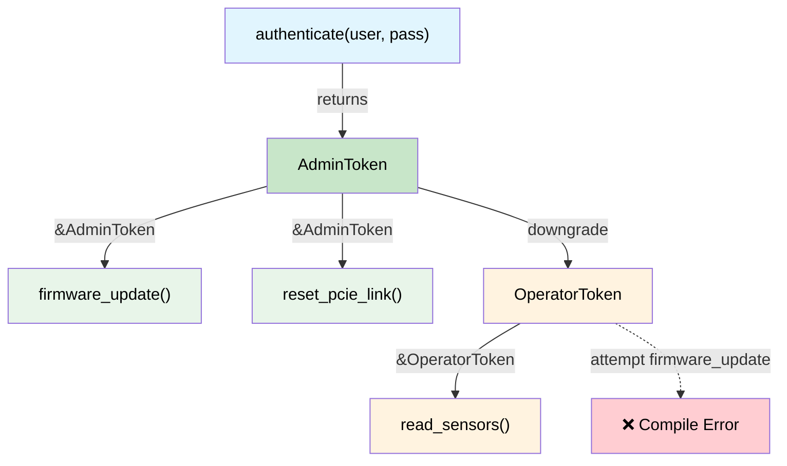

# Capability Tokens — Zero-Cost Proof of Authority 🟡

> **What you'll learn:** How zero-sized types (ZSTs) act as compile-time proof tokens, enforcing privilege hierarchies, power sequencing, and revocable authority — all at zero runtime cost.
>
> **Cross-references:** [ch03](ch03-single-use-types-cryptographic-guarantee.md) (single-use types), [ch05](ch05-protocol-state-machines-type-state-for-r.md) (type-state), [ch08](ch08-capability-mixins-compile-time-hardware-.md) (mixins), [ch10](ch10-putting-it-all-together-a-complete-diagn.md) (integration)

## The Problem: Who Is Allowed to Do What?

In hardware diagnostics, some operations are **dangerous**:

- Programming BMC firmware
- Resetting PCIe links
- Writing OTP fuses
- Enabling high-voltage test modes

In C/C++, these are guarded by runtime checks:

```c
// C — runtime permission check
int reset_pcie_link(bmc_handle_t bmc, int slot) {
    if (!bmc->is_admin) {        // runtime check
        return -EPERM;
    }
    if (!bmc->link_trained) {    // another runtime check
        return -EINVAL;
    }
    // ... do the dangerous thing ...
    return 0;
}
```

Every function that does something dangerous must repeat these checks. Forget one,
and you have a privilege escalation bug.

## Zero-Sized Types as Proof Tokens

A **capability token** is a zero-sized type (ZST) that proves the caller has
the authority to perform an action. It costs **zero bytes** at runtime — it exists
only in the type system:

```rust,ignore
use std::marker::PhantomData;

/// Proof that the caller has admin privileges.
/// Zero-sized — compiles away completely.
/// Not Clone, not Copy — must be explicitly passed.
pub struct AdminToken {
    _private: (),   // prevents construction outside this module
}

/// Proof that the PCIe link is trained and ready.
pub struct LinkTrainedToken {
    _private: (),
}

pub struct BmcController { /* ... */ }

impl BmcController {
    /// Authenticate as admin — returns a capability token.
    /// This is the ONLY way to create an AdminToken.
    pub fn authenticate_admin(
        &mut self,
        credentials: &[u8],
    ) -> Result<AdminToken, &'static str> {
        // ... validate credentials ...
        # let valid = true;
        if valid {
            Ok(AdminToken { _private: () })
        } else {
            Err("authentication failed")
        }
    }

    /// Train the PCIe link — returns proof that it's trained.
    pub fn train_link(&mut self) -> Result<LinkTrainedToken, &'static str> {
        // ... perform link training ...
        Ok(LinkTrainedToken { _private: () })
    }

    /// Reset a PCIe link — requires BOTH admin + link-trained proof.
    /// No runtime checks needed — the tokens ARE the proof.
    pub fn reset_pcie_link(
        &mut self,
        _admin: &AdminToken,         // zero-cost proof of authority
        _trained: &LinkTrainedToken,  // zero-cost proof of state
        slot: u32,
    ) -> Result<(), &'static str> {
        println!("Resetting PCIe link on slot {slot}");
        Ok(())
    }
}
```

Usage — the type system enforces the workflow:

```rust,ignore
fn maintenance_workflow(bmc: &mut BmcController) -> Result<(), &'static str> {
    // Step 1: Authenticate — get admin proof
    let admin = bmc.authenticate_admin(b"secret")?;

    // Step 2: Train link — get trained proof
    let trained = bmc.train_link()?;

    // Step 3: Reset — compiler requires both tokens
    bmc.reset_pcie_link(&admin, &trained, 0)?;

    Ok(())
}

// This WON'T compile:
fn unprivileged_attempt(bmc: &mut BmcController) -> Result<(), &'static str> {
    let trained = bmc.train_link()?;
    // bmc.reset_pcie_link(???, &trained, 0)?;
    //                     ^^^ no AdminToken — can't call this
    Ok(())
}
```

The `AdminToken` and `LinkTrainedToken` are **zero bytes** in the compiled binary.
They exist only during type-checking. The function signature `fn reset_pcie_link(&mut self, _admin: &AdminToken, ...)` is a **proof obligation** — "you may only
call this if you can produce an `AdminToken`" — and the only way to produce one is
through `authenticate_admin()`.

## Power Sequencing Authority

Server power sequencing has strict ordering: standby → auxiliary → main → CPU.
Reversing the sequence can damage hardware. Capability tokens enforce ordering:

```rust,ignore
/// State tokens — each one proves the previous step completed.
pub struct StandbyOn { _p: () }
pub struct AuxiliaryOn { _p: () }
pub struct MainOn { _p: () }
pub struct CpuPowered { _p: () }

pub struct PowerController { /* ... */ }

impl PowerController {
    /// Step 1: Enable standby power. No precondition.
    pub fn enable_standby(&mut self) -> Result<StandbyOn, &'static str> {
        println!("Standby power ON");
        Ok(StandbyOn { _p: () })
    }

    /// Step 2: Enable auxiliary — requires standby proof.
    pub fn enable_auxiliary(
        &mut self,
        _standby: &StandbyOn,
    ) -> Result<AuxiliaryOn, &'static str> {
        println!("Auxiliary power ON");
        Ok(AuxiliaryOn { _p: () })
    }

    /// Step 3: Enable main — requires auxiliary proof.
    pub fn enable_main(
        &mut self,
        _aux: &AuxiliaryOn,
    ) -> Result<MainOn, &'static str> {
        println!("Main power ON");
        Ok(MainOn { _p: () })
    }

    /// Step 4: Power CPU — requires main proof.
    pub fn power_cpu(
        &mut self,
        _main: &MainOn,
    ) -> Result<CpuPowered, &'static str> {
        println!("CPU powered ON");
        Ok(CpuPowered { _p: () })
    }
}

fn power_on_sequence(ctrl: &mut PowerController) -> Result<CpuPowered, &'static str> {
    let standby = ctrl.enable_standby()?;
    let aux = ctrl.enable_auxiliary(&standby)?;
    let main = ctrl.enable_main(&aux)?;
    let cpu = ctrl.power_cpu(&main)?;
    Ok(cpu)
}

// Trying to skip a step:
// fn wrong_order(ctrl: &mut PowerController) {
//     ctrl.power_cpu(???);  // ❌ can't produce MainOn without enable_main()
// }
```

## Hierarchical Capabilities

Real systems have **hierarchies** — an admin can do everything a user can do,
plus more. Model this with a trait hierarchy:

```rust,ignore
/// Base capability — anyone who is authenticated.
pub trait Authenticated {
    fn token_id(&self) -> u64;
}

/// Operator can read sensors and run non-destructive diagnostics.
pub trait Operator: Authenticated {}

/// Admin can do everything an operator can, plus destructive operations.
pub trait Admin: Operator {}

// Concrete tokens:
pub struct UserToken { id: u64 }
pub struct OperatorToken { id: u64 }
pub struct AdminCapToken { id: u64 }

impl Authenticated for UserToken { fn token_id(&self) -> u64 { self.id } }
impl Authenticated for OperatorToken { fn token_id(&self) -> u64 { self.id } }
impl Operator for OperatorToken {}
impl Authenticated for AdminCapToken { fn token_id(&self) -> u64 { self.id } }
impl Operator for AdminCapToken {}
impl Admin for AdminCapToken {}

pub struct Bmc { /* ... */ }

impl Bmc {
    /// Anyone authenticated can read sensors.
    pub fn read_sensor(&self, _who: &impl Authenticated, id: u32) -> f64 {
        42.0 // stub
    }

    /// Only operators and above can run diagnostics.
    pub fn run_diag(&mut self, _who: &impl Operator, test: &str) -> bool {
        true // stub
    }

    /// Only admins can flash firmware.
    pub fn flash_firmware(&mut self, _who: &impl Admin, image: &[u8]) -> Result<(), &'static str> {
        Ok(()) // stub
    }
}
```

An `AdminCapToken` can be passed to any function — it satisfies `Authenticated`,
`Operator`, and `Admin`. A `UserToken` can only call `read_sensor()`. The compiler
enforces the entire privilege model **at zero runtime cost**.

## Lifetime-Bounded Capability Tokens

Sometimes a capability should be **scoped** — valid only within a certain lifetime.
Rust's borrow checker handles this naturally:

```rust,ignore
/// A scoped admin session. The token borrows the session,
/// so it cannot outlive it.
pub struct AdminSession {
    _active: bool,
}

pub struct ScopedAdminToken<'session> {
    _session: &'session AdminSession,
}

impl AdminSession {
    pub fn begin(credentials: &[u8]) -> Result<Self, &'static str> {
        // ... authenticate ...
        Ok(AdminSession { _active: true })
    }

    /// Create a scoped token — lives only as long as the session.
    pub fn token(&self) -> ScopedAdminToken<'_> {
        ScopedAdminToken { _session: self }
    }
}

fn scoped_example() -> Result<(), &'static str> {
    let session = AdminSession::begin(b"credentials")?;
    let token = session.token();

    // Use token within this scope...
    // When session drops, token is invalidated by the borrow checker.
    // No need for runtime expiry checks.

    // drop(session);
    // ❌ ERROR: cannot move out of `session` because it is borrowed
    //    (by `token`, which holds &session)
    //
    // Even if we skip drop() and just try to use `token` after
    // session goes out of scope — same error: lifetime mismatch.

    Ok(())
}
```

### When to Use Capability Tokens

| Scenario | Pattern |
|----------|---------|
| Privileged hardware operations | ZST proof token (AdminToken) |
| Multi-step sequencing | Chain of state tokens (StandbyOn → AuxiliaryOn → ...) |
| Role-based access control | Trait hierarchy (Authenticated → Operator → Admin) |
| Time-limited privileges | Lifetime-bounded tokens (`ScopedAdminToken<'a>`) |
| Cross-module authority | Public token type, private constructor |

### Cost Summary

| What | Runtime cost |
|------|:------:|
| ZST token in memory | 0 bytes |
| Token parameter passing | Optimised away by LLVM |
| Trait hierarchy dispatch | Static dispatch (monomorphised) |
| Lifetime enforcement | Compile-time only |

**Total runtime overhead: zero.** The privilege model exists only in the type system.

## Capability Token Hierarchy



## Exercise: Tiered Diagnostic Permissions

Design a three-tier capability system: `ViewerToken`, `TechToken`, `EngineerToken`.
- Viewers can call `read_status()`
- Techs can also call `run_quick_diag()`
- Engineers can also call `flash_firmware()`
- Higher tiers can do everything lower tiers can (use trait bounds or token conversion).

<details>
<summary>Solution</summary>

```rust,ignore
// Tokens — zero-sized, private constructors
pub struct ViewerToken { _private: () }
pub struct TechToken { _private: () }
pub struct EngineerToken { _private: () }

// Capability traits — hierarchical
pub trait CanView {}
pub trait CanDiag: CanView {}
pub trait CanFlash: CanDiag {}

impl CanView for ViewerToken {}
impl CanView for TechToken {}
impl CanView for EngineerToken {}
impl CanDiag for TechToken {}
impl CanDiag for EngineerToken {}
impl CanFlash for EngineerToken {}

pub fn read_status(_tok: &impl CanView) -> String {
    "status: OK".into()
}

pub fn run_quick_diag(_tok: &impl CanDiag) -> String {
    "diag: PASS".into()
}

pub fn flash_firmware(_tok: &impl CanFlash, _image: &[u8]) {
    // Only engineers reach here
}
```

</details>

## Key Takeaways

1. **ZST tokens cost zero bytes** — they exist only in the type system; LLVM optimises them away completely.
2. **Private constructors = unforgeable** — only your module's `authenticate()` can mint a token.
3. **Trait hierarchies model permission levels** — `CanFlash: CanDiag: CanView` mirrors real RBAC.
4. **Lifetime-bounded tokens revoke automatically** — `ScopedAdminToken<'session>` can't outlive the session.
5. **Combine with type-state (ch05)** for protocols that require authentication *and* sequenced operations.

---

