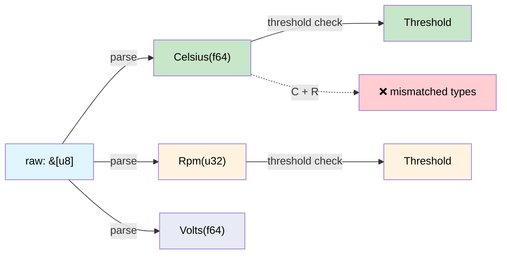

# Dimensional Analysis — Making the Compiler Check Your Units 🟢

> **What you'll learn:** How newtype wrappers and the `uom` crate turn the compiler into a unit-checking engine, preventing the class of bug that destroyed a $328M spacecraft.
>
> **Cross-references:** [ch02](ch02-typed-command-interfaces-request-determi.md) (typed commands use these types), [ch07](ch07-validated-boundaries-parse-dont-validate.md) (validated boundaries), [ch10](ch10-putting-it-all-together-a-complete-diagn.md) (integration)

## The Mars Climate Orbiter

In 1999, NASA's Mars Climate Orbiter was lost because one team sent thrust data in
**pound-force seconds** while the navigation team expected **newton-seconds**. The
spacecraft entered the atmosphere at 57 km instead of 226 km and disintegrated.
Cost: $327.6 million.

The root cause: **both values were `double`**. The compiler couldn't distinguish them.

This same class of bug lurks in every hardware diagnostic that deals with physical
quantities:

```c
// C — all doubles, no unit checking
double read_temperature(int sensor_id);   // Celsius? Fahrenheit? Kelvin?
double read_voltage(int channel);          // Volts? Millivolts?
double read_fan_speed(int fan_id);         // RPM? Radians per second?

// Bug: comparing Celsius to Fahrenheit
if (read_temperature(0) > read_temperature(1)) { ... }  // units might differ!
```

## Newtypes for Physical Quantities

The simplest correct-by-construction approach: **wrap each unit in its own type**.

```rust,ignore
use std::fmt;

/// Temperature in degrees Celsius.
#[derive(Debug, Clone, Copy, PartialEq, PartialOrd)]
pub struct Celsius(pub f64);

/// Temperature in degrees Fahrenheit.
#[derive(Debug, Clone, Copy, PartialEq, PartialOrd)]
pub struct Fahrenheit(pub f64);

/// Voltage in volts.
#[derive(Debug, Clone, Copy, PartialEq, PartialOrd)]
pub struct Volts(pub f64);

/// Voltage in millivolts.
#[derive(Debug, Clone, Copy, PartialEq, PartialOrd)]
pub struct Millivolts(pub f64);

/// Fan speed in RPM.
#[derive(Debug, Clone, Copy, PartialEq, PartialOrd)]
pub struct Rpm(pub f64);

// Conversions are explicit:
impl From<Celsius> for Fahrenheit {
    fn from(c: Celsius) -> Self {
        Fahrenheit(c.0 * 9.0 / 5.0 + 32.0)
    }
}

impl From<Fahrenheit> for Celsius {
    fn from(f: Fahrenheit) -> Self {
        Celsius((f.0 - 32.0) * 5.0 / 9.0)
    }
}

impl From<Volts> for Millivolts {
    fn from(v: Volts) -> Self {
        Millivolts(v.0 * 1000.0)
    }
}

impl From<Millivolts> for Volts {
    fn from(mv: Millivolts) -> Self {
        Volts(mv.0 / 1000.0)
    }
}

impl fmt::Display for Celsius {
    fn fmt(&self, f: &mut fmt::Formatter<'_>) -> fmt::Result {
        write!(f, "{:.1}°C", self.0)
    }
}

impl fmt::Display for Rpm {
    fn fmt(&self, f: &mut fmt::Formatter<'_>) -> fmt::Result {
        write!(f, "{:.0} RPM", self.0)
    }
}
```

Now the compiler catches unit mismatches:

```rust,ignore
# #[derive(Debug, Clone, Copy, PartialEq, PartialOrd)]
# pub struct Celsius(pub f64);
# #[derive(Debug, Clone, Copy, PartialEq, PartialOrd)]
# pub struct Volts(pub f64);

fn check_thermal_limit(temp: Celsius, limit: Celsius) -> bool {
    temp > limit  // ✅ same units — compiles
}

// fn bad_comparison(temp: Celsius, voltage: Volts) -> bool {
//     temp > voltage  // ❌ ERROR: mismatched types — Celsius vs Volts
// }
```

**Zero runtime cost** — newtypes compile down to raw `f64` values. The wrapper is
purely a type-level concept.

## Newtype Macro for Hardware Quantities

Writing newtypes by hand gets repetitive. A macro eliminates the boilerplate:

```rust,ignore
/// Generate a newtype for a physical quantity.
macro_rules! quantity {
    ($Name:ident, $unit:expr) => {
        #[derive(Debug, Clone, Copy, PartialEq, PartialOrd)]
        pub struct $Name(pub f64);

        impl $Name {
            pub fn new(value: f64) -> Self { $Name(value) }
            pub fn value(self) -> f64 { self.0 }
        }

        impl std::fmt::Display for $Name {
            fn fmt(&self, f: &mut std::fmt::Formatter<'_>) -> std::fmt::Result {
                write!(f, "{:.2} {}", self.0, $unit)
            }
        }

        impl std::ops::Add for $Name {
            type Output = Self;
            fn add(self, rhs: Self) -> Self { $Name(self.0 + rhs.0) }
        }

        impl std::ops::Sub for $Name {
            type Output = Self;
            fn sub(self, rhs: Self) -> Self { $Name(self.0 - rhs.0) }
        }
    };
}

// Usage:
quantity!(Celsius, "°C");
quantity!(Fahrenheit, "°F");
quantity!(Volts, "V");
quantity!(Millivolts, "mV");
quantity!(Rpm, "RPM");
quantity!(Watts, "W");
quantity!(Amperes, "A");
quantity!(Pascals, "Pa");
quantity!(Hertz, "Hz");
quantity!(Bytes, "B");
```

Each line generates a complete type with Display, Add, Sub, and comparison operators.
**All at zero runtime cost.**

> **Physics caveat:** The macro generates `Add` for *all* quantities, including
> `Celsius`. Adding absolute temperatures (`25°C + 30°C = 55°C`) is not
> physically meaningful — you'd need a separate `TemperatureDelta` type for
> differences. The `uom` crate (shown later) handles this correctly. For
> simple sensor diagnostics where you only compare and display, you can omit
> `Add`/`Sub` from temperature types and keep them for quantities where
> addition makes sense (Watts, Volts, Bytes). If you need delta arithmetic,
> define a `CelsiusDelta(f64)` newtype with `impl Add<CelsiusDelta> for Celsius`.

## Applied Example: Sensor Pipeline

A typical diagnostic reads raw ADC values, converts them to physical units, and
compares against thresholds. With dimensional types, each step is type-checked:

```rust,ignore
# macro_rules! quantity {
#     ($Name:ident, $unit:expr) => {
#         #[derive(Debug, Clone, Copy, PartialEq, PartialOrd)]
#         pub struct $Name(pub f64);
#         impl $Name {
#             pub fn new(value: f64) -> Self { $Name(value) }
#             pub fn value(self) -> f64 { self.0 }
#         }
#         impl std::fmt::Display for $Name {
#             fn fmt(&self, f: &mut std::fmt::Formatter<'_>) -> std::fmt::Result {
#                 write!(f, "{:.2} {}", self.0, $unit)
#             }
#         }
#     };
# }
# quantity!(Celsius, "°C");
# quantity!(Volts, "V");
# quantity!(Rpm, "RPM");

/// Raw ADC reading — not yet a physical quantity.
#[derive(Debug, Clone, Copy)]
pub struct AdcReading {
    pub channel: u8,
    pub raw: u16,   // 12-bit ADC value (0–4095)
}

/// Calibration coefficients for converting ADC → physical unit.
pub struct TemperatureCalibration {
    pub offset: f64,
    pub scale: f64,   // °C per ADC count
}

pub struct VoltageCalibration {
    pub reference_mv: f64,
    pub divider_ratio: f64,
}

impl TemperatureCalibration {
    /// Convert raw ADC → Celsius. The return type guarantees the output is Celsius.
    pub fn convert(&self, adc: AdcReading) -> Celsius {
        Celsius::new(adc.raw as f64 * self.scale + self.offset)
    }
}

impl VoltageCalibration {
    /// Convert raw ADC → Volts. The return type guarantees the output is Volts.
    pub fn convert(&self, adc: AdcReading) -> Volts {
        Volts::new(adc.raw as f64 * self.reference_mv / 4096.0 / self.divider_ratio / 1000.0)
    }
}

/// Threshold check — only compiles if units match.
pub struct Threshold<T: PartialOrd> {
    pub warning: T,
    pub critical: T,
}

#[derive(Debug, PartialEq)]
pub enum ThresholdResult {
    Normal,
    Warning,
    Critical,
}

impl<T: PartialOrd> Threshold<T> {
    pub fn check(&self, value: &T) -> ThresholdResult {
        if *value >= self.critical {
            ThresholdResult::Critical
        } else if *value >= self.warning {
            ThresholdResult::Warning
        } else {
            ThresholdResult::Normal
        }
    }
}

fn sensor_pipeline_example() {
    let temp_cal = TemperatureCalibration { offset: -50.0, scale: 0.0625 };
    let temp_threshold = Threshold {
        warning: Celsius::new(85.0),
        critical: Celsius::new(100.0),
    };

    let adc = AdcReading { channel: 0, raw: 2048 };
    let temp: Celsius = temp_cal.convert(adc);

    let result = temp_threshold.check(&temp);
    println!("Temperature: {temp}, Status: {result:?}");

    // This won't compile — can't check a Celsius reading against a Volts threshold:
    // let volt_threshold = Threshold {
    //     warning: Volts::new(11.4),
    //     critical: Volts::new(10.8),
    // };
    // volt_threshold.check(&temp);  // ❌ ERROR: expected &Volts, found &Celsius
}
```

The **entire pipeline** is statically type-checked:
- ADC readings are raw counts (not units)
- Calibration produces typed quantities (Celsius, Volts)
- Thresholds are generic over the quantity type
- Comparing Celsius against Volts is a **compile error**

## The uom Crate

For production use, the [`uom`](https://crates.io/crates/uom) crate provides
a comprehensive dimensional analysis system with hundreds of units, automatic
conversion, and zero runtime overhead:

```rust,ignore
// Cargo.toml: uom = { version = "0.36", features = ["f64"] }
//
// use uom::si::f64::*;
// use uom::si::thermodynamic_temperature::degree_celsius;
// use uom::si::electric_potential::volt;
// use uom::si::power::watt;
//
// let temp = ThermodynamicTemperature::new::<degree_celsius>(85.0);
// let voltage = ElectricPotential::new::<volt>(12.0);
// let power = Power::new::<watt>(250.0);
//
// // temp + voltage;  // ❌ compile error — can't add temperature to voltage
// // power > temp;    // ❌ compile error — can't compare power to temperature
```

Use `uom` when you need automatic derived-unit support (e.g., Watts = Volts × Amperes).
Use hand-rolled newtypes when you need only simple quantities without derived-unit
arithmetic.

### When to Use Dimensional Types

| Scenario | Recommendation |
|----------|---------------|
| Sensor readings (temp, voltage, fan) | ✅ Always — prevents unit confusion |
| Threshold comparisons | ✅ Always — generic `Threshold<T>` |
| Cross-subsystem data exchange | ✅ Always — enforce contracts at API boundaries |
| Internal calculations (same unit throughout) | ⚠️ Optional — less bug-prone |
| String/display formatting | ❌ Use Display impl on the quantity type |

## Sensor Pipeline Type Flow



## Exercise: Power Budget Calculator

Create `Watts(f64)` and `Amperes(f64)` newtypes. Implement:
- `Watts::from_vi(volts: Volts, amps: Amperes) -> Watts` (P = V × I)
- A `PowerBudget` that tracks total watts and rejects additions that exceed a configured limit.
- Attempting `Watts + Celsius` should be a compile error.

<details>
<summary>Solution</summary>

```rust,ignore
#[derive(Debug, Clone, Copy, PartialEq, PartialOrd)]
pub struct Watts(pub f64);

#[derive(Debug, Clone, Copy, PartialEq, PartialOrd)]
pub struct Amperes(pub f64);

#[derive(Debug, Clone, Copy, PartialEq, PartialOrd)]
pub struct Volts(pub f64);

#[derive(Debug, Clone, Copy, PartialEq, PartialOrd)]
pub struct Celsius(pub f64);

impl Watts {
    pub fn from_vi(volts: Volts, amps: Amperes) -> Self {
        Watts(volts.0 * amps.0)
    }
}

impl std::ops::Add for Watts {
    type Output = Watts;
    fn add(self, rhs: Watts) -> Watts {
        Watts(self.0 + rhs.0)
    }
}

pub struct PowerBudget {
    total: Watts,
    limit: Watts,
}

impl PowerBudget {
    pub fn new(limit: Watts) -> Self {
        PowerBudget { total: Watts(0.0), limit }
    }
    pub fn add(&mut self, w: Watts) -> Result<(), String> {
        let new_total = Watts(self.total.0 + w.0);
        if new_total > self.limit {
            return Err(format!("budget exceeded: {:?} > {:?}", new_total, self.limit));
        }
        self.total = new_total;
        Ok(())
    }
}

// ❌ Compile error: Watts + Celsius → "mismatched types"
// let bad = Watts(100.0) + Celsius(50.0);
```

</details>

## Key Takeaways

1. **Newtypes prevent unit confusion at zero cost** — `Celsius` and `Rpm` are both `f64` inside, but the compiler treats them as different types.
2. **The Mars Climate Orbiter bug is impossible** — passing `Pounds` where `Newtons` is expected is a compile error.
3. **`quantity!` macro reduces boilerplate** — stamp out Display, arithmetic, and threshold logic for each unit.
4. **`uom` crate handles derived units** — use it when you need `Watts = Volts × Amperes` automatically.
5. **Threshold is generic over the quantity** — `Threshold<Celsius>` can't accidentally compare to `Threshold<Rpm>`.

---

