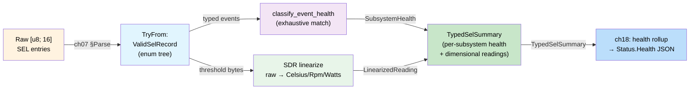
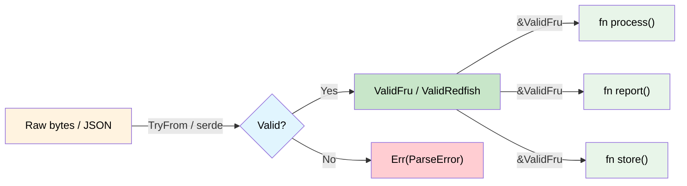

# Validated Boundaries — Parse, Don't Validate 🟡

> **What you'll learn:** How to validate data exactly once at the system boundary, carry the proof of validity in a dedicated type, and never re-check — applied to IPMI FRU records (flat bytes), Redfish JSON (structured documents), and IPMI SEL records (polymorphic binary with nested dispatch), with a complete end-to-end walkthrough.
>
> **Cross-references:** [ch02](ch02-typed-command-interfaces-request-determi.md) (typed commands), [ch06](ch06-dimensional-analysis-making-the-compiler.md) (dimensional types), [ch11](ch11-fourteen-tricks-from-the-trenches.md) (trick 2 — sealed traits, trick 3 — `#[non_exhaustive]`, trick 5 — FromStr), [ch14](ch14-testing-type-level-guarantees.md) (proptest)

## The Problem: Shotgun Validation

In typical code, validation is scattered everywhere. Every function that receives
data re-checks it "just in case":

```c
// C — validation scattered across the codebase
int process_fru_data(uint8_t *data, int len) {
    if (data == NULL) return -1;          // check: non-null
    if (len < 8) return -1;              // check: minimum length
    if (data[0] != 0x01) return -1;      // check: format version
    if (checksum(data, len) != 0) return -1; // check: checksum

    // ... 10 more functions that repeat the same checks ...
}
```

This pattern ("shotgun validation") has two problems:
1. **Redundancy** — the same checks appear in dozens of places
2. **Incompleteness** — forget one check in one function and you have a bug

## Parse, Don't Validate

The correct-by-construction approach: **validate once at the boundary, then carry
the proof of validity in the type**.

```rust,ignore
/// Raw bytes from the wire — not yet validated.
#[derive(Debug)]
pub struct RawFruData(Vec<u8>);
```

### Case Study: IPMI FRU Data

```rust,ignore
# #[derive(Debug)]
# pub struct RawFruData(Vec<u8>);

/// Validated IPMI FRU data. Can only be created via TryFrom,
/// which enforces all invariants. Once you have a ValidFru,
/// all data is guaranteed correct.
#[derive(Debug)]
pub struct ValidFru {
    format_version: u8,
    internal_area_offset: u8,
    chassis_area_offset: u8,
    board_area_offset: u8,
    product_area_offset: u8,
    data: Vec<u8>,
}

#[derive(Debug)]
pub enum FruError {
    TooShort { actual: usize, minimum: usize },
    BadFormatVersion(u8),
    ChecksumMismatch { expected: u8, actual: u8 },
    InvalidAreaOffset { area: &'static str, offset: u8 },
}

impl std::fmt::Display for FruError {
    fn fmt(&self, f: &mut std::fmt::Formatter<'_>) -> std::fmt::Result {
        match self {
            Self::TooShort { actual, minimum } =>
                write!(f, "FRU data too short: {actual} bytes (minimum {minimum})"),
            Self::BadFormatVersion(v) =>
                write!(f, "unsupported FRU format version: {v}"),
            Self::ChecksumMismatch { expected, actual } =>
                write!(f, "checksum mismatch: expected 0x{expected:02X}, got 0x{actual:02X}"),
            Self::InvalidAreaOffset { area, offset } =>
                write!(f, "invalid {area} area offset: {offset}"),
        }
    }
}

impl TryFrom<RawFruData> for ValidFru {
    type Error = FruError;

    fn try_from(raw: RawFruData) -> Result<Self, FruError> {
        let data = raw.0;

        // 1. Length check
        if data.len() < 8 {
            return Err(FruError::TooShort {
                actual: data.len(),
                minimum: 8,
            });
        }

        // 2. Format version
        if data[0] != 0x01 {
            return Err(FruError::BadFormatVersion(data[0]));
        }

        // 3. Checksum (header is first 8 bytes, checksum at byte 7)
        let checksum: u8 = data[..8].iter().fold(0u8, |acc, &b| acc.wrapping_add(b));
        if checksum != 0 {
            return Err(FruError::ChecksumMismatch {
                expected: 0,
                actual: checksum,
            });
        }

        // 4. Area offsets must be within bounds
        for (name, idx) in [
            ("internal", 1), ("chassis", 2),
            ("board", 3), ("product", 4),
        ] {
            let offset = data[idx];
            if offset != 0 && (offset as usize * 8) >= data.len() {
                return Err(FruError::InvalidAreaOffset {
                    area: name,
                    offset,
                });
            }
        }

        // All checks passed — construct the validated type
        Ok(ValidFru {
            format_version: data[0],
            internal_area_offset: data[1],
            chassis_area_offset: data[2],
            board_area_offset: data[3],
            product_area_offset: data[4],
            data,
        })
    }
}

impl ValidFru {
    /// No validation needed — the type guarantees correctness.
    pub fn board_area(&self) -> Option<&[u8]> {
        if self.board_area_offset == 0 {
            return None;
        }
        let start = self.board_area_offset as usize * 8;
        Some(&self.data[start..])  // safe — bounds checked during parsing
    }

    pub fn product_area(&self) -> Option<&[u8]> {
        if self.product_area_offset == 0 {
            return None;
        }
        let start = self.product_area_offset as usize * 8;
        Some(&self.data[start..])
    }

    pub fn format_version(&self) -> u8 {
        self.format_version
    }
}
```

Any function that takes `&ValidFru` **knows** the data is well-formed. No re-checking:

```rust,ignore
# pub struct ValidFru { board_area_offset: u8, data: Vec<u8> }
# impl ValidFru {
#     pub fn board_area(&self) -> Option<&[u8]> { None }
# }

/// This function does NOT need to validate the FRU data.
/// The type signature guarantees it's already valid.
fn extract_board_serial(fru: &ValidFru) -> Option<String> {
    let board = fru.board_area()?;
    // ... parse serial from board area ...
    // No bounds checks needed — ValidFru guarantees offsets are in range
    Some("ABC123".to_string()) // stub
}

fn extract_board_manufacturer(fru: &ValidFru) -> Option<String> {
    let board = fru.board_area()?;
    // Still no validation needed — same guarantee
    Some("Acme Corp".to_string()) // stub
}
```

## Validated Redfish JSON

The same pattern applies to Redfish API responses. Parse once, carry validity in
the type:

```rust,ignore
use std::collections::HashMap;

/// Raw JSON string from a Redfish endpoint.
pub struct RawRedfishResponse(pub String);

/// A validated Redfish Thermal response.
/// All required fields are guaranteed present and within range.
#[derive(Debug)]
pub struct ValidThermalResponse {
    pub temperatures: Vec<ValidTemperatureReading>,
    pub fans: Vec<ValidFanReading>,
}

#[derive(Debug)]
pub struct ValidTemperatureReading {
    pub name: String,
    pub reading_celsius: f64,     // guaranteed non-NaN, within sensor range
    pub upper_critical: f64,
    pub status: HealthStatus,
}

#[derive(Debug)]
pub struct ValidFanReading {
    pub name: String,
    pub reading_rpm: u32,        // guaranteed > 0 for present fans
    pub status: HealthStatus,
}

#[derive(Debug, Clone, Copy, PartialEq)]
pub enum HealthStatus {
    Ok,
    Warning,
    Critical,
}

#[derive(Debug)]
pub enum RedfishValidationError {
    MissingField(&'static str),
    OutOfRange { field: &'static str, value: f64 },
    InvalidStatus(String),
}

impl std::fmt::Display for RedfishValidationError {
    fn fmt(&self, f: &mut std::fmt::Formatter<'_>) -> std::fmt::Result {
        match self {
            Self::MissingField(name) => write!(f, "missing required field: {name}"),
            Self::OutOfRange { field, value } =>
                write!(f, "field {field} out of range: {value}"),
            Self::InvalidStatus(s) => write!(f, "invalid health status: {s}"),
        }
    }
}

// Once validated, downstream code never re-checks:
fn check_thermal_health(thermal: &ValidThermalResponse) -> bool {
    // No need to check for missing fields or NaN values.
    // ValidThermalResponse guarantees all readings are sensible.
    thermal.temperatures.iter().all(|t| {
        t.reading_celsius < t.upper_critical && t.status != HealthStatus::Critical
    }) && thermal.fans.iter().all(|f| {
        f.reading_rpm > 0 && f.status != HealthStatus::Critical
    })
}
```

## Polymorphic Validation: IPMI SEL Records

The first two case studies validated **flat** structures — a fixed byte layout (FRU)
and a known JSON schema (Redfish). Real-world data is often **polymorphic**: the
interpretation of later bytes depends on earlier bytes. IPMI System Event Log (SEL)
records are the canonical example.

### The Shape of the Problem

Every SEL record is exactly 16 bytes. But what those bytes *mean* depends on a
dispatch chain:

```
Byte 2: Record Type
  ├─ 0x02 → System Event
  │    Byte 10[6:4]: Event Type
  │      ├─ 0x01       → Threshold event (reading + threshold in data bytes 2-3)
  │      ├─ 0x02-0x0C  → Discrete event (bit in offset field)
  │      └─ 0x6F       → Sensor-specific (meaning depends on Sensor Type in byte 7)
  │           Byte 7: Sensor Type
  │             ├─ 0x01 → Temperature events
  │             ├─ 0x02 → Voltage events
  │             ├─ 0x04 → Fan events
  │             ├─ 0x07 → Processor events
  │             ├─ 0x0C → Memory events
  │             ├─ 0x08 → Power Supply events
  │             └─ ...  → (42 sensor types in IPMI 2.0 Table 42-3)
  ├─ 0xC0-0xDF → OEM Timestamped
  └─ 0xE0-0xFF → OEM Non-Timestamped
```

In C, this is a `switch` inside a `switch` inside a `switch`, with each level sharing
the same `uint8_t *data` pointer. Forget one level, misread the spec table, or index
the wrong byte — the bug is silent.

```c
// C — the polymorphic parsing problem
void process_sel_entry(uint8_t *data, int len) {
    if (data[2] == 0x02) {  // system event
        uint8_t event_type = (data[10] >> 4) & 0x07;
        if (event_type == 0x01) {  // threshold
            uint8_t reading = data[11];   // 🐛 or is it data[13]?
            uint8_t threshold = data[12]; // 🐛 spec says byte 12 is trigger, not threshold
            printf("Temp: %d crossed %d\n", reading, threshold);
        } else if (event_type == 0x6F) {  // sensor-specific
            uint8_t sensor_type = data[7];
            if (sensor_type == 0x0C) {  // memory
                // 🐛 forgot to check event data 1 offset bits
                printf("Memory ECC error\n");
            }
            // 🐛 no else — silently drops 30+ other sensor types
        }
    }
    // 🐛 OEM record types silently ignored
}
```

### Step 1 — Parse the Outer Frame

The first `TryFrom` dispatches on record type — the outermost layer of the union:

```rust,ignore
/// Raw 16-byte SEL record, straight from `Get SEL Entry` (IPMI cmd 0x43).
pub struct RawSelRecord(pub [u8; 16]);

/// Validated SEL record — record type dispatched, all fields checked.
pub enum ValidSelRecord {
    SystemEvent(SystemEventRecord),
    OemTimestamped(OemTimestampedRecord),
    OemNonTimestamped(OemNonTimestampedRecord),
}

#[derive(Debug)]
pub struct OemTimestampedRecord {
    pub record_id: u16,
    pub timestamp: u32,
    pub manufacturer_id: [u8; 3],
    pub oem_data: [u8; 6],
}

#[derive(Debug)]
pub struct OemNonTimestampedRecord {
    pub record_id: u16,
    pub oem_data: [u8; 13],
}

#[derive(Debug)]
pub enum SelParseError {
    UnknownRecordType(u8),
    UnknownSensorType(u8),
    UnknownEventType(u8),
    InvalidEventData { reason: &'static str },
}

impl std::fmt::Display for SelParseError {
    fn fmt(&self, f: &mut std::fmt::Formatter<'_>) -> std::fmt::Result {
        match self {
            Self::UnknownRecordType(t) => write!(f, "unknown record type: 0x{t:02X}"),
            Self::UnknownSensorType(t) => write!(f, "unknown sensor type: 0x{t:02X}"),
            Self::UnknownEventType(t) => write!(f, "unknown event type: 0x{t:02X}"),
            Self::InvalidEventData { reason } => write!(f, "invalid event data: {reason}"),
        }
    }
}

impl TryFrom<RawSelRecord> for ValidSelRecord {
    type Error = SelParseError;

    fn try_from(raw: RawSelRecord) -> Result<Self, SelParseError> {
        let d = &raw.0;
        let record_id = u16::from_le_bytes([d[0], d[1]]);

        match d[2] {
            0x02 => {
                let system = parse_system_event(record_id, d)?;
                Ok(ValidSelRecord::SystemEvent(system))
            }
            0xC0..=0xDF => {
                Ok(ValidSelRecord::OemTimestamped(OemTimestampedRecord {
                    record_id,
                    timestamp: u32::from_le_bytes([d[3], d[4], d[5], d[6]]),
                    manufacturer_id: [d[7], d[8], d[9]],
                    oem_data: [d[10], d[11], d[12], d[13], d[14], d[15]],
                }))
            }
            0xE0..=0xFF => {
                Ok(ValidSelRecord::OemNonTimestamped(OemNonTimestampedRecord {
                    record_id,
                    oem_data: [d[3], d[4], d[5], d[6], d[7], d[8], d[9],
                               d[10], d[11], d[12], d[13], d[14], d[15]],
                }))
            }
            other => Err(SelParseError::UnknownRecordType(other)),
        }
    }
}
```

After this boundary, every consumer matches on the enum. The compiler enforces
handling all three record types — you can't "forget" OEM records.

### Step 2 — Parse the System Event: Sensor Type → Typed Event

The inner dispatch turns the event data bytes into a sum type indexed by sensor
type. This is where the C `switch`-in-a-`switch` becomes a nested enum:

```rust,ignore
#[derive(Debug)]
pub struct SystemEventRecord {
    pub record_id: u16,
    pub timestamp: u32,
    pub generator: GeneratorId,
    pub sensor_type: SensorType,
    pub sensor_number: u8,
    pub event_direction: EventDirection,
    pub event: TypedEvent,      // ← the key: event data is TYPED
}

#[derive(Debug)]
pub enum GeneratorId {
    Software(u8),
    Ipmb { slave_addr: u8, channel: u8, lun: u8 },
}

#[derive(Debug, Clone, Copy, PartialEq)]
pub enum EventDirection { Assertion, Deassertion }

// ──── The Sensor/Event Type Hierarchy ────

/// Sensor types from IPMI Table 42-3. Non-exhaustive because future
/// IPMI revisions and OEM ranges will add variants (see ch11 trick 3).
#[non_exhaustive]
#[derive(Debug, Clone, Copy, PartialEq)]
pub enum SensorType {
    Temperature,    // 0x01
    Voltage,        // 0x02
    Current,        // 0x03
    Fan,            // 0x04
    PhysicalSecurity, // 0x05
    Processor,      // 0x07
    PowerSupply,    // 0x08
    Memory,         // 0x0C
    SystemEvent,    // 0x12
    Watchdog2,      // 0x23
}

/// The polymorphic payload — each variant carries its own typed data.
#[derive(Debug)]
pub enum TypedEvent {
    Threshold(ThresholdEvent),
    SensorSpecific(SensorSpecificEvent),
    Discrete { offset: u8, event_data: [u8; 3] },
}

/// Threshold events carry the trigger reading and threshold value.
/// Both are raw sensor values (pre-linearization), kept as u8.
/// After SDR linearization, they become dimensional types (ch06).
#[derive(Debug)]
pub struct ThresholdEvent {
    pub crossing: ThresholdCrossing,
    pub trigger_reading: u8,
    pub threshold_value: u8,
}

#[derive(Debug, Clone, Copy, PartialEq)]
pub enum ThresholdCrossing {
    LowerNonCriticalLow,
    LowerNonCriticalHigh,
    LowerCriticalLow,
    LowerCriticalHigh,
    LowerNonRecoverableLow,
    LowerNonRecoverableHigh,
    UpperNonCriticalLow,
    UpperNonCriticalHigh,
    UpperCriticalLow,
    UpperCriticalHigh,
    UpperNonRecoverableLow,
    UpperNonRecoverableHigh,
}

/// Sensor-specific events — each sensor type gets its own variant
/// with an exhaustive enum of that sensor's defined events.
#[derive(Debug)]
pub enum SensorSpecificEvent {
    Temperature(TempEvent),
    Voltage(VoltageEvent),
    Fan(FanEvent),
    Processor(ProcessorEvent),
    PowerSupply(PowerSupplyEvent),
    Memory(MemoryEvent),
    PhysicalSecurity(PhysicalSecurityEvent),
    Watchdog(WatchdogEvent),
}

// ──── Per-sensor-type event enums (from IPMI Table 42-3) ────

#[derive(Debug, Clone, Copy, PartialEq)]
pub enum MemoryEvent {
    CorrectableEcc,
    UncorrectableEcc,
    Parity,
    MemoryBoardScrubFailed,
    MemoryDeviceDisabled,
    CorrectableEccLogLimit,
    PresenceDetected,
    ConfigurationError,
    Spare,
    Throttled,
    CriticalOvertemperature,
}

#[derive(Debug, Clone, Copy, PartialEq)]
pub enum PowerSupplyEvent {
    PresenceDetected,
    Failure,
    PredictiveFailure,
    InputLost,
    InputOutOfRange,
    InputLostOrOutOfRange,
    ConfigurationError,
    InactiveStandby,
}

#[derive(Debug, Clone, Copy, PartialEq)]
pub enum TempEvent {
    UpperNonCritical,
    UpperCritical,
    UpperNonRecoverable,
    LowerNonCritical,
    LowerCritical,
    LowerNonRecoverable,
}

#[derive(Debug, Clone, Copy, PartialEq)]
pub enum VoltageEvent {
    UpperNonCritical,
    UpperCritical,
    UpperNonRecoverable,
    LowerNonCritical,
    LowerCritical,
    LowerNonRecoverable,
}

#[derive(Debug, Clone, Copy, PartialEq)]
pub enum FanEvent {
    UpperNonCritical,
    UpperCritical,
    UpperNonRecoverable,
    LowerNonCritical,
    LowerCritical,
    LowerNonRecoverable,
}

#[derive(Debug, Clone, Copy, PartialEq)]
pub enum ProcessorEvent {
    Ierr,
    ThermalTrip,
    Frb1BistFailure,
    Frb2HangInPost,
    Frb3ProcessorStartupFailure,
    ConfigurationError,
    UncorrectableMachineCheck,
    PresenceDetected,
    Disabled,
    TerminatorPresenceDetected,
    Throttled,
}

#[derive(Debug, Clone, Copy, PartialEq)]
pub enum PhysicalSecurityEvent {
    ChassisIntrusion,
    DriveIntrusion,
    IOCardAreaIntrusion,
    ProcessorAreaIntrusion,
    LanLeashedLost,
    UnauthorizedDocking,
    FanAreaIntrusion,
}

#[derive(Debug, Clone, Copy, PartialEq)]
pub enum WatchdogEvent {
    BiosReset,
    OsReset,
    OsShutdown,
    OsPowerDown,
    OsPowerCycle,
    BiosNmi,
    Timer,
}
```

### Step 3 — The Parser Wiring

```rust,ignore
fn parse_system_event(record_id: u16, d: &[u8]) -> Result<SystemEventRecord, SelParseError> {
    let timestamp = u32::from_le_bytes([d[3], d[4], d[5], d[6]]);

    let generator = if d[7] & 0x01 == 0 {
        GeneratorId::Ipmb {
            slave_addr: d[7] & 0xFE,
            channel: (d[8] >> 4) & 0x0F,
            lun: d[8] & 0x03,
        }
    } else {
        GeneratorId::Software(d[7])
    };

    let sensor_type = parse_sensor_type(d[10])?;
    let sensor_number = d[11];
    let event_direction = if d[12] & 0x80 != 0 {
        EventDirection::Deassertion
    } else {
        EventDirection::Assertion
    };

    let event_type_code = d[12] & 0x7F;
    let event_data = [d[13], d[14], d[15]];

    let event = match event_type_code {
        0x01 => {
            // Threshold — event data byte 2 is trigger reading, byte 3 is threshold
            let offset = event_data[0] & 0x0F;
            TypedEvent::Threshold(ThresholdEvent {
                crossing: parse_threshold_crossing(offset)?,
                trigger_reading: event_data[1],
                threshold_value: event_data[2],
            })
        }
        0x6F => {
            // Sensor-specific — dispatch on sensor type
            let offset = event_data[0] & 0x0F;
            let specific = parse_sensor_specific(&sensor_type, offset)?;
            TypedEvent::SensorSpecific(specific)
        }
        0x02..=0x0C => {
            // Generic discrete
            TypedEvent::Discrete { offset: event_data[0] & 0x0F, event_data }
        }
        other => return Err(SelParseError::UnknownEventType(other)),
    };

    Ok(SystemEventRecord {
        record_id,
        timestamp,
        generator,
        sensor_type,
        sensor_number,
        event_direction,
        event,
    })
}

fn parse_sensor_type(code: u8) -> Result<SensorType, SelParseError> {
    match code {
        0x01 => Ok(SensorType::Temperature),
        0x02 => Ok(SensorType::Voltage),
        0x03 => Ok(SensorType::Current),
        0x04 => Ok(SensorType::Fan),
        0x05 => Ok(SensorType::PhysicalSecurity),
        0x07 => Ok(SensorType::Processor),
        0x08 => Ok(SensorType::PowerSupply),
        0x0C => Ok(SensorType::Memory),
        0x12 => Ok(SensorType::SystemEvent),
        0x23 => Ok(SensorType::Watchdog2),
        other => Err(SelParseError::UnknownSensorType(other)),
    }
}

fn parse_threshold_crossing(offset: u8) -> Result<ThresholdCrossing, SelParseError> {
    match offset {
        0x00 => Ok(ThresholdCrossing::LowerNonCriticalLow),
        0x01 => Ok(ThresholdCrossing::LowerNonCriticalHigh),
        0x02 => Ok(ThresholdCrossing::LowerCriticalLow),
        0x03 => Ok(ThresholdCrossing::LowerCriticalHigh),
        0x04 => Ok(ThresholdCrossing::LowerNonRecoverableLow),
        0x05 => Ok(ThresholdCrossing::LowerNonRecoverableHigh),
        0x06 => Ok(ThresholdCrossing::UpperNonCriticalLow),
        0x07 => Ok(ThresholdCrossing::UpperNonCriticalHigh),
        0x08 => Ok(ThresholdCrossing::UpperCriticalLow),
        0x09 => Ok(ThresholdCrossing::UpperCriticalHigh),
        0x0A => Ok(ThresholdCrossing::UpperNonRecoverableLow),
        0x0B => Ok(ThresholdCrossing::UpperNonRecoverableHigh),
        _ => Err(SelParseError::InvalidEventData {
            reason: "threshold offset out of range",
        }),
    }
}

fn parse_sensor_specific(
    sensor_type: &SensorType,
    offset: u8,
) -> Result<SensorSpecificEvent, SelParseError> {
    match sensor_type {
        SensorType::Memory => {
            let ev = match offset {
                0x00 => MemoryEvent::CorrectableEcc,
                0x01 => MemoryEvent::UncorrectableEcc,
                0x02 => MemoryEvent::Parity,
                0x03 => MemoryEvent::MemoryBoardScrubFailed,
                0x04 => MemoryEvent::MemoryDeviceDisabled,
                0x05 => MemoryEvent::CorrectableEccLogLimit,
                0x06 => MemoryEvent::PresenceDetected,
                0x07 => MemoryEvent::ConfigurationError,
                0x08 => MemoryEvent::Spare,
                0x09 => MemoryEvent::Throttled,
                0x0A => MemoryEvent::CriticalOvertemperature,
                _ => return Err(SelParseError::InvalidEventData {
                    reason: "unknown memory event offset",
                }),
            };
            Ok(SensorSpecificEvent::Memory(ev))
        }
        SensorType::PowerSupply => {
            let ev = match offset {
                0x00 => PowerSupplyEvent::PresenceDetected,
                0x01 => PowerSupplyEvent::Failure,
                0x02 => PowerSupplyEvent::PredictiveFailure,
                0x03 => PowerSupplyEvent::InputLost,
                0x04 => PowerSupplyEvent::InputOutOfRange,
                0x05 => PowerSupplyEvent::InputLostOrOutOfRange,
                0x06 => PowerSupplyEvent::ConfigurationError,
                0x07 => PowerSupplyEvent::InactiveStandby,
                _ => return Err(SelParseError::InvalidEventData {
                    reason: "unknown power supply event offset",
                }),
            };
            Ok(SensorSpecificEvent::PowerSupply(ev))
        }
        SensorType::Processor => {
            let ev = match offset {
                0x00 => ProcessorEvent::Ierr,
                0x01 => ProcessorEvent::ThermalTrip,
                0x02 => ProcessorEvent::Frb1BistFailure,
                0x03 => ProcessorEvent::Frb2HangInPost,
                0x04 => ProcessorEvent::Frb3ProcessorStartupFailure,
                0x05 => ProcessorEvent::ConfigurationError,
                0x06 => ProcessorEvent::UncorrectableMachineCheck,
                0x07 => ProcessorEvent::PresenceDetected,
                0x08 => ProcessorEvent::Disabled,
                0x09 => ProcessorEvent::TerminatorPresenceDetected,
                0x0A => ProcessorEvent::Throttled,
                _ => return Err(SelParseError::InvalidEventData {
                    reason: "unknown processor event offset",
                }),
            };
            Ok(SensorSpecificEvent::Processor(ev))
        }
        // Pattern repeats for Temperature, Voltage, Fan, etc.
        // Each sensor type maps its offsets to a dedicated enum.
        _ => Err(SelParseError::InvalidEventData {
            reason: "sensor-specific dispatch not implemented for this sensor type",
        }),
    }
}
```

### Step 4 — Consuming Typed SEL Records

Once parsed, downstream code pattern-matches on the nested enums. The compiler
enforces exhaustive handling — no silent fallthrough, no forgotten sensor type:

```rust,ignore
/// Determine whether a SEL event should trigger a hardware alert.
/// The compiler ensures every variant is handled.
fn should_alert(record: &ValidSelRecord) -> bool {
    match record {
        ValidSelRecord::SystemEvent(sys) => match &sys.event {
            TypedEvent::Threshold(t) => {
                // Any critical or non-recoverable threshold crossing → alert
                matches!(t.crossing,
                    ThresholdCrossing::UpperCriticalLow
                    | ThresholdCrossing::UpperCriticalHigh
                    | ThresholdCrossing::LowerCriticalLow
                    | ThresholdCrossing::LowerCriticalHigh
                    | ThresholdCrossing::UpperNonRecoverableLow
                    | ThresholdCrossing::UpperNonRecoverableHigh
                    | ThresholdCrossing::LowerNonRecoverableLow
                    | ThresholdCrossing::LowerNonRecoverableHigh
                )
            }
            TypedEvent::SensorSpecific(ss) => match ss {
                SensorSpecificEvent::Memory(m) => matches!(m,
                    MemoryEvent::UncorrectableEcc
                    | MemoryEvent::Parity
                    | MemoryEvent::CriticalOvertemperature
                ),
                SensorSpecificEvent::PowerSupply(p) => matches!(p,
                    PowerSupplyEvent::Failure
                    | PowerSupplyEvent::InputLost
                ),
                SensorSpecificEvent::Processor(p) => matches!(p,
                    ProcessorEvent::Ierr
                    | ProcessorEvent::ThermalTrip
                    | ProcessorEvent::UncorrectableMachineCheck
                ),
                // New sensor type variant added in a future version?
                // ❌ Compile error: non-exhaustive patterns
                _ => false,
            },
            TypedEvent::Discrete { .. } => false,
        },
        // OEM records are not alertable in this policy
        ValidSelRecord::OemTimestamped(_) => false,
        ValidSelRecord::OemNonTimestamped(_) => false,
    }
}

/// Generate a human-readable description.
/// Every branch produces a specific message — no "unknown event" fallback.
fn describe(record: &ValidSelRecord) -> String {
    match record {
        ValidSelRecord::SystemEvent(sys) => {
            let sensor = format!("{:?} sensor #{}", sys.sensor_type, sys.sensor_number);
            let dir = match sys.event_direction {
                EventDirection::Assertion => "asserted",
                EventDirection::Deassertion => "deasserted",
            };
            match &sys.event {
                TypedEvent::Threshold(t) => {
                    format!("{sensor}: {:?} {dir} (reading: 0x{:02X}, threshold: 0x{:02X})",
                        t.crossing, t.trigger_reading, t.threshold_value)
                }
                TypedEvent::SensorSpecific(ss) => {
                    format!("{sensor}: {ss:?} {dir}")
                }
                TypedEvent::Discrete { offset, .. } => {
                    format!("{sensor}: discrete offset {offset:#x} {dir}")
                }
            }
        }
        ValidSelRecord::OemTimestamped(oem) =>
            format!("OEM record 0x{:04X} (mfr {:02X}{:02X}{:02X})",
                oem.record_id,
                oem.manufacturer_id[0], oem.manufacturer_id[1], oem.manufacturer_id[2]),
        ValidSelRecord::OemNonTimestamped(oem) =>
            format!("OEM non-ts record 0x{:04X}", oem.record_id),
    }
}
```

### Walkthrough: End-to-End SEL Processing

Here's a complete flow — from raw bytes off the wire to an alert decision —
showing every typed handoff:

```rust,ignore
/// Process all SEL entries from a BMC, producing typed alerts.
fn process_sel_log(raw_entries: &[[u8; 16]]) -> Vec<String> {
    let mut alerts = Vec::new();

    for (i, raw_bytes) in raw_entries.iter().enumerate() {
        // ─── Boundary: raw bytes → validated record ───
        let raw = RawSelRecord(*raw_bytes);
        let record = match ValidSelRecord::try_from(raw) {
            Ok(r) => r,
            Err(e) => {
                eprintln!("SEL entry {i}: parse error: {e}");
                continue;
            }
        };

        // ─── From here, everything is typed ───

        // 1. Describe the event (exhaustive match — every variant covered)
        let description = describe(&record);
        println!("SEL[{i}]: {description}");

        // 2. Check alert policy (exhaustive match — compiler proves completeness)
        if should_alert(&record) {
            alerts.push(description);
        }

        // 3. Extract dimensional readings from threshold events
        if let ValidSelRecord::SystemEvent(sys) = &record {
            if let TypedEvent::Threshold(t) = &sys.event {
                // The compiler knows t.trigger_reading is a threshold event reading,
                // not an arbitrary byte. After SDR linearization (ch06), this becomes:
                //   let temp: Celsius = linearize(t.trigger_reading, &sdr);
                // And then Celsius can't be compared with Rpm.
                println!(
                    "  → raw reading: 0x{:02X}, raw threshold: 0x{:02X}",
                    t.trigger_reading, t.threshold_value
                );
            }
        }
    }

    alerts
}

fn main() {
    // Example: two SEL entries (fabricated for illustration)
    let sel_data: Vec<[u8; 16]> = vec![
        // Entry 1: System event, Memory sensor #3, sensor-specific,
        //          offset 0x00 = CorrectableEcc, assertion
        [
            0x01, 0x00,       // record ID: 1
            0x02,             // record type: system event
            0x00, 0x00, 0x00, 0x00, // timestamp (stub)
            0x20,             // generator: IPMB slave addr 0x20
            0x00,             // channel/lun
            0x04,             // event message rev
            0x0C,             // sensor type: Memory (0x0C)
            0x03,             // sensor number: 3
            0x6F,             // event dir: assertion, event type: sensor-specific
            0x00,             // event data 1: offset 0x00 = CorrectableEcc
            0x00, 0x00,       // event data 2-3
        ],
        // Entry 2: System event, Temperature sensor #1, threshold,
        //          offset 0x09 = UpperCriticalHigh, reading=95, threshold=90
        [
            0x02, 0x00,       // record ID: 2
            0x02,             // record type: system event
            0x00, 0x00, 0x00, 0x00, // timestamp (stub)
            0x20,             // generator
            0x00,             // channel/lun
            0x04,             // event message rev
            0x01,             // sensor type: Temperature (0x01)
            0x01,             // sensor number: 1
            0x01,             // event dir: assertion, event type: threshold (0x01)
            0x09,             // event data 1: offset 0x09 = UpperCriticalHigh
            0x5F,             // event data 2: trigger reading (95 raw)
            0x5A,             // event data 3: threshold value (90 raw)
        ],
    ];

    let alerts = process_sel_log(&sel_data);
    println!("\n=== ALERTS ({}) ===", alerts.len());
    for alert in &alerts {
        println!("  🚨 {alert}");
    }
}
```

**Expected output:**

```text
SEL[0]: Memory sensor #3: Memory(CorrectableEcc) asserted
SEL[1]: Temperature sensor #1: UpperCriticalHigh asserted (reading: 0x5F, threshold: 0x5A)
  → raw reading: 0x5F, raw threshold: 0x5A

=== ALERTS (1) ===
  🚨 Temperature sensor #1: UpperCriticalHigh asserted (reading: 0x5F, threshold: 0x5A)
```

Entry 0 (correctable ECC) is logged but not alerted. Entry 1 (upper critical
temperature) triggers an alert. Both decisions are enforced by exhaustive pattern
matching — the compiler proves every sensor type and threshold crossing is handled.

### From Parsed Events to Redfish Health: The Consumer Pipeline

The walkthrough above ends with alerts — but in a real BMC, parsed SEL records
flow into the Redfish health rollup ([ch18](ch18-redfish-server-walkthrough.md)).
The current handoff is a lossy `bool`:

```rust,ignore
// ❌ Lossy — throws away per-subsystem detail
pub struct SelSummary {
    pub has_critical_events: bool,
    pub total_entries: u32,
}
```

This loses everything the type system just gave us: which subsystem is affected,
what severity level, and whether the reading carries dimensional data. Let's build
the full pipeline.

#### Step 1 — SDR Linearization: Raw Bytes → Dimensional Types (ch06)

Threshold SEL events carry raw sensor readings in event data bytes 2-3. The IPMI
SDR (Sensor Data Record) provides the linearization formula. After linearization,
the raw byte becomes a dimensional type:

```rust,ignore
/// SDR linearization coefficients for a single sensor.
/// See IPMI spec section 36.3 for the full formula.
pub struct SdrLinearization {
    pub sensor_type: SensorType,
    pub m: i16,        // multiplier
    pub b: i16,        // offset
    pub r_exp: i8,     // result exponent (power-of-10)
    pub b_exp: i8,     // B exponent
}

/// A linearized sensor reading with its unit attached.
/// The return type depends on the sensor type — the compiler
/// enforces that temperature sensors produce Celsius, not Rpm.
#[derive(Debug, Clone)]
pub enum LinearizedReading {
    Temperature(Celsius),
    Voltage(Volts),
    Fan(Rpm),
    Current(Amps),
    Power(Watts),
}

#[derive(Debug, Clone, Copy, PartialEq, PartialOrd)]
pub struct Amps(pub f64);

impl SdrLinearization {
    /// Apply the IPMI linearization formula:
    ///   y = (M × raw + B × 10^B_exp) × 10^R_exp
    /// Returns a dimensional type based on the sensor type.
    pub fn linearize(&self, raw: u8) -> LinearizedReading {
        let y = (self.m as f64 * raw as f64
                + self.b as f64 * 10_f64.powi(self.b_exp as i32))
                * 10_f64.powi(self.r_exp as i32);

        match self.sensor_type {
            SensorType::Temperature => LinearizedReading::Temperature(Celsius(y)),
            SensorType::Voltage     => LinearizedReading::Voltage(Volts(y)),
            SensorType::Fan         => LinearizedReading::Fan(Rpm(y as u32)),
            SensorType::Current     => LinearizedReading::Current(Amps(y)),
            SensorType::PowerSupply => LinearizedReading::Power(Watts(y)),
            // Other sensor types — extend as needed
            _ => LinearizedReading::Temperature(Celsius(y)),
        }
    }
}
```

With this, the raw byte `0x5F` (95 decimal) from our SEL walkthrough becomes
`Celsius(95.0)` — and the compiler prevents comparing it with `Rpm` or `Watts`.

#### Step 2 — Per-Subsystem Health Classification

Instead of collapsing everything into `has_critical_events: bool`, classify each
parsed SEL event into a per-subsystem health bucket:

```rust,ignore
/// Worst-of health value — Ord gives us `.max()` for free.
/// (Full definition in ch18; reproduced here for the SEL pipeline.)
#[derive(Debug, Clone, Copy, PartialEq, Eq, PartialOrd, Ord)]
pub enum HealthValue { OK, Warning, Critical }

/// Health contribution from a single SEL event, classified by subsystem.
#[derive(Debug, Clone)]
pub enum SubsystemHealth {
    Processor(HealthValue),
    Memory(HealthValue),
    PowerSupply(HealthValue),
    Thermal(HealthValue),
    Fan(HealthValue),
    Storage(HealthValue),
    Security(HealthValue),
}

/// Classify a typed SEL event into per-subsystem health.
/// Exhaustive matching ensures every sensor type contributes.
fn classify_event_health(record: &SystemEventRecord) -> SubsystemHealth {
    match &record.event {
        TypedEvent::Threshold(t) => {
            // Threshold severity depends on the crossing level
            let health = match t.crossing {
                // Non-critical → Warning
                ThresholdCrossing::UpperNonCriticalLow
                | ThresholdCrossing::UpperNonCriticalHigh
                | ThresholdCrossing::LowerNonCriticalLow
                | ThresholdCrossing::LowerNonCriticalHigh => HealthValue::Warning,

                // Critical or Non-recoverable → Critical
                ThresholdCrossing::UpperCriticalLow
                | ThresholdCrossing::UpperCriticalHigh
                | ThresholdCrossing::LowerCriticalLow
                | ThresholdCrossing::LowerCriticalHigh
                | ThresholdCrossing::UpperNonRecoverableLow
                | ThresholdCrossing::UpperNonRecoverableHigh
                | ThresholdCrossing::LowerNonRecoverableLow
                | ThresholdCrossing::LowerNonRecoverableHigh => HealthValue::Critical,
            };

            // Route to the correct subsystem based on sensor type
            match record.sensor_type {
                SensorType::Temperature => SubsystemHealth::Thermal(health),
                SensorType::Voltage     => SubsystemHealth::PowerSupply(health),
                SensorType::Current     => SubsystemHealth::PowerSupply(health),
                SensorType::Fan         => SubsystemHealth::Fan(health),
                SensorType::Processor   => SubsystemHealth::Processor(health),
                SensorType::PowerSupply => SubsystemHealth::PowerSupply(health),
                SensorType::Memory      => SubsystemHealth::Memory(health),
                _                       => SubsystemHealth::Thermal(health),
            }
        }

        TypedEvent::SensorSpecific(ss) => match ss {
            SensorSpecificEvent::Memory(m) => {
                let health = match m {
                    MemoryEvent::UncorrectableEcc
                    | MemoryEvent::Parity
                    | MemoryEvent::CriticalOvertemperature => HealthValue::Critical,

                    MemoryEvent::CorrectableEccLogLimit
                    | MemoryEvent::MemoryBoardScrubFailed
                    | MemoryEvent::Throttled => HealthValue::Warning,

                    MemoryEvent::CorrectableEcc
                    | MemoryEvent::PresenceDetected
                    | MemoryEvent::MemoryDeviceDisabled
                    | MemoryEvent::ConfigurationError
                    | MemoryEvent::Spare => HealthValue::OK,
                };
                SubsystemHealth::Memory(health)
            }

            SensorSpecificEvent::PowerSupply(p) => {
                let health = match p {
                    PowerSupplyEvent::Failure
                    | PowerSupplyEvent::InputLost => HealthValue::Critical,

                    PowerSupplyEvent::PredictiveFailure
                    | PowerSupplyEvent::InputOutOfRange
                    | PowerSupplyEvent::InputLostOrOutOfRange
                    | PowerSupplyEvent::ConfigurationError => HealthValue::Warning,

                    PowerSupplyEvent::PresenceDetected
                    | PowerSupplyEvent::InactiveStandby => HealthValue::OK,
                };
                SubsystemHealth::PowerSupply(health)
            }

            SensorSpecificEvent::Processor(p) => {
                let health = match p {
                    ProcessorEvent::Ierr
                    | ProcessorEvent::ThermalTrip
                    | ProcessorEvent::UncorrectableMachineCheck => HealthValue::Critical,

                    ProcessorEvent::Frb1BistFailure
                    | ProcessorEvent::Frb2HangInPost
                    | ProcessorEvent::Frb3ProcessorStartupFailure
                    | ProcessorEvent::ConfigurationError
                    | ProcessorEvent::Disabled => HealthValue::Warning,

                    ProcessorEvent::PresenceDetected
                    | ProcessorEvent::TerminatorPresenceDetected
                    | ProcessorEvent::Throttled => HealthValue::OK,
                };
                SubsystemHealth::Processor(health)
            }

            SensorSpecificEvent::PhysicalSecurity(_) =>
                SubsystemHealth::Security(HealthValue::Warning),

            SensorSpecificEvent::Watchdog(_) =>
                SubsystemHealth::Processor(HealthValue::Warning),

            // Temperature, Voltage, Fan sensor-specific events
            SensorSpecificEvent::Temperature(_) =>
                SubsystemHealth::Thermal(HealthValue::Warning),
            SensorSpecificEvent::Voltage(_) =>
                SubsystemHealth::PowerSupply(HealthValue::Warning),
            SensorSpecificEvent::Fan(_) =>
                SubsystemHealth::Fan(HealthValue::Warning),
        },

        TypedEvent::Discrete { .. } => {
            // Generic discrete — classify by sensor type with Warning
            match record.sensor_type {
                SensorType::Processor => SubsystemHealth::Processor(HealthValue::Warning),
                SensorType::Memory    => SubsystemHealth::Memory(HealthValue::Warning),
                _                     => SubsystemHealth::Thermal(HealthValue::OK),
            }
        }
    }
}
```

Every `match` arm is exhaustive — add a new `MemoryEvent` variant and the compiler
forces you to decide its severity. Add a new `SensorSpecificEvent` variant and
every consumer must classify it. This is the payoff of the enum tree from the
parsing section.

#### Step 3 — Aggregate into a Typed SEL Summary

Replace the lossy `bool` with a structured summary that preserves per-subsystem
health:

```rust,ignore
use std::collections::HashMap;

/// Rich SEL summary — per-subsystem health derived from typed events.
/// This is what gets handed to the Redfish server (ch18) for health rollup.
#[derive(Debug, Clone)]
pub struct TypedSelSummary {
    pub total_entries: u32,
    pub processor_health: HealthValue,
    pub memory_health: HealthValue,
    pub power_health: HealthValue,
    pub thermal_health: HealthValue,
    pub fan_health: HealthValue,
    pub storage_health: HealthValue,
    pub security_health: HealthValue,
    /// Dimensional readings from threshold events (post-linearization).
    pub threshold_readings: Vec<LinearizedThresholdEvent>,
}

/// A threshold event with linearized readings attached.
#[derive(Debug, Clone)]
pub struct LinearizedThresholdEvent {
    pub sensor_type: SensorType,
    pub sensor_number: u8,
    pub crossing: ThresholdCrossing,
    pub trigger_reading: LinearizedReading,
    pub threshold_value: LinearizedReading,
}

/// Build a TypedSelSummary from parsed SEL records.
/// This is the consumer pipeline: parse (Step 0 above) → classify → aggregate.
pub fn summarize_sel(
    records: &[ValidSelRecord],
    sdr_table: &HashMap<u8, SdrLinearization>,
) -> TypedSelSummary {
    let mut processor = HealthValue::OK;
    let mut memory = HealthValue::OK;
    let mut power = HealthValue::OK;
    let mut thermal = HealthValue::OK;
    let mut fan = HealthValue::OK;
    let mut storage = HealthValue::OK;
    let mut security = HealthValue::OK;
    let mut threshold_readings = Vec::new();
    let mut count = 0u32;

    for record in records {
        count += 1;

        let ValidSelRecord::SystemEvent(sys) = record else {
            continue; // OEM records don't contribute to health
        };

        // ── Classify event → per-subsystem health ──
        let health = classify_event_health(sys);
        match &health {
            SubsystemHealth::Processor(h) => processor = processor.max(*h),
            SubsystemHealth::Memory(h)    => memory = memory.max(*h),
            SubsystemHealth::PowerSupply(h) => power = power.max(*h),
            SubsystemHealth::Thermal(h)   => thermal = thermal.max(*h),
            SubsystemHealth::Fan(h)       => fan = fan.max(*h),
            SubsystemHealth::Storage(h)   => storage = storage.max(*h),
            SubsystemHealth::Security(h)  => security = security.max(*h),
        }

        // ── Linearize threshold readings if SDR is available ──
        if let TypedEvent::Threshold(t) = &sys.event {
            if let Some(sdr) = sdr_table.get(&sys.sensor_number) {
                threshold_readings.push(LinearizedThresholdEvent {
                    sensor_type: sys.sensor_type,
                    sensor_number: sys.sensor_number,
                    crossing: t.crossing,
                    trigger_reading: sdr.linearize(t.trigger_reading),
                    threshold_value: sdr.linearize(t.threshold_value),
                });
            }
        }
    }

    TypedSelSummary {
        total_entries: count,
        processor_health: processor,
        memory_health: memory,
        power_health: power,
        thermal_health: thermal,
        fan_health: fan,
        storage_health: storage,
        security_health: security,
        threshold_readings,
    }
}
```

#### Step 4 — The Full Pipeline: Raw Bytes → Redfish Health

Here's the complete consumer pipeline, showing every typed handoff from raw SEL
bytes to Redfish-ready health values:



```rust,ignore
use std::collections::HashMap;

fn full_sel_pipeline() {
    // ── Raw SEL data from BMC ──
    let raw_entries: Vec<[u8; 16]> = vec![
        // Memory correctable ECC on sensor #3
        [0x01,0x00, 0x02, 0x00,0x00,0x00,0x00,
         0x20,0x00, 0x04, 0x0C, 0x03, 0x6F, 0x00, 0x00,0x00],
        // Temperature upper critical on sensor #1, reading=95, threshold=90
        [0x02,0x00, 0x02, 0x00,0x00,0x00,0x00,
         0x20,0x00, 0x04, 0x01, 0x01, 0x01, 0x09, 0x5F,0x5A],
        // PSU failure on sensor #5
        [0x03,0x00, 0x02, 0x00,0x00,0x00,0x00,
         0x20,0x00, 0x04, 0x08, 0x05, 0x6F, 0x01, 0x00,0x00],
    ];

    // ── Step 0: Parse at the boundary (ch07 TryFrom) ──
    let records: Vec<ValidSelRecord> = raw_entries.iter()
        .filter_map(|raw| ValidSelRecord::try_from(RawSelRecord(*raw)).ok())
        .collect();

    // ── Step 1-3: Classify + linearize + aggregate ──
    let mut sdr_table = HashMap::new();
    sdr_table.insert(1u8, SdrLinearization {
        sensor_type: SensorType::Temperature,
        m: 1, b: 0, r_exp: 0, b_exp: 0,  // 1:1 mapping for this example
    });

    let summary = summarize_sel(&records, &sdr_table);

    // ── Result: structured, typed, Redfish-ready ──
    println!("SEL Summary:");
    println!("  Total entries: {}", summary.total_entries);
    println!("  Processor:  {:?}", summary.processor_health);  // OK
    println!("  Memory:     {:?}", summary.memory_health);      // OK (correctable → OK)
    println!("  Power:      {:?}", summary.power_health);       // Critical (PSU failure)
    println!("  Thermal:    {:?}", summary.thermal_health);     // Critical (upper critical)
    println!("  Fan:        {:?}", summary.fan_health);         // OK
    println!("  Security:   {:?}", summary.security_health);    // OK

    // Dimensional readings preserved from threshold events:
    for r in &summary.threshold_readings {
        println!("  Threshold: sensor {:?} #{} — {:?} crossed {:?}",
            r.sensor_type, r.sensor_number,
            r.trigger_reading, r.crossing);
        // trigger_reading is LinearizedReading::Temperature(Celsius(95.0))
        // — not a raw byte, not an untyped f64
    }

    // ── This summary feeds directly into ch18's health rollup ──
    // compute_system_health() can now use per-subsystem values
    // instead of a single `has_critical_events: bool`
}
```

**Expected output:**

```text
SEL Summary:
  Total entries: 3
  Processor:  OK
  Memory:     OK
  Power:      Critical
  Thermal:    Critical
  Fan:        OK
  Security:   OK
  Threshold: sensor Temperature #1 — Temperature(Celsius(95.0)) crossed UpperCriticalHigh
```

#### What the Consumer Pipeline Proves

| Stage | Pattern | What's Enforced |
|-------|---------|-----------------|
| Parse | Validated boundary (ch07) | Every consumer works with typed enums, never raw bytes |
| Classify | Exhaustive matching | Every sensor type and event variant maps to a health value — can't forget one |
| Linearize | Dimensional analysis (ch06) | Raw byte 0x5F becomes `Celsius(95.0)`, not `f64` — can't confuse with RPM |
| Aggregate | Typed fold | Per-subsystem health uses `HealthValue::max()` — `Ord` guarantees correctness |
| Handoff | Structured summary | ch18 receives `TypedSelSummary` with 7 subsystem health values, not a `bool` |

Compare with the untyped C pipeline:

| Step | C | Rust |
|------|---|------|
| Parse record type | `switch` with possible fallthrough | `match` on enum — exhaustive |
| Classify severity | manual `if` chain, forgot PSU | exhaustive `match` — compiler error on missing variant |
| Linearize reading | `double` — no unit | `Celsius` / `Rpm` / `Watts` — distinct types |
| Aggregate health | `bool has_critical` | 7 typed subsystem fields |
| Handoff to Redfish | untyped `json_object_set("Health", "OK")` | `TypedSelSummary` → typed health rollup (ch18) |

The Rust pipeline doesn't just prevent more bugs — it **produces richer output**.
The C pipeline loses information at every stage (polymorphic → flat, dimensional →
untyped, per-subsystem → single bool). The Rust pipeline preserves it all, because
the type system makes it **easier to keep the structure than to throw it away**.

### What the Compiler Proves

| Bug in C | How Rust prevents it |
|----------|---------------------|
| Forgot to check record type | `match` on `ValidSelRecord` — must handle all three variants |
| Wrong byte index for trigger reading | Parsed once into `ThresholdEvent.trigger_reading` — consumers never touch raw bytes |
| Missing `case` for a sensor type | `SensorSpecificEvent` match is exhaustive — compiler error on missing variant |
| Silently dropped OEM records | Enum variant exists — must be handled or explicitly `_ =>` ignored |
| Compared threshold reading (°C) with fan offset | After SDR linearization, `Celsius` ≠ `Rpm` (ch06) |
| Added new sensor type, forgot alert logic | `#[non_exhaustive]` + exhaustive match → compiler error in downstream crates |
| Event data parsed differently in two code paths | Single `parse_system_event()` boundary — one source of truth |

### The Three-Beat Pattern

Looking back at this chapter's three case studies, notice the **graduated arc**:

| Case Study | Input Shape | Parsing Complexity | Key Technique |
|---|---|---|---|
| **FRU** (bytes) | Flat, fixed layout | One `TryFrom`, check fields | Validated boundary type |
| **Redfish** (JSON) | Structured, known schema | One `TryFrom`, check fields + nesting | Same technique, different transport |
| **SEL** (polymorphic bytes) | Nested discriminated union | Dispatch chain: record type → event type → sensor type | Enum tree + exhaustive matching |

The principle is identical in all three: **validate once at the boundary, carry
the proof in the type, never re-check.** The SEL case study shows this principle
scales to arbitrarily complex polymorphic data — the type system handles nested
dispatch just as naturally as flat field validation.

## Composing Validated Types

Validated types compose — a struct of validated fields is itself validated:

```rust,ignore
# #[derive(Debug)]
# pub struct ValidFru { format_version: u8 }
# #[derive(Debug)]
# pub struct ValidThermalResponse { }

/// A fully validated system snapshot.
/// Each field was validated independently; the composite is also valid.
#[derive(Debug)]
pub struct ValidSystemSnapshot {
    pub fru: ValidFru,
    pub thermal: ValidThermalResponse,
    // Each field carries its own validity guarantee.
    // No need for a "validate_snapshot()" function.
}

/// Because ValidSystemSnapshot is composed of validated parts,
/// any function that receives it can trust ALL the data.
fn generate_health_report(snapshot: &ValidSystemSnapshot) {
    println!("FRU version: {}", snapshot.fru.format_version);
    // No validation needed — the type guarantees everything
}
```

### The Key Insight

> **Validate at the boundary. Carry the proof in the type. Never re-check.**

This eliminates an entire class of bugs: "forgot to validate in this one function."
If a function takes `&ValidFru`, the data IS valid. Period.

### When to Use Validated Boundary Types

| Data Source | Use validated boundary type? |
|------------|:------:|
| IPMI FRU data from BMC | ✅ Always — complex binary format |
| Redfish JSON responses | ✅ Always — many required fields |
| PCIe configuration space | ✅ Always — register layout is strict |
| SMBIOS tables | ✅ Always — versioned format with checksums |
| User-provided test parameters | ✅ Always — prevent injection |
| Internal function calls | ❌ Usually not — types already constrain |
| Log messages | ❌ No — best-effort, not safety-critical |

## Validation Boundary Flow



## Exercise: Validated SMBIOS Table

Design a `ValidSmbiosType17` type for SMBIOS Type 17 (Memory Device) records:
- Raw input is `&[u8]`; minimum length 21 bytes, byte 0 must be 0x11.
- Fields: `handle: u16`, `size_mb: u16`, `speed_mhz: u16`.
- Use `TryFrom<&[u8]>` so that all downstream functions take `&ValidSmbiosType17`.

<details>
<summary>Solution</summary>

```rust,ignore
#[derive(Debug)]
pub struct ValidSmbiosType17 {
    pub handle: u16,
    pub size_mb: u16,
    pub speed_mhz: u16,
}

impl TryFrom<&[u8]> for ValidSmbiosType17 {
    type Error = String;
    fn try_from(raw: &[u8]) -> Result<Self, Self::Error> {
        if raw.len() < 21 {
            return Err(format!("too short: {} < 21", raw.len()));
        }
        if raw[0] != 0x11 {
            return Err(format!("wrong type: 0x{:02X} != 0x11", raw[0]));
        }
        Ok(ValidSmbiosType17 {
            handle: u16::from_le_bytes([raw[1], raw[2]]),
            size_mb: u16::from_le_bytes([raw[12], raw[13]]),
            speed_mhz: u16::from_le_bytes([raw[19], raw[20]]),
        })
    }
}

// Downstream functions take the validated type — no re-checking
pub fn report_dimm(dimm: &ValidSmbiosType17) -> String {
    format!("DIMM handle 0x{:04X}: {}MB @ {}MHz",
        dimm.handle, dimm.size_mb, dimm.speed_mhz)
}
```

</details>

## Key Takeaways

1. **Parse once at the boundary** — `TryFrom` validates raw data exactly once; all downstream code trusts the type.
2. **Eliminate shotgun validation** — if a function takes `&ValidFru`, the data IS valid. Period.
3. **The pattern scales from flat to polymorphic** — FRU (flat bytes), Redfish (structured JSON), and SEL (nested discriminated union) all use the same technique at increasing complexity.
4. **Exhaustive matching is validation** — for polymorphic data like SEL, the compiler's enum exhaustiveness check prevents the "forgot a sensor type" class of bugs with zero runtime cost.
5. **The consumer pipeline preserves structure** — parsing → classification → linearization → aggregation keeps per-subsystem health and dimensional readings intact, where C lossy-reduces to a single `bool`. The type system makes it easier to keep information than to throw it away.
6. **`serde` is a natural boundary** — `#[derive(Deserialize)]` with `#[serde(try_from)]` validates JSON at parse time.
7. **Compose validated types** — a `ValidServerHealth` can require `ValidFru` + `ValidThermal` + `ValidPower`.
8. **Pair with proptest (ch14)** — fuzz the `TryFrom` boundary to ensure no valid input is rejected and no invalid input sneaks through.
9. **These patterns compose into full Redfish workflows** — ch17 applies validated boundaries on the client side (parsing JSON responses into typed structs), while ch18 inverts the pattern on the server side (builder type-state ensures every required field is present before serialization). The SEL consumer pipeline built here feeds directly into ch18's `TypedSelSummary` health rollup.

---

