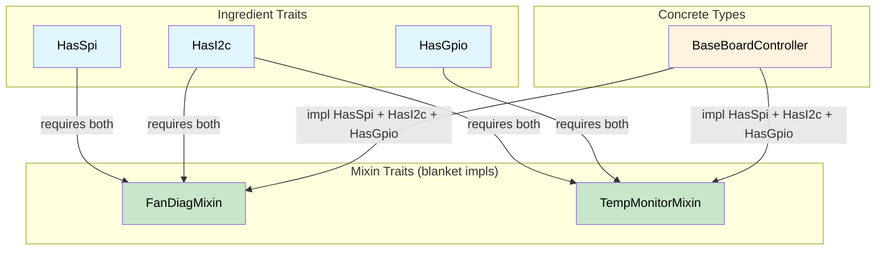

# Capability Mixins — Compile-Time Hardware Contracts 🟡

> **What you'll learn:** How ingredient traits (bus capabilities) combined with mixin traits and blanket impls eliminate diagnostic code duplication while guaranteeing every hardware dependency is satisfied at compile time.
>
> **Cross-references:** [ch04](ch04-capability-tokens-zero-cost-proof-of-aut.md) (capability tokens), [ch09](ch09-phantom-types-for-resource-tracking.md) (phantom types), [ch10](ch10-putting-it-all-together-a-complete-diagn.md) (integration)

## The Problem: Diagnostic Code Duplication

Server platforms share diagnostic patterns across subsystems. Fan diagnostics,
temperature monitoring, and power sequencing all follow similar workflows but
operate on different hardware buses. Without abstraction, you get copy-paste:

```c
// C — duplicated logic across subsystems
int run_fan_diag(spi_bus_t *spi, i2c_bus_t *i2c) {
    // ... 50 lines of SPI sensor read ...
    // ... 30 lines of I2C register check ...
    // ... 20 lines of threshold comparison (same as CPU diag) ...
}

int run_cpu_temp_diag(i2c_bus_t *i2c, gpio_t *gpio) {
    // ... 30 lines of I2C register check (same as fan diag) ...
    // ... 15 lines of GPIO alert check ...
    // ... 20 lines of threshold comparison (same as fan diag) ...
}
```

The threshold comparison logic is identical, but you can't extract it because the
bus types differ. With capability mixins, each hardware bus is an **ingredient
trait**, and diagnostic behaviors are automatically provided when the right
ingredients are present.

## Ingredient Traits (Hardware Capabilities)

Each bus or peripheral is an associated type on a trait. A diagnostic controller
declares which buses it has:

```rust,ignore
/// SPI bus capability.
pub trait HasSpi {
    type Spi: SpiBus;
    fn spi(&self) -> &Self::Spi;
}

/// I2C bus capability.
pub trait HasI2c {
    type I2c: I2cBus;
    fn i2c(&self) -> &Self::I2c;
}

/// GPIO pin access capability.
pub trait HasGpio {
    type Gpio: GpioController;
    fn gpio(&self) -> &Self::Gpio;
}

/// IPMI access capability.
pub trait HasIpmi {
    type Ipmi: IpmiClient;
    fn ipmi(&self) -> &Self::Ipmi;
}

// Bus trait definitions:
pub trait SpiBus {
    fn transfer(&self, data: &[u8]) -> Vec<u8>;
}

pub trait I2cBus {
    fn read_register(&self, addr: u8, reg: u8) -> u8;
    fn write_register(&self, addr: u8, reg: u8, value: u8);
}

pub trait GpioController {
    fn read_pin(&self, pin: u32) -> bool;
    fn set_pin(&self, pin: u32, value: bool);
}

pub trait IpmiClient {
    fn send_raw(&self, netfn: u8, cmd: u8, data: &[u8]) -> Vec<u8>;
}
```

## Mixin Traits (Diagnostic Behaviors)

A mixin provides behavior **automatically** to any type that has the required
capabilities:

```rust,ignore
# pub trait SpiBus { fn transfer(&self, data: &[u8]) -> Vec<u8>; }
# pub trait I2cBus {
#     fn read_register(&self, addr: u8, reg: u8) -> u8;
#     fn write_register(&self, addr: u8, reg: u8, value: u8);
# }
# pub trait GpioController { fn read_pin(&self, pin: u32) -> bool; }
# pub trait IpmiClient { fn send_raw(&self, netfn: u8, cmd: u8, data: &[u8]) -> Vec<u8>; }
# pub trait HasSpi { type Spi: SpiBus; fn spi(&self) -> &Self::Spi; }
# pub trait HasI2c { type I2c: I2cBus; fn i2c(&self) -> &Self::I2c; }
# pub trait HasGpio { type Gpio: GpioController; fn gpio(&self) -> &Self::Gpio; }
# pub trait HasIpmi { type Ipmi: IpmiClient; fn ipmi(&self) -> &Self::Ipmi; }

/// Fan diagnostic mixin — auto-implemented for anything with SPI + I2C.
pub trait FanDiagMixin: HasSpi + HasI2c {
    fn read_fan_speed(&self, fan_id: u8) -> u32 {
        // Read tachometer via SPI
        let cmd = [0x80 | fan_id, 0x00];
        let response = self.spi().transfer(&cmd);
        u32::from_be_bytes([0, 0, response[0], response[1]])
    }

    fn set_fan_pwm(&self, fan_id: u8, duty_percent: u8) {
        // Set PWM via I2C controller
        self.i2c().write_register(0x2E, fan_id, duty_percent);
    }

    fn run_fan_diagnostic(&self) -> bool {
        // Full diagnostic: read all fans, check thresholds
        for fan_id in 0..6 {
            let speed = self.read_fan_speed(fan_id);
            if speed < 1000 || speed > 20000 {
                println!("Fan {fan_id}: FAIL ({speed} RPM)");
                return false;
            }
        }
        true
    }
}

// Blanket implementation — ANY type with SPI + I2C gets FanDiagMixin for free
impl<T: HasSpi + HasI2c> FanDiagMixin for T {}

/// Temperature monitoring mixin — requires I2C + GPIO.
pub trait TempMonitorMixin: HasI2c + HasGpio {
    fn read_temperature(&self, sensor_addr: u8) -> f64 {
        let raw = self.i2c().read_register(sensor_addr, 0x00);
        raw as f64 * 0.5  // 0.5°C per LSB
    }

    fn check_thermal_alert(&self, alert_pin: u32) -> bool {
        self.gpio().read_pin(alert_pin)
    }

    fn run_thermal_diagnostic(&self) -> bool {
        for addr in [0x48, 0x49, 0x4A] {
            let temp = self.read_temperature(addr);
            if temp > 95.0 {
                println!("Sensor 0x{addr:02X}: CRITICAL ({temp}°C)");
                return false;
            }
            if self.check_thermal_alert(addr as u32) {
                println!("Sensor 0x{addr:02X}: ALERT pin asserted");
                return false;
            }
        }
        true
    }
}

impl<T: HasI2c + HasGpio> TempMonitorMixin for T {}

/// Power sequencing mixin — requires I2C + IPMI.
pub trait PowerSeqMixin: HasI2c + HasIpmi {
    fn read_voltage_rail(&self, rail: u8) -> f64 {
        let raw = self.i2c().read_register(0x40, rail);
        raw as f64 * 0.01  // 10mV per LSB
    }

    fn check_power_good(&self) -> bool {
        let resp = self.ipmi().send_raw(0x04, 0x2D, &[0x01]);
        !resp.is_empty() && resp[0] == 0x00
    }
}

impl<T: HasI2c + HasIpmi> PowerSeqMixin for T {}
```

## Concrete Controller — Mix and Match

A concrete diagnostic controller declares its capabilities, and **automatically
inherits** all matching mixins:

```rust,ignore
# pub trait SpiBus { fn transfer(&self, data: &[u8]) -> Vec<u8>; }
# pub trait I2cBus {
#     fn read_register(&self, addr: u8, reg: u8) -> u8;
#     fn write_register(&self, addr: u8, reg: u8, value: u8);
# }
# pub trait GpioController {
#     fn read_pin(&self, pin: u32) -> bool;
#     fn set_pin(&self, pin: u32, value: bool);
# }
# pub trait IpmiClient { fn send_raw(&self, netfn: u8, cmd: u8, data: &[u8]) -> Vec<u8>; }
# pub trait HasSpi { type Spi: SpiBus; fn spi(&self) -> &Self::Spi; }
# pub trait HasI2c { type I2c: I2cBus; fn i2c(&self) -> &Self::I2c; }
# pub trait HasGpio { type Gpio: GpioController; fn gpio(&self) -> &Self::Gpio; }
# pub trait HasIpmi { type Ipmi: IpmiClient; fn ipmi(&self) -> &Self::Ipmi; }
# pub trait FanDiagMixin: HasSpi + HasI2c {}
# impl<T: HasSpi + HasI2c> FanDiagMixin for T {}
# pub trait TempMonitorMixin: HasI2c + HasGpio {}
# impl<T: HasI2c + HasGpio> TempMonitorMixin for T {}
# pub trait PowerSeqMixin: HasI2c + HasIpmi {}
# impl<T: HasI2c + HasIpmi> PowerSeqMixin for T {}

// Concrete bus implementations (stubs for illustration)
pub struct LinuxSpi { bus: u8 }
impl SpiBus for LinuxSpi {
    fn transfer(&self, data: &[u8]) -> Vec<u8> { vec![0; data.len()] }
}

pub struct LinuxI2c { bus: u8 }
impl I2cBus for LinuxI2c {
    fn read_register(&self, _addr: u8, _reg: u8) -> u8 { 42 }
    fn write_register(&self, _addr: u8, _reg: u8, _value: u8) {}
}

pub struct LinuxGpio;
impl GpioController for LinuxGpio {
    fn read_pin(&self, _pin: u32) -> bool { false }
    fn set_pin(&self, _pin: u32, _value: bool) {}
}

pub struct IpmiToolClient;
impl IpmiClient for IpmiToolClient {
    fn send_raw(&self, _netfn: u8, _cmd: u8, _data: &[u8]) -> Vec<u8> { vec![0x00] }
}

/// BaseBoardController has ALL buses → gets ALL mixins.
pub struct BaseBoardController {
    spi: LinuxSpi,
    i2c: LinuxI2c,
    gpio: LinuxGpio,
    ipmi: IpmiToolClient,
}

impl HasSpi for BaseBoardController {
    type Spi = LinuxSpi;
    fn spi(&self) -> &LinuxSpi { &self.spi }
}

impl HasI2c for BaseBoardController {
    type I2c = LinuxI2c;
    fn i2c(&self) -> &LinuxI2c { &self.i2c }
}

impl HasGpio for BaseBoardController {
    type Gpio = LinuxGpio;
    fn gpio(&self) -> &LinuxGpio { &self.gpio }
}

impl HasIpmi for BaseBoardController {
    type Ipmi = IpmiToolClient;
    fn ipmi(&self) -> &IpmiToolClient { &self.ipmi }
}

// BaseBoardController now automatically has:
// - FanDiagMixin    (because it HasSpi + HasI2c)
// - TempMonitorMixin (because it HasI2c + HasGpio)
// - PowerSeqMixin   (because it HasI2c + HasIpmi)
// No manual implementation needed — blanket impls do it all.
```

## Correct-by-Construction Aspect

The mixin pattern is correct-by-construction because:

1. **You can't call `read_fan_speed()` without SPI** — the method only exists on
   types that implement `HasSpi + HasI2c`
2. **You can't forget a bus** — if you remove `HasSpi` from `BaseBoardController`,
   `FanDiagMixin` methods disappear at compile time
3. **Mock testing is automatic** — replace `LinuxSpi` with `MockSpi` and
   all mixin logic works with the mock
4. **New platforms just declare capabilities** — a GPU daughter card with only I2C
   gets `TempMonitorMixin` (if it also has GPIO) but not `FanDiagMixin` (no SPI)

### When to Use Capability Mixins

| Scenario | Use mixins? |
|----------|:------:|
| Cross-cutting diagnostic behaviors | ✅ Yes — prevent copy-paste |
| Multi-bus hardware controllers | ✅ Yes — declare capabilities, get behaviors |
| Platform-specific test harnesses | ✅ Yes — mock capabilities for testing |
| Single-bus simple peripherals | ⚠️ Overhead may not be worth it |
| Pure business logic (no hardware) | ❌ Simpler patterns suffice |

## Mixin Trait Architecture



## Exercise: Network Diagnostic Mixins

Design a mixin system for network diagnostics:
- Ingredient traits: `HasEthernet`, `HasIpmi`
- Mixin: `LinkHealthMixin` (requires `HasEthernet`) with `check_link_status(&self)`
- Mixin: `RemoteDiagMixin` (requires `HasEthernet + HasIpmi`) with `remote_health_check(&self)`
- Concrete type: `NicController` that implements both ingredients.

<details>
<summary>Solution</summary>

```rust,ignore
pub trait HasEthernet {
    fn eth_link_up(&self) -> bool;
}

pub trait HasIpmi {
    fn ipmi_ping(&self) -> bool;
}

pub trait LinkHealthMixin: HasEthernet {
    fn check_link_status(&self) -> &'static str {
        if self.eth_link_up() { "link: UP" } else { "link: DOWN" }
    }
}
impl<T: HasEthernet> LinkHealthMixin for T {}

pub trait RemoteDiagMixin: HasEthernet + HasIpmi {
    fn remote_health_check(&self) -> &'static str {
        if self.eth_link_up() && self.ipmi_ping() {
            "remote: HEALTHY"
        } else {
            "remote: DEGRADED"
        }
    }
}
impl<T: HasEthernet + HasIpmi> RemoteDiagMixin for T {}

pub struct NicController;
impl HasEthernet for NicController {
    fn eth_link_up(&self) -> bool { true }
}
impl HasIpmi for NicController {
    fn ipmi_ping(&self) -> bool { true }
}
// NicController automatically gets both mixin methods
```

</details>

## Key Takeaways

1. **Ingredient traits declare hardware capabilities** — `HasSpi`, `HasI2c`, `HasGpio` are associated-type traits.
2. **Mixin traits provide behaviour via blanket impls** — `impl<T: HasSpi + HasI2c> FanDiagMixin for T {}`.
3. **Adding a new platform = listing its capabilities** — the compiler provides all matching mixin methods.
4. **Removing a bus = compile errors everywhere it's used** — you can't forget to update downstream code.
5. **Mock testing is free** — swap `LinuxSpi` for `MockSpi`; all mixin logic works unchanged.

---

