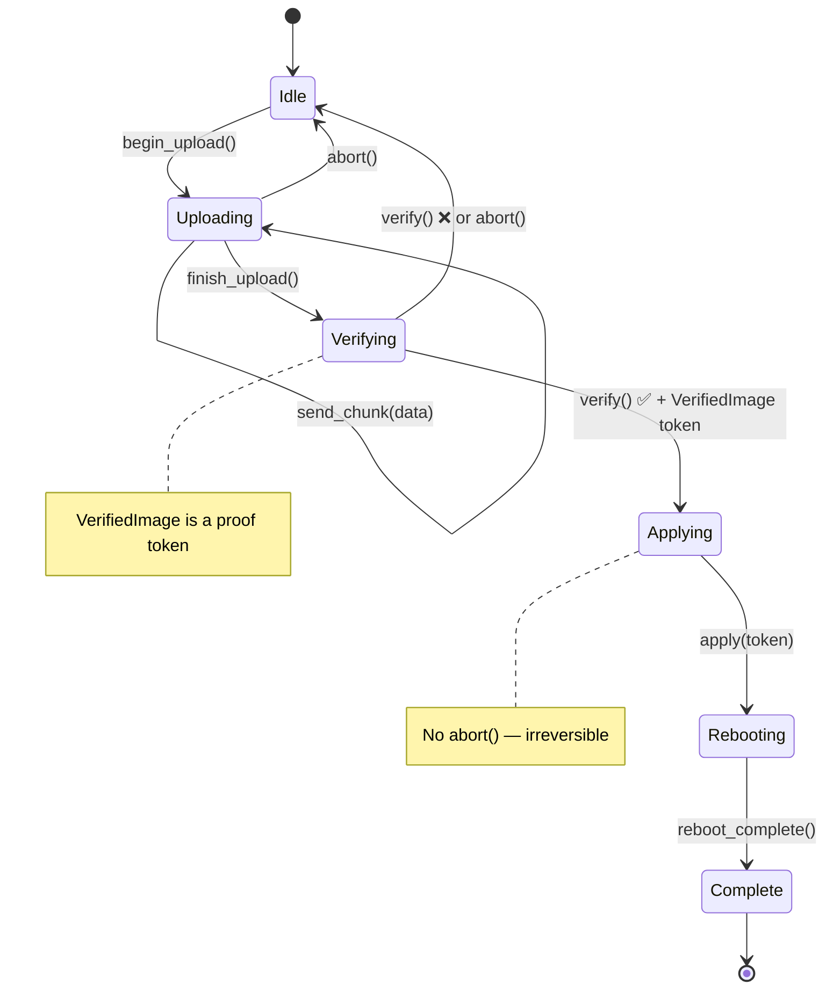

# Exercises 🟡

> **What you'll learn:** Hands-on practice applying correct-by-construction patterns to realistic hardware scenarios — NVMe admin commands, firmware update state machines, sensor pipelines, PCIe phantom types, multi-protocol health checks, and session-typed diagnostic protocols.
>
> **Cross-references:** [ch02](ch02-typed-command-interfaces-request-determi.md) (exercise 1), [ch05](ch05-protocol-state-machines-type-state-for-r.md) (exercise 2), [ch06](ch06-dimensional-analysis-making-the-compiler.md) (exercise 3), [ch09](ch09-phantom-types-for-resource-tracking.md) (exercise 4), [ch10](ch10-putting-it-all-together-a-complete-diagn.md) (exercise 5)

## Practice Problems

### Exercise 1: NVMe Admin Command (Typed Commands)

Design a typed command interface for NVMe admin commands:

- `Identify` → `IdentifyResponse` (model number, serial, firmware rev)
- `GetLogPage` → `SmartLog` (temperature, available spare, data units read)
- `GetFeature` → feature-specific response

Requirements:
1. The command type determines the response type
2. No runtime dispatch — static dispatch only
3. Add a `NamespaceId` newtype that prevents mixing namespace IDs with other `u32`s

**Hint:** Follow the `IpmiCmd` trait pattern from ch02, but use NVMe-specific constants.

<details>
<summary>Sample Solution (Exercise 1)</summary>

```rust,ignore
use std::io;

#[derive(Debug, Clone, Copy, PartialEq, Eq, PartialOrd, Ord, Hash)]
pub struct NamespaceId(pub u32);

#[derive(Debug, Clone, PartialEq)]
pub struct IdentifyResponse {
    pub model: String,
    pub serial: String,
    pub firmware_rev: String,
}

#[derive(Debug, Clone, PartialEq)]
pub struct SmartLog {
    pub temperature_kelvin: u16,
    pub available_spare_pct: u8,
    pub data_units_read: u64,
}

#[derive(Debug, Clone, PartialEq)]
pub struct ArbitrationFeature {
    pub high_priority_weight: u8,
    pub medium_priority_weight: u8,
    pub low_priority_weight: u8,
}

/// The core pattern: associated type pins each command's response.
pub trait NvmeAdminCmd {
    type Response;
    fn opcode(&self) -> u8;
    fn nsid(&self) -> Option<NamespaceId>;
    fn parse_response(&self, raw: &[u8]) -> io::Result<Self::Response>;
}

pub struct Identify { pub nsid: NamespaceId }

impl NvmeAdminCmd for Identify {
    type Response = IdentifyResponse;
    fn opcode(&self) -> u8 { 0x06 }
    fn nsid(&self) -> Option<NamespaceId> { Some(self.nsid) }
    fn parse_response(&self, raw: &[u8]) -> io::Result<IdentifyResponse> {
        if raw.len() < 12 {
            return Err(io::Error::new(io::ErrorKind::InvalidData, "too short"));
        }
        Ok(IdentifyResponse {
            model: String::from_utf8_lossy(&raw[0..4]).trim().to_string(),
            serial: String::from_utf8_lossy(&raw[4..8]).trim().to_string(),
            firmware_rev: String::from_utf8_lossy(&raw[8..12]).trim().to_string(),
        })
    }
}

pub struct GetLogPage { pub log_id: u8 }

impl NvmeAdminCmd for GetLogPage {
    type Response = SmartLog;
    fn opcode(&self) -> u8 { 0x02 }
    fn nsid(&self) -> Option<NamespaceId> { None }
    fn parse_response(&self, raw: &[u8]) -> io::Result<SmartLog> {
        if raw.len() < 11 {
            return Err(io::Error::new(io::ErrorKind::InvalidData, "too short"));
        }
        Ok(SmartLog {
            temperature_kelvin: u16::from_le_bytes([raw[0], raw[1]]),
            available_spare_pct: raw[2],
            data_units_read: u64::from_le_bytes(raw[3..11].try_into().unwrap()),
        })
    }
}

pub struct GetFeature { pub feature_id: u8 }

impl NvmeAdminCmd for GetFeature {
    type Response = ArbitrationFeature;
    fn opcode(&self) -> u8 { 0x0A }
    fn nsid(&self) -> Option<NamespaceId> { None }
    fn parse_response(&self, raw: &[u8]) -> io::Result<ArbitrationFeature> {
        if raw.len() < 3 {
            return Err(io::Error::new(io::ErrorKind::InvalidData, "too short"));
        }
        Ok(ArbitrationFeature {
            high_priority_weight: raw[0],
            medium_priority_weight: raw[1],
            low_priority_weight: raw[2],
        })
    }
}

/// Static dispatch — the compiler monomorphises per command type.
pub struct NvmeController;

impl NvmeController {
    pub fn execute<C: NvmeAdminCmd>(&self, cmd: &C) -> io::Result<C::Response> {
        // Build SQE from cmd.opcode()/cmd.nsid(),
        // submit to SQ, wait for CQ, then:
        let raw = self.submit_and_read(cmd.opcode())?;
        cmd.parse_response(&raw)
    }

    fn submit_and_read(&self, _opcode: u8) -> io::Result<Vec<u8>> {
        // Real implementation talks to /dev/nvme0
        Ok(vec![0; 512])
    }
}
```

**Key points:**
- `NamespaceId(u32)` prevents mixing namespace IDs with arbitrary `u32` values.
- `NvmeAdminCmd::Response` is the "type index" — `execute()` returns exactly `C::Response`.
- Fully static dispatch: no `Box<dyn …>`, no runtime downcasting.

</details>

### Exercise 2: Firmware Update State Machine (Type-State)

Model a BMC firmware update lifecycle:



Requirements:
1. Each state is a distinct type
2. Upload can only begin from Idle
3. Verification requires upload to be complete
4. Apply can only happen after successful verification — take a `VerifiedImage` proof token
5. Reboot is the only option after applying
6. Add an `abort()` method available in Uploading and Verifying (but not Applying — too late)

**Hint:** Combine type-state (ch05) with capability tokens (ch04).

<details>
<summary>Sample Solution (Exercise 2)</summary>

```rust,ignore
// --- State types ---
// Design choice: here we store state inline (`_state: S`) rather than using
// `PhantomData<S>` (ch05's approach). This lets states carry data —
// e.g., `Uploading { bytes_sent: usize }` tracks progress. Use `PhantomData`
// when states are pure markers (zero-sized); use inline storage when
// states carry meaningful runtime data.
pub struct Idle;
pub struct Uploading { bytes_sent: usize }  // not ZST — carries progress data
pub struct Verifying;
pub struct Applying;
pub struct Rebooting;
pub struct Complete;

/// Proof token: only constructed inside verify().
pub struct VerifiedImage { _private: () }

pub struct FwUpdate<S> {
    bmc_addr: String,
    _state: S,
}

impl FwUpdate<Idle> {
    pub fn new(bmc_addr: &str) -> Self {
        FwUpdate { bmc_addr: bmc_addr.to_string(), _state: Idle }
    }
    pub fn begin_upload(self) -> FwUpdate<Uploading> {
        FwUpdate { bmc_addr: self.bmc_addr, _state: Uploading { bytes_sent: 0 } }
    }
}

impl FwUpdate<Uploading> {
    pub fn send_chunk(mut self, chunk: &[u8]) -> Self {
        self._state.bytes_sent += chunk.len();
        self
    }
    pub fn finish_upload(self) -> FwUpdate<Verifying> {
        FwUpdate { bmc_addr: self.bmc_addr, _state: Verifying }
    }
    /// Abort available during upload — returns to Idle.
    pub fn abort(self) -> FwUpdate<Idle> {
        FwUpdate { bmc_addr: self.bmc_addr, _state: Idle }
    }
}

impl FwUpdate<Verifying> {
    /// On success, returns the next state AND a VerifiedImage proof token.
    pub fn verify(self) -> Result<(FwUpdate<Applying>, VerifiedImage), FwUpdate<Idle>> {
        // Real: check CRC, signature, compatibility
        let token = VerifiedImage { _private: () };
        Ok((
            FwUpdate { bmc_addr: self.bmc_addr, _state: Applying },
            token,
        ))
    }
    /// Abort available during verification.
    pub fn abort(self) -> FwUpdate<Idle> {
        FwUpdate { bmc_addr: self.bmc_addr, _state: Idle }
    }
}

impl FwUpdate<Applying> {
    /// Consumes the VerifiedImage proof — can't apply without verification.
    /// Note: NO abort() method here — once flashing starts, it's too dangerous.
    pub fn apply(self, _proof: VerifiedImage) -> FwUpdate<Rebooting> {
        FwUpdate { bmc_addr: self.bmc_addr, _state: Rebooting }
    }
}

impl FwUpdate<Rebooting> {
    pub fn wait_for_reboot(self) -> FwUpdate<Complete> {
        FwUpdate { bmc_addr: self.bmc_addr, _state: Complete }
    }
}

impl FwUpdate<Complete> {
    pub fn version(&self) -> &str { "2.1.0" }
}

// Usage:
// let fw = FwUpdate::new("192.168.1.100")
//     .begin_upload()
//     .send_chunk(b"image_data")
//     .finish_upload();
// let (fw, proof) = fw.verify().map_err(|_| "verify failed")?;
// let fw = fw.apply(proof).wait_for_reboot();
// println!("New version: {}", fw.version());
```

**Key points:**
- `abort()` exists only on `FwUpdate<Uploading>` and `FwUpdate<Verifying>` — calling
  it on `FwUpdate<Applying>` is a **compile error**, not a runtime check.
- `VerifiedImage` has a private field, so only `verify()` can create one.
- `apply()` consumes the proof token — you can't skip verification.

</details>

### Exercise 3: Sensor Reading Pipeline (Dimensional Analysis)

Build a complete sensor pipeline:

1. Define newtypes: `RawAdc`, `Celsius`, `Fahrenheit`, `Volts`, `Millivolts`, `Watts`
2. Implement `From<Celsius> for Fahrenheit` and vice versa
3. Create `impl Mul<Volts, Output=Watts> for Amperes` (P = V × I)
4. Build a `Threshold<T>` generic checker
5. Write a pipeline: ADC → calibration → threshold check → result

The compiler should reject: comparing `Celsius` to `Volts`, adding `Watts` to `Rpm`,
passing `Millivolts` where `Volts` is expected.

<details>
<summary>Sample Solution (Exercise 3)</summary>

```rust,ignore
use std::ops::{Add, Sub, Mul};

#[derive(Debug, Clone, Copy, PartialEq, PartialOrd)]
pub struct RawAdc(pub u16);

#[derive(Debug, Clone, Copy, PartialEq, PartialOrd)]
pub struct Celsius(pub f64);

#[derive(Debug, Clone, Copy, PartialEq, PartialOrd)]
pub struct Fahrenheit(pub f64);

#[derive(Debug, Clone, Copy, PartialEq, PartialOrd)]
pub struct Volts(pub f64);

#[derive(Debug, Clone, Copy, PartialEq, PartialOrd)]
pub struct Millivolts(pub f64);

#[derive(Debug, Clone, Copy, PartialEq, PartialOrd)]
pub struct Amperes(pub f64);

#[derive(Debug, Clone, Copy, PartialEq, PartialOrd)]
pub struct Watts(pub f64);

// --- Safe conversions ---
impl From<Celsius> for Fahrenheit {
    fn from(c: Celsius) -> Self { Fahrenheit(c.0 * 9.0 / 5.0 + 32.0) }
}
impl From<Fahrenheit> for Celsius {
    fn from(f: Fahrenheit) -> Self { Celsius((f.0 - 32.0) * 5.0 / 9.0) }
}
impl From<Millivolts> for Volts {
    fn from(mv: Millivolts) -> Self { Volts(mv.0 / 1000.0) }
}
impl From<Volts> for Millivolts {
    fn from(v: Volts) -> Self { Millivolts(v.0 * 1000.0) }
}

// --- Arithmetic on same-unit types ---
// NOTE: Adding absolute temperatures (25°C + 30°C) is physically
// questionable — see ch06's discussion of ΔT newtypes for a more
// rigorous approach.  Here we keep it simple for the exercise.
impl Add for Celsius {
    type Output = Celsius;
    fn add(self, rhs: Self) -> Celsius { Celsius(self.0 + rhs.0) }
}
impl Sub for Celsius {
    type Output = Celsius;
    fn sub(self, rhs: Self) -> Celsius { Celsius(self.0 - rhs.0) }
}

// P = V × I  (cross-unit multiplication)
impl Mul<Amperes> for Volts {
    type Output = Watts;
    fn mul(self, rhs: Amperes) -> Watts { Watts(self.0 * rhs.0) }
}

// --- Generic threshold checker ---
// Exercise 3 extends ch06's Threshold with a generic ThresholdResult<T>
// that carries the triggering reading — an evolution of ch06's simpler
// ThresholdResult { Normal, Warning, Critical } enum.
pub enum ThresholdResult<T> {
    Normal(T),
    Warning(T),
    Critical(T),
}

pub struct Threshold<T> {
    pub warning: T,
    pub critical: T,
}

// Generic impl — works for any unit type that supports PartialOrd.
impl<T: PartialOrd + Copy> Threshold<T> {
    pub fn check(&self, reading: T) -> ThresholdResult<T> {
        if reading >= self.critical {
            ThresholdResult::Critical(reading)
        } else if reading >= self.warning {
            ThresholdResult::Warning(reading)
        } else {
            ThresholdResult::Normal(reading)
        }
    }
}
// Now `Threshold<Rpm>`, `Threshold<Volts>`, etc. all work automatically.

// --- Pipeline: ADC → calibration → threshold → result ---
pub struct CalibrationParams {
    pub scale: f64,  // ADC counts per °C
    pub offset: f64, // °C at ADC 0
}

pub fn calibrate(raw: RawAdc, params: &CalibrationParams) -> Celsius {
    Celsius(raw.0 as f64 / params.scale + params.offset)
}

pub fn sensor_pipeline(
    raw: RawAdc,
    params: &CalibrationParams,
    threshold: &Threshold<Celsius>,
) -> ThresholdResult<Celsius> {
    let temp = calibrate(raw, params);
    threshold.check(temp)
}

// Compile-time safety — these would NOT compile:
// let _ = Celsius(25.0) + Volts(12.0);   // ERROR: mismatched types
// let _: Millivolts = Volts(1.0);         // ERROR: no implicit coercion
// let _ = Watts(100.0) + Rpm(3000);       // ERROR: mismatched types
```

**Key points:**
- Each physical unit is a distinct type — no accidental mixing.
- `Mul<Amperes> for Volts` yields `Watts`, encoding P = V × I in the type system.
- Explicit `From` conversions for related units (mV ↔ V, °C ↔ °F).
- `Threshold<Celsius>` only accepts `Celsius` — can't accidentally threshold-check RPM.

</details>

### Exercise 4: PCIe Capability Walk (Phantom Types + Validated Boundary)

Model the PCIe capability linked list:

1. `RawCapability` — unvalidated bytes from config space
2. `ValidCapability` — parsed and validated (via TryFrom)
3. Each capability type (MSI, MSI-X, PCIe Express, Power Management) has its own
   phantom-typed register layout
4. Walking the list returns an iterator of `ValidCapability` values

**Hint:** Combine validated boundaries (ch07) with phantom types (ch09).

<details>
<summary>Sample Solution (Exercise 4)</summary>

```rust,ignore
use std::marker::PhantomData;

// --- Phantom markers for capability types ---
pub struct Msi;
pub struct MsiX;
pub struct PciExpress;
pub struct PowerMgmt;

// PCI capability IDs from the spec
const CAP_ID_PM:   u8 = 0x01;
const CAP_ID_MSI:  u8 = 0x05;
const CAP_ID_PCIE: u8 = 0x10;
const CAP_ID_MSIX: u8 = 0x11;

/// Unvalidated bytes — may be garbage.
#[derive(Debug)]
pub struct RawCapability {
    pub id: u8,
    pub next_ptr: u8,
    pub data: Vec<u8>,
}

/// Validated and type-tagged capability.
#[derive(Debug)]
pub struct ValidCapability<Kind> {
    id: u8,
    next_ptr: u8,
    data: Vec<u8>,
    _kind: PhantomData<Kind>,
}

// --- TryFrom: parse-don't-validate boundary ---
impl TryFrom<RawCapability> for ValidCapability<PowerMgmt> {
    type Error = &'static str;
    fn try_from(raw: RawCapability) -> Result<Self, Self::Error> {
        if raw.id != CAP_ID_PM { return Err("not a PM capability"); }
        if raw.data.len() < 2 { return Err("PM data too short"); }
        Ok(ValidCapability {
            id: raw.id, next_ptr: raw.next_ptr,
            data: raw.data, _kind: PhantomData,
        })
    }
}

impl TryFrom<RawCapability> for ValidCapability<Msi> {
    type Error = &'static str;
    fn try_from(raw: RawCapability) -> Result<Self, Self::Error> {
        if raw.id != CAP_ID_MSI { return Err("not an MSI capability"); }
        if raw.data.len() < 6 { return Err("MSI data too short"); }
        Ok(ValidCapability {
            id: raw.id, next_ptr: raw.next_ptr,
            data: raw.data, _kind: PhantomData,
        })
    }
}

// (Similar TryFrom impls for MsiX, PciExpress — omitted for brevity)

// --- Type-safe accessors: only available on the correct capability ---
impl ValidCapability<PowerMgmt> {
    pub fn pm_control(&self) -> u16 {
        u16::from_le_bytes([self.data[0], self.data[1]])
    }
}

impl ValidCapability<Msi> {
    pub fn message_control(&self) -> u16 {
        u16::from_le_bytes([self.data[0], self.data[1]])
    }
    pub fn vectors_requested(&self) -> u32 {
        1 << ((self.message_control() >> 1) & 0x07)
    }
}

impl ValidCapability<MsiX> {
    pub fn table_size(&self) -> u16 {
        (u16::from_le_bytes([self.data[0], self.data[1]]) & 0x07FF) + 1
    }
}

// --- Capability walker: iterates the linked list ---
pub struct CapabilityWalker<'a> {
    config_space: &'a [u8],
    next_ptr: u8,
}

impl<'a> CapabilityWalker<'a> {
    pub fn new(config_space: &'a [u8]) -> Self {
        // Capability pointer lives at offset 0x34 in PCI config space
        let first_ptr = if config_space.len() > 0x34 {
            config_space[0x34]
        } else { 0 };
        CapabilityWalker { config_space, next_ptr: first_ptr }
    }
}

impl<'a> Iterator for CapabilityWalker<'a> {
    type Item = RawCapability;
    fn next(&mut self) -> Option<RawCapability> {
        if self.next_ptr == 0 { return None; }
        let off = self.next_ptr as usize;
        if off + 2 > self.config_space.len() { return None; }
        let id = self.config_space[off];
        let next = self.config_space[off + 1];
        let end = if next > 0 { next as usize } else {
            (off + 16).min(self.config_space.len())
        };
        let data = self.config_space[off + 2..end].to_vec();
        self.next_ptr = next;
        Some(RawCapability { id, next_ptr: next, data })
    }
}

// Usage:
// for raw_cap in CapabilityWalker::new(&config_space) {
//     if let Ok(pm) = ValidCapability::<PowerMgmt>::try_from(raw_cap) {
//         println!("PM control: 0x{:04X}", pm.pm_control());
//     }
// }
```

**Key points:**
- `RawCapability` → `ValidCapability<Kind>` is the parse-don't-validate boundary.
- `pm_control()` only exists on `ValidCapability<PowerMgmt>` — calling it on an MSI
  capability is a compile error.
- The `CapabilityWalker` iterator yields raw capabilities; the caller validates
  the ones they care about with `TryFrom`.

</details>

### Exercise 5: Multi-Protocol Health Check (Capability Mixins)

Create a health-check framework:

1. Define ingredient traits: `HasIpmi`, `HasRedfish`, `HasNvmeCli`, `HasGpio`
2. Create mixin traits:
   - `ThermalHealthMixin` (requires HasIpmi + HasGpio) — reads temps, checks alerts
   - `StorageHealthMixin` (requires HasNvmeCli) — SMART data checks
   - `BmcHealthMixin` (requires HasIpmi + HasRedfish) — cross-validates BMC data
3. Build a `FullPlatformController` that implements all ingredient traits
4. Build a `StorageOnlyController` that only implements `HasNvmeCli`
5. Verify that `StorageOnlyController` gets `StorageHealthMixin` but NOT the others

<details>
<summary>Sample Solution (Exercise 5)</summary>

```rust,ignore
// --- Ingredient traits ---
pub trait HasIpmi {
    fn ipmi_read_sensor(&self, id: u8) -> f64;
}
pub trait HasRedfish {
    fn redfish_get(&self, path: &str) -> String;
}
pub trait HasNvmeCli {
    fn nvme_smart_log(&self, dev: &str) -> SmartData;
}
pub trait HasGpio {
    fn gpio_read_alert(&self, pin: u8) -> bool;
}

pub struct SmartData {
    pub temperature_kelvin: u16,
    pub spare_pct: u8,
}

// --- Mixin traits with blanket impls ---
pub trait ThermalHealthMixin: HasIpmi + HasGpio {
    fn thermal_check(&self) -> ThermalStatus {
        let temp = self.ipmi_read_sensor(0x01);
        let alert = self.gpio_read_alert(12);
        ThermalStatus { temperature: temp, alert_active: alert }
    }
}
impl<T: HasIpmi + HasGpio> ThermalHealthMixin for T {}

pub trait StorageHealthMixin: HasNvmeCli {
    fn storage_check(&self) -> StorageStatus {
        let smart = self.nvme_smart_log("/dev/nvme0");
        StorageStatus {
            temperature_ok: smart.temperature_kelvin < 343, // 70 °C
            spare_ok: smart.spare_pct > 10,
        }
    }
}
impl<T: HasNvmeCli> StorageHealthMixin for T {}

pub trait BmcHealthMixin: HasIpmi + HasRedfish {
    fn bmc_health(&self) -> BmcStatus {
        let ipmi_temp = self.ipmi_read_sensor(0x01);
        let rf_temp = self.redfish_get("/Thermal/Temperatures/0");
        BmcStatus { ipmi_temp, redfish_temp: rf_temp, consistent: true }
    }
}
impl<T: HasIpmi + HasRedfish> BmcHealthMixin for T {}

pub struct ThermalStatus { pub temperature: f64, pub alert_active: bool }
pub struct StorageStatus { pub temperature_ok: bool, pub spare_ok: bool }
pub struct BmcStatus { pub ipmi_temp: f64, pub redfish_temp: String, pub consistent: bool }

// --- Full platform: all ingredients → all three mixins for free ---
pub struct FullPlatformController;

impl HasIpmi for FullPlatformController {
    fn ipmi_read_sensor(&self, _id: u8) -> f64 { 42.0 }
}
impl HasRedfish for FullPlatformController {
    fn redfish_get(&self, _path: &str) -> String { "42.0".into() }
}
impl HasNvmeCli for FullPlatformController {
    fn nvme_smart_log(&self, _dev: &str) -> SmartData {
        SmartData { temperature_kelvin: 310, spare_pct: 95 }
    }
}
impl HasGpio for FullPlatformController {
    fn gpio_read_alert(&self, _pin: u8) -> bool { false }
}

// --- Storage-only: only HasNvmeCli → only StorageHealthMixin ---
pub struct StorageOnlyController;

impl HasNvmeCli for StorageOnlyController {
    fn nvme_smart_log(&self, _dev: &str) -> SmartData {
        SmartData { temperature_kelvin: 315, spare_pct: 80 }
    }
}

// StorageOnlyController automatically gets storage_check().
// Calling thermal_check() or bmc_health() on it is a COMPILE ERROR.
```

**Key points:**
- Blanket `impl<T: HasIpmi + HasGpio> ThermalHealthMixin for T {}` — any type that
  implements both ingredients automatically gets the mixin.
- `StorageOnlyController` only implements `HasNvmeCli`, so the compiler grants it
  `StorageHealthMixin` but rejects `thermal_check()` and `bmc_health()` — zero
  runtime checks needed.
- Adding a new mixin (e.g., `NetworkHealthMixin: HasRedfish + HasGpio`) is one trait
  + one blanket impl — existing controllers pick it up automatically if they qualify.

</details>

### Exercise 6: Session-Typed Diagnostic Protocol (Single-Use + Type-State)

Design a diagnostic session with single-use test execution tokens:

1. `DiagSession` starts in `Setup` state
2. Transition to `Running` state — issues `N` execution tokens (one per test case)
3. Each `TestToken` is consumed when the test runs — prevents running the same test twice
4. After all tokens are consumed, transition to `Complete` state
5. Generate a report (only in `Complete` state)

**Advanced:** Use a const generic `N` to track how many tests remain at the type level.

<details>
<summary>Sample Solution (Exercise 6)</summary>

```rust,ignore
// --- State types ---
pub struct Setup;
pub struct Running;
pub struct Complete;

/// Single-use test token. NOT Clone, NOT Copy — consumed on use.
pub struct TestToken {
    test_name: String,
}

#[derive(Debug)]
pub struct TestResult {
    pub test_name: String,
    pub passed: bool,
}

pub struct DiagSession<S> {
    name: String,
    results: Vec<TestResult>,
    _state: S,
}

impl DiagSession<Setup> {
    pub fn new(name: &str) -> Self {
        DiagSession {
            name: name.to_string(),
            results: Vec::new(),
            _state: Setup,
        }
    }

    /// Transition to Running — issues one token per test case.
    pub fn start(self, test_names: &[&str]) -> (DiagSession<Running>, Vec<TestToken>) {
        let tokens = test_names.iter()
            .map(|n| TestToken { test_name: n.to_string() })
            .collect();
        (
            DiagSession {
                name: self.name,
                results: Vec::new(),
                _state: Running,
            },
            tokens,
        )
    }
}

impl DiagSession<Running> {
    /// Consume a token to run one test. The move prevents double-running.
    pub fn run_test(mut self, token: TestToken) -> Self {
        let passed = true; // real code runs actual diagnostics here
        self.results.push(TestResult {
            test_name: token.test_name,
            passed,
        });
        self
    }

    /// Transition to Complete.
    ///
    /// **Note:** This solution does NOT enforce that all tokens have been
    /// consumed — `finish()` can be called with tokens still outstanding.
    /// The tokens will simply be dropped (they're not `#[must_use]`).
    /// For full compile-time enforcement, use the const-generic variant
    /// described in the "Advanced" note below, where `finish()` is only
    /// available on `DiagSession<Running, 0>`.
    pub fn finish(self) -> DiagSession<Complete> {
        DiagSession {
            name: self.name,
            results: self.results,
            _state: Complete,
        }
    }
}

impl DiagSession<Complete> {
    /// Report is ONLY available in Complete state.
    pub fn report(&self) -> String {
        let total = self.results.len();
        let passed = self.results.iter().filter(|r| r.passed).count();
        format!("{}: {}/{} passed", self.name, passed, total)
    }
}

// Usage:
// let session = DiagSession::new("GPU stress");
// let (mut session, tokens) = session.start(&["vram", "compute", "thermal"]);
// for token in tokens {
//     session = session.run_test(token);
// }
// let session = session.finish();
// println!("{}", session.report());  // "GPU stress: 3/3 passed"
//
// // These would NOT compile:
// // session.run_test(used_token);  →  ERROR: use of moved value
// // running_session.report();      →  ERROR: no method `report` on DiagSession<Running>
```

**Key points:**
- `TestToken` is not `Clone` or `Copy` — consuming it via `run_test(token)` moves it,
  so re-running the same test is a compile error.
- `report()` only exists on `DiagSession<Complete>` — calling it mid-run is impossible.
- The **Advanced** variant would use `DiagSession<Running, N>` with const generics
  where `run_test` returns `DiagSession<Running, {N-1}>` and `finish` is only
  available on `DiagSession<Running, 0>` — that ensures *all* tokens are consumed
  before finishing.

</details>

## Key Takeaways

1. **Practice with realistic protocols** — NVMe, firmware update, sensor pipelines, PCIe are all real-world targets for these patterns.
2. **Each exercise maps to a core chapter** — use the cross-references to review the pattern before attempting.
3. **Solutions use expandable details** — try each exercise before revealing the solution.
4. **Compose patterns in exercise 5** — multi-protocol health checks combine typed commands, dimensional types, and validated boundaries.
5. **Session types (exercise 6) are the frontier** — they enforce message ordering across channels, extending type-state to distributed systems.

---

