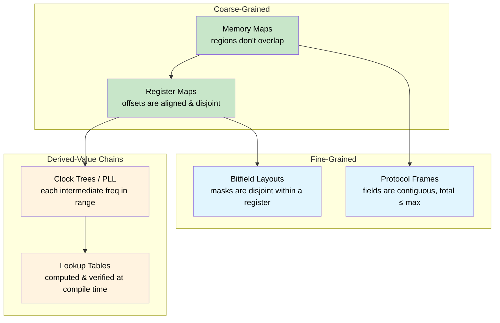
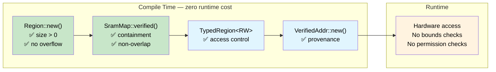

# Const Fn — Compile-Time Correctness Proofs 🟠

> **What you'll learn:** How `const fn` and `assert!` turn the compiler into a proof engine — verifying SRAM memory maps, register layouts, protocol frames, bitfield masks, clock trees, and lookup tables at compile time with zero runtime cost.
>
> **Cross-references:** [ch04](ch04-capability-tokens-zero-cost-proof-of-aut.md) (capability tokens), [ch06](ch06-dimensional-analysis-making-the-compiler.md) (dimensional analysis), [ch09](ch09-phantom-types-for-resource-tracking.md) (phantom types)

## The Problem: Memory Maps That Lie

In embedded and systems programming, memory maps are the foundation of everything — they define where bootloaders, firmware, data sections, and stacks live. Get a boundary wrong, and two subsystems silently corrupt each other. In C, these maps are typically `#define` constants with no structural relationship:

```c
/* STM32F4 SRAM layout — 256 KB at 0x20000000 */
#define SRAM_BASE       0x20000000
#define SRAM_SIZE       (256 * 1024)

#define BOOT_BASE       0x20000000
#define BOOT_SIZE       (16 * 1024)

#define FW_BASE         0x20004000
#define FW_SIZE         (128 * 1024)

#define DATA_BASE       0x20024000
#define DATA_SIZE       (80 * 1024)     /* Someone bumped this from 64K to 80K */

#define STACK_BASE      0x20038000
#define STACK_SIZE      (48 * 1024)     /* 0x20038000 + 48K = 0x20044000 — past SRAM end! */
```

The bug: `16 + 128 + 80 + 48 = 272 KB`, but SRAM is only 256 KB. The stack extends 16 KB past the end of physical memory. No compiler warning, no linker error, no runtime check — just silent corruption when the stack grows into unmapped space.

**Every failure mode is discovered after deployment** — potentially as a mysterious crash that only happens under heavy stack usage, weeks after the data section was resized.

## Const Fn: Turning the Compiler into a Proof Engine

Rust's `const fn` functions can run at compile time. When a `const fn` panics during compile-time evaluation, the panic becomes a **compile error**. Combined with `assert!`, this turns the compiler into a theorem prover for your invariants:

```rust
pub const fn checked_add(a: u32, b: u32) -> u32 {
    let sum = a as u64 + b as u64;
    assert!(sum <= u32::MAX as u64, "overflow");
    sum as u32
}

// ✅ Compiles — 100 + 200 fits in u32
const X: u32 = checked_add(100, 200);

// ❌ Compile error: "overflow"
// const Y: u32 = checked_add(u32::MAX, 1);

fn main() {
    println!("{X}");
}
```

> **The key insight:** `const fn` + `assert!` = a proof obligation. Each assertion is a theorem that the compiler must verify. If the proof fails, the program does not compile. No test suite needed, no code review catch — the compiler itself is the auditor.

## Building a Verified SRAM Memory Map

### The Region Type

A `Region` represents a contiguous block of memory. Its constructor is a `const fn` that enforces basic validity:

```rust
#[derive(Debug, Clone, Copy)]
pub struct Region {
    pub base: u32,
    pub size: u32,
}

impl Region {
    /// Create a region. Panics at compile time if invariants fail.
    pub const fn new(base: u32, size: u32) -> Self {
        assert!(size > 0, "region size must be non-zero");
        assert!(
            base as u64 + size as u64 <= u32::MAX as u64,
            "region overflows 32-bit address space"
        );
        Self { base, size }
    }

    pub const fn end(&self) -> u32 {
        self.base + self.size
    }

    /// True if `inner` fits entirely within `self`.
    pub const fn contains(&self, inner: &Region) -> bool {
        inner.base >= self.base && inner.end() <= self.end()
    }

    /// True if two regions share any addresses.
    pub const fn overlaps(&self, other: &Region) -> bool {
        self.base < other.end() && other.base < self.end()
    }

    /// True if `addr` falls within this region.
    pub const fn contains_addr(&self, addr: u32) -> bool {
        addr >= self.base && addr < self.end()
    }
}

// Every Region is born valid — you cannot construct an invalid one
const R: Region = Region::new(0x2000_0000, 1024);

fn main() {
    println!("Region: {:#010X}..{:#010X}", R.base, R.end());
}
```

### The Verified Memory Map

Now we compose regions into a full SRAM map. The constructor proves six overlap-freedom invariants and four containment invariants — all at compile time:

```rust
# #[derive(Debug, Clone, Copy)]
# pub struct Region { pub base: u32, pub size: u32 }
# impl Region {
#     pub const fn new(base: u32, size: u32) -> Self {
#         assert!(size > 0, "region size must be non-zero");
#         assert!(base as u64 + size as u64 <= u32::MAX as u64, "overflow");
#         Self { base, size }
#     }
#     pub const fn end(&self) -> u32 { self.base + self.size }
#     pub const fn contains(&self, inner: &Region) -> bool {
#         inner.base >= self.base && inner.end() <= self.end()
#     }
#     pub const fn overlaps(&self, other: &Region) -> bool {
#         self.base < other.end() && other.base < self.end()
#     }
# }
pub struct SramMap {
    pub total:      Region,
    pub bootloader: Region,
    pub firmware:   Region,
    pub data:       Region,
    pub stack:      Region,
}

impl SramMap {
    pub const fn verified(
        total: Region,
        bootloader: Region,
        firmware: Region,
        data: Region,
        stack: Region,
    ) -> Self {
        // ── Containment: every sub-region fits within total SRAM ──
        assert!(total.contains(&bootloader), "bootloader exceeds SRAM");
        assert!(total.contains(&firmware),   "firmware exceeds SRAM");
        assert!(total.contains(&data),       "data section exceeds SRAM");
        assert!(total.contains(&stack),      "stack exceeds SRAM");

        // ── Overlap freedom: no pair of sub-regions shares an address ──
        assert!(!bootloader.overlaps(&firmware), "bootloader/firmware overlap");
        assert!(!bootloader.overlaps(&data),     "bootloader/data overlap");
        assert!(!bootloader.overlaps(&stack),    "bootloader/stack overlap");
        assert!(!firmware.overlaps(&data),       "firmware/data overlap");
        assert!(!firmware.overlaps(&stack),      "firmware/stack overlap");
        assert!(!data.overlaps(&stack),          "data/stack overlap");

        Self { total, bootloader, firmware, data, stack }
    }
}

// ✅ All 10 invariants verified at compile time — zero runtime cost
const SRAM: SramMap = SramMap::verified(
    Region::new(0x2000_0000, 256 * 1024),   // 256 KB total SRAM
    Region::new(0x2000_0000,  16 * 1024),   // bootloader: 16 KB
    Region::new(0x2000_4000, 128 * 1024),   // firmware:  128 KB
    Region::new(0x2002_4000,  64 * 1024),   // data:       64 KB
    Region::new(0x2003_4000,  48 * 1024),   // stack:      48 KB
);

fn main() {
    println!("SRAM:  {:#010X} — {} KB", SRAM.total.base, SRAM.total.size / 1024);
    println!("Boot:  {:#010X} — {} KB", SRAM.bootloader.base, SRAM.bootloader.size / 1024);
    println!("FW:    {:#010X} — {} KB", SRAM.firmware.base, SRAM.firmware.size / 1024);
    println!("Data:  {:#010X} — {} KB", SRAM.data.base, SRAM.data.size / 1024);
    println!("Stack: {:#010X} — {} KB", SRAM.stack.base, SRAM.stack.size / 1024);
}
```

Ten compile-time checks, zero runtime instructions. The binary contains only the verified constants.

### Breaking the Map

Suppose someone increases the data section from 64 KB to 80 KB without adjusting anything else:

```rust,ignore
// ❌ Does not compile
const BAD_SRAM: SramMap = SramMap::verified(
    Region::new(0x2000_0000, 256 * 1024),
    Region::new(0x2000_0000,  16 * 1024),
    Region::new(0x2000_4000, 128 * 1024),
    Region::new(0x2002_4000,  80 * 1024),   // 80 KB — 16 KB too large
    Region::new(0x2003_8000,  48 * 1024),   // stack pushed past SRAM end
);
```

The compiler reports:

```text
error[E0080]: evaluation of constant value failed
  --> src/main.rs:38:9
   |
38 |         assert!(total.contains(&stack), "stack exceeds SRAM");
   |         ^^^^^^^^^^^^^^^^^^^^^^^^^^^^^^^^^^^^^^^^^^^^^^^^^^^^^
   |         the evaluated program panicked at 'stack exceeds SRAM'
```

> **The bug that would have been a mysterious field failure is now a compile error.** No unit test needed, no code review catch — the compiler proves it impossible. Compare this to C, where the same bug would ship silently and surface as a stack corruption months later in the field.

## Layering Access Control with Phantom Types

Combine `const fn` verification with phantom-typed access permissions ([ch09](ch09-phantom-types-for-resource-tracking.md)) to enforce read/write constraints at the type level:

```rust
use std::marker::PhantomData;

pub struct ReadOnly;
pub struct ReadWrite;

pub struct TypedRegion<Access> {
    base: u32,
    size: u32,
    _access: PhantomData<Access>,
}

impl<A> TypedRegion<A> {
    pub const fn new(base: u32, size: u32) -> Self {
        assert!(size > 0, "region size must be non-zero");
        Self { base, size, _access: PhantomData }
    }
}

// Read is available for any access level
fn read_word<A>(region: &TypedRegion<A>, offset: u32) -> u32 {
    assert!(offset + 4 <= region.size, "read out of bounds");
    // In real firmware: unsafe { core::ptr::read_volatile((region.base + offset) as *const u32) }
    0 // stub
}

// Write requires ReadWrite — the function signature enforces it
fn write_word(region: &TypedRegion<ReadWrite>, offset: u32, value: u32) {
    assert!(offset + 4 <= region.size, "write out of bounds");
    // In real firmware: unsafe { core::ptr::write_volatile(...) }
    let _ = value; // stub
}

const BOOTLOADER: TypedRegion<ReadOnly>  = TypedRegion::new(0x2000_0000, 16 * 1024);
const DATA:       TypedRegion<ReadWrite> = TypedRegion::new(0x2002_4000, 64 * 1024);

fn main() {
    read_word(&BOOTLOADER, 0);      // ✅ read from read-only region
    read_word(&DATA, 0);            // ✅ read from read-write region
    write_word(&DATA, 0, 42);       // ✅ write to read-write region
    // write_word(&BOOTLOADER, 0, 42); // ❌ Compile error: expected ReadWrite, found ReadOnly
}
```

The bootloader region is physically writeable (it's SRAM), but the type system prevents accidental writes. This distinction between **hardware capability** and **software permission** is exactly what correct-by-construction means.

## Pointer Provenance: Proving Addresses Belong to Regions

Taking it further, we can create verified addresses — values that are statically proven to lie within a specific region:

```rust
# #[derive(Debug, Clone, Copy)]
# pub struct Region { pub base: u32, pub size: u32 }
# impl Region {
#     pub const fn new(base: u32, size: u32) -> Self {
#         assert!(size > 0);
#         assert!(base as u64 + size as u64 <= u32::MAX as u64);
#         Self { base, size }
#     }
#     pub const fn end(&self) -> u32 { self.base + self.size }
#     pub const fn contains_addr(&self, addr: u32) -> bool {
#         addr >= self.base && addr < self.end()
#     }
# }
/// An address proven at compile time to lie within a Region.
pub struct VerifiedAddr {
    addr: u32, // private — can only be created through the checked constructor
}

impl VerifiedAddr {
    /// Panics at compile time if `addr` is outside `region`.
    pub const fn new(region: &Region, addr: u32) -> Self {
        assert!(region.contains_addr(addr), "address outside region");
        Self { addr }
    }

    pub const fn raw(&self) -> u32 {
        self.addr
    }
}

const DATA: Region = Region::new(0x2002_4000, 64 * 1024);

// ✅ Proven at compile time to be inside the data region
const STATUS_WORD: VerifiedAddr = VerifiedAddr::new(&DATA, 0x2002_4000);
const CONFIG_WORD: VerifiedAddr = VerifiedAddr::new(&DATA, 0x2002_5000);

// ❌ Would not compile: address is in the bootloader region, not data
// const BAD_ADDR: VerifiedAddr = VerifiedAddr::new(&DATA, 0x2000_0000);

fn main() {
    println!("Status register at {:#010X}", STATUS_WORD.raw());
    println!("Config register at {:#010X}", CONFIG_WORD.raw());
}
```

**Provenance established at compile time** — no runtime bounds check needed when accessing these addresses. The constructor is private, so a `VerifiedAddr` can only exist if the compiler has proven it valid.

## Beyond Memory Maps

The `const fn` proof pattern applies wherever you have **compile-time-known values with structural invariants**. The SRAM map above proved *inter-region* properties (containment, non-overlap). The same technique scales to increasingly fine-grained domains:



Each subsection below follows the same pattern: define a type with a `const fn` constructor that encodes the invariants, then use `const _: () = { ... }` or a `const` binding to trigger verification.

### Register Maps

Hardware register blocks have fixed offsets and widths. A misaligned or overlapping register definition is always a bug:

```rust
#[derive(Debug, Clone, Copy)]
pub struct Register {
    pub offset: u32,
    pub width: u32,
}

impl Register {
    pub const fn new(offset: u32, width: u32) -> Self {
        assert!(
            width == 1 || width == 2 || width == 4,
            "register width must be 1, 2, or 4 bytes"
        );
        assert!(offset % width == 0, "register must be naturally aligned");
        Self { offset, width }
    }

    pub const fn end(&self) -> u32 {
        self.offset + self.width
    }
}

const fn disjoint(a: &Register, b: &Register) -> bool {
    a.end() <= b.offset || b.end() <= a.offset
}

// UART peripheral registers
const DATA:   Register = Register::new(0x00, 4);
const STATUS: Register = Register::new(0x04, 4);
const CTRL:   Register = Register::new(0x08, 4);
const BAUD:   Register = Register::new(0x0C, 4);

// Compile-time proof: no register overlaps another
const _: () = {
    assert!(disjoint(&DATA,   &STATUS));
    assert!(disjoint(&DATA,   &CTRL));
    assert!(disjoint(&DATA,   &BAUD));
    assert!(disjoint(&STATUS, &CTRL));
    assert!(disjoint(&STATUS, &BAUD));
    assert!(disjoint(&CTRL,   &BAUD));
};

fn main() {
    println!("UART DATA:   offset={:#04X}, width={}", DATA.offset, DATA.width);
    println!("UART STATUS: offset={:#04X}, width={}", STATUS.offset, STATUS.width);
}
```

Note the `const _: () = { ... };` idiom — an unnamed constant whose only purpose is to run compile-time assertions. If any assertion fails, the constant can't be evaluated and compilation stops.

#### Mini-Exercise: SPI Register Bank

Given these SPI controller registers, add const fn assertions proving:
1. Every register is naturally aligned (offset % width == 0)
2. No two registers overlap
3. All registers fit within a 64-byte register block

<details>
<summary>Hint</summary>

Reuse the `Register` and `disjoint` functions from the UART example above. Define three or four `const Register` values (e.g., `CTRL` at offset 0x00 width 4, `STATUS` at 0x04 width 4, `TX_DATA` at 0x08 width 1, `RX_DATA` at 0x0C width 1) and assert the three properties.

</details>

### Protocol Frame Layouts

Network or bus protocol frames have fields at specific offsets. The `then()` method makes contiguity structural — gaps and overlaps are impossible by construction:

```rust
#[derive(Debug, Clone, Copy)]
pub struct Field {
    pub offset: usize,
    pub size: usize,
}

impl Field {
    pub const fn new(offset: usize, size: usize) -> Self {
        assert!(size > 0, "field size must be non-zero");
        Self { offset, size }
    }

    pub const fn end(&self) -> usize {
        self.offset + self.size
    }

    /// Create the next field immediately after this one.
    pub const fn then(&self, size: usize) -> Field {
        Field::new(self.end(), size)
    }
}

const MAX_FRAME: usize = 256;

const HEADER:  Field = Field::new(0, 4);
const SEQ_NUM: Field = HEADER.then(2);
const PAYLOAD: Field = SEQ_NUM.then(246);
const CRC:     Field = PAYLOAD.then(4);

// Compile-time proof: frame fits within maximum size
const _: () = assert!(CRC.end() <= MAX_FRAME, "frame exceeds maximum size");

fn main() {
    println!("Header:  [{}..{})", HEADER.offset, HEADER.end());
    println!("SeqNum:  [{}..{})", SEQ_NUM.offset, SEQ_NUM.end());
    println!("Payload: [{}..{})", PAYLOAD.offset, PAYLOAD.end());
    println!("CRC:     [{}..{})", CRC.offset, CRC.end());
    println!("Total:   {}/{} bytes", CRC.end(), MAX_FRAME);
}
```

Fields are contiguous by construction — each starts exactly where the previous one ends. The final assertion proves the frame fits within the protocol's maximum size.

### Inline Const Blocks for Generic Validation

Since Rust 1.79, `const { ... }` blocks let you validate const generic parameters at the point of use — perfect for DMA buffer size constraints or alignment requirements:

```rust,ignore
fn dma_transfer<const N: usize>(buf: &[u8; N]) {
    const { assert!(N % 4 == 0, "DMA buffer must be 4-byte aligned in size") };
    const { assert!(N <= 65536, "DMA transfer exceeds maximum size") };
    // ... initiate transfer ...
}

dma_transfer(&[0u8; 1024]);   // ✅ 1024 is divisible by 4 and ≤ 65536
// dma_transfer(&[0u8; 1023]); // ❌ Compile error: not 4-byte aligned
```

The assertions are evaluated when the function is monomorphized — each call site with a different `N` gets its own compile-time check.

### Bitfield Layouts Within a Register

Register maps prove that registers don't *overlap each other* — but what about the **bits within a single register**? Control registers pack multiple fields into one word. If two fields share a bit position, reads and writes silently corrupt each other. In C, this is typically caught (or not) by manual review of mask constants.

A `const fn` can prove that every field's mask/shift pair is disjoint from every other field in the same register:

```rust
#[derive(Debug, Clone, Copy)]
pub struct BitField {
    pub mask: u32,
    pub shift: u8,
}

impl BitField {
    pub const fn new(shift: u8, width: u8) -> Self {
        assert!(width > 0, "bit field width must be non-zero");
        assert!(shift as u32 + width as u32 <= 32, "bit field exceeds 32-bit register");
        // Build mask: `width` ones starting at bit `shift`
        let mask = ((1u64 << width as u64) - 1) as u32;
        Self { mask: mask << shift as u32, shift }
    }

    pub const fn positioned_mask(&self) -> u32 {
        self.mask
    }

    pub const fn encode(&self, value: u32) -> u32 {
        assert!(value & !( self.mask >> self.shift as u32 ) == 0, "value exceeds field width");
        value << self.shift as u32
    }
}

const fn fields_disjoint(a: &BitField, b: &BitField) -> bool {
    a.positioned_mask() & b.positioned_mask() == 0
}

// SPI Control Register fields: enable[0], mode[1:2], clock_div[4:7], irq_en[8]
const SPI_EN:     BitField = BitField::new(0, 1);   // bit 0
const SPI_MODE:   BitField = BitField::new(1, 2);   // bits 1–2
const SPI_CLKDIV: BitField = BitField::new(4, 4);   // bits 4–7
const SPI_IRQ:    BitField = BitField::new(8, 1);   // bit 8

// Compile-time proof: no field shares a bit position
const _: () = {
    assert!(fields_disjoint(&SPI_EN,   &SPI_MODE));
    assert!(fields_disjoint(&SPI_EN,   &SPI_CLKDIV));
    assert!(fields_disjoint(&SPI_EN,   &SPI_IRQ));
    assert!(fields_disjoint(&SPI_MODE, &SPI_CLKDIV));
    assert!(fields_disjoint(&SPI_MODE, &SPI_IRQ));
    assert!(fields_disjoint(&SPI_CLKDIV, &SPI_IRQ));
};

fn main() {
    let ctrl = SPI_EN.encode(1)
             | SPI_MODE.encode(0b10)
             | SPI_CLKDIV.encode(0b0110)
             | SPI_IRQ.encode(1);
    println!("SPI_CTRL = {:#010b} ({:#06X})", ctrl, ctrl);
}
```

This complements the register map pattern above — register maps prove *inter-register* disjointness while bitfield layouts prove *intra-register* disjointness. Together they provide full coverage from the register block down to individual bits.

### Clock Tree / PLL Configuration

Microcontrollers derive peripheral clocks through multiplier/divider chains. A PLL produces `f_vco = f_in × N / M`, and the VCO frequency must stay within a hardware-specified range. Get any parameter wrong for a specific board, and the chip outputs garbage clocks or refuses to lock. These constraints are perfect for `const fn`:

```rust
#[derive(Debug, Clone, Copy)]
pub struct PllConfig {
    pub input_khz: u32,     // external oscillator
    pub m: u32,             // input divider
    pub n: u32,             // VCO multiplier
    pub p: u32,             // system clock divider
}

impl PllConfig {
    pub const fn verified(input_khz: u32, m: u32, n: u32, p: u32) -> Self {
        // Input divider produces the PLL input frequency
        let pll_input = input_khz / m;
        assert!(pll_input >= 1_000 && pll_input <= 2_000,
            "PLL input must be 1–2 MHz");

        // VCO frequency must be within hardware limits
        let vco = pll_input as u64 * n as u64;
        assert!(vco >= 192_000 && vco <= 432_000,
            "VCO must be 192–432 MHz");

        // System clock divider must be even (hardware constraint)
        assert!(p == 2 || p == 4 || p == 6 || p == 8,
            "P must be 2, 4, 6, or 8");

        // Final system clock
        let sysclk = vco / p as u64;
        assert!(sysclk <= 168_000,
            "system clock exceeds 168 MHz maximum");

        Self { input_khz, m, n, p }
    }

    pub const fn vco_khz(&self) -> u32 {
        (self.input_khz / self.m) * self.n
    }

    pub const fn sysclk_khz(&self) -> u32 {
        self.vco_khz() / self.p
    }
}

// STM32F4 with 8 MHz HSE crystal → 168 MHz system clock
const PLL: PllConfig = PllConfig::verified(8_000, 8, 336, 2);

// ❌ Would not compile: VCO = 480 MHz exceeds 432 MHz limit
// const BAD: PllConfig = PllConfig::verified(8_000, 8, 480, 2);

fn main() {
    println!("VCO:    {} MHz", PLL.vco_khz() / 1_000);
    println!("SYSCLK: {} MHz", PLL.sysclk_khz() / 1_000);
}
```

Uncommenting the `BAD` constant produces a compile-time error that pinpoints the violated constraint:

```text
error[E0080]: evaluation of constant value failed
  --> src/main.rs:18:9
   |
18 |         assert!(vco >= 192_000 && vco <= 432_000,
   |         ^^^^^^^^^^^^^^^^^^^^^^^^^^^^^^^^^^^^^^^^^
   |         the evaluated program panicked at 'VCO must be 192–432 MHz'
```

The compiler catches the constraint violation in the *middle* of the derivation chain — not at the end. If you had instead violated the system clock limit (`sysclk > 168 MHz`), the error message would point to that assertion instead.

> **Derived-value constraint chains turn a single `const fn` into a multi-stage proof.** Each intermediate value has its own hardware-mandated range. Changing one parameter (e.g., swapping to a 25 MHz crystal) immediately surfaces any downstream violation.

**Derived-value constraint chains** — the VCO frequency depends on `input / m × n`, and the system clock depends on `vco / p`. Each intermediate value has its own hardware-mandated range. A single `const fn` verifies the entire chain, so changing one parameter (e.g., swapping to a 25 MHz crystal) immediately surfaces any downstream violation.

### Compile-Time Lookup Tables

`const fn` can compute entire lookup tables at compile time, placing them in `.rodata` with zero startup cost. This is especially valuable for CRC tables, trigonometry, encoding maps, and error-correction codes — anywhere you'd normally use a build script or code generation:

```rust
const fn crc32_table() -> [u32; 256] {
    let mut table = [0u32; 256];
    let mut i: usize = 0;
    while i < 256 {
        let mut crc = i as u32;
        let mut j = 0;
        while j < 8 {
            if crc & 1 != 0 {
                crc = (crc >> 1) ^ 0xEDB8_8320; // standard CRC-32 polynomial
            } else {
                crc >>= 1;
            }
            j += 1;
        }
        table[i] = crc;
        i += 1;
    }
    table
}

/// Full CRC-32 table — computed at compile time, placed in .rodata
const CRC32_TABLE: [u32; 256] = crc32_table();

/// Compute CRC-32 over a byte slice at runtime using the precomputed table.
fn crc32(data: &[u8]) -> u32 {
    let mut crc: u32 = !0;
    for &byte in data {
        let index = ((crc ^ byte as u32) & 0xFF) as usize;
        crc = (crc >> 8) ^ CRC32_TABLE[index];
    }
    !crc
}

// Smoke-test: well-known CRC-32 of "123456789"
const _: () = {
    // Verify a single table entry at compile time
    assert!(CRC32_TABLE[0] == 0x0000_0000);
    assert!(CRC32_TABLE[1] == 0x7707_3096);
};

fn main() {
    let check = crc32(b"123456789");
    // Known CRC-32 of "123456789" is 0xCBF43926
    assert_eq!(check, 0xCBF4_3926);
    println!("CRC-32 of '123456789' = {:#010X} ✓", check);
    println!("Table size: {} entries × 4 bytes = {} bytes in .rodata",
        CRC32_TABLE.len(), CRC32_TABLE.len() * 4);
}
```

The `crc32_table()` function runs entirely during compilation. The resulting 1 KB table is baked into the binary's read-only data section — no allocator, no initialization code, no startup cost. Compare this with a C approach that either uses a code generator or computes the table at startup. The Rust version is provably correct (the `const _` assertions verify known values) and provably complete (the compiler will reject the program if the function fails to produce a valid table).

## When to Use Const Fn Proofs

| Scenario | Recommendation |
|----------|:---:|
| Memory maps, register offsets, partition tables | ✅ Always |
| Protocol frame layouts with fixed fields | ✅ Always |
| Bitfield masks within a register | ✅ Always |
| Clock tree / PLL parameter chains | ✅ Always |
| Lookup tables (CRC, trig, encoding) | ✅ Always — zero startup cost |
| Constants with cross-value invariants (non-overlap, sum ≤ bound) | ✅ Always |
| Configuration values with domain constraints | ✅ When values are known at compile time |
| Values computed from user input or files | ❌ Use runtime validation |
| Highly dynamic structures (trees, graphs) | ❌ Use property-based testing |
| Single-value range checks | ⚠️  Consider newtype + `From` instead ([ch07](ch07-validated-boundaries-parse-dont-validate.md)) |

### Cost Summary

| What | Runtime cost |
|------|:------:|
| `const fn` assertions (`assert!`, `panic!`) | Compile time only — 0 instructions |
| `const _: () = { ... }` validation blocks | Compile time only — not in binary |
| `Region`, `Register`, `Field` structs | Plain data — same layout as raw integers |
| Inline `const { }` generic validation | Monomorphised at compile time — 0 cost |
| Lookup tables (`crc32_table()`) | Computed at compile time — placed in `.rodata` |
| Phantom-typed access markers (`TypedRegion<RW>`) | Zero-sized — optimised away |

Every row is **zero runtime cost** — the proofs exist only during compilation. The resulting binary contains only the verified constants and lookup tables, with no assertion-checking code.

## Exercise: Flash Partition Map

Design a verified flash partition map for a 1 MB NOR flash starting at `0x0800_0000`. Requirements:

1. Four partitions: **bootloader** (64 KB), **application** (640 KB), **config** (64 KB), **OTA staging** (256 KB)
2. Every partition must be **4 KB aligned** (flash erase granularity): both base and size must be multiples of 4096
3. No partition may overlap another
4. All partitions must fit within flash
5. Add a `const fn total_used()` that returns the sum of all partition sizes and assert it equals 1 MB

<details>
<summary>Solution</summary>

```rust
#[derive(Debug, Clone, Copy)]
pub struct FlashRegion {
    pub base: u32,
    pub size: u32,
}

impl FlashRegion {
    pub const fn new(base: u32, size: u32) -> Self {
        assert!(size > 0, "partition size must be non-zero");
        assert!(base % 4096 == 0, "partition base must be 4 KB aligned");
        assert!(size % 4096 == 0, "partition size must be 4 KB aligned");
        assert!(
            base as u64 + size as u64 <= u32::MAX as u64,
            "partition overflows address space"
        );
        Self { base, size }
    }

    pub const fn end(&self) -> u32 { self.base + self.size }

    pub const fn contains(&self, inner: &FlashRegion) -> bool {
        inner.base >= self.base && inner.end() <= self.end()
    }

    pub const fn overlaps(&self, other: &FlashRegion) -> bool {
        self.base < other.end() && other.base < self.end()
    }
}

pub struct FlashMap {
    pub total:  FlashRegion,
    pub boot:   FlashRegion,
    pub app:    FlashRegion,
    pub config: FlashRegion,
    pub ota:    FlashRegion,
}

impl FlashMap {
    pub const fn verified(
        total: FlashRegion,
        boot: FlashRegion,
        app: FlashRegion,
        config: FlashRegion,
        ota: FlashRegion,
    ) -> Self {
        assert!(total.contains(&boot),   "bootloader exceeds flash");
        assert!(total.contains(&app),    "application exceeds flash");
        assert!(total.contains(&config), "config exceeds flash");
        assert!(total.contains(&ota),    "OTA staging exceeds flash");

        assert!(!boot.overlaps(&app),    "boot/app overlap");
        assert!(!boot.overlaps(&config), "boot/config overlap");
        assert!(!boot.overlaps(&ota),    "boot/ota overlap");
        assert!(!app.overlaps(&config),  "app/config overlap");
        assert!(!app.overlaps(&ota),     "app/ota overlap");
        assert!(!config.overlaps(&ota),  "config/ota overlap");

        Self { total, boot, app, config, ota }
    }

    pub const fn total_used(&self) -> u32 {
        self.boot.size + self.app.size + self.config.size + self.ota.size
    }
}

const FLASH: FlashMap = FlashMap::verified(
    FlashRegion::new(0x0800_0000, 1024 * 1024),  // 1 MB total
    FlashRegion::new(0x0800_0000,   64 * 1024),   // bootloader: 64 KB
    FlashRegion::new(0x0801_0000,  640 * 1024),   // application: 640 KB
    FlashRegion::new(0x080B_0000,   64 * 1024),   // config: 64 KB
    FlashRegion::new(0x080C_0000,  256 * 1024),   // OTA staging: 256 KB
);

// Every byte of flash is accounted for
const _: () = assert!(
    FLASH.total_used() == 1024 * 1024,
    "partitions must exactly fill flash"
);

fn main() {
    println!("Flash map: {} KB used / {} KB total",
        FLASH.total_used() / 1024,
        FLASH.total.size / 1024);
}
```

</details>



## Key Takeaways

1. **`const fn` + `assert!` = compile-time proof obligation** — if the assertion fails during const evaluation, the program does not compile. No test needed, no code review catch — the compiler proves it.

2. **Memory maps are ideal candidates** — sub-region containment, overlap freedom, total-size bounds, and alignment constraints are all expressible as const fn assertions. The C `#define` approach offers none of these guarantees.

3. **Phantom types layer on top** — combine const fn (value verification) with phantom-typed access markers (permission verification) for defense in depth at zero runtime cost.

4. **Provenance can be established at compile time** — `VerifiedAddr` proves at compile time that an address belongs to a specific region, eliminating runtime bounds checks on every access.

5. **The pattern generalizes beyond memory** — register maps, bitfield masks, protocol frames, clock trees, DMA parameters — anywhere you have compile-time-known values with structural invariants.

6. **Bitfields and clock trees are ideal candidates** — intra-register bit disjointness and derived-value constraint chains (VCO range, divider limits) are exactly the kind of invariant that `const fn` proves effortlessly.

7. **`const fn` replaces code generators and build scripts for lookup tables** — CRC tables, trigonometry, encoding maps — computed at compile time, placed in `.rodata`, with zero startup cost and no external tooling.

8. **Inline `const { }` blocks validate generic parameters** — since Rust 1.79, you can enforce constraints on const generics at the call site, catching misuse before any code runs.
