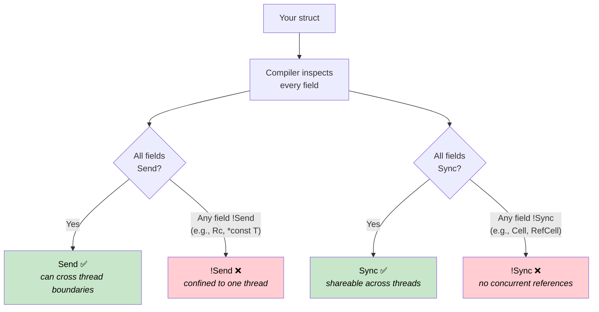
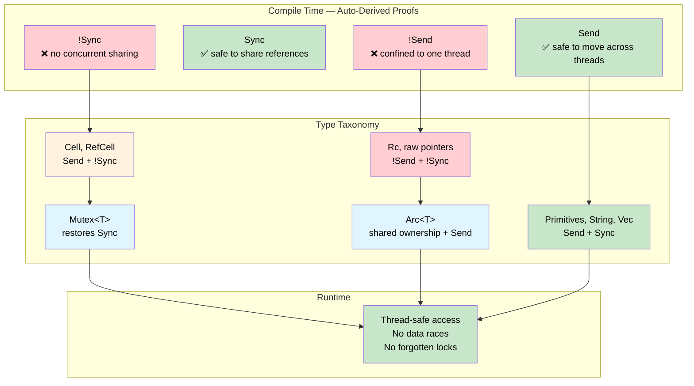

# Send & Sync — Compile-Time Concurrency Proofs 🟠

> **What you'll learn:** How Rust's `Send` and `Sync` auto-traits turn the compiler into a concurrency auditor — proving at compile time which types can cross thread boundaries and which can be shared, with zero runtime cost.
>
> **Cross-references:** [ch04](ch04-capability-tokens-zero-cost-proof-of-aut.md) (capability tokens), [ch09](ch09-phantom-types-for-resource-tracking.md) (phantom types), [ch15](ch15-const-fn-compile-time-correctness-proofs.md) (const fn proofs)

## The Problem: Concurrent Access Without a Safety Net

In systems programming, peripherals, shared buffers, and global state are accessed from multiple contexts — main loops, interrupt handlers, DMA callbacks, and worker threads. In C, the compiler offers no enforcement whatsoever:

```c
/* Shared sensor buffer — accessed from main loop and ISR */
volatile uint32_t sensor_buf[64];
volatile uint32_t buf_index = 0;

void SENSOR_IRQHandler(void) {
    sensor_buf[buf_index++] = read_sensor();  /* Race: buf_index read + write */
}

void process_sensors(void) {
    for (uint32_t i = 0; i < buf_index; i++) {  /* buf_index changes mid-loop */
        process(sensor_buf[i]);                   /* Data overwritten mid-read */
    }
    buf_index = 0;                                /* ISR fires between these lines */
}
```

The `volatile` keyword prevents the compiler from optimizing away the reads, but it does **nothing** about data races. Two contexts can read and write `buf_index` simultaneously, producing torn values, lost updates, or buffer overruns. The same problem appears with `pthread_mutex_t` — the compiler will happily let you forget to lock:

```c
pthread_mutex_t lock;
int shared_counter;

void increment(void) {
    shared_counter++;  /* Oops — forgot pthread_mutex_lock(&lock) */
}
```

**Every concurrent bug is discovered at runtime** — typically under load, in production, and intermittently.

## What Send and Sync Prove

Rust defines two marker traits that the compiler derives automatically:

| Trait | Proof | Informal meaning |
|-------|-------|-------------------|
| `Send` | A value of type `T` can be safely **moved** to another thread | "This can cross a thread boundary" |
| `Sync` | A **shared reference** `&T` can be safely used by multiple threads | "This can be read from multiple threads" |

These are **auto-traits** — the compiler derives them by inspecting every field. A struct is `Send` if all its fields are `Send`. A struct is `Sync` if all its fields are `Sync`. If any field opts out, the entire struct opts out. No annotation needed, no runtime overhead — the proof is structural.



> **The compiler is the auditor.** In C, thread-safety annotations live in comments and header documentation — advisory, never enforced. In Rust, `Send` and `Sync` are derived from the structure of the type itself. Adding a single `Cell<f32>` field automatically makes the containing struct `!Sync`. No programmer action required, no way to forget.

The two traits are linked by a key identity:

> **`T` is `Sync` if and only if `&T` is `Send`.**

This makes intuitive sense: if a shared reference can be safely sent to another thread, then the underlying type is safe for concurrent reads.

### Types That Opt Out

Certain types are deliberately `!Send` or `!Sync`:

| Type | Send | Sync | Why |
|------|:----:|:----:|-----|
| `u32`, `String`, `Vec<T>` | ✅ | ✅ | No interior mutability, no raw pointers |
| `Cell<T>`, `RefCell<T>` | ✅ | ❌ | Interior mutability without synchronization |
| `Rc<T>` | ❌ | ❌ | Reference count is not atomic |
| `*const T`, `*mut T` | ❌ | ❌ | Raw pointers have no safety guarantees |
| `Arc<T>` (where `T: Send + Sync`) | ✅ | ✅ | Atomic reference count |
| `Mutex<T>` (where `T: Send`) | ✅ | ✅ | Lock serializes all access |

Every ❌ in this table is a **compile-time invariant**. You cannot accidentally send an `Rc` to another thread — the compiler rejects it.

## !Send Peripheral Handles

In embedded systems, a peripheral register block lives at a fixed memory address and should only be accessed from a single execution context. Raw pointers are inherently `!Send` and `!Sync`, so wrapping one automatically opts the containing type out of both traits:

```rust
/// A handle to a memory-mapped UART peripheral.
/// The raw pointer makes this automatically !Send and !Sync.
pub struct Uart {
    regs: *const u32,
}

impl Uart {
    pub fn new(base: usize) -> Self {
        Self { regs: base as *const u32 }
    }

    pub fn write_byte(&self, byte: u8) {
        // In real firmware: unsafe { write_volatile(self.regs.add(DATA_OFFSET), byte as u32) }
        println!("UART TX: {:#04X}", byte);
    }
}

fn main() {
    let uart = Uart::new(0x4000_1000);
    uart.write_byte(b'A');  // ✅ Use on the creating thread

    // ❌ Would not compile: Uart is !Send
    // std::thread::spawn(move || {
    //     uart.write_byte(b'B');
    // });
}
```

The commented-out `thread::spawn` would produce:

```text
error[E0277]: `*const u32` cannot be sent between threads safely
   |
   |     std::thread::spawn(move || {
   |     ^^^^^^^^^^^^^^^^^^ within `Uart`, the trait `Send` is not
   |                        implemented for `*const u32`
```

**No raw pointer? Use `PhantomData`.** Sometimes a type has no raw pointer but should still be confined to one thread — for example, a file descriptor index or a handle obtained from a C library:

```rust
use std::marker::PhantomData;

/// An opaque handle from a C library. PhantomData<*const ()> makes it
/// !Send + !Sync even though the inner fd is just a plain integer.
pub struct LibHandle {
    fd: i32,
    _not_send: PhantomData<*const ()>,
}

impl LibHandle {
    pub fn open(path: &str) -> Self {
        let _ = path;
        Self { fd: 42, _not_send: PhantomData }
    }

    pub fn fd(&self) -> i32 { self.fd }
}

fn main() {
    let handle = LibHandle::open("/dev/sensor0");
    println!("fd = {}", handle.fd());

    // ❌ Would not compile: LibHandle is !Send
    // std::thread::spawn(move || { let _ = handle.fd(); });
}
```

This is the compile-time equivalent of C's "please read the documentation that says this handle isn't thread-safe." In Rust, the compiler enforces it.

## Mutex Transforms !Sync into Sync

`Cell<T>` and `RefCell<T>` provide interior mutability without any synchronization — so they're `!Sync`. But sometimes you genuinely need to share mutable state across threads. `Mutex<T>` adds the missing synchronization, and the compiler recognizes this:

> **If `T: Send`, then `Mutex<T>: Send + Sync`.**

The lock serializes all access, so the `!Sync` inner type becomes safe to share. The compiler proves this structurally — no runtime check for "did the programmer remember to lock":

```rust
use std::sync::{Arc, Mutex};
use std::cell::Cell;

/// A sensor cache using Cell for interior mutability.
/// Cell<u32> is !Sync — can't be shared across threads directly.
struct SensorCache {
    last_reading: Cell<u32>,
    reading_count: Cell<u32>,
}

fn main() {
    // Mutex makes SensorCache safe to share — compiler proves it
    let cache = Arc::new(Mutex::new(SensorCache {
        last_reading: Cell::new(0),
        reading_count: Cell::new(0),
    }));

    let handles: Vec<_> = (0..4).map(|i| {
        let c = Arc::clone(&cache);
        std::thread::spawn(move || {
            let guard = c.lock().unwrap();  // Must lock before access
            guard.last_reading.set(i * 10);
            guard.reading_count.set(guard.reading_count.get() + 1);
        })
    }).collect();

    for h in handles { h.join().unwrap(); }

    let guard = cache.lock().unwrap();
    println!("Last reading: {}", guard.last_reading.get());
    println!("Total reads:  {}", guard.reading_count.get());
}
```

Compare to the C version: `pthread_mutex_lock` is a runtime call that the programmer can forget. Here, the type system makes it impossible to access `SensorCache` without going through the `Mutex`. The proof is structural — the only runtime cost is the lock itself.

> **`Mutex` doesn't just synchronize — it proves synchronization.** `Mutex::lock()` returns a `MutexGuard` that `Deref`s to `&T`. There is no way to obtain a reference to the inner data without going through the lock. The API makes "forgot to lock" structurally unrepresentable.

## Function Bounds as Theorems

`std::thread::spawn` has this signature:

```rust,ignore
pub fn spawn<F, T>(f: F) -> JoinHandle<T>
where
    F: FnOnce() -> T + Send + 'static,
    T: Send + 'static,
```

The `Send + 'static` bound isn't just an implementation detail — it's a **theorem**:

> "Any closure and return value passed to `spawn` is proven at compile time to be safe to run on another thread, with no dangling references."

You can apply the same pattern to your own APIs:

```rust
use std::sync::mpsc;

/// Run a task on a background thread and return its result.
/// The bounds prove: the closure and its result are thread-safe.
fn run_on_background<F, T>(task: F) -> T
where
    F: FnOnce() -> T + Send + 'static,
    T: Send + 'static,
{
    let (tx, rx) = mpsc::channel();
    std::thread::spawn(move || {
        let _ = tx.send(task());
    });
    rx.recv().expect("background task panicked")
}

fn main() {
    // ✅ u32 is Send, closure captures nothing non-Send
    let result = run_on_background(|| 6 * 7);
    println!("Result: {result}");

    // ✅ String is Send
    let greeting = run_on_background(|| String::from("hello from background"));
    println!("{greeting}");

    // ❌ Would not compile: Rc is !Send
    // use std::rc::Rc;
    // let data = Rc::new(42);
    // run_on_background(move || *data);
}
```

Uncommenting the `Rc` example produces a precise diagnostic:

```text
error[E0277]: `Rc<i32>` cannot be sent between threads safely
   --> src/main.rs
    |
    |     run_on_background(move || *data);
    |     ^^^^^^^^^^^^^^^^^^ `Rc<i32>` cannot be sent between threads safely
    |
note: required by a bound in `run_on_background`
    |
    |     F: FnOnce() -> T + Send + 'static,
    |                        ^^^^ required by this bound
```

The compiler traces the violation back to the exact bound — and tells the programmer *why*. Compare to C's `pthread_create`:

```c
int pthread_create(pthread_t *thread, const pthread_attr_t *attr,
                   void *(*start_routine)(void *), void *arg);
```

The `void *arg` accepts anything — thread-safe or not. The C compiler can't distinguish a non-atomic refcount from a plain integer. Rust's trait bounds make the distinction at the type level.

## When to Use Send/Sync Proofs

| Scenario | Approach |
|----------|----------|
| Peripheral handle wrapping a raw pointer | Automatic `!Send + !Sync` — nothing to do |
| Handle from C library (integer fd/handle) | Add `PhantomData<*const ()>` for `!Send + !Sync` |
| Shared config behind a lock | `Arc<Mutex<T>>` — compiler proves access is safe |
| Cross-thread message passing | `mpsc::channel` — `Send` bound enforced automatically |
| Task spawner or thread pool API | Require `F: Send + 'static` in signature |
| Single-threaded resource (e.g., GPU context) | `PhantomData<*const ()>` to prevent sharing |
| Type should be `Send` but contains a raw pointer | `unsafe impl Send` with documented safety justification |

### Cost Summary

| What | Runtime cost |
|------|:------:|
| `Send` / `Sync` auto-derivation | Compile time only — 0 bytes |
| `PhantomData<*const ()>` field | Zero-sized — optimised away |
| `!Send` / `!Sync` enforcement | Compile time only — no runtime check |
| `F: Send + 'static` function bounds | Monomorphised — static dispatch, no boxing |
| `Mutex<T>` lock | Runtime lock (unavoidable for shared mutation) |
| `Arc<T>` reference counting | Atomic increment/decrement (unavoidable for shared ownership) |

The first four rows are **zero-cost** — they exist only in the type system and vanish after compilation. `Mutex` and `Arc` carry unavoidable runtime costs, but those costs are the *minimum* any correct concurrent program must pay — Rust just makes sure you pay them.

## Exercise: DMA Transfer Guard

Design a `DmaTransfer<T>` that holds a buffer while a DMA transfer is in flight. Requirements:

1. `DmaTransfer` must be `!Send` — the DMA controller uses physical addresses tied to this core's memory bus
2. `DmaTransfer` must be `!Sync` — concurrent reads while DMA is writing would see torn data
3. Provide a `wait()` method that **consumes** the guard and returns the buffer — ownership proves the transfer is complete
4. The buffer type `T` must implement a `DmaSafe` marker trait

<details>
<summary>Solution</summary>

```rust
use std::marker::PhantomData;

/// Marker trait for types that can be used as DMA buffers.
/// In real firmware: type must be repr(C) with no padding.
trait DmaSafe {}

impl DmaSafe for [u8; 64] {}
impl DmaSafe for [u8; 256] {}

/// A guard representing an in-flight DMA transfer.
/// !Send + !Sync: can't be sent to another thread or shared.
pub struct DmaTransfer<T: DmaSafe> {
    buffer: T,
    channel: u8,
    _no_send_sync: PhantomData<*const ()>,
}

impl<T: DmaSafe> DmaTransfer<T> {
    /// Start a DMA transfer. The buffer is consumed — no one else can touch it.
    pub fn start(buffer: T, channel: u8) -> Self {
        // In real firmware: configure DMA channel, set source/dest, start transfer
        println!("DMA channel {} started", channel);
        Self {
            buffer,
            channel,
            _no_send_sync: PhantomData,
        }
    }

    /// Wait for the transfer to complete and return the buffer.
    /// Consumes self — the guard no longer exists after this.
    pub fn wait(self) -> T {
        // In real firmware: poll DMA status register until complete
        println!("DMA channel {} complete", self.channel);
        self.buffer
    }
}

fn main() {
    let buf = [0u8; 64];

    // Start transfer — buf is moved into the guard
    let transfer = DmaTransfer::start(buf, 2);

    // ❌ buf is no longer accessible — ownership prevents use-during-DMA
    // println!("{:?}", buf);

    // ❌ Would not compile: DmaTransfer is !Send
    // std::thread::spawn(move || { transfer.wait(); });

    // ✅ Wait on the original thread, get the buffer back
    let buf = transfer.wait();
    println!("Buffer recovered: {} bytes", buf.len());
}
```

</details>



## Key Takeaways

1. **`Send` and `Sync` are compile-time proofs about concurrency safety** — the compiler derives them structurally by inspecting every field. No annotation, no runtime cost, no opt-in needed.

2. **Raw pointers automatically opt out** — any type containing `*const T` or `*mut T` becomes `!Send + !Sync`. This makes peripheral handles naturally thread-confined.

3. **`PhantomData<*const ()>` is the explicit opt-out** — when a type has no raw pointer but should still be thread-confined (C library handles, GPU contexts), a phantom field does the job.

4. **`Mutex<T>` restores `Sync` with proof** — the compiler structurally proves that all access goes through the lock. Unlike C's `pthread_mutex_t`, you cannot forget to lock.

5. **Function bounds are theorems** — `F: Send + 'static` in a spawner's signature is a compile-time proof obligation: every call site must prove its closure is thread-safe. Compare to C's `void *arg` which accepts anything.

6. **The pattern complements all other correctness techniques** — typestate proves protocol sequencing, phantom types prove permissions, `const fn` proves value invariants, and `Send`/`Sync` prove concurrency safety. Together they cover the full correctness surface.
