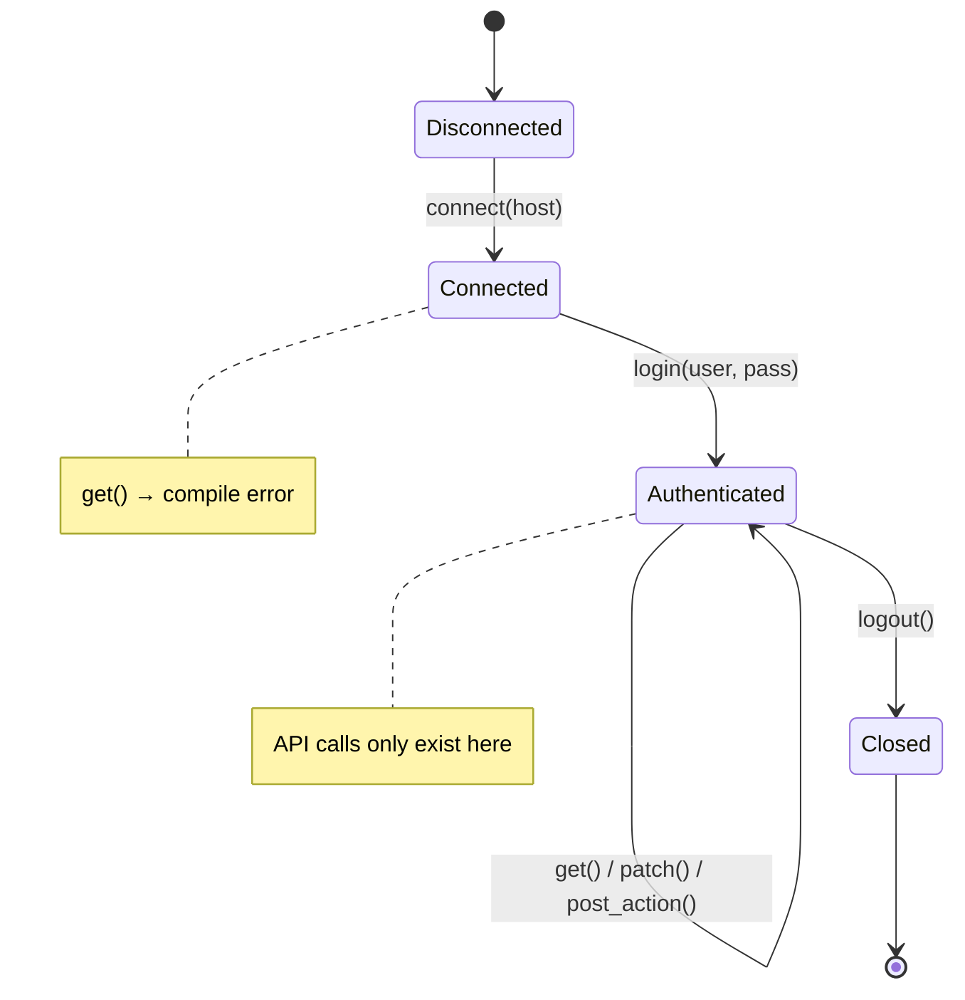
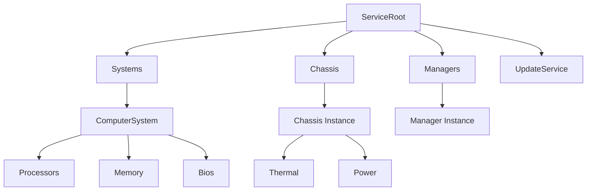
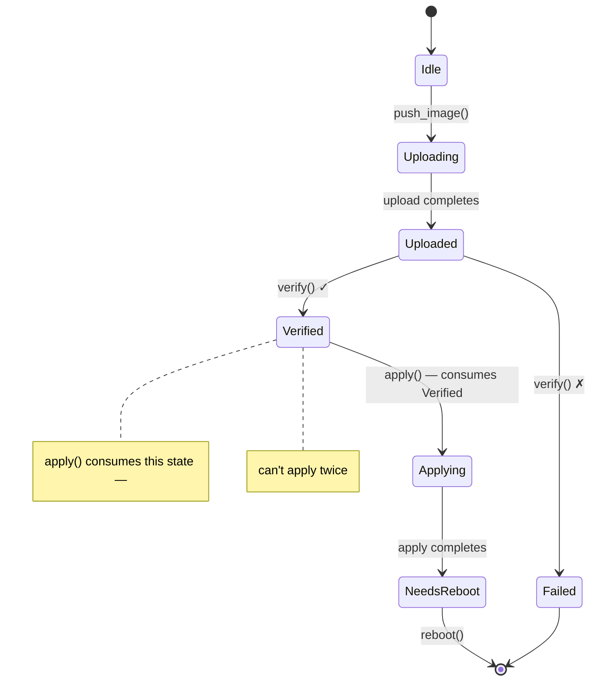

# Applied Walkthrough — Type-Safe Redfish Client 🟡

> **What you'll learn:** How to compose type-state sessions, capability tokens, phantom-typed resource navigation, dimensional analysis, validated boundaries, builder type-state, and single-use types into a complete, zero-overhead Redfish client — where every protocol violation is a compile error.
>
> **Cross-references:** [ch02](ch02-typed-command-interfaces-request-determi.md) (typed commands), [ch03](ch03-single-use-types-cryptographic-guarantee.md) (single-use types), [ch04](ch04-capability-tokens-zero-cost-proof-of-aut.md) (capability tokens), [ch05](ch05-protocol-state-machines-type-state-for-r.md) (type-state), [ch06](ch06-dimensional-analysis-making-the-compiler.md) (dimensional types), [ch07](ch07-validated-boundaries-parse-dont-validate.md) (validated boundaries), [ch09](ch09-phantom-types-for-resource-tracking.md) (phantom types), [ch10](ch10-putting-it-all-together-a-complete-diagn.md) (IPMI integration), [ch11](ch11-fourteen-tricks-from-the-trenches.md) (trick 4 — builder type-state)

## Why Redfish Deserves Its Own Chapter

Chapter 10 composes the core patterns around IPMI — a byte-level protocol. But
most BMC platforms now expose a **Redfish** REST API alongside (or instead of)
IPMI, and Redfish introduces its own category of correctness hazards:

| Hazard | Example | Consequence |
|--------|---------|-------------|
| Malformed URI | `GET /redfish/v1/Chassis/1/Processors` (wrong parent) | 404 or wrong data silently returned |
| Action on wrong power state | `Reset(ForceOff)` on an already-off system | BMC returns error, or worse, races with another operation |
| Missing privilege | Operator-level code calls `Manager.ResetToDefaults` | 403 in production, security audit finding |
| Incomplete PATCH | Omit a required BIOS attribute from a PATCH body | Silent no-op or partial config corruption |
| Unverified firmware apply | `SimpleUpdate` invoked before image integrity check | Bricked BMC |
| Schema version mismatch | Access `LastResetTime` on a v1.5 BMC (added in v1.13) | `null` field → runtime panic |
| Unit confusion in telemetry | Compare inlet temperature (°C) to power draw (W) | Nonsensical threshold decisions |

In C, Python, or untyped Rust, every one of these is prevented by discipline and
testing alone. This chapter makes them **compile errors**.

## The Untyped Redfish Client

A typical Redfish client looks like this:

```rust,ignore
use std::collections::HashMap;

struct RedfishClient {
    base_url: String,
    token: Option<String>,
}

impl RedfishClient {
    fn get(&self, path: &str) -> Result<serde_json::Value, String> {
        // ... HTTP GET ...
        Ok(serde_json::json!({})) // stub
    }

    fn patch(&self, path: &str, body: &serde_json::Value) -> Result<(), String> {
        // ... HTTP PATCH ...
        Ok(()) // stub
    }

    fn post_action(&self, path: &str, body: &serde_json::Value) -> Result<(), String> {
        // ... HTTP POST ...
        Ok(()) // stub
    }
}

fn check_thermal(client: &RedfishClient) -> Result<(), String> {
    let resp = client.get("/redfish/v1/Chassis/1/Thermal")?;

    // 🐛 Is this field always present? What if the BMC returns null?
    let cpu_temp = resp["Temperatures"][0]["ReadingCelsius"]
        .as_f64().unwrap();

    let fan_rpm = resp["Fans"][0]["Reading"]
        .as_f64().unwrap();

    // 🐛 Comparing °C to RPM — both are f64
    if cpu_temp > fan_rpm {
        println!("thermal issue");
    }

    // 🐛 Is this the right path? No compile-time check.
    client.post_action(
        "/redfish/v1/Systems/1/Actions/ComputerSystem.Reset",
        &serde_json::json!({"ResetType": "ForceOff"})
    )?;

    Ok(())
}
```

This "works" — until it doesn't. Every `unwrap()` is a potential panic, every
string path is an unchecked assumption, and unit confusion is invisible.

---

## Section 1 — Session Lifecycle (Type-State, ch05)

A Redfish session has a strict lifecycle: connect → authenticate → use → close.
Encode each state as a distinct type.



```rust,ignore
use std::marker::PhantomData;

// ──── Session States ────

pub struct Disconnected;
pub struct Connected;
pub struct Authenticated;

pub struct RedfishSession<S> {
    base_url: String,
    auth_token: Option<String>,
    _state: PhantomData<S>,
}

impl RedfishSession<Disconnected> {
    pub fn new(host: &str) -> Self {
        RedfishSession {
            base_url: format!("https://{}", host),
            auth_token: None,
            _state: PhantomData,
        }
    }

    /// Transition: Disconnected → Connected.
    /// Verifies the service root is reachable.
    pub fn connect(self) -> Result<RedfishSession<Connected>, RedfishError> {
        // GET /redfish/v1 — verify service root
        println!("Connecting to {}/redfish/v1", self.base_url);
        Ok(RedfishSession {
            base_url: self.base_url,
            auth_token: None,
            _state: PhantomData,
        })
    }
}

impl RedfishSession<Connected> {
    /// Transition: Connected → Authenticated.
    /// Creates a session via POST /redfish/v1/SessionService/Sessions.
    pub fn login(
        self,
        user: &str,
        _pass: &str,
    ) -> Result<(RedfishSession<Authenticated>, LoginToken), RedfishError> {
        // POST /redfish/v1/SessionService/Sessions
        println!("Authenticated as {}", user);
        let token = "X-Auth-Token-abc123".to_string();
        Ok((
            RedfishSession {
                base_url: self.base_url,
                auth_token: Some(token),
                _state: PhantomData,
            },
            LoginToken { _private: () },
        ))
    }
}

impl RedfishSession<Authenticated> {
    /// Only available on Authenticated sessions.
    fn http_get(&self, path: &str) -> Result<serde_json::Value, RedfishError> {
        let _url = format!("{}{}", self.base_url, path);
        // ... HTTP GET with auth_token header ...
        Ok(serde_json::json!({})) // stub
    }

    fn http_patch(
        &self,
        path: &str,
        body: &serde_json::Value,
    ) -> Result<serde_json::Value, RedfishError> {
        let _url = format!("{}{}", self.base_url, path);
        let _ = body;
        Ok(serde_json::json!({})) // stub
    }

    fn http_post(
        &self,
        path: &str,
        body: &serde_json::Value,
    ) -> Result<serde_json::Value, RedfishError> {
        let _url = format!("{}{}", self.base_url, path);
        let _ = body;
        Ok(serde_json::json!({})) // stub
    }

    /// Transition: Authenticated → Closed (session consumed).
    pub fn logout(self) {
        // DELETE /redfish/v1/SessionService/Sessions/{id}
        println!("Session closed");
        // self is consumed — can't use the session after logout
    }
}

// Attempting to call http_get on a non-Authenticated session:
//
//   let session = RedfishSession::new("bmc01").connect()?;
//   session.http_get("/redfish/v1/Systems");
//   ❌ ERROR: method `http_get` not found for `RedfishSession<Connected>`

#[derive(Debug)]
pub enum RedfishError {
    ConnectionFailed(String),
    AuthenticationFailed(String),
    HttpError { status: u16, message: String },
    ValidationError(String),
}

impl std::fmt::Display for RedfishError {
    fn fmt(&self, f: &mut std::fmt::Formatter<'_>) -> std::fmt::Result {
        match self {
            Self::ConnectionFailed(msg) => write!(f, "connection failed: {msg}"),
            Self::AuthenticationFailed(msg) => write!(f, "auth failed: {msg}"),
            Self::HttpError { status, message } =>
                write!(f, "HTTP {status}: {message}"),
            Self::ValidationError(msg) => write!(f, "validation: {msg}"),
        }
    }
}
```

**Bug class eliminated:** sending requests on a disconnected or unauthenticated
session. The method simply doesn't exist — no runtime check to forget.

---

## Section 2 — Privilege Tokens (Capability Tokens, ch04)

Redfish defines four privilege levels: `Login`, `ConfigureComponents`,
`ConfigureManager`, `ConfigureSelf`. Rather than checking permissions at
runtime, encode them as zero-sized proof tokens.

```rust,ignore
// ──── Privilege Tokens (zero-sized) ────

/// Proof the caller has Login privilege.
/// Returned by successful login — the only way to obtain one.
pub struct LoginToken { _private: () }

/// Proof the caller has ConfigureComponents privilege.
/// Only obtainable by admin-level authentication.
pub struct ConfigureComponentsToken { _private: () }

/// Proof the caller has ConfigureManager privilege (firmware updates, etc.).
pub struct ConfigureManagerToken { _private: () }

// Extend login to return privilege tokens based on role:

impl RedfishSession<Connected> {
    /// Admin login — returns all privilege tokens.
    pub fn login_admin(
        self,
        user: &str,
        pass: &str,
    ) -> Result<(
        RedfishSession<Authenticated>,
        LoginToken,
        ConfigureComponentsToken,
        ConfigureManagerToken,
    ), RedfishError> {
        let (session, login_tok) = self.login(user, pass)?;
        Ok((
            session,
            login_tok,
            ConfigureComponentsToken { _private: () },
            ConfigureManagerToken { _private: () },
        ))
    }

    /// Operator login — returns Login + ConfigureComponents only.
    pub fn login_operator(
        self,
        user: &str,
        pass: &str,
    ) -> Result<(
        RedfishSession<Authenticated>,
        LoginToken,
        ConfigureComponentsToken,
    ), RedfishError> {
        let (session, login_tok) = self.login(user, pass)?;
        Ok((
            session,
            login_tok,
            ConfigureComponentsToken { _private: () },
        ))
    }

    /// Read-only login — returns Login token only.
    pub fn login_readonly(
        self,
        user: &str,
        pass: &str,
    ) -> Result<(RedfishSession<Authenticated>, LoginToken), RedfishError> {
        self.login(user, pass)
    }
}
```

Now privilege requirements are part of the function signature:

```rust,ignore
# use std::marker::PhantomData;
# pub struct Authenticated;
# pub struct RedfishSession<S> { base_url: String, auth_token: Option<String>, _state: PhantomData<S> }
# pub struct LoginToken { _private: () }
# pub struct ConfigureComponentsToken { _private: () }
# pub struct ConfigureManagerToken { _private: () }
# #[derive(Debug)] pub enum RedfishError { HttpError { status: u16, message: String } }

/// Anyone with Login can read thermal data.
fn get_thermal(
    session: &RedfishSession<Authenticated>,
    _proof: &LoginToken,
) -> Result<serde_json::Value, RedfishError> {
    // GET /redfish/v1/Chassis/1/Thermal
    Ok(serde_json::json!({})) // stub
}

/// Changing boot order requires ConfigureComponents.
fn set_boot_order(
    session: &RedfishSession<Authenticated>,
    _proof: &ConfigureComponentsToken,
    order: &[&str],
) -> Result<(), RedfishError> {
    let _ = order;
    // PATCH /redfish/v1/Systems/1
    Ok(())
}

/// Factory reset requires ConfigureManager.
fn reset_to_defaults(
    session: &RedfishSession<Authenticated>,
    _proof: &ConfigureManagerToken,
) -> Result<(), RedfishError> {
    // POST .../Actions/Manager.ResetToDefaults
    Ok(())
}

// Operator code calling reset_to_defaults:
//
//   let (session, login, configure) = session.login_operator("op", "pass")?;
//   reset_to_defaults(&session, &???);
//   ❌ ERROR: no ConfigureManagerToken available — operator can't do this
```

**Bug class eliminated:** privilege escalation. An operator-level login physically
cannot produce a `ConfigureManagerToken` — the compiler won't let the code reference
one. Zero runtime cost: for the compiled binary, these tokens don't exist.

---

## Section 3 — Typed Resource Navigation (Phantom Types, ch09)

Redfish resources form a tree. Encoding the hierarchy as types prevents constructing
illegal URIs:



```rust,ignore
use std::marker::PhantomData;

// ──── Resource Type Markers ────

pub struct ServiceRoot;
pub struct SystemsCollection;
pub struct ComputerSystem;
pub struct ChassisCollection;
pub struct ChassisInstance;
pub struct ThermalResource;
pub struct PowerResource;
pub struct BiosResource;
pub struct ManagersCollection;
pub struct ManagerInstance;
pub struct UpdateServiceResource;

// ──── Typed Resource Path ────

pub struct RedfishPath<R> {
    uri: String,
    _resource: PhantomData<R>,
}

impl RedfishPath<ServiceRoot> {
    pub fn root() -> Self {
        RedfishPath {
            uri: "/redfish/v1".to_string(),
            _resource: PhantomData,
        }
    }

    pub fn systems(&self) -> RedfishPath<SystemsCollection> {
        RedfishPath {
            uri: format!("{}/Systems", self.uri),
            _resource: PhantomData,
        }
    }

    pub fn chassis(&self) -> RedfishPath<ChassisCollection> {
        RedfishPath {
            uri: format!("{}/Chassis", self.uri),
            _resource: PhantomData,
        }
    }

    pub fn managers(&self) -> RedfishPath<ManagersCollection> {
        RedfishPath {
            uri: format!("{}/Managers", self.uri),
            _resource: PhantomData,
        }
    }

    pub fn update_service(&self) -> RedfishPath<UpdateServiceResource> {
        RedfishPath {
            uri: format!("{}/UpdateService", self.uri),
            _resource: PhantomData,
        }
    }
}

impl RedfishPath<SystemsCollection> {
    pub fn system(&self, id: &str) -> RedfishPath<ComputerSystem> {
        RedfishPath {
            uri: format!("{}/{}", self.uri, id),
            _resource: PhantomData,
        }
    }
}

impl RedfishPath<ComputerSystem> {
    pub fn bios(&self) -> RedfishPath<BiosResource> {
        RedfishPath {
            uri: format!("{}/Bios", self.uri),
            _resource: PhantomData,
        }
    }
}

impl RedfishPath<ChassisCollection> {
    pub fn instance(&self, id: &str) -> RedfishPath<ChassisInstance> {
        RedfishPath {
            uri: format!("{}/{}", self.uri, id),
            _resource: PhantomData,
        }
    }
}

impl RedfishPath<ChassisInstance> {
    pub fn thermal(&self) -> RedfishPath<ThermalResource> {
        RedfishPath {
            uri: format!("{}/Thermal", self.uri),
            _resource: PhantomData,
        }
    }

    pub fn power(&self) -> RedfishPath<PowerResource> {
        RedfishPath {
            uri: format!("{}/Power", self.uri),
            _resource: PhantomData,
        }
    }
}

impl RedfishPath<ManagersCollection> {
    pub fn manager(&self, id: &str) -> RedfishPath<ManagerInstance> {
        RedfishPath {
            uri: format!("{}/{}", self.uri, id),
            _resource: PhantomData,
        }
    }
}

impl<R> RedfishPath<R> {
    pub fn uri(&self) -> &str {
        &self.uri
    }
}

// ── Usage ──

fn build_paths() {
    let root = RedfishPath::root();

    // ✅ Valid navigation
    let thermal = root.chassis().instance("1").thermal();
    assert_eq!(thermal.uri(), "/redfish/v1/Chassis/1/Thermal");

    let bios = root.systems().system("1").bios();
    assert_eq!(bios.uri(), "/redfish/v1/Systems/1/Bios");

    // ❌ Compile error: ServiceRoot has no .thermal() method
    // root.thermal();

    // ❌ Compile error: SystemsCollection has no .bios() method
    // root.systems().bios();

    // ❌ Compile error: ChassisInstance has no .bios() method
    // root.chassis().instance("1").bios();
}
```

**Bug class eliminated:** malformed URIs, navigating to a child resource that
doesn't exist under the given parent. The hierarchy is enforced structurally —
you can only reach `Thermal` through `Chassis → Instance → Thermal`.

---

## Section 4 — Typed Telemetry Reads (Typed Commands + Dimensional Analysis, ch02 + ch06)

Combine typed resource paths with dimensional return types so the compiler knows
what unit every reading carries:

```rust,ignore
use std::marker::PhantomData;

// ──── Dimensional Types (ch06) ────

#[derive(Debug, Clone, Copy, PartialEq, PartialOrd)]
pub struct Celsius(pub f64);

#[derive(Debug, Clone, Copy, PartialEq, PartialOrd)]
pub struct Rpm(pub u32);

#[derive(Debug, Clone, Copy, PartialEq, PartialOrd)]
pub struct Watts(pub f64);

#[derive(Debug, Clone, Copy, PartialEq, PartialOrd)]
pub struct Volts(pub f64);

// ──── Typed Redfish GET (ch02 pattern applied to REST) ────

/// A Redfish resource type determines its parsed response.
pub trait RedfishResource {
    type Response;
    fn parse(json: &serde_json::Value) -> Result<Self::Response, RedfishError>;
}

// ──── Validated Thermal Response (ch07) ────

#[derive(Debug)]
pub struct ValidThermalResponse {
    pub temperatures: Vec<TemperatureReading>,
    pub fans: Vec<FanReading>,
}

#[derive(Debug)]
pub struct TemperatureReading {
    pub name: String,
    pub reading: Celsius,           // ← dimensional type, not f64
    pub upper_critical: Celsius,
    pub status: HealthStatus,
}

#[derive(Debug)]
pub struct FanReading {
    pub name: String,
    pub reading: Rpm,               // ← dimensional type, not u32
    pub status: HealthStatus,
}

#[derive(Debug, Clone, Copy, PartialEq)]
pub enum HealthStatus { Ok, Warning, Critical }

impl RedfishResource for ThermalResource {
    type Response = ValidThermalResponse;

    fn parse(json: &serde_json::Value) -> Result<ValidThermalResponse, RedfishError> {
        // Parse and validate in one pass — boundary validation (ch07)
        let temps = json["Temperatures"]
            .as_array()
            .ok_or_else(|| RedfishError::ValidationError(
                "missing Temperatures array".into(),
            ))?
            .iter()
            .map(|t| {
                Ok(TemperatureReading {
                    name: t["Name"]
                        .as_str()
                        .ok_or_else(|| RedfishError::ValidationError(
                            "missing Name".into(),
                        ))?
                        .to_string(),
                    reading: Celsius(
                        t["ReadingCelsius"]
                            .as_f64()
                            .ok_or_else(|| RedfishError::ValidationError(
                                "missing ReadingCelsius".into(),
                            ))?,
                    ),
                    upper_critical: Celsius(
                        t["UpperThresholdCritical"]
                            .as_f64()
                            .unwrap_or(105.0), // safe default for missing threshold
                    ),
                    status: parse_health(
                        t["Status"]["Health"]
                            .as_str()
                            .unwrap_or("OK"),
                    ),
                })
            })
            .collect::<Result<Vec<_>, _>>()?;

        let fans = json["Fans"]
            .as_array()
            .ok_or_else(|| RedfishError::ValidationError(
                "missing Fans array".into(),
            ))?
            .iter()
            .map(|f| {
                Ok(FanReading {
                    name: f["Name"]
                        .as_str()
                        .ok_or_else(|| RedfishError::ValidationError(
                            "missing Name".into(),
                        ))?
                        .to_string(),
                    reading: Rpm(
                        f["Reading"]
                            .as_u64()
                            .ok_or_else(|| RedfishError::ValidationError(
                                "missing Reading".into(),
                            ))? as u32,
                    ),
                    status: parse_health(
                        f["Status"]["Health"]
                            .as_str()
                            .unwrap_or("OK"),
                    ),
                })
            })
            .collect::<Result<Vec<_>, _>>()?;

        Ok(ValidThermalResponse { temperatures: temps, fans })
    }
}

fn parse_health(s: &str) -> HealthStatus {
    match s {
        "OK" => HealthStatus::Ok,
        "Warning" => HealthStatus::Warning,
        _ => HealthStatus::Critical,
    }
}

// ──── Typed GET on Authenticated Session ────

impl RedfishSession<Authenticated> {
    pub fn get_resource<R: RedfishResource>(
        &self,
        path: &RedfishPath<R>,
    ) -> Result<R::Response, RedfishError> {
        let json = self.http_get(path.uri())?;
        R::parse(&json)
    }
}

// ── Usage ──

fn read_thermal(
    session: &RedfishSession<Authenticated>,
    _proof: &LoginToken,
) -> Result<(), RedfishError> {
    let path = RedfishPath::root().chassis().instance("1").thermal();

    // Response type is inferred: ValidThermalResponse
    let thermal = session.get_resource(&path)?;

    for t in &thermal.temperatures {
        // t.reading is Celsius — can only compare with Celsius
        if t.reading > t.upper_critical {
            println!("CRITICAL: {} at {:?}", t.name, t.reading);
        }

        // ❌ Compile error: cannot compare Celsius with Rpm
        // if t.reading > thermal.fans[0].reading { }

        // ❌ Compile error: cannot compare Celsius with Watts
        // if t.reading > Watts(350.0) { }
    }

    Ok(())
}
```

**Bug classes eliminated:**
- **Unit confusion:** `Celsius` ≠ `Rpm` ≠ `Watts` — the compiler rejects comparisons.
- **Missing field panics:** `parse()` validates at the boundary; `ValidThermalResponse`
  guarantees all fields are present.
- **Wrong response type:** `get_resource(&thermal_path)` returns `ValidThermalResponse`,
  not raw JSON. The resource type determines the response type at compile time.

---

## Section 5 — PATCH with Builder Type-State (ch11, Trick 4)

Redfish PATCH payloads must contain specific fields. A builder that gates
`.apply()` on required fields being set prevents incomplete or empty patches:

```rust,ignore
use std::marker::PhantomData;

// ──── Type-level booleans for required fields ────

pub struct FieldUnset;
pub struct FieldSet;

// ──── BIOS Settings PATCH Builder ────

pub struct BiosPatchBuilder<BootOrder, TpmState> {
    boot_order: Option<Vec<String>>,
    tpm_enabled: Option<bool>,
    _markers: PhantomData<(BootOrder, TpmState)>,
}

impl BiosPatchBuilder<FieldUnset, FieldUnset> {
    pub fn new() -> Self {
        BiosPatchBuilder {
            boot_order: None,
            tpm_enabled: None,
            _markers: PhantomData,
        }
    }
}

impl<T> BiosPatchBuilder<FieldUnset, T> {
    /// Set boot order — transitions the BootOrder marker to FieldSet.
    pub fn boot_order(self, order: Vec<String>) -> BiosPatchBuilder<FieldSet, T> {
        BiosPatchBuilder {
            boot_order: Some(order),
            tpm_enabled: self.tpm_enabled,
            _markers: PhantomData,
        }
    }
}

impl<B> BiosPatchBuilder<B, FieldUnset> {
    /// Set TPM state — transitions the TpmState marker to FieldSet.
    pub fn tpm_enabled(self, enabled: bool) -> BiosPatchBuilder<B, FieldSet> {
        BiosPatchBuilder {
            boot_order: self.boot_order,
            tpm_enabled: Some(enabled),
            _markers: PhantomData,
        }
    }
}

impl BiosPatchBuilder<FieldSet, FieldSet> {
    /// .apply() only exists when ALL required fields are set.
    pub fn apply(
        self,
        session: &RedfishSession<Authenticated>,
        _proof: &ConfigureComponentsToken,
        system: &RedfishPath<ComputerSystem>,
    ) -> Result<(), RedfishError> {
        let body = serde_json::json!({
            "Boot": {
                "BootOrder": self.boot_order.unwrap(),
            },
            "Oem": {
                "TpmEnabled": self.tpm_enabled.unwrap(),
            }
        });
        session.http_patch(
            &format!("{}/Bios/Settings", system.uri()),
            &body,
        )?;
        Ok(())
    }
}

// ── Usage ──

fn configure_bios(
    session: &RedfishSession<Authenticated>,
    configure: &ConfigureComponentsToken,
) -> Result<(), RedfishError> {
    let system = RedfishPath::root().systems().system("1");

    // ✅ Both required fields set — .apply() is available
    BiosPatchBuilder::new()
        .boot_order(vec!["Pxe".into(), "Hdd".into()])
        .tpm_enabled(true)
        .apply(session, configure, &system)?;

    // ❌ Compile error: .apply() not found on BiosPatchBuilder<FieldSet, FieldUnset>
    // BiosPatchBuilder::new()
    //     .boot_order(vec!["Pxe".into()])
    //     .apply(session, configure, &system)?;

    // ❌ Compile error: .apply() not found on BiosPatchBuilder<FieldUnset, FieldUnset>
    // BiosPatchBuilder::new()
    //     .apply(session, configure, &system)?;

    Ok(())
}
```

**Bug classes eliminated:**
- **Empty PATCH:** Can't call `.apply()` without setting every required field.
- **Missing privilege:** `.apply()` requires `&ConfigureComponentsToken`.
- **Wrong resource:** Takes a `&RedfishPath<ComputerSystem>`, not a raw string.

---

## Section 6 — Firmware Update Lifecycle (Single-Use + Type-State, ch03 + ch05)

The Redfish `UpdateService` has a strict sequence: push image → verify →
apply → reboot. Each phase must happen exactly once, in order.



```rust,ignore
use std::marker::PhantomData;

// ──── Firmware Update States ────

pub struct FwIdle;
pub struct FwUploaded;
pub struct FwVerified;
pub struct FwApplying;
pub struct FwNeedsReboot;

pub struct FirmwareUpdate<S> {
    task_uri: String,
    image_hash: String,
    _phase: PhantomData<S>,
}

impl FirmwareUpdate<FwIdle> {
    pub fn push_image(
        session: &RedfishSession<Authenticated>,
        _proof: &ConfigureManagerToken,
        image: &[u8],
    ) -> Result<FirmwareUpdate<FwUploaded>, RedfishError> {
        // POST /redfish/v1/UpdateService/Actions/UpdateService.SimpleUpdate
        // or multipart push to /redfish/v1/UpdateService/upload
        let _ = image;
        println!("Image uploaded ({} bytes)", image.len());
        Ok(FirmwareUpdate {
            task_uri: "/redfish/v1/TaskService/Tasks/1".to_string(),
            image_hash: "sha256:abc123".to_string(),
            _phase: PhantomData,
        })
    }
}

impl FirmwareUpdate<FwUploaded> {
    /// Verify image integrity. Returns FwVerified on success.
    pub fn verify(self) -> Result<FirmwareUpdate<FwVerified>, RedfishError> {
        // Poll task until verification complete
        println!("Image verified: {}", self.image_hash);
        Ok(FirmwareUpdate {
            task_uri: self.task_uri,
            image_hash: self.image_hash,
            _phase: PhantomData,
        })
    }
}

impl FirmwareUpdate<FwVerified> {
    /// Apply the update. Consumes self — can't apply twice.
    /// This is the single-use pattern from ch03.
    pub fn apply(self) -> Result<FirmwareUpdate<FwNeedsReboot>, RedfishError> {
        // PATCH /redfish/v1/UpdateService — set ApplyTime
        println!("Firmware applied from {}", self.task_uri);
        // self is moved — calling apply() again is a compile error
        Ok(FirmwareUpdate {
            task_uri: self.task_uri,
            image_hash: self.image_hash,
            _phase: PhantomData,
        })
    }
}

impl FirmwareUpdate<FwNeedsReboot> {
    /// Reboot to activate the new firmware.
    pub fn reboot(
        self,
        session: &RedfishSession<Authenticated>,
        _proof: &ConfigureManagerToken,
    ) -> Result<(), RedfishError> {
        // POST .../Actions/Manager.Reset {"ResetType": "GracefulRestart"}
        let _ = session;
        println!("BMC rebooting to activate firmware");
        Ok(())
    }
}

// ── Usage ──

fn update_bmc_firmware(
    session: &RedfishSession<Authenticated>,
    manager_proof: &ConfigureManagerToken,
    image: &[u8],
) -> Result<(), RedfishError> {
    // Each step returns the next state — the old state is consumed
    let uploaded = FirmwareUpdate::push_image(session, manager_proof, image)?;
    let verified = uploaded.verify()?;
    let needs_reboot = verified.apply()?;
    needs_reboot.reboot(session, manager_proof)?;

    // ❌ Compile error: use of moved value `verified`
    // verified.apply()?;

    // ❌ Compile error: FirmwareUpdate<FwUploaded> has no .apply() method
    // uploaded.apply()?;      // must verify first!

    // ❌ Compile error: push_image requires &ConfigureManagerToken
    // FirmwareUpdate::push_image(session, &login_token, image)?;

    Ok(())
}
```

**Bug classes eliminated:**
- **Applying unverified firmware:** `.apply()` only exists on `FwVerified`.
- **Double apply:** `apply()` consumes `self` — moved value can't be reused.
- **Skipping reboot:** `FwNeedsReboot` is a distinct type; you can't accidentally
  continue normal operations while firmware is staged.
- **Unauthorized update:** `push_image()` requires `&ConfigureManagerToken`.

---

## Section 7 — Putting It All Together

Here's the full diagnostic workflow composing all six sections:

```rust,ignore
fn full_redfish_diagnostic() -> Result<(), RedfishError> {
    // ── 1. Session lifecycle (Section 1) ──
    let session = RedfishSession::new("bmc01.lab.local");
    let session = session.connect()?;

    // ── 2. Privilege tokens (Section 2) ──
    // Admin login — receives all capability tokens
    let (session, _login, configure, manager) =
        session.login_admin("admin", "p@ssw0rd")?;

    // ── 3. Typed navigation (Section 3) ──
    let thermal_path = RedfishPath::root()
        .chassis()
        .instance("1")
        .thermal();

    // ── 4. Typed telemetry read (Section 4) ──
    let thermal: ValidThermalResponse = session.get_resource(&thermal_path)?;

    for t in &thermal.temperatures {
        // Celsius can only compare with Celsius — dimensional safety
        if t.reading > t.upper_critical {
            println!("🔥 {} is critical: {:?}", t.name, t.reading);
        }
    }

    for f in &thermal.fans {
        if f.reading < Rpm(1000) {
            println!("⚠ {} below threshold: {:?}", f.name, f.reading);
        }
    }

    // ── 5. Type-safe PATCH (Section 5) ──
    let system_path = RedfishPath::root().systems().system("1");

    BiosPatchBuilder::new()
        .boot_order(vec!["Pxe".into(), "Hdd".into()])
        .tpm_enabled(true)
        .apply(&session, &configure, &system_path)?;

    // ── 6. Firmware update lifecycle (Section 6) ──
    let firmware_image = include_bytes!("bmc_firmware.bin");
    let uploaded = FirmwareUpdate::push_image(&session, &manager, firmware_image)?;
    let verified = uploaded.verify()?;
    let needs_reboot = verified.apply()?;

    // ── 7. Clean shutdown ──
    needs_reboot.reboot(&session, &manager)?;
    session.logout();

    Ok(())
}
```

### What the Compiler Proves

| # | Bug class | How it's prevented | Pattern (Section) |
|---|-----------|-------------------|-------------------|
| 1 | Request on unauthenticated session | `http_get()` only exists on `Session<Authenticated>` | Type-state (§1) |
| 2 | Privilege escalation | `ConfigureManagerToken` not returned by operator login | Capability tokens (§2) |
| 3 | Malformed Redfish URI | Navigation methods enforce parent→child hierarchy | Phantom types (§3) |
| 4 | Unit confusion (°C vs RPM vs W) | `Celsius`, `Rpm`, `Watts` are distinct types | Dimensional analysis (§4) |
| 5 | Missing JSON field → panic | `ValidThermalResponse` validates at parse boundary | Validated boundaries (§4) |
| 6 | Wrong response type | `RedfishResource::Response` is fixed per resource | Typed commands (§4) |
| 7 | Incomplete PATCH payload | `.apply()` only exists when all fields are `FieldSet` | Builder type-state (§5) |
| 8 | Missing privilege for PATCH | `.apply()` requires `&ConfigureComponentsToken` | Capability tokens (§5) |
| 9 | Applying unverified firmware | `.apply()` only exists on `FwVerified` | Type-state (§6) |
| 10 | Double firmware apply | `apply()` consumes `self` — value is moved | Single-use types (§6) |
| 11 | Firmware update without authority | `push_image()` requires `&ConfigureManagerToken` | Capability tokens (§6) |
| 12 | Use-after-logout | `logout()` consumes the session | Ownership (§1) |

**Total runtime overhead of ALL twelve guarantees: zero.**

The generated binary makes the same HTTP calls as the untyped version — but the
untyped version can have 12 classes of bugs. This version can't.

---

## Comparison: IPMI Integration (ch10) vs. Redfish Integration

| Dimension | ch10 (IPMI) | This chapter (Redfish) |
|-----------|-------------|----------------------|
| Transport | Raw bytes over KCS/LAN | JSON over HTTPS |
| Navigation | Flat command codes (NetFn/Cmd) | Hierarchical URI tree |
| Response binding | `IpmiCmd::Response` | `RedfishResource::Response` |
| Privilege model | Single `AdminToken` | Role-based multi-token |
| Payload construction | Byte arrays | Builder type-state for JSON |
| Update lifecycle | Not covered | Full type-state chain |
| Patterns exercised | 7 | 8 (adds builder type-state) |

The two chapters are complementary: ch10 shows the patterns work at the byte level,
this chapter shows they work identically at the REST/JSON level. The type system
doesn't care about the transport — it proves correctness either way.

## Key Takeaways

1. **Eight patterns compose into one Redfish client** — session type-state, capability
   tokens, phantom-typed URIs, typed commands, dimensional analysis, validated
   boundaries, builder type-state, and single-use firmware apply.
2. **Twelve bug classes become compile errors** — see the table above.
3. **Zero runtime overhead** — every proof token, phantom type, and type-state
   marker compiles away. The binary is identical to hand-rolled untyped code.
4. **REST APIs benefit as much as byte protocols** — the patterns from ch02–ch09
   apply equally to JSON-over-HTTPS (Redfish) and bytes-over-KCS (IPMI).
5. **Privilege enforcement is structural, not procedural** — the function signature
   declares what's required; the compiler enforces it.
6. **This is a design template** — adapt the resource type markers, capability
   tokens, and builder for your specific Redfish schema and organizational
   role hierarchy.

---
