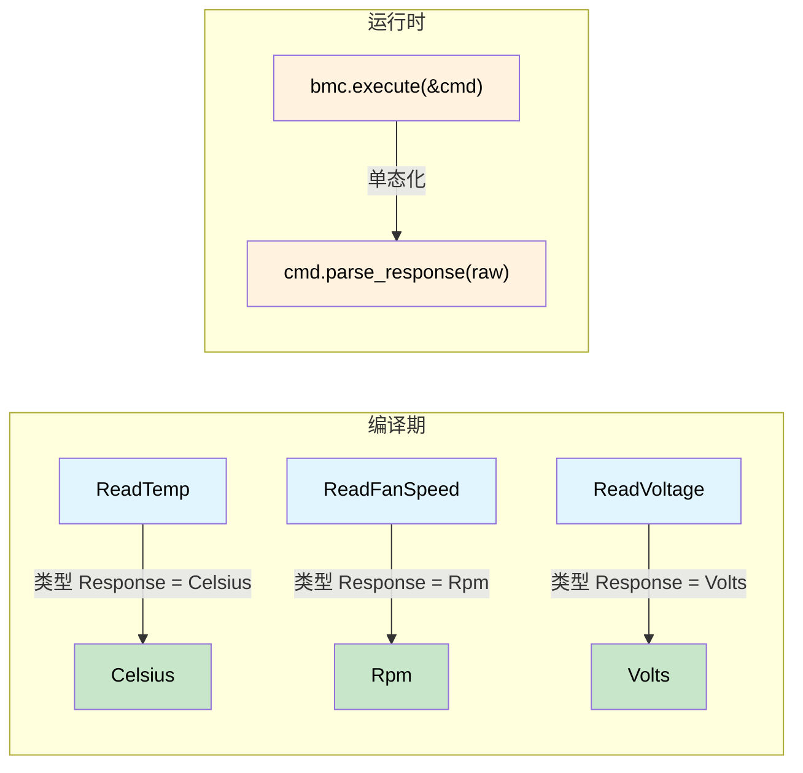

[English Original](../en/ch02-typed-command-interfaces-request-determi.md)

# 类型化命令接口 —— 请求决定响应 🟡

> **你将学到：**
> - 如何通过命令特性的关联类型在请求与响应之间建立编译期绑定。
> - 消除 IPMI、Redfish 和 NVMe 协议中常见的解析错误、单位混淆和隐式类型强制转换。

> **参考：** [第 1 章](ch01-the-philosophy-why-types-beat-tests.md)（理念）、[第 6 章](ch06-dimensional-analysis-making-the-compiler.md)（量纲类型）、[第 7 章](ch07-validated-boundaries-parse-dont-validate.md)（已验证边界）、[第 10 章](ch10-putting-it-all-together-a-complete-diagn.md)（综合应用）。

## 非类型化的泥潭

大多数硬件管理协议栈 —— 如 IPMI、Redfish、NVMe Admin、PLDM —— 最初都是以 `原始字节输入 → 原始字节输出` 的形式存在的。这产生了一类测试只能部分发现的 bug：

```rust,ignore
use std::io;

struct BmcRaw { /* ipmitool 句柄 */ }

impl BmcRaw {
    fn raw_command(&self, net_fn: u8, cmd: u8, data: &[u8]) -> io::Result<Vec<u8>> {
        // ... 调用 ipmitool ...
        Ok(vec![0x00, 0x19, 0x00]) // 存根示例
    }
}

fn diagnose_thermal(bmc: &BmcRaw) -> io::Result<()> {
    let raw = bmc.raw_command(0x04, 0x2D, &[0x20])?;
    let cpu_temp = raw[0] as f64;        // 🤞 字节 0 确实是读数吗？

    let raw = bmc.raw_command(0x04, 0x2D, &[0x30])?;
    let fan_rpm = raw[0] as u32;         // 🐛 风扇转速实际上是 2 字节的小端序

    let raw = bmc.raw_command(0x04, 0x2D, &[0x40])?;
    let voltage = raw[0] as f64;         // 🐛 还需要除以 1000

    if cpu_temp > fan_rpm as f64 {       // 🐛 在将摄氏度 (°C) 与转速 (RPM) 进行比较
        println!("糟糕");
    }

    log_temp(voltage);                   // 🐛 将电压作为温度传递
    Ok(())
}

fn log_temp(t: f64) { println!("温度: {t}°C"); }
```

| # | Bug | 发现时间 |
|---|-----|------------|
| 1 | 将风扇转速解析为 1 字节而非 2 字节 | 生产环境，凌晨 3 点 |
| 2 | 电压未进行缩放 | 所有的电源单元 (PSU) 都被标记为过压 |
| 3 | 将摄氏度与转速进行比较 | 可能永远不会被发现 |
| 4 | 电压被传递给了温度记录器 | 6 个月后在查看历史数据时才发现 |

**根本原因：** 一切都是 `Vec<u8>` → `f64` → 祈祷。

## 类型化命令模式

### 第一步 —— 领域新类型

```rust,ignore
#[derive(Debug, Clone, Copy, PartialEq, PartialOrd)]
pub struct Celsius(pub f64);

#[derive(Debug, Clone, Copy, PartialEq, PartialOrd)]
pub struct Rpm(pub u32);  // u32: 原始 IPMI 传感器值（整数 RPM）

#[derive(Debug, Clone, Copy, PartialEq, PartialOrd)]
pub struct Volts(pub f64);

#[derive(Debug, Clone, Copy, PartialEq, PartialOrd)]
pub struct Watts(pub f64);
```

> **关于 `Rpm(u32)` 与 `Rpm(f64)` 的说明：** 在本章中，内部类型使用 `u32`，因为 IPMI 传感器读数是整数值。在第 6 章（量纲分析）中，`Rpm` 将使用 `f64` 以支持算术运算（求平均值、缩放）。两者都是有效的 —— 无论内部类型如何，新类型都能防止单位混淆。

### 第二步 —— 命令特性（类型索引分派）

关联类型 `Response` 是关键所在 —— 它将每个命令结构体与其返回类型绑定在一起。每个实现该特性的结构体都会将 `Response` 固定为一个特定的领域类型，因此 `execute()` 总是返回精确的对应类型：

```rust,ignore
pub trait IpmiCmd {
    /// “类型索引” —— 决定了 execute() 的返回内容。
    type Response;

    fn net_fn(&self) -> u8;
    fn cmd_byte(&self) -> u8;
    fn payload(&self) -> Vec<u8>;

    /// 解析过程被封装在这里 —— 每个命令都清楚自己的字节布局。
    fn parse_response(&self, raw: &[u8]) -> io::Result<Self::Response>;
}
```

### 第三步 —— 每个命令一个结构体

```rust,ignore
pub struct ReadTemp { pub sensor_id: u8 }
impl IpmiCmd for ReadTemp {
    type Response = Celsius;
    fn net_fn(&self) -> u8 { 0x04 }
    fn cmd_byte(&self) -> u8 { 0x2D }
    fn payload(&self) -> Vec<u8> { vec![self.sensor_id] }
    fn parse_response(&self, raw: &[u8]) -> io::Result<Celsius> {
        if raw.is_empty() {
            return Err(io::Error::new(io::ErrorKind::InvalidData, "响应为空"));
        }
        // 注意：第 1 章的非类型化示例使用了 `raw[0] as i8 as f64`（有符号），
        // 那是因为该函数是在演示没有 SDR 元数据的通用解析。
        // 这里我们使用无符号（`as f64`），因为 IPMI 规范 §35.5 中的 
        // SDR 线性化公式会将无符号原始读数转换为经过校准的值。
        // 在生产环境中，请应用完整的 SDR 公式：result = (M × raw + B) × 10^(R_exp)。
        Ok(Celsius(raw[0] as f64))  // 原始字节，根据 SDR 公式进行转换
    }
}

pub struct ReadFanSpeed { pub fan_id: u8 }
impl IpmiCmd for ReadFanSpeed {
    type Response = Rpm;
    fn net_fn(&self) -> u8 { 0x04 }
    fn cmd_byte(&self) -> u8 { 0x2D }
    fn payload(&self) -> Vec<u8> { vec![self.fan_id] }
    fn parse_response(&self, raw: &[u8]) -> io::Result<Rpm> {
        if raw.len() < 2 {
            return Err(io::Error::new(io::ErrorKind::InvalidData,
                format!("风扇转速需要 2 个字节，实际得到 {}", raw.len())));
        }
        Ok(Rpm(u16::from_le_bytes([raw[0], raw[1]]) as u32))
    }
}

pub struct ReadVoltage { pub rail: u8 }
impl IpmiCmd for ReadVoltage {
    type Response = Volts;
    fn net_fn(&self) -> u8 { 0x04 }
    fn cmd_byte(&self) -> u8 { 0x2D }
    fn payload(&self) -> Vec<u8> { vec![self.rail] }
    fn parse_response(&self, raw: &[u8]) -> io::Result<Volts> {
        if raw.len() < 2 {
            return Err(io::Error::new(io::ErrorKind::InvalidData,
                format!("电压需要 2 个字节，实际得到 {}", raw.len())));
        }
        Ok(Volts(u16::from_le_bytes([raw[0], raw[1]]) as f64 / 1000.0))
    }
}
```

### 第四步 —— 执行器（零 `dyn`，单态化）

```rust,ignore
pub struct BmcConnection { pub timeout_secs: u32 }

impl BmcConnection {
    pub fn execute<C: IpmiCmd>(&self, cmd: &C) -> io::Result<C::Response> {
        let raw = self.raw_send(cmd.net_fn(), cmd.cmd_byte(), &cmd.payload())?;
        cmd.parse_response(&raw)
    }

    fn raw_send(&self, _nf: u8, _cmd: u8, _data: &[u8]) -> io::Result<Vec<u8>> {
        Ok(vec![0x19, 0x00]) // 存根示例
    }
}
```

### 第五步 —— 所有四个 Bug 都变成了编译错误

```rust,ignore
fn diagnose_thermal_typed(bmc: &BmcConnection) -> io::Result<()> {
    let cpu_temp: Celsius = bmc.execute(&ReadTemp { sensor_id: 0x20 })?;
    let fan_rpm:  Rpm     = bmc.execute(&ReadFanSpeed { fan_id: 0x30 })?;
    let voltage:  Volts   = bmc.execute(&ReadVoltage { rail: 0x40 })?;

    // Bug #1 —— 不可能发生：解析逻辑封装在 ReadFanSpeed::parse_response 中
    // Bug #2 —— 不可能发生：单位缩放在 ReadVoltage::parse_response 中完成

    // Bug #3 —— 编译错误：
    // if cpu_temp > fan_rpm { }
    //    ^^^^^^^^   ^^^^^^^ Celsius 与 Rpm 比较 → "mismatched types" (类型不匹配) ❌

    // Bug #4 —— 编译错误：
    // log_temperature(voltage);
    //                 ^^^^^^^ 得到的是 Volts，预期是 Celsius ❌

    if cpu_temp > Celsius(85.0) { println!("CPU 过热: {:?}", cpu_temp); }
    if fan_rpm < Rpm(4000)      { println!("风扇转速过慢: {:?}", fan_rpm); }

    Ok(())
}

fn log_temperature(t: Celsius) { println!("温度: {:?}", t); }
fn log_voltage(v: Volts)       { println!("电压: {:?}", v); }

## IPMI：不会混淆的传感器读取

添加新传感器只需增加一个结构体和一个实现 —— 无需分散的解析代码：

```rust,ignore
pub struct ReadPowerDraw { pub domain: u8 }
impl IpmiCmd for ReadPowerDraw {
    type Response = Watts;
    fn net_fn(&self) -> u8 { 0x04 }
    fn cmd_byte(&self) -> u8 { 0x2D }
    fn payload(&self) -> Vec<u8> { vec![self.domain] }
    fn parse_response(&self, raw: &[u8]) -> io::Result<Watts> {
        if raw.len() < 2 {
            return Err(io::Error::new(io::ErrorKind::InvalidData,
                format!("功耗需要 2 个字节，实际得到 {}", raw.len())));
        }
        Ok(Watts(u16::from_le_bytes([raw[0], raw[1]]) as f64))
    }
}

// 任何调用 bmc.execute(&ReadPowerDraw { domain: 0 }) 的地方
// 都会自动获得 Watts 返回值 —— 其他地方无需解析代码
```

### 隔离测试每个命令

```rust,ignore
#[cfg(test)]
mod tests {
    use super::*;

    struct StubBmc {
        responses: std::collections::HashMap<u8, Vec<u8>>,
    }

    impl StubBmc {
        fn execute<C: IpmiCmd>(&self, cmd: &C) -> io::Result<C::Response> {
            let key = cmd.payload()[0];
            let raw = self.responses.get(&key)
                .ok_or_else(|| io::Error::new(io::ErrorKind::NotFound, "未发现存根数据"))?;
            cmd.parse_response(raw)
        }
    }

    #[test]
    fn read_temp_parses_raw_byte() {
        let bmc = StubBmc {
            responses: [(0x20, vec![0x19])].into(), // 25 的十六进制 = 0x19
        };
        let temp = bmc.execute(&ReadTemp { sensor_id: 0x20 }).unwrap();
        assert_eq!(temp, Celsius(25.0));
    }

    #[test]
    fn read_fan_parses_two_byte_le() {
        let bmc = StubBmc {
            responses: [(0x30, vec![0x00, 0x19])].into(), // 0x1900 = 6400
        };
        let rpm = bmc.execute(&ReadFanSpeed { fan_id: 0x30 }).unwrap();
        assert_eq!(rpm, Rpm(6400));
    }

    #[test]
    fn read_voltage_scales_millivolts() {
        let bmc = StubBmc {
            responses: [(0x40, vec![0xE8, 0x2E])].into(), // 0x2EE8 = 12008 mV
        };
        let v = bmc.execute(&ReadVoltage { rail: 0x40 }).unwrap();
        assert!((v.0 - 12.008).abs() < 0.001);
    }
}
```

## Redfish：模式化 (Schema-Typed) 的 REST 端点

Redfish 更加契合这一模式 —— 每一个端点都返回 DMTF 定义的 JSON 模式：

```rust,ignore
use serde::Deserialize;

#[derive(Debug, Deserialize)]
pub struct ThermalResponse {
    #[serde(rename = "Temperatures")]
    pub temperatures: Vec<RedfishTemp>,
    #[serde(rename = "Fans")]
    pub fans: Vec<RedfishFan>,
}

#[derive(Debug, Deserialize)]
pub struct RedfishTemp {
    #[serde(rename = "Name")]
    pub name: String,
    #[serde(rename = "ReadingCelsius")]
    pub reading: f64,
    #[serde(rename = "UpperThresholdCritical")]
    pub critical_hi: Option<f64>,
    #[serde(rename = "Status")]
    pub status: RedfishHealth,
}

#[derive(Debug, Deserialize)]
pub struct RedfishFan {
    #[serde(rename = "Name")]
    pub name: String,
    #[serde(rename = "Reading")]
    pub rpm: u32,
    #[serde(rename = "Status")]
    pub status: RedfishHealth,
}

#[derive(Debug, Deserialize)]
pub struct PowerResponse {
    #[serde(rename = "Voltages")]
    pub voltages: Vec<RedfishVoltage>,
    #[serde(rename = "PowerSupplies")]
    pub psus: Vec<RedfishPsu>,
}

#[derive(Debug, Deserialize)]
pub struct RedfishVoltage {
    #[serde(rename = "Name")]
    pub name: String,
    #[serde(rename = "ReadingVolts")]
    pub reading: f64,
    #[serde(rename = "Status")]
    pub status: RedfishHealth,
}

#[derive(Debug, Deserialize)]
pub struct RedfishPsu {
    #[serde(rename = "Name")]
    pub name: String,
    #[serde(rename = "PowerOutputWatts")]
    pub output_watts: Option<f64>,
    #[serde(rename = "Status")]
    pub status: RedfishHealth,
}

#[derive(Debug, Deserialize)]
pub struct ProcessorResponse {
    #[serde(rename = "Model")]
    pub model: String,
    #[serde(rename = "TotalCores")]
    pub cores: u32,
    #[serde(rename = "Status")]
    pub status: RedfishHealth,
}

#[derive(Debug, Deserialize)]
pub struct RedfishHealth {
    #[serde(rename = "State")]
    pub state: String,
    #[serde(rename = "Health")]
    pub health: Option<String>,
}

/// 类型化 Redfish 端点 —— 每个端点都清楚其响应类型。
pub trait RedfishEndpoint {
    type Response: serde::de::DeserializeOwned;
    fn method(&self) -> &'static str;
    fn path(&self) -> String;
}

pub struct GetThermal { pub chassis_id: String }
impl RedfishEndpoint for GetThermal {
    type Response = ThermalResponse;
    fn method(&self) -> &'static str { "GET" }
    fn path(&self) -> String {
        format!("/redfish/v1/Chassis/{}/Thermal", self.chassis_id)
    }
}

pub struct GetPower { pub chassis_id: String }
impl RedfishEndpoint for GetPower {
    type Response = PowerResponse;
    fn method(&self) -> &'static str { "GET" }
    fn path(&self) -> String {
        format!("/redfish/v1/Chassis/{}/Power", self.chassis_id)
    }
}

pub struct GetProcessor { pub system_id: String, pub proc_id: String }
impl RedfishEndpoint for GetProcessor {
    type Response = ProcessorResponse;
    fn method(&self) -> &'static str { "GET" }
    fn path(&self) -> String {
        format!("/redfish/v1/Systems/{}/Processors/{}", self.system_id, self.proc_id)
    }
}

pub struct RedfishClient {
    pub base_url: String,
    pub auth_token: String,
}

impl RedfishClient {
    pub fn execute<E: RedfishEndpoint>(&self, endpoint: &E) -> io::Result<E::Response> {
        let url = format!("{}{}", self.base_url, endpoint.path());
        let json_bytes = self.http_request(endpoint.method(), &url)?;
        serde_json::from_slice(&json_bytes)
            .map_err(|e| io::Error::new(io::ErrorKind::InvalidData, e))
    }

    fn http_request(&self, _method: &str, _url: &str) -> io::Result<Vec<u8>> {
        Ok(vec![]) // 存根示例 —— 实际实现使用 reqwest/hyper
    }
}

// 用例 —— 完全类型化，自文档化
fn redfish_pre_flight(client: &RedfishClient) -> io::Result<()> {
    let thermal: ThermalResponse = client.execute(&GetThermal {
        chassis_id: "1".into(),
    })?;
    let power: PowerResponse = client.execute(&GetPower {
        chassis_id: "1".into(),
    })?;

    // ❌ 编译错误 —— 不能将 PowerResponse 传递给热检查函数：
    // check_thermals(&power);  → "expected ThermalResponse, found PowerResponse"

    for temp in &thermal.temperatures {
        if let Some(crit) = temp.critical_hi {
            if temp.reading > crit {
                println!("由于 {} 处于 {}°C（阈值: {}°C），情况紧急 (CRITICAL)！",
                    temp.name, temp.reading, crit);
            }
        }
    }
    Ok(())
}
```

## NVMe Admin：Identify 不会返回日志页

NVMe admin 命令遵循相同的模式。控制器区分命令操作码 (Opcode)，但在 C 语言中，调用者必须清楚哪种结构体对应 4 KB 完成缓冲区。类型化命令模式使得这种错误不可能发生：

```rust,ignore
use std::io;

/// NVMe Admin 命令特性 —— 形状与 IpmiCmd 相同。
pub trait NvmeAdminCmd {
    type Response;
    fn opcode(&self) -> u8;
    fn parse_completion(&self, data: &[u8]) -> io::Result<Self::Response>;
}

// ── Identify (操作码 0x06) ──

#[derive(Debug, Clone)]
pub struct IdentifyResponse {
    pub model_number: String,   // 字节 24–63
    pub serial_number: String,  // 字节 4–23
    pub firmware_rev: String,   // 字节 64–71
    pub total_capacity_gb: u64,
}

pub struct Identify {
    pub nsid: u32, // 0 = 控制器, >0 = 命名空间
}

impl NvmeAdminCmd for Identify {
    type Response = IdentifyResponse;
    fn opcode(&self) -> u8 { 0x06 }
    fn parse_completion(&self, data: &[u8]) -> io::Result<IdentifyResponse> {
        if data.len() < 4096 {
            return Err(io::Error::new(io::ErrorKind::InvalidData, "identify 数据过短"));
        }
        Ok(IdentifyResponse {
            serial_number: String::from_utf8_lossy(&data[4..24]).trim().to_string(),
            model_number: String::from_utf8_lossy(&data[24..64]).trim().to_string(),
            firmware_rev: String::from_utf8_lossy(&data[64..72]).trim().to_string(),
            total_capacity_gb: u64::from_le_bytes(
                data[280..288].try_into().unwrap()
            ) / (1024 * 1024 * 1024),
        })
    }
}

// ── Get Log Page (操作码 0x02) ──

#[derive(Debug, Clone)]
pub struct SmartLog {
    pub critical_warning: u8,
    pub temperature_kelvin: u16,
    pub available_spare_pct: u8,
    pub data_units_read: u128,
}

pub struct GetLogPage {
    pub log_id: u8, // 0x02 = SMART/健康状态
}

impl NvmeAdminCmd for GetLogPage {
    type Response = SmartLog;
    fn opcode(&self) -> u8 { 0x02 }
    fn parse_completion(&self, data: &[u8]) -> io::Result<SmartLog> {
        if data.len() < 512 {
            return Err(io::Error::new(io::ErrorKind::InvalidData, "日志页过短"));
        }
        Ok(SmartLog {
            critical_warning: data[0],
            temperature_kelvin: u16::from_le_bytes([data[1], data[2]]),
            available_spare_pct: data[3],
            data_units_read: u128::from_le_bytes(data[32..48].try_into().unwrap()),
        })
    }
}

// ── 执行器 ──

pub struct NvmeController { /* 文件描述符, BAR 等 */ }

impl NvmeController {
    pub fn admin_cmd<C: NvmeAdminCmd>(&self, cmd: &C) -> io::Result<C::Response> {
        let raw = self.submit_and_wait(cmd.opcode())?;
        cmd.parse_completion(&raw)
    }

    fn submit_and_wait(&self, _opcode: u8) -> io::Result<Vec<u8>> {
        Ok(vec![0u8; 4096]) // 存根示例 —— 实际实现使用 Doorbell 并等待完成队列 (CQ) 条目
    }
}

// ── 用例 ──

fn nvme_health_check(ctrl: &NvmeController) -> io::Result<()> {
    let id: IdentifyResponse = ctrl.admin_cmd(&Identify { nsid: 0 })?;
    let smart: SmartLog = ctrl.admin_cmd(&GetLogPage { log_id: 0x02 })?;

    // ❌ 编译错误 —— Identify 返回 IdentifyResponse，而非 SmartLog：
    // let smart: SmartLog = ctrl.admin_cmd(&Identify { nsid: 0 })?;

    println!("{} (固件 {}): {}°C, {}% 剩余容量",
        id.model_number, id.firmware_rev,
        smart.temperature_kelvin.saturating_sub(273),
        smart.available_spare_pct);

    Ok(())
}
```

上述三个协议的推进遵循了 **阶梯式渐进** 的方式（这也是第 7 章用于已验证边界的技术）：

| 阶段 | 协议 | 复杂度 | 新增内容 |
|:----:|----------|-----------|--------------|
| 1 | IPMI | 简单：传感器 ID → 读数 | 核心模式：`特性 + 关联类型` |
| 2 | Redfish | REST：端点 → 类型化 JSON | Serde 整合，模式化响应 |
| 3 | NVMe | 二进制：操作码 → 4 KB 结构体覆盖 | 原始缓冲区解析，多结构体完成数据 |

## 扩展：用于命令脚本的宏 DSL

```rust,ignore
/// 执行一系列类型化 IPMI 命令，并返回结果元组。
macro_rules! diag_script {
    ($bmc:expr; $($cmd:expr),+ $(,)?) => {{
        ( $( $bmc.execute(&$cmd)?, )+ )
    }};
}

fn full_pre_flight(bmc: &BmcConnection) -> io::Result<()> {
    let (temp, rpm, volts) = diag_script!(bmc;
        ReadTemp     { sensor_id: 0x20 },
        ReadFanSpeed { fan_id:    0x30 },
        ReadVoltage  { rail:      0x40 },
    );
    // 类型为：(Celsius, Rpm, Volts) —— 完全推导得出，位置交换即报错
    assert!(temp  < Celsius(95.0), "CPU 过热");
    assert!(rpm   > Rpm(3000),     "风扇转速过慢");
    assert!(volts > Volts(11.4),   "12V 线路电压下降");
    Ok(())
}
```

## 扩展：用于动态脚本的枚举分派

当命令在运行时源自 JSON 配置时：

```rust,ignore
pub enum AnyReading {
    Temp(Celsius),
    Rpm(Rpm),
    Volt(Volts),
    Watt(Watts),
}

pub enum AnyCmd {
    Temp(ReadTemp),
    Fan(ReadFanSpeed),
    Voltage(ReadVoltage),
    Power(ReadPowerDraw),
}

impl AnyCmd {
    pub fn execute(&self, bmc: &BmcConnection) -> io::Result<AnyReading> {
        match self {
            AnyCmd::Temp(c)    => Ok(AnyReading::Temp(bmc.execute(c)?)),
            AnyCmd::Fan(c)     => Ok(AnyReading::Rpm(bmc.execute(c)?)),
            AnyCmd::Voltage(c) => Ok(AnyReading::Volt(bmc.execute(c)?)),
            AnyCmd::Power(c)   => Ok(AnyReading::Watt(bmc.execute(c)?)),
        }
    }
}

fn run_dynamic_script(bmc: &BmcConnection, script: &[AnyCmd]) -> io::Result<Vec<AnyReading>> {
    script.iter().map(|cmd| cmd.execute(bmc)).collect()
}
```

## 模式家族

此模式适用于 **每一种** 硬件管理协议：

| 协议 | 请求类型 | 响应类型 |
|----------|-------------|---------------|
| IPMI 传感器读取 | `ReadTemp` | `Celsius` |
| Redfish REST | `GetThermal` | `ThermalResponse` |
| NVMe Admin | `Identify` | `IdentifyResponse` |
| PLDM | `GetFwParams` | `FwParamsResponse` |
| MCTP | `GetEid` | `EidResponse` |
| PCIe 配置空间 | `ReadCapability` | `CapabilityHeader` |
| SMBIOS/DMI | `ReadType17` | `MemoryDeviceInfo` |

请求类型 **决定了** 响应类型 —— 编译器在任何地方都会强制执行这一点。

## 类型化命令流程



## 练习：PLDM 类型化命令

为两个 PLDM 命令设计一个 `PldmCmd` 特性（形状与 `IpmiCmd` 相同）：
- `GetFwParams` → `FwParamsResponse { active_version: String, pending_version: Option<String> }`
- `QueryDeviceIds` → `DeviceIdResponse { descriptors: Vec<Descriptor> }`

要求：使用静态分派，`parse_response` 返回 `io::Result<Self::Response>`。

<details>
<summary>点击查看参考答案</summary>

```rust,ignore
use std::io;

pub trait PldmCmd {
    type Response;
    fn pldm_type(&self) -> u8;
    fn command_code(&self) -> u8;
    fn parse_response(&self, raw: &[u8]) -> io::Result<Self::Response>;
}

#[derive(Debug, Clone)]
pub struct FwParamsResponse {
    pub active_version: String,
    pub pending_version: Option<String>,
}

pub struct GetFwParams;
impl PldmCmd for GetFwParams {
    type Response = FwParamsResponse;
    fn pldm_type(&self) -> u8 { 0x05 } // 固件更新
    fn command_code(&self) -> u8 { 0x02 }
    fn parse_response(&self, raw: &[u8]) -> io::Result<FwParamsResponse> {
        // 简化版 —— 实际实现需要解码 PLDM 固件更新规范中的字段
        if raw.len() < 4 {
            return Err(io::Error::new(io::ErrorKind::InvalidData, "数据过短"));
        }
        Ok(FwParamsResponse {
            active_version: String::from_utf8_lossy(&raw[..4]).to_string(),
            pending_version: None,
        })
    }
}

#[derive(Debug, Clone)]
pub struct Descriptor { pub descriptor_type: u16, pub data: Vec<u8> }

#[derive(Debug, Clone)]
pub struct DeviceIdResponse { pub descriptors: Vec<Descriptor> }

pub struct QueryDeviceIds;
impl PldmCmd for QueryDeviceIds {
    type Response = DeviceIdResponse;
    fn pldm_type(&self) -> u8 { 0x05 }
    fn command_code(&self) -> u8 { 0x04 }
    fn parse_response(&self, raw: &[u8]) -> io::Result<DeviceIdResponse> {
        Ok(DeviceIdResponse { descriptors: vec![] }) // 存根示例
    }
}
```

</details>

## 关键要点

1. **关联类型 = 编译期合同** —— 命令特性上的 `type Response` 将每个请求锁定到精确的一个响应类型。
2. **解析逻辑被封装** —— 字节布局知识存在于 `parse_response` 中，而不是散落在调用方代码中。
3. **零成本分派** —— 泛型 `execute<C: IpmiCmd>` 会被单态化为直接调用，无需虚表。
4. **一个模式，多种协议** —— IPMI、Redfish、NVMe、PLDM、MCTP 都能套用 `trait Cmd { type Response; }` 这一形状。
5. **枚举分派连接静态与动态** —— 将类型化命令包装在枚举中，即可在不丢失类型安全的前提下，处理运行时驱动的脚本。
6. **渐进的复杂度增强直觉** —— IPMI (传感器 ID → 读数)、Redfish (端点 → JSON 模式) 和 NVMe (操作码 → 4 KB 结构体覆盖) 均使用相同的特性形状，但每一阶都增加了一层解析复杂度。

***
