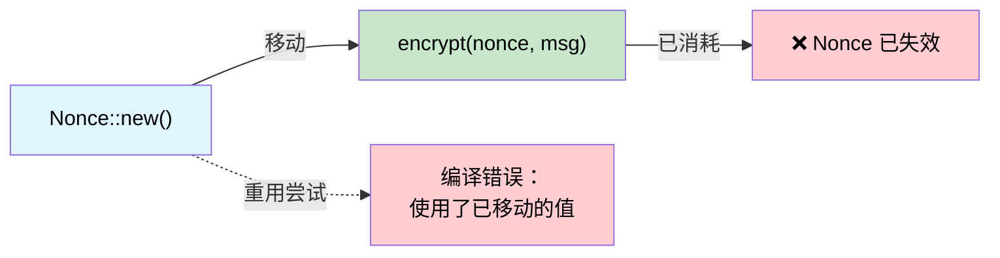

[English Original](../en/ch03-single-use-types-cryptographic-guarantee.md)

# 单次使用类型 —— 通过所有权提供密码学保证 🟡

> **你将学到：**
> - Rust 的移动语义 (Move semantics) 如何充当线性类型系统。
> - 在编译期消除 Nonce 重用、双重密钥协商以及意外的熔丝重复编程。

> **参考：** [第 1 章](ch01-the-philosophy-why-types-beat-tests.md)（理念）、[第 4 章](ch04-capability-tokens-zero-cost-proof-of-aut.md)（能力令牌）、[第 5 章](ch05-protocol-state-machines-type-state-for-r.md)（类型状态）、[第 14 章](ch14-testing-type-level-guarantees.md)（测试编译失败）。

## Nonce 重用灾难

在认证加密 (如 AES-GCM、ChaCha20-Poly1305) 中，使用相同的密钥重用 Nonce 是 **灾难性** 的 —— 这会泄露两个明文的异或 (XOR) 结果，通常还会泄露认证密钥本身。这并非理论上的担忧：

- **2016 年**：TLS 中 AES-GCM 的“被禁攻击 (Forbidden Attack)” —— Nonce 重用允许恢复明文。
- **2020 年**：由于随机数生成器 (RNG) 质量不佳，多个物联网 (IoT) 固件更新系统被发现重用了 Nonce。

在 C/C++ 中，Nonce 只是一个 `uint8_t[12]`。没有任何机制能阻止你使用它两次。

```c
// C 语言 —— 没有任何机制阻止 Nonce 重用
uint8_t nonce[12];
generate_nonce(nonce);
encrypt(key, nonce, msg1, out1);   // ✅ 第一次使用
encrypt(key, nonce, msg2, out2);   // 🐛 灾难：重用了相同的 Nonce
```

## 作为线性类型的移动语义

Rust 的所有权系统实际上是一个 **线性类型系统 (Linear type system)** —— 除非某个值实现了 `Copy`，否则它只能被使用一次 (被移动)。`ring` 库利用了这一点：

```rust,ignore
// ring::aead::Nonce 是：
// - 不支持 Clone
// - 不支持 Copy
// - 使用时按值消耗 (Consumed by value)
pub struct Nonce(/* 私有字段 */);

impl Nonce {
    pub fn try_assume_unique_for_key(value: &[u8]) -> Result<Self, Unspecified> {
        // ...
    }
    // 没有 Clone，没有 Copy —— 只能使用一次
}
```

当你将 `Nonce` 传递给 `seal_in_place()` 时，**它被移动了**：

```rust,ignore
// 镜像自 ring API 形状的伪代码
fn seal_in_place(
    key: &SealingKey,
    nonce: Nonce,       // ← 移动，而非借用
    data: &mut Vec<u8>,
) -> Result<(), Error> {
    // ... 原地加密数据 ...
    // nonce 被消耗 —— 无法再次使用
    Ok(())
}
```

尝试重用它：

```rust,ignore
fn bad_encrypt(key: &SealingKey, data1: &mut Vec<u8>, data2: &mut Vec<u8>) {
    // .unwrap() 是安全的 —— 12 字节数组始终是有效的 Nonce。
    let nonce = Nonce::try_assume_unique_for_key(&[0u8; 12]).unwrap();
    seal_in_place(key, nonce, data1).unwrap();  // ✅ nonce 在此处被移动
    // seal_in_place(key, nonce, data2).unwrap();
    //                    ^^^^^ 错误：使用了已移动的值 ❌
}
```

编译器 **证明了** 每个 Nonce 恰好被使用了一次。无需任何测试。

## 案例研究：ring 库的 Nonce

`ring` 库通过 `NonceSequence` 走得更远 —— 这是一个用于 **生成** Nonce 且同样不可克隆的特性 (Trait)：

```rust,ignore
/// 一个唯一的 Nonce 序列。
/// 不支持 Clone —— 一旦绑定到密钥，就无法被复制。
pub trait NonceSequence {
    fn advance(&mut self) -> Result<Nonce, Unspecified>;
}

/// SealingKey 包装了一个 NonceSequence —— 每次执行 seal() 都会自动递进。
pub struct SealingKey<N: NonceSequence> {
    key: UnboundKey,   // 构造时消耗
    nonce_seq: N,
}

impl<N: NonceSequence> SealingKey<N> {
    pub fn new(key: UnboundKey, nonce_seq: N) -> Self {
        // UnboundKey 被移动 —— 无法同时用于加密 (sealing) 和解密 (opening)
        SealingKey { key, nonce_seq }
    }

    pub fn seal_in_place_append_tag(
        &mut self,       // &mut —— 独占访问
        aad: Aad<&[u8]>,
        in_out: &mut Vec<u8>,
    ) -> Result<(), Unspecified> {
        let nonce = self.nonce_seq.advance()?; // 自动生成唯一的 Nonce
        // ... 使用 Nonce 进行加密 ...
        Ok(())
    }
}
# pub struct UnboundKey;
# pub struct Aad<T>(T);
# pub struct Unspecified;
```

所有权链条防止了：
1. **Nonce 重用** —— `Nonce` 不支持 `Clone`，在每次调用中被消耗。
2. **密钥复制** —— `UnboundKey` 被移动到 `SealingKey` 中，无法再用于制作 `OpeningKey`。
3. **序列复制** —— `NonceSequence` 不支持 `Clone`，因此没有两个密钥会共享同一个计数器。

**这些都不需要运行时检查。** 编译器强制执行了这三点。

## 案例研究：临时密钥协商 (Ephemeral Key Agreement)

临时 Diffie-Hellman 密钥必须 **仅使用一次**（这就是“临时”的含义）。`ring` 强制执行了这一点：

```rust,ignore
/// 一个临时私钥。不支持 Clone，不支持 Copy。
/// 被 agree_ephemeral() 消耗。
pub struct EphemeralPrivateKey { /* ... */ }

/// 计算共享密钥 —— 消耗私钥。
pub fn agree_ephemeral(
    my_private_key: EphemeralPrivateKey,  // ← 移动
    peer_public_key: &UnparsedPublicKey,
    error_value: Unspecified,
    kdf: impl FnOnce(&[u8]) -> Result<SharedSecret, Unspecified>,
) -> Result<SharedSecret, Unspecified> {
    // ... 执行 DH 计算 ...
    // my_private_key 被消耗 —— 永远无法再被使用
    # kdf(&[])
}
# pub struct UnparsedPublicKey;
# pub struct SharedSecret;
# pub struct Unspecified;
```

在调用 `agree_ephemeral()` 后，私钥 **不再存在于内存中**（它已被丢弃）。C++ 开发人员需要记住执行 `memset(key, 0, len)` 并希望编译器不会将其优化掉。而在 Rust 中，该密钥直接消失了。

## 硬件应用：一次性熔丝编程

服务器平台具有用于安全密钥、主板序列号和功能位的 **OTP (一次性可编程) 熔丝**。编写熔丝是不可逆的 —— 使用不同的数据重复编写两次会导致硬件损坏。这正是移动语义的完美适用场景：

```rust,ignore
use std::io;

/// 熔丝写操作负载。不支持 Clone，不支持 Copy。
/// 在对熔丝进行编程时按值消耗。
pub struct FusePayload {
    address: u32,
    data: Vec<u8>,
    // 私有构造函数 —— 只能通过经过验证的构造者模式 (Builder) 创建
}

/// 证明熔丝编程器处于正确状态。
pub struct FuseController {
    /* 硬件句柄 */
}

impl FuseController {
    /// 编写熔丝 —— 消耗负载，防止重复。
    pub fn program(
        &mut self,
        payload: FusePayload,  // ← 移动 —— 无法重复使用
    ) -> io::Result<()> {
        // ... 写入 OTP 硬件 ...
        // 负载被消耗 —— 尝试再次使用相同负载进行编程将引发编译错误
        Ok(())
    }
}

/// 带有验证功能的构造者 —— 创建 FusePayload 的唯一方式。
pub struct FusePayloadBuilder {
    address: Option<u32>,
    data: Option<Vec<u8>>,
}

impl FusePayloadBuilder {
    pub fn new() -> Self {
        FusePayloadBuilder { address: None, data: None }
    }

    pub fn address(mut self, addr: u32) -> Self {
        self.address = Some(addr);
        self
    }

    pub fn data(mut self, data: Vec<u8>) -> Self {
        self.data = Some(data);
        self
    }

    pub fn build(self) -> Result<FusePayload, &'static str> {
        let address = self.address.ok_or("必需提供地址")?;
        let data = self.data.ok_or("必需提供数据")?;
        if data.len() > 32 { return Err("熔丝数据过长"); }
        Ok(FusePayload { address, data })
    }
}

// 用例：
fn program_board_serial(ctrl: &mut FuseController) -> io::Result<()> {
    let payload = FusePayloadBuilder::new()
        .address(0x100)
        .data(b"SN12345678".to_vec())
        .build()
        .map_err(|e| io::Error::new(io::ErrorKind::InvalidInput, e))?;

    ctrl.program(payload)?;      // ✅ payload 被消耗

    // ctrl.program(payload);    // ❌ 错误：使用了已移动的值
    //              ^^^^^^^ 值被移动后重新尝试使用

    Ok(())
}
```

## 硬件应用：一次性校准令牌

某些传感器需要在每次上电周期中进行且仅进行一次校准步骤。校准令牌强制执行了这一点：

```rust,ignore
/// 每个上电周期发布一次。不支持 Clone，不支持 Copy。
pub struct CalibrationToken {
    _private: (),
}

pub struct SensorController {
    calibrated: bool,
}

impl SensorController {
    /// 在上电时调用一次 —— 返回校准令牌。
    pub fn power_on() -> (Self, CalibrationToken) {
        (
            SensorController { calibrated: false },
            CalibrationToken { _private: () },
        )
    }

    /// 校准传感器 —— 消耗令牌。
    pub fn calibrate(&mut self, _token: CalibrationToken) -> io::Result<()> {
        // ... 执行校准序列 ...
        self.calibrated = true;
        Ok(())
    }

    /// 读取传感器 —— 仅在校准后才有意义。
    ///
    /// **局限性**：移动语义的保证是 *部分的*。调用方可以 `drop(cal_token)` 
    /// 而不调用 `calibrate()` —— 令牌会被销毁，但校准不会运行。
    /// `#[must_use]` 注解 (见下文) 会生成警告，但不是硬性的错误。
    ///
    /// 这里的运行时 `self.calibrated` 检查是弥补这一空隙的 **安全网**。
    /// 有关完整的编译期解决方案，请参阅第 5 章中的类型状态 (Type-state) 模式，
    /// 其中 `send_command()` 仅在 `IpmiSession<Active>` 上可用。
    pub fn read(&self) -> io::Result<f64> {
        if !self.calibrated {
            return Err(io::Error::new(io::ErrorKind::Other, "尚未校准"));
        }
        Ok(25.0) // 存根示例
    }
}

fn sensor_workflow() -> io::Result<()> {
    let (mut ctrl, cal_token) = SensorController::power_on();

    // 必须在某处使用 cal_token —— 它不支持 Copy，
    // 因此在未消耗的情况下丢弃它会产生警告 (或通过 #[must_use] 产生错误)。
    ctrl.calibrate(cal_token)?;

    // 现在传感器读数可以工作：
    let temp = ctrl.read()?;
    println!("温度: {temp}°C");

    // 不能再执行校准 —— 令牌已被消耗：
    // ctrl.calibrate(cal_token);  // ❌ 使用了已移动的值

    Ok(())
}
```

### 何时使用单次使用类型

| 场景 | 是否使用单次使用 (移动) 语义？ |
|----------|:------:|
| 密码学 Nonce | ✅ 始终建议 —— Nonce 重用是灾难性的 |
| 临时密钥 (DH, ECDH) | ✅ 始终建议 —— 重用会削弱前向安全性 |
| OTP 熔丝编写 | ✅ 始终建议 —— 重复编写会导致硬件损坏 |
| 许可证激活码 | ✅ 通常建议 —— 阻止重复激活 |
| 校准令牌 | ✅ 通常建议 —— 强制每个会话仅执行一次 |
| 文件写入句柄 | ⚠️ 视情况而定 —— 取决于具体协议 |
| 数据库事务句柄 | ⚠️ 视情况而定 —— 提交/回滚通常是单次使用的 |
| 通用数据缓冲区 | ❌ 这些需要重用 —— 请使用 `&mut [u8]` |

## 单次使用所有权流程



## 练习：单次使用固件签名令牌

设计一个 `SigningToken`，它仅能被用于对固件映像执行一次签名：
- `SigningToken::issue(key_id: &str) -> SigningToken` (不支持 Clone，不支持 Copy)
- `sign(token: SigningToken, image: &[u8]) -> SignedImage` (消耗令牌)
- 尝试执行两次签名应当产生编译错误。

<details>
<summary>点击查看参考答案</summary>

```rust,ignore
pub struct SigningToken {
    key_id: String,
    // 不支持 Clone, 不支持 Copy
}

pub struct SignedImage {
    pub signature: Vec<u8>,
    pub key_id: String,
}

impl SigningToken {
    pub fn issue(key_id: &str) -> Self {
        SigningToken { key_id: key_id.to_string() }
    }
}

pub fn sign(token: SigningToken, _image: &[u8]) -> SignedImage {
    // 令牌经移动被消耗 —— 无法重用
    SignedImage {
        signature: vec![0xDE, 0xAD],  // 存根示例
        key_id: token.key_id,
    }
}

// ✅ 正常编译：
// let tok = SigningToken::issue("release-key");
// let signed = sign(tok, &firmware_bytes);
//
// ❌ 编译错误：
// let signed2 = sign(tok, &other_bytes);  // 错误：使用了已移动的值
```

</details>

## 关键要点

1. **移动 = 线性使用** —— 不支持 Clone 且不支持 Copy 的类型恰好能被消耗一次；编译器强制执行此规则。
2. **Nonce 重用是灾难性的** —— Rust 的所有权系统从结构上防止了这种情况，而非依赖程序员的自觉。
3. **该模式不仅适用于密码学** —— OTP 熔丝、校准令牌、审计条目 —— 任何必须至多执行一次的操作均适用。
4. **临时密钥免费获得前向安全性 (Forward secrecy)** —— 密钥协商过程产生的值被移动到派生的秘密中并随之消失。
5. **若有疑问，请移除 `Clone`** —— 你随时可以在以后加上它；但从已发布的 API 中移除它却是破坏性的变更。

***
