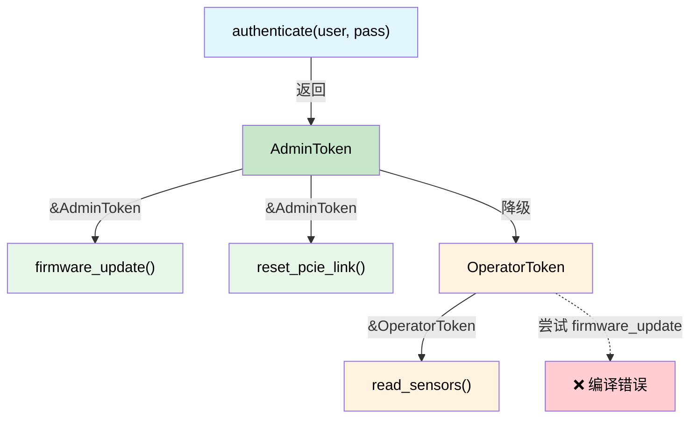

[English Original](../en/ch04-capability-tokens-zero-cost-proof-of-aut.md)

# 能力令牌 —— 零成本的权限证明 🟡

> **你将学到：**
> - 零大小类型 (ZSTs) 如何充当编译期证明令牌。
> - 在零运行时开销的情况下，强制执行权限层级、上电序列以及可撤销的授权。

> **参考：** [第 3 章](ch03-single-use-types-cryptographic-guarantee.md)（单次使用类型）、[第 5 章](ch05-protocol-state-machines-type-state-for-r.md)（类型状态）、[第 8 章](ch08-capability-mixins-compile-time-hardware-.md)（混入）、[第 10 章](ch10-putting-it-all-together-a-complete-diagn.md)（综合应用）。

## 问题：谁被允许做什么？

在硬件诊断中，某些操作是 **危险** 的：

- 编写 BMC 固件
- 重置 PCIe 链路
- 编写 OTP 熔丝
- 启用高压测试模式

在 C/C++ 中，这些操作通常通过运行时检查来保护：

```c
// C 语言 —— 运行时权限检查
int reset_pcie_link(bmc_handle_t bmc, int slot) {
    if (!bmc->is_admin) {        // 运行时检查
        return -EPERM;
    }
    if (!bmc->link_trained) {    // 另一个运行时检查
        return -EINVAL;
    }
    // ... 执行危险操作 ...
    return 0;
}
```

每个执行危险操作的函数都必须重复这些检查。一旦漏掉一个，就会产生提权漏洞。

## 作为证明令牌的零大小类型

**能力令牌 (Capability token)** 是一种零大小类型 (ZST)，它证明了调用者拥有执行某项操作的权限。它在运行时占用 **零字节** —— 它仅存在于类型系统中：

```rust,ignore
use std::marker::PhantomData;

/// 证明调用者拥有管理员权限。
/// 零大小 —— 会被完全编译掉。
/// 不支持 Clone，不支持 Copy —— 必须显式传递。
pub struct AdminToken {
    _private: (),   // 防止在此模块外被构造
}

/// 证明 PCIe 链路已训练完成并准备就绪。
pub struct LinkTrainedToken {
    _private: (),
}

pub struct BmcController { /* ... */ }

impl BmcController {
    /// 验证管理员身份 —— 返回一个能力令牌。
    /// 这是创建 AdminToken 的唯一方式。
    pub fn authenticate_admin(
        &mut self,
        credentials: &[u8],
    ) -> Result<AdminToken, &'static str> {
        // ... 验证凭据 ...
        # let valid = true;
        if valid {
            Ok(AdminToken { _private: () })
        } else {
            Err("身份验证失败")
        }
    }

    /// 训练 PCIe 链路 —— 返回链路已训练的证明。
    pub fn train_link(&mut self) -> Result<LinkTrainedToken, &'static str> {
        // ... 执行链路训练 ...
        Ok(LinkTrainedToken { _private: () })
    }

    /// 重置 PCIe 链路 —— 需要管理员证明 + 链路已训练证明。
    /// 无需运行时检查 —— 令牌本身即是证明。
    pub fn reset_pcie_link(
        &mut self,
        _admin: &AdminToken,         // 零成本权限证明
        _trained: &LinkTrainedToken,  // 零成本状态证明
        slot: u32,
    ) -> Result<(), &'static str> {
        println!("正在重置插槽 {slot} 上的 PCIe 链路");
        Ok(())
    }
}
```

用法 —— 类型系统强制执行了工作流：

```rust,ignore
fn maintenance_workflow(bmc: &mut BmcController) -> Result<(), &'static str> {
    // 第一步：验证身份 —— 获取管理员证明
    let admin = bmc.authenticate_admin(b"secret")?;

    // 第二步：训练链路 —— 获取已训练证明
    let trained = bmc.train_link()?;

    // 第三步：重置 —— 编译器要求提供两个令牌
    bmc.reset_pcie_link(&admin, &trained, 0)?;

    Ok(())
}

// 这段代码将无法编译：
fn unprivileged_attempt(bmc: &mut BmcController) -> Result<(), &'static str> {
    let trained = bmc.train_link()?;
    // bmc.reset_pcie_link(???, &trained, 0)?;
    //                     ^^^ 缺失 AdminToken —— 无法调用此函数
    Ok(())
}
```

编译后的二进制文件中，`AdminToken` 和 `LinkTrainedToken` 的大小为 **零字节**。它们仅在类型检查期间存在。函数签名 `fn reset_pcie_link(&mut self, _admin: &AdminToken, ...)` 是一种 **证明义务 (Proof obligation)** —— “只有当你能提供 `AdminToken` 时才可调用此函数” —— 而产生该令牌的唯一途径是通过 `authenticate_admin()`。

## 上电序列授权

服务器上电序列有严格的顺序要求：待机 (Standby) → 辅助 (Auxiliary) → 主供电 (Main) → CPU。颠倒顺序可能会损坏硬件。能力令牌可以强制执行该顺序：

```rust,ignore
/// 状态令牌 —— 每个令牌都证明了前一步已完成。
pub struct StandbyOn { _p: () }
pub struct AuxiliaryOn { _p: () }
pub struct MainOn { _p: () }
pub struct CpuPowered { _p: () }

pub struct PowerController { /* ... */ }

impl PowerController {
    /// 第一步：启用待机电源。无前置条件。
    pub fn enable_standby(&mut self) -> Result<StandbyOn, &'static str> {
        println!("待机电源已开启");
        Ok(StandbyOn { _p: () })
    }

    /// 第二步：启用辅助电源 —— 需要待机证明。
    pub fn enable_auxiliary(
        &mut self,
        _standby: &StandbyOn,
    ) -> Result<AuxiliaryOn, &'static str> {
        println!("辅助电源已开启");
        Ok(AuxiliaryOn { _p: () })
    }

    /// 第三步：启用主供电 —— 需要辅助证明。
    pub fn enable_main(
        &mut self,
        _aux: &AuxiliaryOn,
    ) -> Result<MainOn, &'static str> {
        println!("主供电已开启");
        Ok(MainOn { _p: () })
    }

    /// 第四步：为 CPU 供电 —— 需要主供电证明。
    pub fn power_cpu(
        &mut self,
        _main: &MainOn,
    ) -> Result<CpuPowered, &'static str> {
        println!("CPU 已上电");
        Ok(CpuPowered { _p: () })
    }
}

fn power_on_sequence(ctrl: &mut PowerController) -> Result<CpuPowered, &'static str> {
    let standby = ctrl.enable_standby()?;
    let aux = ctrl.enable_auxiliary(&standby)?;
    let main = ctrl.enable_main(&aux)?;
    let cpu = ctrl.power_cpu(&main)?;
    Ok(cpu)
}

// 尝试跳过步骤：
// fn wrong_order(ctrl: &mut PowerController) {
//     ctrl.power_cpu(???);  // ❌ 无法在没有调用 enable_main() 的情况下产生 MainOn
// }

## 层级化能力

真实系统是具有 **层级 (Hierarchies)** 的 —— 管理员可以执行用户所能执行的一切，甚至更多。可以通过 Trait 层级来对其进行建模：

```rust,ignore
/// 基础能力 —— 任何经过身份验证的人。
pub trait Authenticated {
    fn token_id(&self) -> u64;
}

/// 操作员 (Operator) 可以读取传感器并运行非破坏性的诊断。
pub trait Operator: Authenticated {}

/// 管理员 (Admin) 可以执行操作员所能执行的一切，外加破坏性的操作。
pub trait Admin: Operator {}

// 具体令牌：
pub struct UserToken { id: u64 }
pub struct OperatorToken { id: u64 }
pub struct AdminCapToken { id: u64 }

impl Authenticated for UserToken { fn token_id(&self) -> u64 { self.id } }
impl Authenticated for OperatorToken { fn token_id(&self) -> u64 { self.id } }
impl Operator for OperatorToken {}
impl Authenticated for AdminCapToken { fn token_id(&self) -> u64 { self.id } }
impl Operator for AdminCapToken {}
impl Admin for AdminCapToken {}

pub struct Bmc { /* ... */ }

impl Bmc {
    /// 任何经过身份验证的人都可以读取传感器。
    pub fn read_sensor(&self, _who: &impl Authenticated, id: u32) -> f64 {
        42.0 // 存根示例
    }

    /// 仅限操作员及以上级别可以运行诊断。
    pub fn run_diag(&mut self, _who: &impl Operator, test: &str) -> bool {
        true // 存根示例
    }

    /// 仅限管理员可以刷写固件。
    pub fn flash_firmware(&mut self, _who: &impl Admin, image: &[u8]) -> Result<(), &'static str> {
        Ok(()) // 存根示例
    }
}
```

`AdminCapToken` 可以被传递给任何函数 —— 它满足 `Authenticated`、`Operator` 和 `Admin` 的约束。而 `UserToken` 只能调用 `read_sensor()`。编译器在 **零运行时成本** 的前提下强制执行了完整的权限模型。

## 受生命周期限制的能力令牌

有时能力应当是 **作用域限定的 (Scoped)** —— 仅在特定的生命周期内有效。Rust 的借用检查器能自然地处理这种情况：

```rust,ignore
/// 作用域限定的管理员会话。该令牌借用了会话，
/// 因此它的存续时间不能超过会话。
pub struct AdminSession {
    _active: bool,
}

pub struct ScopedAdminToken<'session> {
    _session: &'session AdminSession,
}

impl AdminSession {
    pub fn begin(credentials: &[u8]) -> Result<Self, &'static str> {
        // ... 执行身份验证 ...
        Ok(AdminSession { _active: true })
    }

    /// 创建一个作用域限定的令牌 —— 存活时间与会话相同。
    pub fn token(&self) -> ScopedAdminToken<'_> {
        ScopedAdminToken { _session: self }
    }
}

fn scoped_example() -> Result<(), &'static str> {
    let session = AdminSession::begin(b"凭据")?;
    let token = session.token();

    // 在此作用域内使用令牌...
    // 当会话由于作用域结束而被丢弃时，令牌会被借用检查器立即使其失效。
    // 无需在运行时进行到期检查。

    // drop(session);
    // ❌ 错误：由于 session 被（持有其引用的 `token`）借用，因此无法将其移出
    //
    // 即使我们跳过销毁语句，仅仅尝试在会话超出作用域后使用 `token` —— 
    // 结果也是一样的：生命周期不匹配的编译错误。

    Ok(())
}
```

### 何时使用能力令牌

| 场景 | 模式 |
|----------|---------|
| 特权硬件操作 | ZST 证明令牌 (AdminToken) |
| 多步顺序操作 | 连续的状态令牌链 (StandbyOn → AuxiliaryOn → ...) |
| 基于角色的访问控制 (RBAC) | 特性层级 (Authenticated → Operator → Admin) |
| 时间受限的特权 | 受生命周期限制的令牌 (`ScopedAdminToken<'a>`) |
| 跨模块授权 | 公有令牌类型，私有构造函数 |

### 开销总结

| 内容 | 运行时开销 |
|------|:------:|
| 内存中的 ZST 令牌 | 0 字节 |
| 令牌参数传递 | 被 LLVM 优化掉 |
| 特性层级分派 | 静态分派 (单态化) |
| 生命周期强制执行 | 仅在编译期 |

**总运行时开销：零。** 权限模型仅存在于类型系统中。

## 能力令牌层级图



## 练习：分层诊断权限

设计一个三层能力系统：`ViewerToken`、`TechToken`、`EngineerToken`。
- 查看员 (Viewers) 可以调用 `read_status()`
- 技术员 (Techs) 还可以调用 `run_quick_diag()`
- 工程师 (Engineers) 还可以调用 `flash_firmware()`
- 更高层级可以执行较低层级的所有操作（使用特性约束或令牌转换）。

<details>
<summary>点击查看参考答案</summary>

```rust,ignore
// 令牌 —— 零大小，私有构造函数
pub struct ViewerToken { _private: () }
pub struct TechToken { _private: () }
pub struct EngineerToken { _private: () }

// 能力特性 —— 具有层级关系
pub trait CanView {}
pub trait CanDiag: CanView {}
pub trait CanFlash: CanDiag {}

impl CanView for ViewerToken {}
impl CanView for TechToken {}
impl CanView for EngineerToken {}
impl CanDiag for TechToken {}
impl CanDiag for EngineerToken {}
impl CanFlash for EngineerToken {}

pub fn read_status(_tok: &impl CanView) -> String {
    "状态：正常 (OK)".into()
}

pub fn run_quick_diag(_tok: &impl CanDiag) -> String {
    "诊断：通过 (PASS)".into()
}

pub fn flash_firmware(_tok: &impl CanFlash, _image: &[u8]) {
    // 只有工程师能执行到此处
}
```

</details>

## 关键要点

1. **ZST 令牌占用零字节** —— 它们仅存在于类型系统中；LLVM 会将其完全优化掉。
2. **私有构造函数 = 不可伪造** —— 只有您模块中的 `authenticate()` 函数可以“铸造”令牌。
3. **特性层级模拟权限级别** —— `CanFlash: CanDiag: CanView` 完美映射了现实中的 RBAC。
4. **受生命周期限制的令牌自动撤销** —— `ScopedAdminToken<'session>` 的存活时间无法超过会话本身。
5. **与类型状态模式 (第 5 章) 结合** 可用于需要身份验证 *且* 需按步骤操作的协议。

***
```
