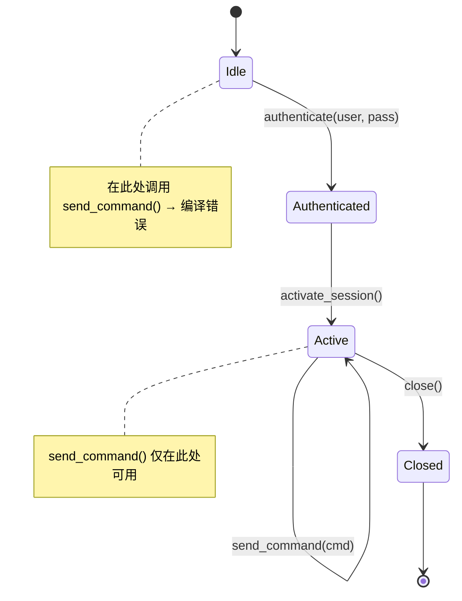
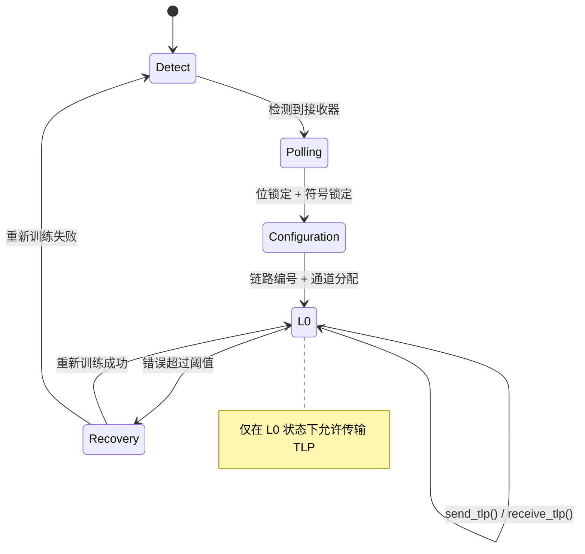
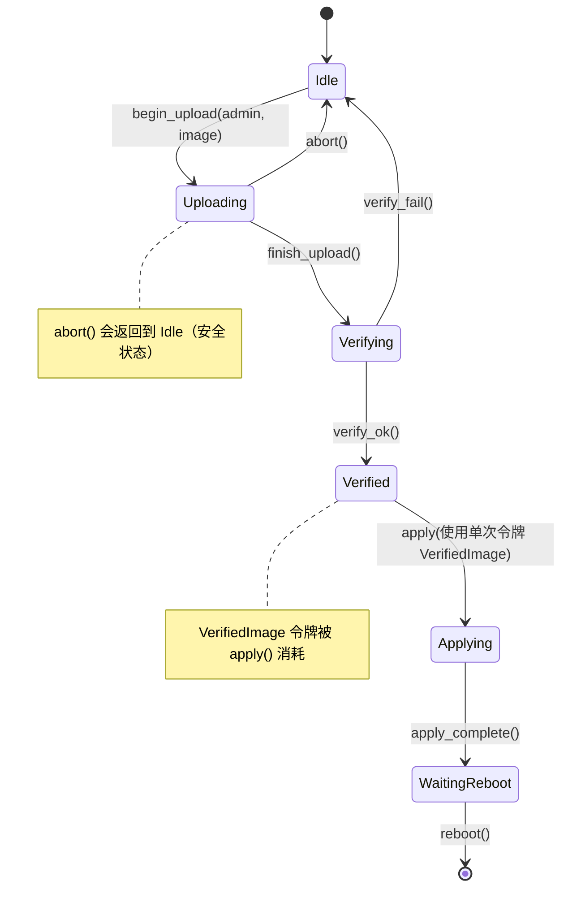

[English Original](../en/ch05-protocol-state-machines-type-state-for-r.md)

# 协议状态机 —— 真实硬件中的类型状态 (Type-State) 🔴

> **你将学到：**
> - 类型状态编码 (Type-state encoding) 如何将协议违规（如顺序错误的命令、关闭后使用）变为编译期错误。
> - 应用于 IPMI 会话生命周期和 PCIe 链路训练的实例。

> **参考：** [第 1 章](ch01-the-philosophy-why-types-beat-tests.md)（第 2 级 —— 状态正确性）、[第 4 章](ch04-capability-tokens-zero-cost-proof-of-aut.md)（能力令牌）、[第 9 章](ch09-phantom-types-for-resource-tracking.md)（虚构类型）、[第 11 章](ch11-fourteen-tricks-from-the-trenches.md)（技巧 4 —— 类型状态构造者模式，技巧 8 —— 异步类型状态）。

## 问题：协议违规

硬件协议具有 **严格的状态机**。IPMI 会话具有以下状态：
未认证 (Unauthenticated) → 已认证 (Authenticated) → 活动 (Active) → 已关闭 (Closed)。
PCIe 链路训练则经过以下过程：
检测 (Detect) → 轮询 (Polling) → 配置 (Configuration) → L0。
在错误的状态下发送命令会导致会话损坏或总线挂起。

**IPMI 会话状态机：**



**PCIe 链路训练状态机 (LTSSM)：**



在 C/C++ 中，通常使用枚举和运行时检查来跟踪状态：

```c
typedef enum { IDLE, AUTHENTICATED, ACTIVE, CLOSED } session_state_t;

typedef struct {
    session_state_t state;
    uint32_t session_id;
    // ...
} ipmi_session_t;

int ipmi_send_command(ipmi_session_t *s, uint8_t cmd, uint8_t *data, int len) {
    if (s->state != ACTIVE) {        // 运行时检查 —— 极易被遗忘
        return -EINVAL;
    }
    // ... 发送命令 ...
    return 0;
}
```

## 类型状态 (Type-State) 模式

通过类型状态，每个协议状态都是一个 **独立的类型**。状态转移则是通过消耗一个状态并返回另一个状态的方法来实现。编译器确保了在错误状态下无法调用某些方法，因为 **那些方法在对应的类型上根本不存在**。

```rust,ignore
use std::marker::PhantomData;

// 状态 —— 零大小的标记类型 (Marker types)
pub struct Idle;
pub struct Authenticated;
pub struct Active;
pub struct Closed;
```

### 案例研究：IPMI 会话生命周期

```rust,ignore
/// 由其当前状态泛型化的 IPMI 会话。
/// 状态仅存在于类型系统中（PhantomData 是零大小的）。
pub struct IpmiSession<State> {
    transport: String,     // 例如："192.168.1.100"
    session_id: Option<u32>,
    _state: PhantomData<State>,
}

// 转移：Idle → Authenticated
impl IpmiSession<Idle> {
    pub fn new(host: &str) -> Self {
        IpmiSession {
            transport: host.to_string(),
            session_id: None,
            _state: PhantomData,
        }
    }

    pub fn authenticate(
        self,              // ← 消耗处于 Idle 状态的会话
        user: &str,
        pass: &str,
    ) -> Result<IpmiSession<Authenticated>, String> {
        println!("正在 {} 上验证用户 {} ...", self.transport, user);
        Ok(IpmiSession {
            transport: self.transport,
            session_id: Some(42),
            _state: PhantomData,
        })
    }
}

// 转移：Authenticated → Active
impl IpmiSession<Authenticated> {
    pub fn activate(self) -> Result<IpmiSession<Active>, String> {
        // 由于类型状态的转移路径，此处 session_id 保证为 Some。
        println!("正在激活会话 {} ...", self.session_id.unwrap());
        Ok(IpmiSession {
            transport: self.transport,
            session_id: self.session_id,
            _state: PhantomData,
        })
    }
}

// 仅在 Active 状态下可用的操作
impl IpmiSession<Active> {
    pub fn send_command(&mut self, netfn: u8, cmd: u8, data: &[u8]) -> Vec<u8> {
        // 在 Active 状态下，session_id 保证为 Some。
        println!("在会话 {} 上发送命令 0x{cmd:02X} ...", self.session_id.unwrap());
        vec![0x00] // 存根示例：完成码 OK
    }

    pub fn close(self) -> IpmiSession<Closed> {
        // 在 Active 状态下，session_id 保证为 Some。
        println!("正在关闭会话 {} ...", self.session_id.unwrap());
        IpmiSession {
            transport: self.transport,
            session_id: None,
            _state: PhantomData,
        }
    }
}

fn ipmi_workflow() -> Result<(), String> {
    let session = IpmiSession::new("192.168.1.100");

    // session.send_command(0x04, 0x2D, &[]);
    //  ^^^^^^ 错误：IpmiSession<Idle> 上没有 `send_command` 方法 ❌

    let session = session.authenticate("admin", "password")?;

    // session.send_command(0x04, 0x2D, &[]);
    //  ^^^^^^ 错误：IpmiSession<Authenticated> 上没有 `send_command` 方法 ❌

    let mut session = session.activate()?;

    // ✅ 现在 send_command 存在了：
    let response = session.send_command(0x04, 0x2D, &[1]);

    let _closed = session.close();

    // _closed.send_command(0x04, 0x2D, &[]);
    //  ^^^^^^ 错误：IpmiSession<Closed> 上没有 `send_command` 方法 ❌

    Ok(())
}
```

**任何地方都没有运行时的状态检查。** 编译器强制执行了：
- 激活前必须经过身份验证
- 发送命令前必须激活
- 关闭后不得发送命令

## PCIe 链路训练状态机

PCIe 链路训练是 PCIe 规范中定义的多阶段协议。类型状态可以防止在链路准备就绪之前发送数据：

```rust,ignore
use std::marker::PhantomData;

// PCIe LTSSM 状态（已简化）
pub struct Detect;
pub struct Polling;
pub struct Configuration;
pub struct L0;         // 已完全就绪
pub struct Recovery;

pub struct PcieLink<State> {
    slot: u32,
    width: u8,          // 商定的宽度 (x1, x4, x8, x16)
    speed: u8,          // Gen1=1, Gen2=2, Gen3=3, Gen4=4, Gen5=5
    _state: PhantomData<State>,
}

impl PcieLink<Detect> {
    pub fn new(slot: u32) -> Self {
        PcieLink {
            slot, width: 0, speed: 0,
            _state: PhantomData,
        }
    }

    pub fn detect_receiver(self) -> Result<PcieLink<Polling>, String> {
        println!("插槽 {}: 检测到接收器", self.slot);
        Ok(PcieLink {
            slot: self.slot, width: 0, speed: 0,
            _state: PhantomData,
        })
    }
}

impl PcieLink<Polling> {
    pub fn poll_compliance(self) -> Result<PcieLink<Configuration>, String> {
        println!("插槽 {}: 轮询完成，进入配置阶段", self.slot);
        Ok(PcieLink {
            slot: self.slot, width: 0, speed: 0,
            _state: PhantomData,
        })
    }
}

impl PcieLink<Configuration> {
    pub fn negotiate(self, width: u8, speed: u8) -> Result<PcieLink<L0>, String> {
        println!("插槽 {}: 商定宽度为 x{width}，速度为 Gen{speed}", self.slot);
        Ok(PcieLink {
            slot: self.slot, width, speed,
            _state: PhantomData,
        })
    }
}

impl PcieLink<L0> {
    /// 发送一个 TLP —— 仅在链路完全训练完成 (L0) 时才可能执行。
    pub fn send_tlp(&mut self, tlp: &[u8]) -> Vec<u8> {
        println!("插槽 {}: 正在发送 {} 字节的 TLP", self.slot, tlp.len());
        vec![0x00] // 存根示例
    }

    /// 进入恢复模式 —— 返回到 Recovery 状态。
    pub fn enter_recovery(self) -> PcieLink<Recovery> {
        PcieLink {
            slot: self.slot, width: self.width, speed: self.speed,
            _state: PhantomData,
        }
    }

    pub fn link_info(&self) -> String {
        format!("x{} Gen{}", self.width, self.speed)
    }
}

impl PcieLink<Recovery> {
    pub fn retrain(self, speed: u8) -> Result<PcieLink<L0>, String> {
        println!("插槽 {}: 已在 Gen{speed} 下完成重新训练", self.slot);
        Ok(PcieLink {
            slot: self.slot, width: self.width, speed,
            _state: PhantomData,
        })
    }
}

fn pcie_workflow() -> Result<(), String> {
    let link = PcieLink::new(0);

    // link.send_tlp(&[0x01]);  // ❌ PcieLink<Detect> 上没有 `send_tlp` 方法

    let link = link.detect_receiver()?;
    let link = link.poll_compliance()?;
    let mut link = link.negotiate(16, 5)?; // x16 Gen5

    // ✅ 现在我们可以发送 TLP 了：
    let _resp = link.send_tlp(&[0x00, 0x01, 0x02]);
    println!("链路信息: {}", link.link_info());

    // 恢复与重新训练：
    let recovery = link.enter_recovery();
    let mut link = recovery.retrain(4)?;  // 降级到 Gen4
    let _resp = link.send_tlp(&[0x03]);

    Ok(())
}
```

## 将类型状态与能力令牌结合

类型状态和能力令牌可以自然地组合在一起。例如，一个既需要活动的 IPMI 会话又需要管理员权限的诊断操作：

```rust,ignore
# use std::marker::PhantomData;
# pub struct Active;
# pub struct AdminToken { _p: () }
# pub struct IpmiSession<S> { _s: PhantomData<S> }
# impl IpmiSession<Active> {
#     pub fn send_command(&mut self, _nf: u8, _cmd: u8, _d: &[u8]) -> Vec<u8> { vec![] }
# }

/// 运行固件更新 —— 需要：
/// 1. 活跃的 IPMI 会话（类型状态）
/// 2. 管理员特权（能力令牌）
pub fn firmware_update(
    session: &mut IpmiSession<Active>,   // 证明会话是活跃的
    _admin: &AdminToken,                 // 证明调用方是管理员
    image: &[u8],
) -> Result<(), String> {
    // 无需运行时检查 —— 函数签名本身就是检查
    session.send_command(0x2C, 0x01, image);
    Ok(())
}
```

调用方必须：
1. 创建会话 (`Idle`)
2. 对会话进行身份验证 (`Authenticated`)
3. 激活会话 (`Active`)
4. 获取 `AdminToken`
5. *只有在满足全部这些条件后*，才能调用 `firmware_update()`

这一切都在编译期强制执行，运行时开销为零。

## 阶段 3：固件更新 —— 组合了多阶段状态机的综合应用

固件更新的生命周期比会话状态机更为复杂，它还与能力令牌 (第 4 章) 以及单次使用类型 (第 3 章) 进行了组合。这是本书中最复杂的类型状态示例 —— 如果您能很好地理解它，那么您就已经掌握了这一模式。



```rust,ignore
use std::marker::PhantomData;

// ── 状态 ──
pub struct Idle;
pub struct Uploading;
pub struct Verifying;
pub struct Verified;
pub struct Applying;
pub struct WaitingReboot;

// ── 证明映像通过验证的一次性令牌 (第 3 章) ──
pub struct VerifiedImage {
    _private: (),
    pub digest: [u8; 32],
}

// ── 能力令牌：仅限管理员发起操作 (第 4 章) ──
pub struct FirmwareAdminToken { _private: () }

pub struct FwUpdate<S> {
    version: String,
    _state: PhantomData<S>,
}

impl FwUpdate<Idle> {
    pub fn new() -> Self {
        FwUpdate { version: String::new(), _state: PhantomData }
    }

    /// 开始上传 —— 需要管理员权限。
    pub fn begin_upload(
        self,
        _admin: &FirmwareAdminToken,
        version: &str,
    ) -> FwUpdate<Uploading> {
        println!("正在上传固件版本 v{version} ...");
        FwUpdate { version: version.to_string(), _state: PhantomData }
    }
}

impl FwUpdate<Uploading> {
    pub fn finish_upload(self) -> FwUpdate<Verifying> {
        println!("上传完成，正在验证 v{} ...", self.version);
        FwUpdate { version: self.version, _state: PhantomData }
    }

    /// 在上传过程中随时可以中止 (Abort) 并安全返回到 Idle 状态。
    pub fn abort(self) -> FwUpdate<Idle> {
        println!("上传已中止。");
        FwUpdate { version: String::new(), _state: PhantomData }
    }
}

impl FwUpdate<Verifying> {
    /// 验证成功后，产生一个单次使用的 VerifiedImage 令牌。
    pub fn verify_ok(self, digest: [u8; 32]) -> (FwUpdate<Verified>, VerifiedImage) {
        println!("版本 v{} 验证通过", self.version);
        (
            FwUpdate { version: self.version, _state: PhantomData },
            VerifiedImage { _private: (), digest },
        )
    }

    pub fn verify_fail(self) -> FwUpdate<Idle> {
        println!("验证失败 —— 返回到空闲 (Idle) 状态。");
        FwUpdate { version: String::new(), _state: PhantomData }
    }
}

impl FwUpdate<Verified> {
    /// apply 函数“消耗”了 VerifiedImage 令牌 —— 确保无法应用两次。
    pub fn apply(self, proof: VerifiedImage) -> FwUpdate<Applying> {
        println!("正在应用版本 v{} (摘要: {:02x?})", self.version, &proof.digest[..4]);
        // proof 被移动且被消耗 —— 无法重用
        FwUpdate { version: self.version, _state: PhantomData }
    }
}

impl FwUpdate<Applying> {
    pub fn apply_complete(self) -> FwUpdate<WaitingReboot> {
        println!("固件应用完成 —— 等待重启。");
        FwUpdate { version: self.version, _state: PhantomData }
    }
}

impl FwUpdate<WaitingReboot> {
    pub fn reboot(self) {
        println!("正在重启并加载版本 v{} ...", self.version);
    }
}

// ── 用例 ──

fn firmware_workflow() {
    let fw = FwUpdate::new();

    // fw.finish_upload();  // ❌ FwUpdate<Idle> 上没有 `finish_upload` 方法

    let admin = FirmwareAdminToken { _private: () }; // 源自身份验证系统
    let fw = fw.begin_upload(&admin, "2.10.1");
    let fw = fw.finish_upload();

    let digest = [0xAB; 32]; // 在验证过程中计算得出
    let (fw, token) = fw.verify_ok(digest);

    let fw = fw.apply(token);
    // fw.apply(token);  // ❌ 错误：使用了已移动的值 `token`

    let fw = fw.apply_complete();
    fw.reboot();
}
```

**上述三个阶段共同展示了：**

| 阶段 | 协议 | 状态数 | 组合方式 |
|:----:|----------|:------:|-------------|
| 1 | IPMI 会话 | 4 | 纯粹的类型状态 |
| 2 | PCIe LTSSM | 5 | 类型状态 + 恢复 (recovery) 分支 |
| 3 | 固件更新 | 6 | 类型状态 + 能力令牌 (第 4 章) + 一次性证明 (第 3 章) |

每个阶段都在增加复杂度。到第 3 阶段，编译器已经能够强制执行状态顺序、管理员权限以及一次性应用 —— 仅通过一个状态机就消除了三类错误。

### 何时使用类型状态

| 协议 | 值得使用类型状态吗？ |
|----------|:------:|
| IPMI 会话生命周期 | ✅ 是 —— 认证 → 激活 → 命令 → 关闭 |
| PCIe 链路训练 | ✅ 是 —— 检测 → 轮询 → 配置 → L0 |
| TLS 握手 | ✅ 是 —— ClientHello → ServerHello → Finished |
| USB 枚举 | ✅ 是 —— 已连接 → 已上电 → 默认 → 已寻址 → 已配置 |
| 简单的请求/响应 | ⚠️ 可能不值得 —— 仅有 2 个状态 |
| 即发即弃的消息 | ❌ 否 —— 没有状态需要跟踪 |

## 练习：USB 设备枚举类型状态

为必须经过以下过程的 USB 设备建模：`Attached (已连接)` → `Powered (已上电)` → `Default (默认)` → `Addressed (已寻址)` → `Configured (已配置)`。每个转移都应当消耗前一个状态并产生下一个状态。`send_data()` 方法应当仅在 `Configured` 状态下可用。

<details>
<summary>点击查看参考答案</summary>

```rust,ignore
use std::marker::PhantomData;

pub struct Attached;
pub struct Powered;
pub struct Default;
pub struct Addressed;
pub struct Configured;

pub struct UsbDevice<State> {
    address: u8,
    _state: PhantomData<State>,
}

impl UsbDevice<Attached> {
    pub fn new() -> Self {
        UsbDevice { address: 0, _state: PhantomData }
    }
    pub fn power_on(self) -> UsbDevice<Powered> {
        UsbDevice { address: self.address, _state: PhantomData }
    }
}

impl UsbDevice<Powered> {
    pub fn reset(self) -> UsbDevice<Default> {
        UsbDevice { address: self.address, _state: PhantomData }
    }
}

impl UsbDevice<Default> {
    pub fn set_address(self, addr: u8) -> UsbDevice<Addressed> {
        UsbDevice { address: addr, _state: PhantomData }
    }
}

impl UsbDevice<Addressed> {
    pub fn configure(self) -> UsbDevice<Configured> {
        UsbDevice { address: self.address, _state: PhantomData }
    }
}

impl UsbDevice<Configured> {
    pub fn send_data(&self, _data: &[u8]) {
        // 仅在 Configured 状态下可用
    }
}
```

</details>

## 关键要点

1. **类型状态使错误顺序的调用无法发生** —— 方法仅在这些方法处于有效状态时才存在。
2. **每次转移都会消耗 `self`** —— 转移后无法再持有旧状态。
3. **与能力令牌结合使用** —— `firmware_update()` 需要 *同时* 满足 `Session<Active>` 和 `AdminToken`。
4. **三个阶段，复杂度递增** —— IPMI（纯状态机）、PCIe LTSSM（带有恢复分支）和固件更新（状态机 + 令牌 + 一次性证明）展示了该模式如何从简单扩展到复杂的组合应用。
5. **不要过度使用** —— 只有两个状态的请求/响应协议在不使用类型状态的情况下会更简单。
6. **该模式可扩展到完整的 Redfish 工作流** —— 第 17 章将类型状态应用于 Redfish 会话生命周期，第 18 章则在响应构造中使用构造者类型状态。

***
