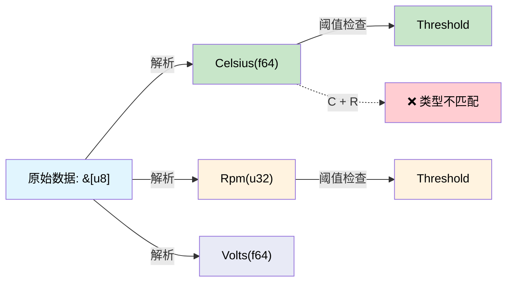

[English Original](../en/ch06-dimensional-analysis-making-the-compiler.md)

# 量纲分析 —— 让编译器检查单位 🟢

> **你将学到：**
> - 新类型 (Newtype) 包装与 `uom` 库如何将编译器转变为单位检查引擎。
> - 防止曾导致价值 3.28 亿美元航天器坠毁的那类 Bug。

> **参考：** [第 2 章](ch02-typed-command-interfaces-request-determi.md)（类型化命令使用这些类型）、[第 7 章](ch07-validated-boundaries-parse-dont-validate.md)（已验证边界）、[第 10 章](ch10-putting-it-all-together-a-complete-diagn.md)（综合应用）。

## 火星气候探测者号 (Mars Climate Orbiter)

1999 年，NASA 的火星气候探测者号坠毁，原因是其中一个团队发送的推力数据单位为 **磅力-秒 (pound-force seconds)**，而导航团队预期的单位是 **牛顿-秒 (newton-seconds)**。这导致航天器进入大气的实际高度为 57 公里而非 226 公里，最终在大气层中解体。
损失：3.276 亿美元。

根本原因在于：**这两个值都是 `double` 类型**。编译器无法区分它们。

这种同样的 Bug 潜伏在每一个涉及物理量的硬件诊断程序中：

```c
// C 语言 —— 全是 double，没有单位检查
double read_temperature(int sensor_id);   // 摄氏度？华氏度？开尔文？
double read_voltage(int channel);         // 伏特？毫伏？
double read_fan_speed(int fan_id);        // RPM？弧度/秒？

// Bug：将摄氏度与华氏度进行逻辑比较
if (read_temperature(0) > read_temperature(1)) { ... }  // 单位可能不同！
```

## 物理量的新类型

最简单的“正确构建 (Correct-by-construction)”方法是：**将每个单位包装在它自己的类型中**。

```rust,ignore
use std::fmt;

/// 以摄氏度 (°C) 为单位的温度。
#[derive(Debug, Clone, Copy, PartialEq, PartialOrd)]
pub struct Celsius(pub f64);

/// 以华氏度 (°F) 为单位的温度。
#[derive(Debug, Clone, Copy, PartialEq, PartialOrd)]
pub struct Fahrenheit(pub f64);

/// 以伏特 (V) 为单位的电压。
#[derive(Debug, Clone, Copy, PartialEq, PartialOrd)]
pub struct Volts(pub f64);

/// 以毫伏 (mV) 为单位的电压。
#[derive(Debug, Clone, Copy, PartialEq, PartialOrd)]
pub struct Millivolts(pub f64);

/// 以 RPM 为单位的风扇转速。
#[derive(Debug, Clone, Copy, PartialEq, PartialOrd)]
pub struct Rpm(pub f64);

// 转换必须是显式的：
impl From<Celsius> for Fahrenheit {
    fn from(c: Celsius) -> Self {
        Fahrenheit(c.0 * 9.0 / 5.0 + 32.0)
    }
}

impl From<Fahrenheit> for Celsius {
    fn from(f: Fahrenheit) -> Self {
        Celsius((f.0 - 32.0) * 5.0 / 9.0)
    }
}

impl From<Volts> for Millivolts {
    fn from(v: Volts) -> Self {
        Millivolts(v.0 * 1000.0)
    }
}

impl From<Millivolts> for Volts {
    fn from(mv: Millivolts) -> Self {
        Volts(mv.0 / 1000.0)
    }
}

impl fmt::Display for Celsius {
    fn fmt(&self, f: &mut fmt::Formatter<'_>) -> fmt::Result {
        write!(f, "{:.1}°C", self.0)
    }
}

impl fmt::Display for Rpm {
    fn fmt(&self, f: &mut fmt::Formatter<'_>) -> fmt::Result {
        write!(f, "{:.0} RPM", self.0)
    }
}
```

现在编译器可以捕捉到单位不匹配的错误：

```rust,ignore
# #[derive(Debug, Clone, Copy, PartialEq, PartialOrd)]
# pub struct Celsius(pub f64);
# #[derive(Debug, Clone, Copy, PartialEq, PartialOrd)]
# pub struct Volts(pub f64);

fn check_thermal_limit(temp: Celsius, limit: Celsius) -> bool {
    temp > limit  // ✅ 单位相同 —— 可以编译
}

// fn bad_comparison(temp: Celsius, voltage: Volts) -> bool {
//     temp > voltage  // ❌ 错误：类型不匹配 —— Celsius 与 Volts
// }
```

**运行时零开销** —— 新类型在编译后会还原为原始的 `f64` 值。包装类纯粹是一个类型层面的概念。

## 硬件物理量的 Newtype 宏

手动编写新类型会变得很啰嗦。使用宏可以消除这些样板代码：

```rust,ignore
/// 为物理量生成一个新类型。
macro_rules! quantity {
    ($Name:ident, $unit:expr) => {
        #[derive(Debug, Clone, Copy, PartialEq, PartialOrd)]
        pub struct $Name(pub f64);

        impl $Name {
            pub fn new(value: f64) -> Self { $Name(value) }
            pub fn value(self) -> f64 { self.0 }
        }

        impl std::fmt::Display for $Name {
            fn fmt(&self, f: &mut std::fmt::Formatter<'_>) -> std::fmt::Result {
                write!(f, "{:.2} {}", self.0, $unit)
            }
        }

        impl std::ops::Add for $Name {
            type Output = Self;
            fn add(self, rhs: Self) -> Self { $Name(self.0 + rhs.0) }
        }

        impl std::ops::Sub for $Name {
            type Output = Self;
            fn sub(self, rhs: Self) -> Self { $Name(self.0 - rhs.0) }
        }
    };
}

// 用法：
quantity!(Celsius, "°C");
quantity!(Fahrenheit, "°F");
quantity!(Volts, "V");
quantity!(Millivolts, "mV");
quantity!(Rpm, "RPM");
quantity!(Watts, "W");
quantity!(Amperes, "A");
quantity!(Pascals, "Pa");
quantity!(Hertz, "Hz");
quantity!(Bytes, "B");
```

每一行都会生成一个完整的类型，包含 Display、Add、Sub 以及比较运算符。**运行时开销全部为零。**

> **物理学警示：** 宏为 *所有* 物理量生成的 `Add` 实现中包含了 `Celsius`。将绝对温度相加 (`25°C + 30°C = 55°C`) 在物理学上是没有意义的 —— 通常你需要一个独立的 `TemperatureDelta` 类型来处理差值。`uom` 库（稍后展示）正确处理了这一点。对于仅进行比较和显示的简单传感器诊断，你可以不在温度类型中实现 `Add`/`Sub`，而仅在加法有意义的地方（瓦特、伏特、字节）保留它们。如果确实需要做差值运算，可以定义一个 `CelsiusDelta(f64)` 新类型并实现 `impl Add<CelsiusDelta> for Celsius`。

## 应用实例：传感器流水线

典型的诊断程序会读取原始 ADC 值、将其转换为物理单位并与阈值进行比较。通过量纲类型，每一步都能进行类型检查：

```rust,ignore
# macro_rules! quantity {
#     ($Name:ident, $unit:expr) => {
#         #[derive(Debug, Clone, Copy, PartialEq, PartialOrd)]
#         pub struct $Name(pub f64);
#         impl $Name {
#             pub fn new(value: f64) -> Self { $Name(value) }
#             pub fn value(self) -> f64 { self.0 }
#         }
#         impl std::fmt::Display for $Name {
#             fn fmt(&self, f: &mut std::fmt::Formatter<'_>) -> std::fmt::Result {
#                 write!(f, "{:.2} {}", self.0, $unit)
#             }
#         }
#     };
# }
# quantity!(Celsius, "°C");
# quantity!(Volts, "V");
# quantity!(Rpm, "RPM");

/// 原始 ADC 读数 —— 尚不代表任何物理量。
#[derive(Debug, Clone, Copy)]
pub struct AdcReading {
    pub channel: u8,
    pub raw: u16,   // 12 位 ADC 值 (0–4095)
}

/// 将 ADC 转换为物理单位的校准系数。
pub struct TemperatureCalibration {
    pub offset: f64,
    pub scale: f64,   // 每个 ADC 步进代表的 ℃ 数
}

pub struct VoltageCalibration {
    pub reference_mv: f64,
    pub divider_ratio: f64,
}

impl TemperatureCalibration {
    /// 将 raw ADC 转换为摄氏度 (°C)。返回类型保证了输出结果为 Celsius。
    pub fn convert(&self, adc: AdcReading) -> Celsius {
        Celsius::new(adc.raw as f64 * self.scale + self.offset)
    }
}

impl VoltageCalibration {
    /// 将 raw ADC 转换为伏特 (V)。返回类型保证了输出结果为 Volts。
    pub fn convert(&self, adc: AdcReading) -> Volts {
        Volts::new(adc.raw as f64 * self.reference_mv / 4096.0 / self.divider_ratio / 1000.0)
    }
}

/// 阈值检查 —— 仅在单位匹配时才能编译。
pub struct Threshold<T: PartialOrd> {
    pub warning: T,
    pub critical: T,
}

#[derive(Debug, PartialEq)]
pub enum ThresholdResult {
    Normal,
    Warning,
    Critical,
}

impl<T: PartialOrd> Threshold<T> {
    pub fn check(&self, value: &T) -> ThresholdResult {
        if *value >= self.critical {
            ThresholdResult::Critical
        } else if *value >= self.warning {
            ThresholdResult::Warning
        } else {
            ThresholdResult::Normal
        }
    }
}

fn sensor_pipeline_example() {
    let temp_cal = TemperatureCalibration { offset: -50.0, scale: 0.0625 };
    let temp_threshold = Threshold {
        warning: Celsius::new(85.0),
        critical: Celsius::new(100.0),
    };

    let adc = AdcReading { channel: 0, raw: 2048 };
    let temp: Celsius = temp_cal.convert(adc);

    let result = temp_threshold.check(&temp);
    println!("温度: {temp}, 状态: {result:?}");

    // 编译错误 —— 不能将摄氏度读数与伏特阈值进行比较：
    // let volt_threshold = Threshold {
    //     warning: Volts::new(11.4),
    //     critical: Volts::new(10.8),
    // };
    // volt_threshold.check(&temp);  // ❌ 错误：预期 &Volts，实际发现 &Celsius
}
```

**整个流水线** 都实现了静态类型检查：
- ADC 读数是原始计数值（并非单位）。
- 校准生成带有类型的量（Celsius、Volts）。
- 阈值对量的类型是泛型的。
- 将 Celsius 与 Volts 进行比较会引发 **编译错误**。

## uom 库

对于生产环境，[`uom`](https://crates.io/crates/uom) 库提供了包含数百种单位、自动转换且零运行时开销的全面量纲分析体系：

```rust,ignore
// Cargo.toml: uom = { version = "0.36", features = ["f64"] }
//
// use uom::si::f64::*;
// use uom::si::thermodynamic_temperature::degree_celsius;
// use uom::si::electric_potential::volt;
// use uom::si::power::watt;
//
// let temp = ThermodynamicTemperature::new::<degree_celsius>(85.0);
// let voltage = ElectricPotential::new::<volt>(12.0);
// let power = Power::new::<watt>(250.0);
//
// // temp + voltage;  // ❌ 编译错误 —— 无法将温度与电压相加
// // power > temp;    // ❌ 编译错误 —— 无法将功率与温度进行比较
```

当你需要自动派生单位（例如：Watts = Volts × Amperes）时，请使用 `uom`。如果你只需要简单物理量，而不需要派生单位算术运算，则使用手写的新类型。

### 何时使用量纲类型

| 场景 | 建议 |
|----------|---------------|
| 传感器读数 (温度, 电压, 风扇) | ✅ 始终如此 —— 防止单位混淆 |
| 阈值比较 | ✅ 始终如此 —— 使用泛型 `Threshold<T>` |
| 跨子系统数据交换 | ✅ 始终如此 —— 在 API 边界强制执行契约 |
| 内部计算 (全程使用相同单位) | ⚠️ 可选 —— 这种情况下出错概率较低 |
| 字符串/显示格式化 | ❌ 为该物理量类型实现 Display 特性即可 |

## 传感器流水线类型流转图



## 练习：功率预算计算器

创建 `Watts(f64)` 和 `Amperes(f64)` 新类型。实现：
- `Watts::from_vi(volts: Volts, amps: Amperes) -> Watts` (P = V × I)
- 一个 `PowerBudget` (功率预算)，用于跟踪总瓦数，并拒绝超过配置限额的增量。
- 尝试执行 `Watts + Celsius` 应当产生编译错误。

<details>
<summary>点击查看参考答案</summary>

```rust,ignore
#[derive(Debug, Clone, Copy, PartialEq, PartialOrd)]
pub struct Watts(pub f64);

#[derive(Debug, Clone, Copy, PartialEq, PartialOrd)]
pub struct Amperes(pub f64);

#[derive(Debug, Clone, Copy, PartialEq, PartialOrd)]
pub struct Volts(pub f64);

#[derive(Debug, Clone, Copy, PartialEq, PartialOrd)]
pub struct Celsius(pub f64);

impl Watts {
    pub fn from_vi(volts: Volts, amps: Amperes) -> Self {
        Watts(volts.0 * amps.0)
    }
}

impl std::ops::Add for Watts {
    type Output = Watts;
    fn add(self, rhs: Watts) -> Watts {
        Watts(self.0 + rhs.0)
    }
}

pub struct PowerBudget {
    total: Watts,
    limit: Watts,
}

impl PowerBudget {
    pub fn new(limit: Watts) -> Self {
        PowerBudget { total: Watts(0.0), limit }
    }
    pub fn add(&mut self, w: Watts) -> Result<(), String> {
        let new_total = Watts(self.total.0 + w.0);
        if new_total > self.limit {
            return Err(format!("功率预算超出：{:?} > {:?}", new_total, self.limit));
        }
        self.total = new_total;
        Ok(())
    }
}

// ❌ 编译错误：Watts + Celsius → "mismatched types"
// let bad = Watts(100.0) + Celsius(50.0);
```

</details>

## 关键要点

1. **新类型在零成本下防止单位混淆** —— `Celsius` 与 `Rpm` 内部都是 `f64`，但编译器将其视为不同的类型。
2. **火星气候探测者号的 Bug 不再可能发生** —— 将磅力单位传递给预期为牛顿单位的函数将引发编译错误。
3. **`quantity!` 宏能减少样板代码** —— 为每种单位快速生成 Display、算术运算和阈值逻辑。
4. **`uom` 库处理派生单位** —— 当你需要自动计算 `瓦特 = 伏特 × 安培` 时，请使用它。
5. **阈值对物理量是泛型的** —— `Threshold<Celsius>` 无法意外地与 `Threshold<Rpm>` 进行比较。
