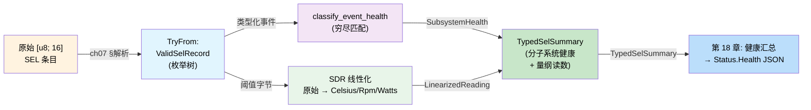
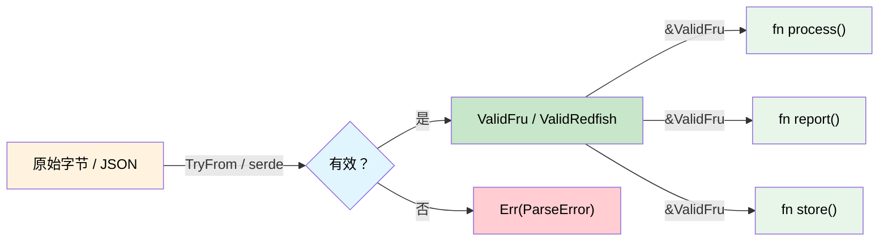

[English Original](../en/ch07-validated-boundaries-parse-dont-validate.md)

# 已验证边界 —— 解析，而非验证 🟡

> **你将学到：**
> - 如何在系统边界仅验证一次数据，将验证后的证明携带在专门的类型中，并永不重复检查。
> - 应用于 IPMI FRU 记录（扁平字节）、Redfish JSON（结构化文档）以及 IPMI SEL 记录（带有嵌套分派的多态二进制）的实例。
> - 包含一个完整的端到端演练。

> **参考：** [第 2 章](ch02-typed-command-interfaces-request-determi.md)（类型化命令）、[第 6 章](ch06-dimensional-analysis-making-the-compiler.md)（量纲类型）、[第 11 章](ch11-fourteen-tricks-from-the-trenches.md)（技巧 2 —— 密封特性，技巧 3 —— `#[non_exhaustive]`，技巧 5 —— FromStr）、[第 14 章](ch14-testing-type-level-guarantees.md)（proptest）。

## 问题：散弹枪式验证 (Shotgun Validation)

在典型的代码中，验证逻辑往往分散在各处。每个接收数据的函数都会为了“以防万一”而重新检查一遍：

```c
// C 语言 —— 验证逻辑散布在整个代码库中
int process_fru_data(uint8_t *data, int len) {
    if (data == NULL) return -1;          // 检查：非空
    if (len < 8) return -1;              // 检查：最小长度
    if (data[0] != 0x01) return -1;      // 检查：格式版本
    if (checksum(data, len) != 0) return -1; // 检查：校验和

    // ... 另外 10 个函数也在重复同样的检查 ...
}
```

这种模式（“散弹枪式验证”）有两个主要问题：
1. **冗余** —— 同样的检查逻辑出现在几十个地方。
2. **不完整性** —— 只要在其中一个函数中漏掉了一个检查，就可能会产生 Bug。

## 解析，而非验证 (Parse, Don't Validate)

“正确构建 (Correct-by-construction)”的方法是：**在边界处仅验证一次，然后将验证后的证明携带在类型中**。

```rust,ignore
/// 来自线路的原始字节 —— 尚未经过验证。
#[derive(Debug)]
pub struct RawFruData(Vec<u8>);
```

### 案例研究：IPMI FRU 数据

```rust,ignore
# #[derive(Debug)]
# pub struct RawFruData(Vec<u8>);

/// 已验证的 IPMI FRU 数据。只能通过 TryFrom 创建，
/// 后者强制执行所有不变式。一旦你拥有了 ValidFru，
/// 就保证了所有数据都是正确的。
#[derive(Debug)]
pub struct ValidFru {
    format_version: u8,
    internal_area_offset: u8,
    chassis_area_offset: u8,
    board_area_offset: u8,
    product_area_offset: u8,
    data: Vec<u8>,
}

#[derive(Debug)]
pub enum FruError {
    TooShort { actual: usize, minimum: usize },
    BadFormatVersion(u8),
    ChecksumMismatch { expected: u8, actual: u8 },
    InvalidAreaOffset { area: &'static str, offset: u8 },
}

impl std::fmt::Display for FruError {
    fn fmt(&self, f: &mut std::fmt::Formatter<'_>) -> std::fmt::Result {
        match self {
            Self::TooShort { actual, minimum } =>
                write!(f, "FRU 数据太短：实际 {} 字节（最小需 {} 字节）", actual, minimum),
            Self::BadFormatVersion(v) =>
                write!(f, "不支持的 FRU 格式版本：{v}"),
            Self::ChecksumMismatch { expected, actual } =>
                write!(f, "校验和不匹配：预期 0x{expected:02X}，实际得到 0x{actual:02X}"),
            Self::InvalidAreaOffset { area, offset } =>
                write!(f, "无效的 {area} 区域偏移量：{offset}"),
        }
    }
}

impl TryFrom<RawFruData> for ValidFru {
    type Error = FruError;

    fn try_from(raw: RawFruData) -> Result<Self, FruError> {
        let data = raw.0;

        // 1. 长度检查
        if data.len() < 8 {
            return Err(FruError::TooShort {
                actual: data.len(),
                minimum: 8,
            });
        }

        // 2. 格式版本
        if data[0] != 0x01 {
            return Err(FruError::BadFormatVersion(data[0]));
        }

        // 3. 校验和（头部为前 8 字节，校验和位于第 7 字节）
        let checksum: u8 = data[..8].iter().fold(0u8, |acc, &b| acc.wrapping_add(b));
        if checksum != 0 {
            return Err(FruError::ChecksumMismatch {
                expected: 0,
                actual: checksum,
            });
        }

        // 4. 区域偏移量必须在范围内
        for (name, idx) in [
            ("内部 (internal)", 1), ("机箱 (chassis)", 2),
            ("主板 (board)", 3), ("产品 (product)", 4),
        ] {
            let offset = data[idx];
            if offset != 0 && (offset as usize * 8) >= data.len() {
                return Err(FruError::InvalidAreaOffset {
                    area: name,
                    offset,
                });
            }
        }

        // 所有检查通过 —— 构造已验证的类型
        Ok(ValidFru {
            format_version: data[0],
            internal_area_offset: data[1],
            chassis_area_offset: data[2],
            board_area_offset: data[3],
            product_area_offset: data[4],
            data,
        })
    }
}

impl ValidFru {
    /// 无需验证 —— 类型本身保证了正确性。
    pub fn board_area(&self) -> Option<&[u8]> {
        if self.board_area_offset == 0 {
            return None;
        }
        let start = self.board_area_offset as usize * 8;
        Some(&self.data[start..])  // 安全 —— 解析期间已完成边界检查
    }

    pub fn product_area(&self) -> Option<&[u8]> {
        if self.product_area_offset == 0 {
            return None;
        }
        let start = self.product_area_offset as usize * 8;
        Some(&self.data[start..])
    }

    pub fn format_version(&self) -> u8 {
        self.format_version
    }
}

/// 此函数不需要验证 FRU 数据。
/// 函数签名保证了它已经是有效的。
fn extract_board_serial(fru: &ValidFru) -> Option<String> {
    let board = fru.board_area()?;
    // ... 从板卡区域解析序列号 ...
    // 无需手动边界检查 —— ValidFru 保证了偏移量在范围内
    Some("ABC123".to_string()) // 存根示例
}

fn extract_board_manufacturer(fru: &ValidFru) -> Option<String> {
    let board = fru.board_area()?;
    // 依然无需验证 —— 同样的保证
    Some("Acme Corp".to_string()) // 存根示例
}

## 已验证的 Redfish JSON

同样的模式也适用于 Redfish API 响应。解析一次，将有效性携带在类型中：

```rust,ignore
use std::collections::HashMap;

/// 来自 Redfish 端点的原始 JSON 字符串。
pub struct RawRedfishResponse(pub String);

/// 已验证的 Redfish 热参数 (Thermal) 响应。
/// 保证所有必填字段都存在且在范围内。
#[derive(Debug)]
pub struct ValidThermalResponse {
    pub temperatures: Vec<ValidTemperatureReading>,
    pub fans: Vec<ValidFanReading>,
}

#[derive(Debug)]
pub struct ValidTemperatureReading {
    pub name: String,
    pub reading_celsius: f64,     // 保证非 NaN，且在传感器范围内
    pub upper_critical: f64,
    pub status: HealthStatus,
}

#[derive(Debug)]
pub struct ValidFanReading {
    pub name: String,
    pub reading_rpm: u32,        // 保证存在的风扇转速 > 0
    pub status: HealthStatus,
}

#[derive(Debug, Clone, Copy, PartialEq)]
pub enum HealthStatus {
    Ok,
    Warning,
    Critical,
}

#[derive(Debug)]
pub enum RedfishValidationError {
    MissingField(&'static str),
    OutOfRange { field: &'static str, value: f64 },
    InvalidStatus(String),
}

impl std::fmt::Display for RedfishValidationError {
    fn fmt(&self, f: &mut std::fmt::Formatter<'_>) -> std::fmt::Result {
        match self {
            Self::MissingField(name) => write!(f, "缺失必填字段：{name}"),
            Self::OutOfRange { field, value } =>
                write!(f, "字段 {field} 超出范围：{value}"),
            Self::InvalidStatus(s) => write!(f, "无效的健康状态：{s}"),
        }
    }
}

// 一旦验证通过，下游代码永不重复检查：
fn check_thermal_health(thermal: &ValidThermalResponse) -> bool {
    // 无需检查缺失字段或 NaN 值。
    // ValidThermalResponse 保证了所有读数都是合理的。
    thermal.temperatures.iter().all(|t| {
        t.reading_celsius < t.upper_critical && t.status != HealthStatus::Critical
    }) && thermal.fans.iter().all(|f| {
        f.reading_rpm > 0 && f.status != HealthStatus::Critical
    })
}
```

## 多态验证：IPMI SEL 记录

前两个案例研究验证的是 **扁平** 的结构 —— 固定字节布局 (FRU) 和已知的 JSON 模式 (Redfish)。现实世界的数据通常是 **多态的 (Polymorphic)**：后续字节的解释取决于之前的字节。IPMI 系统事件日志 (SEL) 记录就是最典型的示例。

### 问题的形态

每条 SEL 记录都恰好是 16 字节。但这些字节的 *含义* 取决于一套分派链 (Dispatch chain)：

```
字节 2：记录类型 (Record Type)
  ├─ 0x02 → 系统事件 (System Event)
  │    字节 10[6:4]：事件类型 (Event Type)
  │      ├─ 0x01       → 阈值事件 (读数 + 阈值位于数据字节 2-3)
  │      ├─ 0x02-0x0C  → 离散事件 (位于偏移量字段中的位)
  │      └─ 0x6F       → 传感器特定 (含义取决于字节 7 的传感器类型)
  │           字节 7：传感器类型 (Sensor Type)
  │             ├─ 0x01 → 温度事件
  │             ├─ 0x02 → 电压事件
  │             ├─ 0x04 → 风扇事件
  │             ├─ 0x07 → 处理器事件
  │             ├─ 0x0C → 内存事件
  │             ├─ 0x08 → 电源事件
  │             └─ ...  → (IPMI 2.0 表 42-3 中的 42 种传感器类型)
  ├─ 0xC0-0xDF → 带时间戳的 OEM 记录
  └─ 0xE0-0xFF → 不带时间戳的 OEM 记录
```

在 C 中，这通常是 `switch` 嵌套 `switch` 再嵌套 `switch`，每一层都共享同一个 `uint8_t *data` 指针。只要漏掉一层、错读了规范表、或者索引了错误的字节 —— 这种 Bug 是无声无息的。

```c
// C 语言 —— 多态解析问题
void process_sel_entry(uint8_t *data, int len) {
    if (data[2] == 0x02) {  // 系统事件
        uint8_t event_type = (data[10] >> 4) & 0x07;
        if (event_type == 0x01) {  // 阈值 (threshold)
            uint8_t reading = data[11];   // 🐛 还是 data[13]？
            uint8_t threshold = data[12]; // 🐛 规范说字节 12 是触发器，而非阈值
            printf("Temp: %d crossed %d\n", reading, threshold);
        } else if (event_type == 0x6F) {  // 传感器特定
            uint8_t sensor_type = data[7];
            if (sensor_type == 0x0C) {  // 内存 (memory)
                // 🐛 忘记检查事件数据 1 的偏移量位
                printf("Memory ECC error\n");
            }
            // 🐛 缺少 else —— 默默地丢弃了 30 多种其他传感器类型
        }
    }
    // 🐛 OEM 记录类型被默默忽略
}
```

### 第一步 —— 解析外层框架 (Outer Frame)

第一个 `TryFrom` 在记录类型上进行分派 —— 这是联合体 (Union) 的最外层：

```rust,ignore
/// 来自 `Get SEL Entry` (IPMI 命令 0x43) 的原始 16 字节 SEL 记录。
pub struct RawSelRecord(pub [u8; 16]);

/// 已验证的 SEL 记录 —— 记录类型已分派，所有字段均已检查。
pub enum ValidSelRecord {
    SystemEvent(SystemEventRecord),
    OemTimestamped(OemTimestampedRecord),
    OemNonTimestamped(OemNonTimestampedRecord),
}

#[derive(Debug)]
pub struct OemTimestampedRecord {
    pub record_id: u16,
    pub timestamp: u32,
    pub manufacturer_id: [u8; 3],
    pub oem_data: [u8; 6],
}

#[derive(Debug)]
pub struct OemNonTimestampedRecord {
    pub record_id: u16,
    pub oem_data: [u8; 13],
}

#[derive(Debug)]
pub enum SelParseError {
    UnknownRecordType(u8),
    UnknownSensorType(u8),
    UnknownEventType(u8),
    InvalidEventData { reason: &'static str },
}

impl std::fmt::Display for SelParseError {
    fn fmt(&self, f: &mut std::fmt::Formatter<'_>) -> std::fmt::Result {
        match self {
            Self::UnknownRecordType(t) => write!(f, "未知记录类型：0x{t:02X}"),
            Self::UnknownSensorType(t) => write!(f, "未知传感器类型：0x{t:02X}"),
            Self::UnknownEventType(t) => write!(f, "未知事件类型：0x{t:02X}"),
            Self::InvalidEventData { reason } => write!(f, "无效事件数据：{reason}"),
        }
    }
}

impl TryFrom<RawSelRecord> for ValidSelRecord {
    type Error = SelParseError;

    fn try_from(raw: RawSelRecord) -> Result<Self, SelParseError> {
        let d = &raw.0;
        let record_id = u16::from_le_bytes([d[0], d[1]]);

        match d[2] {
            0x02 => {
                let system = parse_system_event(record_id, d)?;
                Ok(ValidSelRecord::SystemEvent(system))
            }
            0xC0..=0xDF => {
                Ok(ValidSelRecord::OemTimestamped(OemTimestampedRecord {
                    record_id,
                    timestamp: u32::from_le_bytes([d[3], d[4], d[5], d[6]]),
                    manufacturer_id: [d[7], d[8], d[9]],
                    oem_data: [d[10], d[11], d[12], d[13], d[14], d[15]],
                }))
            }
            0xE0..=0xFF => {
                Ok(ValidSelRecord::OemNonTimestamped(OemNonTimestampedRecord {
                    record_id,
                    oem_data: [d[3], d[4], d[5], d[6], d[7], d[8], d[9],
                               d[10], d[11], d[12], d[13], d[14], d[15]],
                }))
            }
            other => Err(SelParseError::UnknownRecordType(other)),
        }
    }
}
```

在这个边界之后，所有消费者都在枚举上进行匹配。编译器强制要求处理全部三种记录类型 —— 你绝不会“忘记”处理 OEM 记录。

### 第二步 —— 解析系统事件：传感器类型 → 类型化事件

内部分派将事件数据字节转换为一个由传感器类型索引的和类型 (Sum type)。在这里，C 语言中的嵌套 `switch` 变成了一个嵌套枚举：

```rust,ignore
#[derive(Debug)]
pub struct SystemEventRecord {
    pub record_id: u16,
    pub timestamp: u32,
    pub generator: GeneratorId,
    pub sensor_type: SensorType,
    pub sensor_number: u8,
    pub event_direction: EventDirection,
    pub event: TypedEvent,      // ← 关键点：事件数据是类型化的 (TYPED)
}

#[derive(Debug)]
pub enum GeneratorId {
    Software(u8),
    Ipmb { slave_addr: u8, channel: u8, lun: u8 },
}

#[derive(Debug, Clone, Copy, PartialEq)]
pub enum EventDirection { Assertion, Deassertion }

// ──── 传感器/事件类型层级 ────

/// 来自 IPMI 表 42-3 的传感器类型。标记为 non-exhaustive，
/// 因为未来的 IPMI 修订版及 OEM 范围会增加更多变体（参见第 11 章技巧 3）。
#[non_exhaustive]
#[derive(Debug, Clone, Copy, PartialEq)]
pub enum SensorType {
    Temperature,    // 0x01
    Voltage,        // 0x02
    Current,        // 0x03
    Fan,            // 0x04
    PhysicalSecurity, // 0x05
    Processor,      // 0x07
    PowerSupply,    // 0x08
    Memory,         // 0x0C
    SystemEvent,    // 0x12
    Watchdog2,      // 0x23
}

/// 多态载荷 —— 每个变体都携带它自己的类型化数据。
#[derive(Debug)]
pub enum TypedEvent {
    Threshold(ThresholdEvent),
    SensorSpecific(SensorSpecificEvent),
    Discrete { offset: u8, event_data: [u8; 3] },
}

/// 阈值事件携带触发读数和阈值。
/// 两者都是原始传感器值（线性化之前），保持为 u8。
/// 在 SDR 线性化之后，它们将变为量纲类型 (第 6 章)。
#[derive(Debug)]
pub struct ThresholdEvent {
    pub crossing: ThresholdCrossing,
    pub trigger_reading: u8,
    pub threshold_value: u8,
}

#[derive(Debug, Clone, Copy, PartialEq)]
pub enum ThresholdCrossing {
    LowerNonCriticalLow,
    LowerNonCriticalHigh,
    LowerCriticalLow,
    LowerCriticalHigh,
    LowerNonRecoverableLow,
    LowerNonRecoverableHigh,
    UpperNonCriticalLow,
    UpperNonCriticalHigh,
    UpperCriticalLow,
    UpperCriticalHigh,
    UpperNonRecoverableLow,
    UpperNonRecoverableHigh,
}

/// 传感器特定事件 —— 每种传感器类型对应一个变体，
/// 并且带有一个包含该传感器定义的事件的穷尽枚举。
#[derive(Debug)]
pub enum SensorSpecificEvent {
    Temperature(TempEvent),
    Voltage(VoltageEvent),
    Fan(FanEvent),
    Processor(ProcessorEvent),
    PowerSupply(PowerSupplyEvent),
    Memory(MemoryEvent),
    PhysicalSecurity(PhysicalSecurityEvent),
    Watchdog(WatchdogEvent),
}

// ──── 每种传感器类型的事件枚举（来自 IPMI 表 42-3） ────

#[derive(Debug, Clone, Copy, PartialEq)]
pub enum MemoryEvent {
    CorrectableEcc,
    UncorrectableEcc,
    Parity,
    MemoryBoardScrubFailed,
    MemoryDeviceDisabled,
    CorrectableEccLogLimit,
    PresenceDetected,
    ConfigurationError,
    Spare,
    Throttled,
    CriticalOvertemperature,
}

#[derive(Debug, Clone, Copy, PartialEq)]
pub enum PowerSupplyEvent {
    PresenceDetected,
    Failure,
    PredictiveFailure,
    InputLost,
    InputOutOfRange,
    InputLostOrOutOfRange,
    ConfigurationError,
    InactiveStandby,
}

#[derive(Debug, Clone, Copy, PartialEq)]
pub enum TempEvent {
    UpperNonCritical,
    UpperCritical,
    UpperNonRecoverable,
    LowerNonCritical,
    LowerCritical,
    LowerNonRecoverable,
}

#[derive(Debug, Clone, Copy, PartialEq)]
pub enum VoltageEvent {
    UpperNonCritical,
    UpperCritical,
    UpperNonRecoverable,
    LowerNonCritical,
    LowerCritical,
    LowerNonRecoverable,
}

#[derive(Debug, Clone, Copy, PartialEq)]
pub enum FanEvent {
    UpperNonCritical,
    UpperCritical,
    UpperNonRecoverable,
    LowerNonCritical,
    LowerCritical,
    LowerNonRecoverable,
}

#[derive(Debug, Clone, Copy, PartialEq)]
pub enum ProcessorEvent {
    Ierr,
    ThermalTrip,
    Frb1BistFailure,
    Frb2HangInPost,
    Frb3ProcessorStartupFailure,
    ConfigurationError,
    UncorrectableMachineCheck,
    PresenceDetected,
    Disabled,
    TerminatorPresenceDetected,
    Throttled,
}

#[derive(Debug, Clone, Copy, PartialEq)]
pub enum PhysicalSecurityEvent {
    ChassisIntrusion,
    DriveIntrusion,
    IOCardAreaIntrusion,
    ProcessorAreaIntrusion,
    LanLeashedLost,
    UnauthorizedDocking,
    FanAreaIntrusion,
}

#[derive(Debug, Clone, Copy, PartialEq)]
pub enum WatchdogEvent {
    BiosReset,
    OsReset,
    OsShutdown,
    OsPowerDown,
    OsPowerCycle,
    BiosNmi,
    Timer,
}

### 第三步 —— 解析器组装 (The Parser Wiring)

```rust,ignore
fn parse_system_event(record_id: u16, d: &[u8]) -> Result<SystemEventRecord, SelParseError> {
    let timestamp = u32::from_le_bytes([d[3], d[4], d[5], d[6]]);

    let generator = if d[7] & 0x01 == 0 {
        GeneratorId::Ipmb {
            slave_addr: d[7] & 0xFE,
            channel: (d[8] >> 4) & 0x0F,
            lun: d[8] & 0x03,
        }
    } else {
        GeneratorId::Software(d[7])
    };

    let sensor_type = parse_sensor_type(d[10])?;
    let sensor_number = d[11];
    let event_direction = if d[12] & 0x80 != 0 {
        EventDirection::Deassertion
    } else {
        EventDirection::Assertion
    };

    let event_type_code = d[12] & 0x7F;
    let event_data = [d[13], d[14], d[15]];

    let event = match event_type_code {
        0x01 => {
            // 阈值 (Threshold) —— 事件数据第 2 字节为触发读数，第 3 字节为阈值
            let offset = event_data[0] & 0x0F;
            TypedEvent::Threshold(ThresholdEvent {
                crossing: parse_threshold_crossing(offset)?,
                trigger_reading: event_data[1],
                threshold_value: event_data[2],
            })
        }
        0x6F => {
            // 传感器特定 (Sensor-specific) —— 根据传感器类型进行分派
            let offset = event_data[0] & 0x0F;
            let specific = parse_sensor_specific(&sensor_type, offset)?;
            TypedEvent::SensorSpecific(specific)
        }
        0x02..=0x0C => {
            // 通用离散 (Generic discrete)
            TypedEvent::Discrete { offset: event_data[0] & 0x0F, event_data }
        }
        other => return Err(SelParseError::UnknownEventType(other)),
    };

    Ok(SystemEventRecord {
        record_id,
        timestamp,
        generator,
        sensor_type,
        sensor_number,
        event_direction,
        event,
    })
}

fn parse_sensor_type(code: u8) -> Result<SensorType, SelParseError> {
    match code {
        0x01 => Ok(SensorType::Temperature),
        0x02 => Ok(SensorType::Voltage),
        0x03 => Ok(SensorType::Current),
        0x04 => Ok(SensorType::Fan),
        0x05 => Ok(SensorType::PhysicalSecurity),
        0x07 => Ok(SensorType::Processor),
        0x08 => Ok(SensorType::PowerSupply),
        0x0C => Ok(SensorType::Memory),
        0x12 => Ok(SensorType::SystemEvent),
        0x23 => Ok(SensorType::Watchdog2),
        other => Err(SelParseError::UnknownSensorType(other)),
    }
}

fn parse_threshold_crossing(offset: u8) -> Result<ThresholdCrossing, SelParseError> {
    match offset {
        0x00 => Ok(ThresholdCrossing::LowerNonCriticalLow),
        0x01 => Ok(ThresholdCrossing::LowerNonCriticalHigh),
        0x02 => Ok(ThresholdCrossing::LowerCriticalLow),
        0x03 => Ok(ThresholdCrossing::LowerCriticalHigh),
        0x04 => Ok(ThresholdCrossing::LowerNonRecoverableLow),
        0x05 => Ok(ThresholdCrossing::LowerNonRecoverableHigh),
        0x06 => Ok(ThresholdCrossing::UpperNonCriticalLow),
        0x07 => Ok(ThresholdCrossing::UpperNonCriticalHigh),
        0x08 => Ok(ThresholdCrossing::UpperCriticalLow),
        0x09 => Ok(ThresholdCrossing::UpperCriticalHigh),
        0x0A => Ok(ThresholdCrossing::UpperNonRecoverableLow),
        0x0B => Ok(ThresholdCrossing::UpperNonRecoverableHigh),
        _ => Err(SelParseError::InvalidEventData {
            reason: "阈值偏移量超出范围",
        }),
    }
}

fn parse_sensor_specific(
    sensor_type: &SensorType,
    offset: u8,
) -> Result<SensorSpecificEvent, SelParseError> {
    match sensor_type {
        SensorType::Memory => {
            let ev = match offset {
                0x00 => MemoryEvent::CorrectableEcc,
                0x01 => MemoryEvent::UncorrectableEcc,
                0x02 => MemoryEvent::Parity,
                0x03 => MemoryEvent::MemoryBoardScrubFailed,
                0x04 => MemoryEvent::MemoryDeviceDisabled,
                0x05 => MemoryEvent::CorrectableEccLogLimit,
                0x06 => MemoryEvent::PresenceDetected,
                0x07 => MemoryEvent::ConfigurationError,
                0x08 => MemoryEvent::Spare,
                0x09 => MemoryEvent::Throttled,
                0x0A => MemoryEvent::CriticalOvertemperature,
                _ => return Err(SelParseError::InvalidEventData {
                    reason: "未知的内存事件偏移量",
                }),
            };
            Ok(SensorSpecificEvent::Memory(ev))
        }
        SensorType::PowerSupply => {
            let ev = match offset {
                0x00 => PowerSupplyEvent::PresenceDetected,
                0x01 => PowerSupplyEvent::Failure,
                0x02 => PowerSupplyEvent::PredictiveFailure,
                0x03 => PowerSupplyEvent::InputLost,
                0x04 => PowerSupplyEvent::InputOutOfRange,
                0x05 => PowerSupplyEvent::InputLostOrOutOfRange,
                0x06 => PowerSupplyEvent::ConfigurationError,
                0x07 => PowerSupplyEvent::InactiveStandby,
                _ => return Err(SelParseError::InvalidEventData {
                    reason: "未知的电源事件偏移量",
                }),
            };
            Ok(SensorSpecificEvent::PowerSupply(ev))
        }
        SensorType::Processor => {
            let ev = match offset {
                0x00 => ProcessorEvent::Ierr,
                0x01 => ProcessorEvent::ThermalTrip,
                0x02 => ProcessorEvent::Frb1BistFailure,
                0x03 => ProcessorEvent::Frb2HangInPost,
                0x04 => ProcessorEvent::Frb3ProcessorStartupFailure,
                0x05 => ProcessorEvent::ConfigurationError,
                0x06 => ProcessorEvent::UncorrectableMachineCheck,
                0x07 => ProcessorEvent::PresenceDetected,
                0x08 => ProcessorEvent::Disabled,
                0x09 => ProcessorEvent::TerminatorPresenceDetected,
                0x0A => ProcessorEvent::Throttled,
                _ => return Err(SelParseError::InvalidEventData {
                    reason: "未知的处理器事件偏移量",
                }),
            };
            Ok(SensorSpecificEvent::Processor(ev))
        }
        // 对于温度、电压、风扇等，也是同样的模式。
        // 每种传感器类型都将其偏移量映射到专用枚举。
        _ => Err(SelParseError::InvalidEventData {
            reason: "尚未为此传感器类型实现特定的分派逻辑",
        }),
    }
}
```

### 第四步 —— 使用类型化的 SEL 记录

一旦解析完成，下游代码将在嵌套枚举上进行模式匹配。编译器会强制执行穷尽性检查 —— 不会有默默的失败，也不会遗忘任何传感器类型：

```rust,ignore
/// 确定一个 SEL 事件是否应当触发硬件警报。
/// 编译器核心保证了每个变体都得到了处理。
fn should_alert(record: &ValidSelRecord) -> bool {
    match record {
        ValidSelRecord::SystemEvent(sys) => match &sys.event {
            TypedEvent::Threshold(t) => {
                // 任何严重 (Critical) 或不可恢复 (Non-recoverable) 的阈值越界 → 警报
                matches!(t.crossing,
                    ThresholdCrossing::UpperCriticalLow
                    | ThresholdCrossing::UpperCriticalHigh
                    | ThresholdCrossing::LowerCriticalLow
                    | ThresholdCrossing::LowerCriticalHigh
                    | ThresholdCrossing::UpperNonRecoverableLow
                    | ThresholdCrossing::UpperNonRecoverableHigh
                    | ThresholdCrossing::LowerNonRecoverableLow
                    | ThresholdCrossing::LowerNonRecoverableHigh
                )
            }
            TypedEvent::SensorSpecific(ss) => match ss {
                SensorSpecificEvent::Memory(m) => matches!(m,
                    MemoryEvent::UncorrectableEcc
                    | MemoryEvent::Parity
                    | MemoryEvent::CriticalOvertemperature
                ),
                SensorSpecificEvent::PowerSupply(p) => matches!(p,
                    PowerSupplyEvent::Failure
                    | PowerSupplyEvent::InputLost
                ),
                SensorSpecificEvent::Processor(p) => matches!(p,
                    ProcessorEvent::Ierr
                    | ProcessorEvent::ThermalTrip
                    | ProcessorEvent::UncorrectableMachineCheck
                ),
                // 如果未来版本增加了新的传感器类型变体？
                // ❌ 编译错误：未覆盖所有模式 (non-exhaustive patterns)
                _ => false,
            },
            TypedEvent::Discrete { .. } => false,
        },
        // 在该策略下，OEM 记录不会触发警报
        ValidSelRecord::OemTimestamped(_) => false,
        ValidSelRecord::OemNonTimestamped(_) => false,
    }
}

/// 生成人类可读的描述。
/// 每个分支都产生特定的消息 —— 而非“未知事件”这种备选项。
fn describe(record: &ValidSelRecord) -> String {
    match record {
        ValidSelRecord::SystemEvent(sys) => {
            let sensor = format!("{:?} 传感器 #{}", sys.sensor_type, sys.sensor_number);
            let dir = match sys.event_direction {
                EventDirection::Assertion => "已产生 (asserted)",
                EventDirection::Deassertion => "已消除 (deasserted)",
            };
            match &sys.event {
                TypedEvent::Threshold(t) => {
                    format!("{sensor}: {:?} {} (读数: 0x{:02X}, 阈值: 0x{:02X})",
                        t.crossing, dir, t.trigger_reading, t.threshold_value)
                }
                TypedEvent::SensorSpecific(ss) => {
                    format!("{sensor}: {ss:?} {dir}")
                }
                TypedEvent::Discrete { offset, .. } => {
                    format!("{sensor}: 离散偏移量 {offset:#x} {dir}")
                }
            }
        }
        ValidSelRecord::OemTimestamped(oem) =>
            format!("OEM 记录 0x{:04X} (厂商 {:02X}{:02X}{:02X})",
                oem.record_id,
                oem.manufacturer_id[0], oem.manufacturer_id[1], oem.manufacturer_id[2]),
        ValidSelRecord::OemNonTimestamped(oem) =>
            format!("不带时间戳的 OEM 记录 0x{:04X}", oem.record_id),
    }
}
```

### 演练：端到端 SEL 处理

这是一个完整的工作流示例 —— 从线路上获取原始字节到警报决定 —— 展示了每一步类型化的交接过程：

```rust,ignore
/// 处理所有来自 BMC 的 SEL 条目，生成类型化的警报信息。
fn process_sel_log(raw_entries: &[[u8; 16]]) -> Vec<String> {
    let mut alerts = Vec::new();

    for (i, raw_bytes) in raw_entries.iter().enumerate() {
        // ─── 边界：原始字节 → 已验证记录 ───
        let raw = RawSelRecord(*raw_bytes);
        let record = match ValidSelRecord::try_from(raw) {
            Ok(r) => r,
            Err(e) => {
                eprintln!("SEL 条目 {i}: 解析错误: {e}");
                continue;
            }
        };

        // ─── 从这里开始，一切都是类型化的 ───

        // 1. 描述事件（穷尽匹配 —— 覆盖每个变体）
        let description = describe(&record);
        println!("SEL[{i}]: {description}");

        // 2. 检查警报策略（穷尽匹配 —— 编译器证明了完整性）
        if should_alert(&record) {
            alerts.push(description);
        }

        // 3. 从阈值事件中提取量纲读数
        if let ValidSelRecord::SystemEvent(sys) = &record {
            if let TypedEvent::Threshold(t) = &sys.event {
                // 编译器知道 t.trigger_reading 是阈值事件的读数，
                // 而不是某个任意字节。在经过 SDR 线性化 (第 6 章) 后，这会变为：
                //   let temp: Celsius = linearize(t.trigger_reading, &sdr);
                // 这样 Celsius 物理量就无法再与 Rpm 进行比较了。
                println!(
                    "  → 原始读数: 0x{:02X}, 原始阈值: 0x{:02X}",
                    t.trigger_reading, t.threshold_value
                );
            }
        }
    }

    alerts
}

fn main() {
    // 示例：两条 SEL 条目（为演示而构造）
    let sel_data: Vec<[u8; 16]> = vec![
        // 条目 1：系统事件，内存传感器 #3，传感器特定，
        //          偏移量 0x00 = CorrectableEcc，产生 (assertion)
        [
            0x01, 0x00,       // 记录 ID: 1
            0x02,             // 记录类型：系统事件
            0x00, 0x00, 0x00, 0x00, // 时间戳（存根）
            0x20,             // 生成者：IPMB 从节点地址 0x20
            0x00,             // 通道/LUN
            0x04,             // 事件消息版本
            0x0C,             // 传感器类型：内存 (0x0C)
            0x03,             // 传感器编号: 3
            0x6F,             // 事件方向：产生，事件类型：传感器特定
            0x00,             // 事件数据 1：偏移量 0x00 = CorrectableEcc
            0x00, 0x00,       // 事件数据 2-3
        ],
        // 条目 2：系统事件，温度传感器 #1，阈值类型，
        //          偏移量 0x09 = UpperCriticalHigh，读数=95, 阈值=90
        [
            0x02, 0x00,       // 记录 ID: 2
            0x02,             // 记录类型：系统事件
            0x00, 0x00, 0x00, 0x00, // 时间戳（存根）
            0x20,             // 生成者
            0x00,             // 通道/LUN
            0x04,             // 事件消息版本
            0x01,             // 传感器类型：温度 (0x01)
            0x01,             // 传感器编号: 1
            0x01,             // 事件方向：产生，事件类型：阈值 (0x01)
            0x09,             // 事件数据 1：偏移量 0x09 = UpperCriticalHigh
            0x5F,             // 事件数据 2：触发读数 (原始 95)
            0x5A,             // 事件数据 3：阈值 (原始 90)
        ],
    ];

    let alerts = process_sel_log(&sel_data);
    println!("\n=== 警报清单 ({}) ===", alerts.len());
    for alert in &alerts {
        println!("  🚨 {alert}");
    }
}
```

**预期输出：**

```text
SEL[0]: Memory 传感器 #3: Memory(CorrectableEcc) 已产生 (asserted)
SEL[1]: Temperature 传感器 #1: UpperCriticalHigh 已产生 (asserted) (读数: 0x5F, 阈值: 0x5A)
  → 原始读数: 0x5F, 原始阈值: 0x5A

=== 警报清单 (1) ===
  🚨 Temperature 传感器 #1: UpperCriticalHigh 已产生 (asserted) (读数: 0x5F, 阈值: 0x5A)
```

条目 0 (可纠正 ECC 错误) 被记录但未报警。条目 1 (达到上临界温度点) 触发了警报。这两个决定都是通过穷尽模式匹配强制执行的 —— 编译器证明了每种传感器类型以及每种阈值越界情况都得到了妥善处理。

### 从解析后的事件到 Redfish 健康评估：消费者流水线

上面的演练以报警结束 —— 但在真实的 BMC 中，解析后的 SEL 记录会流入 Redfish 健康汇总评估 ([第 18 章](ch18-redfish-server-walkthrough.md))。目前普遍的做法往往只是交接一个弱类型的 `bool` 标志：

```rust,ignore
// ❌ 有损转换 —— 丢弃了每个子系统的细节
pub struct SelSummary {
    pub has_critical_events: bool,
    pub total_entries: u32,
}
```

这会导致类型系统刚才赋予我们的一切优势尽失：受影响的是哪个子系统、严重级别是多少、读数是否携带量纲数据。让我们来构建完整的流水线。

#### 第 1 步 —— SDR 线性化：原始字节 → 量纲类型 (第 6 章)

阈值 SEL 事件在事件数据字节 2-3 中携带原始传感器读数。IPMI SDR (传感器数据记录) 提供了线性化公式。由于线性化，原始字节将变为特定的量纲类型：

```rust,ignore
/// 单个传感器的 SDR 线性化系数。
/// 参见 IPMI 规范 36.3 节的完整公式。
pub struct SdrLinearization {
    pub sensor_type: SensorType,
    pub m: i16,        // 乘数 (multiplier)
    pub b: i16,        // 偏移量 (offset)
    pub r_exp: i8,     // 结果指数 (以 10 为底)
    pub b_exp: i8,     // B 指数
}

/// 附带单位的线性化传感器读数。
/// 返回类型取决于传感器类型 —— 编译器
/// 强制要求温度传感器产生 Celsius，而非 Rpm。
#[derive(Debug, Clone)]
pub enum LinearizedReading {
    Temperature(Celsius),
    Voltage(Volts),
    Fan(Rpm),
    Current(Amps),
    Power(Watts),
}

#[derive(Debug, Clone, Copy, PartialEq, PartialOrd)]
pub struct Amps(pub f64);
#[derive(Debug, Clone, Copy, PartialEq, PartialOrd)]
pub struct Watts(pub f64);
#[derive(Debug, Clone, Copy, PartialEq, PartialOrd)]
pub struct Celsius(pub f64);
#[derive(Debug, Clone, Copy, PartialEq, PartialOrd)]
pub struct Volts(pub f64);
#[derive(Debug, Clone, Copy, PartialEq, PartialOrd)]
pub struct Rpm(pub u32);

impl SdrLinearization {
    /// 应用 IPMI 线性化公式：
    ///   y = (M × raw + B × 10^B_exp) × 10^R_exp
    /// 根据传感器类型返回相应的量纲类型。
    pub fn linearize(&self, raw: u8) -> LinearizedReading {
        let y = (self.m as f64 * raw as f64
                + self.b as f64 * 10_f64.powi(self.b_exp as i32))
                * 10_f64.powi(self.r_exp as i32);

        match self.sensor_type {
            SensorType::Temperature => LinearizedReading::Temperature(Celsius(y)),
            SensorType::Voltage     => LinearizedReading::Voltage(Volts(y)),
            SensorType::Fan         => LinearizedReading::Fan(Rpm(y as u32)),
            SensorType::Current     => LinearizedReading::Current(Amps(y)),
            SensorType::PowerSupply => LinearizedReading::Power(Watts(y)),
            // 其他传感器类型 —— 可根据需要扩展
            _ => LinearizedReading::Temperature(Celsius(y)),
        }
    }
}
```

如此一来，在我们的 SEL 演练中，原始字节 `0x5F` (十进制 95) 就变成了 `Celsius(95.0)` —— 和编译器会阻止它与 `Rpm` 或 `Watts` 进行误比较。

#### 第 2 步 —— 各子系统健康分类

不要把所有信息都压缩成一个 `has_critical_events: bool`，而是将解析后的每个 SEL 条目分入各子系统的健康桶中：

```rust,ignore
/// “最差情况”健康值 —— Ord 特性赋予了我们免费的 `.max()` 使用权。
/// (具体定义见第 18 章；此处为 SEL 流水线重复展示。)
#[derive(Debug, Clone, Copy, PartialEq, Eq, PartialOrd, Ord)]
pub enum HealthValue { OK, Warning, Critical }

/// 单个 SEL 事件对健康的贡献，按子系统分类。
#[derive(Debug, Clone)]
pub enum SubsystemHealth {
    Processor(HealthValue),
    Memory(HealthValue),
    PowerSupply(HealthValue),
    Thermal(HealthValue),
    Fan(HealthValue),
    Storage(HealthValue),
    Security(HealthValue),
}

/// 将类型化的 SEL 事件分类为各子系统的健康状态。
/// 穷尽匹配确保每种传感器类型都能做出贡献。
fn classify_event_health(record: &SystemEventRecord) -> SubsystemHealth {
    match &record.event {
        TypedEvent::Threshold(t) => {
            // 阈值严重性取决于越界级别
            let health = match t.crossing {
                // 非临界 (Non-critical) → Warning
                ThresholdCrossing::UpperNonCriticalLow
                | ThresholdCrossing::UpperNonCriticalHigh
                | ThresholdCrossing::LowerNonCriticalLow
                | ThresholdCrossing::LowerNonCriticalHigh => HealthValue::Warning,

                // 临界 (Critical) 或不可恢复 (Non-recoverable) → Critical
                ThresholdCrossing::UpperCriticalLow
                | ThresholdCrossing::UpperCriticalHigh
                | ThresholdCrossing::LowerCriticalLow
                | ThresholdCrossing::LowerCriticalHigh
                | ThresholdCrossing::UpperNonRecoverableLow
                | ThresholdCrossing::UpperNonRecoverableHigh
                | ThresholdCrossing::LowerNonRecoverableLow
                | ThresholdCrossing::LowerNonRecoverableHigh => HealthValue::Critical,
            };

            // 根据传感器类型路由到正确的子系统
            match record.sensor_type {
                SensorType::Temperature => SubsystemHealth::Thermal(health),
                SensorType::Voltage     => SubsystemHealth::PowerSupply(health),
                SensorType::Current     => SubsystemHealth::PowerSupply(health),
                SensorType::Fan         => SubsystemHealth::Fan(health),
                SensorType::Processor   => SubsystemHealth::Processor(health),
                SensorType::PowerSupply => SubsystemHealth::PowerSupply(health),
                SensorType::Memory      => SubsystemHealth::Memory(health),
                _                       => SubsystemHealth::Thermal(health),
            }
        }

        TypedEvent::SensorSpecific(ss) => match ss {
            SensorSpecificEvent::Memory(m) => {
                let health = match m {
                    MemoryEvent::UncorrectableEcc
                    | MemoryEvent::Parity
                    | MemoryEvent::CriticalOvertemperature => HealthValue::Critical,

                    MemoryEvent::CorrectableEccLogLimit
                    | MemoryEvent::MemoryBoardScrubFailed
                    | MemoryEvent::Throttled => HealthValue::Warning,

                    MemoryEvent::CorrectableEcc
                    | MemoryEvent::PresenceDetected
                    | MemoryEvent::MemoryDeviceDisabled
                    | MemoryEvent::ConfigurationError
                    | MemoryEvent::Spare => HealthValue::OK,
                };
                SubsystemHealth::Memory(health)
            }

            SensorSpecificEvent::PowerSupply(p) => {
                let health = match p {
                    PowerSupplyEvent::Failure
                    | PowerSupplyEvent::InputLost => HealthValue::Critical,

                    PowerSupplyEvent::PredictiveFailure
                    | PowerSupplyEvent::InputOutOfRange
                    | PowerSupplyEvent::InputLostOrOutOfRange
                    | PowerSupplyEvent::ConfigurationError => HealthValue::Warning,

                    PowerSupplyEvent::PresenceDetected
                    | PowerSupplyEvent::InactiveStandby => HealthValue::OK,
                };
                SubsystemHealth::PowerSupply(health)
            }

            SensorSpecificEvent::Processor(p) => {
                let health = match p {
                    ProcessorEvent::Ierr
                    | ProcessorEvent::ThermalTrip
                    | ProcessorEvent::UncorrectableMachineCheck => HealthValue::Critical,

                    ProcessorEvent::Frb1BistFailure
                    | ProcessorEvent::Frb2HangInPost
                    | ProcessorEvent::Frb3ProcessorStartupFailure
                    | ProcessorEvent::ConfigurationError
                    | ProcessorEvent::Disabled => HealthValue::Warning,

                    ProcessorEvent::PresenceDetected
                    | ProcessorEvent::TerminatorPresenceDetected
                    | ProcessorEvent::Throttled => HealthValue::OK,
                };
                SubsystemHealth::Processor(health)
            }

            SensorSpecificEvent::PhysicalSecurity(_) =>
                SubsystemHealth::Security(HealthValue::Warning),

            SensorSpecificEvent::Watchdog(_) =>
                SubsystemHealth::Processor(HealthValue::Warning),

            // 温度、电压、风扇的传感器特定事件
            SensorSpecificEvent::Temperature(_) =>
                SubsystemHealth::Thermal(HealthValue::Warning),
            SensorSpecificEvent::Voltage(_) =>
                SubsystemHealth::PowerSupply(HealthValue::Warning),
            SensorSpecificEvent::Fan(_) =>
                SubsystemHealth::Fan(HealthValue::Warning),
        },

        TypedEvent::Discrete { .. } => {
            // 通用离散事件 —— 按传感器类型分类，默认为 Warning
            match record.sensor_type {
                SensorType::Processor => SubsystemHealth::Processor(HealthValue::Warning),
                SensorType::Memory    => SubsystemHealth::Memory(HealthValue::Warning),
                _                     => SubsystemHealth::Thermal(HealthValue::OK),
            }
        }
    }
}
```

#### 第 3 步 —— 聚合为类型化的 SEL 摘要

用一个结构化摘要来替换那个有损的 `bool` 值，从而保留每个子系统的健康信息：

```rust,ignore
use std::collections::HashMap;

/// 丰富的 SEL 摘要 —— 基于类型化事件得出的分子系统健康状态。
/// 此摘要将被交接给 Redfish 服务器 (第 18 章) 进行健康汇总评估。
#[derive(Debug, Clone)]
pub struct TypedSelSummary {
    pub total_entries: u32,
    pub processor_health: HealthValue,
    pub memory_health: HealthValue,
    pub power_health: HealthValue,
    pub thermal_health: HealthValue,
    pub fan_health: HealthValue,
    pub storage_health: HealthValue,
    pub security_health: HealthValue,
    /// 来自阈值事件的量纲读数（线性化后）。
    pub threshold_readings: Vec<LinearizedThresholdEvent>,
}

/// 附带线性化读数的阈值事件。
#[derive(Debug, Clone)]
pub struct LinearizedThresholdEvent {
    pub sensor_type: SensorType,
    pub sensor_number: u8,
    pub crossing: ThresholdCrossing,
    pub trigger_reading: LinearizedReading,
    pub threshold_value: LinearizedReading,
}

/// 根据解析后的 SEL 记录构建 TypedSelSummary。
/// 这是消费者流水线：解析 (上面的第 0 步) → 分类 → 聚合。
pub fn summarize_sel(
    records: &[ValidSelRecord],
    sdr_table: &HashMap<u8, SdrLinearization>,
) -> TypedSelSummary {
    let mut processor = HealthValue::OK;
    let mut memory = HealthValue::OK;
    let mut power = HealthValue::OK;
    let mut thermal = HealthValue::OK;
    let mut fan = HealthValue::OK;
    let mut storage = HealthValue::OK;
    let mut security = HealthValue::OK;
    let mut threshold_readings = Vec::new();
    let mut count = 0u32;

    for record in records {
        count += 1;

        let ValidSelRecord::SystemEvent(sys) = record else {
            continue; // OEM 记录不参与健康评估
        };

        // ── 将事件分类 → 各子系统健康状态 ──
        let health = classify_event_health(sys);
        match &health {
            SubsystemHealth::Processor(h) => processor = processor.max(*h),
            SubsystemHealth::Memory(h)    => memory = memory.max(*h),
            SubsystemHealth::PowerSupply(h) => power = power.max(*h),
            SubsystemHealth::Thermal(h)   => thermal = thermal.max(*h),
            SubsystemHealth::Fan(h)       => fan = fan.max(*h),
            SubsystemHealth::Storage(h)   => storage = storage.max(*h),
            SubsystemHealth::Security(h)  => security = security.max(*h),
        }

        // ── 如果 SDR 可用，则线性化阈值读数 ──
        if let TypedEvent::Threshold(t) = &sys.event {
            if let Some(sdr) = sdr_table.get(&sys.sensor_number) {
                threshold_readings.push(LinearizedThresholdEvent {
                    sensor_type: sys.sensor_type,
                    sensor_number: sys.sensor_number,
                    crossing: t.crossing,
                    trigger_reading: sdr.linearize(t.trigger_reading),
                    threshold_value: sdr.linearize(t.threshold_value),
                });
            }
        }
    }

    TypedSelSummary {
        total_entries: count,
        processor_health: processor,
        memory_health: memory,
        power_health: power,
        thermal_health: thermal,
        fan_health: fan,
        storage_health: storage,
        security_health: security,
        threshold_readings,
    }
}
```

#### 第 4 步 —— 完整流水线：原始字节 → Redfish 健康状态

这是完整的消费者流水线，展示了从原始 SEL 字节到可直接供 Redfish 使用的健康值的每一步类型化交接：



```rust,ignore
use std::collections::HashMap;

fn full_sel_pipeline() {
    // ── 来自 BMC 的原始 SEL 数据 ──
    let raw_entries: Vec<[u8; 16]> = vec![
        // 内存可纠正 ECC 错误 (传感器 #3)
        [0x01,0x00, 0x02, 0x00,0x00,0x00,0x00,
         0x20,0x00, 0x04, 0x0C, 0x03, 0x6F, 0x00, 0x00,00,00],
        // 温度上临界点 (传感器 #1)，读数=95, 阈值=90
        [0x02,0x00, 0x02, 0x00,0x00,0x00,0x00,
         0x20,0x00, 0x04, 0x01, 0x01, 0x01, 0x09, 0x5F,0x5A],
        // PSU 故障 (传感器 #5)
        [0x03,0x00, 0x02, 0x00,0x00,0x00,0x00,
         0x20,0x00, 0x04, 0x08, 0x05, 0x6F, 0x01, 0x00,0x00],
    ];

    // ── 第 0 步：在边界处解析 (ch07 TryFrom) ──
    let records: Vec<ValidSelRecord> = raw_entries.iter()
        .filter_map(|raw| ValidSelRecord::try_from(RawSelRecord(*raw)).ok())
        .collect();

    // ── 第 1-3 步：分类 + 线性化 + 聚合 ──
    let mut sdr_table = HashMap::new();
    sdr_table.insert(1u8, SdrLinearization {
        sensor_type: SensorType::Temperature,
        m: 1, b: 0, r_exp: 0, b_exp: 0,  // 本例使用 1:1 映射
    });

    let summary = summarize_sel(&records, &sdr_table);

    // ── 结果：结构化、类型化、Redfish 就绪 ──
    println!("SEL 摘要:");
    println!("  总条目数: {}", summary.total_entries);
    println!("  处理器:  {:?}", summary.processor_health);  // OK
    println!("  内存:    {:?}", summary.memory_health);     // OK (可纠正错误 → OK)
    println!("  电源:    {:?}", summary.power_health);      // Critical (PSU 故障)
    println!("  热控制:  {:?}", summary.thermal_health);    // Critical (达到上临界点)
    println!("  风扇:    {:?}", summary.fan_health);        // OK
    println!("  安全:    {:?}", summary.security_health);   // OK

    // 保留了来自阈值事件的量纲读数：
    for r in &summary.threshold_readings {
        println!("  阈值越界: 传感器 {:?} #{} — {:?} 越过 {:?}",
            r.sensor_type, r.sensor_number,
            r.trigger_reading, r.crossing);
        // trigger_reading 是 LinearizedReading::Temperature(Celsius(95.0))
        // —— 不是原始字节，也不是无类型的 f64
    }

    // ── 此摘要直接供第 18 章的健康汇总逻辑使用 ──
    // compute_system_health() 现在可以使用分子系统的值，
    // 而不仅仅是一个简单的 `has_critical_events: bool`
}
```

#### 消费者流水线证明了什么

| 阶段 | 模式 | 强制执行了什么 |
|-------|---------|-----------------|
| 解析 (Parse) | 已验证边界 (ch07) | 每个消费者都使用类型化枚举，绝不接触原始字节 |
| 分类 (Classify) | 穷尽匹配 | 每种传感器类型和事件变体都映射到一个健康值 —— 不会遗漏 |
| 线性化 (Linearize) | 量纲分析 (ch06) | 原始字节 0x5F 变为 `Celsius(95.0)`，而非 `f64` —— 不会与 RPM 混淆 |
| 聚合 (Aggregate) | 类型化折叠 | 分子系统健康状态使用 `HealthValue::max()` —— `Ord` 特性保证了正确性 |
| 交接 (Handoff) | 结构化摘要 | 第 18 章接收包含 7 个子系统健康值的 `TypedSelSummary`，而非一个 `bool` |

与无类型的 C 语言流水线对比：

| 步骤 | C 语言 | Rust 语言 |
|------|---|------|
| 解析记录类型 | 带有潜在“跌落 (fallthrough)”风险的 `switch` | 在枚举上进行 `match` —— 穷尽匹配 |
| 分类严重性 | 手动的 `if` 链，遗漏了电源子系统 | 穷尽的 `match` —— 遗漏变体会报错 |
| 线性化读数 | `double` —— 无单位 | `Celsius` / `Rpm` / `Watts` —— 独特的类型 |
| 健康状态聚合 | `bool has_critical` | 7 个类型化的子系统字段 |
| 交接给 Redfish | 无类型的 `json_object_set("Health", "OK")` | `TypedSelSummary` → 类型化健康汇总 (ch18) |

Rust 流水线不仅防止了更多 Bug —— 它还 **产生了更丰富的输出**。C 语言流水线在每个阶段都会丢失信息（多态 → 扁平、量纲 → 无类型、分子系统 → 单个 bool）。Rust 流水线则保留了所有信息，因为 **类型系统使得保留结构比丢弃结构更自然、更容易**。

### 编译器证明了什么

| C 语言中的 Bug | Rust 如何防止 |
|----------|---------------------|
| 忘记检查记录类型 | 在 `ValidSelRecord` 上 `match` —— 必须处理全部三个变体 |
| 触发读数的字节索引出错 | 仅在边界处解析一次，存入 `ThresholdEvent.trigger_reading` —— 消费者永不接触原始字节 |
| 漏掉了某种传感器类型的 `case` | `SensorSpecificEvent` 的匹配是穷尽的 —— 漏掉变体无法通过编译 |
| 默默丢弃了 OEM 记录 | 枚举变体存在 —— 必须被处理或显式使用 `_ =>` 忽略 |
| 将阈值读数 (°C) 与风扇偏移量进行比较 | 在 SDR 线性化之后，`Celsius` ≠ `Rpm` (第 6 章) |
| 增加了新传感器类型，却漏掉了报警逻辑 | `#[non_exhaustive]` + 穷尽匹配 → 在下游 crate 中会引发编译错误 |
| 事件数据在两个代码路径中解析方式不一致 | 唯一的 `parse_system_event()` 边界 —— 单一事实来源 |

### “三段式”模式 (The Three-Beat Pattern)

回顾本章的三个案例研究，你会发现一个 **层层递进的弧度**：

| 案例研究 | 输入形态 | 解析复杂度 | 核心技术 |
|---|---|---|---|
| **FRU** (字节) | 扁平、固定布局 | 一个 `TryFrom`，检查各字段 | 已验证边界类型 |
| **Redfish** (JSON) | 结构化、已知模式 | 一个 `TryFrom`，检查字段 + 嵌套 | 同样的技术，不同的传输层 |
| **SEL** (多态字节) | 嵌套的受限联合体 | 分派链：记录类型 → 事件类型 → 传感器类型 | 枚举树 + 穷尽匹配 |

这三者的原理是完全一致的：**在边界处仅验证一次，将证明携带在类型中，永不重复检查。** SEL 案例研究证明了这一原理可以扩展到任意复杂的多态数据 —— 类型系统处理嵌套分派就像处理扁平字段验证一样自然。

## 组合已验证的类型

已验证类型是可以组合的 —— 一个由已验证字段组成的结构体本身也是已验证的：

```rust,ignore
# #[derive(Debug)]
# pub struct ValidFru { format_version: u8 }
# #[derive(Debug)]
# pub struct ValidThermalResponse { }

/// 一个完全验证过的系统快照。
/// 每个字段都是独立验证的；复合体也是有效的。
#[derive(Debug)]
pub struct ValidSystemSnapshot {
    pub fru: ValidFru,
    pub thermal: ValidThermalResponse,
    // 每个字段都携带它自己的有效性保证。
    // 无需“validate_snapshot()”函数。
}

/// 由于 ValidSystemSnapshot 是由已验证的部分组成的，
/// 任何接收它的函数都可以信任所有数据。
fn generate_health_report(snapshot: &ValidSystemSnapshot) {
    println!("FRU 版本: {}", snapshot.fru.format_version);
    // 无需验证 —— 类型保证了一切
}
```

### 核心见解

> **在边界处进行验证。将证明携带在类型中。永不重复检查。**

这消除了一个整类的 Bug：“在这个函数中忘记验证了”。如果一个函数接收 `&ValidFru`，那么数据就 **一定是** 有效的。句号。

### 何时使用已验证边界类型

| 数据来源 | 是否使用已验证边界类型？ |
|------------|:------:|
| 来自 BMC 的 IPMI FRU 数据 | ✅ 总是 —— 复杂的二进制格式 |
| Redfish JSON 响应 | ✅ 总是 —— 包含许多必填字段 |
| PCIe 配置空间 (configuration space) | ✅ 总是 —— 寄存器布局严格 |
| SMBIOS 表 | ✅ 总是 —— 带有校验和的版本化格式 |
| 用户提供的测试参数 | ✅ 总是 —— 防止注入攻击 |
| 内部函数调用 | ❌ 通常不使用 —— 类型本身已经施加了约束 |
| 日志消息 | ❌ 否 —— 尽力而为即可，非安全关键 |

## 验证边界流程



## 练习：已验证的 SMBIOS 表

为 SMBIOS Type 17 (Memory Device) 记录设计一个 `ValidSmbiosType17` 类型：
- 原始输入为 `&[u8]`；最小长度 21 字节，字节 0 必须为 0x11。
- 字段：`handle: u16`, `size_mb: u16`, `speed_mhz: u16`。
- 使用 `TryFrom<&[u8]>`，以便所有下游函数都接收 `&ValidSmbiosType17`。

<details>
<summary>点击查看参考答案</summary>

```rust,ignore
#[derive(Debug)]
pub struct ValidSmbiosType17 {
    pub handle: u16,
    pub size_mb: u16,
    pub speed_mhz: u16,
}

impl TryFrom<&[u8]> for ValidSmbiosType17 {
    type Error = String;
    fn try_from(raw: &[u8]) -> Result<Self, Self::Error> {
        if raw.len() < 21 {
            return Err(format!("太短：{} < 21", raw.len()));
        }
        if raw[0] != 0x11 {
            return Err(format!("类型错误：0x{:02X} != 0x11", raw[0]));
        }
        Ok(ValidSmbiosType17 {
            handle: u16::from_le_bytes([raw[1], raw[2]]),
            size_mb: u16::from_le_bytes([raw[12], raw[13]]),
            speed_mhz: u16::from_le_bytes([raw[19], raw[20]]),
        })
    }
}

// 下游函数接收已验证类型 —— 无需重复检查
pub fn report_dimm(dimm: &ValidSmbiosType17) -> String {
    format!("DIMM 句柄 0x{:04X}: {}MB @ {}MHz",
        dimm.handle, dimm.size_mb, dimm.speed_mhz)
}
```

</details>

## 关键要点

1. **在边界处解析一次** —— `TryFrom` 仅验证原始数据一次；所有下游代码都信任其返回的类型。
2. **消除散弹枪式验证** —— 如果一个函数接收 `&ValidFru`，那么数据就 **一定是** 有效的. 句号。
3. **该模式可从扁平扩展到多态** —— FRU（扁平字节）、Redfish（结构化 JSON）和 SEL（嵌套受期联合体）都使用同样的技术，只不过复杂度逐渐增加。
4. **穷尽匹配即验证** —— 对于像 SEL 这样的多态数据，编译器的枚举穷尽性检查防止了“忘记某种传感器类型”这类 Bug，且具有零运行时开销。
5. **消费者流水线保留了结构** —— 解析 → 分类 → 线性化 → 聚合，使得子系统健康和量纲读数保持完整，而 C 语言的有损处理则将其削减为单一的 `bool`。类型系统使得保留信息比丢弃信息更容易。
6. **`serde` 是天然的边界** —— 带有 `#[serde(try_from)]` 的 `#[derive(Deserialize)]` 可以在解析时验证 JSON。
7. **组合已验证类型** —— 一个 `ValidServerHealth` 可以要求 `ValidFru` + `ValidThermal` + `ValidPower`。
8. **配合 proptest (第 14 章)** —— 对 `TryFrom` 边界进行模糊测试，确保不拒绝任何有效的输入，且没有无效的输入能混入。
9. **这些模式组合成了完整的 Redfish 工作流** —— 第 17 章在客户端应用已验证边界（将 JSON 响应解析为类型化结构体），而第 18 章在服务器端反向应用此模式（构建器类型状态确保在序列化之前每个必填字段都已准备就绪）。此处构建的 SEL 消费者流水线直接服务于第 18 章的 `TypedSelSummary` 健康汇总。

---
