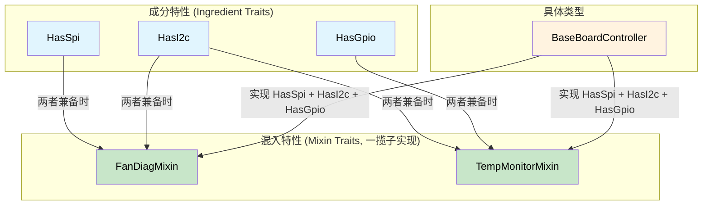

[English Original](../en/ch08-capability-mixins-compile-time-hardware-.md)

# 能力混入 —— 编译时硬件契约 🟡

> **你将学到：**
> - 如何将成分特性 (Ingredient Traits，即总线能力) 与混入特性 (Mixin Traits) 以及一揽子实现 (Blanket Impls) 结合使用。
> - 这种模式如何消除诊断代码的重复，同时在编译时保证满足每一项硬件依赖。

> **参考：** [第 4 章](ch04-capability-tokens-zero-cost-proof-of-aut.md)（能力令牌）、[第 9 章](ch09-phantom-types-for-resource-tracking.md)（幽灵类型）、[第 10 章](ch10-putting-it-all-together-a-complete-diagn.md)（集成）。

## 问题：诊断代码重复

服务器平台通常会在各个子系统之间共享诊断模式。风扇诊断、温度监控和上电时序控制都遵循类似的工作流，但它们运行在不同的硬件总线上。如果没有抽象，你只能靠复制粘贴：

```c
// C 语言 —— 各个子系统之间存在重复逻辑
int run_fan_diag(spi_bus_t *spi, i2c_bus_t *i2c) {
    // ... 50 行 SPI 传感器读取代码 ...
    // ... 30 行 I2C 寄存器检查代码 ...
    // ... 20 行阈值比较代码 (与 CPU 诊断相同) ...
}

int run_cpu_temp_diag(i2c_bus_t *i2c, gpio_t *gpio) {
    // ... 30 行 I2C 寄存器检查代码 (与风扇诊断相同) ...
    // ... 15 行 GPIO 告警检查代码 ...
    // ... 20 行阈值比较代码 (与风扇诊断相同) ...
}
```

虽然阈值比较逻辑是完全一致的，但由于总线类型不同，你无法将其提取出来。通过 **能力混入 (Capability Mixins)**，每种硬件总线都被视为一种 **成分特性 (Ingredient Trait)**，而只要具备了正确的“成分”，诊断行为就会被自动提供。

## 成分特性 (硬件能力)

每种总线或外设都是特性 (Trait) 上的一个关联类型。诊断控制器会声明它拥有哪些总线：

```rust,ignore
/// SPI 总线能力。
pub trait HasSpi {
    type Spi: SpiBus;
    fn spi(&self) -> &Self::Spi;
}

/// I2C 总线能力。
pub trait HasI2c {
    type I2c: I2cBus;
    fn i2c(&self) -> &Self::I2c;
}

/// GPIO 引脚访问能力。
pub trait HasGpio {
    type Gpio: GpioController;
    fn gpio(&self) -> &Self::Gpio;
}

/// IPMI 访问能力。
pub trait HasIpmi {
    type Ipmi: IpmiClient;
    fn ipmi(&self) -> &Self::Ipmi;
}

// 总线特性的定义：
pub trait SpiBus {
    fn transfer(&self, data: &[u8]) -> Vec<u8>;
}

pub trait I2cBus {
    fn read_register(&self, addr: u8, reg: u8) -> u8;
    fn write_register(&self, addr: u8, reg: u8, value: u8);
}

pub trait GpioController {
    fn read_pin(&self, pin: u32) -> bool;
    fn set_pin(&self, pin: u32, value: bool);
}

}

## 混入特性 (诊断行为)

混入特性会为任何实现其所需能力的类型 **自动提供** 行为：

```rust,ignore
# pub trait SpiBus { fn transfer(&self, data: &[u8]) -> Vec<u8>; }
# pub trait I2cBus {
#     fn read_register(&self, addr: u8, reg: u8) -> u8;
#     fn write_register(&self, addr: u8, reg: u8, value: u8);
# }
# pub trait GpioController { fn read_pin(&self, pin: u32) -> bool; }
# pub trait IpmiClient { fn send_raw(&self, netfn: u8, cmd: u8, data: &[u8]) -> Vec<u8>; }
# pub trait HasSpi { type Spi: SpiBus; fn spi(&self) -> &Self::Spi; }
# pub trait HasI2c { type I2c: I2cBus; fn i2c(&self) -> &Self::I2c; }
# pub trait HasGpio { type Gpio: GpioController; fn gpio(&self) -> &Self::Gpio; }
# pub trait HasIpmi { type Ipmi: IpmiClient; fn ipmi(&self) -> &Self::Ipmi; }

/// 风扇诊断混入 —— 为任何拥有 SPI + I2C 的类型自动实现。
pub trait FanDiagMixin: HasSpi + HasI2c {
    fn read_fan_speed(&self, fan_id: u8) -> u32 {
        // 通过 SPI 读取转速表
        let cmd = [0x80 | fan_id, 0x00];
        let response = self.spi().transfer(&cmd);
        u32::from_be_bytes([0, 0, response[0], response[1]])
    }

    fn set_fan_pwm(&self, fan_id: u8, duty_percent: u8) {
        // 通过 I2C 控制器设置 PWM
        self.i2c().write_register(0x2E, fan_id, duty_percent);
    }

    fn run_fan_diagnostic(&self) -> bool {
        // 全套诊断：读取所有风扇，检查阈值
        for fan_id in 0..6 {
            let speed = self.read_fan_speed(fan_id);
            if speed < 1000 || speed > 20000 {
                println!("风扇 {fan_id}: 失败 ({speed} RPM)");
                return false;
            }
        }
        true
    }
}

// 一揽子实现 —— 任何拥有 SPI + I2C 的类型都能免费获得 FanDiagMixin
impl<T: HasSpi + HasI2c> FanDiagMixin for T {}

/// 温度监控混入 —— 需要 I2C + GPIO。
pub trait TempMonitorMixin: HasI2c + HasGpio {
    fn read_temperature(&self, sensor_addr: u8) -> f64 {
        let raw = self.i2c().read_register(sensor_addr, 0x00);
        raw as f64 * 0.5  // 每 LSB 代表 0.5°C
    }

    fn check_thermal_alert(&self, alert_pin: u32) -> bool {
        self.gpio().read_pin(alert_pin)
    }

    fn run_thermal_diagnostic(&self) -> bool {
        for addr in [0x48, 0x49, 0x4A] {
            let temp = self.read_temperature(addr);
            if temp > 95.0 {
                println!("传感器 0x{addr:02X}: 危急温度 ({temp}°C)");
                return false;
            }
            if self.check_thermal_alert(addr as u32) {
                println!("传感器 0x{addr:02X}: 告警引脚已响应 (Alert pin asserted)");
                return false;
            }
        }
        true
    }
}

impl<T: HasI2c + HasGpio> TempMonitorMixin for T {}

/// 上电时序混入 —— 需要 I2C + IPMI。
pub trait PowerSeqMixin: HasI2c + HasIpmi {
    fn read_voltage_rail(&self, rail: u8) -> f64 {
        let raw = self.i2c().read_register(0x40, rail);
        raw as f64 * 0.01  // 每 LSB 代表 10mV
    }

    fn check_power_good(&self) -> bool {
        let resp = self.ipmi().send_raw(0x04, 0x2D, &[0x01]);
        !resp.is_empty() && resp[0] == 0x00
    }
}

}

## 具体控制器 —— 自由混合与匹配

具体的诊断控制器只需声明其拥有的能力，就能 **自动继承** 所有匹配的混入行为：

```rust,ignore
# pub trait SpiBus { fn transfer(&self, data: &[u8]) -> Vec<u8>; }
# pub trait I2cBus {
#     fn read_register(&self, addr: u8, reg: u8) -> u8;
#     fn write_register(&self, addr: u8, reg: u8, value: u8);
# }
# pub trait GpioController {
#     fn read_pin(&self, pin: u32) -> bool;
#     fn set_pin(&self, pin: u32, value: bool);
# }
# pub trait IpmiClient { fn send_raw(&self, netfn: u8, cmd: u8, data: &[u8]) -> Vec<u8>; }
# pub trait HasSpi { type Spi: SpiBus; fn spi(&self) -> &Self::Spi; }
# pub trait HasI2c { type I2c: I2cBus; fn i2c(&self) -> &Self::I2c; }
# pub trait HasGpio { type Gpio: GpioController; fn gpio(&self) -> &Self::Gpio; }
# pub trait HasIpmi { type Ipmi: IpmiClient; fn ipmi(&self) -> &Self::Ipmi; }
# pub trait FanDiagMixin: HasSpi + HasI2c {}
# impl<T: HasSpi + HasI2c> FanDiagMixin for T {}
# pub trait TempMonitorMixin: HasI2c + HasGpio {}
# impl<T: HasI2c + HasGpio> TempMonitorMixin for T {}
# pub trait PowerSeqMixin: HasI2c + HasIpmi {}
# impl<T: HasI2c + HasIpmi> PowerSeqMixin for T {}

// 具体总线实现 (为了演示使用存根)
pub struct LinuxSpi { bus: u8 }
impl SpiBus for LinuxSpi {
    fn transfer(&self, data: &[u8]) -> Vec<u8> { vec![0; data.len()] }
}

pub struct LinuxI2c { bus: u8 }
impl I2cBus for LinuxI2c {
    fn read_register(&self, _addr: u8, _reg: u8) -> u8 { 42 }
    fn write_register(&self, _addr: u8, _reg: u8, _value: u8) {}
}

pub struct LinuxGpio;
impl GpioController for LinuxGpio {
    fn read_pin(&self, _pin: u32) -> bool { false }
    fn set_pin(&self, _pin: u32, _value: bool) {}
}

pub struct IpmiToolClient;
impl IpmiClient for IpmiToolClient {
    fn send_raw(&self, _netfn: u8, _cmd: u8, _data: &[u8]) -> Vec<u8> { vec![0x00] }
}

/// BaseBoardController 拥有全部总线 → 自动获得全部混入行为。
pub struct BaseBoardController {
    spi: LinuxSpi,
    i2c: LinuxI2c,
    gpio: LinuxGpio,
    ipmi: IpmiToolClient,
}

impl HasSpi for BaseBoardController {
    type Spi = LinuxSpi;
    fn spi(&self) -> &LinuxSpi { &self.spi }
}

impl HasI2c for BaseBoardController {
    type I2c = LinuxI2c;
    fn i2c(&self) -> &LinuxI2c { &self.i2c }
}

impl HasGpio for BaseBoardController {
    type Gpio = LinuxGpio;
    fn gpio(&self) -> &LinuxGpio { &self.gpio }
}

impl HasIpmi for BaseBoardController {
    type Ipmi = IpmiToolClient;
    fn ipmi(&self) -> &IpmiToolClient { &self.ipmi }
}

// BaseBoardController 现在自动拥有：
// - FanDiagMixin    (因为它实现了 HasSpi + HasI2c)
// - TempMonitorMixin (因为它实现了 HasI2c + HasGpio)
// - PowerSeqMixin   (因为它实现了 HasI2c + HasIpmi)
// 无需手动实现这些特性 —— 一揽子实现已经完成了一切。
```

## “正确构建”的体现

混入模式之所以体现了“正确构建”，是因为：

1. **没有 SPI 就无法调用 `read_fan_speed()`** —— 该方法仅存在于实现了 `HasSpi + HasI2c` 的类型上。
2. **总线不可被遗漏** —— 如果你从 `BaseBoardController` 中移除了 `HasSpi`，`FanDiagMixin` 的方法会在编译时立即消失。
3. **Mock 测试是全自动的** —— 将 `LinuxSpi` 替换为 `MockSpi`，所有的混入逻辑都能直接与 Mock 对象配合工作。
4. **新平台只需声明能力** —— 一个只有 I2C 和 GPIO 的 GPU 扩展卡会自动获得 `TempMonitorMixin`，但由于没有 SPI，它无法获得 `FanDiagMixin`。

### 何时使用能力混入

| 场景 | 是否使用混入？ |
|----------|:------:|
| 横向切分的诊断行为 | ✅ 是 —— 防止复制粘贴 |
| 多总线硬件控制器 | ✅ 是 —— 声明能力，获取行为 |
| 平台特定的测试框架 | ✅ 是 —— 模拟各种能力进行测试 |
| 单总线的简单外设 | ⚠️ 开销可能不划算 |
| 纯业务逻辑 (无硬件相关) | ❌ 有更简单的模式可用 |
```

## 混入特性架构



## 练习：网络诊断混入

为网络诊断设计一套混入系统：
- 成分特性：`HasEthernet`, `HasIpmi`
- 混入：`LinkHealthMixin` (需要 `HasEthernet`) 提供 `check_link_status(&self)`
- 混入：`RemoteDiagMixin` (需要 `HasEthernet + HasIpmi`) 提供 `remote_health_check(&self)`
- 具体类型：实现上述两种成分的 `NicController` 结构体。

<details>
<summary>点击查看参考答案</summary>

```rust,ignore
pub trait HasEthernet {
    fn eth_link_up(&self) -> bool;
}

pub trait HasIpmi {
    fn ipmi_ping(&self) -> bool;
}

pub trait LinkHealthMixin: HasEthernet {
    fn check_link_status(&self) -> &'static str {
        if self.eth_link_up() { "链路: 正常 (UP)" } else { "链路: 断开 (DOWN)" }
    }
}
impl<T: HasEthernet> LinkHealthMixin for T {}

pub trait RemoteDiagMixin: HasEthernet + HasIpmi {
    fn remote_health_check(&self) -> &'static str {
        if self.eth_link_up() && self.ipmi_ping() {
            "远程诊断: 健康"
        } else {
            "远程诊断: 降级"
        }
    }
}
impl<T: HasEthernet + HasIpmi> RemoteDiagMixin for T {}

pub struct NicController;
impl HasEthernet for NicController {
    fn eth_link_up(&self) -> bool { true }
}
impl HasIpmi for NicController {
    fn ipmi_ping(&self) -> bool { true }
}
// NicController 会自动获得上述两个混入特性提供的方法
```

</details>

## 关键要点

1. **成分特性用于声明硬件能力** —— `HasSpi`, `HasI2c`, `HasGpio` 是基于关联类型的特性。
2. **混入特性通过一揽子实现提供行为** —— `impl<T: HasSpi + HasI2c> FanDiagMixin for T {}`。
3. **适配新平台只需列出其能力** —— 编译器会自动为你匹配并提供所有符合条件的混入方法。
4. **移除总线会导致编译器在所有使用处报错** —— 你不会在下游代码中遗忘更新。
5. **Mock 测试是免费的** —— 只要把 `LinuxSpi` 换成 `MockSpi`，所有的混入逻辑都能在不改动一行代码的情况下继续运行。

---
