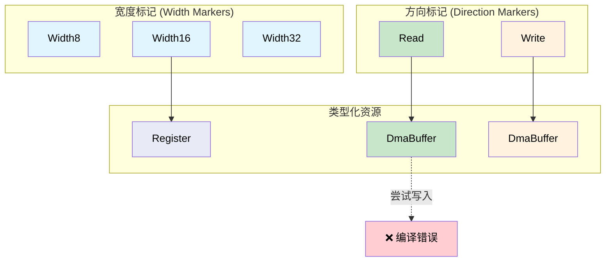

[English Original](../en/ch09-phantom-types-for-resource-tracking.md)

# 用于资源追踪的幽灵类型 🟡

> **你将学到：**
> - 如何使用 `PhantomData` 标记在类型层面编码寄存器宽度、DMA 方向以及文件描述符状态。
> - 这种方法如何在零运行时开销的情况下，防止一整类资源不匹配的 Bug。

> **参考：** [第 5 章](ch05-protocol-state-machines-type-state-for-r.md)（类型状态）、[第 6 章](ch06-dimensional-analysis-making-the-compiler.md)（量纲类型）、[第 8 章](ch08-capability-mixins-compile-time-hardware-.md)（混入特性）、[第 10 章](ch10-putting-it-all-together-a-complete-diagn.md)（集成）。

## 问题：资源混淆

在代码中，许多硬件资源看起来很像，但它们并不能互换使用：

- 32 位寄存器和 16 位寄存器在代码中都是“寄存器”。
- 用于“读”的 DMA 缓冲区和用于“写”的 DMA 缓冲区看起来都是 `*mut u8`。
- 已打开的文件描述符和已关闭的文件描述符在内核看来都是 `i32`。

在 C 语言中：

```c
// C 语言 —— 所有寄存器看起来都一样
uint32_t read_reg32(volatile void *base, uint32_t offset);
uint16_t read_reg16(volatile void *base, uint32_t offset);

// Bug：使用 32 位函数读取 16 位寄存器
uint32_t status = read_reg32(pcie_bar, LINK_STATUS_REG);  // 应该是 reg16！
```

## 幽灵类型参数 (Phantom Type Parameters)

**幽灵类型** 是指在结构体定义中出现，但在任何字段中都不使用的类型参数。它的存在纯粹是为了携带类型层面的信息：

```rust,ignore
use std::marker::PhantomData;

// 寄存器宽度标记 —— 零大小 (zero-sized)
pub struct Width8;
pub struct Width16;
pub struct Width32;
pub struct Width64;

/// 一个由其宽度参数化的寄存器句柄。
/// PhantomData<W> 占用的字节数为零 —— 它是一个仅存在于编译时的标记。
pub struct Register<W> {
    base: usize,
    offset: usize,
    _width: PhantomData<W>,
}

impl Register<Width8> {
    pub fn read(&self) -> u8 {
        // ... 从 base + offset 读取 1 字节 ...
        0 // 存根示例
    }
    pub fn write(&self, _value: u8) {
        // ... 写入 1 字节 ...
    }
}

impl Register<Width16> {
    pub fn read(&self) -> u16 {
        // ... 从 base + offset 读取 2 字节 ...
        0 // 存根示例
    }
    pub fn write(&self, _value: u16) {
        // ... 写入 2 字节 ...
    }
}

impl Register<Width32> {
    pub fn read(&self) -> u32 {
        // ... 从 base + offset 读取 4 字节 ...
        0 // 存根示例
    }
    pub fn write(&self, _value: u32) {
        // ... 写入 4 字节 ...
    }
}

/// PCIe 配置空间寄存器定义。
pub struct PcieConfig {
    base: usize,
}

impl PcieConfig {
    pub fn vendor_id(&self) -> Register<Width16> {
        Register { base: self.base, offset: 0x00, _width: PhantomData }
    }

    pub fn device_id(&self) -> Register<Width16> {
        Register { base: self.base, offset: 0x02, _width: PhantomData }
    }

    pub fn command(&self) -> Register<Width16> {
        Register { base: self.base, offset: 0x04, _width: PhantomData }
    }

    pub fn status(&self) -> Register<Width16> {
        Register { base: self.base, offset: 0x06, _width: PhantomData }
    }

    pub fn bar0(&self) -> Register<Width32> {
        Register { base: self.base, offset: 0x10, _width: PhantomData }
    }
}

fn pcie_example() {
    let cfg = PcieConfig { base: 0xFE00_0000 };

    let vid: u16 = cfg.vendor_id().read();    // 返回 u16 ✅
    let bar: u32 = cfg.bar0().read();         // 返回 u32 ✅

    // 无法混淆使用：
    // let bad: u32 = cfg.vendor_id().read(); // ❌ 错误：预期得到 u16
    // cfg.bar0().write(0u16);                // ❌ 错误：预期得到 u32
}

## DMA 缓冲区访问控制

DMA 缓冲区具有方向性：有些是用于“设备到主机” (FromDevice, 读)，有些则是用于“主机到设备” (ToDevice, 写)。使用错误的方向会破坏数据或导致总线错误：

```rust,ignore
use std::marker::PhantomData;

// 方向标记
pub struct ToDevice;     // 主机写，设备读
pub struct FromDevice;   // 设备写，主机读

/// 一个具有强制方向执行能力的 DMA 缓冲区。
pub struct DmaBuffer<Dir> {
    ptr: *mut u8,
    len: usize,
    dma_addr: u64,  // 给设备使用的物理地址
    _dir: PhantomData<Dir>,
}

impl DmaBuffer<ToDevice> {
    /// 用要发送给设备的数据填充缓冲区。
    pub fn write_data(&mut self, data: &[u8]) {
        assert!(data.len() <= self.len);
        // 安全性 (SAFETY)：ptr 在构造时分配了 self.len 字节的有效空间，
        // 且 data.len() <= self.len (上述断言已证)。
        unsafe { std::ptr::copy_nonoverlapping(data.as_ptr(), self.ptr, data.len()) }
    }

    /// 获取供设备读取的 DMA 地址。
    pub fn device_addr(&self) -> u64 {
        self.dma_addr
    }
}

impl DmaBuffer<FromDevice> {
    /// 读取设备写入缓冲区的数据。
    pub fn read_data(&self) -> &[u8] {
        // 安全性 (SAFETY)：ptr 拥有 self.len 字节的有效空间，
        // 且设备已完成写入（由调用者确保 DMA 传输完成）。
        unsafe { std::slice::from_raw_parts(self.ptr, self.len) }
    }

    /// 获取供设备写入的 DMA 地址。
    pub fn device_addr(&self) -> u64 {
        self.dma_addr
    }
}

// 无法向 FromDevice 缓冲区写入数据：
// fn oops(buf: &mut DmaBuffer<FromDevice>) {
//     buf.write_data(&[1, 2, 3]);  // ❌ DmaBuffer<FromDevice> 上没有 `write_data` 方法
// }

// 无法读取 ToDevice 缓冲区的数据：
// fn oops2(buf: &DmaBuffer<ToDevice>) {
//     let data = buf.read_data();  // ❌ DmaBuffer<ToDevice> 上没有 `read_data` 方法
// }
```

## 文件描述符的所有权

一个常见的 Bug 是：在文件描述符被关闭之后仍然使用它。幽灵类型可以追踪文件的“打开/关闭”状态：

```rust,ignore
use std::marker::PhantomData;

pub struct Open;
pub struct Closed;

/// 带有状态追踪的文件描述符。
pub struct Fd<State> {
    raw: i32,
    _state: PhantomData<State>,
}

impl Fd<Open> {
    pub fn open(path: &str) -> Result<Self, String> {
        // ... 打开文件 ...
        Ok(Fd { raw: 3, _state: PhantomData }) // 存根示例
    }

    pub fn read(&self, buf: &mut [u8]) -> Result<usize, String> {
        // ... 从 fd 读取 ...
        Ok(0) // 存根示例
    }

    pub fn write(&self, data: &[u8]) -> Result<usize, String> {
        // ... 写入 fd ...
        Ok(data.len()) // 存根示例
    }

    /// 关闭 fd —— 返回一个 Closed 句柄。
    /// Open 句柄被消耗（通过 self），防止了 closure-after-close。
    pub fn close(self) -> Fd<Closed> {
        // ... 关闭 fd ...
        Fd { raw: self.raw, _state: PhantomData }
    }
}

impl Fd<Closed> {
    // Fd<Closed> 上不存在 read() 或 write() 方法。
    // 这使得“关闭后使用”变成了一个编译错误。

    pub fn raw_fd(&self) -> i32 {
        self.raw
    }
}

fn fd_example() -> Result<(), String> {
    let fd = Fd::open("/dev/ipmi0")?;
    let mut buf = [0u8; 256];
    fd.read(&mut buf)?;

    let closed = fd.close();

    // closed.read(&mut buf)?;  // ❌ Fd<Closed> 上没有 `read` 方法
    // closed.write(&[1])?;     // ❌ Fd<Closed> 上没有 `write` 方法

    Ok(())
}

## 将幽灵类型与之前的模式相结合

幽灵类型可以与我们之前见过的所有模式组合使用：

```rust,ignore
# use std::marker::PhantomData;
# pub struct Width32;
# pub struct Width16;
# pub struct Register<W> { _w: PhantomData<W> }
# impl Register<Width16> { pub fn read(&self) -> u16 { 0 } }
# impl Register<Width32> { pub fn read(&self) -> u32 { 0 } }
# #[derive(Debug, Clone, Copy, PartialEq, PartialOrd)]
# pub struct Celsius(pub f64);

/// 将幽灵类型 (寄存器宽度) 与量纲类型 (Celsius) 相结合。
fn read_temp_sensor(reg: &Register<Width16>) -> Celsius {
    let raw = reg.read();  // 由幽灵类型保证返回 u16
    Celsius(raw as f64 * 0.0625)  // 由返回类型保证封装为 Celsius
}

// 编译器会强制执行：
// 1. 寄存器必须是 16 位的 (幽灵类型)
// 2. 结果必须是 Celsius (新类型)
// 且两者的运行时开销均为零。
```

### 何时使用幽灵类型

| 场景 | 是否使用幽灵参数？ |
|----------|:------:|
| 寄存器宽度编码 | ✅ 总是 —— 防止宽度不匹配 |
| DMA 缓冲区方向 | ✅ 总是 —— 防止数据损坏 |
| 文件描述符状态 | ✅ 总是 —— 防止关闭后使用 |
| 内存区域权限 (R/W/X) | ✅ 总是 —— 强制执行访问控制 |
| 通用容器 (Vec, HashMap) | ❌ 否 —— 直接使用具体的类型参数即可 |
| 运行时变量属性 | ❌ 否 —— 幽灵类型仅在编译时有效 |

## 幽灵类型资源矩阵



## 练习：内存区域权限

为具有读、写和执行权限的内存区域设计幽灵类型：
- `MemRegion<ReadOnly>` 拥有 `fn read(&self, offset: usize) -> u8`。
- `MemRegion<ReadWrite>` 同时拥有 `read` 和 `write`。
- `MemRegion<Executable>` 拥有 `read` 和 `fn execute(&self)`。
- 对 `ReadOnly` 进行写入，或对 `ReadWrite` 执行 `execute`，都应当无法通过编译。

<details>
<summary>点击查看参考答案</summary>

```rust,ignore
use std::marker::PhantomData;

pub struct ReadOnly;
pub struct ReadWrite;
pub struct Executable;

pub struct MemRegion<Perm> {
    base: *mut u8,
    len: usize,
    _perm: PhantomData<Perm>,
}

// “读”在所有权限类型上都可用
impl<P> MemRegion<P> {
    pub fn read(&self, offset: usize) -> u8 {
        assert!(offset < self.len);
        // 安全性 (SAFETY)：offset < self.len (上述断言)，base 具有 len 字节的有效空间。
        unsafe { *self.base.add(offset) }
    }
}

impl MemRegion<ReadWrite> {
    pub fn write(&mut self, offset: usize, val: u8) {
        assert!(offset < self.len);
        // 安全性 (SAFETY)：offset < self.len，base 具有 len 字节有效空间，
        // 且 &mut self 保证了独占访问。
        unsafe { *self.base.add(offset) = val; }
    }
}

impl MemRegion<Executable> {
    pub fn execute(&self) {
        // 跳转到起始地址 (概念上)
    }
}

// ❌ region_ro.write(0, 0xFF);  // 编译错误：不存在 `write` 方法
// ❌ region_rw.execute();       // 编译错误：不存在 `execute` 方法
```

</details>

## 关键要点

1. **PhantomData 以零大小携带类型层面信息** —— 该标记仅为编译器存在。
2. **寄存器宽度不匹配会变成编译错误** —— `Register<Width16>` 返回的是 `u16` 而非 `u32`。
3. **DMA 方向在结构上被强制执行** —— `DmaBuffer<Read>` 根本没有 `write()` 方法。
4. **与量纲类型相结合 (第 6 章)** —— `Register<Width16>` 可以通过解析步骤直接返回 `Celsius` 类型。
5. **幽灵类型仅限编译时** —— 它们无法处理运行时的变量属性；对于这类需求请使用枚举。

---
