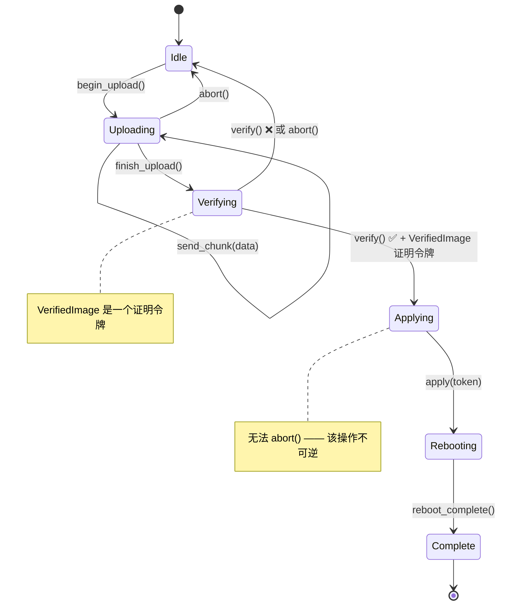

[English Original](../en/ch12-exercises.md)

# 练习 🟡

> **你将学到：**
> - 在现实的硬件场景中应用“正确构建 (Correct-by-Construction)”模式的动手实践 —— 包括 NVMe 管理命令、固件更新状态机、传感器流水线、PCIe 幽灵类型、多协议健康检查以及会话类型化 (Session-typed) 的诊断协议。
>
> **参考：** [第 2 章](ch02-typed-command-interfaces-request-determi.md)（练习 1）、[第 5 章](ch05-protocol-state-machines-type-state-for-r.md)（练习 2）、[第 6 章](ch06-dimensional-analysis-making-the-compiler.md)（练习 3）、[第 9 章](ch09-phantom-types-for-resource-tracking.md)（练习 4）、[第 10 章](ch10-putting-it-all-together-a-complete-diagn.md)（练习 5）。

## 实践问题

### 练习 1：NVMe 管理命令 (类型化命令)

为 NVMe 管理命令设计一个类型化的命令接口：

- `Identify` (识别) → `IdentifyResponse` (识别响应：型号、序列号、固件版本)
- `GetLogPage` (获取日志页) → `SmartLog` (SMART 日志：温度、可用备用容量、读取的数据量)
- `GetFeature` (获取特性) → 特定于特性的响应

要求：
1. 命令类型决定响应类型。
2. 无运行时分发 —— 仅限静态分发。
3. 增加一个 `NamespaceId` 新类型 (Newtype)，防止将命名空间 ID 与其他 `u32` 混淆。

**提示：** 参考第 2 章中的 `IpmiCmd` 特性模式，但使用 NVMe 特有的常量。

<details>
<summary>参考答案 (练习 1)</summary>

```rust,ignore
use std::io;

#[derive(Debug, Clone, Copy, PartialEq, Eq, PartialOrd, Ord, Hash)]
pub struct NamespaceId(pub u32);

#[derive(Debug, Clone, PartialEq)]
pub struct IdentifyResponse {
    pub model: String,
    pub serial: String,
    pub firmware_rev: String,
}

#[derive(Debug, Clone, PartialEq)]
pub struct SmartLog {
    pub temperature_kelvin: u16,
    pub available_spare_pct: u8,
    pub data_units_read: u64,
}

#[derive(Debug, Clone, PartialEq)]
pub struct ArbitrationFeature {
    pub high_priority_weight: u8,
    pub medium_priority_weight: u8,
    pub low_priority_weight: u8,
}

/// 核心模式：关联类型将每个命令与其响应锁定。
pub trait NvmeAdminCmd {
    type Response;
    fn opcode(&self) -> u8;
    fn nsid(&self) -> Option<NamespaceId>;
    fn parse_response(&self, raw: &[u8]) -> io::Result<Self::Response>;
}

pub struct Identify { pub nsid: NamespaceId }

impl NvmeAdminCmd for Identify {
    type Response = IdentifyResponse;
    fn opcode(&self) -> u8 { 0x06 }
    fn nsid(&self) -> Option<NamespaceId> { Some(self.nsid) }
    fn parse_response(&self, raw: &[u8]) -> io::Result<IdentifyResponse> {
        if raw.len() < 12 {
            return Err(io::Error::new(io::ErrorKind::InvalidData, "数据过短"));
        }
        Ok(IdentifyResponse {
            model: String::from_utf8_lossy(&raw[0..4]).trim().to_string(),
            serial: String::from_utf8_lossy(&raw[4..8]).trim().to_string(),
            firmware_rev: String::from_utf8_lossy(&raw[8..12]).trim().to_string(),
        })
    }
}

pub struct GetLogPage { pub log_id: u8 }

impl NvmeAdminCmd for GetLogPage {
    type Response = SmartLog;
    fn opcode(&self) -> u8 { 0x02 }
    fn nsid(&self) -> Option<NamespaceId> { None }
    fn parse_response(&self, raw: &[u8]) -> io::Result<SmartLog> {
        if raw.len() < 11 {
            return Err(io::Error::new(io::ErrorKind::InvalidData, "数据过短"));
        }
        Ok(SmartLog {
            temperature_kelvin: u16::from_le_bytes([raw[0], raw[1]]),
            available_spare_pct: raw[2],
            data_units_read: u64::from_le_bytes(raw[3..11].try_into().unwrap()),
        })
    }
}

pub struct GetFeature { pub feature_id: u8 }

impl NvmeAdminCmd for GetFeature {
    type Response = ArbitrationFeature;
    fn opcode(&self) -> u8 { 0x0A }
    fn nsid(&self) -> Option<NamespaceId> { None }
    fn parse_response(&self, raw: &[u8]) -> io::Result<ArbitrationFeature> {
        if raw.len() < 3 {
            return Err(io::Error::new(io::ErrorKind::InvalidData, "数据过短"));
        }
        Ok(ArbitrationFeature {
            high_priority_weight: raw[0],
            medium_priority_weight: raw[1],
            low_priority_weight: raw[2],
        })
    }
}

/// 静态分发 —— 编译器针对每种命令类型进行单态化处理。
pub struct NvmeController;

impl NvmeController {
    pub fn execute<C: NvmeAdminCmd>(&self, cmd: &C) -> io::Result<C::Response> {
        // 根据 cmd.opcode() / cmd.nsid() 构建 SQE (Submission Queue Entry)，
        // 提交至 SQ，等待 CQ (Completion Queue)，然后：
        let raw = self.submit_and_read(cmd.opcode())?;
        cmd.parse_response(&raw)
    }

    fn submit_and_read(&self, _opcode: u8) -> io::Result<Vec<u8>> {
        // 现实实现会与 /dev/nvme0 进行通信
        Ok(vec![0; 512])
    }
}
```

**关键点：**
- `NamespaceId(u32)` 防止了将命名空间 ID 与任意 `u32` 数值混淆。
- `NvmeAdminCmd::Response` 是“类型索引” —— `execute()` 返回的确切是 `C::Response`。
- 完全的静态分发：无需 `Box<dyn …>`，无需运行时向下转换 (downcasting)。

</details>

### 练习 2：固件更新状态机 (类型状态)

对 BMC 固件更新生命周期进行建模：



要求：
1. 每个状态都是一个独立的类型。
2. 只有从 `Idle` 状态才能开始上传。
3. 验证要求上传必须已完成。
4. 只有在验证成功后才能进行“应用 (Apply)”操作 —— 需要一个 `VerifiedImage` 证明令牌。
5. 应用操作后，唯一的选项是重启。
6. 为 `Uploading` 和 `Verifying` 状态增加 `abort()` 方法（但在 `Applying` 阶段不可用 —— 此时太迟了）。

**提示：** 将类型状态 (第 5 章) 与能力令牌 (第 4 章) 相结合。

<details>
<summary>参考答案 (练习 2)</summary>

```rust,ignore
// --- 状态类型 ---
// 设计决策：此处我们将状态存储在结构体内部 (`_state: S`)，而不是使用
// 第 5 章所用的 `PhantomData<S>`。这允许状态携带数据 ——
// 例如：`Uploading { bytes_sent: usize }` 可以追踪进度。当状态仅为
// 标记（零大小）时使用 `PhantomData`；当状态需要携带运行时数据时
// 请使用内部存储模式。
pub struct Idle;
pub struct Uploading { bytes_sent: usize }  // 不是 ZST —— 携带进度数据
pub struct Verifying;
pub struct Applying;
pub struct Rebooting;
pub struct Complete;

/// 证明令牌：仅能在 verify() 内部构造。
pub struct VerifiedImage { _private: () }

pub struct FwUpdate<S> {
    bmc_addr: String,
    _state: S,
}

impl FwUpdate<Idle> {
    pub fn new(bmc_addr: &str) -> Self {
        FwUpdate { bmc_addr: bmc_addr.to_string(), _state: Idle }
    }
    pub fn begin_upload(self) -> FwUpdate<Uploading> {
        FwUpdate { bmc_addr: self.bmc_addr, _state: Uploading { bytes_sent: 0 } }
    }
}

impl FwUpdate<Uploading> {
    pub fn send_chunk(mut self, chunk: &[u8]) -> Self {
        self._state.bytes_sent += chunk.len();
        self
    }
    pub fn finish_upload(self) -> FwUpdate<Verifying> {
        FwUpdate { bmc_addr: self.bmc_addr, _state: Verifying }
    }
    /// 上传期间可用的取消 (Abort) 操作 —— 返回到 Idle。
    pub fn abort(self) -> FwUpdate<Idle> {
        FwUpdate { bmc_addr: self.bmc_addr, _state: Idle }
    }
}

impl FwUpdate<Verifying> {
    /// 成功时，返回下一个状态以及一个 VerifiedImage 证明令牌。
    pub fn verify(self) -> Result<(FwUpdate<Applying>, VerifiedImage), FwUpdate<Idle>> {
        // 现实世界中：检查 CRC、签名、兼容性
        let token = VerifiedImage { _private: () };
        Ok((
            FwUpdate { bmc_addr: self.bmc_addr, _state: Applying },
            token,
        ))
    }
    /// 验证期间可用的取消 (Abort) 操作。
    pub fn abort(self) -> FwUpdate<Idle> {
        // 清理代码...
        FwUpdate { bmc_addr: self.bmc_addr, _state: Idle }
    }
}

impl FwUpdate<Applying> {
    /// 消费 VerifiedImage 证明 —— 未经验证则无法应用。
    /// 注意：此处没有 abort() 方法 —— 一旦开始刷写，取消操作将非常危险。
    pub fn apply(self, _proof: VerifiedImage) -> FwUpdate<Rebooting> {
        FwUpdate { bmc_addr: self.bmc_addr, _state: Rebooting }
    }
}

impl FwUpdate<Rebooting> {
    pub fn wait_for_reboot(self) -> FwUpdate<Complete> {
        FwUpdate { bmc_addr: self.bmc_addr, _state: Complete }
    }
}

impl FwUpdate<Complete> {
    pub fn version(&self) -> &str { "2.1.0" }
}

// 用法示例：
// let fw = FwUpdate::new("192.168.1.100")
//     .begin_upload()
//     .send_chunk(b"image_data")
//     .finish_upload();
// let (fw, proof) = fw.verify().map_err(|_| "验证失败")?;
// let fw = fw.apply(proof).wait_for_reboot();
// println!("新版本：{}", fw.version());
```

**关键点：**
- `abort()` 仅存在于 `FwUpdate<Uploading>` 和 `FwUpdate<Verifying>` 上 —— 在 `FwUpdate<Applying>` 上调用它会导致 **编译错误**，而非运行时检查。
- `VerifiedImage` 包含私有字段，因此只有 `verify()` 才能创建一个。
- `apply()` 会消费证明令牌 —— 你无法绕过验证步骤。

</details>

***

### 练习 3：传感器读取流水线 (维度分析)

构建一个完整的传感器流水线：

1. 定义新类型：`RawAdc`, `Celsius`, `Fahrenheit`, `Volts`, `Millivolts`, `Watts`
2. 实现 `From<Celsius> for Fahrenheit` 及其逆转换
3. 为 `Amperes` 实现 `impl Mul<Volts, Output=Watts>` (P = V × I)
4. 构建一个 `Threshold<T>` 泛型检查器
5. 编写一个流水线：ADC → 校准 → 阈值检查 → 结果

编译器应当拒绝：将 `Celsius` 与 `Volts` 进行比较、将 `Watts` 与 `Rpm` 相加、在需要 `Volts` 的地方传入 `Millivolts`。

<details>
<summary>参考答案 (练习 3)</summary>

```rust,ignore
use std::ops::{Add, Sub, Mul};

#[derive(Debug, Clone, Copy, PartialEq, PartialOrd)]
pub struct RawAdc(pub u16);

#[derive(Debug, Clone, Copy, PartialEq, PartialOrd)]
pub struct Celsius(pub f64);

#[derive(Debug, Clone, Copy, PartialEq, PartialOrd)]
pub struct Fahrenheit(pub f64);

#[derive(Debug, Clone, Copy, PartialEq, PartialOrd)]
pub struct Volts(pub f64);

#[derive(Debug, Clone, Copy, PartialEq, PartialOrd)]
pub struct Millivolts(pub f64);

#[derive(Debug, Clone, Copy, PartialEq, PartialOrd)]
pub struct Amperes(pub f64);

#[derive(Debug, Clone, Copy, PartialEq, PartialOrd)]
pub struct Watts(pub f64);

// --- 安全转换 ---
impl From<Celsius> for Fahrenheit {
    fn from(c: Celsius) -> Self { Fahrenheit(c.0 * 9.0 / 5.0 + 32.0) }
}
impl From<Fahrenheit> for Celsius {
    fn from(f: Fahrenheit) -> Self { Celsius((f.0 - 32.0) * 5.0 / 9.0) }
}
impl From<Millivolts> for Volts {
    fn from(mv: Millivolts) -> Self { Volts(mv.0 / 1000.0) }
}
impl From<Volts> for Millivolts {
    fn from(v: Volts) -> Self { Millivolts(v.0 * 1000.0) }
}

// --- 同单位类型间的算术运算 ---
// 注意：将两个绝对温度相加 (25°C + 30°C) 在物理学上是存疑的 —— 
// 参阅第 6 章关于 ΔT 新类型的讨论，以了解更严谨的方法。
// 此处为了练习目的，我们保持简单。
impl Add for Celsius {
    type Output = Celsius;
    fn add(self, rhs: Self) -> Celsius { Celsius(self.0 + rhs.0) }
}
impl Sub for Celsius {
    type Output = Celsius;
    fn sub(self, rhs: Self) -> Celsius { Celsius(self.0 - rhs.0) }
}

// P = V × I (跨单位乘法)
impl Mul<Amperes> for Volts {
    type Output = Watts;
    fn mul(self, rhs: Amperes) -> Watts { Watts(self.0 * rhs.0) }
}

// --- 泛型阈值检查器 ---
// 练习 3 扩展了第 6 章中的 Threshold，
// 增加了泛型 ThresholdResult<T>，它携带了触发状态的读数 —— 
// 这是对第 6 章中较简单的 { Normal, Warning, Critical } 枚举的演进。
pub enum ThresholdResult<T> {
    Normal(T),
    Warning(T),
    Critical(T),
}

pub struct Threshold<T> {
    pub warning: T,
    pub critical: T,
}

// 泛型实现 —— 适用于任何支持 PartialOrd 的单位类型。
impl<T: PartialOrd + Copy> Threshold<T> {
    pub fn check(&self, reading: T) -> ThresholdResult<T> {
        if reading >= self.critical {
            ThresholdResult::Critical(reading)
        } else if reading >= self.warning {
            ThresholdResult::Warning(reading)
        } else {
            ThresholdResult::Normal(reading)
        }
    }
}
// 现在 `Threshold<Rpm>`, `Threshold<Volts>` 等都能自动工作。

// --- 流水线：ADC → 校准 → 阈值 → 结果 ---
pub struct CalibrationParams {
    pub scale: f64,  // 每单位摄氏度对应的 ADC 计数值
    pub offset: f64, // ADC 为 0 时的摄氏度
}

pub fn calibrate(raw: RawAdc, params: &CalibrationParams) -> Celsius {
    Celsius(raw.0 as f64 / params.scale + params.offset)
}

pub fn sensor_pipeline(
    raw: RawAdc,
    params: &CalibrationParams,
    threshold: &Threshold<Celsius>,
) -> ThresholdResult<Celsius> {
    let temp = calibrate(raw, params);
    threshold.check(temp)
}

// 编译时安全 —— 以下代码将无法通过编译：
// let _ = Celsius(25.0) + Volts(12.0);   // 错误：类型不匹配
// let _: Millivolts = Volts(1.0);         // 错误：无隐式转换
// let _ = Watts(100.0) + Rpm(3000);       // 错误：类型不匹配
```

**关键点：**
- 每个物理单位都是不同的类型 —— 杜绝了意外混用。
- `Volts` 的 `Mul<Amperes>` 产生 `Watts`，在类型系统中编码了 P = V × I 这一真理。
- 显式的 `From` 转换用于相关的单位（mV ↔ V, °C ↔ °F）。
- `Threshold<Celsius>` 仅接受 `Celsius` —— 你无法不小心将 RPM 传给它进行阈值检查。

</details>

### 练习 4：PCIe 能力链表遍历 (幽灵类型 + 验证边界)

为 PCIe 能力 (Capability) 链表建模：

1. `RawCapability` (原始能力) —— 来自配置空间的未经验证的字节
2. `ValidCapability` (有效能力) —— 已解析且已验证（通过 TryFrom）
3. 每个能力类型（MSI, MSI-X, PCIe Express, Power Management）都有其专属的幽灵类型化的寄存器布局。
4. 遍历链表会返回一个 `ValidCapability` 数值的迭代器。

**提示：** 将验证边界 (第 7 章) 与幽灵类型 (第 9 章) 相结合。

<details>
<summary>参考答案 (练习 4)</summary>

```rust,ignore
use std::marker::PhantomData;

// --- 能力类型的幽灵标记 ---
pub struct Msi;
pub struct MsiX;
pub struct PciExpress;
pub struct PowerMgmt;

// 规范中的 PCI 能力 ID
const CAP_ID_PM:   u8 = 0x01;
const CAP_ID_MSI:  u8 = 0x05;
const CAP_ID_PCIE: u8 = 0x10;
const CAP_ID_MSIX: u8 = 0x11;

/// 未经验证的字节 —— 可能是垃圾数据。
#[derive(Debug)]
pub struct RawCapability {
    pub id: u8,
    pub next_ptr: u8,
    pub data: Vec<u8>,
}

/// 已验证且带有类型标记的能力。
#[derive(Debug)]
pub struct ValidCapability<Kind> {
    id: u8,
    next_ptr: u8,
    data: Vec<u8>,
    _kind: PhantomData<Kind>,
}

// --- TryFrom：解析而不验证 (Parse-don't-validate) 边界 ---
impl TryFrom<RawCapability> for ValidCapability<PowerMgmt> {
    type Error = &'static str;
    fn try_from(raw: RawCapability) -> Result<Self, Self::Error> {
        if raw.id != CAP_ID_PM { return Err("非 PM 能力"); }
        if raw.data.len() < 2 { return Err("PM 数据过短"); }
        Ok(ValidCapability {
            id: raw.id, next_ptr: raw.next_ptr,
            data: raw.data, _kind: PhantomData,
        })
    }
}

impl TryFrom<RawCapability> for ValidCapability<Msi> {
    type Error = &'static str;
    fn try_from(raw: RawCapability) -> Result<Self, Self::Error> {
        if raw.id != CAP_ID_MSI { return Err("非 MSI 能力"); }
        if raw.data.len() < 6 { return Err("MSI 数据过短"); }
        Ok(ValidCapability {
            id: raw.id, next_ptr: raw.next_ptr,
            data: raw.data, _kind: PhantomData,
        })
    }
}

// (类似的 TryFrom 实现，如 MsiX, PciExpress —— 为简洁起见省略)

// --- 类型安全访问器：仅对正确的能力可用 ---
impl ValidCapability<PowerMgmt> {
    pub fn pm_control(&self) -> u16 {
        u16::from_le_bytes([self.data[0], self.data[1]])
    }
}

impl ValidCapability<Msi> {
    pub fn message_control(&self) -> u16 {
        u16::from_le_bytes([self.data[0], self.data[1]])
    }
    pub fn vectors_requested(&self) -> u32 {
        1 << ((self.message_control() >> 1) & 0x07)
    }
}

impl ValidCapability<MsiX> {
    pub fn table_size(&self) -> u16 {
        (u16::from_le_bytes([self.data[0], self.data[1]]) & 0x07FF) + 1
    }
}

// --- 能力遍历器 (Walker)：遍历链表 ---
pub struct CapabilityWalker<'a> {
    config_space: &'a [u8],
    next_ptr: u8,
}

impl<'a> CapabilityWalker<'a> {
    pub fn new(config_space: &'a [u8]) -> Self {
        // 能力指针位于 PCI 配置空间偏移量 0x34 处
        let first_ptr = if config_space.len() > 0x34 {
            config_space[0x34]
        } else { 0 };
        CapabilityWalker { config_space, next_ptr: first_ptr }
    }
}

impl<'a> Iterator for CapabilityWalker<'a> {
    type Item = RawCapability;
    fn next(&mut self) -> Option<RawCapability> {
        if self.next_ptr == 0 { return None; }
        let off = self.next_ptr as usize;
        if off + 2 > self.config_space.len() { return None; }
        let id = self.config_space[off];
        let next = self.config_space[off + 1];
        let end = if next > 0 { next as usize } else {
            (off + 16).min(self.config_space.len())
        };
        let data = self.config_space[off + 2..end].to_vec();
        self.next_ptr = next;
        Some(RawCapability { id, next_ptr: next, data })
    }
}

// 用法示例：
// for raw_cap in CapabilityWalker::new(&config_space) {
//     if let Ok(pm) = ValidCapability::<PowerMgmt>::try_from(raw_cap) {
//         println!("PM 控制：0x{:04X}", pm.pm_control());
//     }
// }
```

**关键点：**
- `RawCapability` → `ValidCapability<Kind>` 是“解析而不验证”边界。
- `pm_control()` 仅存在于 `ValidCapability<PowerMgmt>` 上 —— 在 MSI 能力上调用它将导致编译错误。
- `CapabilityWalker` 迭代器产出原始能力；调用者根据其需要，使用 `TryFrom` 对感兴趣的能力进行验证。

</details>

***

### 练习 5：多协议健康检查 (能力混入)

创建一个健康检查框架：

1. 定义成分特性 (Ingredient Traits)：`HasIpmi`, `HasRedfish`, `HasNvmeCli`, `HasGpio`
2. 创建混入特性 (Mixin Traits)：
   - `ThermalHealthMixin` (要求 HasIpmi + HasGpio) —— 读取温度，检查告警。
   - `StorageHealthMixin` (要求 HasNvmeCli) —— SMART 数据检查。
   - `BmcHealthMixin` (要求 HasIpmi + HasRedfish) —— 交叉验证 BMC 数据。
3. 构建一个 `FullPlatformController` (全平台控制器)，实现所有的成分特性。
4. 构建一个 `StorageOnlyController` (仅存储控制器)，仅实现 `HasNvmeCli`。
5. 验证 `StorageOnlyController` 获得了 `StorageHealthMixin`，但没有获得其他的混入。

<details>
<summary>参考答案 (练习 5)</summary>

```rust,ignore
// --- 成分特性 (Ingredient traits) ---
pub trait HasIpmi {
    fn ipmi_read_sensor(&self, id: u8) -> f64;
}
pub trait HasRedfish {
    fn redfish_get(&self, path: &str) -> String;
}
pub trait HasNvmeCli {
    fn nvme_smart_log(&self, dev: &str) -> SmartData;
}
pub trait HasGpio {
    fn gpio_read_alert(&self, pin: u8) -> bool;
}

pub struct SmartData {
    pub temperature_kelvin: u16,
    pub spare_pct: u8,
}

// --- 带有全局实现 (Blanket impls) 的混入特性 ---
pub trait ThermalHealthMixin: HasIpmi + HasGpio {
    fn thermal_check(&self) -> ThermalStatus {
        let temp = self.ipmi_read_sensor(0x01);
        let alert = self.gpio_read_alert(12);
        ThermalStatus { temperature: temp, alert_active: alert }
    }
}
impl<T: HasIpmi + HasGpio> ThermalHealthMixin for T {}

pub trait StorageHealthMixin: HasNvmeCli {
    fn storage_check(&self) -> StorageStatus {
        let smart = self.nvme_smart_log("/dev/nvme0");
        StorageStatus {
            temperature_ok: smart.temperature_kelvin < 343, // 70 °C
            spare_ok: smart.spare_pct > 10,
        }
    }
}
impl<T: HasNvmeCli> StorageHealthMixin for T {}

pub trait BmcHealthMixin: HasIpmi + HasRedfish {
    fn bmc_health(&self) -> BmcStatus {
        let ipmi_temp = self.ipmi_read_sensor(0x01);
        let rf_temp = self.redfish_get("/Thermal/Temperatures/0");
        BmcStatus { ipmi_temp, redfish_temp: rf_temp, consistent: true }
    }
}
impl<T: HasIpmi + HasRedfish> BmcHealthMixin for T {}

pub struct ThermalStatus { pub temperature: f64, pub alert_active: bool }
pub struct StorageStatus { pub temperature_ok: bool, pub spare_ok: bool }
pub struct BmcStatus { pub ipmi_temp: f64, pub redfish_temp: String, pub consistent: bool }

// --- 全平台：所有的成分 → 免费获得全部三个混入 ---
pub struct FullPlatformController;

impl HasIpmi for FullPlatformController {
    fn ipmi_read_sensor(&self, _id: u8) -> f64 { 42.0 }
}
impl HasRedfish for FullPlatformController {
    fn redfish_get(&self, _path: &str) -> String { "42.0".into() }
}
impl HasNvmeCli for FullPlatformController {
    fn nvme_smart_log(&self, _dev: &str) -> SmartData {
        SmartData { temperature_kelvin: 310, spare_pct: 95 }
    }
}
impl HasGpio for FullPlatformController {
    fn gpio_read_alert(&self, _pin: u8) -> bool { false }
}

// --- 仅存储：仅实现 HasNvmeCli → 仅获得 StorageHealthMixin ---
pub struct StorageOnlyController;

impl HasNvmeCli for StorageOnlyController {
    fn nvme_smart_log(&self, _dev: &str) -> SmartData {
        SmartData { temperature_kelvin: 315, spare_pct: 80 }
    }
}

// StorageOnlyController 自动获得了 storage_check() 方法。
// 在它上面调用 thermal_check() 或 bmc_health() 会导致编译错误。
```

**关键点：**
- 全局实现 `impl<T: HasIpmi + HasGpio> ThermalHealthMixin for T {}` —— 任何同时实现了两个成分特性的类型都会自动获得该混入。
- `StorageOnlyController` 仅实现了 `HasNvmeCli`，因此编译器授予其实现 `StorageHealthMixin` 的权利，但拒绝了 `thermal_check()` 和 `bmc_health()` —— 无需任何运行时检查。
- 增加新的混入（例如：`NetworkHealthMixin: HasRedfish + HasGpio`）只需要一个特性 + 一个全局实现 —— 现有的只要符合条件的控制器都会自动获取它。

</details>

### 练习 6：会话类型化诊断协议 (一次性 + 类型状态)

设计一个带有一次性测试执行令牌的诊断会话：

1. `DiagSession` 初始处于 `Setup` (设置) 状态。
2. 转换至 `Running` (运行) 状态 —— 产出 `N` 个执行令牌（每个测试用例一个）。
3. 每个 `TestToken` 在测试运行时被消费 —— 防止同一个测试被运行两次。
4. 在所有令牌都被消费后，转换至 `Complete` (完成) 状态。
5. 生成报告（仅在 `Complete` 状态下可用）。

**进阶：** 使用常量泛型 `N` 在类型层面上追踪还剩余多少个测试未运行。

<details>
<summary>参考答案 (练习 6)</summary>

```rust,ignore
// --- 状态类型 ---
pub struct Setup;
pub struct Running;
pub struct Complete;

/// 一次性测试令牌。不可 Clone，不可 Copy —— 使用时即被消费。
pub struct TestToken {
    test_name: String,
}

#[derive(Debug)]
pub struct TestResult {
    pub test_name: String,
    pub passed: bool,
}

pub struct DiagSession<S> {
    name: String,
    results: Vec<TestResult>,
    _state: S,
}

impl DiagSession<Setup> {
    pub fn new(name: &str) -> Self {
        DiagSession {
            name: name.to_string(),
            results: Vec::new(),
            _state: Setup,
        }
    }

    /// 转换至 Running 状态 —— 每个测试用例产出一个令牌。
    pub fn start(self, test_names: &[&str]) -> (DiagSession<Running>, Vec<TestToken>) {
        let tokens = test_names.iter()
            .map(|n| TestToken { test_name: n.to_string() })
            .collect();
        (
            DiagSession {
                name: self.name,
                results: Vec::new(),
                _state: Running,
            },
            tokens,
        )
    }
}

impl DiagSession<Running> {
    /// 消费一个令牌来运行一个测试。移动操作防止了重复运行。
    pub fn run_test(mut self, token: TestToken) -> Self {
        let passed = true; // 现实代码会在此执行实际的诊断逻辑
        self.results.push(TestResult {
            test_name: token.test_name,
            passed,
        });
        self
    }

    /// 转换至 Complete 状态。
    ///
    /// **注意：** 此处答案并未强制要求所有令牌都必须被消费 —— 
    /// 即使还有尚未使用的令牌，也可以调用 `finish()`。
    /// 令牌将被简单地丢弃（它们没有标记为 `#[must_use]`）。
    /// 想要实现完全的编译时强制执行，请参考下方“进阶”说明中的常量泛型变体，
    /// 其中 `finish()` 仅在 `DiagSession<Running, 0>` 上可用。
    pub fn finish(self) -> DiagSession<Complete> {
        DiagSession {
            name: self.name,
            results: self.results,
            _state: Complete,
        }
    }
}

impl DiagSession<Complete> {
    /// 报告方法仅在 Complete 状态下可用。
    pub fn report(&self) -> String {
        let total = self.results.len();
        let passed = self.results.iter().filter(|r| r.passed).count();
        format!("{}: {}/{} 通过", self.name, passed, total)
    }
}

// 用法示例：
// let session = DiagSession::new("GPU 压力测试");
// let (mut session, tokens) = session.start(&["vram", "compute", "thermal"]);
// for token in tokens {
//     session = session.run_test(token);
// }
// let session = session.finish();
// println!("{}", session.report());  // "GPU 压力测试: 3/3 通过"
```

**关键点：**
- `TestToken` 既没有 `Clone` 也没有 `Copy` —— 通过 `run_test(token)` 消费它会发生移动操作，因此再次运行同一个测试会导致编译错误。
- `report()` 仅存在于 `DiagSession<Complete>` 上 —— 在运行中途调用它是无法实现的。
- **进阶** 变体将使用带常量泛型的 `DiagSession<Running, N>`，其中 `run_test` 会返回 `DiagSession<Running, {N-1}>`，而 `finish` 仅在 `DiagSession<Running, 0>` 上可用 —— 这保证了在完成前 *所有* 令牌都已被消费。

</details>

## 关键要点

1. **针对真实协议进行练习** —— NVMe、固件更新、传感器流水线、PCIe 都是应用这些模式的真实目标。
2. **每个练习都对应一个核心章节** —— 在尝试之前，利用参考链接回顾相关模式。
3. **答案使用了可展开的详情块** —— 请先尝试自行解决每个练习，再查看参考答案。
4. **练习 5 展示了模式的组合** —— 多协议健康检查结合了类型化命令、维度类型以及验证边界。
5. **会话类型 (练习 6) 是前沿领域** —— 它们强制要求了信道上的消息顺序，将类型状态扩展到了分布式系统中。

***
