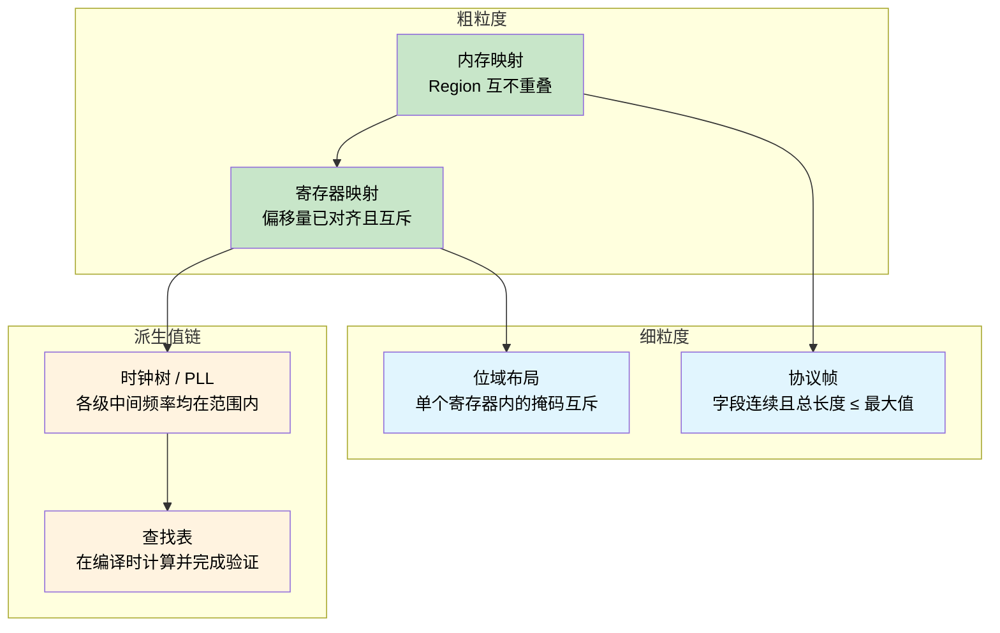
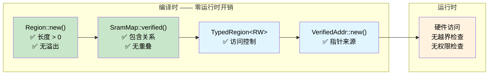

[English Original](../en/ch15-const-fn-compile-time-correctness-proofs.md)

# Const Fn —— 编译时正确性证明 🟠

> **你将学到：**
> - 如何通过 `const fn` 和 `assert!` 将编译器转变为证明引擎 —— 在编译阶段以零运行时开销验证 SRAM 内存映射、寄存器布局、协议帧、位域掩码、时钟树和查找表。
>
> **参考：** [第 4 章](ch04-capability-tokens-zero-cost-proof-of-aut.md)（能力令牌）、[第 6 章](ch06-dimensional-analysis-making-the-compiler.md)（维度分析）、[第 9 章](ch09-phantom-types-for-resource-tracking.md)（幽灵类型）。

## 问题所在：会撒谎的内存映射

在嵌入式和系统编程中，内存映射是一切的基础 —— 它们定义了引导加载程序 (Bootloader)、固件、数据段和系统栈的存放位置。一旦边界设置错误，两个子系统就会在不知不觉中相互篡改。在 C 语言中，这些映射通常只是没有任何结构关系的 `#define` 常数：

```c
/* STM32F4 SRAM 布局 —— 256 KB，位于 0x20000000 */
#define SRAM_BASE       0x20000000
#define SRAM_SIZE       (256 * 1024)

#define BOOT_BASE       0x20000000
#define BOOT_SIZE       (16 * 1024)

#define FW_BASE         0x20004000
#define FW_SIZE         (128 * 1024)

#define DATA_BASE       0x20024000
#define DATA_SIZE       (80 * 1024)     /* 有人将其从 64K 改为了 80K */

#define STACK_BASE      0x20038000
#define STACK_SIZE      (48 * 1024)     /* 0x20038000 + 48K = 0x20044000 —— 超出了 SRAM 范围！ */
```

其中的 Bug：`16 + 128 + 80 + 48 = 272 KB`，但 SRAM 只有 256 KB。栈空间超出了物理内存末尾 16 KB。由于没有任何编译器警告、链接器错误或运行时检查，当栈增长到未映射空间时，系统只会发生静默的数据损坏。

**每一种故障模式都是在部署后才被发现的** —— 可能是数据段大小调整数周后，在重负载的栈使用下发生的一次神秘崩溃。

## Const Fn：将编译器转变为证明引擎

Rust 的 `const fn` 函数可以在编译时运行。当 `const fn` 在编译时求值期间发生 panic 时，该 panic 会直接变成一个 **编译错误**。结合 `assert!`，这能将编译器变成一个验证你所设定的不变式的定理证明器 (Theorem Prover)：

```rust
pub const fn checked_add(a: u32, b: u32) -> u32 {
    let sum = a as u64 + b as u64;
    assert!(sum <= u32::MAX as u64, "overflow");
    sum as u32
}

// ✅ 编译通过 —— 100 + 200 符合 u32 范围
const X: u32 = checked_add(100, 200);

// ❌ 编译错误："overflow"
// const Y: u32 = checked_add(u32::MAX, 1);

fn main() {
    println!("{X}");
}
```

> **核心洞察：** `const fn` + `assert!` = 一个证明责任 (Proof Obligation)。每一个断言都是一个编译器必须验证的定理。如果证明失败，程序就无法通过编译。无需测试套件，无需人工代码审查来捕捉这类错误 —— 编译器本身就是审计员。

## 构建一个已验证的 SRAM 内存映射

### Region 类型

`Region` 代表一个连续的内存块。其构造函数是一个强制执行基本合法性的 `const fn`：

```rust
#[derive(Debug, Clone, Copy)]
pub struct Region {
    pub base: u32,
    pub size: u32,
}

impl Region {
    /// 创建一个 Region。如果不变式验证失败，则在编译时发生 panic。
    pub const fn new(base: u32, size: u32) -> Self {
        assert!(size > 0, "region 长度必须非零");
        assert!(
            base as u64 + size as u64 <= u32::MAX as u64,
            "region 超出了 32 位地址空间"
        );
        Self { base, size }
    }

    pub const fn end(&self) -> u32 {
        self.base + self.size
    }

    /// 如果 `inner` 完全位于 `self` 内部，则返回 true。
    pub const fn contains(&self, inner: &Region) -> bool {
        inner.base >= self.base && inner.end() <= self.end()
    }

    /// 如果两个 region 存在重叠地址，则返回 true。
    pub const fn overlaps(&self, other: &Region) -> bool {
        self.base < other.end() && other.base < self.end()
    }

    /// 如果 `addr` 落在该 region 内部，则返回 true。
    pub const fn contains_addr(&self, addr: u32) -> bool {
        addr >= self.base && addr < self.end()
    }
}

// 每一个 Region 自诞生起就是合法的 —— 你无法构造一个无效的 Region
const R: Region = Region::new(0x2000_0000, 1024);

fn main() {
    println!("Region: {:#010X}..{:#010X}", R.base, R.end());
}
```

### 已验证的内存映射

现在我们将多个 region 组合成一个完整的 SRAM 映射。构造函数在编译阶段证明了六个无重叠不变式 (Overlap-freedom Invariants) 和四个包含关系不变式 (Containment Invariants)：

```rust
# #[derive(Debug, Clone, Copy)]
# pub struct Region { pub base: u32, pub size: u32 }
# impl Region {
#     pub const fn new(base: u32, size: u32) -> Self {
#         assert!(size > 0, "region 长度必须非零");
#         assert!(base as u64 + size as u64 <= u32::MAX as u64, "overflow");
#         Self { base, size }
#     }
#     pub const fn end(&self) -> u32 { self.base + self.size }
#     pub const fn contains(&self, inner: &Region) -> bool {
#         inner.base >= self.base && inner.end() <= self.end()
#     }
#     pub const fn overlaps(&self, other: &Region) -> bool {
#         self.base < other.end() && other.base < self.end()
#     }
# }
pub struct SramMap {
    pub total:      Region,
    pub bootloader: Region,
    pub firmware:   Region,
    pub data:       Region,
    pub stack:      Region,
}

impl SramMap {
    pub const fn verified(
        total: Region,
        bootloader: Region,
        firmware: Region,
        data: Region,
        stack: Region,
    ) -> Self {
        // ── 包含关系：每一个子 region 必须位于 SRAM 总范围内 ──
        assert!(total.contains(&bootloader), "引导加载程序超出了 SRAM 范围");
        assert!(total.contains(&firmware),   "固件超出了 SRAM 范围");
        assert!(total.contains(&data),       "数据段超出了 SRAM 范围");
        assert!(total.contains(&stack),      "栈超出了 SRAM 范围");

        // ── 无重叠：任何一对子 region 之间都不能共享地址 ──
        assert!(!bootloader.overlaps(&firmware), "引导加载程序与固件重叠");
        assert!(!bootloader.overlaps(&data),     "引导加载程序与数据段重叠");
        assert!(!bootloader.overlaps(&stack),    "引导加载程序与栈重叠");
        assert!(!firmware.overlaps(&data),       "固件与数据段重叠");
        assert!(!firmware.overlaps(&stack),      "固件与栈重叠");
        assert!(!data.overlaps(&stack),          "数据段与栈重叠");

        Self { total, bootloader, firmware, data, stack }
    }
}

// ✅ 所有 10 个不变式均在编译时完成验证 —— 零运行时开销
const SRAM: SramMap = SramMap::verified(
    Region::new(0x2000_0000, 256 * 1024),   // 256 KB SRAM 总量
    Region::new(0x2000_0000,  16 * 1024),   // 引导加载程序：16 KB
    Region::new(0x2000_4000, 128 * 1024),   // 固件：128 KB
    Region::new(0x2002_4000,  64 * 1024),   // 数据段：64 KB
    Region::new(0x2003_4000,  48 * 1024),   // 栈：48 KB
);

fn main() {
    println!("SRAM:  {:#010X} — {} KB", SRAM.total.base, SRAM.total.size / 1024);
    println!("Boot:  {:#010X} — {} KB", SRAM.bootloader.base, SRAM.bootloader.size / 1024);
    println!("FW:    {:#010X} — {} KB", SRAM.firmware.base, SRAM.firmware.size / 1024);
    println!("Data:  {:#010X} — {} KB", SRAM.data.base, SRAM.data.size / 1024);
    println!("Stack: {:#010X} — {} KB", SRAM.stack.base, SRAM.stack.size / 1024);
}
```

进行了 10 次编译时检查，产生的运行时指令为零。二进制文件中仅包含已验证过的常数。

### 破坏内存映射

假如有人在没有调整其他任何内容的情况下，将数据段从 64 KB 增加到 80 KB：

```rust,ignore
// ❌ 无法通过编译
const BAD_SRAM: SramMap = SramMap::verified(
    Region::new(0x2000_0000, 256 * 1024),
    Region::new(0x2000_0000,  16 * 1024),
    Region::new(0x2000_4000, 128 * 1024),
    Region::new(0x2002_4000,  80 * 1024),   // 80 KB —— 超出了 16 KB
    Region::new(0x2003_8000,  48 * 1024),   // 栈被挤出了 SRAM 的末尾
);
```

编译器会报错：

```text
error[E0080]: evaluation of constant value failed
  --> src/main.rs:38:9
   |
38 |         assert!(total.contains(&stack), "stack exceeds SRAM");
   |         ^^^^^^^^^^^^^^^^^^^^^^^^^^^^^^^^^^^^^^^^^^^^^^^^^^^^^
   |         the evaluated program panicked at 'stack exceeds SRAM'
```

> **原本可能演变为神秘现场故障的 Bug，现在变成了一个编译错误。** 无需单元测试，无需人工代码审查捕捉 —— 编译器证明了该 Bug 的“不可能存在”。与 C 语言相比，同样的 Bug 会被静默部署，并在数月后的实际运行中表现为一次栈破坏。

## 使用幽灵类型分层访问控制

结合 `const fn` 验证与由幽灵类型 ([第 9 章](ch09-phantom-types-for-resource-tracking.md)) 处理的访问权限，能够在类型层面上强制执行读取 / 写入约束：

```rust
use std::marker::PhantomData;

pub struct ReadOnly;
pub struct ReadWrite;

pub struct TypedRegion<Access> {
    base: u32,
    size: u32,
    _access: PhantomData<Access>,
}

impl<A> TypedRegion<A> {
    pub const fn new(base: u32, size: u32) -> Self {
        assert!(size > 0, "region 长度必须非零");
        Self { base, size, _access: PhantomData }
    }
}

// 任何访问级别均可读取
fn read_word<A>(region: &TypedRegion<A>, offset: u32) -> u32 {
    assert!(offset + 4 <= region.size, "读取越界");
    // 在真实的固件中：unsafe { core::ptr::read_volatile((region.base + offset) as *const u32) }
    0 // 桩代码
}

// 写入操作要求 ReadWrite —— 由函数签名强制约束
fn write_word(region: &TypedRegion<ReadWrite>, offset: u32, value: u32) {
    assert!(offset + 4 <= region.size, "写入越界");
    // 在真实的固件中：unsafe { core::ptr::write_volatile(...) }
    let _ = value; // 桩代码
}

const BOOTLOADER: TypedRegion<ReadOnly>  = TypedRegion::new(0x2000_0000, 16 * 1024);
const DATA:       TypedRegion<ReadWrite> = TypedRegion::new(0x2002_4000, 64 * 1024);

fn main() {
    read_word(&BOOTLOADER, 0);      // ✅ 从只读 region 读取
    read_word(&DATA, 0);            // ✅ 从读写 region 读取
    write_word(&DATA, 0, 42);       // ✅ 向读写 region 写入
    // write_word(&BOOTLOADER, 0, 42); // ❌ 编译错误：需要 ReadWrite，但传入的是 ReadOnly
}
```

引导加载程序所在的 Region 在物理上是可写的 (它是 SRAM)，但类型系统防止了意外的写入。这种 **硬件能力** 与 **软件权限** 之间的清晰界定，正是“正确构建”的真谛。

## 指针来源：证明地址确实属于特定 Region

更进一步，我们可以创建已验证的地址 —— 即在静态环境中已证明位于特定 Region 内部的数值：

```rust
# #[derive(Debug, Clone, Copy)]
# pub struct Region { pub base: u32, pub size: u32 }
# impl Region {
#     pub const fn new(base: u32, size: u32) -> Self {
#         assert!(size > 0);
#         assert!(base as u64 + size as u64 <= u32::MAX as u64);
#         Self { base, size }
#     }
#     pub const fn end(&self) -> u32 { self.base + self.size }
#     pub const fn contains_addr(&self, addr: u32) -> bool {
#         addr >= self.base && addr < self.end()
#     }
# }
/// 该地址在编译时已证明位于某个 Region 内部。
pub struct VerifiedAddr {
    addr: u32, // 私有字段 —— 只能通过受检构造函数创建
}

impl VerifiedAddr {
    /// 如果 `addr` 位于 `region` 外部，则在编译时发生 panic。
    pub const fn new(region: &Region, addr: u32) -> Self {
        assert!(region.contains_addr(addr), "地址位于 Region 外部");
        Self { addr }
    }

    pub const fn raw(&self) -> u32 {
        self.addr
    }
}

const DATA: Region = Region::new(0x2002_4000, 64 * 1024);

// ✅ 编译时已证明其位于数据段内
const STATUS_WORD: VerifiedAddr = VerifiedAddr::new(&DATA, 0x2002_4000);
const CONFIG_WORD: VerifiedAddr = VerifiedAddr::new(&DATA, 0x2002_5000);

// ❌ 无法通过编译：地址位于引导加载程序 Region 而非数据段
// const BAD_ADDR: VerifiedAddr = VerifiedAddr::new(&DATA, 0x2000_0000);

fn main() {
    println!("状态寄存器地址：{:#010X}", STATUS_WORD.raw());
    println!("配置寄存器地址：{:#010X}", CONFIG_WORD.raw());
}
```

**指针来源 (Provenance) 在编译时确立** —— 在访问这些地址时，不再需要任何运行时的越界检查。由于构造函数是私有的，只有在编译器证明地址合法时，`VerifiedAddr` 实例才可能存在。

## 内存映射之外

`const fn` 证明模式适用于任何具有 **编译时已知数值且具备结构化不变式** 的场景。上面的 SRAM 映射证明了 *Region 之间 (Inter-region)* 的属性（包含关系、非重叠）。同样的技巧可以在日益精细的领域中进行扩展：



接下来的每个小节都遵循同样的模式：定义一个带有 `const fn` 构造函数的类型（该函数负责编码不变式），然后使用 `const _: () = { ... }` 或 `const` 绑定来触发验证。

### 寄存器映射

硬件寄存器组具有固定的偏移量和位宽。寄存器定义如果发生对齐错误或重叠，这总是属于 Bug：

```rust
#[derive(Debug, Clone, Copy)]
pub struct Register {
    pub offset: u32,
    pub width: u32,
}

impl Register {
    pub const fn new(offset: u32, width: u32) -> Self {
        assert!(
            width == 1 || width == 2 || width == 4,
            "寄存器位宽必须为 1、2 或 4 字节"
        );
        assert!(offset % width == 0, "寄存器必须自然对齐");
        Self { offset, width }
    }

    pub const fn end(&self) -> u32 {
        self.offset + self.width
    }
}

const fn disjoint(a: &Register, b: &Register) -> bool {
    a.end() <= b.offset || b.end() <= a.offset
}

// UART 外设寄存器
const DATA:   Register = Register::new(0x00, 4);
const STATUS: Register = Register::new(0x04, 4);
const CTRL:   Register = Register::new(0x08, 4);
const BAUD:   Register = Register::new(0x0C, 4);

// 编译时证明：各寄存器互不重叠
const _: () = {
    assert!(disjoint(&DATA,   &STATUS));
    assert!(disjoint(&DATA,   &CTRL));
    assert!(disjoint(&DATA,   &BAUD));
    assert!(disjoint(&STATUS, &CTRL));
    assert!(disjoint(&STATUS, &BAUD));
    assert!(disjoint(&CTRL,   &BAUD));
};

fn main() {
    println!("UART DATA 寄存器：偏移量={:#04X}, 位宽={}", DATA.offset, DATA.width);
    println!("UART STATUS 寄存器：偏移量={:#04X}, 位宽={}", STATUS.offset, STATUS.width);
}
```

请注意 `const _: () = { ... };` 这一惯用法 —— 这是一个匿名常数，其唯一目的就是运行编译时断言。如果任何断言失败，该常数就无法被求值，编译随之停止。

#### 小练习：SPI 寄存器组

给定以下 SPI 控制器寄存器，添加 `const fn` 断言以证明：
1. 每个寄存器均已自然对齐 (offset % width == 0)
2. 任何两个寄存器均不重叠
3. 所有寄存器均位于 64 字节的寄存器块范围内

<details>
<summary>提示</summary>

复用上面 UART 示例中的 `Register` 类型和 `disjoint` 函数。定义三到四个 `const Register` 数值（例如：`CTRL` 位于偏移量 0x00，位宽 4；`STATUS` 位于 0x04，位宽 4；`TX_DATA` 位于 0x08，位宽 1；`RX_DATA` 位于 0x0C，位宽 1），并对上述三项属性进行断言。

</details>

### 协议帧布局

网络或总线协议帧在特定偏移位置具有相应字段。`then()` 方法使“连续性”在结构上得到保障 —— 按照“正确构建”的原则，间隙和重叠是不可能发生的：

```rust
#[derive(Debug, Clone, Copy)]
pub struct Field {
    pub offset: usize,
    pub size: usize,
}

impl Field {
    pub const fn new(offset: usize, size: usize) -> Self {
        assert!(size > 0, "字段长度必须非零");
        Self { offset, size }
    }

    pub const fn end(&self) -> usize {
        self.offset + self.size
    }

    /// 在当前字段之后立即创建下一个字段。
    pub const fn then(&self, size: usize) -> Field {
        Field::new(self.end(), size)
    }
}

const MAX_FRAME: usize = 256;

const HEADER:  Field = Field::new(0, 4);
const SEQ_NUM: Field = HEADER.then(2);
const PAYLOAD: Field = SEQ_NUM.then(246);
const CRC:     Field = PAYLOAD.then(4);

// 编译时证明：整个帧不超出最大长度限制
const _: () = assert!(CRC.end() <= MAX_FRAME, "协议帧超出了最大长度限制");

fn main() {
    println!("Header:  [{}..{})", HEADER.offset, HEADER.end());
    println!("SeqNum:  [{}..{})", SEQ_NUM.offset, SEQ_NUM.end());
    println!("Payload: [{}..{})", PAYLOAD.offset, PAYLOAD.end());
    println!("CRC:     [{}..{})", CRC.offset, CRC.end());
    println!("Total:   {}/{} bytes", CRC.end(), MAX_FRAME);
}
```

通过这种构建方式，字段之间是连续的 —— 每个字段都紧跟在上一个字段的结尾。最后的断言证明了帧的大小符合协议的最大限制。

### 内联 const 代码块：用于泛型验证

自 Rust 1.79 起，`const { ... }` 代码块允许你在使用点验证常量泛型参数 —— 这非常适合 DMA 缓冲区大小限制或对齐要求：

```rust,ignore
fn dma_transfer<const N: usize>(buf: &[u8; N]) {
    const { assert!(N % 4 == 0, "DMA 缓冲区位宽必须 4 字节对齐") };
    const { assert!(N <= 65536, "DMA 传输量超出了最大限制") };
    // ... 启动传输 ...
}

dma_transfer(&[0u8; 1024]);   // ✅ 1024 可被 4 整除且 ≤ 65536
// dma_transfer(&[0u8; 1023]); // ❌ 编译错误：未实现 4 字节对齐
```

这些断言在函数被单态化 (Monomorphized) 时求值 —— 每一个具有不同 `N` 的调用点都会获得其专属的编译时检查。

### 寄存器内的位域布局

寄存器映射证明了寄存器之间 *互不重叠* —— 但 **单个寄存器内部的位域** 呢？控制寄存器会将多个字段打包进一个字 (Word) 中。如果两个字段共享了同一个位位置，读取和写入操作就会发生静默的数据篡改。在 C 语言中，这通常只能通过对掩码常数进行人工审查来捕捉（或者不幸地漏过）。

`const fn` 可以证明单个寄存器中每对“掩码 / 位移”字段都是互斥的：

```rust
#[derive(Debug, Clone, Copy)]
pub struct BitField {
    pub mask: u32,
    pub shift: u8,
}

impl BitField {
    pub const fn new(shift: u8, width: u8) -> Self {
        assert!(width > 0, "位域位宽必须非零");
        assert!(shift as u32 + width as u32 <= 32, "位域超出了 32 位寄存器范围");
        // 构建掩码：从 `shift` 位开始，连续 `width` 个 1
        let mask = ((1u64 << width as u64) - 1) as u32;
        Self { mask: mask << shift as u32, shift }
    }

    pub const fn positioned_mask(&self) -> u32 {
        self.mask
    }

    pub const fn encode(&self, value: u32) -> u32 {
        assert!(value & !( self.mask >> self.shift as u32 ) == 0, "数值超出了位域位宽限制");
        value << self.shift as u32
    }
}

const fn fields_disjoint(a: &BitField, b: &BitField) -> bool {
    a.positioned_mask() & b.positioned_mask() == 0
}

// SPI 控制寄存器字段：enable[0], mode[1:2], clock_div[4:7], irq_en[8]
const SPI_EN:     BitField = BitField::new(0, 1);   // 第 0 位
const SPI_MODE:   BitField = BitField::new(1, 2);   // 第 1-2 位
const SPI_CLKDIV: BitField = BitField::new(4, 4);   // 第 4-7 位
const SPI_IRQ:    BitField = BitField::new(8, 1);   // 第 8 位

// 编译时证明：没有字段共享同一个位位置
const _: () = {
    assert!(fields_disjoint(&SPI_EN,   &SPI_MODE));
    assert!(fields_disjoint(&SPI_EN,   &SPI_CLKDIV));
    assert!(fields_disjoint(&SPI_EN,   &SPI_IRQ));
    assert!(fields_disjoint(&SPI_MODE, &SPI_CLKDIV));
    assert!(fields_disjoint(&SPI_MODE, &SPI_IRQ));
    assert!(fields_disjoint(&SPI_CLKDIV, &SPI_IRQ));
};

fn main() {
    let ctrl = SPI_EN.encode(1)
             | SPI_MODE.encode(0b10)
             | SPI_CLKDIV.encode(0b0110)
             | SPI_IRQ.encode(1);
    println!("SPI_CTRL = {:#010b} ({:#06X})", ctrl, ctrl);
}
```

这与上文的寄存器映射模式形成了互补 —— 寄存器映射证明了 *寄存器之间 (Inter-register)* 的互斥性，而位域布局证明了 *寄存器内部 (Intra-register)* 的互斥性。二者结合，提供了从寄存器块一直到具体比特位的全方位覆盖。

### 时钟树 / PLL 配置

微控制器通过倍频器 / 分频器链条来派生外设时钟。PLL 会产生 `f_vco = f_in × N / M`，且 VCO 频率必须保持在硬件规定的范围内。对于特定单板，一旦参数设置错误，芯片产出的时钟就是垃圾数据，或者拒绝锁定 (Lock)。这些约束非常适合用 `const fn` 处理：

```rust
#[derive(Debug, Clone, Copy)]
pub struct PllConfig {
    pub input_khz: u32,     // 外部晶振频率
    pub m: u32,             // 输入分频器
    pub n: u32,             // VCO 倍频器
    pub p: u32,             // 系统时钟分频器
}

impl PllConfig {
    pub const fn verified(input_khz: u32, m: u32, n: u32, p: u32) -> Self {
        // 输入分频器产出 PLL 输入频率
        let pll_input = input_khz / m;
        assert!(pll_input >= 1_000 && pll_input <= 2_000,
            "PLL 输入频率必须介于 1–2 MHz 之间");

        // VCO 频率必须在硬件限制范围内
        let vco = pll_input as u64 * n as u64;
        assert!(vco >= 192_000 && vco <= 432_000,
            "VCO 频率必须介于 192–432 MHz 之间");

        // 系统时钟分频器必须为偶数（硬件约束）
        assert!(p == 2 || p == 4 || p == 6 || p == 8,
            "P 必须为 2, 4, 6 或 8");

        // 最终系统时钟
        let sysclk = vco / p as u64;
        assert!(sysclk <= 168_000,
            "系统时钟超出了 168 MHz 的最大限制");

        Self { input_khz, m, n, p }
    }

    pub const fn vco_khz(&self) -> u32 {
        (self.input_khz / self.m) * self.n
    }

    pub const fn sysclk_khz(&self) -> u32 {
        self.vco_khz() / self.p
    }
}

// 带有 8 MHz HSE 晶振的 STM32F4 → 168 MHz 系统时钟
const PLL: PllConfig = PllConfig::verified(8_000, 8, 336, 2);

// ❌ 无法通过编译：VCO = 480 MHz，超出了 432 MHz 的限制
// const BAD: PllConfig = PllConfig::verified(8_000, 8, 480, 2);

fn main() {
    println!("VCO 频率：{} MHz", PLL.vco_khz() / 1_000);
    println!("SYSCLK 频率：{} MHz", PLL.sysclk_khz() / 1_000);
}
```

取消对 `BAD` 常数的注释后，编译器会产生一个报错，通过报错信息可以精准定位被违反的约束：

```text
error[E0080]: evaluation of constant value failed
  --> src/main.rs:18:9
   |
18 |         assert!(vco >= 192_000 && vco <= 432_000,
   |         ^^^^^^^^^^^^^^^^^^^^^^^^^^^^^^^^^^^^^^^^^
   |         the evaluated program panicked at 'VCO 频率必须介于 192–432 MHz 之间'
```

编译器能在派生链条的 *中间环节* 捕获违反约束的行为，而不是等到链条末端。如果你违反的是系统时钟限制 (`sysclk > 168 MHz`)，报错信息则会指向对应的那个断言。

> **派生值约束链将单个 `const fn` 变成了一个多阶段证明。** 每一个中间值都有其硬件规定的范围。更改其中一个参数（例如换成 25 MHz 的晶振）会立即触发下游所有的违反项。

### 编译时查找表

`const fn` 可以在编译阶段计算产生整个查找表，并将其存放在 `.rodata` 段中，且具有零启动开销。这对于 CRC 表、三角函数、编码映射和纠错码等场景非常有价值 —— 在这些场景中，你通常需要使用构建脚本或代码生成工具。

```rust
const fn crc32_table() -> [u32; 256] {
    let mut table = [0u32; 256];
    let mut i: usize = 0;
    while i < 256 {
        let mut crc = i as u32;
        let mut j = 0;
        while j < 8 {
            if crc & 1 != 0 {
                crc = (crc >> 1) ^ 0xEDB8_8320; // 标准 CRC-32 多项式
            } else {
                crc >>= 1;
            }
            j += 1;
        }
        table[i] = crc;
        i += 1;
    }
    table
}

/// 完整的 CRC-32 表 —— 在编译时计算，存放在 .rodata 中
const CRC32_TABLE: [u32; 256] = crc32_table();

/// 使用预计算的表在运行时计算字节切片的 CRC-32。
fn crc32(data: &[u8]) -> u32 {
    let mut crc: u32 = !0;
    for &byte in data {
        let index = ((crc ^ byte as u32) & 0xFF) as usize;
        crc = (crc >> 8) ^ CRC32_TABLE[index];
    }
    !crc
}

// 冒烟测试：对 "123456789" 进行公认的 CRC-32 测试
const _: () = {
    // 在编译阶段验证单个表项
    assert!(CRC32_TABLE[0] == 0x0000_0000);
    assert!(CRC32_TABLE[1] == 0x7707_3096);
};

fn main() {
    let check = crc32(b"123456789");
    // 已知 "123456789" 的 CRC-32 值为 0xCBF43926
    assert_eq!(check, 0xCBF4_3926);
    println!("'123456789' 的 CRC-32 结果 = {:#010X} ✓", check);
    println!("查找表大小：{} 个表项 × 4 字节 = {} 字节（存放在 .rodata 中）",
        CRC32_TABLE.len(), CRC32_TABLE.len() * 4);
}
```

`crc32_table()` 函数完全在编译阶段运行。产生的 1 KB 查找表被直接嵌入到了二进制文件的只读数据段中 —— 无需分配器，无需初始化代码，更没有启动开销。相比之下，C 语言的做法通常是使用代码生成器，或者在程序启动时计算该表。Rust 的版本可证明是正确的（通过 `const _` 断言验证已知值），且可证明是完备的（如果函数无法产生合法的表，编译器将拒绝编译）。

## 何时使用 Const Fn 证明

| 场景 | 建议 |
|----------|:---:|
| 内存映射、寄存器偏移、分区表 | ✅ 总是使用 |
| 具有固定字段的协议帧布局 | ✅ 总是使用 |
| 寄存器内部的位域掩码 | ✅ 总是使用 |
| 时钟树 / PLL 参数链 | ✅ 总是使用 |
| 查找表 (CRC、三角函数、编码等) | ✅ 总是使用 —— 零启动开销 |
| 具有跨字段不变式的常数（非重叠、和值 ≤ 边界等） | ✅ 总是使用 |
| 具有定义域约束的配置值 | ✅ 当数值在编译时已知时 |
| 源自用户输入或文件的数值 | ❌ 使用运行时验证 |
| 高度动态的结构（树、图等） | ❌ 使用基于属性的测试 |
| 单个数值的范围检查 | ⚠️  考虑改用新类型 + `From` 模式 ([第 7 章](ch07-validated-boundaries-parse-dont-validate.md)) |

### 开销总结

| 内容 | 运行时开销 |
|------|:------:|
| `const fn` 断言 (`assert!`, `panic!`) | 仅编译时 —— 0 条指令 |
| `const _: () = { ... }` 验证块 | 仅编译时 —— 不在二进制文件中 |
| `Region`、`Register`、`Field` 结构体 | 平铺数据 —— 布局与原始整数一致 |
| 内联 `const { }` 泛型验证 | 在编译时单态化 —— 零开销 |
| 查找表 (`crc32_table()`) | 在编译时计算 —— 存放在 `.rodata` 中 |
| 幽灵类型访问标记 (`TypedRegion<ReadOnly>`) | 零大小类型 —— 被优化掉 |

上表中的每一项都是 **零运行时开销** —— 所有的证明都仅存在于编译阶段。产生的二进制文件仅包含已验证过的常数和查找表，完全不包含任何断言检查代码。

## 练习：Flash 分区映射

为起始地址为 `0x0800_0000` 的 1 MB NOR Flash 设计一个已验证的分区映射。要求：

1. 具有四个分区：**引导加载程序 (bootloader)** (64 KB)、**应用程序 (application)** (640 KB)、**配置 (config)** (64 KB)、**OTA 暂存区 (OTA staging)** (256 KB)
2. 每一个分区必须 **4 KB 对齐**（Flash 擦除粒度）：基地址和长度都必须是 4096 的倍数
3. 分区之间不得重叠
4. 所有分区必须位于 Flash 范围内
5. 增加一个 `const fn total_used()` 函数，返回所有分区长度的总和，并断言其等于 1 MB

<details>
<summary>参考答案</summary>

```rust
#[derive(Debug, Clone, Copy)]
pub struct FlashRegion {
    pub base: u32,
    pub size: u32,
}

impl FlashRegion {
    pub const fn new(base: u32, size: u32) -> Self {
        assert!(size > 0, "分区长度必须非零");
        assert!(base % 4096 == 0, "分区基地址必须 4 KB 对齐");
        assert!(size % 4096 == 0, "分区长度必须 4 KB 对齐");
        assert!(
            base as u64 + size as u64 <= u32::MAX as u64,
            "分区超出了地址空间范围"
        );
        Self { base, size }
    }

    pub const fn end(&self) -> u32 { self.base + self.size }

    pub const fn contains(&self, inner: &FlashRegion) -> bool {
        inner.base >= self.base && inner.end() <= self.end()
    }

    pub const fn overlaps(&self, other: &FlashRegion) -> bool {
        self.base < other.end() && other.base < self.end()
    }
}

pub struct FlashMap {
    pub total:  FlashRegion,
    pub boot:   FlashRegion,
    pub app:    FlashRegion,
    pub config: FlashRegion,
    pub ota:    FlashRegion,
}

impl FlashMap {
    pub const fn verified(
        total: FlashRegion,
        boot: FlashRegion,
        app: FlashRegion,
        config: FlashRegion,
        ota: FlashRegion,
    ) -> Self {
        assert!(total.contains(&boot),   "引导加载程序超出了 Flash 范围");
        assert!(total.contains(&app),    "应用程序超出了 Flash 范围");
        assert!(total.contains(&config), "配置段超出了 Flash 范围");
        assert!(total.contains(&ota),    "OTA 暂存区超出了 Flash 范围");

        assert!(!boot.overlaps(&app),    "引导加载程序与应用段重叠");
        assert!(!boot.overlaps(&config), "引导加载程序与配置段重叠");
        assert!(!boot.overlaps(&ota),    "引导加载程序与 OTA 段重叠");
        assert!(!app.overlaps(&config),  "应用段与配置段重叠");
        assert!(!app.overlaps(&ota),     "应用段与 OTA 段重叠");
        assert!(!config.overlaps(&ota),  "配置段与 OTA 段重叠");

        Self { total, boot, app, config, ota }
    }

    pub const fn total_used(&self) -> u32 {
        self.boot.size + self.app.size + self.config.size + self.ota.size
    }
}

const FLASH: FlashMap = FlashMap::verified(
    FlashRegion::new(0x0800_0000, 1024 * 1024),   // 共 1 MB
    FlashRegion::new(0x0800_0000,   64 * 1024),   // 引导加载程序：64 KB
    FlashRegion::new(0x0801_0000,  640 * 1024),   // 应用程序：640 KB
    FlashRegion::new(0x080B_0000,   64 * 1024),   // 配置：64 KB
    FlashRegion::new(0x080C_0000,  256 * 1024),   // OTA 暂存区：256 KB
);

// 确保 Flash 的每一字节都被核算在内
const _: () = assert!(
    FLASH.total_used() == 1024 * 1024,
    "分区必须正好填满整个 Flash"
);

fn main() {
    println!("Flash 映射：已使用 {} KB / 总计 {} KB",
        FLASH.total_used() / 1024,
        FLASH.total.size / 1024);
}
```

</details>



## 关键要点

1. **`const fn` + `assert!` = 编译时证明责任** —— 如果断言在常量求值期间失败，程序将无法通过编译。无需测试，无需人工代码审查捕捉 —— 编译器证明了其正确性。

2. **内存映射是理想的运用场景** —— 子 Region 的包含关系、无重叠、总长度边界和对齐约束都可以表达为 `const fn` 断言。C 语言的 `#define` 方法无法提供任何这类保证。

3. **可以在其上叠加幽灵类型** —— 将 `const fn`（数值验证）与幽灵类型的访问标记（权限验证）结合起来，以零运行时开销实现纵深防御。

4. **指针来源 (Provenance) 可以在编译时确立** —— `VerifiedAddr` 在编译阶段就证明了某个地址属于特定 Region，从而消除了每次访问时的运行时越界检查。

5. **该模式可推广至内存之外的领域** —— 寄存器映射、位域掩码、协议帧、时钟树、DMA 参数 —— 适用于任何具有编译时已知数值且具备结构化不变式的场景。

6. **位域和时钟树是绝佳的目标** —— 寄存器内的位互斥性以及派生值约束链（VCO 范围、分频器限制）正是 `const fn` 能够轻松证明的那类不变式。

7. **`const fn` 可以在查找表方面取代代码生成器和构建脚本** —— CRC 表、三角函数、编码映射等 —— 在编译时计算，存放在 `.rodata` 中，具有零启动开销且无需外部工具。

8. **内联 `const { }` 代码块可以验证泛型参数** —— 自 Rust 1.79 起，你可以在调用点对常量泛型强制执行约束，在任何代码运行之前就捕获滥用行为。

***
