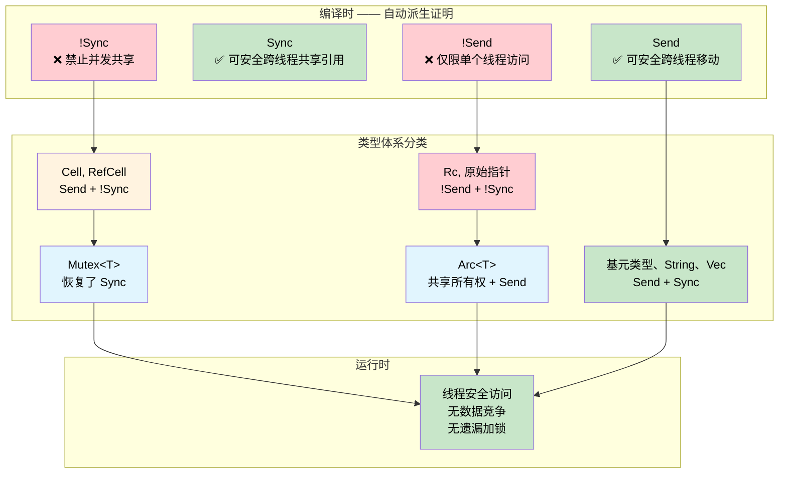

[English Original](../en/ch16-send-sync-compile-time-concurrency-proofs.md)

# Send & Sync —— 编译时并发证明 🟠

> **你将学到：**
> - Rust 的 `Send` 和 `Sync` 自动特性 (Auto-traits) 如何将编译器转变为并发审计员 —— 在编译阶段以零运行时开销证明哪些类型可以跨越线程边界，以及哪些类型可以被安全共享。
>
> **参考：** [第 4 章](ch04-capability-tokens-zero-cost-proof-of-aut.md)（能力令牌）、[第 9 章](ch09-phantom-types-for-resource-tracking.md)（幽灵类型）、[第 15 章](ch15-const-fn-compile-time-correctness-proofs.md)（const fn 证明）。

## 问题所在：无安全网的并发访问

在系统编程中，外设、共享缓冲区和全局状态会从多个上下文进行访问 —— 包括主循环、中断处理程序 (ISR)、DMA 回调以及工作线程。在 C 语言中，编译器对此不提供任何强制约束：

```c
/* 共享的传感器缓冲区 —— 同时从主循环和 ISR 访问 */
volatile uint32_t sensor_buf[64];
volatile uint32_t buf_index = 0;

void SENSOR_IRQHandler(void) {
    sensor_buf[buf_index++] = read_sensor();  /* 竞争：buf_index 的读取 + 写入 */
}

void process_sensors(void) {
    for (uint32_t i = 0; i < buf_index; i++) {  /* buf_index 在循环中途可能发生变化 */
        process(sensor_buf[i]);                   /* 数据在读取中途可能被覆写 */
    }
    buf_index = 0;                                /* ISR 可能在这些行之间触发 */
}
```

`volatile` 关键字虽然能防止编译器优化掉读取操作，但它对解决数据竞争 **毫无帮助**。两个上下文可以同时读写 `buf_index`，从而产生撕碎的值 (Torn values)、丢失的更新或缓冲区溢出。类似的问题也存在于 `pthread_mutex_t` 中 —— 编译器会非常放心地让你忘记加锁：

```c
pthread_mutex_t lock;
int shared_counter;

void increment(void) {
    shared_counter++;  /* 糟糕 —— 忘记调用 pthread_mutex_lock(&lock) 了 */
}
```

**每一个并发 Bug 都是在运行时被发现的** —— 通常是在高负载的生产环境中间歇性出现。

## Send 和 Sync 证明了什么

Rust 定义了两个由编译器自动派生 (derive) 的标记特性 (Marker Traits)：

| 特性 | 证明内容 | 通俗含义 |
|-------|-------|-------------------|
| `Send` | 类型为 `T` 的数值可以安全地 **移动 (Move)** 到另一个线程 | “它可以跨越线程边界” |
| `Sync` | **共享引用** `&T` 可以安全地被多个线程使用 | “它可以从多个线程同时读取” |

这些是 **自动特性 (Auto-traits)** —— 编译器通过检查结构体中的每一个字段来自动派生它们。如果结构体的所有字段都是 `Send`，那么该结构体就是 `Send`；如果所有字段都是 `Sync`，那么结构体就是 `Sync`。只要有一个字段选择退出 (Opt out)，整个结构体就会失去相应的特性。这种证明是基于结构的，无需人工标注，也没有运行时开销。

```mermaid
flowchart TD
    STRUCT["你的结构体"]
    INSPECT["编译器检查<br/>每一个字段"]
    ALL_SEND{"所有字段<br/>均为 Send？"}
    ALL_SYNC{"所有字段<br/>均为 Sync？"}
    SEND_YES["Send ✅<br/><i>可以跨越线程边界</i>"]
    SEND_NO["!Send ❌<br/><i>仅限单个线程访问</i>"]
    SYNC_YES["Sync ✅<br/><i>可以跨多线程共享</i>"]
    SYNC_NO["!Sync ❌<br/><i>禁止并发引用</i>"]

    STRUCT --> INSPECT
    INSPECT --> ALL_SEND
    INSPECT --> ALL_SYNC
    ALL_SEND -->|是| SEND_YES
    ALL_SEND -->|"存在任何 !Send 字段<br/>(如 Rc, *const T)"| SEND_NO
    ALL_SYNC -->|是| SYNC_YES
    ALL_SYNC -->|"存在任何 !Sync 字段<br/>(如 Cell, RefCell)"| SYNC_NO

    style SEND_YES fill:#c8e6c9,color:#000
    style SYNC_YES fill:#c8e6c9,color:#000
    style SEND_NO fill:#ffcdd2,color:#000
    style SYNC_NO fill:#ffcdd2,color:#000
```



> **编译器就是审计员。** 在 C 语言中，线程安全标注仅存在于注释和头文件文档中 —— 它们只是建议性的，从不强制。而在 Rust 中，`Send` 和 `Sync` 是从类型本身的结构推导出来的。只需添加一个 `Cell<f32>` 字段，包含它的结构体就会自动变为 `!Sync`。无需程序员介入，也没有遗忘的可能性。

这两个特性通过一个核心恒等式相联系：

> **`T` 是 `Sync` 当且仅当 `&T` 是 `Send`。**

这在直觉上是合理的：如果一个共享引用可以安全地发送到另一个线程，那么底层类型对于并发读取就是安全的。

### 选择退出的类型

某些类型被刻意标记为 `!Send` 或 `!Sync`：

| 类型 | Send | Sync | 原因 |
|------|:----:|:----:|-----|
| `u32`, `String`, `Vec<T>` | ✅ | ✅ | 无内部可变性，无原始指针 |
| `Cell<T>`, `RefCell<T>` | ✅ | ❌ | 具备内部可变性但没有同步机制 |
| `Rc<T>` | ❌ | ❌ | 引用计数是非原子的 |
| `*const T`, `*mut T` | ❌ | ❌ | 原始指针不提供安全保证 |
| `Arc<T>` (当 `T: Send + Sync`) | ✅ | ✅ | 原子引用计数 |
| `Mutex<T>` (当 `T: Send`) | ✅ | ✅ | 锁会将所有访问串行化 |

上表中的每一处 ❌ 都是一个 **编译时不变式**。你无法不小心将 `Rc` 发送到另一个线程 —— 编译器会拒绝这样做。

## !Send 外设句柄

在嵌入式系统中，外设寄存器块位于固定的内存地址，通常只能从单个执行上下文进行访问。原始指针本身就是 `!Send` 和 `!Sync` 的，因此封装一个原始指针会自动使包含它的类型退出这两个特性：

```rust
/// 内存映射 UART 外设的句柄。
/// 原始指针使其自动成为了 !Send 和 !Sync。
pub struct Uart {
    regs: *const u32,
}

impl Uart {
    pub fn new(base: usize) -> Self {
        Self { regs: base as *const u32 }
    }

    pub fn write_byte(&self, byte: u8) {
        // 在真实的固件中：unsafe { write_volatile(self.regs.add(DATA_OFFSET), byte as u32) }
        println!("UART TX: {:#04X}", byte);
    }
}

fn main() {
    let uart = Uart::new(0x4000_1000);
    uart.write_byte(b'A');  // ✅ 在创建它的线程上使用

    // ❌ 无法通过编译：Uart 是 !Send
    // std::thread::spawn(move || {
    //     uart.write_byte(b'B');
    // });
}
```

被注释掉的 `thread::spawn` 会产生以下报错：

```text
error[E0277]: `*const u32` cannot be sent between threads safely
   |
   |     std::thread::spawn(move || {
   |     ^^^^^^^^^^^^^^^^^^ within `Uart`, the trait `Send` is not
   |                        implemented for `*const u32`
```

**没有原始指针？使用 `PhantomData`。** 有时一个类型虽然不包含原始指针，但仍应被限制在单个线程内 —— 例如，一个文件描述符索引或一个从 C 库获取的句柄：

```rust
use std::marker::PhantomData;

/// 一个来自 C 库的不透明句柄。
/// 即使内部的 fd 只是个普通的整数，PhantomData<*const ()> 
/// 也能让它变为 !Send + !Sync。
pub struct LibHandle {
    fd: i32,
    _not_send: PhantomData<*const ()>,
}

impl LibHandle {
    pub fn open(path: &str) -> Self {
        let _ = path;
        Self { fd: 42, _not_send: PhantomData }
    }

    pub fn fd(&self) -> i32 { self.fd }
}

fn main() {
    let handle = LibHandle::open("/dev/sensor0");
    println!("fd = {}", handle.fd());

    // ❌ 无法通过编译：LibHandle 是 !Send
    // std::thread::spawn(move || { let _ = handle.fd(); });
}
```

这相当于在编译时强制执行了 C 语言中那种“请阅读文档，文档说该句柄不是线程安全的”约束。而在 Rust 中，是由编译器负责审计。

## Mutex 将 !Sync 转换为 Sync

`Cell<T>` 和 `RefCell<T>` 提供了内部可变性，但没有任何同步机制 —— 因此它们是 `!Sync` 的。但有时，你确实需要跨线程共享可变状态。`Mutex<T>` 增加了缺失的同步机制，而编译器能识别出这一点：

> **如果 `T: Send`，那么 `Mutex<T>: Send + Sync`。**

锁会将所有的访问串行化，从而使 `!Sync` 的内部类型变得安全。编译器是以结构化的方式证明这一点的 —— 无需在运行时检查“程序员是否加了锁”：

```rust
use std::sync::{Arc, Mutex};
use std::cell::Cell;

/// 一个使用 Cell 实现内部可变性的传感器缓存。
/// Cell<u32> 是 !Sync —— 无法直接跨线程共享。
struct SensorCache {
    last_reading: Cell<u32>,
    reading_count: Cell<u32>,
}

fn main() {
    // Mutex 使 SensorCache 共享变得安全 —— 编译器证明了这一点
    let cache = Arc::new(Mutex::new(SensorCache {
        last_reading: Cell::new(0),
        reading_count: Cell::new(0),
    }));

    let handles: Vec<_> = (0..4).map(|i| {
        let c = Arc::clone(&cache);
        std::thread::spawn(move || {
            let guard = c.lock().unwrap();  // 必须加锁才能访问
            guard.last_reading.set(i * 10);
            guard.reading_count.set(guard.reading_count.get() + 1);
        })
    }).collect();

    for h in handles { h.join().unwrap(); }

    let guard = cache.lock().unwrap();
    println!("上一次读取值：{}", guard.last_reading.get());
    println!("总读取次数：{}", guard.reading_count.get());
}
```

与 C 语言版本相比：`pthread_mutex_lock` 只是一个运行时的调用，程序员很容易遗漏。而在 Rust 中，类型系统使得你不通过 `Mutex` 就无法访问 `SensorCache`。这一证明是结构化的 —— 唯一的运行时开销就是锁本身。

> **`Mutex` 不仅仅是同步 —— 它还证明了同步。** `Mutex::lock()` 返回的是一个能 `Deref` 为 `&T` 的 `MutexGuard`。没有锁，就没法拿到内部数据的引用。API 设计使得“忘记加锁”在结构上是无法表达的。

## 函数约束作为定理

`std::thread::spawn` 的函数签名如下：

```rust,ignore
pub fn spawn<F, T>(f: F) -> JoinHandle<T>
where
    F: FnOnce() -> T + Send + 'static,
    T: Send + 'static,
```

其中的 `Send + 'static` 约束不仅仅是一个实现细节 —— 它是一个 **定理**：

> “任何传递给 `spawn` 的闭包及其返回值，在编译时均已证明可以在另一个线程上安全运行，且不包含悬空引用。”

你也可以在自己的 API 中应用同样的模式：

```rust
use std::sync::mpsc;

/// 在后台线程运行任务并返回其结果。
/// 该约束证明了：该闭包及其结果均是线程安全的。
fn run_on_background<F, T>(task: F) -> T
where
    F: FnOnce() -> T + Send + 'static,
    T: Send + 'static,
{
    let (tx, rx) = mpsc::channel();
    std::thread::spawn(move || {
        let _ = tx.send(task());
    });
    rx.recv().expect("后台任务发生 panic")
}

fn main() {
    // ✅ u32 是 Send 的，且闭包没有捕获任何非 Send 的内容
    let result = run_on_background(|| 6 * 7);
    println!("结果：{result}");

    // ✅ String 是 Send 的
    let greeting = run_on_background(|| String::from("来自后台的问候"));
    println!("{greeting}");

    // ❌ 无法通过编译：Rc 是 !Send 的
    // use std::rc::Rc;
    // let data = Rc::new(42);
    // run_on_background(move || *data);
}
```

取消对 `Rc` 示例的注释后，编译器会给出精确的诊断信息：

```text
error[E0277]: `Rc<i32>` cannot be sent between threads safely
   --> src/main.rs
    |
    |     run_on_background(move || *data);
    |     ^^^^^^^^^^^^^^^^^^ `Rc<i32>` cannot be sent between threads safely
```

编译器能将违规行为溯源到具体的约束 —— 并且告诉程序员 *原因*。对比一下 C 语言的 `pthread_create`：`void *arg` 接受任何东西 —— 无论是不是线程安全的。C 编译器无法区分非原子引用计数和普通整数。而 Rust 则是在类型层面确立了这一界限。

## 何时使用 Send/Sync 证明

| 场景 | 做法 |
|----------|----------|
| 封装了原始指针的外设句柄 | 自动获得 `!Send + !Sync` —— 无需额外操作 |
| 来自 C 库的句柄（整数 fd / 句柄） | 添加 `PhantomData<*const ()>` 以显式声明 `!Send + !Sync` |
| 锁保护下的共享配置信息 | `Arc<Mutex<T>>` —— 编译器会证明访问是安全的 |
| 跨线程消息传递 | `mpsc::channel` —— 自动强制执行 `Send` 约束 |
| 任务调度器或线程池 API | 在函数签名中要求 `F: Send + 'static` |
| 单线程资源 (例如 GPU 上下文) | 添加 `PhantomData<*const ()>` 以防止被跨线程共享 |
| 某些情形下应该为 `Send` 但包含原始指针 | 使用 `unsafe impl Send` 并记录安全理由 |

### 开销总结

| 内容 | 运行时开销 |
|------|:------:|
| `Send` / `Sync` 自动派生 | 仅编译时 —— 0 字节 |
| `PhantomData<*const ()>` 字段 | 零大小类型 —— 被优化掉 |
| `!Send` / `!Sync` 强制约束 | 仅编译时 —— 无运行时检查 |
| `F: Send + 'static` 函数约束 | 在编译时单态化 —— 静态分发，无装箱开销 |
| `Mutex<T>` 锁 | 运行时加锁 (共享可变性所必需) |
| `Arc<T>` 引用计数 | 原子加减 (共享所有权所必需) |

前四行均是 **零开销** 的 —— 它们仅存在于类型系统中，并在编译后彻底消失。`Mutex` 和 `Arc` 虽有不可避免的运行时成本，但这些成本是任何正确的并发程序都必须支付的“最低门槛”。Rust 只是确保你必须支付它们，而不能抱有侥幸心理。

## 练习：DMA 传输卫兵

设计一个 `DmaTransfer<T>` 类型，用于在 DMA 传输进行时持有缓冲区。要求：

1. `DmaTransfer` 必须是 `!Send` 的 —— DMA 控制器使用的是物理地址，且绑定了当前核心的内存总线。
2. `DmaTransfer` 必须是 `!Sync` 的 —— 如果 DMA 正在写入时发生并发读取，将会看到撕碎的数据。
3. 提供一个 `wait()` 方法来 **消费 (Consume)** 该卫兵并返回缓冲区 —— 所有权证明了传输已完成。
4. 缓冲区类型 `T` 必须实现一个名为 `DmaSafe` 的标记特性。

<details>
<summary>参考答案</summary>

```rust
use std::marker::PhantomData;

/// 标记特性：表示该类型可被用作 DMA 缓冲区。
/// 在真实的固件中：该类型必须是 repr(C) 的，且不含填充字节 (Padding)。
trait DmaSafe {}

impl DmaSafe for [u8; 64] {}
impl DmaSafe for [u8; 256] {}

/// 代表一个正在进行的 DMA 传输的卫兵 (Guard)。
/// !Send + !Sync：无法发送到其他线程，也无法共享。
pub struct DmaTransfer<T: DmaSafe> {
    buffer: T,
    channel: u8,
    _no_send_sync: PhantomData<*const ()>,
}

impl<T: DmaSafe> DmaTransfer<T> {
    /// 启动一个 DMA 传输。缓冲区被消费 —— 此外再无他人能触碰它。
    pub fn start(buffer: T, channel: u8) -> Self {
        // 在真实的固件中：配置 DMA 通道，设置源 / 目的地址，启动传输
        println!("DMA 通道 {} 已启动", channel);
        Self {
            buffer,
            channel,
            _no_send_sync: PhantomData,
        }
    }

    /// 等待传输完成并返回缓冲区。
    /// 消费 self —— 此后该卫兵将不复存在。
    pub fn wait(self) -> T {
        // 在真实的固件中：轮询 DMA 状态寄存器直到任务完成
        println!("DMA 通道 {} 传输完成", self.channel);
        self.buffer
    }
}

fn main() {
    let buf = [0u8; 64];

    // 开启传输 —— buf 被移动到了卫兵内部
    let transfer = DmaTransfer::start(buf, 2);

    // ❌ buf 此时已无法访问 —— 借由所有权防止了“DMA 传输期间仍被使用”的 Bug
    // println!("{:?}", buf);

    // ❌ 无法通过编译：DmaTransfer 是 !Send 的
    // std::thread::spawn(move || { transfer.wait(); });

    // ✅ 在原线程等待，并取回缓冲区
    let buf = transfer.wait();
    println!("缓冲区已回收：共 {} 字节", buf.len());
}
```

</details>



## 关键要点

1. **`Send` 和 `Sync` 是并发安全性在编译阶段的证明** —— 编译器通过检查每一个字段来自动推导出这些属性。没有标注，没有运行时开销，也不需要手动开启。

2. **原始指针会自动导致选择退出** —— 任何含有 `*const T` 或 `*mut T` 的类型都会自动变为 `!Send + !Sync`。这使得外设句柄自然地受到了线程层面的限制。

3. **`PhantomData<*const ()>` 是显式的退出声明** —— 当一个类型虽不包含原始指针但仍需线程限制（如 C 库句柄、GPU 上下文）时，一个幽灵字段便能完成该任务。

4. **`Mutex<T>` 能够有证明地恢复 `Sync`** —— 编译器在结构上证明了所有的访问都必然经过锁。与 C 语言的 `pthread_mutex_t` 不同，你不可能忘记加锁。

5. **函数约束即定理** —— 任务调度器签名中的 `F: Send + 'static` 属于一种证明责任：每一个调用点都必须证明其闭包是线程安全的。而 C 语言的 `void *arg` 则可以接受任何内容。

6. **该模式与所有其他正确性技巧互补** —— 类型状态 (Typestate) 证明了协议顺序，幽灵类型证明了权限，`const fn` 证明了数值不变式，而 `Send`/`Sync` 则证明了并发安全性。多管齐下，共同构成了完整的正确性保障。

***
