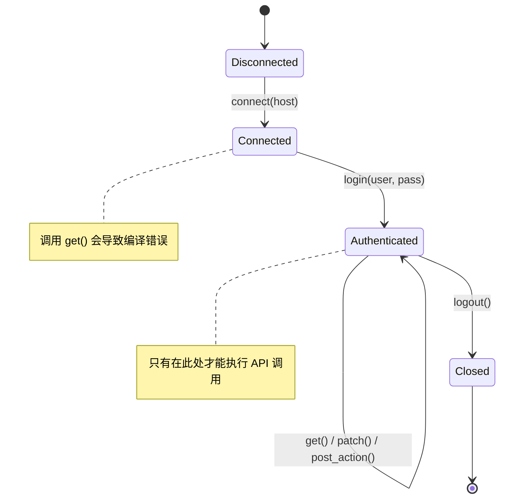
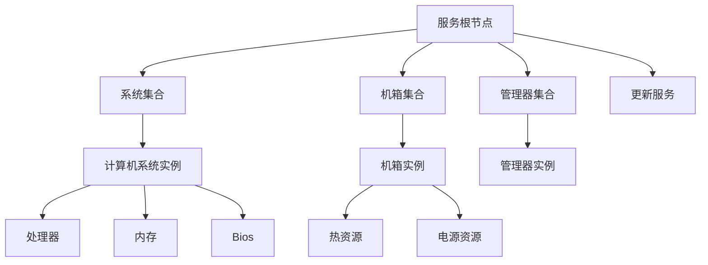
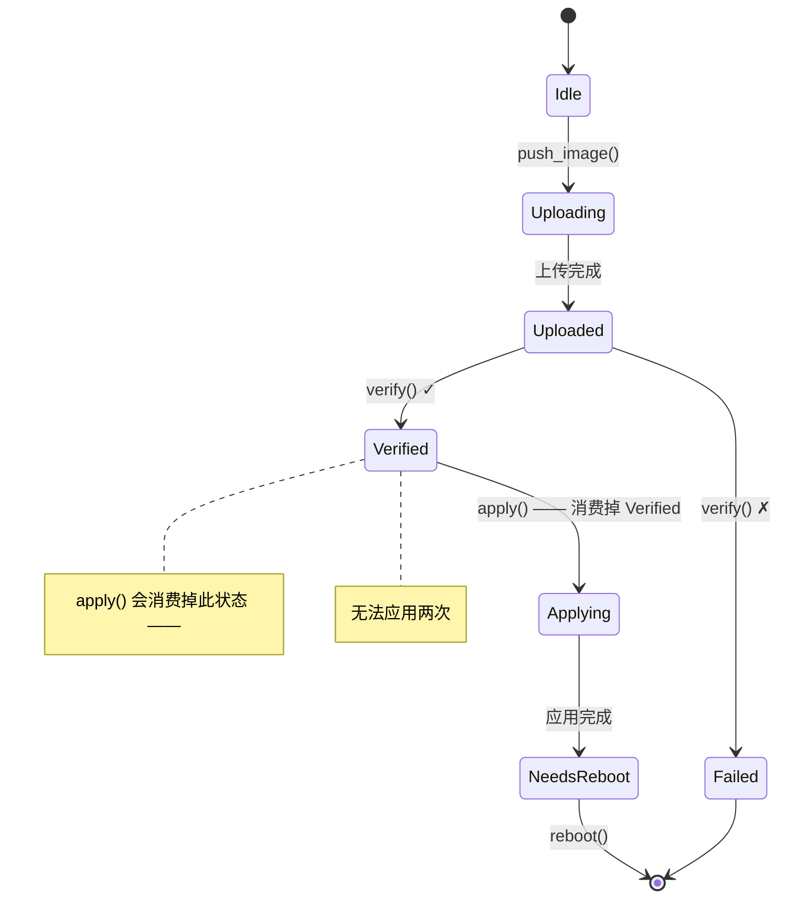

[English Original](../en/ch17-redfish-applied-walkthrough.md)

# 实战演练 —— 类型安全的 Redfish 客户端 🟡

> **你将学到：**
> - 如何将类型状态会话 (Type-state Sessions)、能力令牌 (Capability Tokens)、幽灵类型化的资源导航、维度分析 (Dimensional Analysis)、验证边界 (Validated Boundaries)、构建器类型状态 (Builder Type-state) 以及一次性类型 (Single-use Types) 组合成一个完整的、零开销的 Redfish 客户端 —— 在这里，任何违反协议的行为都将导致编译错误。
>
> **参考：** [第 2 章](ch02-typed-command-interfaces-request-determi.md)（类型化命令）、[第 3 章](ch03-single-use-types-cryptographic-guarantee.md)（一次性类型）、[第 4 章](ch04-capability-tokens-zero-cost-proof-of-aut.md)（能力令牌）、[第 5 章](ch05-protocol-state-machines-type-state-for-r.md)（类型状态）、[第 6 章](ch06-dimensional-analysis-making-the-compiler.md)（维度分析）、[第 7 章](ch07-validated-boundaries-parse-dont-validate.md)（验证边界）、[第 9 章](ch09-phantom-types-for-resource-tracking.md)（幽灵类型）、[第 10 章](ch10-putting-it-all-together-a-complete-diagn.md)（IPMI 集成）、[第 11 章](ch11-fourteen-tricks-from-the-trenches.md)（技巧 4 —— 构建器类型状态）。

## 为什么 Redfish 值得单独拿出一章来讨论

第 10 章围绕 IPMI 这一字节级协议组合了核心模式。然而，目前大多数 BMC 平台都会同时提供（或仅提供）**Redfish** REST API。Redfish 引入了其特有的一系列正确性风险：

| 风险 / 隐患 | 示例 | 后果 |
|--------|---------|-------------|
| 格式错误的 URI | `GET /redfish/v1/Chassis/1/Processors` (父节点错误) | 404 错误或静默返回错误数据 |
| 在错误的电源状态下执行操作 | 对已下电系统执行 `Reset(ForceOff)` | BMC 返回错误，甚至与其他操作发生竞争 |
| 缺少权限 | 操作员级别的代码调用了 `Manager.ResetToDefaults` | 生产环境中的 403 错误，安全审计发现项 |
| 不完整的 PATCH 操作 | 在 PATCH 请求体中遗漏了必需的 BIOS 属性 | 静默的空操作或部分配置损坏 |
| 未经验证的固件应用 | 在执行镜像完整性检查前调用了 `SimpleUpdate` | 导致 BMC 变砖 (损坏) |
| 架构版本不匹配 | 在 v1.5 的 BMC 上访问 `LastResetTime` (该字段在 v1.13 引入) | `null` 字段 → 运行时发生 panic |
| 遥测数据中的单位混淆 | 将入口温度 (°C) 与功耗 (W) 进行对比 | 产生荒谬的阈值判定结果 |

在 C、Python 或未类型化的 Rust 中，上述每一点都只能依靠程序员的自律和测试来防范。本章将使它们变成 **编译错误**。

## 未类型化的 Redfish 客户端

一个典型的 Redfish 客户端通常如下所示：

```rust,ignore
use std::collections::HashMap;

struct RedfishClient {
    base_url: String,
    token: Option<String>,
}

impl RedfishClient {
    fn get(&self, path: &str) -> Result<serde_json::Value, String> {
        // ... HTTP GET ...
        Ok(serde_json::json!({})) // 桩代码
    }

    fn patch(&self, path: &str, body: &serde_json::Value) -> Result<(), String> {
        // ... HTTP PATCH ...
        Ok(()) // 桩代码
    }

    fn post_action(&self, path: &str, body: &serde_json::Value) -> Result<(), String> {
        // ... HTTP POST ...
        Ok(()) // 桩代码
    }
}

fn check_thermal(client: &RedfishClient) -> Result<(), String> {
    let resp = client.get("/redfish/v1/Chassis/1/Thermal")?;

    // 🐛 该字段一定存在吗？如果 BMC 返回 null 怎么办？
    let cpu_temp = resp["Temperatures"][0]["ReadingCelsius"]
        .as_f64().unwrap();

    let fan_rpm = resp["Fans"][0]["Reading"]
        .as_f64().unwrap();

    // 🐛 将摄氏度 (°C) 与 RPM 进行对比 —— 二者都是 f64
    if cpu_temp > fan_rpm {
        println!("热设计问题");
    }

    // 🐛 路径是否正确？并没有编译时检查。
    client.post_action(
        "/redfish/v1/Systems/1/Actions/ComputerSystem.Reset",
        &serde_json::json!({"ResetType": "ForceOff"})
    )?;

    Ok(())
}
```

这段代码在“理想情况下”能正常工作，但隐患重重。每一个 `unwrap()` 都是潜在的 panic 风险，每一个字符串路径都是未经校验的假设，而单位混淆则完全不可见。

---

## 第 1 节 —— 会话生命周期 (类型状态，第 5 章)

Redfish 会话具有严格的生命周期：连接 → 身份验证 → 使用 → 关闭。我们将每个状态编码为不同的类型。



```rust,ignore
use std::marker::PhantomData;

// ──── 会话状态 ────

pub struct Disconnected;
pub struct Connected;
pub struct Authenticated;

pub struct RedfishSession<S> {
    base_url: String,
    auth_token: Option<String>,
    _state: PhantomData<S>,
}

impl RedfishSession<Disconnected> {
    pub fn new(host: &str) -> Self {
        RedfishSession {
            base_url: format!("https://{}", host),
            auth_token: None,
            _state: PhantomData,
        }
    }

    /// 状态转换：Disconnected → Connected。
    /// 验证服务根节点 (Service Root) 是否可达。
    pub fn connect(self) -> Result<RedfishSession<Connected>, RedfishError> {
        // GET /redfish/v1 —— 验证服务根节点
        println!("正在连接至 {}/redfish/v1", self.base_url);
        Ok(RedfishSession {
            base_url: self.base_url,
            auth_token: None,
            _state: PhantomData,
        })
    }
}

impl RedfishSession<Connected> {
    /// 状态转换：Connected → Authenticated。
    /// 通过 POST /redfish/v1/SessionService/Sessions 创建会话。
    pub fn login(
        self,
        user: &get_str,
        _pass: &str,
    ) -> Result<(RedfishSession<Authenticated>, LoginToken), RedfishError> {
        // POST /redfish/v1/SessionService/Sessions
        println!("已通过身份验证，用户为：{}", user);
        let token = "X-Auth-Token-abc123".to_string();
        Ok((
            RedfishSession {
                base_url: self.base_url,
                auth_token: Some(token),
                _state: PhantomData,
            },
            LoginToken { _private: () },
        ))
    }
}

impl RedfishSession<Authenticated> {
    /// 仅在经过身份验证 (Authenticated) 的会话上可用。
    fn http_get(&self, path: &str) -> Result<serde_json::Value, RedfishError> {
        let _url = format!("{}{}", self.base_url, path);
        // ... 带上 auth_token 头部执行 HTTP GET ...
        Ok(serde_json::json!({})) // 桩代码
    }

    fn http_patch(
        &self,
        path: &str,
        body: &serde_json::Value,
    ) -> Result<serde_json::Value, RedfishError> {
        let _url = format!("{}{}", self.base_url, path);
        let _ = body;
        Ok(serde_json::json!({})) // 桩代码
    }

    fn http_post(
        &self,
        path: &str,
        body: &serde_json::Value,
    ) -> Result<serde_json::Value, RedfishError> {
        let _url = format!("{}{}", self.base_url, path);
        let _ = body;
        Ok(serde_json::json!({})) // 桩代码
    }

    /// 状态转换：Authenticated → Closed (消费掉该会话)。
    pub fn logout(self) {
        // DELETE /redfish/v1/SessionService/Sessions/{id}
        println!("会话已关闭");
        // self 已被消费 —— 登出后无法再使用该会话
    }
}

// 尝试在非 Authenticated 会话上调用 http_get：
//
//   let session = RedfishSession::new("bmc01").connect()?;
//   session.http_get("/redfish/v1/Systems");
//   ❌ 错误：在 `RedfishSession<Connected>` 上找不到方法 `http_get`

#[derive(Debug)]
pub enum RedfishError {
    ConnectionFailed(String),
    AuthenticationFailed(String),
    HttpError { status: u16, message: String },
    ValidationError(String),
}

impl std::fmt::Display for RedfishError {
    fn fmt(&self, f: &mut std::fmt::Formatter<'_>) -> std::fmt::Result {
        match self {
            Self::ConnectionFailed(msg) => write!(f, "连接失败: {msg}"),
            Self::AuthenticationFailed(msg) => write!(f, "身份验证失败: {msg}"),
            Self::HttpError { status, message } =>
                write!(f, "HTTP {status}: {message}"),
            Self::ValidationError(msg) => write!(f, "验证错误: {msg}"),
        }
    }
}
```

**被彻底消除的 Bug：** 在未连接或未认证的会话上发送请求。这类方法根本不存在 —— 因而没有程序员会遗漏运行时检查的风险。

---

## 第 2 节 —— 权限令牌 (能力令牌，第 4 章)

Redfish 定义了四个权限级别：`Login`、`ConfigureComponents`、`ConfigureManager`、`ConfigureSelf`。我们不选择在运行时检查权限，而是通过零大小的证明令牌来编码它们。

```rust,ignore
// ──── 权限令牌 (零大小) ────

/// 调用者拥有 Login 权限的证明。
/// 由成功的登录操作返回 —— 获取该令牌的唯一途径。
pub struct LoginToken { _private: () }

/// 调用者拥有 ConfigureComponents 权限的证明。
/// 仅能通过管理员级别的身份验证获取。
pub struct ConfigureComponentsToken { _private: () }

/// 调用者拥有 ConfigureManager 权限 (固件更新等) 的证明。
pub struct ConfigureManagerToken { _private: () }

// 扩展 login 方法，根据角色返回权限令牌：

impl RedfishSession<Connected> {
    /// 管理员登录 —— 返回所有的权限令牌。
    pub fn login_admin(
        self,
        user: &str,
        pass: &str,
    ) -> Result<(
        RedfishSession<Authenticated>,
        LoginToken,
        ConfigureComponentsToken,
        ConfigureManagerToken,
    ), RedfishError> {
        let (session, login_tok) = self.login(user, pass)?;
        Ok((
            session,
            login_tok,
            ConfigureComponentsToken { _private: () },
            ConfigureManagerToken { _private: () },
        ))
    }

    /// 操作员登录 —— 仅返回 Login + ConfigureComponents。
    pub fn login_operator(
        self,
        user: &str,
        pass: &str,
    ) -> Result<(
        RedfishSession<Authenticated>,
        LoginToken,
        ConfigureComponentsToken,
    ), RedfishError> {
        let (session, login_tok) = self.login(user, pass)?;
        Ok((
            session,
            login_tok,
            ConfigureComponentsToken { _private: () },
        ))
    }

    /// 只读登录 —— 仅返回 Login 令牌。
    pub fn login_readonly(
        self,
        user: &str,
        pass: &str,
    ) -> Result<(RedfishSession<Authenticated>, LoginToken), RedfishError> {
        self.login(user, pass)
    }
}
```

现在，权限要求已成为函数签名的一部分：

```rust,ignore
# use std::marker::PhantomData;
# pub struct Authenticated;
# pub struct RedfishSession<S> { base_url: String, auth_token: Option<String>, _state: PhantomData<S> }
# pub struct LoginToken { _private: () }
# pub struct ConfigureComponentsToken { _private: () }
# pub struct ConfigureManagerToken { _private: () }
# #[derive(Debug)] pub enum RedfishError { HttpError { status: u16, message: String } }

/// 任何拥有 Login 权限的用户均可读取热设计数据。
fn get_thermal(
    session: &RedfishSession<Authenticated>,
    _proof: &LoginToken,
) -> Result<serde_json::Value, RedfishError> {
    // GET /redfish/v1/Chassis/1/Thermal
    Ok(serde_json::json!({})) // 桩代码
}

/// 修改启动顺序需要 ConfigureComponents 权限。
fn set_boot_order(
    session: &RedfishSession<Authenticated>,
    _proof: &ConfigureComponentsToken,
    order: &[&str],
) -> Result<(), RedfishError> {
    let _ = order;
    // PATCH /redfish/v1/Systems/1
    Ok(())
}

/// 恢复出厂设置需要 ConfigureManager 权限。
fn reset_to_defaults(
    session: &RedfishSession<Authenticated>,
    _proof: &ConfigureManagerToken,
) -> Result<(), RedfishError> {
    // POST .../Actions/Manager.ResetToDefaults
    Ok(())
}

// 尝试在操作员级别的代码中调用 reset_to_defaults：
//
//   let (session, login, configure) = session.login_operator("op", "pass")?;
//   reset_to_defaults(&session, &???);
//   ❌ 错误：无法获取 ConfigureManagerToken —— 操作员无法执行此操作
```

**被彻底消除的 Bug：** 权限提升。操作员级别的登录从物理上就无法产生 `ConfigureManagerToken` —— 编译器不会允许代码引用它。而在生成的二进制文件中，这些令牌并不占空间，因此没有运行时开销。

---

## 第 3 节 —— 类型化的资源导航 (幽灵类型，第 9 章)

Redfish 资源构成了一棵树。将这一层级结构编码为类型，可以防止构造出非法的 URI：



```rust,ignore
use std::marker::PhantomData;

// ──── 资源类型标记 ────

pub struct ServiceRoot;
pub struct SystemsCollection;
pub struct ComputerSystem;
pub struct ChassisCollection;
pub struct ChassisInstance;
pub struct ThermalResource;
pub struct PowerResource;
pub struct BiosResource;
pub struct ManagersCollection;
pub struct ManagerInstance;
pub struct UpdateServiceResource;

// ──── 类型化的资源路径 ────

pub struct RedfishPath<R> {
    uri: String,
    _resource: PhantomData<R>,
}

impl RedfishPath<ServiceRoot> {
    pub fn root() -> Self {
        RedfishPath {
            uri: "/redfish/v1".to_string(),
            _resource: PhantomData,
        }
    }

    pub fn systems(&self) -> RedfishPath<SystemsCollection> {
        RedfishPath {
            uri: format!("{}/Systems", self.uri),
            _resource: PhantomData,
        }
    }

    pub fn chassis(&self) -> RedfishPath<ChassisCollection> {
        RedfishPath {
            uri: format!("{}/Chassis", self.uri),
            _resource: PhantomData,
        }
    }

    pub fn managers(&self) -> RedfishPath<ManagersCollection> {
        RedfishPath {
            uri: format!("{}/Managers", self.uri),
            _resource: PhantomData,
        }
    }

    pub fn update_service(&self) -> RedfishPath<UpdateServiceResource> {
        RedfishPath {
            uri: format!("{}/UpdateService", self.uri),
            _resource: PhantomData,
        }
    }
}

impl RedfishPath<SystemsCollection> {
    pub fn system(&self, id: &str) -> RedfishPath<ComputerSystem> {
        RedfishPath {
            uri: format!("{}/{}", self.uri, id),
            _resource: PhantomData,
        }
    }
}

impl RedfishPath<ComputerSystem> {
    pub fn bios(&self) -> RedfishPath<BiosResource> {
        RedfishPath {
            uri: format!("{}/Bios", self.uri),
            _resource: PhantomData,
        }
    }
}

impl RedfishPath<ChassisCollection> {
    pub fn instance(&self, id: &str) -> RedfishPath<ChassisInstance> {
        RedfishPath {
            uri: format!("{}/{}", self.uri, id),
            _resource: PhantomData,
        }
    }
}

impl RedfishPath<ChassisInstance> {
    pub fn thermal(&self) -> RedfishPath<ThermalResource> {
        RedfishPath {
            uri: format!("{}/Thermal", self.uri),
            _resource: PhantomData,
        }
    }

    pub fn power(&self) -> RedfishPath<PowerResource> {
        RedfishPath {
            uri: format!("{}/Power", self.uri),
            _resource: PhantomData,
        }
    }
}

impl RedfishPath<ManagersCollection> {
    pub fn manager(&self, id: &str) -> RedfishPath<ManagerInstance> {
        RedfishPath {
            uri: format!("{}/{}", self.uri, id),
            _resource: PhantomData,
        }
    }
}

impl<R> RedfishPath<R> {
    pub fn uri(&self) -> &str {
        &self.uri
    }
}

// ── 使用示例 ──

fn build_paths() {
    let root = RedfishPath::root();

    // ✅ 有效的导航
    let thermal = root.chassis().instance("1").thermal();
    assert_eq!(thermal.uri(), "/redfish/v1/Chassis/1/Thermal");

    let bios = root.systems().system("1").bios();
    assert_eq!(bios.uri(), "/redfish/v1/Systems/1/Bios");

    // ❌ 编译错误：ServiceRoot 没有 .thermal() 方法
    // root.thermal();

    // ❌ 编译错误：SystemsCollection 没有 .bios() 方法
    // root.systems().bios();

    // ❌ 编译错误：ChassisInstance 没有 .bios() 方法
    // root.chassis().instance("1").bios();
}
```

**被彻底消除的 Bug：** 格式错误的 URI，或尝试导航到给定父节点下并不存在的子资源。层级结构是在结构上强制执行的 —— 你只能通过 `Chassis → Instance → Thermal` 这一路径访问到 `Thermal` 资源。

---

## 第 4 节 —— 类型化的遥测读取 (类型化命令 + 维度分析，第 2 章 + 第 6 章)

将类型化的资源路径与具备维度的返回类型结合起来，使编译器能够知晓每一个读数所携带的单位：

```rust,ignore
use std::marker::PhantomData;

// ──── 维度类型 (第 6 章) ────

#[derive(Debug, Clone, Copy, PartialEq, PartialOrd)]
pub struct Celsius(pub f64);

#[derive(Debug, Clone, Copy, PartialEq, PartialOrd)]
pub struct Rpm(pub u32);

#[derive(Debug, Clone, Copy, PartialEq, PartialOrd)]
pub struct Watts(pub f64);

#[derive(Debug, Clone, Copy, PartialEq, PartialOrd)]
pub struct Volts(pub f64);

// ──── 类型化的 Redfish GET (将第 2 章的模式应用于 REST) ────

/// Redfish 资源类型决定了其解析后的响应结构。
pub trait RedfishResource {
    type Response;
    fn parse(json: &serde_json::Value) -> Result<Self::Response, RedfishError>;
}

// ──── 已验证的热设计响应 (第 7 章) ────

#[derive(Debug)]
pub struct ValidThermalResponse {
    pub temperatures: Vec<TemperatureReading>,
    pub fans: Vec<FanReading>,
}

#[derive(Debug)]
pub struct TemperatureReading {
    pub name: String,
    pub reading: Celsius,           // ← 使用维度类型，而非 f64
    pub upper_critical: Celsius,
    pub status: HealthStatus,
}

#[derive(Debug)]
pub struct FanReading {
    pub name: String,
    pub reading: Rpm,               // ← 使用维度类型，而非 u32
    pub status: HealthStatus,
}

#[derive(Debug, Clone, Copy, PartialEq)]
pub enum HealthStatus { Ok, Warning, Critical }

impl RedfishResource for ThermalResource {
    type Response = ValidThermalResponse;

    fn parse(json: &serde_json::Value) -> Result<ValidThermalResponse, RedfishError> {
        // 在单次读取中完成解析与验证 —— 边界验证 (第 7 章)
        let temps = json["Temperatures"]
            .as_array()
            .ok_or_else(|| RedfishError::ValidationError(
                "缺少 Temperatures 数组".into(),
            ))?
            .iter()
            .map(|t| {
                Ok(TemperatureReading {
                    name: t["Name"]
                        .as_str()
                        .ok_or_else(|| RedfishError::ValidationError(
                            "缺少 Name 字段".into(),
                        ))?
                        .to_string(),
                    reading: Celsius(
                        t["ReadingCelsius"]
                            .as_f64()
                            .ok_or_else(|| RedfishError::ValidationError(
                                "缺少 ReadingCelsius 字段".into(),
                            ))?,
                    ),
                    upper_critical: Celsius(
                        t["UpperThresholdCritical"]
                            .as_f64()
                            .unwrap_or(105.0), // 针对缺失阈值的情况使用安全默认值
                    ),
                    status: parse_health(
                        t["Status"]["Health"]
                            .as_str()
                            .unwrap_or("OK"),
                    ),
                })
            })
            .collect::<Result<Vec<_>, _>>()?;

        let fans = json["Fans"]
            .as_array()
            .ok_or_else(|| RedfishError::ValidationError(
                "缺少 Fans 数组".into(),
            ))?
            .iter()
            .map(|f| {
                Ok(FanReading {
                    name: f["Name"]
                        .as_str()
                        .ok_or_else(|| RedfishError::ValidationError(
                            "缺少 Name 字段".into(),
                        ))?
                        .to_string(),
                    reading: Rpm(
                        f["Reading"]
                            .as_u64()
                            .ok_or_else(|| RedfishError::ValidationError(
                                "缺少 Reading 字段".into(),
                            ))? as u32,
                    ),
                    status: parse_health(
                        f["Status"]["Health"]
                            .as_str()
                            .unwrap_or("OK"),
                    ),
                })
            })
            .collect::<Result<Vec<_>, _>>()?;

        Ok(ValidThermalResponse { temperatures: temps, fans })
    }
}

fn parse_health(s: &str) -> HealthStatus {
    match s {
        "OK" => HealthStatus::Ok,
        "Warning" => HealthStatus::Warning,
        _ => HealthStatus::Critical,
    }
}

// ──── 在经过认证的会话上执行类型化的 GET ────

impl RedfishSession<Authenticated> {
    pub fn get_resource<R: RedfishResource>(
        &self,
        path: &RedfishPath<R>,
    ) -> Result<R::Response, RedfishError> {
        let json = self.http_get(path.uri())?;
        R::parse(&json)
    }
}

// ── 使用示例 ──

fn read_thermal(
    session: &RedfishSession<Authenticated>,
    _proof: &LoginToken,
) -> Result<(), RedfishError> {
    let path = RedfishPath::root().chassis().instance("1").thermal();

    // 响应类型会被推导为：ValidThermalResponse
    let thermal = session.get_resource(&path)?;

    for t in &thermal.temperatures {
        // t.reading 的类型是 Celsius —— 只能与 Celsius 进行对比
        if t.reading > t.upper_critical {
            println!("临界状态 (CRITICAL)：{} 当前值为 {:?}", t.name, t.reading);
        }

        // ❌ 编译错误：无法将 Celsius 与 Rpm 进行对比
        // if t.reading > thermal.fans[0].reading { }

        // ❌ 编译错误：无法将 Celsius 与 Watts 进行对比
        // if t.reading > Watts(350.0) { }
    }

    Ok(())
}
```

**被彻底消除的 Bug：**
- **单位混淆：** `Celsius` ≠ `Rpm` ≠ `Watts` —— 编译器会拒绝不合法的对比。
- **由于字段缺失导致的 panic：** `parse()` 会在边界处完成验证；`ValidThermalResponse` 保证了所有字段均已存在。
- **错误的响应类型：** `get_resource(&thermal_path)` 返回的是 `ValidThermalResponse` 而非原始 JSON。资源类型在编译时就决定了响应的类型。

---

## 第 5 节 —— 使用构建器类型状态执行 PATCH (第 11 章，技巧 4)

Redfish 的 PATCH 负载必须包含特定字段。如果构建器在必需字段未设置时禁止调用 `.apply()`，就能防止不完整或空的补丁操作：

```rust,ignore
use std::marker::PhantomData;

// ──── 用于必需字段的类型级布尔值 ────

pub struct FieldUnset;
pub struct FieldSet;

// ──── BIOS 配置 PATCH 构建器 ────

pub struct BiosPatchBuilder<BootOrder, TpmState> {
    boot_order: Option<Vec<String>>,
    tpm_enabled: Option<bool>,
    _markers: PhantomData<(BootOrder, TpmState)>,
}

impl BiosPatchBuilder<FieldUnset, FieldUnset> {
    pub fn new() -> Self {
        BiosPatchBuilder {
            boot_order: None,
            tpm_enabled: None,
            _markers: PhantomData,
        }
    }
}

impl<T> BiosPatchBuilder<FieldUnset, T> {
    /// 设置启动顺序 —— 将 BootOrder 标记转换为 FieldSet。
    pub fn boot_order(self, order: Vec<String>) -> BiosPatchBuilder<FieldSet, T> {
        BiosPatchBuilder {
            boot_order: Some(order),
            tpm_enabled: self.tpm_enabled,
            _markers: PhantomData,
        }
    }
}

impl<B> BiosPatchBuilder<B, FieldUnset> {
    /// 设置 TPM 状态 —— 将 TpmState 标记转换为 FieldSet。
    pub fn tpm_enabled(self, enabled: bool) -> BiosPatchBuilder<B, FieldSet> {
        BiosPatchBuilder {
            boot_order: self.boot_order,
            tpm_enabled: Some(enabled),
            _markers: PhantomData,
        }
    }
}

impl BiosPatchBuilder<FieldSet, FieldSet> {
    /// 只有当所有必需字段都已设置时，.apply() 方法才存在。
    pub fn apply(
        self,
        session: &RedfishSession<Authenticated>,
        _proof: &ConfigureComponentsToken,
        system: &RedfishPath<ComputerSystem>,
    ) -> Result<(), RedfishError> {
        let body = serde_json::json!({
            "Boot": {
                "BootOrder": self.boot_order.unwrap(),
            },
            "Oem": {
                "TpmEnabled": self.tpm_enabled.unwrap(),
            }
        });
        session.http_patch(
            &format!("{}/Bios/Settings", system.uri()),
            &body,
        )?;
        Ok(())
    }
}

// ── 使用示例 ──

fn configure_bios(
    session: &RedfishSession<Authenticated>,
    configure: &ConfigureComponentsToken,
    system: &RedfishPath<ComputerSystem>,
) -> Result<(), RedfishError> {
    // ✅ 两个必需字段均已设置 —— .apply() 可用
    BiosPatchBuilder::new()
        .boot_order(vec!["Pxe".into(), "Hdd".into()])
        .tpm_enabled(true)
        .apply(session, configure, system)?;

    // ❌ 编译错误：在 `BiosPatchBuilder<FieldSet, FieldUnset>` 上找不到 .apply() 方法
    // BiosPatchBuilder::new()
    //     .boot_order(vec!["Pxe".into()])
    //     .apply(session, configure, system)?;

    // ❌ 编译错误：在 `BiosPatchBuilder<FieldUnset, FieldUnset>` 上找不到 .apply() 方法
    // BiosPatchBuilder::new()
    //     .apply(session, configure, system)?;

    Ok(())
}
```

**被彻底消除的 Bug：**
- **空的 PATCH：** 在未设置所有必需字段前无法调用 `.apply()`。
- **缺少权限：** `.apply()` 需要传入 `&ConfigureComponentsToken`。
- **错误的资源：** 接受的是 `&RedfishPath<ComputerSystem>` 而非原始字符串。

---

## 第 6 节 —— 固件更新生命周期 (一次性类型 + 类型状态，第 3 章 + 第 5 章)

Redfish 的 `UpdateService` 具有严格的执行序列：推送镜像 → 验证 → 应用 → 重启。每个阶段必须恰好发生一次，且顺序固定。



```rust,ignore
use std::marker::PhantomData;

// ──── 固件更新状态 ────

pub struct FwIdle;
pub struct FwUploaded;
pub struct FwVerified;
pub struct FwApplying;
pub struct FwNeedsReboot;

pub struct FirmwareUpdate<S> {
    task_uri: String,
    image_hash: String,
    _phase: PhantomData<S>,
}

impl FirmwareUpdate<FwIdle> {
    pub fn push_image(
        session: &RedfishSession<Authenticated>,
        _proof: &ConfigureManagerToken,
        image: &[u8],
    ) -> Result<FirmwareUpdate<FwUploaded>, RedfishError> {
        // 调用 POST /redfish/v1/UpdateService/Actions/UpdateService.SimpleUpdate
        // 或分段推送至 /redfish/v1/UpdateService/upload
        let _ = image;
        println!("镜像已上传 ({} 字节)", image.len());
        Ok(FirmwareUpdate {
            task_uri: "/redfish/v1/TaskService/Tasks/1".to_string(),
            image_hash: "sha256:abc123".to_string(),
            _phase: PhantomData,
        })
    }
}

impl FirmwareUpdate<FwUploaded> {
    /// 验证镜像完整性。成功后返回 FwVerified。
    pub fn verify(self) -> Result<FirmwareUpdate<FwVerified>, RedfishError> {
        // 轮询任务直至验证完成
        println!("镜像已验证，哈希值为：{}", self.image_hash);
        Ok(FirmwareUpdate {
            task_uri: self.task_uri,
            image_hash: self.image_hash,
            _phase: PhantomData,
        })
    }
}

impl FirmwareUpdate<FwVerified> {
    /// 应用更新。会消费掉 self —— 无法应用两次。
    /// 这即是第 3 章对应的一次性模式。
    pub fn apply(self) -> Result<FirmwareUpdate<FwNeedsReboot>, RedfishError> {
        // 调用 PATCH /redfish/v1/UpdateService —— 设置 ApplyTime
        println!("固件已应用，任务 URI 为：{}", self.task_uri);
        // self 已被移动 —— 再次调用 apply() 将导致编译错误
        Ok(FirmwareUpdate {
            task_uri: self.task_uri,
            image_hash: self.image_hash,
            _phase: PhantomData,
        })
    }
}

impl FirmwareUpdate<FwNeedsReboot> {
    /// 通过重启激活新固件。
    pub fn reboot(
        self,
        session: &RedfishSession<Authenticated>,
        _proof: &ConfigureManagerToken,
    ) -> Result<(), RedfishError> {
        // 调用 POST .../Actions/Manager.Reset {"ResetType": "GracefulRestart"}
        let _ = session;
        println!("BMC 正在重启以激活新固件");
        Ok(())
    }
}

// ── 使用示例 ──

fn update_bmc_firmware(
    session: &RedfishSession<Authenticated>,
    manager_proof: &ConfigureManagerToken,
    image: &[u8],
) -> Result<(), RedfishError> {
    // 每一步都会返回下一个状态 —— 旧状态会被消费掉
    let uploaded = FirmwareUpdate::push_image(session, manager_proof, image)?;
    let verified = uploaded.verify()?;
    let needs_reboot = verified.apply()?;
    needs_reboot.reboot(session, manager_proof)?;

    // ❌ 编译错误：使用了已移动的值 `verified`
    // verified.apply()?;

    // ❌ 编译错误：`FirmwareUpdate<FwUploaded>` 没有 .apply() 方法
    // uploaded.apply()?;      // 必须先经过验证！

    // ❌ 编译错误：push_image 需要传入 &ConfigureManagerToken
    // FirmwareUpdate::push_image(session, &login_token, image)?;

    Ok(())
}
```

**被彻底消除的 Bug：**
- **应用未经验证的固件：** `.apply()` 方法仅在 `FwVerified` 状态上存在。
- **重复应用：** `apply()` 消费了 `self` —— 被移动的值无法再次使用。
- **跳过重启：** `FwNeedsReboot` 是一个独立的类型；你不可能在固件暂存期间意外继续常规操作。
- **越权更新：** `push_image()` 需要传入 `&ConfigureManagerToken`。

---

## 第 7 节 —— 总结与集成

以下是集成了上述六个小节的完整诊断工作流：

```rust,ignore
fn full_redfish_diagnostic() -> Result<(), RedfishError> {
    // ── 1. 会话生命周期 (第 1 节) ──
    let session = RedfishSession::new("bmc01.lab.local");
    let session = session.connect()?;

    // ── 2. 权限令牌 (第 2 节) ──
    // 管理员登录 —— 获取所有的能力令牌
    let (session, _login, configure, manager) =
        session.login_admin("admin", "p@ssw0rd")?;

    // ── 3. 类型化导航 (第 3 节) ──
    let thermal_path = RedfishPath::root()
        .chassis()
        .instance("1")
        .thermal();

    // ── 4. 类型化遥测读取 (第 4 节) ──
    let thermal: ValidThermalResponse = session.get_resource(&thermal_path)?;

    for t in &thermal.temperatures {
        // 摄氏度只能与摄氏度对比 —— 维度安全性
        if t.reading > t.upper_critical {
            println!("🔥 {} 处于临界状态: {:?}", t.name, t.reading);
        }
    }

    for f in &thermal.fans {
        if f.reading < Rpm(1000) {
            println!("⚠ {} 低于阈值: {:?}", f.name, f.reading);
        }
    }

    // ── 5. 类型安全的 PATCH (第 5 节) ──
    let system_path = RedfishPath::root().systems().system("1");

    BiosPatchBuilder::new()
        .boot_order(vec!["Pxe".into(), "Hdd".into()])
        .tpm_enabled(true)
        .apply(&session, &configure, &system_path)?;

    // ── 6. 固件更新生命周期 (第 6 节) ──
    let firmware_image = include_bytes!("bmc_firmware.bin");
    let uploaded = FirmwareUpdate::push_image(&session, &manager, firmware_image)?;
    let verified = uploaded.verify()?;
    let needs_reboot = verified.apply()?;

    // ── 7. 安全关闭 (Clean shutdown) ──
    needs_reboot.reboot(&session, &manager)?;
    session.logout();

    Ok(())
}
```

### 编译器证明了什么

| # | Bug 类别 | 如何防范 | 模式 (对应章节) |
|---|-----------|-------------------|-------------------|
| 1 | 在未认证的会话上发送请求 | `http_get()` 仅在 `Session<Authenticated>` 上存在 | 类型状态 (第 1 节) |
| 2 | 权限提升 | 操作员登录不会返回 `ConfigureManagerToken` | 能力令牌 (第 2 节) |
| 3 | 格式错误的 Redfish URI | 导航方法强制遵循父节点 → 子节点的级联关系 | 幽灵类型 (第 3 节) |
| 4 | 单位混淆 (°C vs RPM vs W) | `Celsius`, `Rpm`, `Watts` 是互不兼容的独立类型 | 维度分析 (第 4 节) |
| 5 | JSON 字段缺失导致 panic | `ValidThermalResponse` 在解析边界处完成验证 | 验证边界 (第 4 节) |
| 6 | 响应类型错误 | 每一个资源都拥有固定的 `RedfishResource::Response` | 类型化命令 (第 4 节) |
| 7 | 不完整的 PATCH 负载 | `.apply()` 仅当所有字段均为 `FieldSet` 时才存在 | 构建器类型状态 (第 5 节) |
| 8 | PATCH 操作缺少权限 | `.apply()` 需要传入 `&ConfigureComponentsToken` | 能力令牌 (第 5 节) |
| 9 | 应用未经验证的固件 | `.apply()` 仅在 `FwVerified` 状态上存在 | 类型状态 (第 6 节) |
| 10 | 固件重复应用 | `apply()` 会消费掉 `self` —— 数值已被移动 | 一次性类型 (第 6 节) |
| 11 | 越权执行固件更新 | `push_image()` 需要传入 `&ConfigureManagerToken` | 能力令牌 (第 6 节) |
| 12 | 登出后使用会话 | `logout()` 消费了整个会话对象 | 所有权 (第 1 节) |

**这 12 项保证的总运行时开销为：零。**

生成的二进制文件所发出的 HTTP 调用与未类型化版本完全一致 —— 但未类型化版本可能包含上述 12 类 Bug，而本版本则从根本上杜绝了它们。

---

## 对比：IPMI 集成 (第 10 章) 与 Redfish 集成

| 维度 | 第 10 章 (IPMI) | 本章 (Redfish) |
|-----------|-------------|----------------------|
| 传输层 / 协议 | 基于 KCS/LAN 的原始字节 | 基于 HTTPS 的 JSON |
| 导航方式 | 扁平的命令码 (NetFn/Cmd) | 树状层级结构的 URI |
| 响应绑定 | `IpmiCmd::Response` | `RedfishResource::Response` |
| 权限模型 | 单一的 `AdminToken` | 基于角色的多令牌机制 (Role-based) |
| 负载构建 | 字节数组 | 针对 JSON 的构建器类型状态 |
| 更新生命周期 | 未涉及 | 完整的类型状态链 |
| 所运用的模式数量 | 7 | 8 (新增了构建器类型状态) |

这两章是互补的：第 10 章展示了这些模式在字节层面上的效果，而本章展示了它们在 REST/JSON 层面上的应用。类型系统并不关心具体的传输方式 —— 无论哪种方式，它都能证明正确性。

## 关键要点

1. **八种模式组合成一个 Redfish 客户端** —— 包括会话类型状态、能力令牌、幽灵类型化的 URI、类型化命令、维度分析、验证边界、构建器类型状态以及一次性固件应用。
2. **12 类 Bug 变成了编译错误** —— 详见上表。
3. **零运行时开销** —— 所有的证明令牌、幽灵类型和类型状态标记在编译后都会消失。生成的二进制文件与手写的未类型化代码完全一致。
4. **REST API 与字节级协议同样受益** —— 第 2 章到第 9 章的模式同样适用于基于 HTTPS 的 JSON (Redfish) 以及基于 KCS 的字节流 (IPMI)。
5. **权限强制在结构上实现，而非在流程中实现** —— 函数签名声明了需求；编译器负责强制执行。
6. **这是一个设计模板** —— 根据你特定的 Redfish Schema 和组织内部的角色等级制度，灵活调整资源类型标记、能力令牌及构建器。
