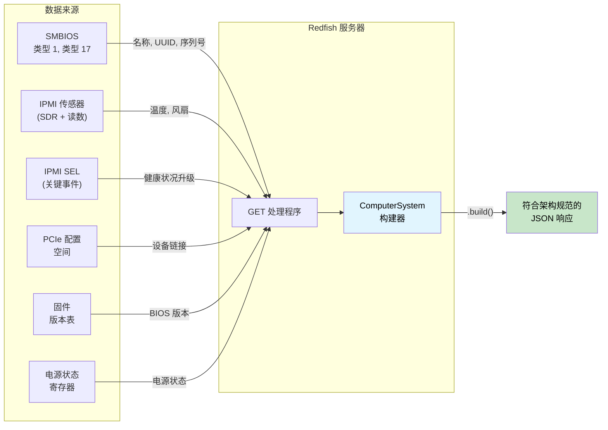

[English Original](../en/ch18-redfish-server-walkthrough.md)

# 实战演练 —— 类型安全的 Redfish 服务器 🟡

> **你将学到：** 如何将响应构建器类型状态 (Response Builder Type-state)、来源可用性令牌 (Source-availability Tokens)、维度化序列化 (Dimensional Serialization)、健康状况汇总 (Health Rollup)、架构版本化 (Schema Versioning) 以及类型化操作分发 (Typed Action Dispatch) 组合成一个 **无法产生不符合架构规范响应** 的 Redfish 服务器 —— 这是 [第 17 章](ch17-redfish-applied-walkthrough.md) 客户端演练的镜像实现。
>
> **参考：** [第 2 章](ch02-typed-command-interfaces-request-determi.md)（类型化命令 —— 在操作分发中反向应用）、[第 4 章](ch04-capability-tokens-zero-cost-proof-of-aut.md)（能力令牌 —— 来源可用性）、[第 6 章](ch06-dimensional-analysis-making-the-compiler.md)（维度类型 —— 序列化侧）、[第 7 章](ch07-validated-boundaries-parse-dont-validate.md)（验证边界 —— 反向应用：“构造，而非序列化”）、[第 9 章](ch09-phantom-types-for-resource-tracking.md)（幽灵类型 —— 架构版本化）、[第 11 章](ch11-fourteen-tricks-from-the-trenches.md)（技巧 3 —— `#[non_exhaustive]`，技巧 4 —— 构建器类型状态）、[第 17 章](ch17-redfish-applied-walkthrough.md)（客户端对应章节）。

## 镜像问题

第 17 章探讨的是：“我该如何正确地**使用** Redfish？”而本章则探讨其镜像问题：“我该如何正确地**生成** Redfish？”

在客户端，主要的风险在于**信任**了错误的数据。而在服务器端，风险则在于**发出**了错误的数据 —— 且集群中的每一个客户端都会无条件信任你发送的内容。

一个典型的 `GET /redfish/v1/Systems/1` 响应必须集成来自多个来源的数据：



在 C 语言中，这通常是一个长达 500 行的处理器函数，它调用六个子系统，通过 `json_object_set()` 手动构建 JSON 树，并祈祷每一个必需字段都被填上了。忘了一个？响应就违反了 Redfish 架构。单位写错了？每一个客户端看到的都是损坏的遥测数据。

```c
// C —— 汇编层面的问题
json_t *get_computer_system(const char *id) {
    json_t *obj = json_object();
    json_object_set_new(obj, "@odata.type",
        json_string("#ComputerSystem.v1_13_0.ComputerSystem"));

    // 🐛 忘了设置 "Name" —— 架构要求该字段
    // 🐛 忘了设置 "UUID" —— 架构要求该字段

    smbios_type1_t *t1 = smbios_get_type1();
    if (t1) {
        json_object_set_new(obj, "Manufacturer",
            json_string(t1->manufacturer));
    }

    json_object_set_new(obj, "PowerState",
        json_string(get_power_state()));  // 至少这一项总是可用的

    // 🐛 读数是原始 ADC 数值，而非摄氏度 —— 没有类型能捕捉到这一点
    double cpu_temp = read_sensor(SENSOR_CPU_TEMP);
    // 这个数值最终会进入另一个 Thermal 响应中...
    // 但在类型层面上，没有任何东西能将其与 "Celsius" (摄氏度) 联系起来
    
    // 🐛 健康状况是手动计算的 —— 忘了包含 PSU (电源) 状态
    json_object_set_new(obj, "Status",
        build_status("Enabled", "OK")); // 实际上应该是 "Critical" —— 因为 PSU 正在发生故障

    return obj; // 缺少了 2 个必需字段，错误的健康状况，原始单位
}
```

一个处理器函数里就有四个 Bug。在客户端，每个 Bug 只会影响**一个**客户端。而在服务器端，每个 Bug 都会影响**每一个**查询该 BMC 的客户端。

---

## 第 1 节 —— 响应构建器类型状态：“构造，而非序列化” (第 7 章的反向应用)

第 7 章教导我们“解析，而非验证” —— 仅验证一次入站数据，并将证明携带在类型中。服务器端的镜像准则是**“构造，而非序列化”** —— 通过一个构建器来构造出站响应，该构建器只有在所有必需字段都齐备时才允许调用 `.build()`。

```rust,ignore
use std::marker::PhantomData;

// ──── 类型级的字段追踪 ────

pub struct HasField;
pub struct MissingField;

// ──── 响应构建器 ────

/// ComputerSystem Redfish 资源的构建器。
/// 类型参数用于追踪哪些必需 (REQUIRED) 字段已被提供。
/// 可选字段不需要类型级的追踪。
pub struct ComputerSystemBuilder<Name, Uuid, PowerState, Status> {
    // 必需字段 —— 在类型级别进行追踪
    name: Option<String>,
    uuid: Option<String>,
    power_state: Option<PowerStateValue>,
    status: Option<ResourceStatus>,
    // 可选字段 —— 不进行追踪 (随时可设置)
    manufacturer: Option<String>,
    model: Option<String>,
    serial_number: Option<String>,
    bios_version: Option<String>,
    processor_summary: Option<ProcessorSummary>,
    memory_summary: Option<MemorySummary>,
    _markers: PhantomData<(Name, Uuid, PowerState, Status)>,
}

#[derive(Debug, Clone, serde::Serialize)]
pub enum PowerStateValue { On, Off, PoweringOn, PoweringOff }

#[derive(Debug, Clone, serde::Serialize)]
pub struct ResourceStatus {
    #[serde(rename = "State")]
    pub state: StatusState,
    #[serde(rename = "Health")]
    pub health: HealthValue,
    #[serde(rename = "HealthRollup", skip_serializing_if = "Option::is_none")]
    pub health_rollup: Option<HealthValue>,
}

#[derive(Debug, Clone, Copy, serde::Serialize)]
pub enum StatusState { Enabled, Disabled, Absent, StandbyOffline, Starting }

#[derive(Debug, Clone, Copy, PartialEq, Eq, PartialOrd, Ord, serde::Serialize)]
pub enum HealthValue { OK, Warning, Critical }

#[derive(Debug, Clone, serde::Serialize)]
pub struct ProcessorSummary {
    #[serde(rename = "Count")]
    pub count: u32,
    #[serde(rename = "Status")]
    pub status: ResourceStatus,
}

#[derive(Debug, Clone, serde::Serialize)]
pub struct MemorySummary {
    #[serde(rename = "TotalSystemMemoryGiB")]
    pub total_gib: f64,
    #[serde(rename = "Status")]
    pub status: ResourceStatus,
}

// ──── 构造器：所有字段初始均为 MissingField ────

impl ComputerSystemBuilder<MissingField, MissingField, MissingField, MissingField> {
    pub fn new() -> Self {
        ComputerSystemBuilder {
            name: None, uuid: None, power_state: None, status: None,
            manufacturer: None, model: None, serial_number: None,
            bios_version: None, processor_summary: None, memory_summary: None,
            _markers: PhantomData,
        }
    }
}

// ──── 必需字段的 setter —— 每一个都会转换一个类型参数 ────

impl<U, P, S> ComputerSystemBuilder<MissingField, U, P, S> {
    pub fn name(self, name: String) -> ComputerSystemBuilder<HasField, U, P, S> {
        ComputerSystemBuilder {
            name: Some(name), uuid: self.uuid,
            power_state: self.power_state, status: self.status,
            manufacturer: self.manufacturer, model: self.model,
            serial_number: self.serial_number, bios_version: self.bios_version,
            processor_summary: self.processor_summary,
            memory_summary: self.memory_summary, _markers: PhantomData,
        }
    }
}

impl<N, P, S> ComputerSystemBuilder<N, MissingField, P, S> {
    pub fn uuid(self, uuid: String) -> ComputerSystemBuilder<N, HasField, P, S> {
        ComputerSystemBuilder {
            name: self.name, uuid: Some(uuid),
            power_state: self.power_state, status: self.status,
            manufacturer: self.manufacturer, model: self.model,
            serial_number: self.serial_number, bios_version: self.bios_version,
            processor_summary: self.processor_summary,
            memory_summary: self.memory_summary, _markers: PhantomData,
        }
    }
}

impl<N, U, S> ComputerSystemBuilder<N, U, MissingField, S> {
    pub fn power_state(self, ps: PowerStateValue)
        -> ComputerSystemBuilder<N, U, HasField, S>
    {
        ComputerSystemBuilder {
            name: self.name, uuid: self.uuid,
            power_state: Some(ps), status: self.status,
            manufacturer: self.manufacturer, model: self.model,
            serial_number: self.serial_number, bios_version: self.bios_version,
            processor_summary: self.processor_summary,
            memory_summary: self.memory_summary, _markers: PhantomData,
        }
    }
}

impl<N, U, P> ComputerSystemBuilder<N, U, P, MissingField> {
    pub fn status(self, status: ResourceStatus)
        -> ComputerSystemBuilder<N, U, P, HasField>
    {
        ComputerSystemBuilder {
            name: self.name, uuid: self.uuid,
            power_state: self.power_state, status: Some(status),
            manufacturer: self.manufacturer, model: self.model,
            serial_number: self.serial_number, bios_version: self.bios_version,
            processor_summary: self.processor_summary,
            memory_summary: self.memory_summary, _markers: PhantomData,
        }
    }
}

// ──── 可选字段的 setter —— 在任何状态下均可用 ────

impl<N, U, P, S> ComputerSystemBuilder<N, U, P, S> {
    pub fn manufacturer(mut self, m: String) -> Self {
        self.manufacturer = Some(m); self
    }
    pub fn model(mut self, m: String) -> Self {
        self.model = Some(m); self
    }
    pub fn serial_number(mut self, s: String) -> Self {
        self.serial_number = Some(s); self
    }
    pub fn bios_version(mut self, v: String) -> Self {
        self.bios_version = Some(v); self
    }
    pub fn processor_summary(mut self, ps: ProcessorSummary) -> Self {
        self.processor_summary = Some(ps); self
    }
    pub fn memory_summary(mut self, ms: MemorySummary) -> Self {
        self.memory_summary = Some(ms); self
    }
}

// ──── .build() 仅在所有必需字段均为 HasField 时才存在 ────

impl ComputerSystemBuilder<HasField, HasField, HasField, HasField> {
    pub fn build(self, id: &str) -> serde_json::Value {
        let mut obj = serde_json::json!({
            "@odata.id": format!("/redfish/v1/Systems/{id}"),
            "@odata.type": "#ComputerSystem.v1_13_0.ComputerSystem",
            "Id": id,
            // 类型状态保证了这些字段均为 Some —— 在此处调用 .unwrap() 是安全的。
            // 在生产环境中，建议使用 .expect("guaranteed by type state")。
            "Name": self.name.unwrap(),
            "UUID": self.uuid.unwrap(),
            "PowerState": self.power_state.unwrap(),
            "Status": self.status.unwrap(),
        });

        // 可选字段 —— 仅在存在时包含
        if let Some(m) = self.manufacturer {
            obj["Manufacturer"] = serde_json::json!(m);
        }
        if let Some(m) = self.model {
            obj["Model"] = serde_json::json!(m);
        }
        if let Some(s) = self.serial_number {
            obj["SerialNumber"] = serde_json::json!(s);
        }
        if let Some(v) = self.bios_version {
            obj["BiosVersion"] = serde_json::json!(v);
        }
        // 注意：为简洁起见，对 to_value() 调用了 .unwrap()。
        // 生产代码应使用 `?` 来传播序列化错误。
        if let Some(ps) = self.processor_summary {
            obj["ProcessorSummary"] = serde_json::to_value(ps).unwrap();
        }
        if let Some(ms) = self.memory_summary {
            obj["MemorySummary"] = serde_json::to_value(ms).unwrap();
        }

        obj
    }
}

//
// ── 编译器强制确保完整性 ──
//
// ✅ 所有必需字段均已设置 —— .build() 可用：
// ComputerSystemBuilder::new()
//     .name("PowerEdge R750".into())
//     .uuid("4c4c4544-...".into())
//     .power_state(PowerStateValue::On)
//     .status(ResourceStatus { ... })
//     .manufacturer("Dell".into())        // 可选字段 —— 包含进来也没问题
//     .build("1")
//
// ❌ 缺少 "Name" 字段 —— 编译错误：
// ComputerSystemBuilder::new()
//     .uuid("4c4c4544-...".into())
//     .power_state(PowerStateValue::On)
//     .status(ResourceStatus { ... })
//     .build("1")
//   错误：在 `ComputerSystemBuilder<MissingField, HasField, HasField, HasField>` 上
//   找不到方法 `build`
```

**被彻底消除的 Bug：** 不符合架构规范的响应。处理器函数在物理逻辑上无法序列化一个未提供所有必需字段的 `ComputerSystem`。编译错误信息甚至会明确告诉你缺少了*哪一个*字段 —— 它就体现在类型参数中：处于 `Name` 位置的 `MissingField`。

---

## 第 2 节 —— 来源可用性令牌 (能力令牌，第 4 章 —— 新用途)

在第 4 章和第 17 章中，能力令牌证明的是**授权 (Authorization)** —— “调用者被允许执行某些操作”。而在服务器端，同一模式证明的是**可用性 (Availability)** —— “数据源已成功初始化”。

BMC 查询的每个子系统都可能独立发生故障。SMBIOS 表可能损坏，传感器子系统可能仍在初始化，PCIe 总线扫描可能超时。我们将每个子系统编码为一个证明令牌：

```rust,ignore
/// SMBIOS 表已成功解析的证明。
/// 仅由 SMBIOS 初始化函数生成。
pub struct SmbiosReady {
    _private: (),
}

/// IPMI 传感器子系统已响应的证明。
pub struct SensorsReady {
    _private: (),
}

/// PCIe 总线扫描已完成的证明。
pub struct PcieReady {
    _private: (),
}

/// SEL (系统事件日志) 已成功读取的证明。
pub struct SelReady {
    _private: (),
}

// ──── 数据源初始化 ────

pub struct SmbiosTables {
    pub product_name: String,
    pub manufacturer: String,
    pub serial_number: String,
    pub uuid: String,
}

pub struct SensorCache {
    pub cpu_temp: Celsius,
    pub inlet_temp: Celsius,
    pub fan_readings: Vec<(String, Rpm)>,
    pub psu_power: Vec<(String, Watts)>,
}

/// 丰富的 SEL 摘要 —— 从类型化事件导出的各子系统健康状况。
/// 由第 7 章 SEL 章节中的消费者管道 (Consumer Pipeline) 构建。
/// 以具备类型详细程度的结构取代了信息丢失的 `has_critical_events: bool`。
pub struct TypedSelSummary {
    pub total_entries: u32,
    pub processor_health: HealthValue,
    pub memory_health: HealthValue,
    pub power_health: HealthValue,
    pub thermal_health: HealthValue,
    pub fan_health: HealthValue,
    pub storage_health: HealthValue,
    pub security_health: HealthValue,
}

pub fn init_smbios() -> Option<(SmbiosReady, SmbiosTables)> {
    // 读取 SMBIOS 入口点，解析表结构...
    // 如果表不存在或损坏，则返回 None
    Some((
        SmbiosReady { _private: () },
        SmbiosTables {
            product_name: "PowerEdge R750".into(),
            manufacturer: "Dell Inc.".into(),
            serial_number: "SVC1234567".into(),
            uuid: "4c4c4544-004d-5610-804c-b2c04f435031".into(),
        },
    ))
}

pub fn init_sensors() -> Option<(SensorsReady, SensorCache)> {
    // 初始化 SDR 仓库，读取所有传感器...
    // 如果 IPMI 子系统未响应，则返回 None
    Some((
        SensorsReady { _private: () },
        SensorCache {
            cpu_temp: Celsius(68.0),
            inlet_temp: Celsius(24.0),
            fan_readings: vec![
                ("Fan1".into(), Rpm(8400)),
                ("Fan2".into(), Rpm(8200)),
            ],
            psu_power: vec![
                ("PSU1".into(), Watts(285.0)),
                ("PSU2".into(), Watts(290.0)),
            ],
        },
    ))
}

pub fn init_sel() -> Option<(SelReady, TypedSelSummary)> {
    // 在生产环境中：读取 SEL 条目，通过第 7 章的 TryFrom 解析，
    // 通过 classify_event_health() 分类，通过 summarize_sel() 聚合。
    Some((
        SelReady { _private: () },
        TypedSelSummary {
            total_entries: 42,
            processor_health: HealthValue::OK,
            memory_health: HealthValue::OK,
            power_health: HealthValue::OK,
            thermal_health: HealthValue::OK,
            fan_health: HealthValue::OK,
            storage_health: HealthValue::OK,
            security_health: HealthValue::OK,
        },
    ))
}
```

现在，凡是从数据源填充构建器字段的任务，都**必须要求提供相应的证明令牌**：

```rust,ignore
/// 填充来源于 SMBIOS 的字段。要求证明 SMBIOS 是可用的。
fn populate_from_smbios<P, S>(
    builder: ComputerSystemBuilder<MissingField, MissingField, P, S>,
    _proof: &SmbiosReady,
    tables: &SmbiosTables,
) -> ComputerSystemBuilder<HasField, HasField, P, S> {
    builder
        .name(tables.product_name.clone())
        .uuid(tables.uuid.clone())
        .manufacturer(tables.manufacturer.clone())
        .serial_number(tables.serial_number.clone())
}

/// SMBIOS 不可用时的备选方案 —— 以安全的默认值提供必需字段。
fn populate_smbios_fallback<P, S>(
    builder: ComputerSystemBuilder<MissingField, MissingField, P, S>,
) -> ComputerSystemBuilder<HasField, HasField, P, S> {
    builder
        .name("Unknown System".into())
        .uuid("00000000-0000-0000-0000-000000000000".into())
}
```

处理器根据令牌的可用性来选择执行路径：

```rust,ignore
fn build_computer_system(
    smbios: &Option<(SmbiosReady, SmbiosTables)>,
    power_state: PowerStateValue,
    health: ResourceStatus,
) -> serde_json::Value {
    let builder = ComputerSystemBuilder::new()
        .power_state(power_state)
        .status(health);

    let builder = match smbios {
        Some((proof, tables)) => populate_from_smbios(builder, proof, tables),
        None => populate_smbios_fallback(builder),
    };

    // 无论走哪条路径，Name 和 UUID 都会变为 HasField。
    // 无论如何 .build() 都是可用的。
    builder.build("1")
}
```

**被彻底消除的 Bug：** 调用了初始化失败的子系统。如果 SMBIOS 未成功解析，你就无法获得 `SmbiosReady` 令牌 —— 编译器会强制你走备选路径。这里没有运行时 `if (smbios != NULL)` 的遗忘检查风险。

### 来源令牌与能力混入模式 (Capability Mixins，第 8 章) 的结合

随着需要处理的 Redfish 资源类型不断增加 (ComputerSystem、Chassis、Manager、Thermal、Power)，数据填充逻辑会在不同的处理器函数中重复。第 8 章中的**混入 (Mixin)** 模式可以消除这种重复。声明处理器具备哪些来源，全局实现 (Blanket Impl) 即可自动提供填充方法：

```rust,ignore
/// ── 针对数据源的基础组件 Trait (Ingredient Traits，参考第 8 章) ──

pub trait HasSmbios {
    fn smbios(&self) -> &(SmbiosReady, SmbiosTables);
}

pub trait HasSensors {
    fn sensors(&self) -> &(SensorsReady, SensorCache);
}

pub trait HasSel {
    fn sel(&self) -> &(SelReady, TypedSelSummary);
}

/// ── 混入效果：任何具备 SMBIOS + 传感器的处理器都能获得身份信息填充能力 ──

pub trait IdentityMixin: HasSmbios {
    fn populate_identity<P, S>(
        &self,
        builder: ComputerSystemBuilder<MissingField, MissingField, P, S>,
    ) -> ComputerSystemBuilder<HasField, HasField, P, S> {
        let (_, tables) = self.smbios();
        builder
            .name(tables.product_name.clone())
            .uuid(tables.uuid.clone())
            .manufacturer(tables.manufacturer.clone())
            .serial_number(tables.serial_number.clone())
    }
}

/// 为任何具备 SMBIOS 能力的类型自动实现 IdentityMixin。
impl<T: HasSmbios> IdentityMixin for T {}

/// ── 混入效果：任何具备传感器 + SEL 的处理器都能获得健康状况汇总能力 ──

pub trait HealthMixin: HasSensors + HasSel {
    fn compute_health(&self) -> ResourceStatus {
        let (_, cache) = self.sensors();
        let (_, sel_summary) = self.sel();
        compute_system_health(
            Some(&(SensorsReady { _private: () }, cache.clone())).as_ref(),
            Some(&(SelReady { _private: () }, sel_summary.clone())).as_ref(),
        )
    }
}

impl<T: HasSensors + HasSel> HealthMixin for T {}

/// ── 具体的处理器拥有所有可用的来源 ──

struct FullPlatformHandler {
    smbios: (SmbiosReady, SmbiosTables),
    sensors: (SensorsReady, SensorCache),
    sel: (SelReady, TypedSelSummary),
}

impl HasSmbios  for FullPlatformHandler {
    fn smbios(&self) -> &(SmbiosReady, SmbiosTables) { &self.smbios }
}
impl HasSensors for FullPlatformHandler {
    fn sensors(&self) -> &(SensorsReady, SensorCache) { &self.sensors }
}
impl HasSel     for FullPlatformHandler {
    fn sel(&self) -> &(SelReady, TypedSelSummary) { &self.sel }
}

// FullPlatformHandler 会自动获得：
//   IdentityMixin::populate_identity()   (通过 HasSmbios)
//   HealthMixin::compute_health()        (通过 HasSensors + HasSel)
//
// 如果一个 SensorsOnlyHandler 实现了 HasSensors 但没有实现 HasSel，
// 它会获得 IdentityMixin (如果它有 SMBIOS) 但不会获得 HealthMixin。
// 此时在其上调用 .compute_health() 会导致编译错误。
```

这直接镜像了第 8 章中的 `BaseBoardController` 模式：基础组件 trait 声明你拥有些什么，混入 trait 通过全局实现提供行为，且编译器会根据前置条件对每个混入进行验证。增加一个新的数据源 (例如 `HasNvme`) 以及对应的混入 (例如 `StorageMixin: HasNvme + HasSel`)，就能自动地为每一个同时拥有这两项能力的处理器提供存储方面的健康汇总。

---

## 第 3 节 —— 序列化边界上的维度类型 (第 6 章)

在客户端侧 (第 17 章第 4 节)，维度类型防止将摄氏度 (°C) **读取**为 RPM。在服务器端，维度类型防止将 RPM **写入**到 JSON 的摄氏度字段中。这可以说更加危险 —— 因为服务器端的错误数值会传播到每一个客户端。

```rust,ignore
use serde::Serialize;

// ──── 源自第 6 章的维度类型，且带有 Serialize ────

#[derive(Debug, Clone, Copy, PartialEq, PartialOrd, Serialize)]
pub struct Celsius(pub f64);

#[derive(Debug, Clone, Copy, PartialEq, PartialOrd, Serialize)]
pub struct Rpm(pub u32);

#[derive(Debug, Clone, Copy, PartialEq, PartialOrd, Serialize)]
pub struct Watts(pub f64);

// ──── Redfish Thermal 响应成员 ────
// 字段类型强制规定了哪些单位属于哪些 JSON 属性。

#[derive(Serialize)]
#[serde(rename_all = "PascalCase")]
pub struct TemperatureMember {
    pub member_id: String,
    pub name: String,
    pub reading_celsius: Celsius,           // ← 必须为 Celsius
    #[serde(skip_serializing_if = "Option::is_none")]
    pub upper_threshold_critical: Option<Celsius>,
    #[serde(skip_serializing_if = "Option::is_none")]
    pub upper_threshold_fatal: Option<Celsius>,
    pub status: ResourceStatus,
}

#[derive(Serialize)]
#[serde(rename_all = "PascalCase")]
pub struct FanMember {
    pub member_id: String,
    pub name: String,
    pub reading: Rpm,                       // ← 必须为 Rpm
    pub reading_units: &'static str,        // 始终为 "RPM"
    pub status: ResourceStatus,
}

#[derive(Serialize)]
#[serde(rename_all = "PascalCase")]
pub struct PowerControlMember {
    pub member_id: String,
    pub name: String,
    pub power_consumed_watts: Watts,        // ← 必须为 Watts
    #[serde(skip_serializing_if = "Option::is_none")]
    pub power_capacity_watts: Option<Watts>,
    pub status: ResourceStatus,
}

// ──── 从传感器缓存构建 Thermal 响应 ────

fn build_thermal_response(
    _proof: &SensorsReady,
    cache: &SensorCache,
) -> serde_json::Value {
    let temps = vec![
        TemperatureMember {
            member_id: "0".into(),
            name: "CPU Temp".into(),
            reading_celsius: cache.cpu_temp,     // Celsius → Celsius ✅
            upper_threshold_critical: Some(Celsius(95.0)),
            upper_threshold_fatal: Some(Celsius(105.0)),
            status: ResourceStatus {
                state: StatusState::Enabled,
                health: if cache.cpu_temp < Celsius(95.0) {
                    HealthValue::OK
                } else {
                    HealthValue::Critical
                },
                health_rollup: None,
            },
        },
        TemperatureMember {
            member_id: "1".into(),
            name: "Inlet Temp".into(),
            reading_celsius: cache.inlet_temp,   // Celsius → Celsius ✅
            upper_threshold_critical: Some(Celsius(42.0)),
            upper_threshold_fatal: None,
            status: ResourceStatus {
                state: StatusState::Enabled,
                health: HealthValue::OK,
                health_rollup: None,
            },
        },

        // ❌ 编译错误 —— 不能将 Rpm 放入 Celsius 字段：
        // TemperatureMember {
        //     reading_celsius: cache.fan_readings[0].1,  // Rpm ≠ Celsius
        //     ...
        // }
    ];

    let fans: Vec<FanMember> = cache.fan_readings.iter().enumerate().map(|(i, (name, rpm))| {
        FanMember {
            member_id: i.to_string(),
            name: name.clone(),
            reading: *rpm,                       // Rpm → Rpm ✅
            reading_units: "RPM",
            status: ResourceStatus {
                state: StatusState::Enabled,
                health: if *rpm > Rpm(1000) { HealthValue::OK } else { HealthValue::Critical },
                health_rollup: None,
            },
        }
    }).collect();

    serde_json::json!({
        "@odata.type": "#Thermal.v1_7_0.Thermal",
        "Temperatures": temps,
        "Fans": fans,
    })
}
```

**被彻底消除的 Bug：** 序列化时的单位混淆。Redfish 架构规定 `ReadingCelsius` 的单位是摄氏度 (°C)。Rust 类型系统规定 `reading_celsius` 的类型必须是 `Celsius`。如果开发者不小心传入了 `Rpm(8400)` 或 `Watts(285.0)`，编译器会在该数值进入 JSON 之前就将其拦截。

---

## 第 4 节 —— 作为类型化折叠的健康状况汇总 (Health Rollup)

Redfish 的 `Status.Health` 是一种**汇总 (Rollup)** —— 即所有子组件中最差的健康状态。在 C 语言中，这通常是一系列的 `if` 检查，而这不可避免地会遗漏某个来源。配合类型化枚举和 `Ord` trait，这种汇总就变成了一行代码的折叠 (Fold) 操作 —— 且编译器保证了每一个来源都能参与汇总：

```rust,ignore
/// 汇总多个来源的健康状况。
/// HealthValue 上的 Ord 实现：OK < Warning < Critical。
/// 返回最差的 (max) 数值。
fn rollup(sources: &[HealthValue]) -> HealthValue {
    sources.iter().copied().max().unwrap_or(HealthValue::OK)
}

/// 从所有子组件计算系统级健康状况。
/// 要求传入指向每一个来源的显式引用 —— 调用者必须提供所有来源。
fn compute_system_health(
    sensors: Option<&(SensorsReady, SensorCache)>,
    sel: Option<&(SelReady, TypedSelSummary)>,
) -> ResourceStatus {
    let mut inputs = Vec::new();

    // ── 实时传感器读数 ──
    if let Some((_proof, cache)) = sensors {
        // 温度健康状况 (维度安全性：Celsius 对比)
        if cache.cpu_temp > Celsius(95.0) {
            inputs.push(HealthValue::Critical);
        } else if cache.cpu_temp > Celsius(85.0) {
            inputs.push(HealthValue::Warning);
        } else {
            inputs.push(HealthValue::OK);
        }

        // 风扇健康状况 (维度安全性：Rpm 对比)
        for (_name, rpm) in &cache.fan_readings {
            if *rpm < Rpm(500) {
                inputs.push(HealthValue::Critical);
            } else if *rpm < Rpm(1000) {
                inputs.push(HealthValue::Warning);
            } else {
                inputs.push(HealthValue::OK);
            }
        }

        // PSU 健康状况 (维度安全性：Watts 对比)
        for (_name, watts) in &cache.psu_power {
            if *watts > Watts(800.0) {
                inputs.push(HealthValue::Critical);
            } else {
                inputs.push(HealthValue::OK);
            }
        }
    }

    // ── SEL 各子系统健康状况 (来源于第 7 章的 TypedSelSummary) ──
    // 每一个子系统的健康状况都是通过对每种传感器类型和
    // 每种事件变体进行穷举匹配而得出的。没有任何信息丢失。
    if let Some((_proof, sel_summary)) = sel {
        inputs.push(sel_summary.processor_health);
        inputs.push(sel_summary.memory_health);
        inputs.push(sel_summary.power_health);
        inputs.push(sel_summary.thermal_health);
        inputs.push(sel_summary.fan_health);
        inputs.push(sel_summary.storage_health);
        inputs.push(sel_summary.security_health);
    }

    let health = rollup(&inputs);

    ResourceStatus {
        state: StatusState::Enabled,
        health,
        health_rollup: Some(health),
    }
}
```

**被彻底消除的 Bug：** 不完整的健康状况汇总。在 C 语言中，如果在健康计算中忘了包含 PSU 状态，这是一个静默 Bug —— 系统即便在 PSU 故障时仍会报告 "OK"。而在 Rust 中，`compute_system_health` 需要接收指向每一个数据源的显式引用。SEL 的贡献不再是一个有损的 `bool` 值 —— 而是七个针对各子系统的 `HealthValue` 字段，它们是通过第 7 章消费者管道中的穷举匹配得出的。增加一种新的 SEL 传感器类型会强制分类器去处理它；增加一个新的子系统字段会强制汇总逻辑将其包含在内。

---

## 第 5 节 —— 使用幽灵类型实现架构版本化 (第 9 章)

如果 BMC 宣称支持 `ComputerSystem.v1_13_0`，那么响应中**必须**包含该架构版本中引入的属性 (如 `LastResetTime`、`BootProgress`)。宣称支持 v1.13 但缺失这些字段会导致 Redfish 互操作性验证器 (Redfish Interop Validator) 报错。通过幽灵版本标记，我们可以将此约束转化为一种编译时契约：

```rust,ignore
use std::marker::PhantomData;

// ──── 架构版本标记 ────

pub struct V1_5;
pub struct V1_13;

// ──── 感知版本的响应 ────

pub struct ComputerSystemResponse<V> {
    pub base: ComputerSystemBase,
    _version: PhantomData<V>,
}

pub struct ComputerSystemBase {
    pub id: String,
    pub name: String,
    pub uuid: String,
    pub power_state: PowerStateValue,
    pub status: ResourceStatus,
    pub manufacturer: Option<String>,
    pub serial_number: Option<String>,
    pub bios_version: Option<String>,
}

// 在所有版本上均可用的方法：
impl<V> ComputerSystemResponse<V> {
    pub fn base_json(&self) -> serde_json::Value {
        serde_json::json!({
            "Id": self.base.id,
            "Name": self.base.name,
            "UUID": self.base.uuid,
            "PowerState": self.base.power_state,
            "Status": self.base.status,
        })
    }
}

// ──── v1.13 特有的字段 ────

/// 上一次系统重置的日期和时间。
pub struct LastResetTime(pub String);

/// 启动进度信息。
pub struct BootProgress {
    pub last_state: String,
    pub last_state_time: String,
}

impl ComputerSystemResponse<V1_13> {
    /// LastResetTime —— 在 v1.13+ 版本中是必需的。
    /// 该方法仅在 V1_13 上存在。如果 BMC 宣称支持 v1.13
    /// 而处理器没有调用此方法，字段就会缺失。
    pub fn last_reset_time(&self) -> LastResetTime {
        // 从 RTC 或启动时间戳寄存器读取
        LastResetTime("2026-03-16T08:30:00Z".to_string())
    }

    /// BootProgress —— 在 v1.13+ 版本中是必需的。
    pub fn boot_progress(&self) -> BootProgress {
        BootProgress {
            last_state: "OSRunning".to_string(),
            last_state_time: "2026-03-16T08:32:00Z".to_string(),
        }
    }

    /// 构建完整的 v1.13 JSON 响应，包含特定于版本的字段。
    pub fn to_json(&self) -> serde_json::Value {
        let mut obj = self.base_json();
        obj["@odata.type"] =
            serde_json::json!("#ComputerSystem.v1_13_0.ComputerSystem");

        let reset_time = self.last_reset_time();
        obj["LastResetTime"] = serde_json::json!(reset_time.0);

        let boot = self.boot_progress();
        obj["BootProgress"] = serde_json::json!({
            "LastState": boot.last_state,
            "LastStateTime": boot.last_state_time,
        });

        obj
    }
}

impl ComputerSystemResponse<V1_5> {
    /// v1.5 JSON —— 没有 LastResetTime 和 BootProgress。
    pub fn to_json(&self) -> serde_json::Value {
        let mut obj = self.base_json();
        obj["@odata.type"] =
            serde_json::json!("#ComputerSystem.v1_5_0.ComputerSystem");
        obj
    }

    // 在此处 last_reset_time() 并不存在。
    // 调用它会导致编译错误：
    //   let resp: ComputerSystemResponse<V1_5> = ...;
    //   resp.last_reset_time();
    //   ❌ 错误：在 `ComputerSystemResponse<V1_5>` 上找不到方法 `last_reset_time`
}
```

**被彻底消除的 Bug：** 架构版本不匹配。如果 BMC 配置为宣称支持 v1.13，则使用 `ComputerSystemResponse<V1_13>`，编译器将确保生成 v1.13 所需的每一个字段。降级到 v1.5？只需更改类型参数 —— v1.13 的方法便会消失，且不会有任何冗余字段泄露到响应中。

---

## 第 6 节 —— 类型化操作分发 (第 2 章的反向应用)

在第 2 章中，类型化命令模式在**客户端**侧绑定了 `Request → Response`。在**服务器端**，同一模式可以反向用于验证入站的操作负载并进行类型安全的分发。

```rust,ignore
use serde::Deserialize;

// ──── 操作 Trait (第 2 章 IpmiCmd trait 的镜像) ────

/// 一个 Redfish 操作：框架从 POST 请求体中反序列化参数 (Params)，
/// 然后调用 execute()。如果 JSON 与 Params 不匹配，反序列化便会失败
/// —— 此时 execute() 绝不会带着错误输入被调用。
pub trait RedfishAction {
    /// 预期的 JSON 请求体结构。
    type Params: serde::de::DeserializeOwned;
    /// 执行操作的结果。
    type Result: serde::Serialize;

    fn execute(&self, params: Self::Params) -> Result<Self::Result, RedfishError>;
}

#[derive(Debug)]
pub enum RedfishError {
    InvalidPayload(String),
    ActionFailed(String),
}

// ──── ComputerSystem.Reset ────

pub struct ComputerSystemReset;

#[derive(Debug, Deserialize)]
pub enum ResetType {
    On,
    ForceOff,
    GracefulShutdown,
    GracefulRestart,
    ForceRestart,
    ForceOn,
    PushPowerButton,
}

#[derive(Debug, Deserialize)]
#[serde(rename_all = "PascalCase")]
pub struct ResetParams {
    pub reset_type: ResetType,
}

impl RedfishAction for ComputerSystemReset {
    type Params = ResetParams;
    type Result = ();

    fn execute(&self, params: ResetParams) -> Result<(), RedfishError> {
        match params.reset_type {
            ResetType::GracefulShutdown => {
                // 向主机发送 ACPI 关机指令
                println!("正在发起 ACPI 关机");
                Ok(())
            }
            ResetType::ForceOff => {
                // 向主机发送强制断电信号
                println!("强制断电");
                Ok(())
            }
            ResetType::On | ResetType::ForceOn => {
                println!("正在上电");
                Ok(())
            }
            ResetType::GracefulRestart => {
                println!("ACPI 重启");
                Ok(())
            }
            ResetType::ForceRestart => {
                println!("强制重启");
                Ok(())
            }
            ResetType::PushPowerButton => {
                println!("模拟按下电源按钮");
                Ok(())
            }
            // 穷举匹配 —— 编译器会捕捉到缺失的变体
        }
    }
}

// ──── Manager.ResetToDefaults ────

pub struct ManagerResetToDefaults;

#[derive(Debug, Deserialize)]
pub enum ResetToDefaultsType {
    ResetAll,
    PreserveNetworkAndUsers,
    PreserveNetwork,
}

#[derive(Debug, Deserialize)]
#[serde(rename_all = "PascalCase")]
pub struct ResetToDefaultsParams {
    pub reset_to_defaults_type: ResetToDefaultsType,
}

impl RedfishAction for ManagerResetToDefaults {
    type Params = ResetToDefaultsParams;
    type Result = ();

    fn execute(&self, params: ResetToDefaultsParams) -> Result<(), RedfishError> {
        match params.reset_to_defaults_type {
            ResetToDefaultsType::ResetAll => {
                println!("完全恢复出厂设置");
                Ok(())
            }
            ResetToDefaultsType::PreserveNetworkAndUsers => {
                println!("恢复设置，保留网络和用户数据");
                Ok(())
            }
            ResetToDefaultsType::PreserveNetwork => {
                println!("恢复设置，仅保留网络配置");
                Ok(())
            }
        }
    }
}

// ──── 泛型操作分发器 ────

fn dispatch_action<A: RedfishAction>(
    action: &A,
    raw_body: &str,
) -> Result<A::Result, RedfishError> {
    // 反序列化会验证负载结构。
    // 如果 JSON 与 A::Params 不匹配，该过程会失败
    // 且 execute() 绝不会被调用。
    let params: A::Params = serde_json::from_str(raw_body)
        .map_err(|e| RedfishError::InvalidPayload(e.to_string()))?;

    action.execute(params)
}

// ── 使用示例 ──

fn handle_reset_action(body: &str) -> Result<(), RedfishError> {
    // 类型安全：ResetParams 在 execute() 调用前会由 serde 进行验证
    dispatch_action(&ComputerSystemReset, body)?;
    Ok(())

    // 非法的 JSON：{"ResetType": "Explode"}
    // → serde 报错："unknown variant `Explode`"
    // → execute() 绝不会被调用

    // 缺失字段：{}
    // → serde 报错："missing field `ResetType`"
    // → execute() 绝不会被调用
}
```

**被彻底消除的 Bug：**
- **非法的操作负载：** serde 会在 `execute()` 被调用前拒绝未知的枚举变体或缺失的字段。无需手动编写 `if (body["ResetType"] == ...)` 检查链。
- **缺失变体处理：** 对 `params.reset_type` 的 `match` 操作是穷举性的 —— 增加一个新的 `ResetType` 变体将强制更新每一个操作处理器。
- **类型混淆：** `ComputerSystemReset` 预期接收 `ResetParams`；而 `ManagerResetToDefaults` 预期接收 `ResetToDefaultsParams`。Trait 系统防止了将某个操作的参数传递给另一个操作的处理器。

---

## 第 7 节 —— 总结与集成：GET 处理器

下面是一个集成了上述六个小节内容的完整处理器，它能生成一个符合架构规范的单次响应：

```rust,ignore
/// 完整的 GET /redfish/v1/Systems/1 处理器。
///
/// 每一个必需字段都由构建器类型状态强制执行。
/// 每一个数据源都受可用性令牌管控。
/// 每一个单位都与其维度类型绑定。
/// 每一种健康输入都会反馈到类型化的汇总逻辑中。
fn handle_get_computer_system(
    smbios: &Option<(SmbiosReady, SmbiosTables)>,
    sensors: &Option<(SensorsReady, SensorCache)>,
    sel: &Option<(SelReady, TypedSelSummary)>,
    power_state: PowerStateValue,
    bios_version: Option<String>,
) -> serde_json::Value {
    // ── 1. 健康状况汇总 (第 4 节) ──
    // 将来源于传感器和 SEL 的健康状况折叠成单一的类型化状态
    let health = compute_system_health(
        sensors.as_ref(),
        sel.as_ref(),
    );

    // ── 2. 构建器类型状态 (第 1 节) ──
    let builder = ComputerSystemBuilder::new()
        .power_state(power_state)
        .status(health);

    // ── 3. 来源可用性令牌 (第 2 节) ──
    let builder = match smbios {
        Some((proof, tables)) => {
            // SMBIOS 可用 —— 从硬件信息填充字段
            populate_from_smbios(builder, proof, tables)
        }
        None => {
            // SMBIOS 不可用 —— 使用安全默认值
            populate_smbios_fallback(builder)
        }
    };

    // ── 4. 根据传感器信息进行可选的丰富 (第 3 节) ──
    let builder = if let Some((_proof, cache)) = sensors {
        builder
            .processor_summary(ProcessorSummary {
                count: 2,
                status: ResourceStatus {
                    state: StatusState::Enabled,
                    health: if cache.cpu_temp < Celsius(95.0) {
                        HealthValue::OK
                    } else {
                        HealthValue::Critical
                    },
                    health_rollup: None,
                },
            })
    } else {
        builder
    };

    let builder = match bios_version {
        Some(v) => builder.bios_version(v),
        None => builder,
    };

    // ── 5. 构建响应 (第 1 节) ──
    // .build() 之所以可用，是因为无论哪条路径 (SMBIOS 存在/缺失)
    // 都会为 Name 和 UUID 生成 HasField。编译器对此已完成验证。
    builder.build("1")
}

// ──── 服务器启动 ────

fn main() {
    // 初始化所有数据源 —— 每一个都会返回一个可用性令牌
    let smbios = init_smbios();
    let sensors = init_sensors();
    let sel = init_sel();

    // 模拟处理器调用
    let response = handle_get_computer_system(
        &smbios,
        &sensors,
        &sel,
        PowerStateValue::On,
        Some("2.10.1".into()),
    );

    // 注意：为简洁起见使用了 .unwrap() —— 在生产环境中应妥善处理错误。
    println!("{}", serde_json::to_string_pretty(&response).unwrap());
}
```

**预期输出：**

```json
{
  "@odata.id": "/redfish/v1/Systems/1",
  "@odata.type": "#ComputerSystem.v1_13_0.ComputerSystem",
  "Id": "1",
  "Name": "PowerEdge R750",
  "UUID": "4c4c4544-004d-5610-804c-b2c04f435031",
  "PowerState": "On",
  "Status": {
    "State": "Enabled",
    "Health": "OK",
    "HealthRollup": "OK"
  },
  "Manufacturer": "Dell Inc.",
  "SerialNumber": "SVC1234567",
  "BiosVersion": "2.10.1",
  "ProcessorSummary": {
    "Count": 2,
    "Status": {
      "State": "Enabled",
      "Health": "OK"
    }
  }
}
```

### 编译器证明了什么 (服务器端)

| # | Bug 类别 | 如何防范 | 模式 (对应章节) |
|---|-----------|-------------------|-------------------|
| 1 | 响应中缺少必需字段 | `.build()` 要求所有类型状态标记均为 `HasField` | 构建器类型状态 (第 1 节) |
| 2 | 调用了初始化失败的子系统 | 来源可用性令牌管控数据访问 | 能力令牌 (第 2 节) |
| 3 | 数据源不可用时缺失备选方案 | `match` 的两种分支 (存在/缺失) 都必须生成 `HasField` | 类型状态 + 穷举匹配 (第 2 节) |
| 4 | JSON 字段中的单位错误 | `reading_celsius: Celsius` ≠ `Rpm` ≠ `Watts` | 维度类型 (第 3 节) |
| 5 | 不完整的健康状况汇总 | `compute_system_health` 接收显式来源引用；SEL 通过第 7 章的 `TypedSelSummary` 提供各子系统的 `HealthValue` | 类型化函数签名 + 穷举匹配 (第 4 节) |
| 6 | 架构版本不匹配 | `ComputerSystemResponse<V1_13>` 具备 `last_reset_time()`；而 `V1_5` 则没有 | 幽灵类型 (第 5 节) |
| 7 | 接受了非法的操作负载 | serde 会在 `execute()` 被调用前拒绝未知/缺失字段 | 类型化操作分发 (第 6 节) |
| 8 | 缺失操作变体处理逻辑 | 对 `params.reset_type` 的 `match` 操作是穷举性的 | 枚举穷举性 (第 6 节) |
| 9 | 错误的参数传递给处理器 | `RedfishAction::Params` 是一种关联类型 | 类型化命令的反向应用 (第 6 节) |

**总运行时开销：零。** 构建器标记、可用性令牌、幽灵版本类型以及维度新型类型在编译后都会消失。生成的 JSON 与手写的 C 语言版本完全一致 —— 但它杜绝了九类 Bug。

---

## 镜像对照：客户端与服务器端模式映射图

| 关注项 | 客户端 (第 17 章) | 服务器端 (本章) |
|---------|---------------|----------------------|
| **边界方向** | 入站：JSON → 类型化数值 | 出站：类型化数值 → JSON |
| **核心原则** | “解析，而非验证” | “构造，而非序列化” |
| **字段完整性** | `TryFrom` 验证必需字段是否存在 | 构建器类型状态管控必需字段的 `.build()` 调用 |
| **单位安全性** | 读取时：`Celsius` ≠ `Rpm` | 写入时：`Celsius` ≠ `Rpm` |
| **权限 / 可用性** | 能力令牌管控请求发送 | 可用性令牌管控数据源访问 |
| **数据来源** | 单一来源 (BMC) | 多个来源 (SMBIOS, 传感器, SEL, PCIe, ...) |
| **架构版本** | 幽灵类型防止访问不支持的字段 | 幽灵类型强制提供该版本要求的字段 |
| **操作 (Actions)** | 客户端发送类型化的操作 POST 请求 | 服务器通过 `RedfishAction` trait 验证并分发操作 |
| **健康状况** | 读取并信任 `Status.Health` | 通过类型化的汇总逻辑计算 `Status.Health` |
| **错误传播** | 一次解析错误 → 导致一个客户端出错 | 一次序列化错误 → 导致每一个客户端看到的数据都出错 |

这两章构成了一个完整的故事。第 17 章：“我消费的每一个响应都经过了类型检查。”本章：“我生成的每一个响应都经过了类型检查。”同样的模式在两个方向上流动 —— 类型系统并不知道（也不关心）你处于线路在哪一端。

## 关键要点

1. **“构造，而非序列化”** 是服务器端对“解析，而非验证”的镜像应用 —— 使用构建器类型状态，使得 `.build()` 仅在所有必需字段齐备时才可用。
2. **来源可用性令牌证明初始化状态** —— 这是对第 4 章能力令牌模式的重用，旨在证明数据源已准备就绪。
3. **维度类型同时保护生产者和消费者** —— 将 `Rpm` 填入 `ReadingCelsius` 字段是一个编译错误，而不是一个直到客户反馈时才发现的 Bug。
4. **健康状况汇总是类型化的折叠操作** —— `HealthValue` 上的 `Ord` 实现配合显式的来源引用，意味着编译器能捕捉到“忘了包含 PSU 状态”这种错误。
5. **在类型层面上实现架构版本化** —— 幽灵类型参数使得特定版本的字段在编译时动态地显现或消失。
6. **操作分发是第 2 章的反向应用** —— `serde` 将负载反序列化为类型化的 `Params` 结构体，且对枚举变体的穷举匹配意味着增加一个新的 `ResetType` 会强制每个处理器都进行更新。
7. **服务器端 Bug 会传播到每一个客户端** —— 这就是为什么生产者侧的编译时正确性比消费者侧更为关键。

---
